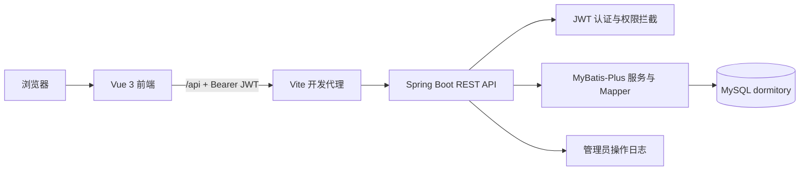
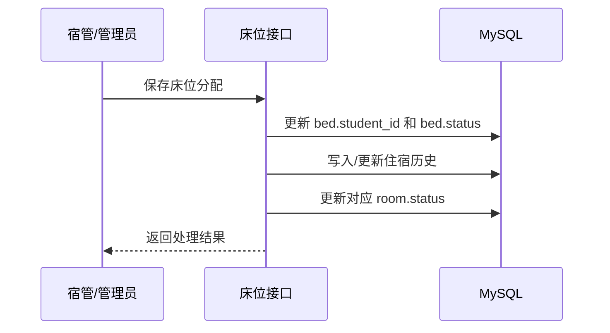
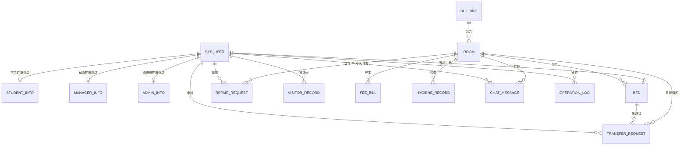

# 学生宿舍管理系统技术与设计说明

> 文档依据当前项目 `Dorm-Sys` 的前后端代码、接口实现、实体映射和 SQL 脚本整理。内容反映当前实现状态，不将演示数据中的账号密码、哈希、JWT 密钥或数据库凭据写入文档。

## 1. 项目概述

### 1.1 项目名称

学生宿舍管理系统。

### 1.2 建设目标

系统面向学生、宿管员和管理员三类角色，围绕宿舍资源、学生入住、报修、访客、水电费、卫生检查、调宿、公告、聊天和运营数据进行统一管理。系统重点解决床位资源状态与学生住宿信息同步、不同角色数据隔离、流程记录可追溯等问题。

### 1.3 系统边界

- 学生端：查询个人宿舍信息，提交或跟踪业务申请，与室友聊天。
- 宿管端：在自己负责的楼栋范围内办理入住、报修、访客、卫生、晚归、物品、调宿、费用等日常事务。
- 管理端：维护用户、楼栋、房间和床位资源，管理公告、查看操作日志和统计报表。
- 系统中的“智能问答”为本地规则知识问答；“智能通话”为通话预约记录管理，不包含真实音视频通话能力。

## 2. 总体架构



### 2.1 分层设计

| 层级 | 实现 | 职责 |
|---|---|---|
| 展示层 | Vue 单文件组件、Element Plus、Lucide 图标 | 三端页面、表单、表格、看板和交互反馈 |
| 状态与路由层 | Pinia、Pinia 持久化、Vue Router | 登录态、用户信息、角色路由和页面访问控制 |
| 通信层 | Axios | 统一发起 REST 请求，携带 JWT 并处理认证失效 |
| 接口层 | Spring MVC Controller | 接收请求、参数校验、角色与数据范围控制 |
| 业务层 | Spring Service、事务 | 床位分配、调宿同步、批量建房、统计聚合等 |
| 数据访问层 | MyBatis-Plus Mapper | 实体与 MySQL 表映射、查询和持久化 |
| 横切层 | JWT 拦截器、操作审计拦截器 | 身份认证、授权、管理员变更审计 |

## 3. 技术栈

### 3.1 前端

| 类别 | 技术 | 当前版本/用途 |
|---|---|---|
| 框架 | Vue | 3.5.39，组件化页面开发 |
| 构建工具 | Vite | 8.1.1，开发服务器和生产构建 |
| 路由 | Vue Router | 5.1.0，按角色划分学生、宿管、管理员路由 |
| 状态管理 | Pinia | 3.0.4，保存登录用户和界面状态 |
| 状态持久化 | pinia-plugin-persistedstate | 4.7.1，持久化部分前端状态 |
| UI 组件库 | Element Plus | 2.14.2，表单、对话框、表格、消息提示等 |
| 图标 | Lucide Vue | 1.24.0，导航和操作图标 |
| HTTP 客户端 | Axios | 1.18.1，调用后端 REST API |
| 端到端测试 | Playwright | 1.61.1，前端关键流程验证 |

### 3.2 后端

| 类别 | 技术 | 当前版本/用途 |
|---|---|---|
| 语言与运行时 | Java | 17 |
| 框架 | Spring Boot | 3.3.0 |
| Web 层 | Spring MVC | REST Controller、拦截器、JSON 响应 |
| ORM | MyBatis-Plus | 3.5.5，实体、Mapper 与 Service 层 |
| 数据库 | MySQL | 业务数据持久化，默认数据库名为 `dormitory` |
| 身份认证 | JJWT | 0.12.3，签发和解析 JWT |
| 密码编码 | BCrypt | `spring-security-crypto` |
| 简化开发 | Lombok | Getter、Setter、构造器等 |
| 测试 | Spring Boot Test、JUnit | 后端接口与业务测试 |
| 构建工具 | Maven Wrapper | 后端依赖、编译、测试和运行 |

### 3.3 开发与部署配置

| 项目 | 当前配置 |
|---|---|
| 后端端口 | `8088` |
| 前端开发服务器 | Vite 默认端口，当前开发环境通常为 `5173` |
| API 代理 | 前端 `/api` 代理至 `http://127.0.0.1:8088` |
| 字符集 | 数据库使用 UTF-8/utf8mb4 配置 |
| JWT 有效期 | 24 小时 |
| 返回结构 | `code`、`message`、`data` |

## 4. 角色与权限模型

### 4.1 角色定义

| 角色值 | 角色名称 | 核心范围 |
|---|---|---|
| `student` | 学生 | 仅访问本人住宿、申请、费用、访客、反馈及同寝聊天数据 |
| `dormmanager` | 宿管员 | 仅管理自己负责楼栋及其房间、床位、学生对应的业务数据 |
| `admin` | 管理员 | 全局资源、用户、公告、日志、数据报表和业务监控 |

### 4.2 认证与授权流程

1. 用户在登录页面选择身份并提交账号、密码。
2. 后端校验账号状态、角色和 BCrypt 密码哈希，签发 JWT。
3. 前端后续请求在 `Authorization: Bearer <token>` 中携带令牌。
4. `JwtAuthInterceptor` 解析令牌，将当前用户 ID、账号和角色写入请求上下文。
5. 拦截器拒绝无令牌、过期令牌、学生越权资源操作和非管理员访问管理员专属接口。
6. 宿管数据范围由 `DormManagerScopeService` 根据 `manager_info.building_id` 限制到负责楼栋。
7. 管理员的 POST、PUT、DELETE 请求完成后由审计拦截器记录到 `operation_log`。

### 4.3 权限控制说明

- 学生不可创建或修改楼栋、房间、床位、全局费用等宿舍资源。
- 学生不可读取用户列表、床位管理列表、全楼栋分布和管理员统计数据。
- 宿管只能查看和处理其所负责楼栋内学生、房间和业务记录。
- 管理员报表和操作日志接口仅管理员可访问。
- 聊天接口限制为当前寝室：私聊双方必须同寝，群聊仅限本寝室。

## 5. 功能设计

### 5.1 公共功能

| 功能 | 说明 |
|---|---|
| 登录认证 | 根据学生、宿管员、管理员角色登录，返回 JWT 和用户资料 |
| 顶部消息提醒 | 聚合新公告和室友聊天消息，支持查看提醒内容 |
| 页面刷新反馈 | 顶部刷新操作提供重新加载的交互反馈 |
| 主题/个人菜单 | 顶部提供主题切换、通知入口和用户菜单 |
| 个人资料 | 用户可维护个人基础信息；后端对密码字段进行保护处理 |

### 5.2 学生端功能

| 模块 | 已实现功能 |
|---|---|
| 服务台 | 展示个人业务概览、待办和快捷入口 |
| 我的宿舍 | 查询当前楼栋、房间、床位、室友、床位布局、设施运行状态和卫生月度指标 |
| 室友聊天 | 发起同寝室私聊、查看历史会话、寝室群聊、消息通知；聊天记录持久化 |
| 报修申请 | 提交报修类型、问题描述和图片信息，查看处理进度 |
| 费用查询 | 查询本人房间的水费、电费账单和缴费状态 |
| 校园公告 | 查看管理员已发布公告；草稿不对学生可见 |
| 访客预约 | 提交来访人、联系方式、关系和来访时间，跟踪审批/离开状态 |
| 调宿申请 | 读取当前床位，提交目标房间和调宿原因，查询审核结果 |
| 智慧辅导 | 对门禁、晚归、调宿、报修、费用、访客、用电等常见问题进行本地规则问答 |
| 智能通话 | 提交通话/沟通预约并查看处理状态，不提供真实音视频通话 |
| 意见反馈 | 提交意见、查看回复与处理状态 |
| 账户设置 | 管理个人资料与账户界面设置 |

### 5.3 宿管端功能

| 模块 | 已实现功能 |
|---|---|
| 工作台 | 汇总本楼栋在住人数、待处理事务和业务提示 |
| 入住管理 | 查询在住学生，分配或调整床位，联动房间与床位状态 |
| 水电计费 | 查询、录入、修改、删除本管理范围内房间费用账单 |
| 报修处理 | 查看本楼栋报修，更新处理人和状态 |
| 访客登记 | 审核访客预约、记录离开状态 |
| 卫生检查 | 为房间录入卫生分数、评语和检查日期 |
| 晚归登记 | 记录学生、房间、原因、返寝时间和处理状态 |
| 物品出入 | 维护遗失、补领或出入物品记录 |
| 调宿审批 | 查看负责楼栋内申请，指定目标房间并审批或拒绝 |
| 消息通知 | 管理公告等通用业务记录并处理相关消息 |
| 智能通话 | 处理学生发起的沟通预约记录 |
| 意见反馈 | 查看和回复学生反馈 |
| 个人中心 | 查看并维护宿管个人信息 |

> 已删除宿管端“AI 巡查”入口及相关页面，不再将其作为系统功能。

### 5.4 管理端功能

| 模块 | 已实现功能 |
|---|---|
| 管理概览 | 查看系统统计、告警和资源使用概览 |
| 用户管理 | 创建、编辑、启用/停用、删除学生/宿管/管理员账户；维护角色附属信息 |
| 权限角色 | 基于三类固定角色进行账户角色分配和展示 |
| 楼栋资源 | 维护楼栋名称、类型、楼层、负责人、位置和启用状态；展示入住比例和状态分布 |
| 房间管理 | 维护房间容量、楼层、状态；显示已住/总床位进度；支持批量创建房间并自动生成床位 |
| 床位资源 | 通过房间和入住管理维护床位占用、空闲、损坏等状态 |
| 报修监控 | 跨楼栋查看报修申请与当前处理状态 |
| 公告管理 | 创建草稿、发布公告、编辑、删除；学生端仅接收已发布的脱敏公告数据 |
| 操作日志 | 查询管理员增删改操作，按模块、动作、结果、操作人和时间追溯 |
| 数据报表 | 输出楼栋、房间、床位和报修的实时聚合数据，并支持 CSV 导出 |

## 6. 关键业务流程

### 6.1 入住与床位分配



- 新建房间时，根据 `capacity` 自动创建对应数量的空闲床位。
- 床位状态使用 `EMPTY`、`OCCUPIED`、`BROKEN`。
- 房间状态使用 `NORMAL`、`FULL`、`MAINTENANCE`，满员时更新为 `FULL`。

### 6.2 调宿审批与同步

1. 学生提交调宿申请，系统绑定当前登录学生并设置为 `PENDING`。
2. 宿管只能处理负责楼栋内学生的申请，目标房间也必须位于其负责范围。
3. 审批为 `APPROVED` 时，系统在事务中校验目标房间是否有空床。
4. 系统释放原床位，将学生分配到目标床位，并释放该学生可能存在的其他重复床位。
5. 系统重新计算原房间和目标房间状态，因此“我的宿舍”、服务台和资源管理读取数据库后保持一致。

### 6.3 批量创建房间

1. 管理员选择楼栋、起止楼层、每层房间数、起始序号和容量。
2. 后端校验楼层范围、房间序号、容量和单次最大 500 间限制。
3. 生成如 `101`、`102` 的房间号，并检查同楼栋房间号冲突。
4. 使用事务批量插入房间，同时为每个房间生成 `capacity` 个空闲床位。
5. 任一步失败将回滚，避免出现有房间无床位的中间状态。

### 6.4 聊天与提醒

- 私聊：发送方和接收方都必须有床位，且属于同一房间。
- 群聊：系统自动绑定当前用户所在房间，不允许跨房间群聊。
- 会话列表：按最后一条消息倒序返回当前用户已发起或参与的私聊。
- 通知：返回发给当前用户的私聊消息及当前寝室其他成员发送的群消息。
- 历史记录：私聊和群聊各最多查询最近 200 条，通知最多查询最近 30 条。

### 6.5 公告与审计

- 公告保存于通用业务记录表，类型为 `admin_notice`。
- 公告状态包含 `草稿` 和 `已发布`；学生查询仅返回已发布记录及必要展示字段。
- 管理员对用户、资源、公告、报修等模块发起 POST、PUT、DELETE 后，系统写入操作日志。
- 日志只记录动作、模块、路径、结果和摘要，不记录密码、令牌或完整请求体。

## 7. 接口设计

### 7.1 统一约定

| 项目 | 约定 |
|---|---|
| 根路径 | `/api` |
| 认证 | 除 `/api/auth/login` 外均要求 `Authorization: Bearer <JWT>` |
| 响应 | `Result<T>`：`code`、`message`、`data` |
| 常见状态码 | `200` 成功，`400` 参数/业务错误，`401` 未登录或令牌失效，`403` 无权限 |
| 数据格式 | JSON |

### 7.2 接口域清单

| 接口域 | 基础路径 | 主要能力 |
|---|---|---|
| 认证 | `/api/auth` | 登录 |
| 用户 | `/api/user` | 用户列表、未分配学生、保存、删除 |
| 楼栋 | `/api/building` | 楼栋列表、详情、保存、删除 |
| 房间 | `/api/room` | 房间列表、详情、保存、批量创建、删除 |
| 床位 | `/api/bed` | 床位列表、详情、保存、删除 |
| 仪表盘 | `/api/dashboard` | 全局统计、告警、学生概览、楼栋分布、个人宿舍数据 |
| 报修 | `/api/repairRequest` | 报修查询、详情、提交/更新、删除 |
| 费用 | `/api/feeBill` | 账单查询、详情、保存、删除 |
| 访客 | `/api/visitorRecord` | 预约查询、详情、保存、删除 |
| 调宿 | `/api/transferRequest` | 申请查询、详情、提交/审批、删除 |
| 卫生 | `/api/hygieneRecord` | 卫生记录查询、详情、保存、删除 |
| 晚归 | `/api/lateReturnRecord` | 晚归记录查询、添加、更新、删除 |
| 物品 | `/api/itemRecord` | 物品记录查询、添加、更新、删除 |
| 住宿历史 | `/api/stayHistory` | 历史住宿记录和当前住宿查询 |
| 通话预约 | `/api/callRecord` | 预约记录查询、保存、删除 |
| 业务记录 | `/api/businessRecord` | 公告、反馈等通用业务记录查询、保存、删除 |
| 聊天 | `/api/chat` | 发送消息、私聊历史、会话列表、通知、群聊历史 |
| 规则问答 | `/api/ai` | 常见宿舍问题的规则式回答 |
| 操作日志 | `/api/operationLog` | 管理员操作日志列表 |
| 管理报表 | `/api/admin/report` | 实时汇总报表数据 |

## 8. 数据库设计

### 8.1 数据库与命名约定

- 数据库：MySQL，默认库名 `dormitory`。
- 主键：`bigint` 自增 ID。
- 时间字段：通常使用 `create_time`、`update_time`。
- ORM：MyBatis-Plus 根据下划线与驼峰规则映射字段。
- 关系：当前脚本主要通过逻辑外键 ID 关联，没有在所有表上声明 MySQL 外键约束。

### 8.2 ER 关系概览



### 8.3 核心资源与用户表

| 表名 | 主要字段 | 说明 |
|---|---|---|
| `sys_user` | `id`、`username`、`password`、`role`、`name`、`gender`、`avatar`、`email`、`phone`、`class_name`、`major`、`enabled`、时间字段 | 统一账户表，角色为学生、宿管、管理员；密码保存 BCrypt 哈希 |
| `student_info` | `id`、`user_id`、`class_name`、`major`、`enrollment_year` | 学生扩展信息 |
| `manager_info` | `id`、`user_id`、`employee_no`、`building_id` | 宿管工号及其负责楼栋，是宿管数据范围依据 |
| `admin_info` | `id`、`user_id`、`department` | 管理员部门信息 |
| `building` | `id`、`name`、`type`、`floors`、`manager`、`location`、`active`、`total_rooms`、`occupied_rooms`、`free_rooms`、时间字段 | 楼栋资源和概览统计字段 |
| `room` | `id`、`building_id`、`room_number`、`floor`、`capacity`、`status`、时间字段 | 房间资源；响应中可附加 `building_name`、`occupied` 计算字段 |
| `bed` | `id`、`room_id`、`bed_number`、`status`、`student_id`、时间字段 | 床位资源，`student_name` 为响应展示计算字段 |
| `stay_history` | `id`、`student_id`、`bed_id`、`check_in_date`、`check_out_date`、时间字段 | 学生入住和离宿历史 |

### 8.4 申请、服务与日常管理表

| 表名 | 主要字段 | 说明 |
|---|---|---|
| `repair_request` | `id`、`submitter_id`、`room_id`、`type`、`description`、`images`、`status`、`handler_id`、时间字段 | 报修申请；可附加提交人、房间、处理人名称 |
| `visitor_record` | `id`、`student_id`、`visitor_name`、`phone`、`relation`、`visit_time`、`leave_time`、`status`、时间字段 | 访客预约与进离记录 |
| `transfer_request` | `id`、`student_id`、`current_bed_id`、`target_room_id`、`reason`、`status`、时间字段 | 调宿申请；可附加学生、原床位、目标房间展示名称 |
| `fee_bill` | `id`、`room_id`、`type`、`amount`、`month`、`status`、时间字段 | 水费、电费账单；可附加房间号 |
| `hygiene_record` | `id`、`room_id`、`inspector_id`、`score`、`comment`、`check_date`、时间字段 | 卫生检查记录；可附加房间和检查人名称 |
| `late_return_record` | `id`、`student_id`、`student_name`、`room_number`、`reason`、`status`、`return_time`、时间字段 | 晚归登记 |
| `item_record` | `id`、`title`、`owner`、`description`、`status`、时间字段 | 物品出入、遗失或补领管理 |
| `call_record` | `id`、`student_id`、`topic`、`target_person`、`status`、时间字段 | 沟通/通话预约记录 |

### 8.5 沟通、通用业务与审计表

| 表名 | 主要字段 | 说明 |
|---|---|---|
| `chat_message` | `id`、`sender_id`、`receiver_id`、`room_id`、`type`、`content`、`create_time` | 聊天消息。`type` 为 `PRIVATE` 或 `GROUP`；发送人名称和头像为查询附加字段 |
| `business_record` | `id`、`type`、`title`、`owner`、`description`、`status`、`creator_id`、`reply`、`event_time`、时间字段 | 通用业务记录，当前承载公告、反馈等轻量业务场景 |
| `operation_log` | `id`、`operator_id`、`operator_name`、`module`、`action`、`path`、`result`、`summary`、`create_time` | 管理员变更操作审计日志 |
| `feedback` | `id`、`student_id`、`type`、`content`、`reply`、`status`、时间字段 | 旧版/独立意见反馈表，保留在初始 SQL 脚本中；当前通用反馈页面主要使用 `business_record` 设计 |

### 8.6 重要状态字段

| 业务对象 | 状态值 | 含义 |
|---|---|---|
| 床位 | `EMPTY`、`OCCUPIED`、`BROKEN` | 空闲、已占用、损坏 |
| 房间 | `NORMAL`、`FULL`、`MAINTENANCE` | 正常、满员、维修中 |
| 报修 | `PENDING`、`PROCESSING`、`COMPLETED` | 待处理、处理中、已完成 |
| 调宿 | `PENDING`、`APPROVED`、`REJECTED` | 待审批、已通过、已拒绝 |
| 访客 | `PENDING`、`APPROVED`、`LEFT` | 待审批、已通过、已离开 |
| 账单 | `UNPAID`、`PAID` | 未缴费、已缴费 |
| 通话预约 | `PENDING`、`ACCEPTED`、`FINISHED` | 待受理、已接受、已完成 |
| 公告 | `草稿`、`已发布` | 未公开、对学生公开 |

### 8.7 初始化与建表说明

- `backend/src/main/resources/schema.sql` 包含用户、楼栋、房间、床位、报修、访客、调宿、费用、卫生、通话和旧版反馈等核心表定义及演示数据。
- `business_record`、`operation_log` 由项目中的运行时初始化器补充创建。
- 当前 `application.yml` 中 `spring.sql.init.mode` 为 `never`，因此部署时不会自动执行 `schema.sql`；需要在 MySQL 中预先执行建表脚本或使用已有数据库。
- 实体中还映射了 `student_info`、`manager_info`、`admin_info`、`stay_history`、`chat_message`、`item_record`、`late_return_record` 等表。正式部署数据库必须包含这些表及其字段，以匹配实体映射。

## 9. 前端页面与路由设计

### 9.1 学生路由

`/student/desk`、`/student/dorm`、`/student/repair`、`/student/fees`、`/student/notice`、`/student/visitor`、`/student/transfer`、`/student/ai`、`/student/call`、`/student/feedback`、`/student/settings`。

### 9.2 宿管路由

`/manager/workbench`、`/manager/checkin`、`/manager/fee`、`/manager/repair`、`/manager/visitor`、`/manager/hygiene`、`/manager/transfer`、`/manager/late-return`、`/manager/items`、`/manager/messages`、`/manager/call`、`/manager/feedback`、`/manager/profile`。

### 9.3 管理员路由

`/admin/overview`、`/admin/users/list`、`/admin/users/roles`、`/admin/resources/buildings`、`/admin/resources/rooms`、`/admin/repairs/list`、`/admin/notices`、`/admin/operation-logs`、`/admin/reports`。

## 10. 数据一致性与安全设计

### 10.1 一致性设计

- 调宿审批使用事务，避免床位释放与目标床位占用只完成其中一半。
- 批量建房使用事务，确保房间和床位要么全部生成，要么全部回滚。
- 调宿完成后刷新原房间和目标房间状态，避免房间满员状态与实际床位占用不一致。
- “我的宿舍”、宿管入住管理和管理员资源看板均以数据库中的床位和房间数据作为来源。
- 报表采用楼栋、房间、床位和报修数据实时聚合，而不是维护独立的静态展示数据。

### 10.2 安全设计

- 密码使用 BCrypt 存储和验证，接口返回用户信息时隐藏密码字段。
- JWT 令牌认证，过期或无效令牌返回 401。
- 角色拦截与宿管楼栋范围校验共同限制越权。
- 学生公告接口只返回必要公开字段，不返回创建人、回复等管理字段。
- 操作日志不写入密码、令牌或完整请求体，且日志写入失败不阻塞原业务请求。

## 11. 测试与验证

| 范围 | 当前验证方式 |
|---|---|
| 后端 | Maven/Spring Boot Test，最近一次完整验证通过 50 个测试 |
| 前端构建 | `npm run build` |
| 前端端到端 | `npm run test:e2e`，最近一次关键流程验证通过 9 个用例 |
| 手工验收重点 | 登录、床位分配、调宿后宿舍同步、批量建房、公告提醒、聊天、管理员报表与日志 |

## 12. 本地运行方式

### 12.1 前置条件

- JDK 17。
- Maven Wrapper 可用。
- Node.js 与 npm。
- MySQL 服务已启动，并准备好与实体映射相匹配的数据库表。

### 12.2 启动后端

```powershell
cd F:\bishe\Antigravity\Dorm-Sys\backend
.\mvnw.cmd spring-boot:run
```

后端地址：`http://127.0.0.1:8088`。

### 12.3 启动前端

```powershell
cd F:\bishe\Antigravity\Dorm-Sys\frontend
npm install
npm run dev
```

前端开发地址通常为：`http://127.0.0.1:5173`。

### 12.4 构建与测试

```powershell
# 后端
cd F:\bishe\Antigravity\Dorm-Sys\backend
.\mvnw.cmd test

# 前端
cd F:\bishe\Antigravity\Dorm-Sys\frontend
npm run build
npm run test:e2e
```

## 13. 当前实现限制与后续演进建议

### 13.1 当前限制

- 聊天基于 HTTP 接口拉取和持久化，不是 WebSocket 实时推送系统。
- 智慧辅导为固定规则和关键词匹配，不接入大模型或知识库检索。
- 智能通话仅管理预约记录，不具备音视频、录音或通话状态回调能力。
- 报表导出当前以 CSV 为主，未实现正式 Excel 模板导出。
- 初始 SQL 脚本与实体映射表并非完全同一来源，部署时应补齐全部实体对应表并通过版本化迁移统一管理。
- 管理员操作日志覆盖管理员变更请求，未覆盖全部读取、登录及所有角色的行为审计。

### 13.2 建议的后续演进方向

1. 使用 Flyway 或 Liquibase 管理数据库版本，合并并规范所有表结构。
2. 使用 WebSocket/SSE 实现聊天和公告的真正实时消息推送与已读状态。
3. 增加文件上传服务，替代报修图片仅保存字符串链接的方式。
4. 对报修、访客、调宿增加更完整的流转记录、处理意见和时间线。
5. 增加管理员数据导入导出、异常床位检测和可配置的角色权限点。
6. 若确有业务需求，再接入可审计的知识库问答或第三方音视频服务。

## 14. 答辩可概括的技术亮点

- 三角色系统与宿管楼栋范围控制，实现了角色权限和数据范围双层隔离。
- 以床位为住宿事实来源，调宿审批通过事务同步床位、房间状态和学生宿舍展示。
- 管理端支持批量创建房间并自动生成床位，降低资源初始化成本。
- 聊天仅对同寝室成员开放，减少跨宿舍信息暴露。
- 管理员公告采用草稿/发布状态隔离，学生端仅获取公开字段。
- 管理员关键变更自动形成审计日志，报表直接根据业务数据实时聚合。
