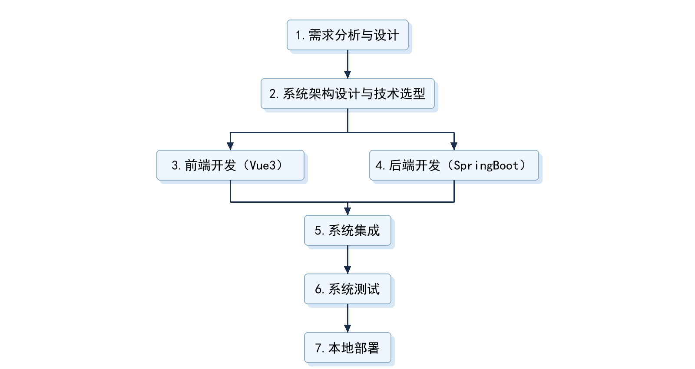
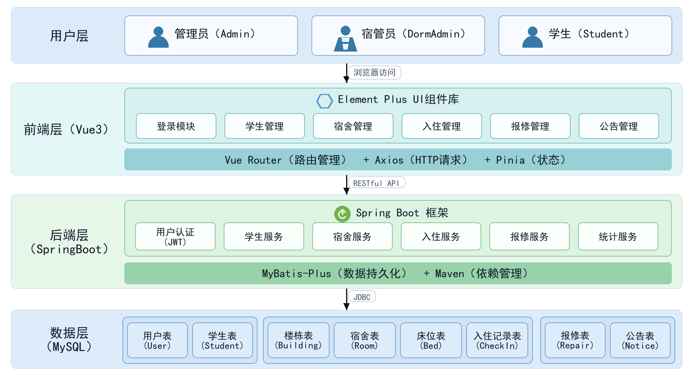

# 毕业论文（设计）开题报告

**题    目** 基于SpringBoot+Vue的学生宿舍管理系统

**学    院** 计算机学院

**专    业** 人工智能　　**年级** 2023级

**学生姓名** 孙乾云

**学    号** 

**指导教师** 

教务处制表
年    月    日

---

## 选题意义

高校宿舍管理涉及学生、楼栋、宿舍、床位、班级、入住状态等多类信息。目前很多学校还在用纸质登记或Excel表格管理，容易出现数据重复、更新滞后、查询慢等问题。开发一套基于SpringBoot和Vue的宿舍管理系统，可以让管理员在一个平台上维护学生和宿舍信息，处理入住分配、调宿和报修。

系统把"学生-楼栋-房间-床位"的对应关系数字化，改变了以前信息分散的局面。管理员可以通过系统分配宿舍、查看报修进度。学生可以在线申请调宿、提交报修。宿管能实时看到床位空置率和报修情况。这些功能减少了手工统计的错误，也让后勤部门在规划时有数据参考。

---

## 国内外研究现状概述

### 1. 国内研究现状

国内在宿舍管理系统开发方面积累了较多经验，研究覆盖了技术架构、功能设计和实际应用等多个维度。

在理论研究层面，蒋晟和陈科基于Spring Boot设计并实现了学生宿舍管理系统，为高校宿舍管理信息化提供了技术参考[1]。唐斌斌和叶奕深入研究了Vue.js在前端开发中的性能影响，为前端技术选型提供了数据支持[2]。肖文娟和王加胜基于Vue和Spring Boot开发了校园记录管理Web App，展示了该技术栈在教育管理中的应用潜力[3]。王永和等人对Spring Boot的研究和应用进行了系统性的阐述，为其在各类管理系统中的广泛应用奠定了理论基础[4]。

在技术应用层面，王明维和吴燕燕基于NFC和微信小程序设计了学生宿舍门禁系统，为宿舍安全管理提供了新的技术方案[5]。赵佳慧基于个性化搜索推荐设计了技术论坛系统，为宿舍管理中的信息检索与推荐功能提供了思路[6]。孙洪盼基于Spring Boot和Vue设计的友为交流社区，展示了前后端分离架构在复杂业务系统中的优势[7]。

在系统架构方面，段岩对智慧宿舍管理系统在高校学生安全管理中的优化路径进行了研究，为系统的安全管理功能设计提供了思路[8]。郭慧敏等人基于Spring Boot和微信小程序开发了自习室座位预约系统，为宿舍相关资源的预约管理提供了参考[9]。李淼淼等基于Spring Boot和Vue 3开发的移动学习管理系统，进一步验证了该技术栈在教育信息化领域的适用性[10]。

此外，杨永亮和梁甜甜对学生宿舍管理系统进行了系统性研究，为宿舍管理信息化的发展提供了理论依据[11]。刘华明等人设计的高校宿舍管理系统从实践角度验证了信息化管理在提升宿舍管理效率方面的作用[12]。

总体来看，现有的研究在理论探讨、系统开发和新技术应用方面取得了显著的进展，但是仍然存在一些明显的不足：理论研究与实际的业务需求脱节；系统功能侧重于单向展示，缺乏协同互动；技术方案的通用性较强，但是行业针对性较弱。特别是在满足高校宿舍日常运营的全流程管理需求方面，尚未形成完整的解决方案。这是本研究需要解决的核心问题。

### 2. 国外研究现状

国外在宿舍管理系统开发方面积累了较多经验，研究覆盖了技术架构、功能设计和用户交互等多个维度。

在技术架构层面，SpringBoot在国外得到了广泛应用。Feng Shen等人开发了基于SpringBoot+Vue的便捷会计系统[13]，Dixit Saxena等人设计了基于SpringBoot的校园招聘管理系统[14]，Lei Sushan等人构建了基于SpringBoot的智能自动编辑系统[15]。这些研究表明SpringBoot框架在各类管理系统中具有良好的适用性。Xu Yihan等人开发了基于SpringBoot的程序员测试和问答APP[16]，Li Ling等人设计了基于SpringBoot的在线教育系统[17]，进一步验证了该框架在教育领域的应用价值。

在宿舍管理系统专项研究方面，Geng Xiaochen等人探讨了模块化接口设计在学生宿舍管理系统中的应用[18]，Sharmikhhasree等人开发了宿舍管理系统[19]。Yang Chu-Ying等人设计了基于物联网技术的高中宿舍管理系统[20]，将IoT技术引入宿舍管理场景。Jigar Ashraf Bano等人开发了IM系统，作为学术机构宿舍管理的移动应用[21]，展示了即时通讯技术在宿舍管理中的应用可能。

在系统架构和用户体验方面，Zhang Xiaobo等人提出了基于敏捷开发架构的大学宿舍管理系统[22]，Yang Mengshi等人从用户中心角度研究了宿舍管理员界面改进[23]，Xiang Xuefeng等人探讨了基于大数据的大学生宿舍精准管理[24]。这些研究在系统架构设计、用户体验优化和数据驱动管理方面提供了有价值的参考。

总体来看，国外研究在SpringBoot技术应用、系统架构设计和新技术融合方面取得了进展，但多数研究侧重于技术实现或单一功能模块，针对高校宿舍全流程管理的完整解决方案仍然有限。这也为本研究提供了借鉴方向。

---

## 主要研究内容

本毕业设计旨在构建一个面向高校学生宿舍管理的信息化平台。主要研究工作包括以下几个方面：

### 1. 现有系统与软件分析

通过对传统宿舍管理模式的调研，分析现有系统在学生信息维护、宿舍资源分配、入住调整、报修处理等方面的不足，明确本系统在多角色权限分离、宿舍资源动态管理、数据可视化统计、报修流程跟踪等方面的创新点与改进方向。

### 2. 相关的关键技术研究

本系统将SpringBoot+Vue的前后端分离架构作为核心架构。Vue3负责前端页面渲染和用户交互，通过Axios向后端发起请求。SpringBoot处理业务逻辑和数据存储，通过RESTful API向前端返回JSON数据。

选择这套技术栈的原因：SpringBoot简化了Java项目的配置和部署，Vue3的组件化开发提高了前端代码复用率。两者配合可以快速完成功能开发，也方便后期维护和扩展。系统还将集成数据可视化服务，实现床位使用率、报修统计等关键数据的图表化展示。

### 3. 系统主要功能模块研究

系统将围绕三类用户角色（管理员、宿舍管理员、学生）构建以下核心功能模块：

#### ① 管理员模块
涵盖用户账号管理与角色权限分配，楼栋信息维护（包括楼栋名称、楼层数、房间数等），宿舍房间管理（包括房间号、床位数、房间状态等），入住分配与退宿处理，报修记录查看与处理，系统公告发布与管理，床位空置率与报修统计等数据可视化看板，实现宿舍管理业务的全面管控。

#### ② 宿舍管理员模块
支持所负责楼栋的宿舍信息管理，学生入住与退宿处理，本楼栋报修记录查看与处理，系统公告查看，所负责楼栋的统计数据查看等功能，聚焦于楼栋级别的日常管理事务。

#### ③ 学生模块
包括个人信息查看与修改，宿舍分配信息查看，报修申请提交与进度跟踪，系统公告查看，调宿申请提交等功能，为学生提供便捷的宿舍服务渠道。

### 4. 系统开发工具选择与环境构建

本项目采用Java作为核心编程语言，构建一个标准的前后端分离技术栈。

① 开发工具：使用IntelliJ IDEA进行后端开发，使用VS Code进行前端开发。

② 开发环境：后端基于JDK 17、Maven、SpringBoot框架搭建；前端基于Node.js环境与Vue3框架构建。

③ 数据库系统：采用MySQL作为核心关系型数据库，用于持久化存储业务数据。

### 5. 系统数据库建立

根据系统功能需求，设计并构建包括用户表、楼栋表、宿舍表、床位表、入住记录表、报修表、公告表等在内的多表关系数据库结构，明确字段定义、主外键约束与数据校验规则，确保数据一致性与查询效率。

### 6. 系统客户端软件开发

① 基于Vue3及Element Plus组件库实现响应式前端界面，支持多角色登录与动态权限控制。

② 实现学生信息管理、宿舍资源管理、入住分配、报修申请、数据统计可视化等核心业务的交互功能。

③ 实现表单数据校验、表格分页展示、弹窗编辑、图表统计等用户体验功能。

### 7. 系统服务器端软件开发

① 使用SpringBoot构建RESTful API，提供用户认证、数据管理、报修处理等服务接口。

② 实现入住分配逻辑、床位冲突校验、报修流程处理、角色权限校验等核心业务逻辑。

③ 使用MyBatis-Plus实现数据持久化操作，封装通用的数据访问方法。

### 8. 系统集成和测试

① 完成前后端数据接口联调，确保系统功能完整性与数据一致性。

② 进行功能测试，验证学生管理、宿舍分配、入住调整、报修处理等核心业务流程的正确性。

③ 进行性能测试，检查系统在多用户并发访问下的响应速度与稳定性。

---

## 拟采用的研究思路（方法、技术路线、可行性论证等）

在本研究中，将遵循软件工程的基本流程，设计并实现一个面向高校学生宿舍管理的信息化平台。研究初期采用文献研究法，系统梳理宿舍管理信息化领域的技术方案与功能设计，为系统构建提供理论依据。

系统采用前后端分离架构，通过数字化手段整合学生信息管理、宿舍资源分配、入住调整与报修处理等核心业务环节，构建多角色协同的线上管理平台。前端采用Vue3框架构建用户界面，其响应式数据绑定与组件化开发模式能够实现动态交互体验。在学生信息查询、宿舍状态更新、报修进度跟踪等场景中，Vue3可确保界面流畅操作与数据即时同步，同时保持代码的良好可维护性。

后端采用SpringBoot框架，该框架具备开箱即用、配置简便的特点，可快速搭建稳定的服务环境。SpringBoot强大的集成能力便于统一管理用户认证、数据管理、报修流程等核心模块，其内嵌服务器机制也简化了部署流程，有效保障了后端服务的稳定性和扩展性。

系统通过明确定义的RESTful接口实现前后端数据通信，确保业务逻辑与用户界面有效分离。数据库选用成熟的MySQL关系型数据库，为系统提供安全可靠的数据存储方案。

系统开发完成后，将采用对比验证法，将本系统的宿舍管理、报修处理等核心功能与传统管理模式进行对比，从操作效率、信息准确性和服务体验等维度验证系统的实际应用价值。

在可行性方面，Vue3与SpringBoot作为业界主流框架，拥有完善的技术文档和社区支持。本人通过专业学习已掌握相关开发技能，结合学院提供的实验环境和指导教师的技术支持，项目具备充分实施条件。总体而言，本系统方案目标明确、技术路线可行、实施风险可控。

图1展示了本系统开发与部署流程的七个主要阶段：首先进行需求分析与设计，明确系统功能与数据模型；随后完成系统架构设计与技术选型，确定采用SpringBoot+Vue的前后端分离方案。
在此基础上，前后端开始并行开发，各自实现相应功能模块；开发完成后进行系统集成，将前后端对接联调；接着开展系统测试，验证功能完整性与稳定性。
最后，在本地环境完成系统部署，为毕业答辩提供可运行的演示版本。该流程环环相扣，确保了项目从设计到实现的顺利推进。

图2展示了本系统采用的分层架构设计，整体分为四个主要部分：用户通过浏览器访问系统，根据身份权限进入不同界面。前端基于Vue3框架开发，通过响应式组件实现动态交互，利用路由导航进行页面切换，并通过API调用与后端通信。
后端采用SpringBoot框架，按业务领域划分为六个核心模块：用户认证、学生管理、宿舍管理、入住管理、报修处理及数据统计，各模块职责明确，协同处理业务逻辑。
系统使用MySQL数据库进行数据持久化存储。该架构实现了前后端分离，保证了系统的可维护性和扩展性。

---

## 研究工作安排及进度

| 时间 | 计划 |
|------|------|
| 2026年7月10日前 | 下达毕业论文（设计）任务书，梳理论文题目、研究框架与思路，形成文字化成果 |
| 2026年7月31日前 | 查阅文献，明确系统背景、技术路线和功能需求，完成开题报告 |
| 2026年8月1日至2027年3月7日 | 开展需求分析、数据库设计、前后端功能开发、系统联调，撰写论文初稿 |
| 2027年3月8日至2027年3月12日 | 完成中期检查，提交阶段性成果，汇报进度及后续计划 |
| 2027年3月13日至2027年4月23日 | 完善系统功能及测试，修改定稿毕业论文，提交终稿 |
| 2027年4月24日至2027年5月6日 | 根据评阅意见修改论文格式、内容及系统材料 |
| 2027年5月7日至2027年5月18日 | 准备并参加毕业论文答辩，完成PPT及演示材料 |
| 2027年5月20日前 | 按要求整理、归档毕业论文及系统相关材料，配合校内抽检 |

---

## 参考文献目录

[1] 蒋晟,陈科.基于SpringBoot的学生宿舍管理系统的设计与实现[J].现代信息科技,2021,5(12):6-9.DOI:10.19850/j.cnki.2096-4706.2021.12.002.

[2] 唐斌斌,叶奕.Vue.js在前端开发应用中的性能影响研究[J].电子制作,2020,(10):49-50+59.DOI:10.16589/j.cnki.cn11-3571/tn.2020.10.020.

[3] 肖文娟,王加胜. 基于Vue和Spring Boot的校园记录管理Web App的设计与实现[J]. 计算机应用与软件,2020,37(4):25-30,88. DOI:10.3969/j.issn.1000-386x.2020.04.005.

[4] 王永和,张劲松,邓安明,等. Spring Boot研究和应用[J]. 信息通信,2016(10):91-94. DOI:10.3969/j.issn.1673-1131.2016.10.045.

[5] 王明维,吴燕燕.基于NFC和微信小程序的学生宿舍门禁系统[J].新型工业化,2020,10(7):115-116+121.DOI:10.19335/j.cnki.2095-6649.2020.07.043.

[6] 赵佳慧.基于个性化搜索推荐的技术论坛的设计与实现[D].吉林大学,2021.DOI:10.27162/d.cnki.gjlin.2021.001451.

[7] 孙洪盼.基于SpringBoot和Vue的友为交流社区的设计与实现[D].重庆大学,2022.DOI:10.27670/d.cnki.gcqdu.2022.001430.

[8] 段岩.智慧宿舍管理系统在高校学生安全管理中的优化路径[J].办公自动化,2025,30(22):55-57.

[9] 郭慧敏,谭伟,冉茂鑫,等.基于SpringBoot+微信小程序的自习室座位预约系统[J].电脑编程技巧与维护,2026,(5):38-40+65.DOI:10.16184/j.cnki.comprg.2026.05.005.

[10] 李淼淼,季节,李坡,等. 基于SpringBoot和Vue 3的移动学习管理系统的设计与实现[J]. 无线互联科技,2026,23(4):81-86. DOI:10.3969/j.issn.1672-6944.2026.04.017.

[11] 杨永亮,梁甜甜. 学生宿舍管理系统研究[J]. 硅谷,2009(22):35-36. DOI:10.3969/j.issn.1671-7597.2009.22.029.

[12] 刘华明,钱焕然,毕学慧,等. 高校宿舍管理系统的设计与实现[J]. 通化师范学院学报,2021,42(10):89-93. DOI:10.13877/j.cnki.cn22-1284.2021.10.014.

[13] FENG SHEN, NAN XIE, LEWEN CHEN, et al. Development of a Convenient Accounting System Based on SpringBoot+Vue[C]. //2025 Asia-Europe Conference on Cybersecurity,Internet of Things and Soft Computing,[v.1]. 2025:167-171.

[14] DIVYA DIXIT SAXENA, DHARMESH J. SHAH, VIKASH KUMAR SINGH, et al. Transforming Placement Workflow: Springboot Approach to Campus Recruitment Management[C]. //2025 International Conference on Next Generation Communication & Information Processing. 2025:909-913.

[15] SUSHAN LEI, XIAOCHUN DU, XUAN HE, et al. Intelligent Automatic Editing System Based on SpringBoot Framework - Helping Cultural Inheritance[C]. //2025 5th International Symposium on Computer Technology and Information Science. 2025:1148-1151.

[16] YIHAN XU, NAN XIE, DENGREN CHEN, et al. Development of Programmer Testing and Question Answering APP Based on SpringBoot[C]. //2024 IEEE 2nd International Conference on Sensors,Electronics and Computer Engineering. 2024:582-586.

[17] LING LI, LIN GUI. Design and Development of an Online Education System Based on SpringBoot[C]. //2024 3rd International Conference on Artificial Intelligence and Computer Information Technology. 2024:1-6.

[18] XIAOCHEN GENG, SHA LIU. Application of Modular Interface Design in Student Dormitory Management System[C]. //4th International Conference on Culture, Education and Economic Development of Modern Society: ICCESE 2020, Moscow, Russia, 13-14 March 2020, Part 1 of 2. :522-529.

[19] SHARMIKHASREE R, MEERA S, KAVYA K K, et al. Dormitory Management System[C]. //2023 Intelligent Computing and Control for Engineering and Business Systems: ICCEBS 2023, Chennai, India, 14-15 December 2023, [v.1]. 2023:1-5.

[20] CHU-YING YANG, YIN LU, XUAN LI, et al. Design of high school dormitory management system based on IoT technology[C]. //2021 13th International Conference on Wireless Communications and Signal Processing: WCSP 2021, Virtual Conference, 20-22 October 2021, [v.2]. 2021:1023-1027.

[21] ASHRAF BANO JIGAR, MUKESH CHINTA, SHAIK KAIF. IM System - A Mobile Application for Dormitory Management in Academic Institutes[C]. //2024 1st International Conference on Advances in Computing,Communication and Networking. 2024:1103-1108.

[22] ZHANG XIAOBO, HU YING, LU YUAN, et al. University Dormitory Management System Based on Agile Development Architecture[C]. //International Conference on Management and Service Science(2011年第五届管理与服务科学国际会议 MASS 2011)论文集. 2011:1-4.

[23] MENGSHI YANG, ZHIWEN DENG, YIXIN ZHANG, et al. User-Centered Interface Improvements: An Example for Dormitory Administrators[C]. //Thematic Area on Human-Computer Interaction: Thematic Area, HCI 2024, Held as Part of the 26th HCI International Conference, HCII 2024, Washington, DC, USA, June 29 - July 4, 2024, Proceedings, Part IV. 2024:309-319.

[24] XUEFENG XIANG. Enhancing the Precision Management of University Student Dormitories Based on Big Data[C]. //2024 5th International Conference on Big Data & Artificial Intelligence & Software Engineering. 2024:11-14.

---

## 开题报告会议纪要

**时 间**

**地 点**

**主持人**

**参会教师**

| 姓 名 | 职务（职称） | 姓 名 | 职务（职称） |
|--------|--------------|--------|--------------|
|        |              |        |              |

**会议记录摘要**

记录人：

---

## 指导教师意见

签名：　　　　　　　　　　　　　　　　　　　　　年   月   日

---

备注：1、本开题报告除第3页各栏目外，其它栏目均由学生填写。2、填写各栏目时可根据内容另加附页。3、参加开题报告会议的教师不少于3人。