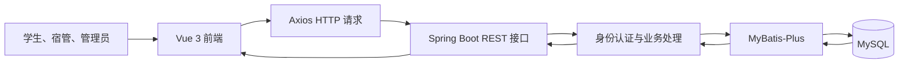
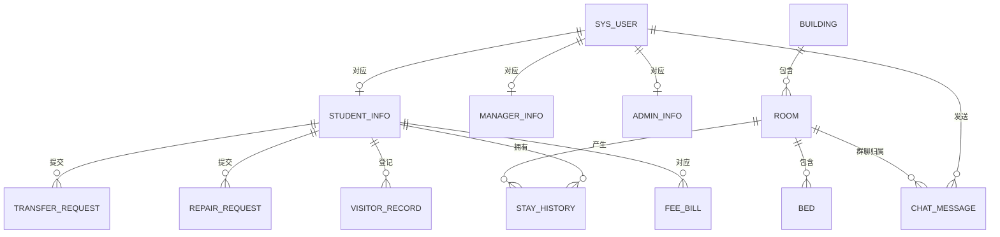
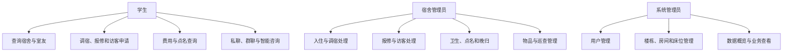
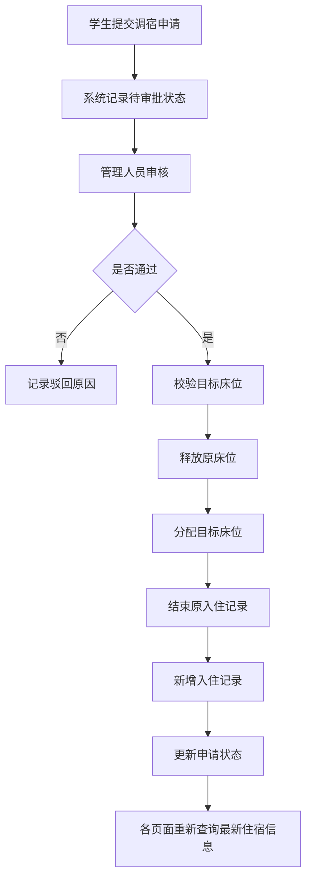
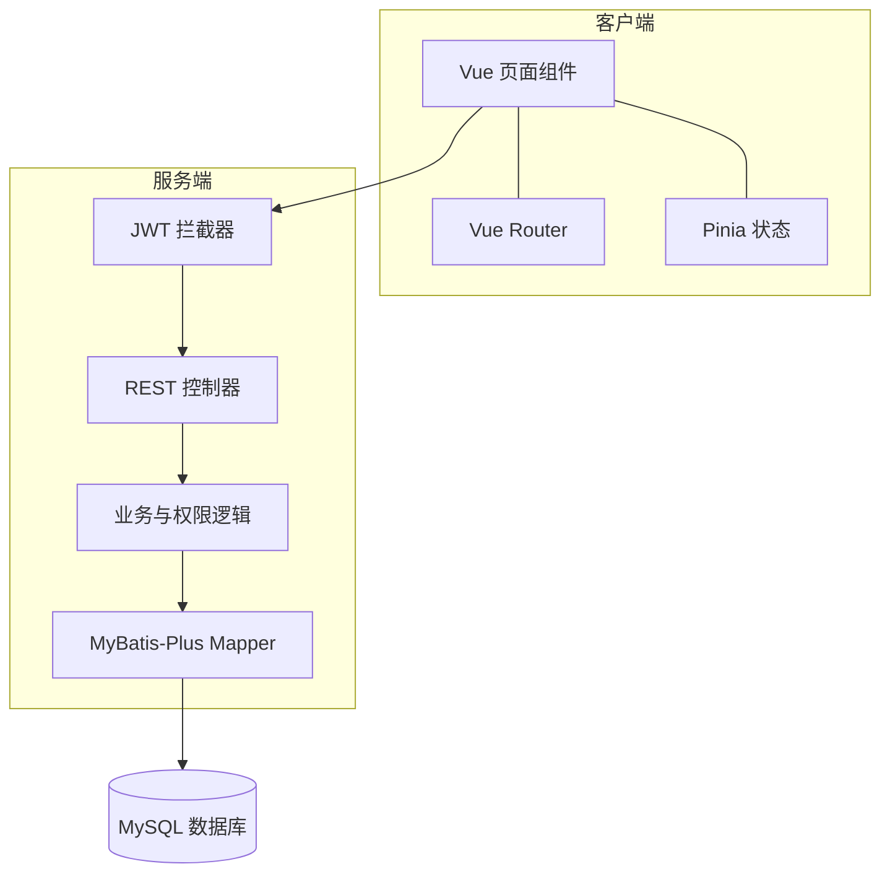
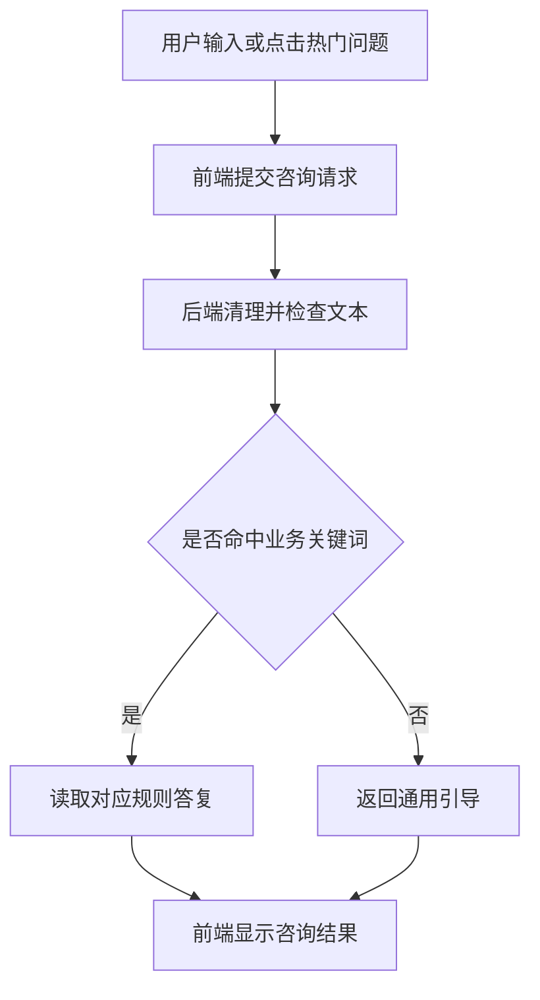

# 毕业论文（设计）

## 基于 Spring Boot 和 Vue 的学生宿舍管理系统设计与实现

**学院：** 计算机学院  
**专业：** 人工智能  
**年级：** 2023 级  
**学生姓名：** 孙乾云  
**学号：** 2305500257  
**指导教师：** 张炜佶  

> 初稿说明：本文按照计算机学院 2026 版应用开发型毕业论文模板组织。当前系统中的智能咨询功能采用业务规则和关键词匹配实现，没有训练机器学习模型，因此第 4 章据实调整为“智能咨询模块构建与验证”。该调整应在定稿前与指导教师确认。

---

# 摘要

随着高校在校生规模扩大，宿舍管理涉及的学生、楼栋、房间、床位和住宿业务数据不断增加。传统纸质登记和分散电子表格难以保证信息及时更新，容易出现重复录入、床位状态不一致、业务处理过程不透明等问题。针对上述问题，本文设计并实现了一套基于 Spring Boot 和 Vue 的学生宿舍管理系统。

系统采用前后端分离架构。前端基于 Vue 3、Vue Router、Pinia、Axios 和 Element Plus 构建，后端基于 Spring Boot 3、MyBatis-Plus 和 Java 17 开发，使用 MySQL 持久化业务数据，并通过 JWT 完成用户身份认证。系统按照学生、宿舍管理员和系统管理员三类角色划分功能：学生可以查询宿舍与室友信息、提交调宿和报修申请、登记访客、查询费用、参与私聊和宿舍群聊，并使用智能咨询服务；宿舍管理员可以处理入住、调宿、报修、访客、点名、卫生、晚归、物品和巡查业务；系统管理员可以维护用户、楼栋、房间和床位资源，并查看业务统计数据。

针对调宿后不同页面数据不同步的问题，系统以床位数据和入住历史为住宿信息来源，在审批通过时同步释放原床位、分配目标床位、结束原入住记录并建立新入住记录。针对业务越权风险，后端依据 JWT 中的用户身份限制学生只能访问本人业务，并校验私聊和宿舍群聊成员范围。测试结果表明，系统能够完成主要宿舍管理流程，角色权限、数据同步和核心接口符合预期。系统为高校宿舍日常管理提供了一个结构清晰、操作便捷且便于扩展的信息化实现方案。

**关键词：** 学生宿舍管理；Spring Boot；Vue；前后端分离；MySQL；JWT

---

# Abstract

With the growth of the student population in colleges and universities, dormitory management has to process an increasing amount of data concerning students, buildings, rooms, beds, and accommodation services. Traditional paper records and scattered spreadsheets cannot update information efficiently and may lead to repeated data entry, inconsistent bed status, and an opaque service process. To address these problems, this thesis designed and implemented a student dormitory management system based on Spring Boot and Vue.

The system adopted a front-end and back-end separation architecture. The front end was developed with Vue 3, Vue Router, Pinia, Axios, and Element Plus. The back end was implemented with Spring Boot 3, MyBatis-Plus, and Java 17. MySQL was used for persistent data storage, while JWT was used for identity authentication. The system provided different functions for students, dormitory managers, and system administrators. Students could view dormitory information, submit transfer and repair requests, register visitors, check bills, communicate with roommates, and use an intelligent consultation service. Dormitory managers could handle daily accommodation affairs, and system administrators could maintain users and dormitory resources.

To solve the inconsistency of accommodation data after a room transfer, the system updated the original bed, target bed, and stay history within the transfer process. Authorization checks were also implemented according to the identity stored in JWT. The test results showed that the system could complete its main workflows and that its core functions, access control, and data synchronization met the expected requirements. The system provides a practical and extensible solution for the digital management of college dormitories.

**Key words:** Student Dormitory Management; Spring Boot; Vue; Front-end and Back-end Separation; MySQL; JWT

---

# 目录

1. 绪论
2. 系统开发的核心技术
3. 系统分析与设计
4. 智能咨询模块构建与验证
5. 系统实现
6. 系统测试
7. 总结及展望
8. 参考文献
9. 附录
10. 致谢

---

# 1 绪论

## 1.1 引言

学生宿舍既是高校开展生活服务的重要场所，也是学校进行安全管理、后勤保障和学生服务的重要对象。宿舍管理并不只是记录学生所在房间，还涉及楼栋和床位资源维护、入住与退宿、调宿审批、报修处理、访客登记、卫生检查、费用管理、晚归登记以及日常巡查等多类业务。各类业务之间存在明显的数据关联，例如学生调宿会同时改变原床位状态、目标床位状态、学生当前住宿信息和入住历史。如果多个环节分别依靠人工登记，就容易产生数据遗漏或不同步。

传统宿舍管理通常使用纸质表格或多个独立电子文件。该方式部署成本低，但随着数据量增加，会出现查询效率下降、历史记录难以追溯、重复填写和统计口径不一致等问题。学生提交申请后，也难以及时了解处理状态；宿舍管理员需要在不同登记表之间反复核对；学校管理人员则难以获得统一、实时的数据。建设面向多角色的宿舍管理系统，可以把分散业务纳入统一的数据模型和操作流程，为宿舍资源配置和日常服务提供可靠的数据基础。

本课题来源于高校宿舍管理的实际业务需求，目标是利用 Web 技术开发一套可在浏览器中运行的学生宿舍管理系统。系统采用前后端分离架构，将界面交互与业务逻辑分开实现，以学生、宿舍管理员和系统管理员为主要使用者。课题重点不只是完成数据的增删改查，还包括角色权限约束、调宿数据同步、业务状态流转和跨角色协作等内容。

## 1.2 国内外研发现状

国内关于高校宿舍管理信息化的研究已形成较为丰富的成果。蒋晟、陈科基于 Spring Boot 设计学生宿舍管理系统，验证了该框架在宿舍信息管理场景中的适用性[1]。刘华明等从高校宿舍实际管理业务出发，实现了住宿信息和宿舍资源的信息化维护[12]。在前端技术方面，Vue 的组件化和响应式机制能够提升复杂表单和管理页面的开发效率[2]，Spring Boot 与 Vue 的组合也已被用于校园记录、移动学习和交流社区等教育信息化系统[3][7][10]。随着智慧校园建设推进，国内研究逐渐从单纯的信息登记扩展到门禁、安全管理、数据统计和移动应用等方向[5][8]。

国外相关研究更重视系统模块化、移动端服务和用户体验。Geng Xiaochen 等研究了模块化界面在学生宿舍管理系统中的应用[18]；Sharmikhhasree 等实现了面向宿舍业务的管理系统[19]；Yang Chu-Ying 等把物联网技术引入宿舍管理场景[20]；Jigar Ashraf Bano 等开发了面向学术机构的宿舍管理移动应用，并探索了即时通信在住宿服务中的作用[21]。此外，部分研究从敏捷开发、以用户为中心的界面设计和大数据管理角度改进宿舍系统[22][23][24]。

现有研究为本系统提供了技术和功能参考，但仍存在三方面不足。第一，部分系统以信息展示和基础维护为主，学生、宿管和管理员之间的业务协作不够完整。第二，床位、当前住宿信息和历史记录往往分散维护，调宿等业务容易产生数据不一致。第三，系统虽然提供在线服务，但缺少与当前室友相关的沟通机制和面向宿舍规则的即时咨询。基于这些不足，本文将多角色协作、住宿数据一致性、聊天和规则咨询作为系统设计的重要内容。

## 1.3 论文主要工作

本文围绕学生宿舍管理系统的分析、设计、实现和测试开展工作，主要内容如下：

（1）分析高校宿舍管理业务，确定学生、宿舍管理员和系统管理员三类角色，整理住宿、调宿、报修、访客、费用、点名、卫生、晚归、物品和巡查等业务需求。

（2）设计基于 Vue 和 Spring Boot 的前后端分离架构。前端负责页面展示、表单交互、路由跳转和状态管理，后端负责身份认证、权限校验、业务处理和数据持久化，前后端通过 RESTful 接口交换 JSON 数据。

（3）建立用户、学生、宿管、楼栋、房间、床位、入住历史和各类业务记录的数据模型，明确主要实体之间的关系。系统目前包含 19 类主要业务数据表，用于支撑不同角色的操作。

（4）实现调宿数据同步机制。调宿审批通过后，系统同步处理原床位、目标床位和入住历史，使“我的宿舍”、工作台和管理页面从数据库读取一致的住宿结果。

（5）实现基于 JWT 的身份认证和接口权限控制。学生端业务接口根据当前登录用户确定学生身份，避免通过修改请求参数访问或修改他人的申请记录。

（6）实现室友私聊、宿舍群聊和最近会话功能，并根据当前住宿关系限制可聊天对象。实现基于业务规则和关键词匹配的智能咨询模块，为学生提供常见宿舍问题的快速答复。

（7）完成系统构建与测试，对登录、调宿、报修、访客、聊天、权限和数据同步等关键流程进行验证。

本系统的特点主要体现在业务覆盖较完整、三类角色能够协同处理事务，以及调宿结果能够同步反映到床位和入住历史。聊天对象与实时住宿关系关联，也使系统功能更贴近宿舍生活场景。

## 1.4 论文的组织与结构

本文共分为七章。第一章介绍课题背景、研究现状和主要工作。第二章介绍前后端分离架构、Vue、Spring Boot、MyBatis-Plus、MySQL 和 JWT 等核心技术。第三章开展系统需求分析、数据分析、功能建模、架构设计、数据库设计和详细模块设计。第四章说明智能咨询模块的任务定义、规则库构建、匹配过程和验证方法。第五章介绍系统开发环境、核心功能实现和运行方式。第六章给出测试环境、测试用例、测试记录和结果分析。第七章总结本文工作，并说明系统不足和后续改进方向。

# 2 系统开发的核心技术

## 2.1 前后端分离架构

前后端分离架构将用户界面与服务器端业务逻辑划分为相互独立的应用。前端通过 HTTP 请求调用后端接口，后端以 JSON 格式返回结果。该模式下，前端可以独立组织页面组件和交互状态，后端可以围绕业务领域设计接口和数据访问逻辑。两者通过稳定的接口契约协作，有利于降低页面代码与数据库操作之间的耦合。

本系统选择前后端分离架构，主要原因是三类角色拥有不同的页面和业务流程，但共用同一套用户认证和宿舍数据。前端可根据角色加载对应路由和导航，后端则统一处理权限、状态流转和数据一致性。系统总体调用过程为：用户在浏览器发起操作，Vue 页面使用 Axios 发送请求，Spring Boot 控制器接收并校验参数，业务逻辑通过 MyBatis-Plus 访问 MySQL，最后将处理结果返回页面。



图 2-1 系统前后端交互过程

## 2.2 Vue 3 与前端组件化

Vue 3 是用于构建 Web 用户界面的渐进式 JavaScript 框架。其响应式数据机制可以把页面显示与数据状态关联，当接口数据发生变化时，页面能够按组件逻辑更新。组件化开发则可以把布局、表单、表格、弹窗和业务页面拆分为相对独立的单元，便于复用和维护。

本系统使用 Vue 3 构建学生端、宿管端和管理员端页面，使用 Vue Router 管理登录后不同角色的访问路径，使用 Pinia 保存登录状态和必要的用户信息。Element Plus 提供表格、表单、分页、消息提示和弹窗等基础组件，Lucide 图标用于统一界面中的操作图标。Axios 被封装为统一请求工具，在请求中携带 JWT，并对接口返回结果进行处理。Vite 用于前端开发服务器和生产构建，能够提供较快的开发反馈。

## 2.3 Spring Boot 与 RESTful 接口

Spring Boot 是基于 Spring 生态的应用开发框架，通过自动配置和约定优于配置的方式简化服务器应用搭建。系统后端使用 Spring Boot 3.3.0 和 Java 17，实现认证、用户、楼栋、房间、床位、入住历史、调宿、报修、访客、费用、卫生、点名、聊天、晚归、物品、巡查和统计等接口。

控制器按照业务资源划分，对外提供 RESTful 风格接口。查询操作主要使用 GET，请求新增使用 POST，修改和删除根据接口语义进行处理。后端将数据库实体转换为前端需要的数据结构，避免前端直接依赖数据库字段。对于学生业务，后端优先从 JWT 获取当前用户身份，而不是完全信任前端传入的学生编号，从而降低越权访问风险。

## 2.4 MyBatis-Plus 与 MySQL

MyBatis-Plus 在 MyBatis 基础上提供通用 Mapper、条件构造器和分页等能力，可减少常规数据库操作的重复代码。本系统为主要实体建立 Mapper，通过条件构造器完成按用户、房间、状态和时间等条件的查询。MySQL 用于保存系统用户、宿舍资源、入住关系和业务记录，关系型数据模型适合表达楼栋、房间、床位和学生之间的约束关系。

数据库设计中，当前床位状态用于反映资源是否占用，入住历史用于记录学生住宿变化过程。两者分别服务于“当前状态查询”和“历史追溯”，不能相互替代。调宿处理需要同时更新两类数据，才能保证查询结果一致。

## 2.5 JWT 身份认证与权限控制

JWT 是一种可在客户端和服务器之间传递身份声明的令牌格式。用户登录成功后，后端根据账号和角色生成令牌，前端在后续请求中携带该令牌。后端拦截器解析令牌，验证其有效性，并将用户编号和角色信息提供给业务接口使用。

本系统的权限控制包括页面和接口两个层次。前端根据角色展示相应菜单，减少误操作；后端则进行最终权限判断，避免用户绕过页面直接调用接口。学生提交、查询和撤销调宿、报修及访客业务时，系统依据当前登录身份确定数据范围。聊天接口还会判断双方是否为当前室友，群聊则校验用户是否属于目标房间。

## 2.6 本章小结

本章介绍了系统采用的前后端分离架构及主要开发技术。Vue 3 和 Element Plus负责构建交互界面，Spring Boot 负责接口和业务逻辑，MyBatis-Plus 与 MySQL 完成数据持久化，JWT 用于身份识别和接口授权。这些技术共同构成了系统实现的基础。

# 3 系统分析与设计

## 3.1 系统需求分析与建模

### 3.1.1 系统需求概述

需求分析采用角色分析和业务流程分析相结合的方法。首先根据宿舍管理参与者确定学生、宿舍管理员和系统管理员三类角色；其次整理每类角色在日常工作中的操作；最后识别业务之间共享的数据和状态变化。系统需要解决的核心问题是：如何统一维护宿舍资源，如何让不同角色在线协作，以及如何保证住宿变更后的数据一致。

学生主要关注个人住宿服务，需要查询当前宿舍、床位和室友信息，提交并跟踪调宿与报修申请，登记访客，查询费用和点名情况。宿舍管理员负责楼栋日常业务，包括入住、调宿、报修、访客、卫生、点名、晚归、物品和巡查。系统管理员负责账号和宿舍资源维护，并通过数据概览了解系统运行情况。

### 3.1.2 系统数据分析

系统主要数据可以分为四类。第一类是身份数据，包括系统用户、学生信息、宿管信息和管理员信息；第二类是宿舍资源数据，包括楼栋、房间和床位；第三类是住宿关系数据，即入住历史；第四类是业务数据，包括调宿、报修、访客、费用、卫生、点名、聊天、晚归、物品、巡查和综合业务记录。

用户表保存登录账号、角色和状态，学生信息表保存学号、姓名和联系方式等基本资料。楼栋包含多个房间，房间包含多个床位，床位与入住学生建立当前占用关系。入住历史记录学生在不同时间段的住宿情况。调宿申请连接学生、原住宿位置和目标住宿位置，其审批结果会触发床位及入住历史变化。



图 3-1 系统核心实体 E-R 图

系统主要数据表如表 3-1 所示。

| 序号 | 数据表 | 主要用途 |
|---|---|---|
| 1 | sys_user | 保存登录账号、角色和状态 |
| 2 | student_info | 保存学生基本信息 |
| 3 | manager_info | 保存宿管基本信息 |
| 4 | admin_info | 保存管理员基本信息 |
| 5 | building | 保存宿舍楼信息 |
| 6 | room | 保存房间及容量信息 |
| 7 | bed | 保存床位及占用状态 |
| 8 | stay_history | 保存学生入住和变更历史 |
| 9 | transfer_request | 保存调宿申请及审批状态 |
| 10 | repair_request | 保存报修内容和处理结果 |
| 11 | visitor_record | 保存访客登记信息 |
| 12 | fee_bill | 保存住宿相关费用账单 |
| 13 | hygiene_record | 保存卫生检查结果 |
| 14 | call_record | 保存点名结果 |
| 15 | chat_message | 保存私聊和群聊消息 |
| 16 | late_return_record | 保存晚归情况 |
| 17 | item_record | 保存物品登记信息 |
| 18 | patrol_record | 保存巡查情况 |
| 19 | business_record | 保存综合业务办理记录 |

表 3-1 系统主要数据表

### 3.1.3 系统功能分析

学生端功能包括工作台、我的宿舍、调宿申请、报修申请、访客登记、费用查询、点名信息、通知反馈、聊天和智能咨询。宿管端功能包括业务工作台、入住管理、调宿处理、报修处理、访客管理、费用管理、卫生检查、点名、晚归、物品登记、巡查、反馈和个人信息。管理员端功能包括数据概览、用户管理、宿舍楼管理、房间床位管理和报修业务管理。



图 3-2 系统角色用例关系

调宿是系统中关联数据最多的流程。学生选择目标床位并填写原因后提交申请；宿管或管理人员查询待处理申请，审核目标床位是否可用；审批通过后，系统完成住宿数据同步；审批不通过则保留原住宿关系并记录处理结果。



图 3-3 调宿业务活动图

### 3.1.4 系统行为分析

系统运行在浏览器和服务器组成的网络环境中。用户进入登录页面后选择角色并输入账号信息，登录成功后由前端保存令牌，并跳转到角色对应的工作区。用户操作页面时，前端向后端接口发起请求；接口返回成功结果后，页面重新查询或更新局部状态。令牌失效或权限不足时，系统拒绝请求并引导用户重新登录。

主要业务记录采用状态驱动方式管理。例如调宿申请可处于待审批、已通过或已驳回状态；报修记录可处于待受理、处理中或已完成状态。状态用于限制可执行操作，也便于学生查询处理进度。涉及资源变化的操作不能只修改状态字段，还必须更新相应的床位或入住数据。

### 3.1.5 系统性能与约束分析

本系统面向毕业设计演示和中小规模宿舍管理场景，主要性能要求是常用查询和业务提交能够在正常校园网络环境下及时响应，分页查询不会一次性加载全部记录，系统构建和运行过程稳定。系统使用 MySQL 执行结构化查询，前端通过按需请求降低无关数据传输。

系统的开发约束包括：后端运行环境为 JDK 17，前端依赖 Node.js，数据库使用 MySQL，前后端通过 HTTP 连接。由于当前系统为本地演示版本，未进行大规模并发和分布式部署。聊天采用接口轮询或主动刷新获取消息，实时性不及 WebSocket。智能咨询依赖预设规则，不能替代具有开放语义理解能力的大语言模型。

## 3.2 系统概要设计与建模

### 3.2.1 系统概要设计概述

概要设计遵循职责分离和模块化原则。前端按照角色与业务页面组织，后端按照控制器、实体和数据访问层组织。认证模块作为公共能力处理登录和令牌校验，业务控制器在认证结果基础上执行数据范围判断。数据库以住宿资源为核心，业务表通过学生、房间或用户编号建立联系。

### 3.2.2 系统数据库设计

数据库设计重点是保证当前住宿状态和历史住宿记录能够同时被准确表达。楼栋、房间和床位形成逐级包含关系。床位记录当前入住学生，适合快速查询空床和学生当前床位；入住历史保存开始和结束时间，用于追溯学生曾经的住宿变化。调宿成功时，对两类数据进行同步更新。

业务数据通过状态字段反映办理进度，通过创建时间和更新时间记录处理过程。聊天消息保存发送者、接收者、房间、消息类型、内容和发送时间，可区分私聊与宿舍群聊。费用、卫生、点名、晚归、物品和巡查记录分别面向相应管理场景，避免把结构差异较大的数据全部存入同一张表。

### 3.2.3 系统软件架构设计

系统软件由前端表示层、后端接口层、业务与权限处理层、数据访问层和数据库层组成。表示层展示不同角色的工作区；接口层接收请求和返回统一结果；业务层完成状态流转、成员关系校验和数据同步；数据访问层使用 MyBatis-Plus 操作实体；数据库层保存持久化数据。



图 3-4 系统软件架构

### 3.2.4 系统用户界面设计

界面设计以蓝色为主要识别色，登录页采用校园宿舍背景与半透明登录卡片结合的形式，使系统主题在首屏即可被识别。登录后，各角色使用统一的导航和内容布局，但菜单根据权限变化。管理类页面以表格、筛选、分页和状态标签为主，便于重复查询和处理业务。

学生宿舍页面突出房间、床位和室友信息，聊天入口直接与室友关联。聊天窗口采用屏幕居中的横向圆角面板，并使用半透明背景与模糊效果降低对原页面的遮挡；左侧显示当前发起过的私聊会话，右侧显示消息内容，减少切换聊天对象的操作步骤。智能助手页面在对话区域右侧提供宿舍规则和热门咨询入口，用户可以直接点击常见问题。

## 3.3 系统详细设计与建模

### 3.3.1 身份认证与权限模块设计

登录模块接收账号、密码和角色信息，认证成功后返回 JWT。前端将令牌附加到后续请求，后端拦截器解析用户编号和角色。接口不能仅依赖前端隐藏按钮实现权限控制，因为用户可能直接构造请求。因此，学生业务接口根据令牌对应的学生身份查询数据，对调宿、报修和访客等操作进行所有权校验。

### 3.3.2 宿舍资源与调宿模块设计

宿舍资源模块维护楼栋、房间和床位三级数据。新增或修改资源时，需要校验所属关系和关键字段。调宿模块在审批前查询目标床位状态，在通过后依次更新床位和入住历史。学生端“我的宿舍”和宿管工作台不保存独立的静态宿舍文本，而是从当前床位和有效入住记录中读取结果，从数据来源上避免页面不同步。

### 3.3.3 报修、访客及日常管理模块设计

报修申请记录学生、位置、问题描述、申请时间、状态和处理结果。学生提交后只能查询本人记录，宿管和管理员根据权限进行受理和完成操作。访客记录保存访客和被访学生信息、来访时间及状态。卫生、点名、晚归、物品和巡查模块使用独立记录表，支持宿管按楼栋和时间开展日常工作。

### 3.3.4 聊天模块设计

聊天模块支持私聊和宿舍群聊。私聊发送前，后端根据当前住宿信息判断发送者和接收者是否属于同一房间；群聊发送前，校验当前用户是否属于目标房间。最近会话接口根据历史私聊消息汇总联系人，学生切换室友后仍可在会话列表快速返回已有对话。消息内容设置长度限制，避免空消息或过长文本写入数据库。

## 3.4 本章小结

本章从角色、数据、功能、行为和性能方面分析了系统需求，并完成数据库、软件架构、界面和核心模块设计。系统以住宿关系为数据核心，通过权限校验和调宿同步机制保证不同角色在统一数据基础上协作。

# 4 智能咨询模块构建与验证

## 4.1 任务定义与方案选择

智能咨询模块面向学生在宿舍生活中经常提出的规则和办理问题，例如门禁时间、用电安全、报修流程、调宿资格、水电费查询和物品遗失处理。该任务的目标是根据用户输入识别问题所属业务类别，并返回对应答复。

可选方案包括机器学习文本分类、大语言模型接口和基于规则的关键词匹配。机器学习方案需要规模足够且完成标注的数据集；大语言模型具有更强的语言理解能力，但依赖外部服务、网络和接口费用。考虑到当前项目用于本地答辩演示，问题范围相对明确，系统最终采用规则库和关键词匹配方案。该方案实现成本较低、返回结果稳定、内容可控，且不依赖外部网络，但对未覆盖的表达方式和复杂语义处理能力有限。

## 4.2 规则知识库构建与预处理

规则知识来源于系统已实现的业务流程和宿舍日常管理规定。系统将常见问题归纳为门禁、用电安全、访客、卫生、报修、费用、调宿和物品遗失等类别。每个类别维护若干关键词和对应答复。例如，输入包含“电费”“水费”或“账单”时，系统返回费用查询入口说明；包含“报修”“损坏”时，系统说明报修提交和进度查询流程；包含“调宿”“换宿舍”时，系统说明申请条件和审核流程。

用户输入在匹配前进行空白处理和基础文本判断。后端按照规则顺序检查关键词，匹配成功后返回对应答案。对于没有命中规则的问题，系统返回通用引导，提示用户调整描述或联系宿舍管理员。规则答复与系统实际页面和业务状态保持一致，避免咨询内容与功能操作不符。

## 4.3 规则匹配流程

智能咨询由前端对话区和后端咨询接口组成。用户可以手动输入问题，也可以点击“水电费账单查询”“遥控器遗失处理”“调宿申请资格”等热门咨询。前端提交问题后，后端检查输入并执行规则匹配，将结果以统一响应格式返回。前端把问题和答案按对话顺序显示。



图 4-1 智能咨询规则匹配流程

规则匹配的核心过程可以表示为：

```text
输入：用户问题 question
输出：咨询答复 answer

1. 去除 question 首尾空白并检查是否为空；
2. 按业务类别遍历关键词集合；
3. 若 question 包含当前类别中的任一关键词，则返回该类别答复；
4. 若全部规则均未命中，则返回通用咨询引导。
```

## 4.4 模块验证与结果分析

验证采用典型问题与边界问题相结合的方法。典型问题用于确认常见业务能否正确命中，边界问题用于检查空输入、无关问题和不同表达方式下的处理结果。验证用例如表 4-1 所示。

| 编号 | 输入问题 | 预期类别 | 验证结果 |
|---|---|---|---|
| A01 | 水电费账单在哪里查询 | 费用查询 | 返回费用页面和查询说明 |
| A02 | 宿舍电器坏了怎么报修 | 报修 | 返回报修提交与进度说明 |
| A03 | 我可以申请换宿舍吗 | 调宿 | 返回调宿资格和审批说明 |
| A04 | 遥控器找不到了怎么办 | 物品遗失 | 返回登记和联系宿管说明 |
| A05 | 宿舍可以使用大功率电器吗 | 用电安全 | 返回宿舍用电安全规则 |
| A06 | 空白输入 | 输入校验 | 提示输入有效问题 |
| A07 | 与宿舍无关的问题 | 未匹配 | 返回通用咨询引导 |

表 4-1 智能咨询模块验证用例

验证结果表明，规则库覆盖范围内的问题能够得到稳定答复，热门咨询可以减少输入成本，适合答辩演示和固定业务咨询。该方法的不足是依赖人工维护关键词，同义表达覆盖有限，也不能根据上下文开展多轮推理。后续可在积累匿名咨询语料后，对问题进行分类标注，再训练轻量级文本分类模型；也可以在保证数据隐私的前提下接入大语言模型，并使用宿舍规章知识库限制回答范围。

## 4.5 本章小结

本章说明了智能咨询模块的任务、方案选择、规则库构建、匹配过程和验证结果。系统没有虚构机器学习训练过程，而是使用适合当前项目规模的规则匹配方案，保证本地运行稳定和答复内容可控。

# 5 系统实现

## 5.1 实现环境与工具

系统后端使用 Java 17 和 Spring Boot 3.3.0，项目通过 Maven 管理依赖，使用 MyBatis-Plus 3.5.5 访问 MySQL。JWT 相关功能由 JJWT 组件实现。前端使用 Vue 3.5、Vue Router、Pinia、Axios、Element Plus 和 Lucide 图标库，通过 Vite 完成开发和构建。开发过程主要在 Windows 环境中进行，后端默认提供 HTTP 接口，前端开发服务器负责页面访问和请求代理。

## 5.2 主要功能模块实现

### 5.2.1 登录与角色工作区

登录页面把校园宿舍背景与半透明登录卡片叠加展示。用户选择学生、宿管或管理员身份后输入账号信息，后端校验账号与角色并生成 JWT。前端根据返回角色进入相应工作区，路由守卫检查登录状态，接口请求统一携带令牌。

### 5.2.2 学生宿舍服务

学生工作台集中展示常用业务入口和当前信息。“我的宿舍”从数据库查询当前房间、床位、入住日期和室友数据。当学生调宿完成后，页面重新请求当前住宿接口，因此能够显示新宿舍，不依赖前端缓存的旧房间文本。学生还可以提交报修、访客和调宿申请，并查询本人记录及处理状态。

### 5.2.3 宿管业务处理

宿管工作台汇总日常业务。入住模块负责学生与床位的分配，调宿模块处理学生申请，报修模块更新受理和完成状态，访客模块登记来访过程。卫生、点名、晚归、物品和巡查页面支持宿管记录楼栋日常管理数据。各页面通过查询、筛选、状态标签和分页提高处理效率。

### 5.2.4 管理员资源管理

管理员可以维护系统用户、宿舍楼、房间和床位，并查看总体数据。资源管理以楼栋、房间和床位的层级关系为基础，房间容量与床位记录共同反映宿舍资源情况。管理员报修页面从数据库读取实际申请记录，避免仅展示静态演示数据。

### 5.2.5 调宿同步实现

调宿审批通过后，后端先检查申请状态和目标床位。目标床位可用时，系统释放学生原床位，并把目标床位设置为占用；随后结束原入住历史，新增目标房间的入住记录，最后更新申请结果。学生端和宿管端查询时都以数据库中的当前关系为准。该过程解决了申请状态已改变但“我的宿舍”仍显示旧房间的问题。

### 5.2.6 聊天与智能咨询实现

聊天窗口以居中横向卡片展示，左侧保存最近私聊联系人，主区域在私聊与宿舍群聊之间切换。发送私聊消息时，后端校验双方当前是否为室友；发送群聊消息时，校验发送者是否属于目标房间。智能咨询页面由对话区域、智慧锦囊和热门咨询组成，后端根据关键词返回宿舍业务规则答复。

## 5.3 系统运行

系统运行前需要启动 MySQL 并准备数据库结构和基础数据。后端使用 Maven 启动 Spring Boot 服务，前端安装依赖后运行 Vite 开发服务器。浏览器访问前端地址即可进入登录页面。登录后，系统按照角色显示不同菜单，用户操作产生的业务数据通过接口实时写入数据库。

系统当前能够完成主要演示流程：学生登录后查看宿舍信息并提交申请；宿管登录后处理相应业务；学生再次查询可看到更新后的状态；管理员可以维护基础资源并查看系统数据。前端生产构建和后端自动化测试可用于检查项目是否满足发布条件。

## 5.4 本章小结

本章介绍了系统开发环境、运行方式和主要模块实现。系统将学生服务、宿管业务和管理员资源维护连接到统一数据库，并对调宿同步、聊天权限和智能咨询等重点功能进行了实现。

# 6 系统测试

## 6.1 测试环境

系统测试在 Windows 操作系统下进行。后端测试环境包括 JDK 17、Maven、Spring Boot 和 MySQL，前端测试环境包括 Node.js、Vite 和主流 Chromium 浏览器。测试分为后端自动化测试、前端构建验证和浏览器业务流程测试。后端使用 Spring Boot Test 检查控制器和业务行为，前端通过生产构建检查组件语法和资源打包，业务流程采用黑盒方法验证输入与输出。

## 6.2 测试程序和测试数据设计

测试重点覆盖正常流程、非法输入、权限边界和跨模块数据同步。正常流程用于验证系统是否能完成业务；非法输入用于验证空值、长度和状态限制；权限测试用于验证学生不能访问他人数据；同步测试用于验证调宿后不同页面是否显示相同结果。

测试数据包含学生、宿管、管理员、楼栋、房间、床位和业务记录。测试时使用独立的演示账号和宿舍数据，不在论文中记录真实密码或系统密钥。调宿场景准备一个已有床位的学生和一个可用目标床位；聊天场景准备同一房间与不同房间的学生，用于验证成员关系限制。

## 6.3 测试运行和测试记录

系统核心测试记录如表 6-1 所示。

| 编号 | 功能模块 | 测试操作 | 预期结果 | 实际结果 | 结论 |
|---|---|---|---|---|---|
| T01 | 登录 | 使用有效学生账号登录 | 返回令牌并进入学生端 | 与预期一致 | 通过 |
| T02 | 角色权限 | 学生访问管理员接口 | 后端拒绝访问 | 与预期一致 | 通过 |
| T03 | 我的宿舍 | 查询当前住宿信息 | 返回房间、床位和室友 | 与预期一致 | 通过 |
| T04 | 调宿申请 | 学生提交目标床位申请 | 生成待审批记录 | 与预期一致 | 通过 |
| T05 | 调宿审批 | 宿管通过调宿申请 | 原床释放、目标床占用 | 与预期一致 | 通过 |
| T06 | 数据同步 | 调宿后刷新学生宿舍页 | 显示目标宿舍和新入住记录 | 与预期一致 | 通过 |
| T07 | 报修 | 学生提交并查询本人报修 | 保存记录并显示进度 | 与预期一致 | 通过 |
| T08 | 数据所有权 | 学生查询他人业务记录 | 后端拒绝或不返回数据 | 与预期一致 | 通过 |
| T09 | 室友私聊 | 向当前室友发送消息 | 消息保存并可查询 | 与预期一致 | 通过 |
| T10 | 私聊越权 | 向非室友发送私聊消息 | 后端拒绝发送 | 与预期一致 | 通过 |
| T11 | 宿舍群聊 | 当前成员发送群聊消息 | 消息进入当前宿舍群聊 | 与预期一致 | 通过 |
| T12 | 智能咨询 | 查询调宿或用电问题 | 返回对应规则答复 | 与预期一致 | 通过 |
| T13 | 前端构建 | 执行生产环境构建 | 无编译错误并生成资源 | 与预期一致 | 通过 |

表 6-1 系统核心测试用例

调宿同步是本次测试的重点。测试前学生位于原房间，提交并通过调宿申请后，检查原床位、目标床位、入住历史和申请状态，再分别打开学生“我的宿舍”、宿管工作台和相关管理页面。测试结果显示，各页面能够从数据库读取目标宿舍信息，未继续显示原房间。

权限测试通过直接构造接口请求进行。测试发现，仅在前端隐藏操作按钮不能阻止越权，因此系统在后端增加了基于 JWT 的用户身份判断。修复后，学生无法审批自己的调宿申请，也不能通过修改学生编号查询他人的调宿、报修和访客记录。

## 6.4 测试结果分析

测试结果表明，系统主要功能能够正常运行，三类角色可以完成各自业务。调宿审批后的床位和入住历史能够同步更新，解决了多个页面住宿信息不一致的问题。学生业务数据所有权和聊天成员关系在后端进行校验，降低了绕过前端限制的风险。前端构建和后端测试通过，说明当前代码具备基本的可运行性。

系统仍存在一定局限。当前测试规模主要面向本地演示，没有进行大量并发用户下的压力测试；聊天功能没有使用长连接，消息实时性依赖主动请求；智能咨询仅验证规则覆盖范围，没有机器学习模型的准确率、召回率或 F1 值；部分演示账号设置以答辩操作方便为目标，正式部署前还需完善密码加密、首次登录改密和审计日志。

## 6.5 本章小结

本章从测试环境、测试数据、测试用例和结果分析四个方面验证系统。测试覆盖登录、权限、住宿查询、调宿同步、报修、聊天、智能咨询和前端构建，结果表明系统主要业务符合设计要求。

# 7 总结及展望

本文针对高校宿舍管理中信息分散、流程不透明和住宿数据更新不及时的问题，设计并实现了基于 Spring Boot 和 Vue 的学生宿舍管理系统。系统采用前后端分离架构，以 MySQL 保存用户、宿舍资源、住宿关系和业务记录，通过 JWT 识别用户身份，并为学生、宿舍管理员和系统管理员提供不同功能。

在设计与实现过程中，本文完成了三类角色业务分析、19 类主要数据表设计、前后端接口开发和角色页面实现。系统支持宿舍和室友查询、调宿、报修、访客、费用、卫生、点名、晚归、物品、巡查、私聊、宿舍群聊和智能咨询等功能。其中，调宿模块通过同步更新床位和入住历史保证住宿信息一致；学生业务接口通过 JWT 限制数据所有权；聊天模块根据当前住宿关系校验私聊和群聊成员。这些工作提高了系统业务的完整性和数据可靠性。

当前系统仍有改进空间。首先，聊天功能可引入 WebSocket，实现消息实时推送、未读数量和离线提醒。其次，智能咨询可在积累合规数据后训练文本分类模型，或接入带有宿舍知识库检索能力的大语言模型。再次，正式部署时应使用强密码散列算法保存密码，增加首次登录改密、操作审计、异常日志和数据备份。最后，可增加多校区、多楼栋管理、移动端适配和更完整的数据可视化，为学校后勤决策提供支持。

总体而言，本系统完成了预定的主要功能，能够支持学生宿舍业务的集中管理和多角色协作，也为后续扩展实时通信和智能服务提供了基础。

# 参考文献

[1] 蒋晟，陈科．基于 Spring Boot 的学生宿舍管理系统的设计与实现[J]．现代信息科技，2021，5(12)：6-9．

[2] 唐斌斌，叶奕．Vue.js 在前端开发应用中的性能影响研究[J]．电子制作，2020(10)：49-50，59．

[3] 肖文娟，王加胜．基于 Vue 和 Spring Boot 的校园记录管理 Web App 的设计与实现[J]．计算机应用与软件，2020，37(4)：25-30，88．

[4] 王永和，张劲松，邓安明，等．Spring Boot 研究和应用[J]．信息通信，2016(10)：91-94．

[5] 王明维，吴燕燕．基于 NFC 和微信小程序的学生宿舍门禁系统[J]．新型工业化，2020，10(7)：115-116，121．

[6] 赵佳慧．基于个性化搜索推荐的技术论坛的设计与实现[D]．长春：吉林大学，2021．

[7] 孙洪盼．基于 Spring Boot 和 Vue 的友为交流社区的设计与实现[D]．重庆：重庆大学，2022．

[8] 段岩．智慧宿舍管理系统在高校学生安全管理中的优化路径[J]．办公自动化，2025，30(22)：55-57．

[9] 郭慧敏，谭伟，冉茂鑫，等．基于 Spring Boot 和微信小程序的自习室座位预约系统[J]．电脑编程技巧与维护，2026(5)：38-40，65．

[10] 李淼淼，季节，李坡，等．基于 Spring Boot 和 Vue 3 的移动学习管理系统的设计与实现[J]．无线互联科技，2026，23(4)：81-86．

[11] 杨永亮，梁甜甜．学生宿舍管理系统研究[J]．硅谷，2009(22)：35-36．

[12] 刘华明，钱焕然，毕学慧，等．高校宿舍管理系统的设计与实现[J]．通化师范学院学报，2021，42(10)：89-93．

[13] SHEN F，XIE N，CHEN L，et al．Development of a Convenient Accounting System Based on SpringBoot and Vue[C]．Asia-Europe Conference on Cybersecurity, Internet of Things and Soft Computing，2025：167-171．

[14] SAXENA D D，SHAH D J，SINGH V K，et al．Transforming Placement Workflow: SpringBoot Approach to Campus Recruitment Management[C]．International Conference on Next Generation Communication and Information Processing，2025：909-913．

[15] LEI S，DU X，HE X，et al．Intelligent Automatic Editing System Based on SpringBoot Framework[C]．International Symposium on Computer Technology and Information Science，2025：1148-1151．

[16] XU Y，XIE N，CHEN D，et al．Development of Programmer Testing and Question Answering APP Based on SpringBoot[C]．IEEE International Conference on Sensors, Electronics and Computer Engineering，2024：582-586．

[17] LI L，GUI L．Design and Development of an Online Education System Based on SpringBoot[C]．International Conference on Artificial Intelligence and Computer Information Technology，2024：1-6．

[18] GENG X，LIU S．Application of Modular Interface Design in Student Dormitory Management System[C]．International Conference on Culture, Education and Economic Development of Modern Society，2020：522-529．

[19] SHARMIKHASREE R，MEERA S，KAVYA K K，et al．Dormitory Management System[C]．Intelligent Computing and Control for Engineering and Business Systems，2023：1-5．

[20] YANG C Y，LU Y，LI X，et al．Design of High School Dormitory Management System Based on IoT Technology[C]．International Conference on Wireless Communications and Signal Processing，2021：1023-1027．

[21] BANO J A，CHINTA M，KAIF S．IM System: A Mobile Application for Dormitory Management in Academic Institutes[C]．International Conference on Advances in Computing, Communication and Networking，2024：1103-1108．

[22] ZHANG X，HU Y，LU Y，et al．University Dormitory Management System Based on Agile Development Architecture[C]．International Conference on Management and Service Science，2011：1-4．

[23] YANG M，DENG Z，ZHANG Y，et al．User-Centered Interface Improvements: An Example for Dormitory Administrators[C]．HCI International Conference，2024：309-319．

[24] XIANG X．Enhancing the Precision Management of University Student Dormitories Based on Big Data[C]．International Conference on Big Data, Artificial Intelligence and Software Engineering，2024：11-14．

# 附录

## 附录 A 主要接口分类

| 接口类别 | 主要内容 |
|---|---|
| 认证接口 | 登录、令牌生成与身份校验 |
| 用户接口 | 用户查询、学生资料和角色数据 |
| 宿舍资源接口 | 楼栋、房间、床位查询与维护 |
| 住宿接口 | 当前住宿查询和入住历史查询 |
| 调宿接口 | 申请提交、查询和审批处理 |
| 报修接口 | 报修提交、受理、进度和结果查询 |
| 访客接口 | 访客登记、查询和状态处理 |
| 日常管理接口 | 费用、卫生、点名、晚归、物品和巡查 |
| 聊天接口 | 私聊、宿舍群聊和最近会话 |
| 智能咨询接口 | 问题提交与规则答复 |
| 统计接口 | 学生、床位、报修和业务概览 |

## 附录 B 系统启动说明

1. 创建 MySQL 数据库并执行项目提供的数据库结构和初始化数据脚本。
2. 在本地配置后端数据库连接信息，不在源码或论文中公开真实密码和密钥。
3. 在后端目录执行 Maven 启动命令，运行 Spring Boot 服务。
4. 在前端目录安装项目依赖并启动 Vite 开发服务器。
5. 使用浏览器访问前端地址，选择对应角色完成登录和业务演示。

# 致谢

本毕业设计从需求分析、系统设计到编码测试，得到了指导教师张炜佶老师的指导。老师在课题方向、开题报告、系统功能和论文结构方面提出了具体建议，使我能够及时发现问题并调整实现思路。在此，向指导教师表示诚挚的感谢。

同时，感谢计算机学院各位老师在大学学习期间给予的专业知识和实践指导，感谢同学们在系统测试和功能体验过程中提出的意见，也感谢家人对我学习和毕业设计工作的支持。

通过本次毕业设计，我对前后端分离开发、数据库设计、接口权限控制和软件测试有了更完整的认识，也进一步理解了从实际需求出发完成一个应用系统所需要的分析、实现和验证过程。由于个人能力和时间有限，论文和系统仍存在不足，恳请各位老师批评指正。
