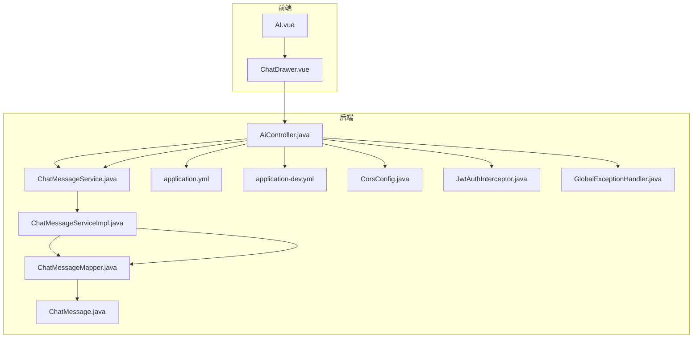
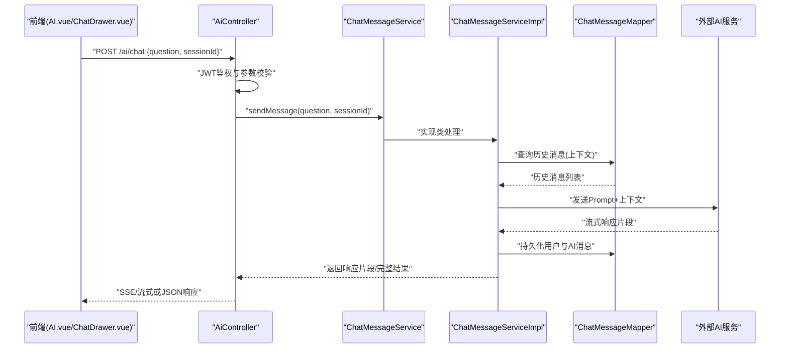
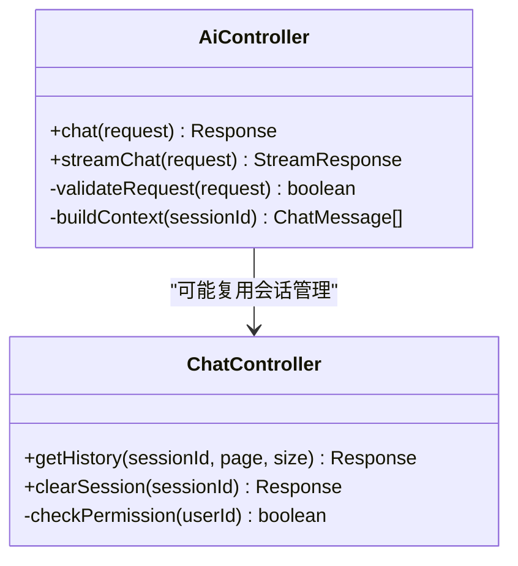
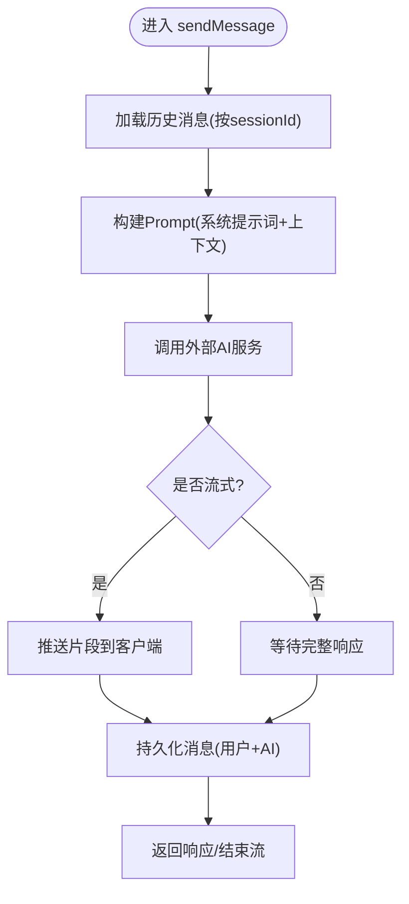
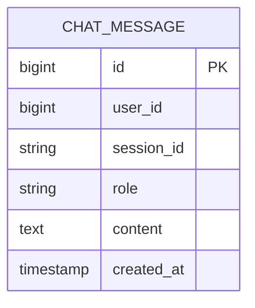
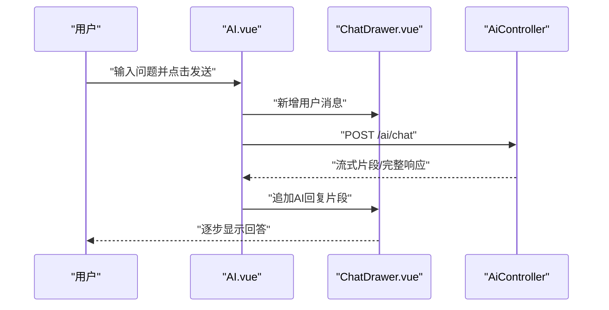
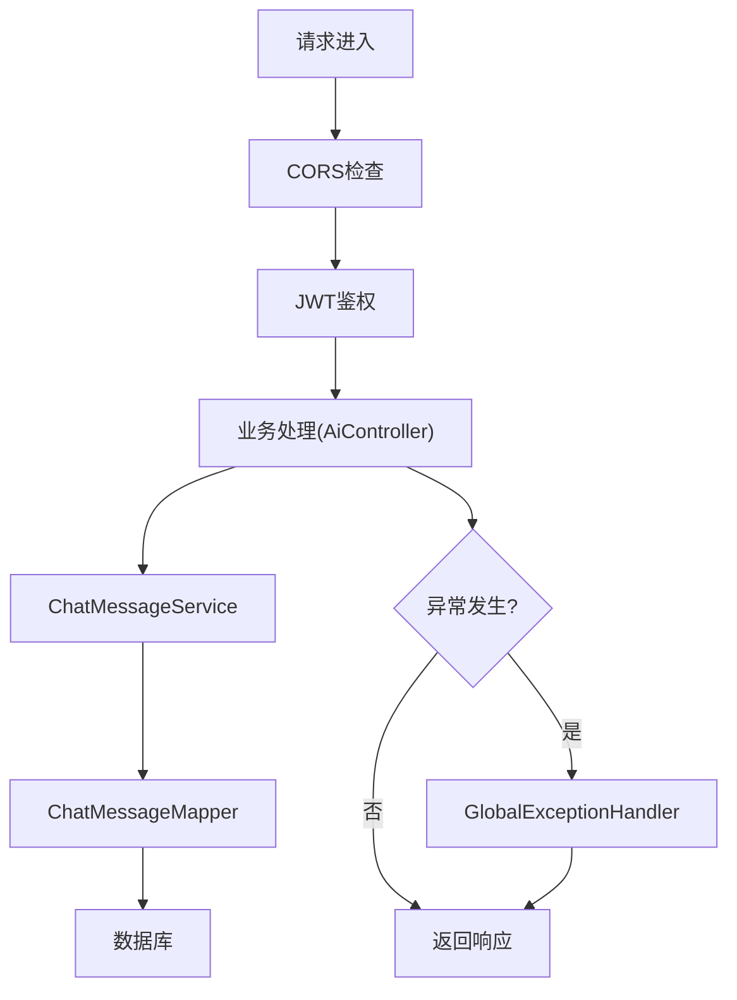
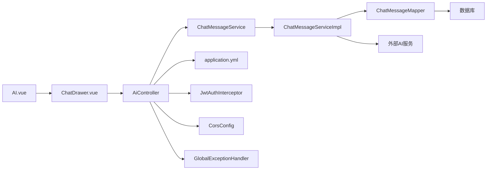

# AI智能集成

<cite>
**本文引用的文件**   
- [AiController.java](file://backend/src/main/java/com/dorm/backend/controller/AiController.java)
- [ChatController.java](file://backend/src/main/java/com/dorm/backend/controller/ChatController.java)
- [ChatMessage.java](file://backend/src/main/java/com/dorm/backend/entity/ChatMessage.java)
- [ChatMessageMapper.java](file://backend/src/main/java/com/dorm/backend/mapper/ChatMessageMapper.java)
- [ChatMessageServiceImpl.java](file://backend/src/main/java/com/dorm/backend/service/impl/ChatMessageServiceImpl.java)
- [ChatMessageService.java](file://backend/src/main/java/com/dorm/backend/service/ChatMessageService.java)
- [AI.vue](file://frontend/src/views/student/AI.vue)
- [ChatDrawer.vue](file://frontend/src/components/ChatDrawer.vue)
- [application.yml](file://backend/src/main/resources/application.yml)
- [application-dev.yml](file://backend/src/main/resources/application-dev.yml)
- [CorsConfig.java](file://backend/src/main/java/com/dorm/backend/config/CorsConfig.java)
- [GlobalExceptionHandler.java](file://backend/src/main/java/com/dorm/backend/common/GlobalExceptionHandler.java)
- [JwtAuthInterceptor.java](file://backend/src/main/java/com/dorm/backend/config/JwtAuthInterceptor.java)
</cite>

## 目录
1. [简介](#简介)
2. [项目结构](#项目结构)
3. [核心组件](#核心组件)
4. [架构总览](#架构总览)
5. [详细组件分析](#详细组件分析)
6. [依赖关系分析](#依赖关系分析)
7. [性能考虑](#性能考虑)
8. [故障排查指南](#故障排查指南)
9. [结论](#结论)
10. [附录](#附录)

## 简介
本文件面向Dorm-Sys的AI智能集成功能，系统性阐述AI助手的能力边界、后端API与消息处理流程、前端交互界面设计、提示词工程与上下文管理、配置与参数调优、性能监控与安全合规（数据隐私与内容过滤），并提供使用指南与扩展开发方法。文档以代码仓库中的实际实现为依据，确保读者能够基于现有架构进行二次开发与优化。

## 项目结构
AI功能在前后端均有对应模块：
- 后端提供AI对话接口与聊天消息持久化能力，包含控制器、服务层、实体与Mapper。
- 前端提供学生端的AI页面与通用聊天抽屉组件，负责用户输入、消息展示与流式渲染。
- 配置与拦截器负责跨域、鉴权与全局异常处理，保障安全与稳定性。

**图表来源** 
- [AiController.java](file://backend/src/main/java/com/dorm/backend/controller/AiController.java)
- [ChatMessageService.java](file://backend/src/main/java/com/dorm/backend/service/ChatMessageService.java)
- [ChatMessageServiceImpl.java](file://backend/src/main/java/com/dorm/backend/service/impl/ChatMessageServiceImpl.java)
- [ChatMessageMapper.java](file://backend/src/main/java/com/dorm/backend/mapper/ChatMessageMapper.java)
- [ChatMessage.java](file://backend/src/main/java/com/dorm/backend/entity/ChatMessage.java)
- [application.yml](file://backend/src/main/resources/application.yml)
- [application-dev.yml](file://backend/src/main/resources/application-dev.yml)
- [CorsConfig.java](file://backend/src/main/java/com/dorm/backend/config/CorsConfig.java)
- [JwtAuthInterceptor.java](file://backend/src/main/java/com/dorm/backend/config/JwtAuthInterceptor.java)
- [GlobalExceptionHandler.java](file://backend/src/main/java/com/dorm/backend/common/GlobalExceptionHandler.java)

**章节来源**
- [AiController.java](file://backend/src/main/java/com/dorm/backend/controller/AiController.java)
- [ChatController.java](file://backend/src/main/java/com/dorm/backend/controller/ChatController.java)
- [ChatMessage.java](file://backend/src/main/java/com/dorm/backend/entity/ChatMessage.java)
- [ChatMessageMapper.java](file://backend/src/main/java/com/dorm/backend/mapper/ChatMessageMapper.java)
- [ChatMessageServiceImpl.java](file://backend/src/main/java/com/dorm/backend/service/impl/ChatMessageServiceImpl.java)
- [ChatMessageService.java](file://backend/src/main/java/com/dorm/backend/service/ChatMessageService.java)
- [AI.vue](file://frontend/src/views/student/AI.vue)
- [ChatDrawer.vue](file://frontend/src/components/ChatDrawer.vue)
- [application.yml](file://backend/src/main/resources/application.yml)
- [application-dev.yml](file://backend/src/main/resources/application-dev.yml)
- [CorsConfig.java](file://backend/src/main/java/com/dorm/backend/config/CorsConfig.java)
- [JwtAuthInterceptor.java](file://backend/src/main/java/com/dorm/backend/config/JwtAuthInterceptor.java)
- [GlobalExceptionHandler.java](file://backend/src/main/java/com/dorm/backend/common/GlobalExceptionHandler.java)

## 核心组件
- 控制器层
  - AiController：对外暴露AI对话相关接口，接收用户问题并返回AI响应或流式片段。
  - ChatController：提供聊天会话相关的通用接口（如历史消息查询、会话管理等）。
- 服务层
  - ChatMessageService：定义聊天消息的业务接口（发送、查询、分页等）。
  - ChatMessageServiceImpl：实现消息持久化、上下文组装、调用外部AI服务等逻辑。
- 数据层
  - ChatMessage：聊天消息实体，包含用户ID、角色、内容、时间戳等字段。
  - ChatMessageMapper：MyBatis映射接口，用于数据库读写操作。
- 前端组件
  - AI.vue：学生端AI页面，承载对话入口、消息列表与输入框。
  - ChatDrawer.vue：通用聊天抽屉组件，支持消息滚动、流式输出与交互反馈。
- 配置与拦截器
  - application.yml / application-dev.yml：AI服务连接、超时、重试、日志级别等配置。
  - CorsConfig：跨域策略，允许前端访问后端AI接口。
  - JwtAuthInterceptor：JWT鉴权，保护AI接口免遭未授权访问。
  - GlobalExceptionHandler：统一异常处理，保证错误信息规范化返回。

**章节来源**
- [AiController.java](file://backend/src/main/java/com/dorm/backend/controller/AiController.java)
- [ChatController.java](file://backend/src/main/java/com/dorm/backend/controller/ChatController.java)
- [ChatMessageService.java](file://backend/src/main/java/com/dorm/backend/service/ChatMessageService.java)
- [ChatMessageServiceImpl.java](file://backend/src/main/java/com/dorm/backend/service/impl/ChatMessageServiceImpl.java)
- [ChatMessage.java](file://backend/src/main/java/com/dorm/backend/entity/ChatMessage.java)
- [ChatMessageMapper.java](file://backend/src/main/java/com/dorm/backend/mapper/ChatMessageMapper.java)
- [AI.vue](file://frontend/src/views/student/AI.vue)
- [ChatDrawer.vue](file://frontend/src/components/ChatDrawer.vue)
- [application.yml](file://backend/src/main/resources/application.yml)
- [application-dev.yml](file://backend/src/main/resources/application-dev.yml)
- [CorsConfig.java](file://backend/src/main/java/com/dorm/backend/config/CorsConfig.java)
- [JwtAuthInterceptor.java](file://backend/src/main/java/com/dorm/backend/config/JwtAuthInterceptor.java)
- [GlobalExceptionHandler.java](file://backend/src/main/java/com/dorm/backend/common/GlobalExceptionHandler.java)

## 架构总览
AI智能集成的整体流程如下：
- 前端通过AI.vue发起对话请求，ChatDrawer.vue负责消息渲染与流式更新。
- 后端AiController接收请求，校验JWT与跨域，调用ChatMessageService完成业务处理。
- ChatMessageServiceImpl组装上下文（含历史消息、系统提示词），调用外部AI服务生成响应。
- 响应可流式返回前端，同时持久化到数据库（ChatMessage + ChatMessageMapper）。
- 全局异常处理器捕获异常并返回统一格式的错误信息。

**图表来源** 
- [AiController.java](file://backend/src/main/java/com/dorm/backend/controller/AiController.java)
- [ChatMessageService.java](file://backend/src/main/java/com/dorm/backend/service/ChatMessageService.java)
- [ChatMessageServiceImpl.java](file://backend/src/main/java/com/dorm/backend/service/impl/ChatMessageServiceImpl.java)
- [ChatMessageMapper.java](file://backend/src/main/java/com/dorm/backend/mapper/ChatMessageMapper.java)
- [ChatMessage.java](file://backend/src/main/java/com/dorm/backend/entity/ChatMessage.java)

**章节来源**
- [AiController.java](file://backend/src/main/java/com/dorm/backend/controller/AiController.java)
- [ChatMessageServiceImpl.java](file://backend/src/main/java/com/dorm/backend/service/impl/ChatMessageServiceImpl.java)
- [ChatMessageMapper.java](file://backend/src/main/java/com/dorm/backend/mapper/ChatMessageMapper.java)
- [ChatMessage.java](file://backend/src/main/java/com/dorm/backend/entity/ChatMessage.java)

## 详细组件分析

### 控制器层：AiController与ChatController
- AiController
  - 职责：接收AI对话请求，校验JWT与参数，调用服务层，返回响应或流式数据。
  - 关键点：跨域处理、鉴权拦截、异常统一封装、流式输出（如SSE或分块响应）。
- ChatController
  - 职责：提供聊天会话相关接口，如历史消息查询、会话状态管理。
  - 关键点：分页、排序、权限控制（仅查看本人消息）、缓存策略（可选）。

**图表来源** 
- [AiController.java](file://backend/src/main/java/com/dorm/backend/controller/AiController.java)
- [ChatController.java](file://backend/src/main/java/com/dorm/backend/controller/ChatController.java)

**章节来源**
- [AiController.java](file://backend/src/main/java/com/dorm/backend/controller/AiController.java)
- [ChatController.java](file://backend/src/main/java/com/dorm/backend/controller/ChatController.java)

### 服务层：ChatMessageService与ChatMessageServiceImpl
- ChatMessageService
  - 定义接口：sendMessage、getHistory、clearSession等。
- ChatMessageServiceImpl
  - 实现要点：
    - 上下文组装：根据sessionId获取最近N条历史消息，拼接系统提示词。
    - 外部AI调用：支持HTTP/SSE流式调用，处理超时、重试与降级。
    - 持久化：将用户与AI消息写入数据库，保证一致性。
    - 安全过滤：对输入输出进行敏感词检测与内容过滤。

**图表来源** 
- [ChatMessageService.java](file://backend/src/main/java/com/dorm/backend/service/ChatMessageService.java)
- [ChatMessageServiceImpl.java](file://backend/src/main/java/com/dorm/backend/service/impl/ChatMessageServiceImpl.java)
- [ChatMessageMapper.java](file://backend/src/main/java/com/dorm/backend/mapper/ChatMessageMapper.java)
- [ChatMessage.java](file://backend/src/main/java/com/dorm/backend/entity/ChatMessage.java)

**章节来源**
- [ChatMessageService.java](file://backend/src/main/java/com/dorm/backend/service/ChatMessageService.java)
- [ChatMessageServiceImpl.java](file://backend/src/main/java/com/dorm/backend/service/impl/ChatMessageServiceImpl.java)
- [ChatMessageMapper.java](file://backend/src/main/java/com/dorm/backend/mapper/ChatMessageMapper.java)
- [ChatMessage.java](file://backend/src/main/java/com/dorm/backend/entity/ChatMessage.java)

### 数据层：ChatMessage实体与Mapper
- ChatMessage
  - 字段：id、userId、sessionId、role、content、createdAt等。
  - 用途：记录对话双方消息，支撑上下文管理与历史回溯。
- ChatMessageMapper
  - 方法：insert、selectBySessionId、selectByUserId、deleteBySessionId等。
  - 优化建议：为sessionId与userId建立索引，提升查询性能。

**图表来源** 
- [ChatMessage.java](file://backend/src/main/java/com/dorm/backend/entity/ChatMessage.java)
- [ChatMessageMapper.java](file://backend/src/main/java/com/dorm/backend/mapper/ChatMessageMapper.java)

**章节来源**
- [ChatMessage.java](file://backend/src/main/java/com/dorm/backend/entity/ChatMessage.java)
- [ChatMessageMapper.java](file://backend/src/main/java/com/dorm/backend/mapper/ChatMessageMapper.java)

### 前端组件：AI.vue与ChatDrawer.vue
- AI.vue
  - 职责：学生端AI页面，提供对话入口、消息列表、输入框与状态指示。
  - 交互：发送消息后，实时显示AI回复；支持清空会话、切换主题等。
- ChatDrawer.vue
  - 职责：通用聊天抽屉，支持消息滚动、流式渲染、错误提示与重试。
  - 体验优化：自动聚焦输入框、键盘快捷键、防抖发送、加载骨架屏。

**图表来源** 
- [AI.vue](file://frontend/src/views/student/AI.vue)
- [ChatDrawer.vue](file://frontend/src/components/ChatDrawer.vue)
- [AiController.java](file://backend/src/main/java/com/dorm/backend/controller/AiController.java)

**章节来源**
- [AI.vue](file://frontend/src/views/student/AI.vue)
- [ChatDrawer.vue](file://frontend/src/components/ChatDrawer.vue)

### 配置与拦截器：应用配置、跨域、鉴权与异常处理
- application.yml / application-dev.yml
  - 关键配置项：AI服务地址、超时时间、重试次数、日志级别、数据库连接池等。
- CorsConfig
  - 作用：允许前端域名访问后端AI接口，避免跨域错误。
- JwtAuthInterceptor
  - 作用：校验JWT令牌，保护AI接口免受未授权访问。
- GlobalExceptionHandler
  - 作用：统一捕获异常，返回标准错误码与消息，便于前端处理。

**图表来源** 
- [application.yml](file://backend/src/main/resources/application.yml)
- [application-dev.yml](file://backend/src/main/resources/application-dev.yml)
- [CorsConfig.java](file://backend/src/main/java/com/dorm/backend/config/CorsConfig.java)
- [JwtAuthInterceptor.java](file://backend/src/main/java/com/dorm/backend/config/JwtAuthInterceptor.java)
- [GlobalExceptionHandler.java](file://backend/src/main/java/com/dorm/backend/common/GlobalExceptionHandler.java)

**章节来源**
- [application.yml](file://backend/src/main/resources/application.yml)
- [application-dev.yml](file://backend/src/main/resources/application-dev.yml)
- [CorsConfig.java](file://backend/src/main/java/com/dorm/backend/config/CorsConfig.java)
- [JwtAuthInterceptor.java](file://backend/src/main/java/com/dorm/backend/config/JwtAuthInterceptor.java)
- [GlobalExceptionHandler.java](file://backend/src/main/java/com/dorm/backend/common/GlobalExceptionHandler.java)

## 依赖关系分析
- 控制器依赖服务层，服务层依赖Mapper与外部AI服务。
- 前端依赖后端API，通过AJAX/SSE进行通信。
- 配置与拦截器贯穿整个请求链路，确保安全性与稳定性。

**图表来源** 
- [AI.vue](file://frontend/src/views/student/AI.vue)
- [ChatDrawer.vue](file://frontend/src/components/ChatDrawer.vue)
- [AiController.java](file://backend/src/main/java/com/dorm/backend/controller/AiController.java)
- [ChatMessageService.java](file://backend/src/main/java/com/dorm/backend/service/ChatMessageService.java)
- [ChatMessageServiceImpl.java](file://backend/src/main/java/com/dorm/backend/service/impl/ChatMessageServiceImpl.java)
- [ChatMessageMapper.java](file://backend/src/main/java/com/dorm/backend/mapper/ChatMessageMapper.java)
- [application.yml](file://backend/src/main/resources/application.yml)
- [JwtAuthInterceptor.java](file://backend/src/main/java/com/dorm/backend/config/JwtAuthInterceptor.java)
- [CorsConfig.java](file://backend/src/main/java/com/dorm/backend/config/CorsConfig.java)
- [GlobalExceptionHandler.java](file://backend/src/main/java/com/dorm/backend/common/GlobalExceptionHandler.java)

**章节来源**
- [AiController.java](file://backend/src/main/java/com/dorm/backend/controller/AiController.java)
- [ChatMessageServiceImpl.java](file://backend/src/main/java/com/dorm/backend/service/impl/ChatMessageServiceImpl.java)
- [ChatMessageMapper.java](file://backend/src/main/java/com/dorm/backend/mapper/ChatMessageMapper.java)
- [application.yml](file://backend/src/main/resources/application.yml)
- [JwtAuthInterceptor.java](file://backend/src/main/java/com/dorm/backend/config/JwtAuthInterceptor.java)
- [CorsConfig.java](file://backend/src/main/java/com/dorm/backend/config/CorsConfig.java)
- [GlobalExceptionHandler.java](file://backend/src/main/java/com/dorm/backend/common/GlobalExceptionHandler.java)

## 性能考虑
- 流式响应：优先使用SSE或分块传输，降低首字节延迟，提升用户体验。
- 上下文窗口：限制历史消息数量（如最近10条），减少Token消耗与内存占用。
- 缓存策略：对热点知识或固定答案进行缓存（Redis），提高响应速度。
- 连接池与超时：合理设置HTTP连接池大小与超时时间，避免资源耗尽。
- 异步处理：将耗时任务（如长文本生成）放入异步队列，非阻塞主线程。
- 监控指标：采集QPS、延迟、错误率、Token用量等指标，便于容量规划与告警。

[本节为通用指导，不直接分析具体文件]

## 故障排查指南
- 常见问题
  - 跨域错误：检查CorsConfig是否放行前端域名。
  - 鉴权失败：确认JWT令牌有效且未被篡改。
  - 外部AI服务不可用：检查网络连通性、超时与重试配置。
  - 数据库写入失败：检查连接池、事务与索引。
- 定位步骤
  - 查看GlobalExceptionHandler返回的错误码与消息。
  - 启用DEBUG日志，追踪请求链路。
  - 使用Postman或浏览器开发者工具验证接口。
  - 检查application-dev.yml中的调试开关与日志级别。

**章节来源**
- [GlobalExceptionHandler.java](file://backend/src/main/java/com/dorm/backend/common/GlobalExceptionHandler.java)
- [application-dev.yml](file://backend/src/main/resources/application-dev.yml)

## 结论
Dorm-Sys的AI智能集成通过清晰的分层架构、完善的配置与拦截机制、以及友好的前端交互，实现了稳定可靠的AI对话能力。建议在后续迭代中持续优化上下文管理、内容过滤与性能监控，以提升用户体验与系统健壮性。

[本节为总结性内容，不直接分析具体文件]

## 附录
- 使用指南
  - 学生用户登录后可进入“AI”页面，输入问题即可获得智能回答。
  - 支持多轮对话，自动维护会话上下文。
  - 可通过“清空会话”重置对话历史。
- 开发扩展
  - 新增AI能力：在ChatMessageServiceImpl中扩展Prompt模板与调用逻辑。
  - 接入新模型：修改外部AI服务地址与参数，保持接口契约不变。
  - 增强安全过滤：在输入输出层增加敏感词检测与内容审核。
  - 性能优化：引入缓存、限流与异步处理，提升吞吐与稳定性。

[本节为补充说明，不直接分析具体文件]