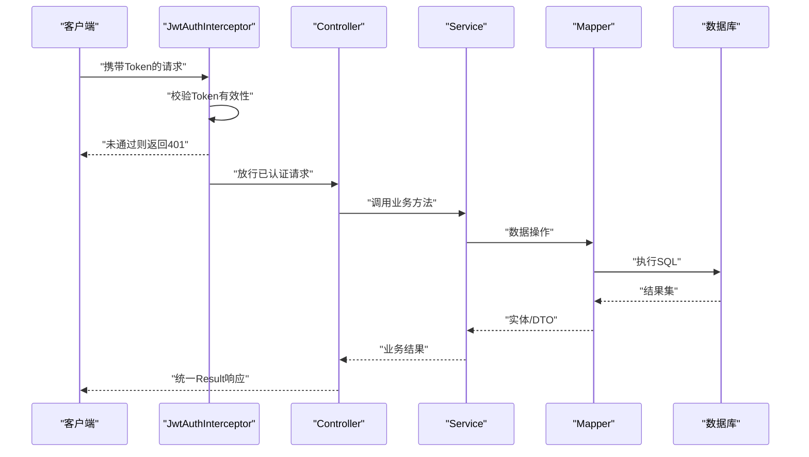
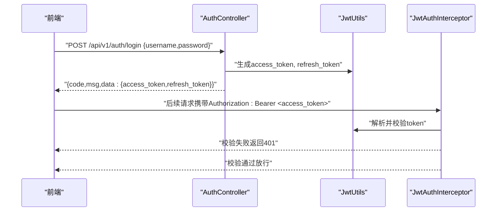
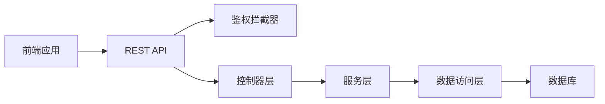

# API接口文档

<cite>
**本文档引用的文件**   
- [AuthController.java](file://backend/src/main/java/com/dorm/backend/controller/AuthController.java)
- [JwtUtils.java](file://backend/src/main/java/com/dorm/backend/common/JwtUtils.java)
- [JwtAuthInterceptor.java](file://backend/src/main/java/com/dorm/backend/config/JwtAuthInterceptor.java)
- [GlobalExceptionHandler.java](file://backend/src/main/java/com/dorm/backend/common/GlobalExceptionHandler.java)
- [Result.java](file://backend/src/main/java/com/dorm/backend/common/Result.java)
- [WebMvcConfig.java](file://backend/src/main/java/com/dorm/backend/config/WebMvcConfig.java)
- [CorsConfig.java](file://backend/src/main/java/com/dorm/backend/config/CorsConfig.java)
- [UserController.java](file://backend/src/main/java/com/dorm/backend/controller/UserController.java)
- [RoomController.java](file://backend/src/main/java/com/dorm/backend/controller/RoomController.java)
- [BuildingController.java](file://backend/src/main/java/com/dorm/backend/controller/BuildingController.java)
- [BedController.java](file://backend/src/main/java/com/dorm/backend/controller/BedController.java)
- [RepairRequestController.java](file://backend/src/main/java/com/dorm/backend/controller/RepairRequestController.java)
- [TransferRequestController.java](file://backend/src/main/java/com/dorm/backend/controller/TransferRequestController.java)
- [FeeBillController.java](file://backend/src/main/java/com/dorm/backend/controller/FeeBillController.java)
- [HygieneRecordController.java](file://backend/src/main/java/com/dorm/backend/controller/HygieneRecordController.java)
- [ItemRecordController.java](file://backend/src/main/java/com/dorm/backend/controller/ItemRecordController.java)
- [LateReturnRecordController.java](file://backend/src/main/java/com/dorm/backend/controller/LateReturnRecordController.java)
- [VisitorRecordController.java](file://backend/src/main/java/com/dorm/backend/controller/VisitorRecordController.java)
- [BusinessRecordController.java](file://backend/src/main/java/com/dorm/backend/controller/BusinessRecordController.java)
- [CallRecordController.java](file://backend/src/main/java/com/dorm/backend/controller/CallRecordController.java)
- [ChatController.java](file://backend/src/main/java/com/dorm/backend/controller/ChatController.java)
- [DashboardController.java](file://backend/src/main/java/com/dorm/backend/controller/DashboardController.java)
- [OperationLogController.java](file://backend/src/main/java/com/dorm/backend/controller/OperationLogController.java)
- [AdminReportController.java](file://backend/src/main/java/com/dorm/backend/controller/AdminReportController.java)
- [AiController.java](file://backend/src/main/java/com/dorm/backend/controller/AiController.java)
- [LoginDTO.java](file://backend/src/main/java/com/dorm/backend/dto/LoginDTO.java)
- [RoomBatchCreateRequest.java](file://backend/src/main/java/com/dorm/backend/dto/RoomBatchCreateRequest.java)
- [application.yml](file://backend/src/main/resources/application.yml)
- [application-dev.yml](file://backend/src/main/resources/application-dev.yml)
- [pom.xml](file://backend/pom.xml)
- [package.json](file://frontend/package.json)
- [request.js](file://frontend/src/utils/request.js)
- [auth.js](file://frontend/src/api/auth.js)
</cite>

## 目录
1. [简介](#简介)
2. [项目结构](#项目结构)
3. [核心组件](#核心组件)
4. [架构总览](#架构总览)
5. [详细组件分析](#详细组件分析)
6. [依赖分析](#依赖分析)
7. [性能考虑](#性能考虑)
8. [故障排查指南](#故障排查指南)
9. [结论](#结论)
10. [附录](#附录)

## 简介
本文件为 Dorm-Sys 后端 RESTful API 的完整参考文档，覆盖认证授权、API 端点、数据验证、错误码与异常处理、版本管理与兼容性、限流与安全、测试与调试、SDK 集成与最佳实践。读者可据此快速对接前端或第三方系统，并保障稳定集成与长期演进。

## 项目结构
后端采用 Spring Boot + MyBatis 的分层架构：
- controller：HTTP 接口定义
- service：业务逻辑实现
- mapper：数据访问映射
- common：通用工具与统一响应封装
- config：拦截器、跨域、MVC 配置等
- dto/entity：请求/响应与实体模型
- resources：配置文件与 SQL 脚本

```mermaid
graph TB
subgraph "控制器层"
C1["AuthController"]
C2["UserController"]
C3["RoomController"]
C4["BuildingController"]
C5["BedController"]
C6["RepairRequestController"]
C7["TransferRequestController"]
C8["FeeBillController"]
C9["HygieneRecordController"]
C10["ItemRecordController"]
C11["LateReturnRecordController"]
C12["VisitorRecordController"]
C13["BusinessRecordController"]
C14["CallRecordController"]
C15["ChatController"]
C16["DashboardController"]
C17["OperationLogController"]
C18["AdminReportController"]
C19["AiController"]
end
subgraph "服务层"
S1["UserService"]
S2["RoomService"]
S3["BuildingService"]
S4["BedService"]
S5["RepairRequestService"]
S6["TransferRequestService"]
S7["FeeBillService"]
S8["HygieneRecordService"]
S9["ItemRecordService"]
S10["LateReturnRecordService"]
S11["VisitorRecordService"]
S12["BusinessRecordService"]
S13["CallRecordService"]
S14["ChatMessageService"]
S15["DormManagerScopeService"]
end
subgraph "数据访问层"
M1["UserMapper"]
M2["RoomMapper"]
M3["BuildingMapper"]
M4["BedMapper"]
M5["RepairRequestMapper"]
M6["TransferRequestMapper"]
M7["FeeBillMapper"]
M8["HygieneRecordMapper"]
M9["ItemRecordMapper"]
M10["LateReturnRecordMapper"]
M11["VisitorRecordMapper"]
M12["BusinessRecordMapper"]
M13["CallRecordMapper"]
M14["ChatMessageMapper"]
end
C1 --> S1
C2 --> S1
C3 --> S2
C4 --> S3
C5 --> S4
C6 --> S5
C7 --> S6
C8 --> S7
C9 --> S8
C10 --> S9
C11 --> S10
C12 --> S11
C13 --> S12
C14 --> S13
C15 --> S14
S1 --> M1
S2 --> M2
S3 --> M3
S4 --> M4
S5 --> M5
S6 --> M6
S7 --> M7
S8 --> M8
S9 --> M9
S10 --> M10
S11 --> M11
S12 --> M12
S13 --> M13
S14 --> M14
```

图表来源
- [AuthController.java](file://backend/src/main/java/com/dorm/backend/controller/AuthController.java)
- [UserController.java](file://backend/src/main/java/com/dorm/backend/controller/UserController.java)
- [RoomController.java](file://backend/src/main/java/com/dorm/backend/controller/RoomController.java)
- [BuildingController.java](file://backend/src/main/java/com/dorm/backend/controller/BuildingController.java)
- [BedController.java](file://backend/src/main/java/com/dorm/backend/controller/BedController.java)
- [RepairRequestController.java](file://backend/src/main/java/com/dorm/backend/controller/RepairRequestController.java)
- [TransferRequestController.java](file://backend/src/main/java/com/dorm/backend/controller/TransferRequestController.java)
- [FeeBillController.java](file://backend/src/main/java/com/dorm/backend/controller/FeeBillController.java)
- [HygieneRecordController.java](file://backend/src/main/java/com/dorm/backend/controller/HygieneRecordController.java)
- [ItemRecordController.java](file://backend/src/main/java/com/dorm/backend/controller/ItemRecordController.java)
- [LateReturnRecordController.java](file://backend/src/main/java/com/dorm/backend/controller/LateReturnRecordController.java)
- [VisitorRecordController.java](file://backend/src/main/java/com/dorm/backend/controller/VisitorRecordController.java)
- [BusinessRecordController.java](file://backend/src/main/java/com/dorm/backend/controller/BusinessRecordController.java)
- [CallRecordController.java](file://backend/src/main/java/com/dorm/backend/controller/CallRecordController.java)
- [ChatController.java](file://backend/src/main/java/com/dorm/backend/controller/ChatController.java)
- [DashboardController.java](file://backend/src/main/java/com/dorm/backend/controller/DashboardController.java)
- [OperationLogController.java](file://backend/src/main/java/com/dorm/backend/controller/OperationLogController.java)
- [AdminReportController.java](file://backend/src/main/java/com/dorm/backend/controller/AdminReportController.java)
- [AiController.java](file://backend/src/main/java/com/dorm/backend/controller/AiController.java)

章节来源
- [application.yml](file://backend/src/main/resources/application.yml)
- [application-dev.yml](file://backend/src/main/resources/application-dev.yml)
- [pom.xml](file://backend/pom.xml)

## 核心组件
- 统一响应体 Result：所有接口返回统一结构，包含状态码、消息和数据负载，便于前端一致化处理。
- JWT 工具 JwtUtils：生成、解析、校验令牌；支持过期时间、签发主体等字段。
- 鉴权拦截器 JwtAuthInterceptor：在请求进入 Controller 前校验 Token，注入用户上下文。
- 全局异常处理器 GlobalExceptionHandler：捕获业务与系统异常，统一转换为 Result 格式。
- MVC 配置 WebMvcConfig：注册拦截器、路径匹配策略、版本化前缀（如 /api/v1）。
- 跨域配置 CorsConfig：允许前端跨域访问，设置允许的源、方法与头。

章节来源
- [Result.java](file://backend/src/main/java/com/dorm/backend/common/Result.java)
- [JwtUtils.java](file://backend/src/main/java/com/dorm/backend/common/JwtUtils.java)
- [JwtAuthInterceptor.java](file://backend/src/main/java/com/dorm/backend/config/JwtAuthInterceptor.java)
- [GlobalExceptionHandler.java](file://backend/src/main/java/com/dorm/backend/common/GlobalExceptionHandler.java)
- [WebMvcConfig.java](file://backend/src/main/java/com/dorm/backend/config/WebMvcConfig.java)
- [CorsConfig.java](file://backend/src/main/java/com/dorm/backend/config/CorsConfig.java)

## 架构总览
整体调用链：客户端 → 拦截器（鉴权/审计）→ Controller → Service → Mapper → 数据库。统一异常与响应由中间件与注解驱动。

图表来源
- [JwtAuthInterceptor.java](file://backend/src/main/java/com/dorm/backend/config/JwtAuthInterceptor.java)
- [AuthController.java](file://backend/src/main/java/com/dorm/backend/controller/AuthController.java)
- [GlobalExceptionHandler.java](file://backend/src/main/java/com/dorm/backend/common/GlobalExceptionHandler.java)

## 详细组件分析

### 认证与授权（JWT）
- 登录获取令牌：POST /api/v1/auth/login，提交用户名与密码，成功返回包含 access_token 与 refresh_token 的响应。
- 刷新令牌：POST /api/v1/auth/refresh，使用 refresh_token 换取新的 access_token。
- 登出：POST /api/v1/auth/logout，服务端注销会话或使 token 失效（若实现黑名单机制）。
- 鉴权流程：除登录、公开接口外，其他接口需携带 Authorization: Bearer <token>，由 JwtAuthInterceptor 校验。

图表来源
- [AuthController.java](file://backend/src/main/java/com/dorm/backend/controller/AuthController.java)
- [JwtUtils.java](file://backend/src/main/java/com/dorm/backend/common/JwtUtils.java)
- [JwtAuthInterceptor.java](file://backend/src/main/java/com/dorm/backend/config/JwtAuthInterceptor.java)

章节来源
- [AuthController.java](file://backend/src/main/java/com/dorm/backend/controller/AuthController.java)
- [JwtUtils.java](file://backend/src/main/java/com/dorm/backend/common/JwtUtils.java)
- [JwtAuthInterceptor.java](file://backend/src/main/java/com/dorm/backend/config/JwtAuthInterceptor.java)
- [LoginDTO.java](file://backend/src/main/java/com/dorm/backend/dto/LoginDTO.java)

### 用户管理（User）
- 获取当前用户信息：GET /api/v1/user/me
- 更新个人信息：PUT /api/v1/user/profile
- 修改密码：PUT /api/v1/user/password
- 分页查询用户列表（管理员）：GET /api/v1/users?page=...&size=...&keyword=...

说明：
- 需要登录态；部分接口需管理员角色。
- 参数校验：邮箱、手机号、密码强度等规则在服务端与 DTO 中定义。

章节来源
- [UserController.java](file://backend/src/main/java/com/dorm/backend/controller/UserController.java)

### 宿舍资源（Building/Room/Bed）
- 楼栋管理：CRUD /api/v1/buildings
- 房间管理：CRUD /api/v1/rooms，支持批量创建 /api/v1/rooms/batch
- 床位管理：CRUD /api/v1/beds，支持按房间查询可用床位

说明：
- RoomBatchCreateRequest 用于批量创建房间，包含楼栋ID、房间号、容量等字段。
- 床位状态枚举控制入住、维修、禁用等状态流转。

章节来源
- [BuildingController.java](file://backend/src/main/java/com/dorm/backend/controller/BuildingController.java)
- [RoomController.java](file://backend/src/main/java/com/dorm/backend/controller/RoomController.java)
- [BedController.java](file://backend/src/main/java/com/dorm/backend/controller/BedController.java)
- [RoomBatchCreateRequest.java](file://backend/src/main/java/com/dorm/backend/dto/RoomBatchCreateRequest.java)

### 报修与换宿（Repair/Transfer）
- 报修申请：POST /api/v1/repairs，支持附件上传（如有）
- 报修进度：GET /api/v1/repairs/{id}，状态机：待受理→处理中→已完成/关闭
- 换宿申请：POST /api/v1/transfers，审批流程：待审核→同意/拒绝

章节来源
- [RepairRequestController.java](file://backend/src/main/java/com/dorm/backend/controller/RepairRequestController.java)
- [TransferRequestController.java](file://backend/src/main/java/com/dorm/backend/controller/TransferRequestController.java)

### 费用账单（FeeBill）
- 账单列表：GET /api/v1/fee-bills?userId=...&status=...
- 支付状态更新：PUT /api/v1/fee-bills/{id}/pay
- 导出对账：GET /api/v1/fee-bills/export（管理员）

章节来源
- [FeeBillController.java](file://backend/src/main/java/com/dorm/backend/controller/FeeBillController.java)

### 卫生检查（HygieneRecord）
- 记录卫生评分与备注：POST /api/v1/hygiene
- 查询某房间历史：GET /api/v1/hygiene?roomId=...

章节来源
- [HygieneRecordController.java](file://backend/src/main/java/com/dorm/backend/controller/HygieneRecordController.java)

### 物品登记（ItemRecord）
- 登记公共物品：POST /api/v1/items
- 盘点与报废：PUT /api/v1/items/{id}/status

章节来源
- [ItemRecordController.java](file://backend/src/main/java/com/dorm/backend/controller/ItemRecordController.java)

### 晚归记录（LateReturnRecord）
- 上报晚归：POST /api/v1/late-returns
- 统计报表：GET /api/v1/late-returns/stats?dateFrom=...&dateTo=...

章节来源
- [LateReturnRecordController.java](file://backend/src/main/java/com/dorm/backend/controller/LateReturnRecordController.java)

### 访客记录（VisitorRecord）
- 登记访客：POST /api/v1/visitors
- 查询出入记录：GET /api/v1/visitors?roomId=...&date=...

章节来源
- [VisitorRecordController.java](file://backend/src/main/java/com/dorm/backend/controller/VisitorRecordController.java)

### 业务流水（BusinessRecord）
- 记录业务事件：POST /api/v1/business
- 查询流水：GET /api/v1/business?entityType=...&entityId=...

章节来源
- [BusinessRecordController.java](file://backend/src/main/java/com/dorm/backend/controller/BusinessRecordController.java)

### 通话记录（CallRecord）
- 上报通话：POST /api/v1/calls
- 查询通话：GET /api/v1/calls?userId=...&type=...

章节来源
- [CallRecordController.java](file://backend/src/main/java/com/dorm/backend/controller/CallRecordController.java)

### 聊天（Chat）
- 发送消息：POST /api/v1/chat/messages
- 拉取历史：GET /api/v1/chat/history?roomId=...&page=...

章节来源
- [ChatController.java](file://backend/src/main/java/com/dorm/backend/controller/ChatController.java)

### 仪表盘（Dashboard）
- 关键指标：GET /api/v1/dashboard/stats
- 趋势图数据：GET /api/v1/dashboard/trends?metric=...&range=...

章节来源
- [DashboardController.java](file://backend/src/main/java/com/dorm/backend/controller/DashboardController.java)

### 操作日志（OperationLog）
- 查询操作日志：GET /api/v1/logs?operator=...&action=...&date=...

章节来源
- [OperationLogController.java](file://backend/src/main/java/com/dorm/backend/controller/OperationLogController.java)

### 管理报表（AdminReport）
- 汇总报表：GET /api/v1/admin/reports?type=...&period=...
- 导出报表：GET /api/v1/admin/reports/export?type=...

章节来源
- [AdminReportController.java](file://backend/src/main/java/com/dorm/backend/controller/AdminReportController.java)

### AI 助手（Ai）
- 智能问答：POST /api/v1/ai/chat
- 建议生成：POST /api/v1/ai/suggest

章节来源
- [AiController.java](file://backend/src/main/java/com/dorm/backend/controller/AiController.java)

### 统一响应与错误码
- 统一响应体 Result：包含 code、message、data 字段。
- 常见错误码：
  - 200：成功
  - 400：参数校验失败
  - 401：未认证或令牌无效
  - 403：权限不足
  - 404：资源不存在
  - 500：服务器内部错误
- 异常处理：GlobalExceptionHandler 将异常转为 Result，保证前端一致性。

章节来源
- [Result.java](file://backend/src/main/java/com/dorm/backend/common/Result.java)
- [GlobalExceptionHandler.java](file://backend/src/main/java/com/dorm/backend/common/GlobalExceptionHandler.java)

### 数据验证规则
- 必填字段：各 DTO 中定义 required 校验，如 LoginDTO 的用户名与密码。
- 格式校验：邮箱、手机号、URL、日期范围等。
- 业务校验：唯一性、状态机约束、权限边界（如仅管理员可批量创建房间）。

章节来源
- [LoginDTO.java](file://backend/src/main/java/com/dorm/backend/dto/LoginDTO.java)
- [RoomBatchCreateRequest.java](file://backend/src/main/java/com/dorm/backend/dto/RoomBatchCreateRequest.java)

### API 版本管理与兼容性
- 版本前缀：/api/v1，便于未来升级至 v2 并保持向后兼容。
- 废弃策略：旧接口保留一段时间并提供迁移指南，逐步下线。
- 变更通知：通过公告与接口元数据标注 deprecation。

章节来源
- [WebMvcConfig.java](file://backend/src/main/java/com/dorm/backend/config/WebMvcConfig.java)

## 依赖分析
- 外部依赖：Spring Boot、MyBatis、JWT、数据库驱动（MySQL）、日志框架（Logback）。
- 前端依赖：Vue/Vite、Axios、Playwright（E2E）。
- 模块耦合：Controller 依赖 Service，Service 依赖 Mapper，Mapper 依赖数据库；鉴权与审计通过拦截器横切。

图表来源
- [pom.xml](file://backend/pom.xml)
- [package.json](file://frontend/package.json)

章节来源
- [pom.xml](file://backend/pom.xml)
- [package.json](file://frontend/package.json)

## 性能考虑
- 缓存策略：热点数据（如楼栋、房间状态）可引入 Redis 缓存，减少数据库压力。
- 分页与排序：列表接口默认分页，避免一次性加载大量数据。
- 连接池：合理配置数据库连接池大小与超时时间。
- 异步处理：耗时任务（如报表导出、AI 调用）采用异步队列。
- 压缩与缓存头：启用 Gzip、设置 ETag/Cache-Control。

[本节为通用指导，不直接分析具体文件]

## 故障排查指南
- 常见问题：
  - 401 未认证：检查 Authorization 头是否携带有效 token。
  - 403 权限不足：确认用户角色与接口权限要求。
  - 400 参数错误：查看请求体是否符合 DTO 校验规则。
  - 500 服务器错误：查看后端日志定位异常堆栈。
- 调试工具：
  - 浏览器开发者工具：网络面板查看请求/响应。
  - Postman：构造请求、保存环境变量（baseUrl、token）。
  - Swagger/OpenAPI：在线接口文档与在线调试（如启用）。
  - Playwright：E2E 用例自动化验证关键流程。

章节来源
- [GlobalExceptionHandler.java](file://backend/src/main/java/com/dorm/backend/common/GlobalExceptionHandler.java)
- [request.js](file://frontend/src/utils/request.js)
- [auth.js](file://frontend/src/api/auth.js)

## 结论
本文档系统化梳理了 Dorm-Sys 的 API 设计与实现要点，涵盖认证授权、接口清单、数据验证、错误处理、版本管理、安全与性能、测试调试与集成实践。建议在前端集成时严格遵循统一响应结构与鉴权流程，并在生产环境启用监控与告警，确保稳定性与可观测性。

## 附录

### 请求与响应示例
- 登录成功
  - 请求：POST /api/v1/auth/login
  - 请求体：{ "username": "string", "password": "string" }
  - 响应：{ "code": 200, "message": "success", "data": { "access_token": "string", "refresh_token": "string" } }
- 刷新令牌
  - 请求：POST /api/v1/auth/refresh
  - 请求体：{ "refresh_token": "string" }
  - 响应：{ "code": 200, "message": "success", "data": { "access_token": "string" } }
- 获取当前用户
  - 请求：GET /api/v1/user/me
  - 头部：Authorization: Bearer <access_token>
  - 响应：{ "code": 200, "message": "success", "data": { "id": "number", "username": "string", "role": "string" } }
- 参数校验失败
  - 响应：{ "code": 400, "message": "参数校验失败", "data": null }
- 未认证
  - 响应：{ "code": 401, "message": "未认证", "data": null }

[本节为通用示例，不直接分析具体文件]

### 前端 SDK 集成与最佳实践
- Axios 基础配置：设置 baseUrl、超时时间、拦截器（自动附加 token、统一错误提示）。
- 认证流程：登录后存储 access_token 与 refresh_token，过期时自动刷新并重试请求。
- 错误处理：根据 code 分支处理，区分业务错误与网络错误。
- 安全建议：HTTPS、CSRF 防护（如需）、敏感信息不落盘。

章节来源
- [request.js](file://frontend/src/utils/request.js)
- [auth.js](file://frontend/src/api/auth.js)

### API 限流、安全防护与优化
- 限流：基于 IP/用户维度进行速率限制，防止滥用。
- 安全：输入校验、SQL 防注入、XSS 防护、敏感操作二次确认。
- 优化：索引优化、慢查询分析、读写分离、缓存命中提升。

[本节为通用指导，不直接分析具体文件]

### 测试方法与调试
- 单元测试：针对 Service/Mapper 编写用例，验证业务与数据正确性。
- 接口测试：Postman/Newman 批量执行集合，CI 中自动化回归。
- E2E 测试：Playwright 模拟用户行为，覆盖关键路径。
- 日志与追踪：结构化日志、链路追踪（如 SkyWalking），定位问题。

章节来源
- [package.json](file://frontend/package.json)