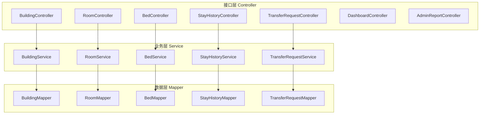
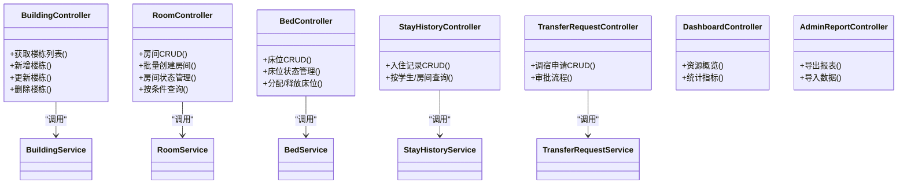
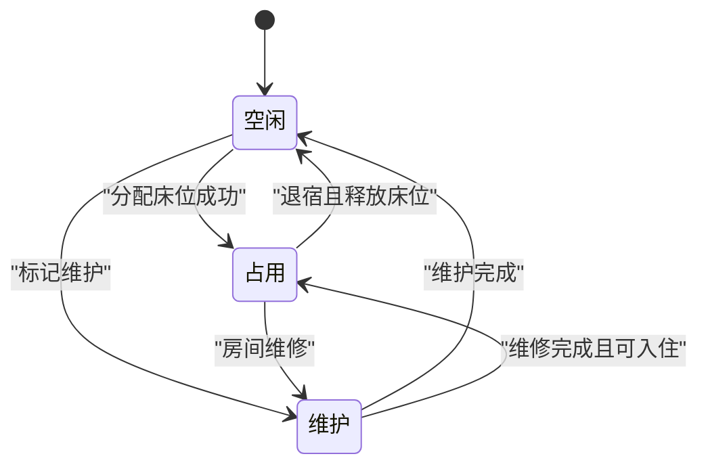
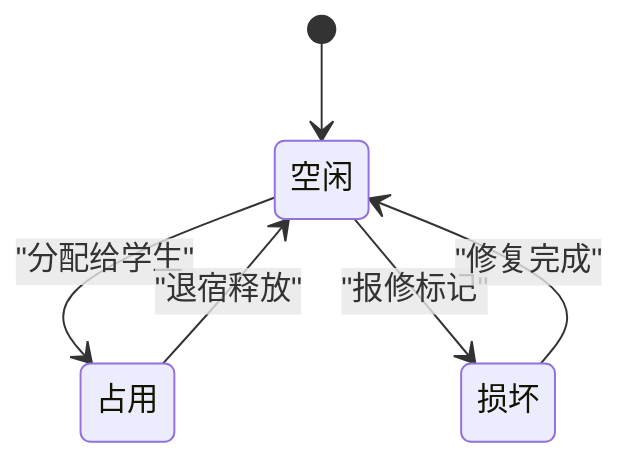
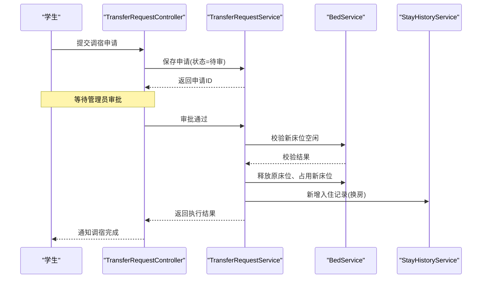
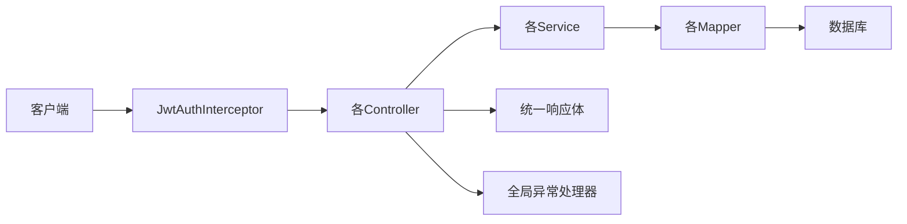

# 宿舍管理接口

<cite>
**本文引用的文件**   
- [BuildingController.java](file://backend/src/main/java/com/dorm/backend/controller/BuildingController.java)
- [RoomController.java](file://backend/src/main/java/com/dorm/backend/controller/RoomController.java)
- [BedController.java](file://backend/src/main/java/com/dorm/backend/controller/BedController.java)
- [StayHistoryController.java](file://backend/src/main/java/com/dorm/backend/controller/StayHistoryController.java)
- [TransferRequestController.java](file://backend/src/main/java/com/dorm/backend/controller/TransferRequestController.java)
- [DashboardController.java](file://backend/src/main/java/com/dorm/backend/controller/DashboardController.java)
- [AdminReportController.java](file://backend/src/main/java/com/dorm/backend/controller/AdminReportController.java)
- [Result.java](file://backend/src/main/java/com/dorm/backend/common/Result.java)
- [GlobalExceptionHandler.java](file://backend/src/main/java/com/dorm/backend/common/GlobalExceptionHandler.java)
- [JwtAuthInterceptor.java](file://backend/src/main/java/com/dorm/backend/config/JwtAuthInterceptor.java)
- [WebMvcConfig.java](file://backend/src/main/java/com/dorm/backend/config/WebMvcConfig.java)
- [RoomBatchCreateRequest.java](file://backend/src/main/java/com/dorm/backend/dto/RoomBatchCreateRequest.java)
- [Building.java](file://backend/src/main/java/com/dorm/backend/entity/Building.java)
- [Room.java](file://backend/src/main/java/com/dorm/backend/entity/Room.java)
- [Bed.java](file://backend/src/main/java/com/dorm/backend/entity/Bed.java)
- [StayHistory.java](file://backend/src/main/java/com/dorm/backend/entity/StayHistory.java)
- [TransferRequest.java](file://backend/src/main/java/com/dorm/backend/entity/TransferRequest.java)
- [RoomStatusEnum.java](file://backend/src/main/java/com/dorm/backend/enums/RoomStatusEnum.java)
- [BedStatusEnum.java](file://backend/src/main/java/com/dorm/backend/enums/BedStatusEnum.java)
- [BuildingService.java](file://backend/src/main/java/com/dorm/backend/service/BuildingService.java)
- [RoomService.java](file://backend/src/main/java/com/dorm/backend/service/RoomService.java)
- [BedService.java](file://backend/src/main/java/com/dorm/backend/service/BedService.java)
- [StayHistoryService.java](file://backend/src/main/java/com/dorm/backend/service/StayHistoryService.java)
- [TransferRequestService.java](file://backend/src/main/java/com/dorm/backend/service/TransferRequestService.java)
- [BuildingServiceImpl.java](file://backend/src/main/java/com/dorm/backend/service/impl/BuildingServiceImpl.java)
- [RoomServiceImpl.java](file://backend/src/main/java/com/dorm/backend/service/impl/RoomServiceImpl.java)
- [BedServiceImpl.java](file://backend/src/main/java/com/dorm/backend/service/impl/BedServiceImpl.java)
- [StayHistoryServiceImpl.java](file://backend/src/main/java/com/dorm/backend/service/impl/StayHistoryServiceImpl.java)
- [TransferRequestServiceImpl.java](file://backend/src/main/java/com/dorm/backend/service/impl/TransferRequestServiceImpl.java)
- [BuildingMapper.java](file://backend/src/main/java/com/dorm/backend/mapper/BuildingMapper.java)
- [RoomMapper.java](file://backend/src/main/java/com/dorm/backend/mapper/RoomMapper.java)
- [BedMapper.java](file://backend/src/main/java/com/dorm/backend/mapper/BedMapper.java)
- [StayHistoryMapper.java](file://backend/src/main/java/com/dorm/backend/mapper/StayHistoryMapper.java)
- [TransferRequestMapper.java](file://backend/src/main/java/com/dorm/backend/mapper/TransferRequestMapper.java)
</cite>

## 目录
1. [简介](#简介)
2. [项目结构](#项目结构)
3. [核心组件](#核心组件)
4. [架构总览](#架构总览)
5. [详细组件分析](#详细组件分析)
6. [依赖关系分析](#依赖关系分析)
7. [性能考虑](#性能考虑)
8. [故障排查指南](#故障排查指南)
9. [结论](#结论)
10. [附录](#附录)

## 简介
本文件为 Dorm-Sys 宿舍管理系统的后端接口文档，聚焦楼栋、房间、床位等实体的 CRUD 操作，以及宿舍分配、调整、查询等核心业务。文档覆盖：
- 实体与状态：楼栋、房间、床位、入住历史、调宿申请
- 业务接口：增删改查、批量创建房间、资源可视化与统计
- 流程与规则：房间状态流转、床位占用、入住历史、调宿审批
- 错误处理与示例：统一响应体、异常拦截、常见错误码说明

## 项目结构
后端采用分层架构：Controller（接口层）→ Service（业务层）→ Mapper（数据访问层），配合枚举定义状态、DTO 封装请求参数、通用 Result 统一返回格式，并通过拦截器完成鉴权与审计。

**图示来源** 
- [BuildingController.java](file://backend/src/main/java/com/dorm/backend/controller/BuildingController.java)
- [RoomController.java](file://backend/src/main/java/com/dorm/backend/controller/RoomController.java)
- [BedController.java](file://backend/src/main/java/com/dorm/backend/controller/BedController.java)
- [StayHistoryController.java](file://backend/src/main/java/com/dorm/backend/controller/StayHistoryController.java)
- [TransferRequestController.java](file://backend/src/main/java/com/dorm/backend/controller/TransferRequestController.java)
- [DashboardController.java](file://backend/src/main/java/com/dorm/backend/controller/DashboardController.java)
- [AdminReportController.java](file://backend/src/main/java/com/dorm/backend/controller/AdminReportController.java)
- [BuildingService.java](file://backend/src/main/java/com/dorm/backend/service/BuildingService.java)
- [RoomService.java](file://backend/src/main/java/com/dorm/backend/service/RoomService.java)
- [BedService.java](file://backend/src/main/java/com/dorm/backend/service/BedService.java)
- [StayHistoryService.java](file://backend/src/main/java/com/dorm/backend/service/StayHistoryService.java)
- [TransferRequestService.java](file://backend/src/main/java/com/dorm/backend/service/TransferRequestService.java)
- [BuildingMapper.java](file://backend/src/main/java/com/dorm/backend/mapper/BuildingMapper.java)
- [RoomMapper.java](file://backend/src/main/java/com/dorm/backend/mapper/RoomMapper.java)
- [BedMapper.java](file://backend/src/main/java/com/dorm/backend/mapper/BedMapper.java)
- [StayHistoryMapper.java](file://backend/src/main/java/com/dorm/backend/mapper/StayHistoryMapper.java)
- [TransferRequestMapper.java](file://backend/src/main/java/com/dorm/backend/mapper/TransferRequestMapper.java)

**章节来源**
- [BuildingController.java](file://backend/src/main/java/com/dorm/backend/controller/BuildingController.java)
- [RoomController.java](file://backend/src/main/java/com/dorm/backend/controller/RoomController.java)
- [BedController.java](file://backend/src/main/java/com/dorm/backend/controller/BedController.java)
- [StayHistoryController.java](file://backend/src/main/java/com/dorm/backend/controller/StayHistoryController.java)
- [TransferRequestController.java](file://backend/src/main/java/com/dorm/backend/controller/TransferRequestController.java)
- [DashboardController.java](file://backend/src/main/java/com/dorm/backend/controller/DashboardController.java)
- [AdminReportController.java](file://backend/src/main/java/com/dorm/backend/controller/AdminReportController.java)

## 核心组件
- 统一响应体 Result：所有接口以统一结构返回，包含状态码、消息和数据体，便于前端一致处理。
- 全局异常处理器 GlobalExceptionHandler：集中捕获并转换异常为统一错误响应。
- 鉴权拦截器 JwtAuthInterceptor：校验 JWT，确保受保护接口仅对已登录用户开放。
- MVC 配置 WebMvcConfig：注册拦截器、跨域等基础配置。

**章节来源**
- [Result.java](file://backend/src/main/java/com/dorm/backend/common/Result.java)
- [GlobalExceptionHandler.java](file://backend/src/main/java/com/dorm/backend/common/GlobalExceptionHandler.java)
- [JwtAuthInterceptor.java](file://backend/src/main/java/com/dorm/backend/config/JwtAuthInterceptor.java)
- [WebMvcConfig.java](file://backend/src/main/java/com/dorm/backend/config/WebMvcConfig.java)

## 架构总览
系统遵循“控制器-服务-映射”的分层设计，通过枚举约束状态，通过 DTO 规范输入，通过统一响应和异常处理保证一致性。

**图示来源** 
- [BuildingController.java](file://backend/src/main/java/com/dorm/backend/controller/BuildingController.java)
- [RoomController.java](file://backend/src/main/java/com/dorm/backend/controller/RoomController.java)
- [BedController.java](file://backend/src/main/java/com/dorm/backend/controller/BedController.java)
- [StayHistoryController.java](file://backend/src/main/java/com/dorm/backend/controller/StayHistoryController.java)
- [TransferRequestController.java](file://backend/src/main/java/com/dorm/backend/controller/TransferRequestController.java)
- [DashboardController.java](file://backend/src/main/java/com/dorm/backend/controller/DashboardController.java)
- [AdminReportController.java](file://backend/src/main/java/com/dorm/backend/controller/AdminReportController.java)

## 详细组件分析

### 楼栋管理接口（BuildingController）
- 功能范围：楼栋的增删改查、分页与筛选、关联房间数量统计。
- 典型端点：
  - 获取楼栋列表（支持分页、名称模糊搜索）
  - 新增楼栋（校验唯一性、必填字段）
  - 更新楼栋信息
  - 删除楼栋（检查是否有关联房间）
- 业务规则：
  - 删除前需校验无房间引用，避免脏数据
  - 名称唯一性校验
- 错误处理：
  - 重复名称、非法ID、关联约束失败等由全局异常处理器统一返回

**章节来源**
- [BuildingController.java](file://backend/src/main/java/com/dorm/backend/controller/BuildingController.java)
- [BuildingService.java](file://backend/src/main/java/com/dorm/backend/service/BuildingService.java)
- [BuildingServiceImpl.java](file://backend/src/main/java/com/dorm/backend/service/impl/BuildingServiceImpl.java)
- [BuildingMapper.java](file://backend/src/main/java/com/dorm/backend/mapper/BuildingMapper.java)
- [Building.java](file://backend/src/main/java/com/dorm/backend/entity/Building.java)

### 房间管理接口（RoomController）
- 功能范围：房间CRUD、批量创建、状态管理、按楼栋/类型/状态查询。
- 典型端点：
  - 房间列表（分页、楼栋过滤、类型过滤、状态过滤）
  - 新增房间（校验容量、所属楼栋存在）
  - 更新房间信息
  - 删除房间（检查是否有床位或占用）
  - 批量创建房间（使用 RoomBatchCreateRequest）
  - 房间状态变更（空闲/占用/维护）
- 业务规则：
  - 房间状态与床位占用情况联动
  - 批量创建时校验楼栋容量上限与重复编号
- 错误处理：
  - 容量超限、编号冲突、状态不合法等

**章节来源**
- [RoomController.java](file://backend/src/main/java/com/dorm/backend/controller/RoomController.java)
- [RoomService.java](file://backend/src/main/java/com/dorm/backend/service/RoomService.java)
- [RoomServiceImpl.java](file://backend/src/main/java/com/dorm/backend/service/impl/RoomServiceImpl.java)
- [RoomMapper.java](file://backend/src/main/java/com/dorm/backend/mapper/RoomMapper.java)
- [Room.java](file://backend/src/main/java/com/dorm/backend/entity/Room.java)
- [RoomStatusEnum.java](file://backend/src/main/java/com/dorm/backend/enums/RoomStatusEnum.java)
- [RoomBatchCreateRequest.java](file://backend/src/main/java/com/dorm/backend/dto/RoomBatchCreateRequest.java)

#### 房间状态流转图

**图示来源** 
- [RoomStatusEnum.java](file://backend/src/main/java/com/dorm/backend/enums/RoomStatusEnum.java)
- [RoomServiceImpl.java](file://backend/src/main/java/com/dorm/backend/service/impl/RoomServiceImpl.java)

### 床位管理接口（BedController）
- 功能范围：床位CRUD、状态管理、分配与释放、占用情况查询。
- 典型端点：
  - 床位列表（分页、房间过滤、状态过滤）
  - 新增床位（校验房间容量与床位编号唯一）
  - 更新床位信息
  - 删除床位（检查是否被占用）
  - 分配床位（绑定学生、更新状态为占用）
  - 释放床位（解绑学生、更新状态为空闲）
- 业务规则：
  - 床位状态与房间状态联动
  - 分配时需校验学生未在其他床位占用
- 错误处理：
  - 床位已被占用、房间容量不足、学生已占用其他床位等

**章节来源**
- [BedController.java](file://backend/src/main/java/com/dorm/backend/controller/BedController.java)
- [BedService.java](file://backend/src/main/java/com/dorm/backend/service/BedService.java)
- [BedServiceImpl.java](file://backend/src/main/java/com/dorm/backend/service/impl/BedServiceImpl.java)
- [BedMapper.java](file://backend/src/main/java/com/dorm/backend/mapper/BedMapper.java)
- [Bed.java](file://backend/src/main/java/com/dorm/backend/entity/Bed.java)
- [BedStatusEnum.java](file://backend/src/main/java/com/dorm/backend/enums/BedStatusEnum.java)

#### 床位状态流转图

**图示来源** 
- [BedStatusEnum.java](file://backend/src/main/java/com/dorm/backend/enums/BedStatusEnum.java)
- [BedServiceImpl.java](file://backend/src/main/java/com/dorm/backend/service/impl/BedServiceImpl.java)

### 入住历史接口（StayHistoryController）
- 功能范围：入住记录的增删改查、按学生/房间/时间段查询、导出。
- 典型端点：
  - 入住记录列表（分页、学生ID、房间ID、时间范围）
  - 新增入住记录（自动记录入住房间与床位）
  - 更新入住信息（如续住、换房）
  - 删除入住记录（谨慎操作，建议软删除）
- 业务规则：
  - 入住记录与床位占用状态联动
  - 时间区间查询需校验起止时间合法性

**章节来源**
- [StayHistoryController.java](file://backend/src/main/java/com/dorm/backend/controller/StayHistoryController.java)
- [StayHistoryService.java](file://backend/src/main/java/com/dorm/backend/service/StayHistoryService.java)
- [StayHistoryServiceImpl.java](file://backend/src/main/java/com/dorm/backend/service/impl/StayHistoryServiceImpl.java)
- [StayHistoryMapper.java](file://backend/src/main/java/com/dorm/backend/mapper/StayHistoryMapper.java)
- [StayHistory.java](file://backend/src/main/java/com/dorm/backend/entity/StayHistory.java)

### 调宿申请接口（TransferRequestController）
- 功能范围：调宿申请的提交、审批、执行与撤销。
- 典型端点：
  - 提交调宿申请（原床位与新床位、原因、优先级）
  - 查询申请列表（状态过滤：待审/已通过/已拒绝/已执行）
  - 审批通过（校验新床位可用、更新占用状态）
  - 审批拒绝（记录原因）
  - 执行调宿（实际迁移床位与历史记录）
- 业务流程（序列图）：

**图示来源** 
- [TransferRequestController.java](file://backend/src/main/java/com/dorm/backend/controller/TransferRequestController.java)
- [TransferRequestService.java](file://backend/src/main/java/com/dorm/backend/service/TransferRequestService.java)
- [TransferRequestServiceImpl.java](file://backend/src/main/java/com/dorm/backend/service/impl/TransferRequestServiceImpl.java)
- [BedService.java](file://backend/src/main/java/com/dorm/backend/service/BedService.java)
- [StayHistoryService.java](file://backend/src/main/java/com/dorm/backend/service/StayHistoryService.java)

**章节来源**
- [TransferRequestController.java](file://backend/src/main/java/com/dorm/backend/controller/TransferRequestController.java)
- [TransferRequestService.java](file://backend/src/main/java/com/dorm/backend/service/TransferRequestService.java)
- [TransferRequestServiceImpl.java](file://backend/src/main/java/com/dorm/backend/service/impl/TransferRequestServiceImpl.java)
- [TransferRequest.java](file://backend/src/main/java/com/dorm/backend/entity/TransferRequest.java)

### 可视化与统计接口（DashboardController、AdminReportController）
- 功能范围：资源概览、统计指标、数据导入导出。
- 典型端点：
  - 资源概览（楼栋总数、房间总数、床位总数、占用率）
  - 统计指标（按楼栋/类型的房间分布、床位占用趋势）
  - 导出报表（Excel/CSV，含房间与床位明细）
  - 导入数据（批量导入房间/床位模板校验）
- 注意：
  - 导入需进行模板校验与数据清洗
  - 导出支持分页与条件筛选

**章节来源**
- [DashboardController.java](file://backend/src/main/java/com/dorm/backend/controller/DashboardController.java)
- [AdminReportController.java](file://backend/src/main/java/com/dorm/backend/controller/AdminReportController.java)

## 依赖关系分析
- 控制器依赖服务接口，服务实现依赖对应 Mapper，实体与枚举用于数据建模与状态约束。
- 鉴权拦截器在请求进入控制器前校验 JWT，未通过则直接返回错误。
- 全局异常处理器捕获业务异常与系统异常，统一转换为 Result 错误响应。

**图示来源** 
- [JwtAuthInterceptor.java](file://backend/src/main/java/com/dorm/backend/config/JwtAuthInterceptor.java)
- [WebMvcConfig.java](file://backend/src/main/java/com/dorm/backend/config/WebMvcConfig.java)
- [Result.java](file://backend/src/main/java/com/dorm/backend/common/Result.java)
- [GlobalExceptionHandler.java](file://backend/src/main/java/com/dorm/backend/common/GlobalExceptionHandler.java)

**章节来源**
- [JwtAuthInterceptor.java](file://backend/src/main/java/com/dorm/backend/config/JwtAuthInterceptor.java)
- [WebMvcConfig.java](file://backend/src/main/java/com/dorm/backend/config/WebMvcConfig.java)
- [Result.java](file://backend/src/main/java/com/dorm/backend/common/Result.java)
- [GlobalExceptionHandler.java](file://backend/src/main/java/com/dorm/backend/common/GlobalExceptionHandler.java)

## 性能考虑
- 分页查询：列表接口默认分页，避免一次性加载大量数据。
- 索引优化：常用查询字段（楼栋ID、房间号、床位编号、学生ID）建议在数据库建立索引。
- 事务控制：批量操作（如批量创建房间、调宿执行）应使用事务保证一致性。
- 缓存策略：统计类接口可引入缓存减少数据库压力。
- 导入导出：大文件导入导出建议使用异步任务与流式处理。

[本节为通用指导，无需特定文件来源]

## 故障排查指南
- 鉴权失败：检查请求头是否携带有效 JWT，确认拦截器路径配置是否正确。
- 参数校验失败：检查必填字段、格式、取值范围；查看全局异常处理器返回的错误消息。
- 状态不一致：检查房间与床位状态是否同步，入住历史是否更新。
- 数据约束冲突：唯一性约束（如房间号、床位编号）、外键约束（楼栋-房间、房间-床位）。
- 导入导出失败：检查模板字段、数据类型、空值处理。

**章节来源**
- [GlobalExceptionHandler.java](file://backend/src/main/java/com/dorm/backend/common/GlobalExceptionHandler.java)
- [JwtAuthInterceptor.java](file://backend/src/main/java/com/dorm/backend/config/JwtAuthInterceptor.java)

## 结论
Dorm-Sys 宿舍管理系统通过清晰的分层架构与统一的接口规范，实现了楼栋、房间、床位等实体的完整管理能力，并提供入住历史、调宿审批、可视化统计与导入导出等扩展能力。建议在生产环境完善索引、事务与缓存策略，以提升稳定性与性能。

[本节为总结，无需特定文件来源]

## 附录
- 统一响应体字段说明：
  - code：状态码（成功/失败）
  - message：提示信息
  - data：业务数据体
- 常见错误码：
  - 400：参数校验失败
  - 401：未授权（JWT无效或缺失）
  - 403：权限不足
  - 404：资源不存在
  - 500：服务器内部错误

**章节来源**
- [Result.java](file://backend/src/main/java/com/dorm/backend/common/Result.java)
- [GlobalExceptionHandler.java](file://backend/src/main/java/com/dorm/backend/common/GlobalExceptionHandler.java)