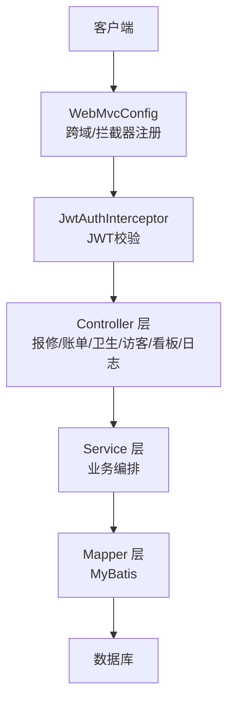
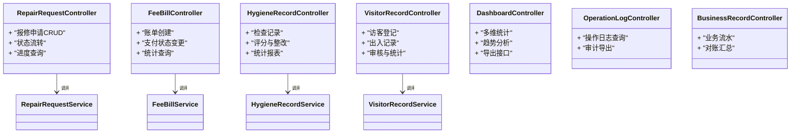
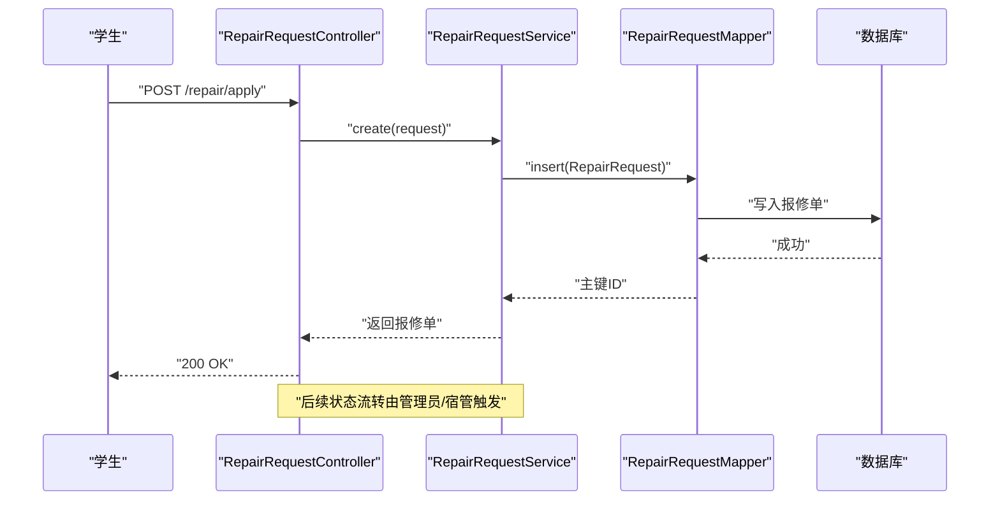
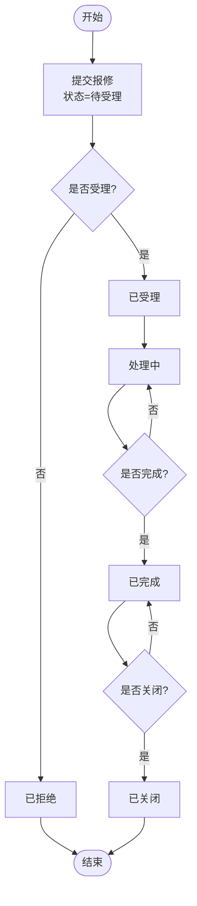
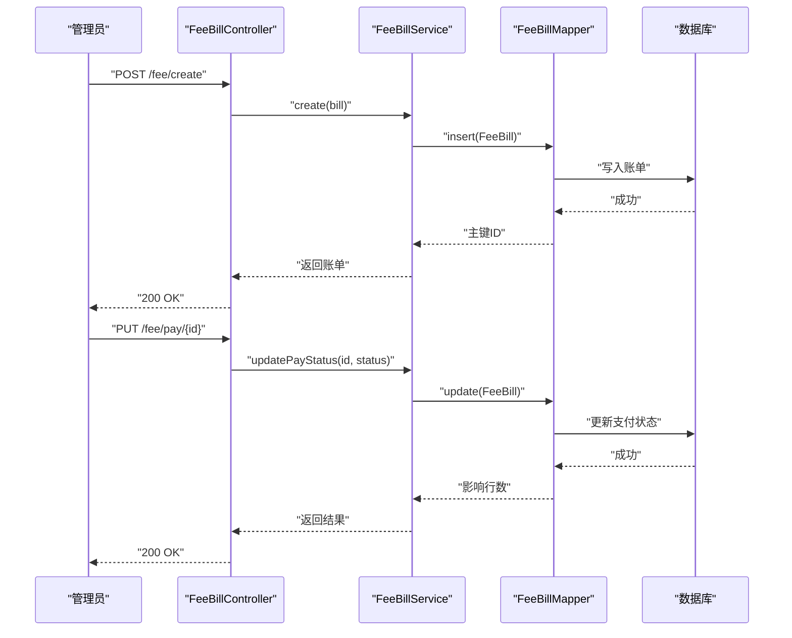
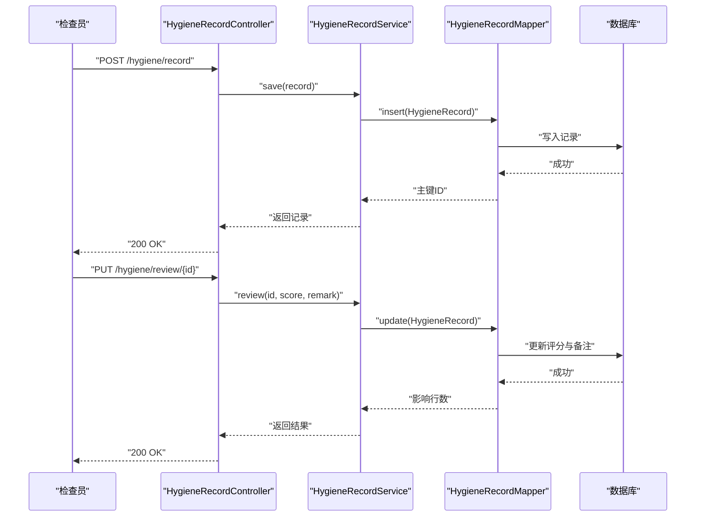
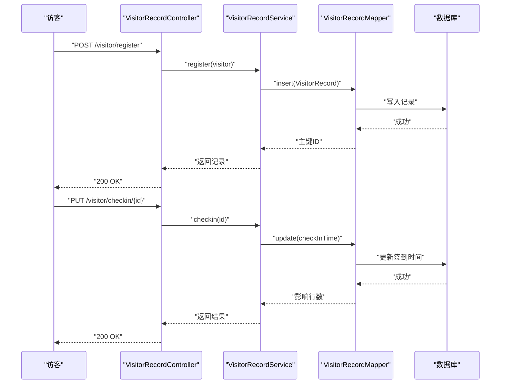
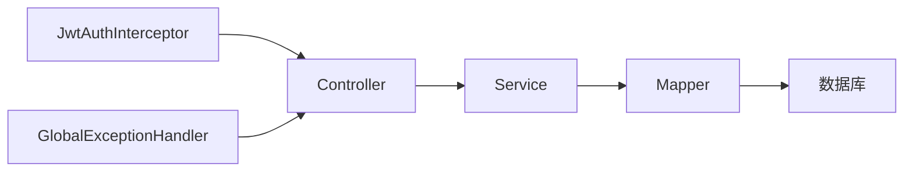

# 服务运营接口

<cite>
**本文引用的文件**   
- [RepairRequestController.java](file://backend/src/main/java/com/dorm/backend/controller/RepairRequestController.java)
- [FeeBillController.java](file://backend/src/main/java/com/dorm/backend/controller/FeeBillController.java)
- [HygieneRecordController.java](file://backend/src/main/java/com/dorm/backend/controller/HygieneRecordController.java)
- [VisitorRecordController.java](file://backend/src/main/java/com/dorm/backend/controller/VisitorRecordController.java)
- [DashboardController.java](file://backend/src/main/java/com/dorm/backend/controller/DashboardController.java)
- [OperationLogController.java](file://backend/src/main/java/com/dorm/backend/controller/OperationLogController.java)
- [BusinessRecordController.java](file://backend/src/main/java/com/dorm/backend/controller/BusinessRecordController.java)
- [RepairRequestService.java](file://backend/src/main/java/com/dorm/backend/service/RepairRequestService.java)
- [FeeBillService.java](file://backend/src/main/java/com/dorm/backend/service/FeeBillService.java)
- [HygieneRecordService.java](file://backend/src/main/java/com/dorm/backend/service/HygieneRecordService.java)
- [VisitorRecordService.java](file://backend/src/main/java/com/dorm/backend/service/VisitorRecordService.java)
- [RepairRequestServiceImpl.java](file://backend/src/main/java/com/dorm/backend/service/impl/RepairRequestServiceImpl.java)
- [FeeBillServiceImpl.java](file://backend/src/main/java/com/dorm/backend/service/impl/FeeBillServiceImpl.java)
- [HygieneRecordServiceImpl.java](file://backend/src/main/java/com/dorm/backend/service/impl/HygieneRecordServiceImpl.java)
- [VisitorRecordServiceImpl.java](file://backend/src/main/java/com/dorm/backend/service/impl/VisitorRecordServiceImpl.java)
- [RepairRequest.java](file://backend/src/main/java/com/dorm/backend/entity/RepairRequest.java)
- [FeeBill.java](file://backend/src/main/java/com/dorm/backend/entity/FeeBill.java)
- [HygieneRecord.java](file://backend/src/main/java/com/dorm/backend/entity/HygieneRecord.java)
- [VisitorRecord.java](file://backend/src/main/java/com/dorm/backend/entity/VisitorRecord.java)
- [RepairStatusEnum.java](file://backend/src/main/java/com/dorm/backend/enums/RepairStatusEnum.java)
- [FeeStatusEnum.java](file://backend/src/main/java/com/dorm/backend/enums/FeeStatusEnum.java)
- [GlobalExceptionHandler.java](file://backend/src/main/java/com/dorm/backend/common/GlobalExceptionHandler.java)
- [Result.java](file://backend/src/main/java/com/dorm/backend/common/Result.java)
- [JwtAuthInterceptor.java](file://backend/src/main/java/com/dorm/backend/config/JwtAuthInterceptor.java)
- [WebMvcConfig.java](file://backend/src/main/java/com/dorm/backend/config/WebMvcConfig.java)
- [application.yml](file://backend/src/main/resources/application.yml)
</cite>

## 目录
1. [简介](#简介)
2. [项目结构](#项目结构)
3. [核心组件](#核心组件)
4. [架构总览](#架构总览)
5. [详细组件分析](#详细组件分析)
6. [依赖关系分析](#依赖关系分析)
7. [性能考虑](#性能考虑)
8. [故障排查指南](#故障排查指南)
9. [结论](#结论)
10. [附录](#附录)

## 简介
本文件为 Dorm-Sys 服务运营接口的完整技术文档，聚焦报修申请、费用账单、卫生检查、访客登记等核心服务。内容涵盖：
- API 端点清单与请求/响应约定
- 申请流程、审批流程与状态管理
- 数据统计、报表生成、通知推送等辅助功能
- 工单流转管理与进度跟踪
- 服务质量监控与评估机制
- 服务预约与排队管理等高级能力（概念性说明）
- 业务流程示例与异常处理方案

## 项目结构
后端采用 Spring Boot + MyBatis 的分层架构：
- Controller 层：对外暴露 RESTful API
- Service 层：业务逻辑编排与事务边界
- Mapper 层：数据访问（MyBatis）
- Entity/DTO/Enum：领域模型与枚举
- Common/Config：通用结果封装、全局异常、鉴权拦截器、跨域配置等

图表来源
- [WebMvcConfig.java](file://backend/src/main/java/com/dorm/backend/config/WebMvcConfig.java)
- [JwtAuthInterceptor.java](file://backend/src/main/java/com/dorm/backend/config/JwtAuthInterceptor.java)
- [application.yml](file://backend/src/main/resources/application.yml)

章节来源
- [WebMvcConfig.java](file://backend/src/main/java/com/dorm/backend/config/WebMvcConfig.java)
- [application.yml](file://backend/src/main/resources/application.yml)

## 核心组件
- 报修申请：提交报修、查询列表、更新处理状态、进度跟踪
- 费用账单：账单创建、支付状态变更、对账统计
- 卫生检查：检查记录录入、评分与整改闭环
- 访客登记：访客信息登记、出入记录、审核与统计
- 看板与报表：多维统计、导出、趋势分析
- 操作日志：审计追踪、可追溯
- 统一结果与异常：标准化返回体与全局异常处理

章节来源
- [RepairRequestController.java](file://backend/src/main/java/com/dorm/backend/controller/RepairRequestController.java)
- [FeeBillController.java](file://backend/src/main/java/com/dorm/backend/controller/FeeBillController.java)
- [HygieneRecordController.java](file://backend/src/main/java/com/dorm/backend/controller/HygieneRecordController.java)
- [VisitorRecordController.java](file://backend/src/main/java/com/dorm/backend/controller/VisitorRecordController.java)
- [DashboardController.java](file://backend/src/main/java/com/dorm/backend/controller/DashboardController.java)
- [OperationLogController.java](file://backend/src/main/java/com/dorm/backend/controller/OperationLogController.java)
- [BusinessRecordController.java](file://backend/src/main/java/com/dorm/backend/controller/BusinessRecordController.java)
- [GlobalExceptionHandler.java](file://backend/src/main/java/com/dorm/backend/common/GlobalExceptionHandler.java)
- [Result.java](file://backend/src/main/java/com/dorm/backend/common/Result.java)

## 架构总览
系统以“控制器-服务-数据访问”三层为核心，结合 JWT 鉴权与全局异常处理，形成稳定的服务运营能力。

图表来源
- [RepairRequestController.java](file://backend/src/main/java/com/dorm/backend/controller/RepairRequestController.java)
- [FeeBillController.java](file://backend/src/main/java/com/dorm/backend/controller/FeeBillController.java)
- [HygieneRecordController.java](file://backend/src/main/java/com/dorm/backend/controller/HygieneRecordController.java)
- [VisitorRecordController.java](file://backend/src/main/java/com/dorm/backend/controller/VisitorRecordController.java)
- [DashboardController.java](file://backend/src/main/java/com/dorm/backend/controller/DashboardController.java)
- [OperationLogController.java](file://backend/src/main/java/com/dorm/backend/controller/OperationLogController.java)
- [BusinessRecordController.java](file://backend/src/main/java/com/dorm/backend/controller/BusinessRecordController.java)

## 详细组件分析

### 报修申请（RepairRequest）
- 功能要点
  - 学生提交报修申请，支持附件描述、紧急程度、房间定位
  - 管理员/宿管受理、派单、处理、验收、关闭
  - 状态机驱动：待受理→已受理→处理中→已完成→已关闭（或退回）
  - 进度跟踪：节点时间戳、处理人、备注
- 关键实体与枚举
  - 实体：RepairRequest
  - 枚举：RepairStatusEnum
- 典型流程（序列图）

图表来源
- [RepairRequestController.java](file://backend/src/main/java/com/dorm/backend/controller/RepairRequestController.java)
- [RepairRequestService.java](file://backend/src/main/java/com/dorm/backend/service/RepairRequestService.java)
- [RepairRequestServiceImpl.java](file://backend/src/main/java/com/dorm/backend/service/impl/RepairRequestServiceImpl.java)
- [RepairRequest.java](file://backend/src/main/java/com/dorm/backend/entity/RepairRequest.java)
- [RepairStatusEnum.java](file://backend/src/main/java/com/dorm/backend/enums/RepairStatusEnum.java)

- 状态机（流程图）

图表来源
- [RepairStatusEnum.java](file://backend/src/main/java/com/dorm/backend/enums/RepairStatusEnum.java)

章节来源
- [RepairRequestController.java](file://backend/src/main/java/com/dorm/backend/controller/RepairRequestController.java)
- [RepairRequestService.java](file://backend/src/main/java/com/dorm/backend/service/RepairRequestService.java)
- [RepairRequestServiceImpl.java](file://backend/src/main/java/com/dorm/backend/service/impl/RepairRequestServiceImpl.java)
- [RepairRequest.java](file://backend/src/main/java/com/dorm/backend/entity/RepairRequest.java)
- [RepairStatusEnum.java](file://backend/src/main/java/com/dorm/backend/enums/RepairStatusEnum.java)

### 费用账单（FeeBill）
- 功能要点
  - 账单生成（水电、物业、维修费等）
  - 支付状态管理：未支付→已支付/部分支付→逾期
  - 对账与统计：按楼栋/房间/用户维度聚合
- 关键实体与枚举
  - 实体：FeeBill
  - 枚举：FeeStatusEnum
- 典型流程（序列图）

图表来源
- [FeeBillController.java](file://backend/src/main/java/com/dorm/backend/controller/FeeBillController.java)
- [FeeBillService.java](file://backend/src/main/java/com/dorm/backend/service/FeeBillService.java)
- [FeeBillServiceImpl.java](file://backend/src/main/java/com/dorm/backend/service/impl/FeeBillServiceImpl.java)
- [FeeBill.java](file://backend/src/main/java/com/dorm/backend/entity/FeeBill.java)
- [FeeStatusEnum.java](file://backend/src/main/java/com/dorm/backend/enums/FeeStatusEnum.java)

章节来源
- [FeeBillController.java](file://backend/src/main/java/com/dorm/backend/controller/FeeBillController.java)
- [FeeBillService.java](file://backend/src/main/java/com/dorm/backend/service/FeeBillService.java)
- [FeeBillServiceImpl.java](file://backend/src/main/java/com/dorm/backend/service/impl/FeeBillServiceImpl.java)
- [FeeBill.java](file://backend/src/main/java/com/dorm/backend/entity/FeeBill.java)
- [FeeStatusEnum.java](file://backend/src/main/java/com/dorm/backend/enums/FeeStatusEnum.java)

### 卫生检查（HygieneRecord）
- 功能要点
  - 检查员录入检查记录、评分、问题描述
  - 整改任务下发与复查闭环
  - 统计报表：楼栋/房间/周期维度
- 关键实体
  - 实体：HygieneRecord
- 典型流程（序列图）

图表来源
- [HygieneRecordController.java](file://backend/src/main/java/com/dorm/backend/controller/HygieneRecordController.java)
- [HygieneRecordService.java](file://backend/src/main/java/com/dorm/backend/service/HygieneRecordService.java)
- [HygieneRecordServiceImpl.java](file://backend/src/main/java/com/dorm/backend/service/impl/HygieneRecordServiceImpl.java)
- [HygieneRecord.java](file://backend/src/main/java/com/dorm/backend/entity/HygieneRecord.java)

章节来源
- [HygieneRecordController.java](file://backend/src/main/java/com/dorm/backend/controller/HygieneRecordController.java)
- [HygieneRecordService.java](file://backend/src/main/java/com/dorm/backend/service/HygieneRecordService.java)
- [HygieneRecordServiceImpl.java](file://backend/src/main/java/com/dorm/backend/service/impl/HygieneRecordServiceImpl.java)
- [HygieneRecord.java](file://backend/src/main/java/com/dorm/backend/entity/HygieneRecord.java)

### 访客登记（VisitorRecord）
- 功能要点
  - 访客信息登记、被访人关联、出入时间
  - 审核流程：自动放行/人工审核
  - 统计报表：时段/楼栋/人员维度
- 关键实体
  - 实体：VisitorRecord
- 典型流程（序列图）

图表来源
- [VisitorRecordController.java](file://backend/src/main/java/com/dorm/backend/controller/VisitorRecordController.java)
- [VisitorRecordService.java](file://backend/src/main/java/com/dorm/backend/service/VisitorRecordService.java)
- [VisitorRecordServiceImpl.java](file://backend/src/main/java/com/dorm/backend/service/impl/VisitorRecordServiceImpl.java)
- [VisitorRecord.java](file://backend/src/main/java/com/dorm/backend/entity/VisitorRecord.java)

章节来源
- [VisitorRecordController.java](file://backend/src/main/java/com/dorm/backend/controller/VisitorRecordController.java)
- [VisitorRecordService.java](file://backend/src/main/java/com/dorm/backend/service/VisitorRecordService.java)
- [VisitorRecordServiceImpl.java](file://backend/src/main/java/com/dorm/backend/service/impl/VisitorRecordServiceImpl.java)
- [VisitorRecord.java](file://backend/src/main/java/com/dorm/backend/entity/VisitorRecord.java)

### 数据统计与报表（Dashboard）
- 功能要点
  - 多维度统计：报修完成率、账单逾期率、卫生评分分布、访客流量
  - 趋势分析：日/周/月粒度
  - 导出能力：CSV/Excel（概念性）
- 相关控制器
  - DashboardController
  - BusinessRecordController（业务流水与对账）
  - OperationLogController（审计日志）

章节来源
- [DashboardController.java](file://backend/src/main/java/com/dorm/backend/controller/DashboardController.java)
- [BusinessRecordController.java](file://backend/src/main/java/com/dorm/backend/controller/BusinessRecordController.java)
- [OperationLogController.java](file://backend/src/main/java/com/dorm/backend/controller/OperationLogController.java)

### 通知推送（概念性）
- 目标
  - 在关键状态变更时（如报修受理、账单逾期、卫生整改到期、访客审核通过）触发通知
- 建议实现
  - 事件驱动：在 Service 层发布领域事件
  - 消息通道：站内信、短信、邮件、企业微信/钉钉
- 注意
  - 当前仓库未提供具体通知实现，建议在 Service 层扩展事件监听与发送器

[本节为概念性说明，不直接分析具体文件]

### 服务预约与排队管理（概念性）
- 场景
  - 报修工程师预约时段、会议室/设备预约、访客预约
- 建议能力
  - 资源日历、冲突检测、排队队列、超时释放
- 注意
  - 当前仓库未提供具体实现，可在现有 Service 层基础上扩展预约与排队模块

[本节为概念性说明，不直接分析具体文件]

## 依赖关系分析
- 控制器依赖对应 Service，Service 依赖 Mapper，Mapper 访问数据库
- 统一拦截器负责 JWT 校验与权限控制
- 全局异常处理器统一捕获并返回标准错误格式

图表来源
- [WebMvcConfig.java](file://backend/src/main/java/com/dorm/backend/config/WebMvcConfig.java)
- [JwtAuthInterceptor.java](file://backend/src/main/java/com/dorm/backend/config/JwtAuthInterceptor.java)
- [GlobalExceptionHandler.java](file://backend/src/main/java/com/dorm/backend/common/GlobalExceptionHandler.java)

章节来源
- [WebMvcConfig.java](file://backend/src/main/java/com/dorm/backend/config/WebMvcConfig.java)
- [JwtAuthInterceptor.java](file://backend/src/main/java/com/dorm/backend/config/JwtAuthInterceptor.java)
- [GlobalExceptionHandler.java](file://backend/src/main/java/com/dorm/backend/common/GlobalExceptionHandler.java)

## 性能考虑
- 分页与过滤：列表接口应支持分页、关键字与范围过滤，避免全量加载
- 索引优化：高频查询字段（如房间号、用户ID、状态、时间范围）建立索引
- 事务边界：Service 层方法加事务，保证一致性；长事务拆分为短事务
- 缓存策略：热点统计数据可引入缓存（如 Redis），降低数据库压力
- 异步处理：通知、报表导出等耗时操作建议异步化
- 连接池与慢查询：合理配置连接池，定期分析慢查询日志

[本节为通用指导，不直接分析具体文件]

## 故障排查指南
- 统一返回体
  - Result：所有接口统一返回结构，便于前端解析与错误提示
- 全局异常
  - GlobalExceptionHandler：捕获参数校验失败、业务异常、系统异常，返回友好错误码与信息
- 鉴权问题
  - JwtAuthInterceptor：检查 Token 有效性、过期、签名错误
- 常见错误
  - 401/403：Token 缺失或权限不足
  - 400：参数校验失败
  - 500：服务端异常（查看日志堆栈）

章节来源
- [Result.java](file://backend/src/main/java/com/dorm/backend/common/Result.java)
- [GlobalExceptionHandler.java](file://backend/src/main/java/com/dorm/backend/common/GlobalExceptionHandler.java)
- [JwtAuthInterceptor.java](file://backend/src/main/java/com/dorm/backend/config/JwtAuthInterceptor.java)

## 结论
Dorm-Sys 的服务运营接口围绕报修、账单、卫生、访客四大核心场景构建，具备清晰的状态机、统一的异常处理与鉴权机制。在此基础上可扩展通知、预约、排队等高级能力，并通过看板与报表提升运营效率。建议在生产环境完善缓存、异步与监控告警，保障高可用与可观测性。

[本节为总结性内容，不直接分析具体文件]

## 附录
- 接口命名规范
  - 使用 RESTful 风格，动词+名词复数，路径简洁明确
- 状态枚举
  - 报修：RepairStatusEnum
  - 账单：FeeStatusEnum
- 数据模型
  - RepairRequest、FeeBill、HygieneRecord、VisitorRecord
- 配置项
  - application.yml：数据库、端口、日志等基础配置

章节来源
- [RepairStatusEnum.java](file://backend/src/main/java/com/dorm/backend/enums/RepairStatusEnum.java)
- [FeeStatusEnum.java](file://backend/src/main/java/com/dorm/backend/enums/FeeStatusEnum.java)
- [RepairRequest.java](file://backend/src/main/java/com/dorm/backend/entity/RepairRequest.java)
- [FeeBill.java](file://backend/src/main/java/com/dorm/backend/entity/FeeBill.java)
- [HygieneRecord.java](file://backend/src/main/java/com/dorm/backend/entity/HygieneRecord.java)
- [VisitorRecord.java](file://backend/src/main/java/com/dorm/backend/entity/VisitorRecord.java)
- [application.yml](file://backend/src/main/resources/application.yml)