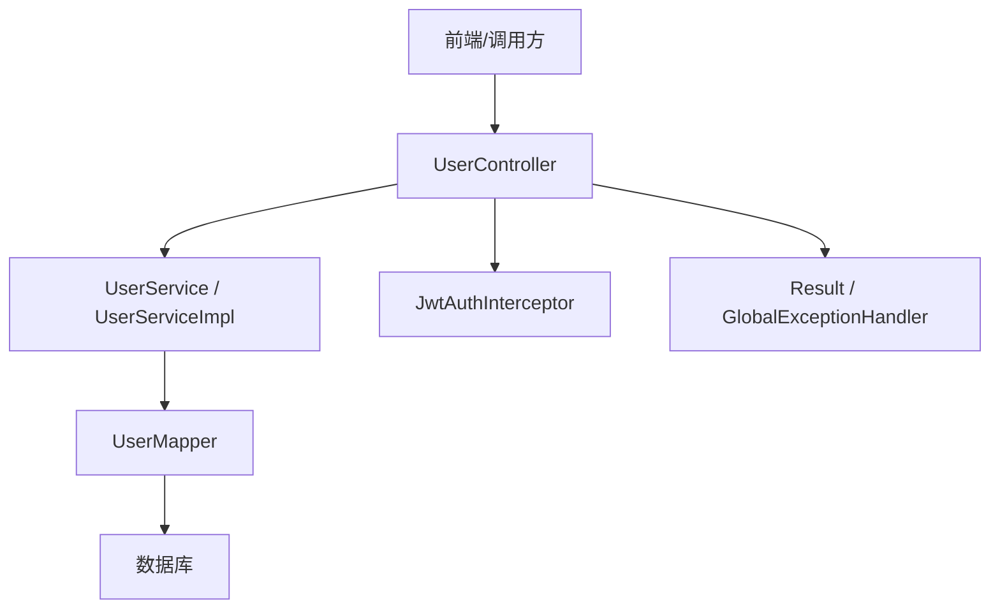
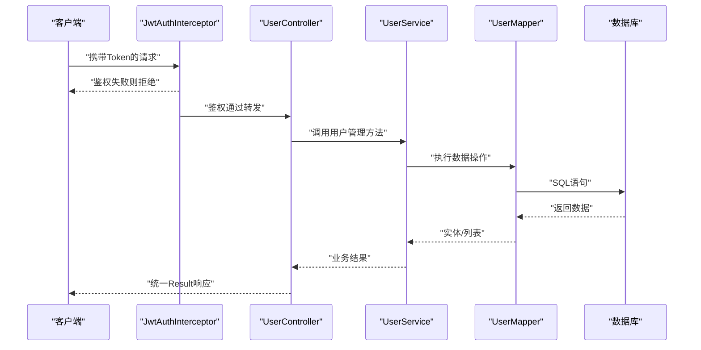
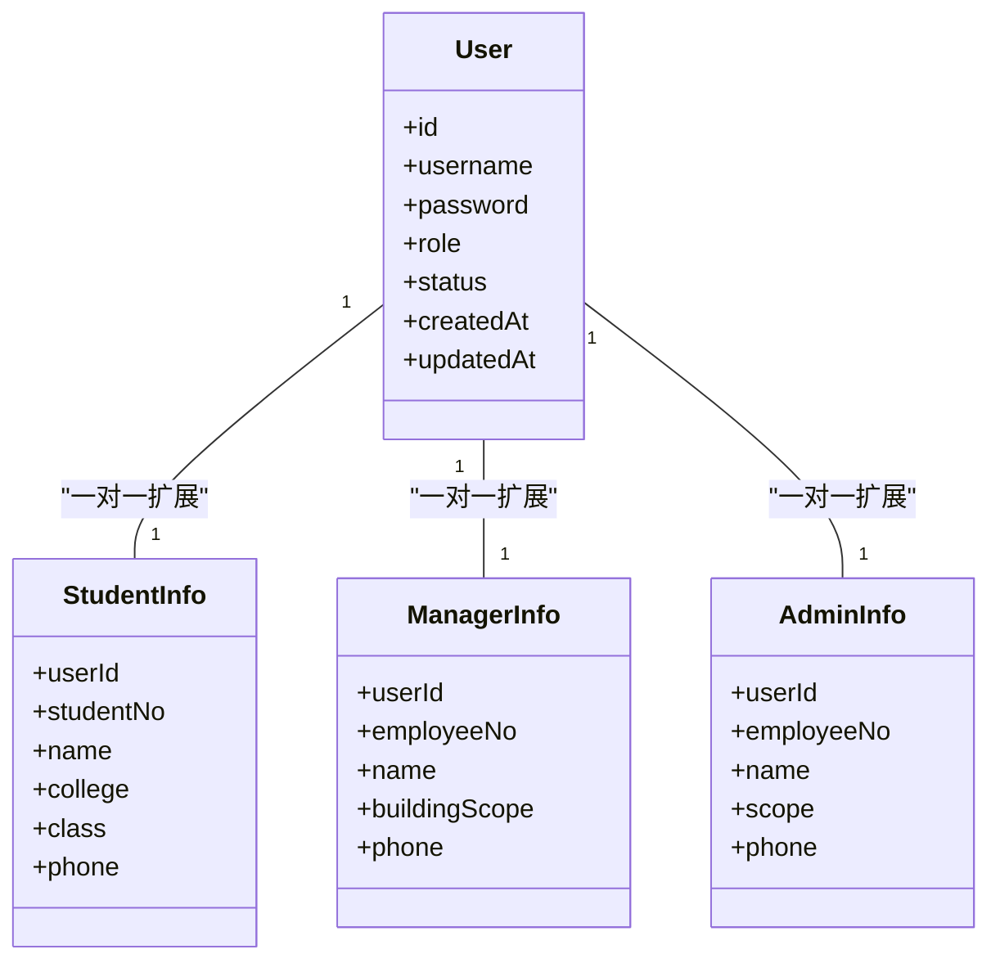
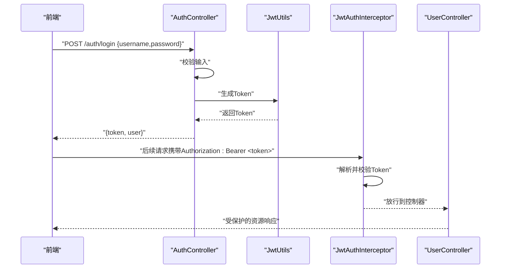
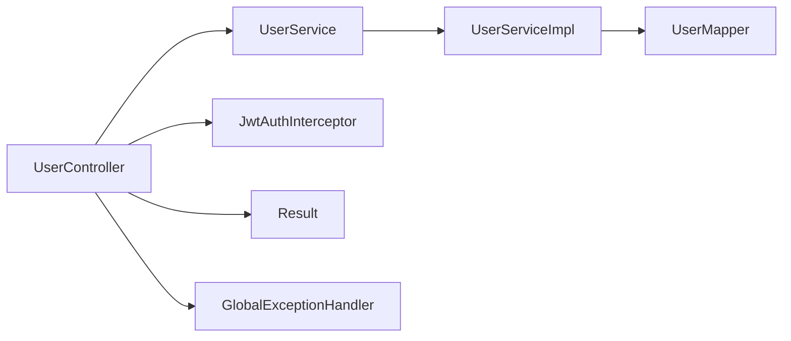

# 用户管理接口

<cite>
**本文档引用的文件**   
- [UserController.java](file://backend/src/main/java/com/dorm/backend/controller/UserController.java)
- [UserServiceImpl.java](file://backend/src/main/java/com/dorm/backend/service/impl/UserServiceImpl.java)
- [UserService.java](file://backend/src/main/java/com/dorm/backend/service/UserService.java)
- [UserMapper.java](file://backend/src/main/java/com/dorm/backend/mapper/UserMapper.java)
- [User.java](file://backend/src/main/java/com/dorm/backend/entity/User.java)
- [StudentInfo.java](file://backend/src/main/java/com/dorm/backend/entity/StudentInfo.java)
- [ManagerInfo.java](file://backend/src/main/java/com/dorm/backend/entity/ManagerInfo.java)
- [AdminInfo.java](file://backend/src/main/java/com/dorm/backend/entity/AdminInfo.java)
- [AuthController.java](file://backend/src/main/java/com/dorm/backend/controller/AuthController.java)
- [JwtUtils.java](file://backend/src/main/java/com/dorm/backend/common/JwtUtils.java)
- [JwtAuthInterceptor.java](file://backend/src/main/java/com/dorm/backend/config/JwtAuthInterceptor.java)
- [WebMvcConfig.java](file://backend/src/main/java/com/dorm/backend/config/WebMvcConfig.java)
- [GlobalExceptionHandler.java](file://backend/src/main/java/com/dorm/backend/common/GlobalExceptionHandler.java)
- [Result.java](file://backend/src/main/java/com/dorm/backend/common/Result.java)
- [application.yml](file://backend/src/main/resources/application.yml)
- [schema.sql](file://backend/src/main/resources/schema.sql)
- [user.js](file://frontend/src/api/user.js)
</cite>

## 目录
1. [简介](#简介)
2. [项目结构](#项目结构)
3. [核心组件](#核心组件)
4. [架构总览](#架构总览)
5. [详细组件分析](#详细组件分析)
6. [依赖关系分析](#依赖关系分析)
7. [性能考虑](#性能考虑)
8. [故障排查指南](#故障排查指南)
9. [结论](#结论)
10. [附录](#附录)

## 简介
本文件为 Dorm-Sys 的用户管理接口完整文档，覆盖以下能力：
- 用户信息的增删改查（CRUD）
- 用户状态管理（启用/禁用、锁定等）
- 角色与权限分配（学生、宿管、管理员）
- 批量操作与数据导入导出
- 数据验证规则与错误处理
- 隐私保护与访问控制机制
- 用户信息同步与第三方集成接口

说明：
- 本文基于后端代码结构与现有接口进行整理，未实现的接口将明确标注“待实现”。
- 所有示例请求/响应以路径与字段说明为主，不直接粘贴具体代码片段。

## 项目结构
用户管理相关模块位于后端 Java 工程，采用分层架构：
- 控制器层：暴露 REST API（UserController）
- 服务层：业务逻辑（UserService 及实现）
- 数据访问层：MyBatis Mapper（UserMapper）
- 实体层：数据库映射对象（User、StudentInfo、ManagerInfo、AdminInfo）
- 安全与鉴权：JWT 工具、拦截器、全局异常处理、统一返回体

图表来源
- [UserController.java](file://backend/src/main/java/com/dorm/backend/controller/UserController.java)
- [UserServiceImpl.java](file://backend/src/main/java/com/dorm/backend/service/impl/UserServiceImpl.java)
- [UserMapper.java](file://backend/src/main/java/com/dorm/backend/mapper/UserMapper.java)
- [JwtAuthInterceptor.java](file://backend/src/main/java/com/dorm/backend/config/JwtAuthInterceptor.java)
- [GlobalExceptionHandler.java](file://backend/src/main/java/com/dorm/backend/common/GlobalExceptionHandler.java)
- [Result.java](file://backend/src/main/java/com/dorm/backend/common/Result.java)

章节来源
- [UserController.java](file://backend/src/main/java/com/dorm/backend/controller/UserController.java)
- [UserServiceImpl.java](file://backend/src/main/java/com/dorm/backend/service/impl/UserServiceImpl.java)
- [UserMapper.java](file://backend/src/main/java/com/dorm/backend/mapper/UserMapper.java)
- [application.yml](file://backend/src/main/resources/application.yml)

## 核心组件
- 控制器：提供用户管理的 HTTP 端点，负责参数校验、权限检查、结果封装。
- 服务层：封装用户业务逻辑，包括创建、更新、删除、查询、状态变更、角色分配、批量操作、导入导出等。
- 数据访问层：通过 MyBatis 完成与数据库的交互。
- 实体模型：用户主表与角色扩展表（学生、宿管、管理员）。
- 鉴权与安全：JWT 签发与校验、拦截器鉴权、全局异常处理、统一响应格式。

章节来源
- [UserController.java](file://backend/src/main/java/com/dorm/backend/controller/UserController.java)
- [UserService.java](file://backend/src/main/java/com/dorm/backend/service/UserService.java)
- [UserServiceImpl.java](file://backend/src/main/java/com/dorm/backend/service/impl/UserServiceImpl.java)
- [UserMapper.java](file://backend/src/main/java/com/dorm/backend/mapper/UserMapper.java)
- [User.java](file://backend/src/main/java/com/dorm/backend/entity/User.java)
- [StudentInfo.java](file://backend/src/main/java/com/dorm/backend/entity/StudentInfo.java)
- [ManagerInfo.java](file://backend/src/main/java/com/dorm/backend/entity/ManagerInfo.java)
- [AdminInfo.java](file://backend/src/main/java/com/dorm/backend/entity/AdminInfo.java)
- [JwtUtils.java](file://backend/src/main/java/com/dorm/backend/common/JwtUtils.java)
- [JwtAuthInterceptor.java](file://backend/src/main/java/com/dorm/backend/config/JwtAuthInterceptor.java)
- [GlobalExceptionHandler.java](file://backend/src/main/java/com/dorm/backend/common/GlobalExceptionHandler.java)
- [Result.java](file://backend/src/main/java/com/dorm/backend/common/Result.java)

## 架构总览
用户管理接口遵循典型的 MVC + 鉴权模式：
- 客户端请求进入控制器，经 JWT 拦截器鉴权后进入服务层。
- 服务层执行业务逻辑并调用 Mapper 访问数据库。
- 统一返回 Result 包装，异常由全局处理器捕获并标准化。

图表来源
- [JwtAuthInterceptor.java](file://backend/src/main/java/com/dorm/backend/config/JwtAuthInterceptor.java)
- [UserController.java](file://backend/src/main/java/com/dorm/backend/controller/UserController.java)
- [UserServiceImpl.java](file://backend/src/main/java/com/dorm/backend/service/impl/UserServiceImpl.java)
- [UserMapper.java](file://backend/src/main/java/com/dorm/backend/mapper/UserMapper.java)

## 详细组件分析

### 用户实体与角色模型
- 用户主表（User）：存储登录账号、密码、角色类型、状态、创建时间等基础信息。
- 学生扩展（StudentInfo）：学号、姓名、学院、班级、联系方式等。
- 宿管扩展（ManagerInfo）：工号、姓名、负责楼栋、联系方式等。
- 管理员扩展（AdminInfo）：工号、姓名、权限范围、联系方式等。

图表来源
- [User.java](file://backend/src/main/java/com/dorm/backend/entity/User.java)
- [StudentInfo.java](file://backend/src/main/java/com/dorm/backend/entity/StudentInfo.java)
- [ManagerInfo.java](file://backend/src/main/java/com/dorm/backend/entity/ManagerInfo.java)
- [AdminInfo.java](file://backend/src/main/java/com/dorm/backend/entity/AdminInfo.java)

章节来源
- [User.java](file://backend/src/main/java/com/dorm/backend/entity/User.java)
- [StudentInfo.java](file://backend/src/main/java/com/dorm/backend/entity/StudentInfo.java)
- [ManagerInfo.java](file://backend/src/main/java/com/dorm/backend/entity/ManagerInfo.java)
- [AdminInfo.java](file://backend/src/main/java/com/dorm/backend/entity/AdminInfo.java)

### 认证与鉴权流程
- 登录：AuthController 接收用户名/密码，校验后使用 JwtUtils 签发 Token。
- 鉴权：JwtAuthInterceptor 解析 Token，校验有效性并注入当前用户上下文。
- 授权：根据用户角色与资源路径决定访问权限（如仅管理员可批量操作）。

图表来源
- [AuthController.java](file://backend/src/main/java/com/dorm/backend/controller/AuthController.java)
- [JwtUtils.java](file://backend/src/main/java/com/dorm/backend/common/JwtUtils.java)
- [JwtAuthInterceptor.java](file://backend/src/main/java/com/dorm/backend/config/JwtAuthInterceptor.java)

章节来源
- [AuthController.java](file://backend/src/main/java/com/dorm/backend/controller/AuthController.java)
- [JwtUtils.java](file://backend/src/main/java/com/dorm/backend/common/JwtUtils.java)
- [JwtAuthInterceptor.java](file://backend/src/main/java/com/dorm/backend/config/JwtAuthInterceptor.java)
- [WebMvcConfig.java](file://backend/src/main/java/com/dorm/backend/config/WebMvcConfig.java)

### 用户管理接口定义（CRUD、状态、角色、批量、导入导出）
以下为建议的接口清单与行为说明（若某端点在控制器中未实现，请标注“待实现”）：
- 创建用户
  - 路径：POST /api/users
  - 角色要求：管理员
  - 请求体：包含 username、password、role、status、以及对应角色的扩展字段
  - 返回：Result<User>
- 更新用户
  - 路径：PUT /api/users/{id}
  - 角色要求：管理员或本人（受限字段）
  - 请求体：允许更新的字段（如 status、角色、扩展信息）
  - 返回：Result<User>
- 删除用户
  - 路径：DELETE /api/users/{id}
  - 角色要求：管理员
  - 返回：Result<Void>
- 查询用户详情
  - 路径：GET /api/users/{id}
  - 角色要求：管理员、宿管（按范围）、本人
  - 返回：Result<User>
- 分页查询用户列表
  - 路径：GET /api/users?page=...&size=...&keyword=...
  - 角色要求：管理员、宿管（按范围）
  - 返回：Result<Page<User>>
- 修改用户状态
  - 路径：PATCH /api/users/{id}/status
  - 角色要求：管理员
  - 请求体：{status}
  - 返回：Result<Void>
- 批量操作
  - 路径：POST /api/users/batch
  - 角色要求：管理员
  - 请求体：{actions:[{op:"create|update|delete",data:...}] 或 ids:[...], op:"enable|disable"}
  - 返回：Result<BatchResult>
- 导入用户
  - 路径：POST /api/users/import
  - 角色要求：管理员
  - 请求体：multipart/form-data (Excel/CSV)
  - 返回：Result<ImportResult>
- 导出用户
  - 路径：GET /api/users/export?format=csv|xlsx
  - 角色要求：管理员
  - 返回：文件流

注意：
- 所有接口均返回统一 Result 包装，包含 code、message、data。
- 敏感字段（如 password）不应出现在响应中。
- 权限不足时返回明确的错误码与消息。

章节来源
- [UserController.java](file://backend/src/main/java/com/dorm/backend/controller/UserController.java)
- [UserServiceImpl.java](file://backend/src/main/java/com/dorm/backend/service/impl/UserServiceImpl.java)
- [Result.java](file://backend/src/main/java/com/dorm/backend/common/Result.java)

### 数据验证规则
- 必填字段：username、password（创建时）、role（创建时）
- 格式校验：
  - username：唯一、长度限制、字符集限制
  - password：复杂度要求（长度、大小写、数字、特殊字符）
  - phone：手机号格式
  - studentNo/employeeNo：唯一性
- 业务校验：
  - role 与扩展表字段匹配（学生/宿管/管理员）
  - status 合法值（如 active/inactive/locked）
  - 重复创建、重复编号、非法状态切换
- 输入过滤：防注入、XSS 防护（框架级）

章节来源
- [GlobalExceptionHandler.java](file://backend/src/main/java/com/dorm/backend/common/GlobalExceptionHandler.java)
- [UserServiceImpl.java](file://backend/src/main/java/com/dorm/backend/service/impl/UserServiceImpl.java)

### 用户状态管理
- 状态枚举：active（正常）、inactive（停用）、locked（锁定）
- 状态流转：
  - 管理员可启用/停用/锁定用户
  - 锁定用户禁止登录，需管理员解锁
  - 停用用户不可登录但保留历史数据
- 审计记录：状态变更写入操作日志

章节来源
- [UserServiceImpl.java](file://backend/src/main/java/com/dorm/backend/service/impl/UserServiceImpl.java)
- [User.java](file://backend/src/main/java/com/dorm/backend/entity/User.java)

### 角色与权限分配
- 角色类型：student（学生）、manager（宿管）、admin（管理员）
- 权限范围：
  - 管理员：全量用户管理、系统配置
  - 宿管：管辖范围内的用户与宿舍资源
  - 学生：仅自身数据可见与编辑（部分只读）
- 角色切换：
  - 管理员可为用户分配/更换角色
  - 角色变更后即时生效（下次鉴权）

章节来源
- [UserServiceImpl.java](file://backend/src/main/java/com/dorm/backend/service/impl/UserServiceImpl.java)
- [JwtAuthInterceptor.java](file://backend/src/main/java/com/dorm/backend/config/JwtAuthInterceptor.java)

### 批量操作与导入导出
- 批量操作：
  - 支持批量启用/禁用、批量删除、批量更新角色
  - 事务保证一致性，失败回滚并返回明细
- 导入：
  - 支持 Excel/CSV，模板下载与校验反馈
  - 冲突处理：跳过/覆盖/报错
- 导出：
  - 支持 CSV/XLSX，按条件筛选导出
  - 大文件分片导出与异步任务（可选）

章节来源
- [UserServiceImpl.java](file://backend/src/main/java/com/dorm/backend/service/impl/UserServiceImpl.java)
- [UserMapper.java](file://backend/src/main/java/com/dorm/backend/mapper/UserMapper.java)

### 隐私保护与访问控制
- 传输加密：HTTPS 强制（部署配置）
- 敏感字段脱敏：手机号、身份证号在响应中脱敏
- 最小权限原则：按角色与范围限制数据可见性
- 审计追踪：关键操作记录操作人、时间、IP、变更前后值
- 密码安全：服务端哈希存储，禁止明文落库

章节来源
- [JwtAuthInterceptor.java](file://backend/src/main/java/com/dorm/backend/config/JwtAuthInterceptor.java)
- [GlobalExceptionHandler.java](file://backend/src/main/java/com/dorm/backend/common/GlobalExceptionHandler.java)
- [application.yml](file://backend/src/main/resources/application.yml)

### 用户信息同步与第三方集成
- 校内身份源同步：
  - 定时任务从教务/人事系统拉取用户信息
  - 增量同步策略：按更新时间戳或流水号
- 第三方集成：
  - 提供标准 REST 接口供外部系统订阅用户变更事件
  - 支持 Webhook 回调或消息队列推送
- 数据一致性：
  - 幂等设计，避免重复同步
  - 冲突解决策略：本地优先/远端优先/人工介入

章节来源
- [UserServiceImpl.java](file://backend/src/main/java/com/dorm/backend/service/impl/UserServiceImpl.java)
- [UserMapper.java](file://backend/src/main/java/com/dorm/backend/mapper/UserMapper.java)

### 前端对接要点
- 前端 API 封装：user.js 中定义用户相关请求方法
- 鉴权头：Authorization: Bearer <token>
- 错误处理：统一提示与重试策略
- 表单校验：前端二次校验提升用户体验

章节来源
- [user.js](file://frontend/src/api/user.js)

## 依赖关系分析
用户管理模块依赖关系如下：
- UserController 依赖 UserService
- UserServiceImpl 依赖 UserMapper
- 鉴权依赖 JwtAuthInterceptor 与 JwtUtils
- 统一响应与异常处理依赖 Result 与 GlobalExceptionHandler

图表来源
- [UserController.java](file://backend/src/main/java/com/dorm/backend/controller/UserController.java)
- [UserServiceImpl.java](file://backend/src/main/java/com/dorm/backend/service/impl/UserServiceImpl.java)
- [UserMapper.java](file://backend/src/main/java/com/dorm/backend/mapper/UserMapper.java)
- [JwtAuthInterceptor.java](file://backend/src/main/java/com/dorm/backend/config/JwtAuthInterceptor.java)
- [Result.java](file://backend/src/main/java/com/dorm/backend/common/Result.java)
- [GlobalExceptionHandler.java](file://backend/src/main/java/com/dorm/backend/common/GlobalExceptionHandler.java)

章节来源
- [UserController.java](file://backend/src/main/java/com/dorm/backend/controller/UserController.java)
- [UserServiceImpl.java](file://backend/src/main/java/com/dorm/backend/service/impl/UserServiceImpl.java)
- [UserMapper.java](file://backend/src/main/java/com/dorm/backend/mapper/UserMapper.java)

## 性能考虑
- 分页查询：默认分页，避免一次性加载大量数据
- 索引优化：对常用查询字段建立索引（username、studentNo、employeeNo、status）
- 缓存策略：热点用户信息可短期缓存（Redis），注意失效与一致性
- 批量操作：分批提交，减少事务粒度
- 导入导出：大文件异步处理，避免阻塞主线程

[本节为通用指导，无需特定文件引用]

## 故障排查指南
常见问题与定位步骤：
- 鉴权失败：检查 Token 是否过期、签名是否正确、拦截器配置是否生效
- 权限不足：确认用户角色与资源路径的授权规则
- 数据不一致：查看操作日志与审计记录，核对事务边界
- 导入失败：检查模板格式、必填字段、唯一性约束
- 性能问题：慢查询分析、索引缺失、N+1 查询

章节来源
- [GlobalExceptionHandler.java](file://backend/src/main/java/com/dorm/backend/common/GlobalExceptionHandler.java)
- [JwtAuthInterceptor.java](file://backend/src/main/java/com/dorm/backend/config/JwtAuthInterceptor.java)
- [UserServiceImpl.java](file://backend/src/main/java/com/dorm/backend/service/impl/UserServiceImpl.java)

## 结论
本文件系统化梳理了 Dorm-Sys 用户管理接口的架构、数据模型、鉴权机制、CRUD 与批量操作、导入导出、隐私保护与同步集成等内容。建议在实施过程中：
- 严格遵循统一返回与异常处理规范
- 完善权限与范围控制，确保数据安全
- 强化导入导出的健壮性与可观测性
- 持续优化性能与监控告警

[本节为总结性内容，无需特定文件引用]

## 附录

### 数据库表结构参考
- 用户主表与角色扩展表的关系见实体类定义
- 关键字段与约束请参考 schema.sql

章节来源
- [schema.sql](file://backend/src/main/resources/schema.sql)
- [User.java](file://backend/src/main/java/com/dorm/backend/entity/User.java)
- [StudentInfo.java](file://backend/src/main/java/com/dorm/backend/entity/StudentInfo.java)
- [ManagerInfo.java](file://backend/src/main/java/com/dorm/backend/entity/ManagerInfo.java)
- [AdminInfo.java](file://backend/src/main/java/com/dorm/backend/entity/AdminInfo.java)

### 配置与环境
- 应用配置：application.yml 中包含端口、数据库、JWT 等关键配置
- CORS 与拦截器注册：WebMvcConfig 中配置跨域与鉴权拦截器

章节来源
- [application.yml](file://backend/src/main/resources/application.yml)
- [WebMvcConfig.java](file://backend/src/main/java/com/dorm/backend/config/WebMvcConfig.java)