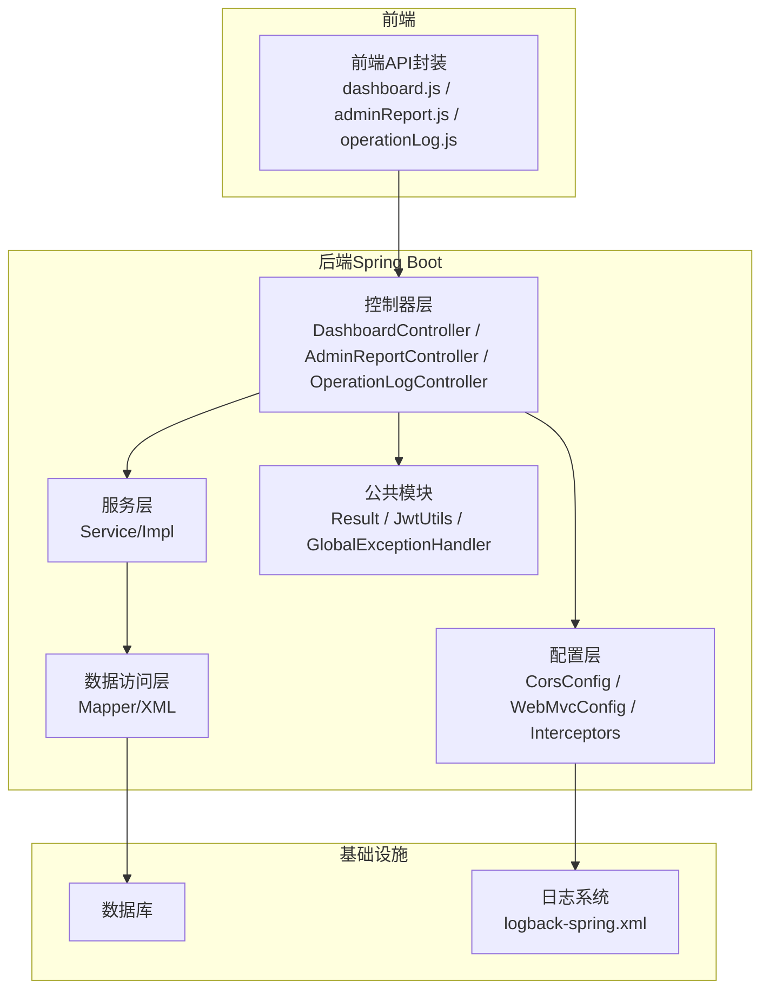
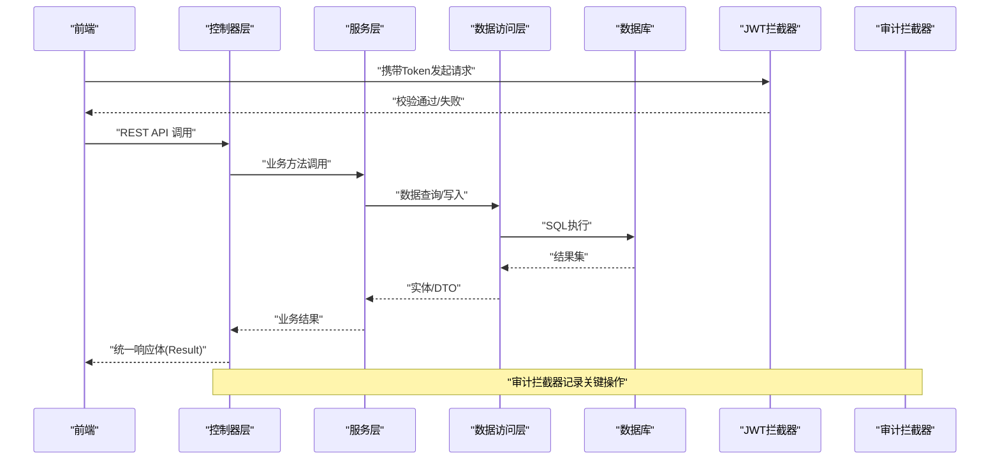
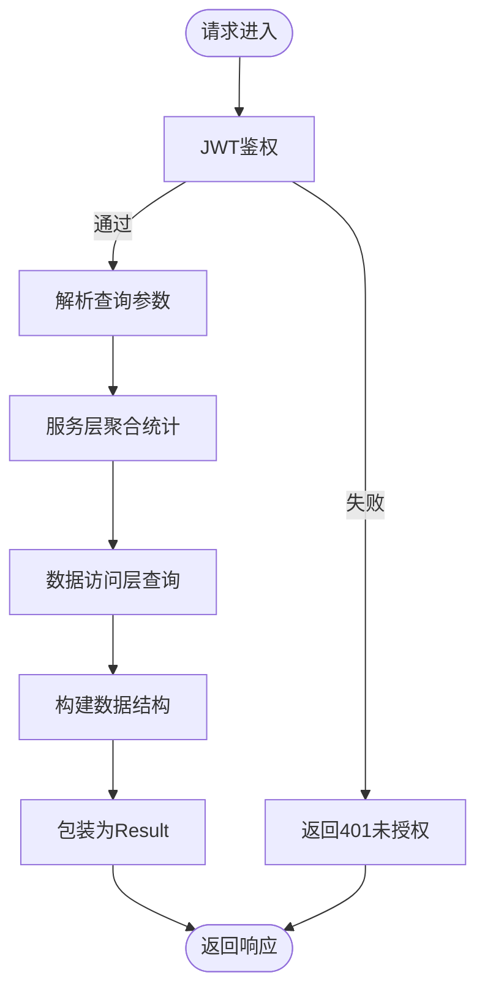
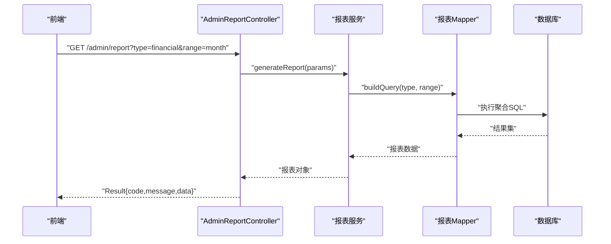
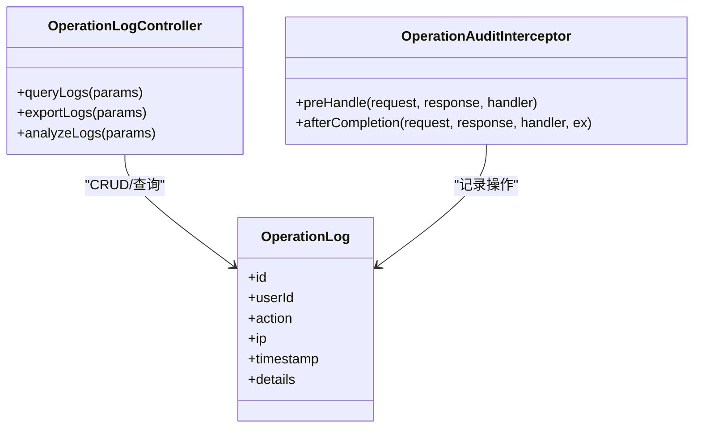
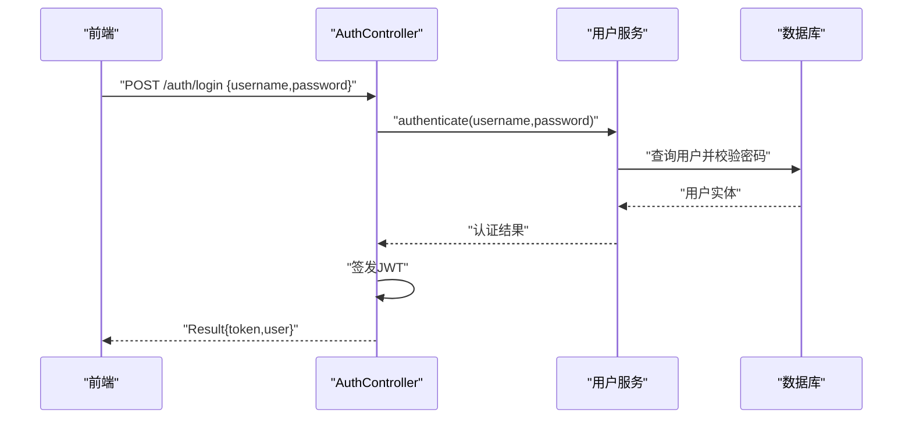
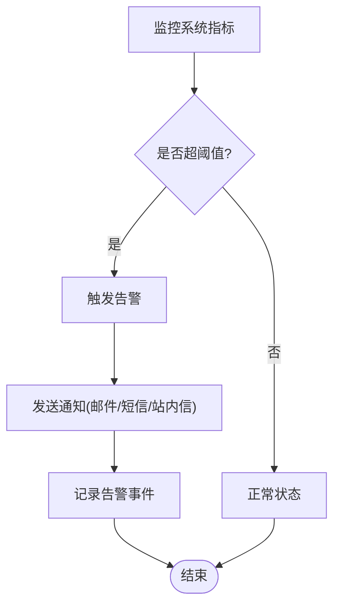
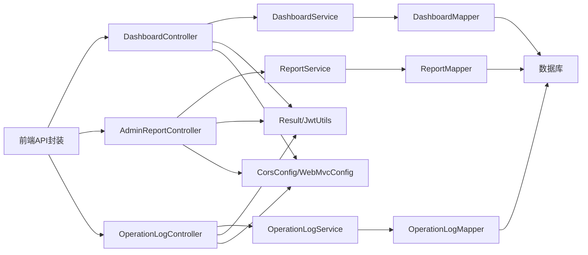

# 管理仪表盘接口

<cite>
**本文引用的文件**   
- [DashboardController.java](file://backend/src/main/java/com/dorm/backend/controller/DashboardController.java)
- [AdminReportController.java](file://backend/src/main/java/com/dorm/backend/controller/AdminReportController.java)
- [OperationLogController.java](file://backend/src/main/java/com/dorm/backend/controller/OperationLogController.java)
- [AuthController.java](file://backend/src/main/java/com/dorm/backend/controller/AuthController.java)
- [GlobalExceptionHandler.java](file://backend/src/main/java/com/dorm/backend/common/GlobalExceptionHandler.java)
- [JwtUtils.java](file://backend/src/main/java/com/dorm/backend/common/JwtUtils.java)
- [Result.java](file://backend/src/main/java/com/dorm/backend/common/Result.java)
- [CorsConfig.java](file://backend/src/main/java/com/dorm/backend/config/CorsConfig.java)
- [JwtAuthInterceptor.java](file://backend/src/main/java/com/dorm/backend/config/JwtAuthInterceptor.java)
- [OperationAuditInterceptor.java](file://backend/src/main/java/com/dorm/backend/config/OperationAuditInterceptor.java)
- [WebMvcConfig.java](file://backend/src/main/java/com/dorm/backend/config/WebMvcConfig.java)
- [Application.yml](file://backend/src/main/resources/application.yml)
- [logback-spring.xml](file://backend/src/main/resources/logback-spring.xml)
- [schema.sql](file://backend/src/main/resources/schema.sql)
- [dashboard.js](file://frontend/src/api/dashboard.js)
- [adminReport.js](file://frontend/src/api/adminReport.js)
- [operationLog.js](file://frontend/src/api/operationLog.js)
</cite>

## 目录
1. [简介](#简介)
2. [项目结构](#项目结构)
3. [核心组件](#核心组件)
4. [架构总览](#架构总览)
5. [详细组件分析](#详细组件分析)
6. [依赖关系分析](#依赖关系分析)
7. [性能考虑](#性能考虑)
8. [故障排查指南](#故障排查指南)
9. [结论](#结论)
10. [附录](#附录)

## 简介
本文件为 Dorm-Sys 管理仪表盘接口的完整技术文档，覆盖系统概览、数据统计、报表生成、操作日志审计与分析、健康监控与告警通知、数据导出与可视化图表等管理功能。文档从系统架构、组件职责、数据流、处理逻辑、集成点、错误处理与性能特性等维度进行系统化说明，并提供可操作的排障建议与最佳实践。

## 项目结构
后端采用 Spring Boot + MyBatis 的分层架构：
- 控制器层（controller）：对外暴露 REST API，包括仪表盘、报表、操作日志、认证等。
- 服务层（service/impl）：业务编排与领域逻辑实现。
- 数据访问层（mapper）：MyBatis Mapper 接口及 XML 映射。
- 公共模块（common）：统一响应体、JWT 工具、全局异常处理等。
- 配置（config）：跨域、拦截器、MVC 配置等。
- 资源（resources）：应用配置、日志配置、数据库初始化脚本等。

前端通过 Vue 工程调用后端 API，相关接口封装位于 frontend/src/api 目录下。

**图示来源** 
- [DashboardController.java](file://backend/src/main/java/com/dorm/backend/controller/DashboardController.java)
- [AdminReportController.java](file://backend/src/main/java/com/dorm/backend/controller/AdminReportController.java)
- [OperationLogController.java](file://backend/src/main/java/com/dorm/backend/controller/OperationLogController.java)
- [CorsConfig.java](file://backend/src/main/java/com/dorm/backend/config/CorsConfig.java)
- [WebMvcConfig.java](file://backend/src/main/java/com/dorm/backend/config/WebMvcConfig.java)
- [JwtAuthInterceptor.java](file://backend/src/main/java/com/dorm/backend/config/JwtAuthInterceptor.java)
- [OperationAuditInterceptor.java](file://backend/src/main/java/com/dorm/backend/config/OperationAuditInterceptor.java)
- [Result.java](file://backend/src/main/java/com/dorm/backend/common/Result.java)
- [JwtUtils.java](file://backend/src/main/java/com/dorm/backend/common/JwtUtils.java)
- [GlobalExceptionHandler.java](file://backend/src/main/java/com/dorm/backend/common/GlobalExceptionHandler.java)
- [logback-spring.xml](file://backend/src/main/resources/logback-spring.xml)

**章节来源**
- [application.yml](file://backend/src/main/resources/application.yml)
- [schema.sql](file://backend/src/main/resources/schema.sql)

## 核心组件
- 仪表盘控制器（DashboardController）：提供系统概览、关键指标统计、实时状态查询等接口。
- 管理报表控制器（AdminReportController）：提供多维度报表生成、汇总统计、导出能力。
- 操作日志控制器（OperationLogController）：提供操作日志的查询、筛选、审计与分析接口。
- 认证控制器（AuthController）：提供登录、鉴权、令牌签发与校验支持。
- 公共模块（Result/JwtUtils/GlobalExceptionHandler）：统一返回格式、JWT 工具、全局异常处理。
- 配置与拦截器（CorsConfig/WebMvcConfig/JwtAuthInterceptor/OperationAuditInterceptor）：跨域、权限校验、审计记录。

**章节来源**
- [DashboardController.java](file://backend/src/main/java/com/dorm/backend/controller/DashboardController.java)
- [AdminReportController.java](file://backend/src/main/java/com/dorm/backend/controller/AdminReportController.java)
- [OperationLogController.java](file://backend/src/main/java/com/dorm/backend/controller/OperationLogController.java)
- [AuthController.java](file://backend/src/main/java/com/dorm/backend/controller/AuthController.java)
- [Result.java](file://backend/src/main/java/com/dorm/backend/common/Result.java)
- [JwtUtils.java](file://backend/src/main/java/com/dorm/backend/common/JwtUtils.java)
- [GlobalExceptionHandler.java](file://backend/src/main/java/com/dorm/backend/common/GlobalExceptionHandler.java)
- [CorsConfig.java](file://backend/src/main/java/com/dorm/backend/config/CorsConfig.java)
- [WebMvcConfig.java](file://backend/src/main/java/com/dorm/backend/config/WebMvcConfig.java)
- [JwtAuthInterceptor.java](file://backend/src/main/java/com/dorm/backend/config/JwtAuthInterceptor.java)
- [OperationAuditInterceptor.java](file://backend/src/main/java/com/dorm/backend/config/OperationAuditInterceptor.java)

## 架构总览
整体采用前后端分离架构，前端通过 HTTP 调用后端 REST API；后端在控制器层接收请求，经服务层处理业务逻辑，再通过数据访问层持久化到数据库。安全方面通过 JWT 拦截器进行身份验证与授权，审计拦截器记录关键操作。日志由 logback 输出，便于问题定位与审计。

**图示来源** 
- [DashboardController.java](file://backend/src/main/java/com/dorm/backend/controller/DashboardController.java)
- [AdminReportController.java](file://backend/src/main/java/com/dorm/backend/controller/AdminReportController.java)
- [OperationLogController.java](file://backend/src/main/java/com/dorm/backend/controller/OperationLogController.java)
- [JwtAuthInterceptor.java](file://backend/src/main/java/com/dorm/backend/config/JwtAuthInterceptor.java)
- [OperationAuditInterceptor.java](file://backend/src/main/java/com/dorm/backend/config/OperationAuditInterceptor.java)

## 详细组件分析

### 仪表盘接口（DashboardController）
- 功能范围
  - 系统概览：用户数、房间数、床位占用率、报修单数量、访客记录等基础统计。
  - 实时状态：在线人数、当前活跃会话、系统负载等。
  - 趋势数据：近N日入住/退宿/报修趋势。
- 数据源与计算逻辑
  - 统计数据来源于各业务表（如用户、房间、床位、报修、访客等），通过聚合函数或计数统计得出。
  - 趋势数据按时间维度分组统计，通常使用日期字段进行 GROUP BY。
- 展示格式
  - 统一响应体 Result，包含 code、message、data；data 为结构化对象或列表。
- 权限与安全
  - 需要管理员角色访问，JWT 拦截器校验 Token，未授权返回 401/403。
- 典型流程
  - 前端请求 -> JWT 校验 -> 控制器解析参数 -> 服务层聚合统计 -> 数据访问层查询 -> 返回统一结果。

**图示来源** 
- [DashboardController.java](file://backend/src/main/java/com/dorm/backend/controller/DashboardController.java)
- [JwtAuthInterceptor.java](file://backend/src/main/java/com/dorm/backend/config/JwtAuthInterceptor.java)
- [Result.java](file://backend/src/main/java/com/dorm/backend/common/Result.java)

**章节来源**
- [DashboardController.java](file://backend/src/main/java/com/dorm/backend/controller/DashboardController.java)
- [dashboard.js](file://frontend/src/api/dashboard.js)

### 管理报表接口（AdminReportController）
- 功能范围
  - 多维报表：按楼栋、房间、时间段、费用类型等维度生成报表。
  - 汇总统计：收入、支出、欠费、逾期等财务指标。
  - 导出能力：支持 CSV/Excel 导出（若实现）。
- 数据源与计算逻辑
  - 数据来源包括费用账单、业务记录、住宿历史等，通过多表关联与聚合计算。
  - 复杂报表可能涉及窗口函数、子查询、临时表优化。
- 展示格式
  - 统一响应体 Result，data 为报表数据集或下载链接。
- 权限与安全
  - 仅管理员可访问，需具备特定权限标识。
- 典型流程
  - 前端请求 -> 权限校验 -> 参数校验 -> 服务层组装查询 -> 数据访问层执行 -> 结果封装与导出。

**图示来源** 
- [AdminReportController.java](file://backend/src/main/java/com/dorm/backend/controller/AdminReportController.java)

**章节来源**
- [AdminReportController.java](file://backend/src/main/java/com/dorm/backend/controller/AdminReportController.java)
- [adminReport.js](file://frontend/src/api/adminReport.js)

### 操作日志接口（OperationLogController）
- 功能范围
  - 日志查询：按用户、时间、操作类型、IP 等条件筛选。
  - 审计分析：高频操作、异常操作、风险行为识别。
  - 导出与归档：支持批量导出与长期归档。
- 数据源与计算逻辑
  - 日志数据由审计拦截器自动记录，存储于操作日志表。
  - 分析接口对日志进行聚合、去重、排序与分页。
- 展示格式
  - 统一响应体 Result，data 为日志列表或分析结果。
- 权限与安全
  - 仅管理员可访问，敏感字段脱敏显示。
- 典型流程
  - 前端请求 -> 权限校验 -> 参数校验 -> 服务层查询/分析 -> 数据访问层执行 -> 返回结果。

**图示来源** 
- [OperationLogController.java](file://backend/src/main/java/com/dorm/backend/controller/OperationLogController.java)
- [OperationAuditInterceptor.java](file://backend/src/main/java/com/dorm/backend/config/OperationAuditInterceptor.java)

**章节来源**
- [OperationLogController.java](file://backend/src/main/java/com/dorm/backend/controller/OperationLogController.java)
- [operationLog.js](file://frontend/src/api/operationLog.js)

### 认证与权限（AuthController + JwtAuthInterceptor）
- 功能范围
  - 登录认证：用户名密码校验，签发 JWT。
  - 权限控制：基于角色的访问控制（RBAC），拦截器校验 Token 与权限。
- 数据源与计算逻辑
  - 用户信息从用户表读取，密码加密比对。
  - JWT 包含用户标识、角色、过期时间等信息。
- 展示格式
  - 统一响应体 Result，data 包含 token 与用户基本信息。
- 安全策略
  - Token 有效期、刷新机制、黑名单（可选）、防重放攻击。

**图示来源** 
- [AuthController.java](file://backend/src/main/java/com/dorm/backend/controller/AuthController.java)
- [JwtUtils.java](file://backend/src/main/java/com/dorm/backend/common/JwtUtils.java)
- [JwtAuthInterceptor.java](file://backend/src/main/java/com/dorm/backend/config/JwtAuthInterceptor.java)

**章节来源**
- [AuthController.java](file://backend/src/main/java/com/dorm/backend/controller/AuthController.java)
- [JwtUtils.java](file://backend/src/main/java/com/dorm/backend/common/JwtUtils.java)
- [JwtAuthInterceptor.java](file://backend/src/main/java/com/dorm/backend/config/JwtAuthInterceptor.java)

### 健康监控与告警（Health & Alert）
- 健康检查
  - 提供 /health 或类似端点，返回系统状态、数据库连接、磁盘空间等。
- 性能指标
  - 暴露 JVM、线程池、GC、慢查询等指标（可通过 Actuator 或自定义端点）。
- 告警通知
  - 阈值触发后发送通知（邮件、短信、站内信），记录告警事件。
- 数据源与计算逻辑
  - 指标采集自系统运行时与数据库监控。
  - 告警规则配置化，支持动态调整。
- 展示格式
  - 统一响应体 Result，data 为状态对象或告警列表。

[此图为概念性流程图，不直接映射具体源码文件]

## 依赖关系分析
- 控制器依赖服务层，服务层依赖数据访问层，数据访问层依赖数据库。
- 拦截器（JWT、审计）横切关注点，贯穿所有受保护接口。
- 统一响应体与异常处理确保接口一致性。
- 前端 API 封装与后端控制器一一对应。

**图示来源** 
- [DashboardController.java](file://backend/src/main/java/com/dorm/backend/controller/DashboardController.java)
- [AdminReportController.java](file://backend/src/main/java/com/dorm/backend/controller/AdminReportController.java)
- [OperationLogController.java](file://backend/src/main/java/com/dorm/backend/controller/OperationLogController.java)
- [Result.java](file://backend/src/main/java/com/dorm/backend/common/Result.java)
- [JwtUtils.java](file://backend/src/main/java/com/dorm/backend/common/JwtUtils.java)
- [CorsConfig.java](file://backend/src/main/java/com/dorm/backend/config/CorsConfig.java)
- [WebMvcConfig.java](file://backend/src/main/java/com/dorm/backend/config/WebMvcConfig.java)

**章节来源**
- [application.yml](file://backend/src/main/resources/application.yml)
- [schema.sql](file://backend/src/main/resources/schema.sql)

## 性能考虑
- 查询优化
  - 合理使用索引，避免全表扫描；对常用过滤字段建立复合索引。
  - 分页查询限制返回条数，避免一次性加载大量数据。
- 缓存策略
  - 对热点统计数据使用缓存（如 Redis），降低数据库压力。
  - 设置合理的缓存过期时间与失效策略。
- 异步处理
  - 报表生成、日志导出等耗时操作采用异步任务队列。
- 连接池与线程池
  - 合理配置数据库连接池大小与线程池容量，避免资源耗尽。
- 监控与调优
  - 启用慢查询日志，定期分析 SQL 性能。
  - 使用 APM 工具监控接口响应时间与资源消耗。

[本节为通用性能指导，无需特定文件引用]

## 故障排查指南
- 常见问题
  - 401 未授权：检查 Token 是否有效、是否过期、是否携带正确 Header。
  - 403 无权限：确认用户角色与接口权限匹配。
  - 500 服务器错误：查看全局异常处理器日志与服务层堆栈。
  - 跨域错误：检查 CorsConfig 配置与前端请求头。
- 日志定位
  - 查看 application 日志与审计日志，定位请求链路。
  - 开启调试级别日志，复现问题时收集上下文。
- 数据库问题
  - 检查连接池配置与慢查询日志。
  - 分析执行计划，优化 SQL 语句。
- 安全加固
  - 强制 HTTPS，禁用弱加密算法。
  - 输入校验与输出编码，防止注入与 XSS。

**章节来源**
- [GlobalExceptionHandler.java](file://backend/src/main/java/com/dorm/backend/common/GlobalExceptionHandler.java)
- [logback-spring.xml](file://backend/src/main/resources/logback-spring.xml)
- [CorsConfig.java](file://backend/src/main/java/com/dorm/backend/config/CorsConfig.java)

## 结论
Dorm-Sys 管理仪表盘接口采用清晰的分层架构与统一的响应格式，结合 JWT 鉴权与审计拦截器，提供了安全、可扩展的管理功能。通过合理的性能优化与监控手段，能够支撑高并发与大数据量场景。建议在生产环境完善健康检查、告警通知与数据备份策略，确保系统稳定运行。

[本节为总结性内容，无需特定文件引用]

## 附录
- 接口清单
  - 仪表盘：系统概览、统计指标、趋势数据。
  - 报表：多维报表、财务汇总、导出功能。
  - 操作日志：查询、分析、导出。
  - 认证：登录、鉴权、令牌管理。
- 数据模型
  - 用户、房间、床位、报修、访客、费用账单、操作日志等实体。
- 配置项
  - 数据库连接、JWT 密钥、跨域配置、日志级别等。

[本节为补充信息，无需特定文件引用]