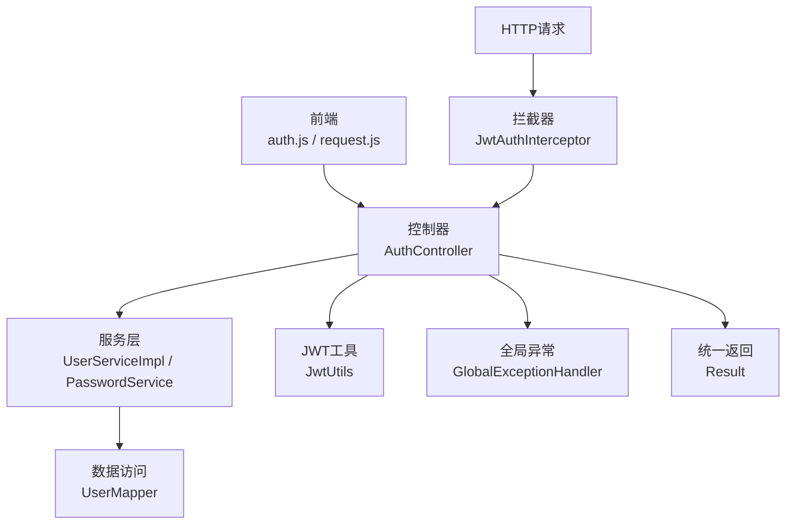
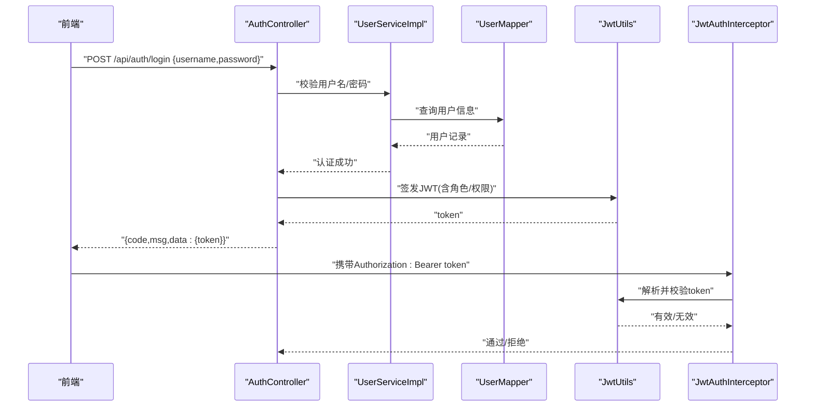
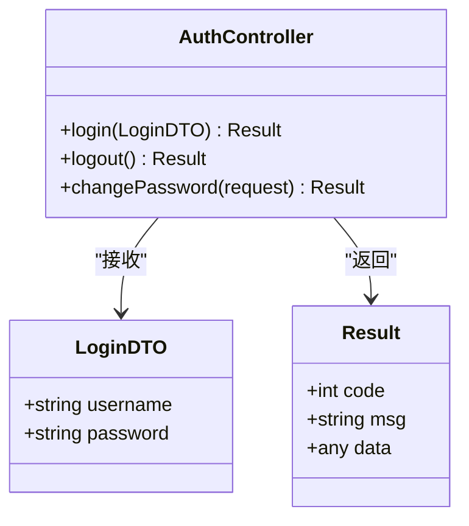
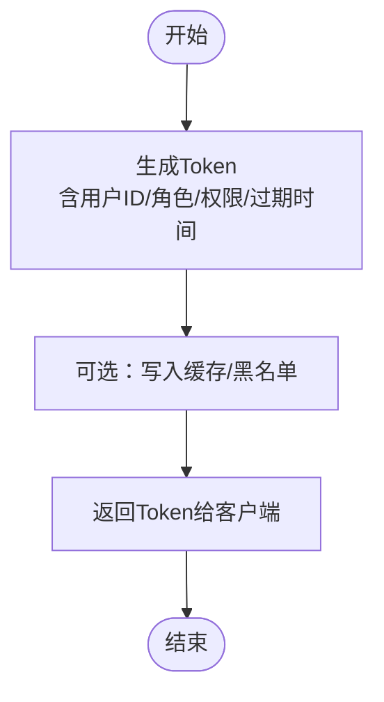
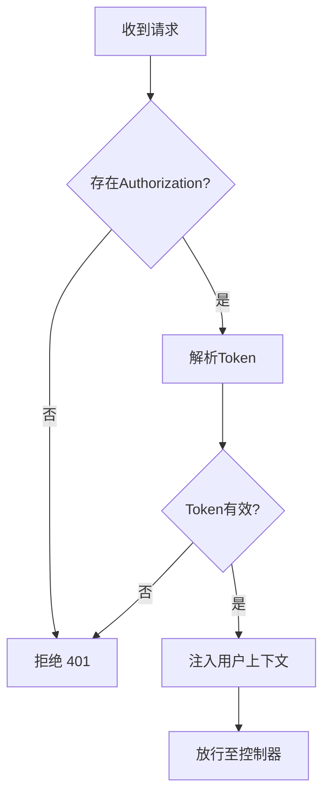
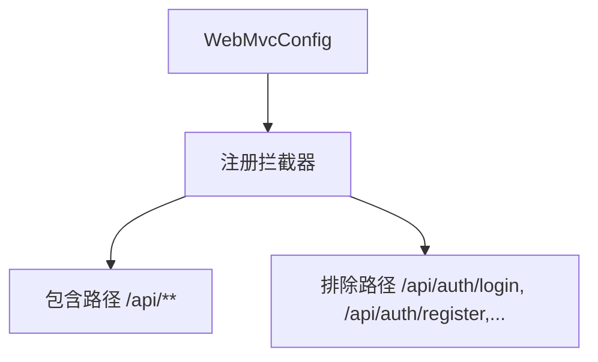
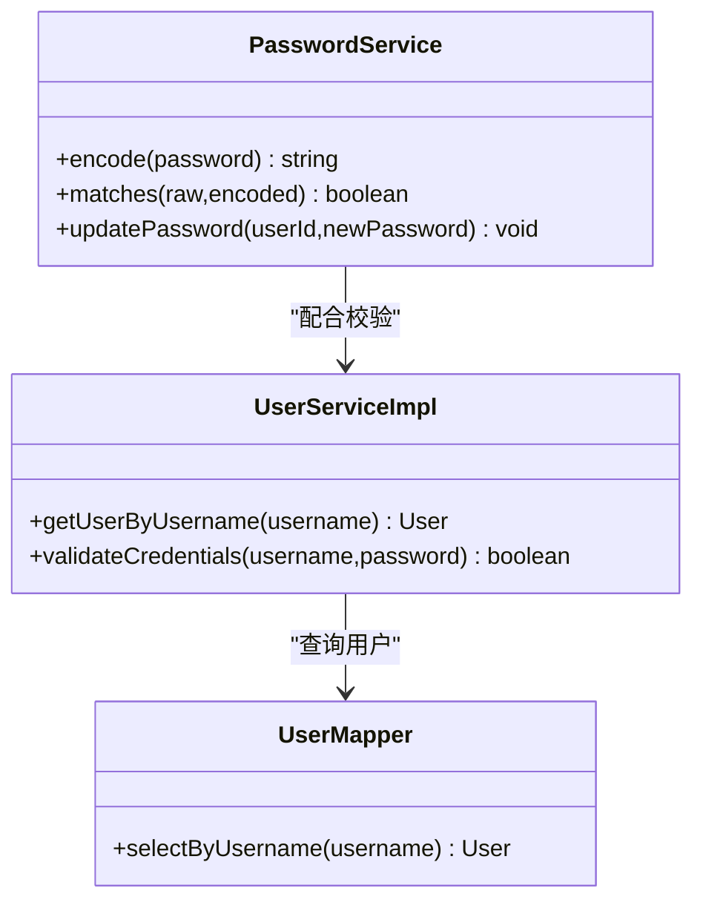
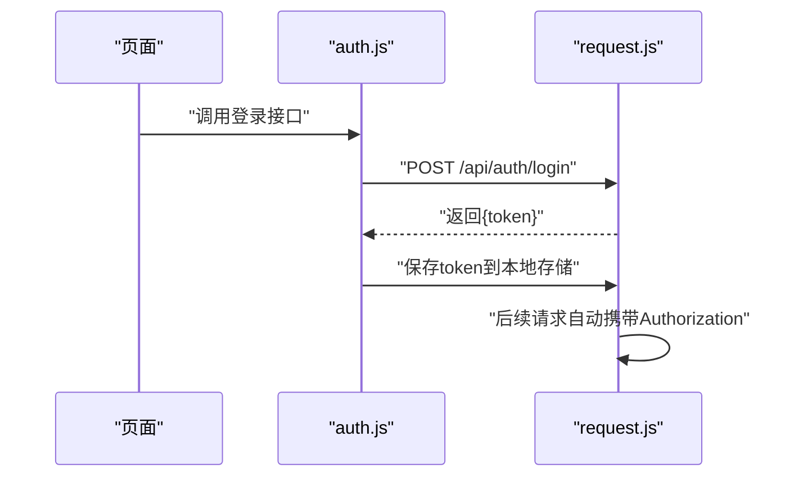
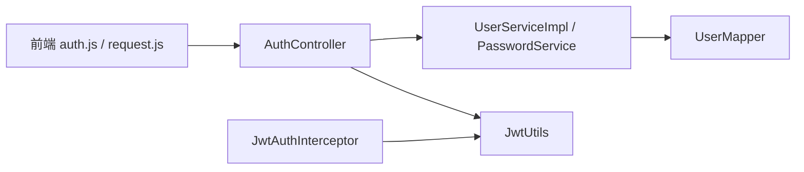

# 认证授权接口

<cite>
**本文引用的文件**   
- [AuthController.java](file://backend/src/main/java/com/dorm/backend/controller/AuthController.java)
- [JwtUtils.java](file://backend/src/main/java/com/dorm/backend/common/JwtUtils.java)
- [JwtAuthInterceptor.java](file://backend/src/main/java/com/dorm/backend/config/JwtAuthInterceptor.java)
- [WebMvcConfig.java](file://backend/src/main/java/com/dorm/backend/config/WebMvcConfig.java)
- [LoginDTO.java](file://backend/src/main/java/com/dorm/backend/dto/LoginDTO.java)
- [User.java](file://backend/src/main/java/com/dorm/backend/entity/User.java)
- [UserMapper.java](file://backend/src/main/java/com/dorm/backend/mapper/UserMapper.java)
- [UserService.java](file://backend/src/main/java/com/dorm/backend/service/UserService.java)
- [UserServiceImpl.java](file://backend/src/main/java/com/dorm/backend/service/impl/UserServiceImpl.java)
- [PasswordService.java](file://backend/src/main/java/com/dorm/backend/service/PasswordService.java)
- [GlobalExceptionHandler.java](file://backend/src/main/java/com/dorm/backend/common/GlobalExceptionHandler.java)
- [Result.java](file://backend/src/main/java/com/dorm/backend/common/Result.java)
- [auth.js](file://frontend/src/api/auth.js)
- [request.js](file://frontend/src/utils/request.js)
- [application.yml](file://backend/src/main/resources/application.yml)
</cite>

## 目录
1. [简介](#简介)
2. [项目结构](#项目结构)
3. [核心组件](#核心组件)
4. [架构总览](#架构总览)
5. [详细组件分析](#详细组件分析)
6. [依赖关系分析](#依赖关系分析)
7. [性能考虑](#性能考虑)
8. [故障排查指南](#故障排查指南)
9. [结论](#结论)
10. [附录](#附录)

## 简介
本文件为 Dorm-Sys 的认证与授权接口文档，覆盖用户登录、登出、密码修改等认证相关端点；详细说明 JWT 令牌的生成、验证与刷新机制；阐述身份验证流程、权限控制策略与安全防护措施；提供完整的请求响应示例（成功登录、无效凭证、令牌过期等场景）；说明多角色用户的权限模型与访问控制规则；并给出安全最佳实践与常见安全问题防护指南。

## 项目结构
后端采用 Spring Boot + MyBatis 分层架构：
- 控制器层：处理 HTTP 请求，如 AuthController
- 服务层：业务逻辑封装，如 UserServiceImpl、PasswordService
- 数据访问层：MyBatis Mapper，如 UserMapper
- 公共组件：JWT 工具类 JwtUtils、拦截器 JwtAuthInterceptor、全局异常处理器 GlobalExceptionHandler、统一返回体 Result
- 配置：WebMvcConfig（注册拦截器与放行路径）、application.yml（应用配置）
- 前端：auth.js（调用认证接口）、request.js（HTTP 客户端，携带 Token）

**图表来源** 
- [AuthController.java](file://backend/src/main/java/com/dorm/backend/controller/AuthController.java)
- [JwtUtils.java](file://backend/src/main/java/com/dorm/backend/common/JwtUtils.java)
- [JwtAuthInterceptor.java](file://backend/src/main/java/com/dorm/backend/config/JwtAuthInterceptor.java)
- [WebMvcConfig.java](file://backend/src/main/java/com/dorm/backend/config/WebMvcConfig.java)
- [UserServiceImpl.java](file://backend/src/main/java/com/dorm/backend/service/impl/UserServiceImpl.java)
- [PasswordService.java](file://backend/src/main/java/com/dorm/backend/service/PasswordService.java)
- [UserMapper.java](file://backend/src/main/java/com/dorm/backend/mapper/UserMapper.java)
- [GlobalExceptionHandler.java](file://backend/src/main/java/com/dorm/backend/common/GlobalExceptionHandler.java)
- [Result.java](file://backend/src/main/java/com/dorm/backend/common/Result.java)

**章节来源**
- [AuthController.java](file://backend/src/main/java/com/dorm/backend/controller/AuthController.java)
- [JwtUtils.java](file://backend/src/main/java/com/dorm/backend/common/JwtUtils.java)
- [JwtAuthInterceptor.java](file://backend/src/main/java/com/dorm/backend/config/JwtAuthInterceptor.java)
- [WebMvcConfig.java](file://backend/src/main/java/com/dorm/backend/config/WebMvcConfig.java)
- [application.yml](file://backend/src/main/resources/application.yml)

## 核心组件
- 认证控制器 AuthController：暴露登录、登出、密码修改等接口
- JWT 工具 JwtUtils：负责令牌签发、解析、校验与过期判断
- 拦截器 JwtAuthInterceptor：在请求进入控制器前校验 Token，注入当前用户上下文
- 配置 WebMvcConfig：注册拦截器，配置白名单（如登录、注册等公开接口）
- 服务层 UserServiceImpl 与 PasswordService：用户查询、密码校验与修改
- 数据访问 UserMapper：用户实体映射与数据库交互
- 全局异常 GlobalExceptionHandler：统一错误码与消息
- 统一返回 Result：标准化响应结构

**章节来源**
- [AuthController.java](file://backend/src/main/java/com/dorm/backend/controller/AuthController.java)
- [JwtUtils.java](file://backend/src/main/java/com/dorm/backend/common/JwtUtils.java)
- [JwtAuthInterceptor.java](file://backend/src/main/java/com/dorm/backend/config/JwtAuthInterceptor.java)
- [WebMvcConfig.java](file://backend/src/main/java/com/dorm/backend/config/WebMvcConfig.java)
- [UserServiceImpl.java](file://backend/src/main/java/com/dorm/backend/service/impl/UserServiceImpl.java)
- [PasswordService.java](file://backend/src/main/java/com/dorm/backend/service/PasswordService.java)
- [UserMapper.java](file://backend/src/main/java/com/dorm/backend/mapper/UserMapper.java)
- [GlobalExceptionHandler.java](file://backend/src/main/java/com/dorm/backend/common/GlobalExceptionHandler.java)
- [Result.java](file://backend/src/main/java/com/dorm/backend/common/Result.java)

## 架构总览
下图展示一次“登录”请求从前端到后端的完整调用链，以及后续受保护接口的鉴权流程。

**图表来源** 
- [AuthController.java](file://backend/src/main/java/com/dorm/backend/controller/AuthController.java)
- [UserServiceImpl.java](file://backend/src/main/java/com/dorm/backend/service/impl/UserServiceImpl.java)
- [UserMapper.java](file://backend/src/main/java/com/dorm/backend/mapper/UserMapper.java)
- [JwtUtils.java](file://backend/src/main/java/com/dorm/backend/common/JwtUtils.java)
- [JwtAuthInterceptor.java](file://backend/src/main/java/com/dorm/backend/config/JwtAuthInterceptor.java)

## 详细组件分析

### 认证控制器 AuthController
- 职责：定义认证相关 REST 端点，包括登录、登出、密码修改等
- 输入：使用 LoginDTO 接收登录参数（用户名、密码）
- 输出：统一返回 Result，包含 code、msg、data
- 典型端点
  - POST /api/auth/login：登录
  - POST /api/auth/logout：登出（服务端可维护黑名单或仅前端清理）
  - PUT /api/auth/password：修改密码（需已登录）

**图表来源** 
- [AuthController.java](file://backend/src/main/java/com/dorm/backend/controller/AuthController.java)
- [LoginDTO.java](file://backend/src/main/java/com/dorm/backend/dto/LoginDTO.java)
- [Result.java](file://backend/src/main/java/com/dorm/backend/common/Result.java)

**章节来源**
- [AuthController.java](file://backend/src/main/java/com/dorm/backend/controller/AuthController.java)
- [LoginDTO.java](file://backend/src/main/java/com/dorm/backend/dto/LoginDTO.java)
- [Result.java](file://backend/src/main/java/com/dorm/backend/common/Result.java)

### JWT 工具 JwtUtils
- 职责：生成、解析、校验 JWT；支持过期时间设置与签名密钥管理
- 关键能力
  - 签发：根据用户标识、角色、权限等信息生成 token
  - 解析：从 Authorization 头提取并解码 token
  - 校验：检查签名、过期时间与格式
- 建议：将密钥与有效期配置化，避免硬编码

**图表来源** 
- [JwtUtils.java](file://backend/src/main/java/com/dorm/backend/common/JwtUtils.java)

**章节来源**
- [JwtUtils.java](file://backend/src/main/java/com/dorm/backend/common/JwtUtils.java)

### 拦截器 JwtAuthInterceptor
- 职责：在请求到达控制器前进行鉴权
- 行为
  - 从请求头读取 Authorization: Bearer <token>
  - 调用 JwtUtils 解析并校验 token
  - 将当前用户信息注入上下文（如 ThreadLocal），供后续业务使用
  - 对未登录或 token 无效的请求直接拒绝

**图表来源** 
- [JwtAuthInterceptor.java](file://backend/src/main/java/com/dorm/backend/config/JwtAuthInterceptor.java)
- [JwtUtils.java](file://backend/src/main/java/com/dorm/backend/common/JwtUtils.java)

**章节来源**
- [JwtAuthInterceptor.java](file://backend/src/main/java/com/dorm/backend/config/JwtAuthInterceptor.java)
- [JwtUtils.java](file://backend/src/main/java/com/dorm/backend/common/JwtUtils.java)

### 配置 WebMvcConfig
- 职责：注册 JwtAuthInterceptor，配置白名单路径（如登录、注册、静态资源等）
- 关键点
  - addInterceptors：注册拦截器
  - addPathPatterns：需要鉴权的接口模式
  - excludePathPatterns：无需鉴权的公开接口

**图表来源** 
- [WebMvcConfig.java](file://backend/src/main/java/com/dorm/backend/config/WebMvcConfig.java)

**章节来源**
- [WebMvcConfig.java](file://backend/src/main/java/com/dorm/backend/config/WebMvcConfig.java)

### 服务层 UserServiceImpl 与 PasswordService
- UserServiceImpl：用户信息查询、登录校验、角色与权限加载
- PasswordService：密码加密、校验与修改逻辑
- 数据访问：UserMapper 负责与数据库交互

**图表来源** 
- [UserServiceImpl.java](file://backend/src/main/java/com/dorm/backend/service/impl/UserServiceImpl.java)
- [PasswordService.java](file://backend/src/main/java/com/dorm/backend/service/PasswordService.java)
- [UserMapper.java](file://backend/src/main/java/com/dorm/backend/mapper/UserMapper.java)
- [User.java](file://backend/src/main/java/com/dorm/backend/entity/User.java)

**章节来源**
- [UserServiceImpl.java](file://backend/src/main/java/com/dorm/backend/service/impl/UserServiceImpl.java)
- [PasswordService.java](file://backend/src/main/java/com/dorm/backend/service/PasswordService.java)
- [UserMapper.java](file://backend/src/main/java/com/dorm/backend/mapper/UserMapper.java)
- [User.java](file://backend/src/main/java/com/dorm/backend/entity/User.java)

### 前端集成 auth.js 与 request.js
- auth.js：封装登录、登出、密码修改等 API 调用
- request.js：统一请求拦截，自动附加 Authorization 头，处理响应错误

**图表来源** 
- [auth.js](file://frontend/src/api/auth.js)
- [request.js](file://frontend/src/utils/request.js)

**章节来源**
- [auth.js](file://frontend/src/api/auth.js)
- [request.js](file://frontend/src/utils/request.js)

## 依赖关系分析
- 控制器依赖服务层，服务层依赖数据访问层
- 拦截器依赖 JWT 工具进行鉴权
- 前端依赖后端接口契约（URL、参数、返回结构）

**图表来源** 
- [AuthController.java](file://backend/src/main/java/com/dorm/backend/controller/AuthController.java)
- [UserServiceImpl.java](file://backend/src/main/java/com/dorm/backend/service/impl/UserServiceImpl.java)
- [PasswordService.java](file://backend/src/main/java/com/dorm/backend/service/PasswordService.java)
- [UserMapper.java](file://backend/src/main/java/com/dorm/backend/mapper/UserMapper.java)
- [JwtUtils.java](file://backend/src/main/java/com/dorm/backend/common/JwtUtils.java)
- [JwtAuthInterceptor.java](file://backend/src/main/java/com/dorm/backend/config/JwtAuthInterceptor.java)
- [auth.js](file://frontend/src/api/auth.js)
- [request.js](file://frontend/src/utils/request.js)

**章节来源**
- [AuthController.java](file://backend/src/main/java/com/dorm/backend/controller/AuthController.java)
- [UserServiceImpl.java](file://backend/src/main/java/com/dorm/backend/service/impl/UserServiceImpl.java)
- [PasswordService.java](file://backend/src/main/java/com/dorm/backend/service/PasswordService.java)
- [UserMapper.java](file://backend/src/main/java/com/dorm/backend/mapper/UserMapper.java)
- [JwtUtils.java](file://backend/src/main/java/com/dorm/backend/common/JwtUtils.java)
- [JwtAuthInterceptor.java](file://backend/src/main/java/com/dorm/backend/config/JwtAuthInterceptor.java)
- [auth.js](file://frontend/src/api/auth.js)
- [request.js](file://frontend/src/utils/request.js)

## 性能考虑
- JWT 无状态：服务端不强制持久化会话，减少数据库压力
- 短生命周期 Token：降低泄露风险，结合刷新机制提升体验
- 拦截器轻量校验：避免复杂计算阻塞请求
- 密码哈希：使用强哈希算法（如 BCrypt），合理迭代次数平衡安全与性能
- 缓存策略：对热点用户信息可加缓存，但需注意一致性

[本节为通用指导，不涉及具体文件]

## 故障排查指南
- 登录失败
  - 检查用户名/密码是否正确
  - 查看日志中是否出现密码校验失败或用户不存在
  - 确认数据库连接与用户表数据
- Token 无效或过期
  - 检查 Authorization 头是否携带正确 token
  - 确认服务器时间同步与 JWT 过期配置
  - 前端是否正确保存与传递 token
- 权限不足
  - 检查用户角色与权限配置
  - 确认接口是否需要特定角色或权限
- 全局异常
  - 查看 GlobalExceptionHandler 返回的错误码与消息
  - 定位异常堆栈，修复业务逻辑或输入校验

**章节来源**
- [GlobalExceptionHandler.java](file://backend/src/main/java/com/dorm/backend/common/GlobalExceptionHandler.java)
- [Result.java](file://backend/src/main/java/com/dorm/backend/common/Result.java)

## 结论
Dorm-Sys 的认证授权体系基于 JWT 与拦截器实现，具备清晰的层次结构与统一的错误处理。通过合理的白名单配置、严格的 Token 校验与完善的密码管理，系统在保证安全性的同时具备良好的扩展性与可维护性。建议在生产环境启用 HTTPS、最小权限原则与审计日志，持续监控与加固安全策略。

[本节为总结，不涉及具体文件]

## 附录

### 接口清单与示例
- 登录
  - 方法：POST
  - 路径：/api/auth/login
  - 请求体：{ "username": "字符串", "password": "字符串" }
  - 成功响应：{ "code": 200, "msg": "操作成功", "data": { "token": "JWT字符串" } }
  - 失败响应：{ "code": 401, "msg": "用户名或密码错误", "data": null }
- 登出
  - 方法：POST
  - 路径：/api/auth/logout
  - 请求头：Authorization: Bearer <token>
  - 成功响应：{ "code": 200, "msg": "登出成功", "data": null }
- 修改密码
  - 方法：PUT
  - 路径：/api/auth/password
  - 请求体：{ "oldPassword": "字符串", "newPassword": "字符串" }
  - 成功响应：{ "code": 200, "msg": "密码修改成功", "data": null }
  - 失败响应：{ "code": 400, "msg": "旧密码不正确", "data": null }

[本节为接口示例，不涉及具体文件]

### 权限模型与访问控制
- 角色模型：用户拥有角色（如管理员、宿管、学生），角色决定权限集合
- 访问控制：受保护接口需携带有效 Token，并根据角色/权限进行授权
- 白名单：登录、注册等公开接口无需鉴权
- 上下文：拦截器将当前用户信息注入，供业务层使用

[本节为概念说明，不涉及具体文件]

### 安全最佳实践
- 使用 HTTPS 传输所有敏感数据
- 设置合理的 Token 过期时间，必要时实现刷新机制
- 密码使用强哈希算法存储，禁止明文
- 限制登录尝试次数，防止暴力破解
- 最小权限原则，按需授予角色与权限
- 记录关键操作审计日志，便于追踪与取证

[本节为通用指导，不涉及具体文件]