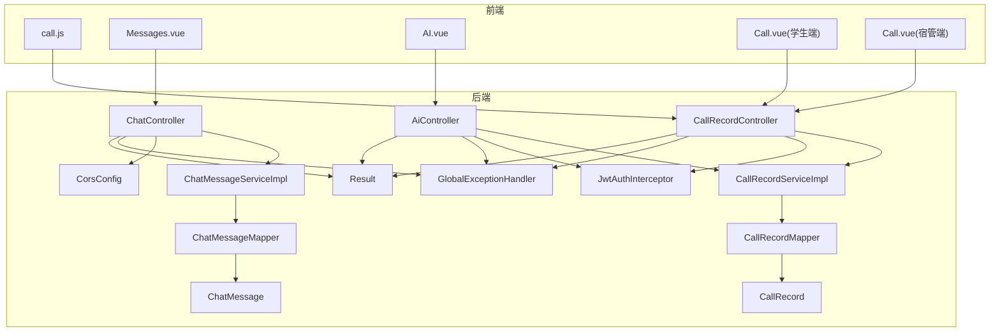
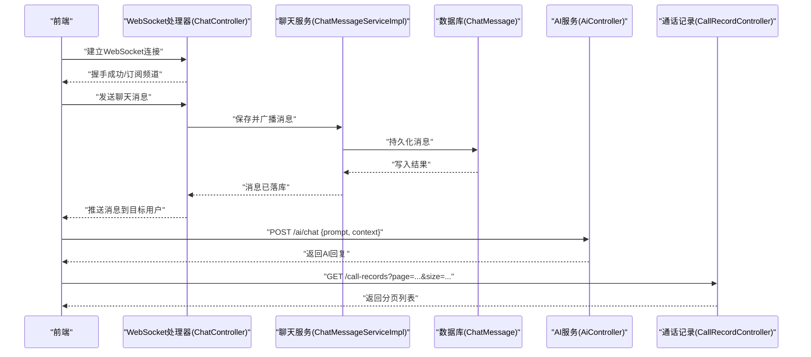
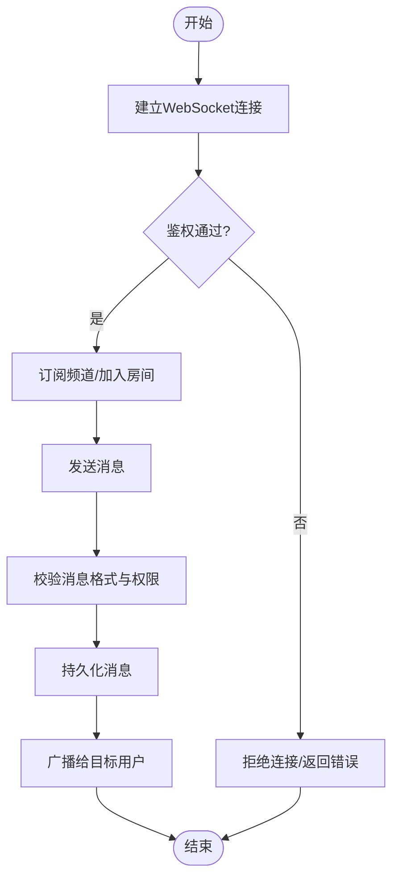
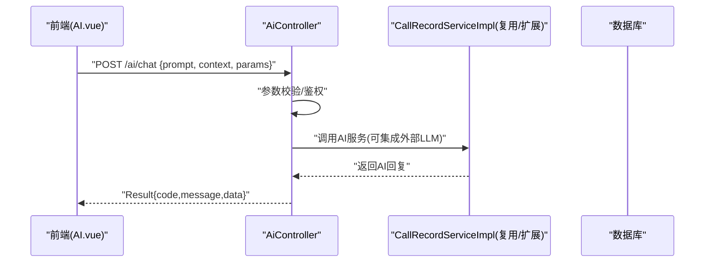
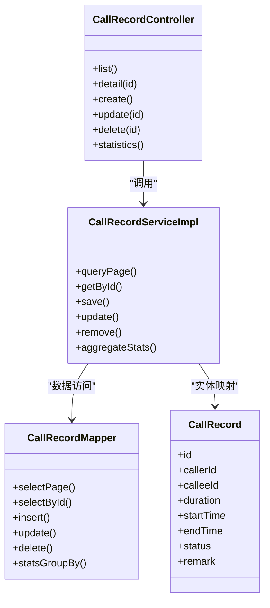
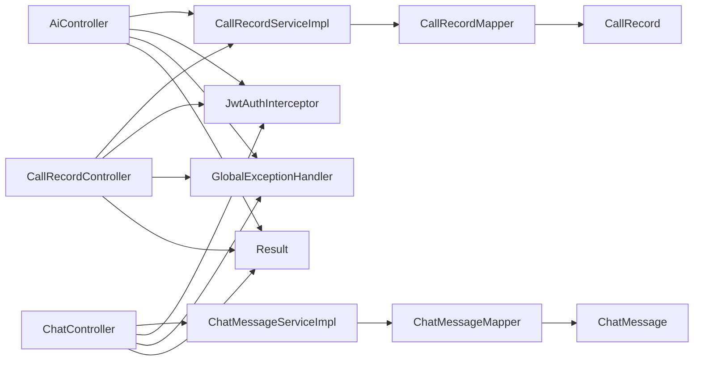

# 通讯交互接口

<cite>
**本文引用的文件**   
- [ChatController.java](file://backend/src/main/java/com/dorm/backend/controller/ChatController.java)
- [AiController.java](file://backend/src/main/java/com/dorm/backend/controller/AiController.java)
- [CallRecordController.java](file://backend/src/main/java/com/dorm/backend/controller/CallRecordController.java)
- [ChatMessageServiceImpl.java](file://backend/src/main/java/com/dorm/backend/service/impl/ChatMessageServiceImpl.java)
- [CallRecordServiceImpl.java](file://backend/src/main/java/com/dorm/backend/service/impl/CallRecordServiceImpl.java)
- [ChatMessageMapper.java](file://backend/src/main/java/com/dorm/backend/mapper/ChatMessageMapper.java)
- [CallRecordMapper.java](file://backend/src/main/java/com/dorm/backend/mapper/CallRecordMapper.java)
- [ChatMessage.java](file://backend/src/main/java/com/dorm/backend/entity/ChatMessage.java)
- [CallRecord.java](file://backend/src/main/java/com/dorm/backend/entity/CallRecord.java)
- [application.yml](file://backend/src/main/resources/application.yml)
- [application-dev.yml](file://backend/src/main/resources/application-dev.yml)
- [JwtAuthInterceptor.java](file://backend/src/main/java/com/dorm/backend/config/JwtAuthInterceptor.java)
- [CorsConfig.java](file://backend/src/main/java/com/dorm/backend/config/CorsConfig.java)
- [GlobalExceptionHandler.java](file://backend/src/main/java/com/dorm/backend/common/GlobalExceptionHandler.java)
- [Result.java](file://backend/src/main/java/com/dorm/backend/common/Result.java)
- [call.js](file://frontend/src/api/call.js)
- [Messages.vue](file://frontend/src/views/manager/Messages.vue)
- [AI.vue](file://frontend/src/views/student/AI.vue)
- [Call.vue（学生端）](file://frontend/src/views/student/Call.vue)
- [Call.vue（宿管端）](file://frontend/src/views/manager/Call.vue)
</cite>

## 目录
1. [简介](#简介)
2. [项目结构](#项目结构)
3. [核心组件](#核心组件)
4. [架构总览](#架构总览)
5. [详细组件分析](#详细组件分析)
6. [依赖关系分析](#依赖关系分析)
7. [性能考虑](#性能考虑)
8. [故障排查指南](#故障排查指南)
9. [结论](#结论)
10. [附录](#附录)

## 简介
本文件为 Dorm-Sys 通讯交互接口的权威文档，覆盖以下能力：
- 实时聊天：WebSocket 连接建立、消息收发、会话管理。
- AI 助手：智能对话的 HTTP 接口调用、参数与响应格式说明。
- 通话记录：查询、统计与分析接口。
- 安全与隐私：认证鉴权、跨域策略、异常处理与错误码约定。
- 性能优化：并发模型、缓存与分页、背压与限流建议。

## 项目结构
后端采用 Spring Boot 分层架构：
- Controller 层：暴露 REST 与 WebSocket 相关接口。
- Service 层：业务逻辑封装。
- Mapper 层：数据访问（MyBatis）。
- Entity 层：数据库实体映射。
- Config/Common：全局配置、拦截器、异常处理与统一返回体。

前端包含：
- API 封装：对后端接口进行统一调用。
- 页面组件：聊天、AI 对话、通话记录等视图。

图表来源
- [ChatController.java](file://backend/src/main/java/com/dorm/backend/controller/ChatController.java)
- [AiController.java](file://backend/src/main/java/com/dorm/backend/controller/AiController.java)
- [CallRecordController.java](file://backend/src/main/java/com/dorm/backend/controller/CallRecordController.java)
- [ChatMessageServiceImpl.java](file://backend/src/main/java/com/dorm/backend/service/impl/ChatMessageServiceImpl.java)
- [CallRecordServiceImpl.java](file://backend/src/main/java/com/dorm/backend/service/impl/CallRecordServiceImpl.java)
- [ChatMessageMapper.java](file://backend/src/main/java/com/dorm/backend/mapper/ChatMessageMapper.java)
- [CallRecordMapper.java](file://backend/src/main/java/com/dorm/backend/mapper/CallRecordMapper.java)
- [ChatMessage.java](file://backend/src/main/java/com/dorm/backend/entity/ChatMessage.java)
- [CallRecord.java](file://backend/src/main/java/com/dorm/backend/entity/CallRecord.java)
- [CorsConfig.java](file://backend/src/main/java/com/dorm/backend/config/CorsConfig.java)
- [JwtAuthInterceptor.java](file://backend/src/main/java/com/dorm/backend/config/JwtAuthInterceptor.java)
- [GlobalExceptionHandler.java](file://backend/src/main/java/com/dorm/backend/common/GlobalExceptionHandler.java)
- [Result.java](file://backend/src/main/java/com/dorm/backend/common/Result.java)
- [call.js](file://frontend/src/api/call.js)
- [Messages.vue](file://frontend/src/views/manager/Messages.vue)
- [AI.vue](file://frontend/src/views/student/AI.vue)
- [Call.vue（学生端）](file://frontend/src/views/student/Call.vue)
- [Call.vue（宿管端）](file://frontend/src/views/manager/Call.vue)

章节来源
- [application.yml](file://backend/src/main/resources/application.yml)
- [application-dev.yml](file://backend/src/main/resources/application-dev.yml)

## 核心组件
- ChatController：提供聊天相关的 REST 与 WebSocket 端点，负责消息持久化与推送。
- AiController：提供 AI 智能对话接口，支持上下文管理与提示词配置。
- CallRecordController：提供通话记录的增删改查、分页与统计分析。
- ChatMessageService/Impl：聊天消息的业务编排与存储。
- CallRecordService/Impl：通话记录的数据访问与统计聚合。
- MyBatis Mapper：ChatMessageMapper、CallRecordMapper 对应 SQL 映射。
- 实体类：ChatMessage、CallRecord 定义数据结构。
- 配置与通用：CorsConfig、JwtAuthInterceptor、GlobalExceptionHandler、Result。

章节来源
- [ChatController.java](file://backend/src/main/java/com/dorm/backend/controller/ChatController.java)
- [AiController.java](file://backend/src/main/java/com/dorm/backend/controller/AiController.java)
- [CallRecordController.java](file://backend/src/main/java/com/dorm/backend/controller/CallRecordController.java)
- [ChatMessageServiceImpl.java](file://backend/src/main/java/com/dorm/backend/service/impl/ChatMessageServiceImpl.java)
- [CallRecordServiceImpl.java](file://backend/src/main/java/com/dorm/backend/service/impl/CallRecordServiceImpl.java)
- [ChatMessageMapper.java](file://backend/src/main/java/com/dorm/backend/mapper/ChatMessageMapper.java)
- [CallRecordMapper.java](file://backend/src/main/java/com/dorm/backend/mapper/CallRecordMapper.java)
- [ChatMessage.java](file://backend/src/main/java/com/dorm/backend/entity/ChatMessage.java)
- [CallRecord.java](file://backend/src/main/java/com/dorm/backend/entity/CallRecord.java)
- [CorsConfig.java](file://backend/src/main/java/com/dorm/backend/config/CorsConfig.java)
- [JwtAuthInterceptor.java](file://backend/src/main/java/com/dorm/backend/config/JwtAuthInterceptor.java)
- [GlobalExceptionHandler.java](file://backend/src/main/java/com/dorm/backend/common/GlobalExceptionHandler.java)
- [Result.java](file://backend/src/main/java/com/dorm/backend/common/Result.java)

## 架构总览
系统以“前端页面/API 封装 → 后端 Controller → Service → Mapper → 数据库”为主线，同时通过 WebSocket 实现实时双向通信；AI 对话通过 HTTP 接口调用，结合提示词与上下文生成回复；通话记录提供查询与统计能力。

图表来源
- [ChatController.java](file://backend/src/main/java/com/dorm/backend/controller/ChatController.java)
- [AiController.java](file://backend/src/main/java/com/dorm/backend/controller/AiController.java)
- [CallRecordController.java](file://backend/src/main/java/com/dorm/backend/controller/CallRecordController.java)
- [ChatMessageServiceImpl.java](file://backend/src/main/java/com/dorm/backend/service/impl/ChatMessageServiceImpl.java)
- [CallRecordServiceImpl.java](file://backend/src/main/java/com/dorm/backend/service/impl/CallRecordServiceImpl.java)
- [ChatMessage.java](file://backend/src/main/java/com/dorm/backend/entity/ChatMessage.java)
- [CallRecord.java](file://backend/src/main/java/com/dorm/backend/entity/CallRecord.java)

## 详细组件分析

### 实时聊天（WebSocket + REST）
- 连接建立：客户端通过 WebSocket 协议发起连接，服务端完成握手与鉴权后建立会话。
- 消息收发：客户端发送消息，服务端校验权限、落库并广播给目标用户或房间。
- 会话管理：按用户或群组维护在线会话，支持离线消息补发与历史查询。
- 典型流程：
  - 建立连接 → 鉴权 → 订阅频道 → 收发消息 → 断开清理。

图表来源
- [ChatController.java](file://backend/src/main/java/com/dorm/backend/controller/ChatController.java)
- [ChatMessageServiceImpl.java](file://backend/src/main/java/com/dorm/backend/service/impl/ChatMessageServiceImpl.java)
- [ChatMessageMapper.java](file://backend/src/main/java/com/dorm/backend/mapper/ChatMessageMapper.java)
- [ChatMessage.java](file://backend/src/main/java/com/dorm/backend/entity/ChatMessage.java)

章节来源
- [ChatController.java](file://backend/src/main/java/com/dorm/backend/controller/ChatController.java)
- [ChatMessageServiceImpl.java](file://backend/src/main/java/com/dorm/backend/service/impl/ChatMessageServiceImpl.java)
- [ChatMessageMapper.java](file://backend/src/main/java/com/dorm/backend/mapper/ChatMessageMapper.java)
- [ChatMessage.java](file://backend/src/main/java/com/dorm/backend/entity/ChatMessage.java)

### AI 智能对话（HTTP 接口）
- 接口类型：RESTful POST。
- 输入参数：提示词（prompt）、可选上下文（context）、模型参数（temperature、max_tokens 等）。
- 输出格式：统一 Result 包装，包含 code、message、data（AI 回复文本或结构化内容）。
- 使用场景：学生端 AI 问答、宿管端智能辅助。

图表来源
- [AiController.java](file://backend/src/main/java/com/dorm/backend/controller/AiController.java)
- [CallRecordServiceImpl.java](file://backend/src/main/java/com/dorm/backend/service/impl/CallRecordServiceImpl.java)
- [Result.java](file://backend/src/main/java/com/dorm/backend/common/Result.java)

章节来源
- [AiController.java](file://backend/src/main/java/com/dorm/backend/controller/AiController.java)
- [Result.java](file://backend/src/main/java/com/dorm/backend/common/Result.java)

### 通话记录（CRUD + 分页 + 统计）
- 功能范围：新增通话记录、查询列表（分页/筛选）、详情查看、删除、统计汇总。
- 典型接口：
  - 列表查询：GET /call-records?page=&size=&keyword=&status=...
  - 详情查询：GET /call-records/{id}
  - 新增记录：POST /call-records
  - 更新记录：PUT /call-records/{id}
  - 删除记录：DELETE /call-records/{id}
  - 统计接口：GET /call-records/statistics?groupBy=...
- 数据模型：CallRecord 实体字段包括主键、通话双方、时长、时间戳、状态等。

图表来源
- [CallRecordController.java](file://backend/src/main/java/com/dorm/backend/controller/CallRecordController.java)
- [CallRecordServiceImpl.java](file://backend/src/main/java/com/dorm/backend/service/impl/CallRecordServiceImpl.java)
- [CallRecordMapper.java](file://backend/src/main/java/com/dorm/backend/mapper/CallRecordMapper.java)
- [CallRecord.java](file://backend/src/main/java/com/dorm/backend/entity/CallRecord.java)

章节来源
- [CallRecordController.java](file://backend/src/main/java/com/dorm/backend/controller/CallRecordController.java)
- [CallRecordServiceImpl.java](file://backend/src/main/java/com/dorm/backend/service/impl/CallRecordServiceImpl.java)
- [CallRecordMapper.java](file://backend/src/main/java/com/dorm/backend/mapper/CallRecordMapper.java)
- [CallRecord.java](file://backend/src/main/java/com/dorm/backend/entity/CallRecord.java)

### 前端集成要点
- call.js：封装通话记录相关 API 请求，统一处理鉴权与错误。
- Messages.vue：聊天界面，负责 WebSocket 连接、消息渲染与发送。
- AI.vue：AI 对话界面，提交 prompt 并展示回复。
- Call.vue（学生端/宿管端）：通话记录查看与操作入口。

章节来源
- [call.js](file://frontend/src/api/call.js)
- [Messages.vue](file://frontend/src/views/manager/Messages.vue)
- [AI.vue](file://frontend/src/views/student/AI.vue)
- [Call.vue（学生端）](file://frontend/src/views/student/Call.vue)
- [Call.vue（宿管端）](file://frontend/src/views/manager/Call.vue)

## 依赖关系分析
- 控制器依赖服务层，服务层依赖 Mapper 与实体。
- 全局拦截器 JwtAuthInterceptor 对受保护接口进行鉴权。
- CorsConfig 配置跨域策略，适配前后端分离部署。
- GlobalExceptionHandler 统一异常处理，Result 统一返回结构。

图表来源
- [ChatController.java](file://backend/src/main/java/com/dorm/backend/controller/ChatController.java)
- [AiController.java](file://backend/src/main/java/com/dorm/backend/controller/AiController.java)
- [CallRecordController.java](file://backend/src/main/java/com/dorm/backend/controller/CallRecordController.java)
- [ChatMessageServiceImpl.java](file://backend/src/main/java/com/dorm/backend/service/impl/ChatMessageServiceImpl.java)
- [CallRecordServiceImpl.java](file://backend/src/main/java/com/dorm/backend/service/impl/CallRecordServiceImpl.java)
- [ChatMessageMapper.java](file://backend/src/main/java/com/dorm/backend/mapper/ChatMessageMapper.java)
- [CallRecordMapper.java](file://backend/src/main/java/com/dorm/backend/mapper/CallRecordMapper.java)
- [ChatMessage.java](file://backend/src/main/java/com/dorm/backend/entity/ChatMessage.java)
- [CallRecord.java](file://backend/src/main/java/com/dorm/backend/entity/CallRecord.java)
- [JwtAuthInterceptor.java](file://backend/src/main/java/com/dorm/backend/config/JwtAuthInterceptor.java)
- [GlobalExceptionHandler.java](file://backend/src/main/java/com/dorm/backend/common/GlobalExceptionHandler.java)
- [Result.java](file://backend/src/main/java/com/dorm/backend/common/Result.java)

章节来源
- [JwtAuthInterceptor.java](file://backend/src/main/java/com/dorm/backend/config/JwtAuthInterceptor.java)
- [CorsConfig.java](file://backend/src/main/java/com/dorm/backend/config/CorsConfig.java)
- [GlobalExceptionHandler.java](file://backend/src/main/java/com/dorm/backend/common/GlobalExceptionHandler.java)
- [Result.java](file://backend/src/main/java/com/dorm/backend/common/Result.java)

## 性能考虑
- WebSocket 并发：
  - 使用线程池管理连接与消息分发，避免阻塞 IO。
  - 合理设置心跳与超时，及时清理僵尸连接。
  - 对热点频道进行消息合并与去重，降低带宽占用。
- 数据库访问：
  - 分页查询必须带索引（如 startTime、status），避免全表扫描。
  - 批量插入/更新减少往返次数。
- 缓存策略：
  - 热点统计数据（如通话时长分布）可短期缓存，减轻数据库压力。
  - 聊天历史可按会话分片缓存，设置过期策略。
- 限流与背压：
  - 对高频接口（如 AI 对话）实施令牌桶/漏桶限流。
  - 消息队列缓冲突发流量，保证稳定性。
- 资源监控：
  - 接入 APM 与日志采集，关注 QPS、延迟、错误率与内存使用。

[本节为通用指导，不直接分析具体文件]

## 故障排查指南
- 常见问题定位：
  - WebSocket 连接失败：检查鉴权拦截器、跨域配置与端口连通性。
  - 消息未送达：确认频道订阅、消息路由与目标在线状态。
  - AI 调用超时：检查外部 LLM 服务可用性、超时与重试策略。
  - 通话记录查询慢：检查 SQL 执行计划、索引命中情况。
- 统一异常处理：
  - GlobalExceptionHandler 捕获异常并返回标准错误码与消息。
  - 前端根据 Result.code 判断成功与否，并提示用户。
- 调试建议：
  - 开启开发环境日志级别，观察关键链路。
  - 使用浏览器开发者工具与网络面板检查请求与响应。

章节来源
- [GlobalExceptionHandler.java](file://backend/src/main/java/com/dorm/backend/common/GlobalExceptionHandler.java)
- [Result.java](file://backend/src/main/java/com/dorm/backend/common/Result.java)
- [application-dev.yml](file://backend/src/main/resources/application-dev.yml)

## 结论
Dorm-Sys 的通讯交互模块以清晰的层次结构与统一的接口规范为基础，实现了实时聊天、AI 对话与通话记录管理能力。通过鉴权、跨域、异常处理与统一返回体保障安全性与一致性；借助分页、索引、缓存与限流等手段提升性能与稳定性。建议在后续迭代中完善消息加密、审计追踪与更细粒度的权限控制。

[本节为总结性内容，不直接分析具体文件]

## 附录
- 环境变量与配置：
  - application.yml：基础配置（端口、数据源、Redis、JWT 等）。
  - application-dev.yml：开发环境覆盖配置（日志级别、调试开关）。
- 前端 API 封装：
  - call.js：通话记录相关请求封装，统一处理鉴权与错误。
- 页面组件：
  - Messages.vue：聊天界面与 WebSocket 集成。
  - AI.vue：AI 对话界面。
  - Call.vue（学生端/宿管端）：通话记录查看与操作。

章节来源
- [application.yml](file://backend/src/main/resources/application.yml)
- [application-dev.yml](file://backend/src/main/resources/application-dev.yml)
- [call.js](file://frontend/src/api/call.js)
- [Messages.vue](file://frontend/src/views/manager/Messages.vue)
- [AI.vue](file://frontend/src/views/student/AI.vue)
- [Call.vue（学生端）](file://frontend/src/views/student/Call.vue)
- [Call.vue（宿管端）](file://frontend/src/views/manager/Call.vue)