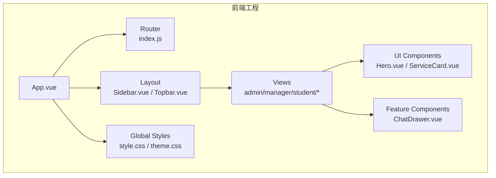
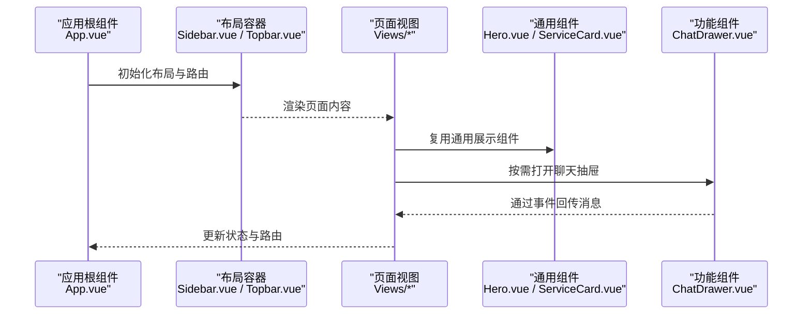
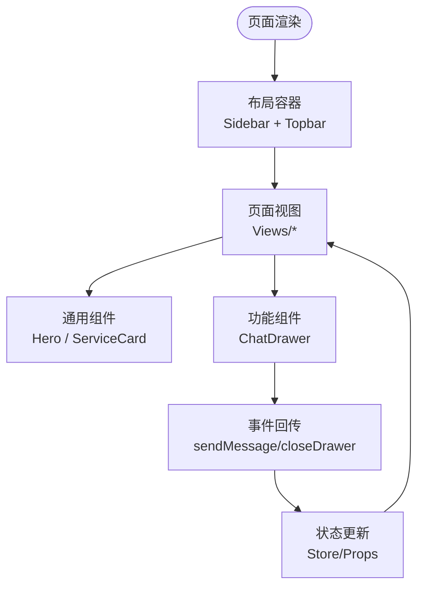
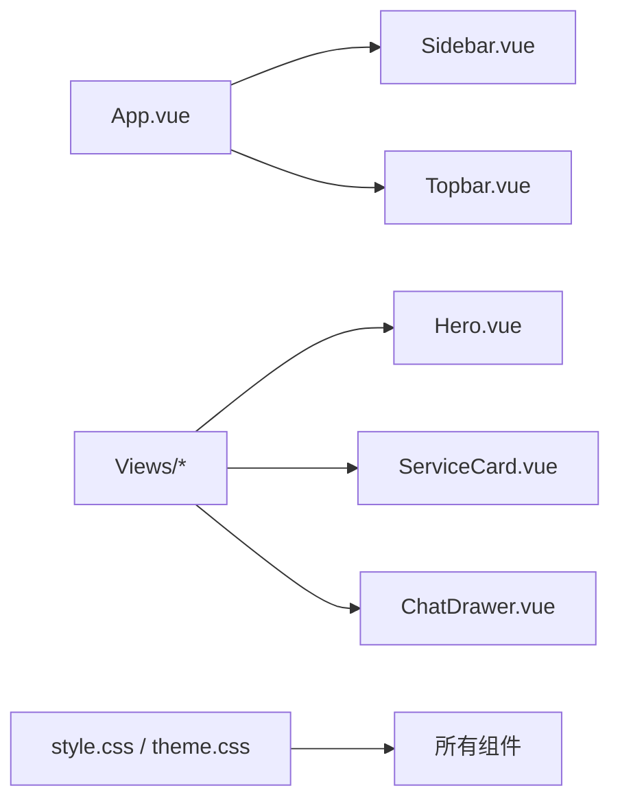

# 前端组件库

<cite>
**本文档引用的文件**   
- [Sidebar.vue](file://frontend/src/components/layout/Sidebar.vue)
- [Topbar.vue](file://frontend/src/components/layout/Topbar.vue)
- [Hero.vue](file://frontend/src/components/ui/Hero.vue)
- [ServiceCard.vue](file://frontend/src/components/ui/ServiceCard.vue)
- [ChatDrawer.vue](file://frontend/src/components/ChatDrawer.vue)
- [App.vue](file://frontend/src/App.vue)
- [main.js](file://frontend/src/main.js)
- [style.css](file://frontend/src/style.css)
- [theme.css](file://frontend/src/assets/css/theme.css)
- [index.js](file://frontend/src/router/index.js)
- [package.json](file://frontend/package.json)
</cite>

## 目录
1. [简介](#简介)
2. [项目结构](#项目结构)
3. [核心组件](#核心组件)
4. [架构总览](#架构总览)
5. [组件详细分析](#组件详细分析)
6. [依赖关系分析](#依赖关系分析)
7. [性能与可访问性](#性能与可访问性)
8. [故障排查指南](#故障排查指南)
9. [结论](#结论)
10. [附录：扩展与自定义指南](#附录扩展与自定义指南)

## 简介
本文件为 Dorm-Sys 前端组件库的权威文档，聚焦于可复用的 UI 组件，包括布局组件（Sidebar、Topbar）、通用组件（Hero、ServiceCard）以及功能组件（ChatDrawer）。文档涵盖每个组件的属性（props）、事件（events）和插槽（slots），并说明样式定制、主题支持与响应式设计。同时提供使用示例、最佳实践、注意事项、组合模式与嵌套使用方法，以及测试覆盖与质量保证措施，帮助开发者快速上手与持续演进。

## 项目结构
前端采用 Vue 3 + Vite 工程化组织，组件按职责分层：
- layout：页面级布局容器（侧边栏、顶栏）
- ui：通用展示型组件（英雄区、服务卡片）
- 业务功能组件：如聊天抽屉等
- 路由与状态：router、store
- 样式：全局样式与主题变量

图表来源
- [App.vue](file://frontend/src/App.vue)
- [index.js](file://frontend/src/router/index.js)
- [Sidebar.vue](file://frontend/src/components/layout/Sidebar.vue)
- [Topbar.vue](file://frontend/src/components/layout/Topbar.vue)
- [Hero.vue](file://frontend/src/components/ui/Hero.vue)
- [ServiceCard.vue](file://frontend/src/components/ui/ServiceCard.vue)
- [ChatDrawer.vue](file://frontend/src/components/ChatDrawer.vue)
- [style.css](file://frontend/src/style.css)
- [theme.css](file://frontend/src/assets/css/theme.css)

章节来源
- [package.json](file://frontend/package.json)
- [main.js](file://frontend/src/main.js)
- [App.vue](file://frontend/src/App.vue)
- [index.js](file://frontend/src/router/index.js)

## 核心组件
本节概述各组件的职责与边界，便于快速定位与理解整体设计。

- Sidebar（侧边栏）
  - 职责：导航菜单、折叠展开、当前路由高亮、移动端适配
  - 典型属性：collapsed（是否收起）、menuItems（菜单数据）、activeRoute（当前路由）
  - 典型事件：toggleCollapse（切换收起）、selectMenu（选择菜单项）
  - 插槽：logo（品牌区域）、extra（额外内容）
  - 样式与主题：支持 CSS 变量控制宽度、背景色、文字颜色；响应式断点下自动隐藏或转为抽屉
  - 使用建议：与 Router 联动，确保 activeRoute 同步；在移动端通过父组件控制显示

- Topbar（顶栏）
  - 职责：面包屑、搜索、通知、用户头像与下拉菜单
  - 典型属性：title（标题）、showSearch（是否显示搜索）、user（用户信息对象）
  - 典型事件：onSearch（搜索回调）、onToggleUserMenu（用户菜单切换）、onLogout（退出登录）
  - 插槽：actions（右侧操作区）、avatar（头像自定义）
  - 样式与主题：高度、阴影、背景色可通过主题变量覆盖；移动端简化操作区
  - 使用建议：与用户状态 store 联动，避免重复请求

- Hero（英雄区）
  - 职责：首页或模块入口的大图/文案展示
  - 典型属性：title、subtitle、image、actions（按钮组）
  - 典型事件：onAction（动作点击）
  - 插槽：content（自定义内容区）
  - 样式与主题：图片自适应、文本对齐、渐变背景；支持暗色主题
  - 使用建议：保持语义化标签，提升可访问性

- ServiceCard（服务卡片）
  - 职责：展示服务项（图标、标题、描述、跳转链接）
  - 典型属性：icon、title、description、link、tag
  - 典型事件：onClick（点击卡片）
  - 插槽：footer（底部附加内容）
  - 样式与主题：圆角、阴影、悬停效果；主题色驱动主色调
  - 使用建议：列表渲染时注意 key 唯一性与懒加载

- ChatDrawer（聊天抽屉）
  - 职责：侧滑聊天面板，消息列表、输入框、发送
  - 典型属性：visible（可见性）、messages（消息数组）、currentUser（当前用户）
  - 典型事件：sendMessage（发送消息）、closeDrawer（关闭抽屉）
  - 插槽：messageItem（自定义消息项）、inputActions（输入区附加操作）
  - 样式与主题：滚动区域、气泡样式、时间戳；支持深色模式
  - 使用建议：虚拟滚动优化长列表；防抖输入；错误重试机制

章节来源
- [Sidebar.vue](file://frontend/src/components/layout/Sidebar.vue)
- [Topbar.vue](file://frontend/src/components/layout/Topbar.vue)
- [Hero.vue](file://frontend/src/components/ui/Hero.vue)
- [ServiceCard.vue](file://frontend/src/components/ui/ServiceCard.vue)
- [ChatDrawer.vue](file://frontend/src/components/ChatDrawer.vue)

## 架构总览
组件间通过 props/events 通信，布局组件包裹视图层，通用组件被多处复用，功能组件承载具体交互流程。

图表来源
- [App.vue](file://frontend/src/App.vue)
- [Sidebar.vue](file://frontend/src/components/layout/Sidebar.vue)
- [Topbar.vue](file://frontend/src/components/layout/Topbar.vue)
- [Hero.vue](file://frontend/src/components/ui/Hero.vue)
- [ServiceCard.vue](file://frontend/src/components/ui/ServiceCard.vue)
- [ChatDrawer.vue](file://frontend/src/components/ChatDrawer.vue)

## 组件详细分析

### 布局组件：Sidebar（侧边栏）
- 属性（props）
  - collapsed：布尔值，控制菜单收起/展开
  - menuItems：数组，定义菜单结构与路由映射
  - activeRoute：字符串，当前激活路由
- 事件（events）
  - toggleCollapse：触发收起/展开
  - selectMenu：选择菜单项后向上抛出路由变化
- 插槽（slots）
  - logo：用于品牌标识
  - extra：用于附加设置或帮助入口
- 样式与主题
  - 宽度由 CSS 变量控制，收起态固定窄宽
  - 背景色、文字颜色、选中态高亮均可通过主题覆盖
  - 响应式：小屏默认隐藏，通过遮罩+抽屉方式呈现
- 使用示例与最佳实践
  - 与 Router 联动，监听路由变化更新 activeRoute
  - 菜单数据集中管理，避免硬编码
  - 键盘可达性：Tab 顺序合理，Enter/Space 可触发
- 注意事项
  - 避免在菜单中放置复杂交互，必要时拆分子组件
  - 长列表需考虑虚拟化或分页

章节来源
- [Sidebar.vue](file://frontend/src/components/layout/Sidebar.vue)

### 布局组件：Topbar（顶栏）
- 属性（props）
  - title：页面标题
  - showSearch：是否显示搜索框
  - user：用户信息对象（头像、昵称、角色）
- 事件（events）
  - onSearch：搜索关键词回调
  - onToggleUserMenu：用户菜单开关
  - onLogout：退出登录
- 插槽（slots）
  - actions：右侧操作区（通知、设置等）
  - avatar：自定义头像渲染
- 样式与主题
  - 高度、阴影、背景色统一由主题变量管理
  - 移动端隐藏次要操作，保留关键入口
- 使用示例与最佳实践
  - 与用户状态 store 绑定，避免重复获取
  - 搜索框支持防抖与快捷键（如 Ctrl+K）
- 注意事项
  - 下拉菜单需处理焦点管理与 ESC 关闭

章节来源
- [Topbar.vue](file://frontend/src/components/layout/Topbar.vue)

### 通用组件：Hero（英雄区）
- 属性（props）
  - title：主标题
  - subtitle：副标题
  - image：背景图或插图
  - actions：按钮配置（文本、类型、点击回调）
- 事件（events）
  - onAction：按钮点击事件
- 插槽（slots）
  - content：自定义内容区域
- 样式与主题
  - 图片自适应与裁剪，文本居中对齐
  - 支持暗色主题下的对比度调整
- 使用示例与最佳实践
  - 语义化标签（h1/h2/p）提升 SEO 与可访问性
  - 图片懒加载与占位符
- 注意事项
  - 避免过多动画影响首屏性能

章节来源
- [Hero.vue](file://frontend/src/components/ui/Hero.vue)

### 通用组件：ServiceCard（服务卡片）
- 属性（props）
  - icon：图标或 SVG
  - title：标题
  - description：描述文本
  - link：跳转链接或路由
  - tag：标签（可选）
- 事件（events）
  - onClick：点击卡片回调
- 插槽（slots）
  - footer：底部附加内容（如操作按钮）
- 样式与主题
  - 圆角、阴影、悬停动效
  - 主题色驱动边框与强调元素
- 使用示例与最佳实践
  - 列表渲染时使用稳定 key
  - 大列表配合 IntersectionObserver 懒加载
- 注意事项
  - 链接与路由跳转需区分外部链接与内部路由

章节来源
- [ServiceCard.vue](file://frontend/src/components/ui/ServiceCard.vue)

### 功能组件：ChatDrawer（聊天抽屉）
- 属性（props）
  - visible：抽屉可见性
  - messages：消息数组（含发送者、内容、时间）
  - currentUser：当前用户信息
- 事件（events）
  - sendMessage：发送新消息
  - closeDrawer：关闭抽屉
- 插槽（slots）
  - messageItem：自定义消息气泡
  - inputActions：输入区附加操作（表情、附件）
- 样式与主题
  - 滚动区域平滑滚动到底部
  - 消息气泡左右对齐，时间戳灰色显示
  - 支持深色模式下的对比度与背景切换
- 使用示例与最佳实践
  - 长列表使用虚拟滚动或分页
  - 输入框防抖与回车发送
  - 网络失败重试与离线提示
- 注意事项
  - 避免阻塞主线程的重计算
  - 敏感信息脱敏与加密传输

章节来源
- [ChatDrawer.vue](file://frontend/src/components/ChatDrawer.vue)

### 组合模式与嵌套使用
- 布局嵌套
  - App.vue 作为根组件，引入 Sidebar 与 Topbar 形成标准后台布局
  - Views 中的页面组件被布局容器包裹，实现一致的导航与头部体验
- 组件复用
  - Hero 与 ServiceCard 可在多个页面复用，减少重复代码
  - ChatDrawer 以抽屉形式嵌入页面，通过事件与父组件通信
- 数据流
  - 父组件通过 props 传递数据，子组件通过 events 上报变更
  - 复杂状态可下沉至 store，避免 prop drilling

图表来源
- [App.vue](file://frontend/src/App.vue)
- [Sidebar.vue](file://frontend/src/components/layout/Sidebar.vue)
- [Topbar.vue](file://frontend/src/components/layout/Topbar.vue)
- [Hero.vue](file://frontend/src/components/ui/Hero.vue)
- [ServiceCard.vue](file://frontend/src/components/ui/ServiceCard.vue)
- [ChatDrawer.vue](file://frontend/src/components/ChatDrawer.vue)

## 依赖关系分析
- 组件内聚与耦合
  - 布局组件低耦合，仅负责结构与控制
  - 通用组件无业务依赖，纯展示与交互
  - 功能组件与业务逻辑解耦，通过事件与父组件协作
- 外部依赖
  - Vue 3 运行时与 Composition API
  - Vite 构建工具与插件生态
  - 可能的第三方库（如图标、日期格式化）通过 package.json 声明
- 潜在循环依赖
  - 避免组件间互相引用，必要时抽取公共逻辑到 utils 或 composables

图表来源
- [App.vue](file://frontend/src/App.vue)
- [Sidebar.vue](file://frontend/src/components/layout/Sidebar.vue)
- [Topbar.vue](file://frontend/src/components/layout/Topbar.vue)
- [Hero.vue](file://frontend/src/components/ui/Hero.vue)
- [ServiceCard.vue](file://frontend/src/components/ui/ServiceCard.vue)
- [ChatDrawer.vue](file://frontend/src/components/ChatDrawer.vue)
- [style.css](file://frontend/src/style.css)
- [theme.css](file://frontend/src/assets/css/theme.css)

章节来源
- [package.json](file://frontend/package.json)
- [main.js](file://frontend/src/main.js)

## 性能与可访问性
- 性能优化
  - 图片懒加载与占位符，减少首屏体积
  - 长列表虚拟化或分页，避免 DOM 过大
  - 防抖与节流，降低高频事件开销
  - 组件按需加载与路由懒加载
- 可访问性（a11y）
  - 语义化标签与 ARIA 属性
  - 键盘可达性与焦点管理
  - 色彩对比度符合 WCAG 标准
- 主题与响应式
  - 使用 CSS 变量统一管理主题色、字号、间距
  - 断点适配移动端与平板，保证一致体验

[本节为通用指导，不直接分析具体文件]

## 故障排查指南
- 常见问题
  - 路由未更新：检查 activeRoute 与 Router 配置一致性
  - 抽屉无法关闭：确认 visible 状态与 closeDrawer 事件绑定
  - 主题不生效：检查 CSS 变量注入顺序与覆盖优先级
  - 移动端布局错乱：确认媒体查询与布局容器尺寸
- 调试建议
  - 使用浏览器开发者工具检查组件树与样式
  - 打印关键 props/events 验证数据流
  - 开启 Vite 的 HMR 与 Source Map 提高调试效率

章节来源
- [Sidebar.vue](file://frontend/src/components/layout/Sidebar.vue)
- [Topbar.vue](file://frontend/src/components/layout/Topbar.vue)
- [ChatDrawer.vue](file://frontend/src/components/ChatDrawer.vue)
- [theme.css](file://frontend/src/assets/css/theme.css)

## 结论
Dorm-Sys 前端组件库以清晰的职责划分与良好的组合模式，提供了可扩展、可维护的 UI 基础能力。通过统一的样式与主题管理、完善的响应式设计与可访问性支持，开发者可以快速搭建一致的用户界面。建议在后续迭代中继续完善测试覆盖、文档自动化与组件版本管理。

[本节为总结性内容，不直接分析具体文件]

## 附录：扩展与自定义指南
- 新增组件步骤
  - 在 components 目录下创建对应文件夹（layout/ui/feature）
  - 定义 props/events/slots，编写模板与样式
  - 在需要处导入并使用，遵循命名约定
- 主题扩展
  - 在 theme.css 中新增 CSS 变量，并在组件中引用
  - 提供明暗主题切换逻辑，确保对比度达标
- 测试与质量保障
  - 单元测试：针对组件逻辑与边界条件
  - 端到端测试：模拟用户交互流程（如登录、发消息）
  - 静态检查：ESLint/Prettier 规范代码风格
  - 构建产物：Vite 打包分析与体积优化

章节来源
- [package.json](file://frontend/package.json)
- [theme.css](file://frontend/src/assets/css/theme.css)
- [style.css](file://frontend/src/style.css)