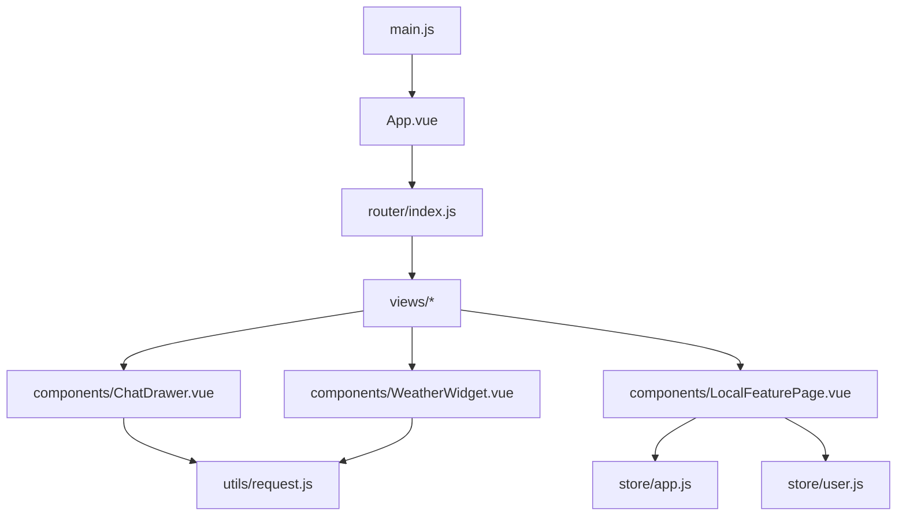
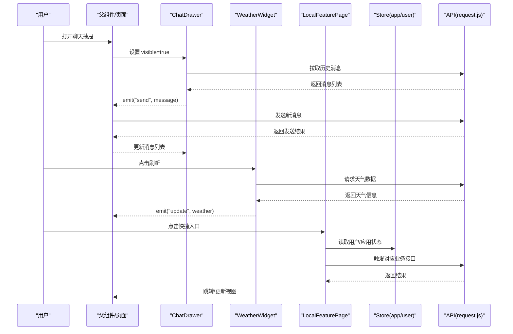
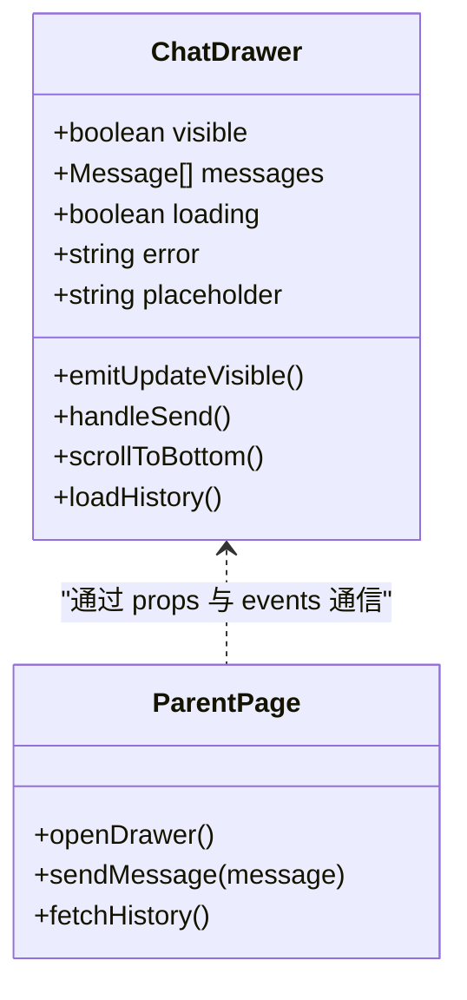
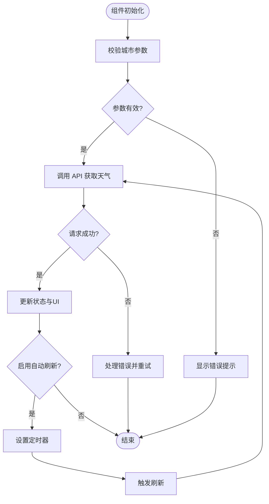
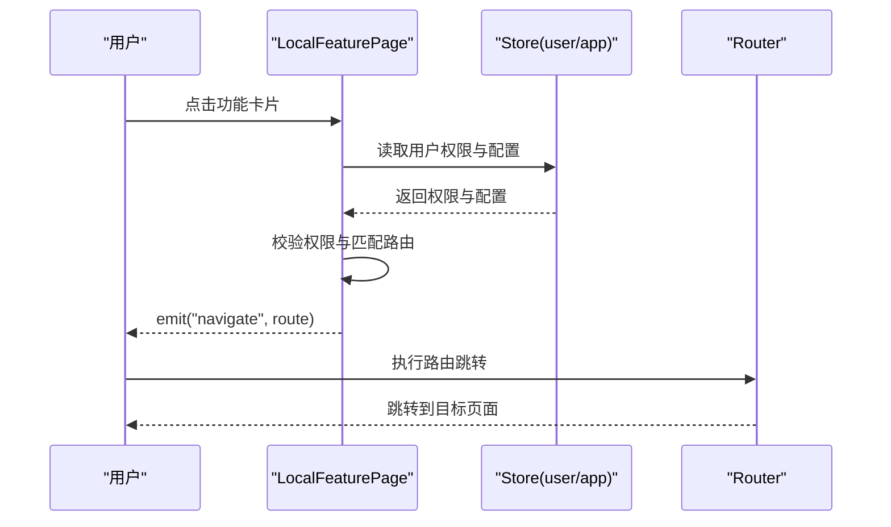
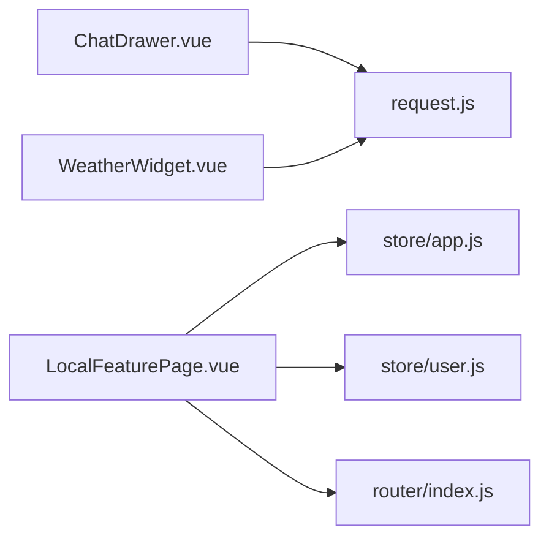

# 功能组件

<cite>
**本文引用的文件**   
- [ChatDrawer.vue](file://frontend/src/components/ChatDrawer.vue)
- [WeatherWidget.vue](file://frontend/src/components/WeatherWidget.vue)
- [LocalFeaturePage.vue](file://frontend/src/components/LocalFeaturePage.vue)
- [request.js](file://frontend/src/utils/request.js)
- [app.js](file://frontend/src/store/app.js)
- [user.js](file://frontend/src/store/user.js)
- [index.js](file://frontend/src/router/index.js)
- [App.vue](file://frontend/src/App.vue)
- [main.js](file://frontend/src/main.js)
</cite>

## 目录
1. [简介](#简介)
2. [项目结构](#项目结构)
3. [核心组件](#核心组件)
4. [架构总览](#架构总览)
5. [详细组件分析](#详细组件分析)
6. [依赖关系分析](#依赖关系分析)
7. [性能考虑](#性能考虑)
8. [故障排查指南](#故障排查指南)
9. [结论](#结论)
10. [附录](#附录)

## 简介
本文件面向 Dorm-Sys 前端的功能组件，重点围绕以下三个复杂业务组件进行系统化说明：
- ChatDrawer 聊天抽屉：提供侧边聊天面板的交互与消息展示能力。
- WeatherWidget 天气组件：聚合并展示天气信息，支持刷新与错误处理。
- LocalFeaturePage 本地功能页面：作为本地化功能入口页，聚合常用快捷操作与导航。

文档将覆盖每个组件的核心功能、属性（props）、事件（events）、插槽（slots），以及状态管理、数据流、与其他模块的集成方式、使用示例、配置项和调试技巧，并提供性能优化建议。

## 项目结构
前端采用 Vue 单页应用结构，关键目录与职责如下：
- src/components：可复用业务组件，包含 ChatDrawer、WeatherWidget、LocalFeaturePage 等。
- src/store：全局状态管理（如应用开关、用户信息等）。
- src/utils：工具函数与网络请求封装（如 request.js）。
- src/router：路由配置，用于页面级导航。
- src/views：页面级视图，组合多个组件形成完整页面。
- src/App.vue 与 main.js：应用入口与根组件挂载。

图表来源
- [main.js](file://frontend/src/main.js)
- [App.vue](file://frontend/src/App.vue)
- [index.js](file://frontend/src/router/index.js)
- [ChatDrawer.vue](file://frontend/src/components/ChatDrawer.vue)
- [WeatherWidget.vue](file://frontend/src/components/WeatherWidget.vue)
- [LocalFeaturePage.vue](file://frontend/src/components/LocalFeaturePage.vue)
- [request.js](file://frontend/src/utils/request.js)
- [app.js](file://frontend/src/store/app.js)
- [user.js](file://frontend/src/store/user.js)

章节来源
- [main.js](file://frontend/src/main.js)
- [App.vue](file://frontend/src/App.vue)
- [index.js](file://frontend/src/router/index.js)

## 核心组件
本节概述三个组件的职责边界与协作关系：
- ChatDrawer：负责聊天面板的显示/隐藏、消息列表渲染、发送消息、滚动到底部、加载历史消息等。通常通过事件向父组件传递用户动作（如打开/关闭、发送消息）。
- WeatherWidget：负责获取并展示天气数据，支持手动刷新、错误提示、空状态与加载态。
- LocalFeaturePage：聚合本地功能入口，提供快捷跳转与常用操作，可能读取 store 中的用户信息与应用配置。

章节来源
- [ChatDrawer.vue](file://frontend/src/components/ChatDrawer.vue)
- [WeatherWidget.vue](file://frontend/src/components/WeatherWidget.vue)
- [LocalFeaturePage.vue](file://frontend/src/components/LocalFeaturePage.vue)

## 架构总览
下图展示了三个组件在应用中的位置与数据流向：组件从 store 或 API 获取数据，通过事件与父组件通信，必要时调用 request.js 发起网络请求。

图表来源
- [ChatDrawer.vue](file://frontend/src/components/ChatDrawer.vue)
- [WeatherWidget.vue](file://frontend/src/components/WeatherWidget.vue)
- [LocalFeaturePage.vue](file://frontend/src/components/LocalFeaturePage.vue)
- [request.js](file://frontend/src/utils/request.js)
- [app.js](file://frontend/src/store/app.js)
- [user.js](file://frontend/src/store/user.js)

## 详细组件分析

### ChatDrawer 聊天抽屉组件
- 核心功能
  - 控制抽屉的显示与隐藏
  - 展示消息列表，支持自动滚动到底部
  - 输入框与发送按钮，触发发送事件
  - 加载历史消息与错误提示
- 属性（props）
  - visible：布尔值，控制抽屉是否可见
  - messages：数组，消息列表数据
  - loading：布尔值，表示加载中状态
  - error：字符串，错误提示信息
  - placeholder：字符串，输入框占位文本
- 事件（events）
  - update:visible：切换抽屉可见性
  - send：发送消息时抛出，携带消息内容
  - loadHistory：加载历史消息回调（由父组件处理分页或初始加载）
- 插槽（slots）
  - header：自定义头部区域（标题、关闭按钮等）
  - footer：自定义底部区域（快捷回复、附件上传等）
  - messageItem：自定义消息项渲染（头像、时间、气泡样式等）
- 业务逻辑与状态管理
  - 内部维护滚动位置与输入状态；当 messages 变化时自动滚动到底部
  - 发送消息后清空输入框，并通过事件通知父组件
  - 错误状态由外部传入，组件仅负责展示与清除
- 数据流
  - 父组件持有消息数据与可见性状态，通过 props 下发给组件
  - 组件通过事件回传用户动作，父组件统一处理 API 调用与状态更新
- 使用示例
  - 在页面中引入组件，绑定 visible、messages、loading、error 等属性
  - 监听 send 事件，调用 API 发送消息，成功后追加到 messages
  - 通过插槽定制头部、底部与消息项样式
- 集成方法
  - 与 store 解耦，避免在组件内直接读写全局状态
  - 通过 request.js 封装的请求在父组件中调用，保证错误处理一致
- 性能优化
  - 对长列表使用虚拟滚动（如 vue-virtual-scroller）提升渲染性能
  - 防抖输入与节流滚动事件，减少重排重绘
  - 按需加载历史消息，避免一次性拉取大量数据
- 调试技巧
  - 打印 messages 长度与最后一条消息的时间戳，确认滚动行为
  - 捕获发送失败的网络错误，检查 request.js 的错误拦截器
  - 使用浏览器开发者工具的组件面板观察 props/events 变化

章节来源
- [ChatDrawer.vue](file://frontend/src/components/ChatDrawer.vue)
- [request.js](file://frontend/src/utils/request.js)

#### 类图（组件结构与关系）

图表来源
- [ChatDrawer.vue](file://frontend/src/components/ChatDrawer.vue)

### WeatherWidget 天气组件
- 核心功能
  - 获取并展示当前天气信息（温度、湿度、风速等）
  - 支持手动刷新与自动刷新策略
  - 处理加载态、空状态与错误提示
- 属性（props）
  - city：字符串，城市名称或坐标
  - unit：字符串，温度单位（摄氏度/华氏度）
  - autoRefresh：布尔值，是否启用自动刷新
  - refreshInterval：数字，自动刷新间隔（毫秒）
- 事件（events）
  - update：天气数据更新时抛出，携带最新数据
  - error：发生错误时抛出，携带错误信息
  - refresh：手动刷新触发（可由父组件调用）
- 插槽（slots）
  - content：自定义天气内容布局（图标、数值、描述等）
  - empty：空状态提示
  - error：错误状态提示
- 业务逻辑与状态管理
  - 内部维护 loading、data、error 状态
  - 首次加载与定时刷新通过定时器实现
  - 错误重试机制与降级展示
- 数据流
  - 父组件传入 city 与刷新策略，组件调用 API 获取数据
  - 通过事件将数据回传给父组件，或由父组件订阅 update 事件更新 UI
- 使用示例
  - 在页面中引入组件，绑定 city、unit、autoRefresh 等属性
  - 监听 update 事件，将天气数据保存到 store 或页面状态
  - 通过插槽定制内容与错误提示样式
- 集成方法
  - 与 request.js 集成，统一错误处理与超时配置
  - 可与 store 联动，缓存最近一次天气数据
- 性能优化
  - 使用防抖避免频繁刷新
  - 缓存天气数据，缩短重复请求
  - 懒加载组件，仅在可见时请求数据
- 调试技巧
  - 打印请求参数与响应数据，确认城市编码与单位转换
  - 检查定时器清理逻辑，防止内存泄漏
  - 模拟网络错误，验证错误提示与重试逻辑

章节来源
- [WeatherWidget.vue](file://frontend/src/components/WeatherWidget.vue)
- [request.js](file://frontend/src/utils/request.js)

#### 流程图（天气数据获取与刷新）

图表来源
- [WeatherWidget.vue](file://frontend/src/components/WeatherWidget.vue)
- [request.js](file://frontend/src/utils/request.js)

### LocalFeaturePage 本地功能页面
- 核心功能
  - 聚合本地功能入口，提供快捷导航与常用操作
  - 根据用户角色与权限动态展示功能卡片
  - 读取应用配置与用户信息，个性化展示
- 属性（props）
  - features：数组，功能卡片配置（标题、图标、路径、权限等）
  - layout：字符串，布局模式（网格/列表）
  - theme：字符串，主题风格（浅色/深色）
- 事件（events）
  - navigate：点击功能卡片时抛出，携带目标路由或动作
  - configChange：配置变更时抛出，供父组件持久化
- 插槽（slots）
  - card：自定义功能卡片内容（图标、标题、描述、操作按钮）
  - header：页面头部（标题、搜索、筛选等）
  - footer：页面底部（版权、帮助链接等）
- 业务逻辑与状态管理
  - 根据 store 中的用户信息与权限过滤 features
  - 支持搜索与筛选，提升查找效率
  - 记录用户偏好（布局、主题）并同步到 store
- 数据流
  - 父组件传入 features 配置，组件内部进行过滤与排序
  - 通过事件通知父组件导航或配置变更
- 使用示例
  - 在页面中引入组件，绑定 features、layout、theme 等属性
  - 监听 navigate 事件，执行路由跳转或业务操作
  - 通过插槽定制卡片与页面布局
- 集成方法
  - 与 store 联动，读取用户角色与权限
  - 与 router 集成，实现页面跳转
- 性能优化
  - 对 features 进行缓存与惰性渲染
  - 使用虚拟列表优化大量卡片的渲染
  - 防抖搜索与筛选，减少不必要的计算
- 调试技巧
  - 打印 features 过滤后的结果，确认权限逻辑
  - 检查路由跳转参数与权限校验
  - 使用浏览器存储查看用户偏好是否持久化

章节来源
- [LocalFeaturePage.vue](file://frontend/src/components/LocalFeaturePage.vue)
- [app.js](file://frontend/src/store/app.js)
- [user.js](file://frontend/src/store/user.js)

#### 序列图（功能卡片点击流程）

图表来源
- [LocalFeaturePage.vue](file://frontend/src/components/LocalFeaturePage.vue)
- [app.js](file://frontend/src/store/app.js)
- [user.js](file://frontend/src/store/user.js)
- [index.js](file://frontend/src/router/index.js)

## 依赖关系分析
- 组件与工具库
  - ChatDrawer 与 WeatherWidget 均依赖 request.js 进行网络请求
  - LocalFeaturePage 依赖 store 中的 app 与 user 状态
- 组件与路由
  - LocalFeaturePage 通过 router 实现页面跳转
- 组件与全局状态
  - LocalFeaturePage 读取用户角色与权限，动态渲染功能卡片
  - ChatDrawer 与 WeatherWidget 保持无状态设计，由父组件管理状态

图表来源
- [ChatDrawer.vue](file://frontend/src/components/ChatDrawer.vue)
- [WeatherWidget.vue](file://frontend/src/components/WeatherWidget.vue)
- [LocalFeaturePage.vue](file://frontend/src/components/LocalFeaturePage.vue)
- [request.js](file://frontend/src/utils/request.js)
- [app.js](file://frontend/src/store/app.js)
- [user.js](file://frontend/src/store/user.js)
- [index.js](file://frontend/src/router/index.js)

章节来源
- [ChatDrawer.vue](file://frontend/src/components/ChatDrawer.vue)
- [WeatherWidget.vue](file://frontend/src/components/WeatherWidget.vue)
- [LocalFeaturePage.vue](file://frontend/src/components/LocalFeaturePage.vue)
- [request.js](file://frontend/src/utils/request.js)
- [app.js](file://frontend/src/store/app.js)
- [user.js](file://frontend/src/store/user.js)
- [index.js](file://frontend/src/router/index.js)

## 性能考虑
- 列表渲染优化
  - 对长列表使用虚拟滚动，避免一次性渲染大量 DOM
  - 对静态内容进行 memoization，减少重复计算
- 网络请求优化
  - 使用请求去重与缓存，避免重复请求
  - 合理设置超时与重试策略，提升用户体验
- 事件处理优化
  - 对高频事件（滚动、输入）使用防抖与节流
  - 及时清理事件监听器与定时器，防止内存泄漏
- 组件懒加载
  - 对非首屏组件使用动态导入，减少初始包体积
  - 按需加载第三方库，降低资源占用

[本节为通用指导，不直接分析具体文件]

## 故障排查指南
- 常见问题
  - 聊天消息未更新：检查 props 传递与事件触发是否正确
  - 天气数据为空：确认城市参数与 API 返回格式
  - 功能卡片无法点击：检查权限校验与路由配置
- 调试步骤
  - 使用浏览器开发者工具检查网络请求与响应
  - 打印组件 props 与 state，确认数据流
  - 模拟错误场景，验证错误处理逻辑
- 日志与监控
  - 在关键路径添加日志输出，便于定位问题
  - 使用错误上报服务，收集线上异常信息

章节来源
- [request.js](file://frontend/src/utils/request.js)
- [ChatDrawer.vue](file://frontend/src/components/ChatDrawer.vue)
- [WeatherWidget.vue](file://frontend/src/components/WeatherWidget.vue)
- [LocalFeaturePage.vue](file://frontend/src/components/LocalFeaturePage.vue)

## 结论
通过对 ChatDrawer、WeatherWidget 与 LocalFeaturePage 三个组件的系统化分析，明确了它们的核心功能、属性、事件、插槽、状态管理与数据流。结合性能优化与调试技巧，可有效提升组件的可维护性与用户体验。建议在后续迭代中持续优化列表渲染、网络请求与事件处理，确保系统在高负载下的稳定性与响应速度。

[本节为总结性内容，不直接分析具体文件]

## 附录
- 使用示例清单
  - ChatDrawer：在页面中引入并绑定 visible、messages、loading、error 等属性，监听 send 事件处理发送逻辑
  - WeatherWidget：绑定 city、unit、autoRefresh 等属性，监听 update 事件更新 UI
  - LocalFeaturePage：绑定 features、layout、theme 等属性，监听 navigate 事件执行路由跳转
- 配置选项汇总
  - ChatDrawer：placeholder、header/footer/messageItem 插槽
  - WeatherWidget：unit、autoRefresh、refreshInterval、content/empty/error 插槽
  - LocalFeaturePage：features、layout、theme、card/header/footer 插槽
- 集成方法
  - 与 store 联动：LocalFeaturePage 读取用户权限与应用配置
  - 与 router 集成：LocalFeaturePage 实现页面跳转
  - 与 request.js 集成：ChatDrawer 与 WeatherWidget 统一网络请求

[本节为补充信息，不直接分析具体文件]