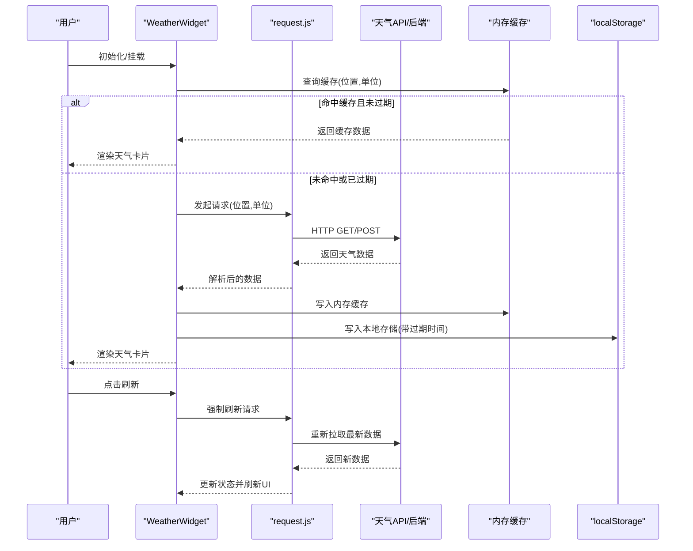
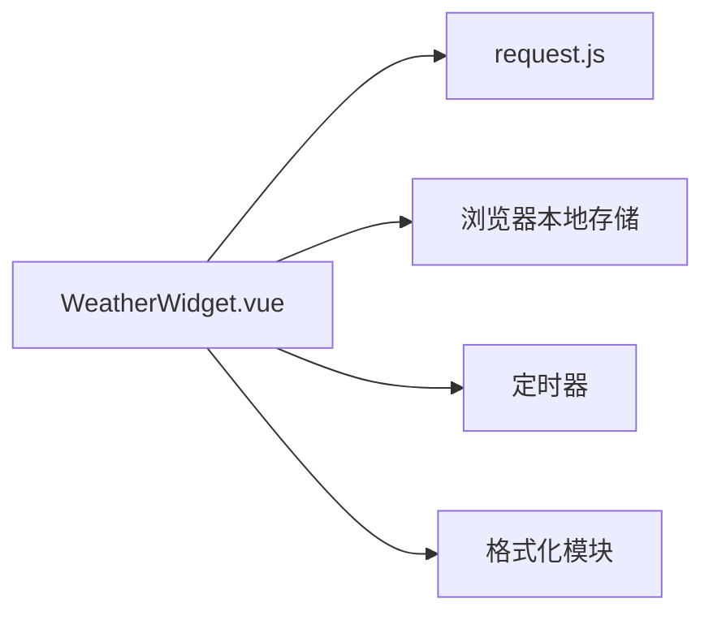

# 天气组件

<cite>
**本文引用的文件**   
- [WeatherWidget.vue](file://frontend/src/components/WeatherWidget.vue)
- [request.js](file://frontend/src/utils/request.js)
- [App.vue](file://frontend/src/App.vue)
- [main.js](file://frontend/src/main.js)
</cite>

## 目录
1. [简介](#简介)
2. [项目结构](#项目结构)
3. [核心组件](#核心组件)
4. [架构总览](#架构总览)
5. [详细组件分析](#详细组件分析)
6. [依赖分析](#依赖分析)
7. [性能考虑](#性能考虑)
8. [故障排查指南](#故障排查指南)
9. [结论](#结论)
10. [附录](#附录)

## 简介
本文件为 WeatherWidget 天气组件的详细技术文档，覆盖数据获取、显示格式化、用户交互、Props 定义、事件处理、与天气 API 的集成方式、缓存策略与本地存储机制，以及使用示例、样式主题配置、错误处理方案与性能优化建议。该组件位于前端工程，通过统一的请求工具访问后端或直接调用第三方天气接口（取决于实际集成），并在 UI 层提供可配置的展示与交互能力。

## 项目结构
WeatherWidget 组件属于前端 Vue 应用的一部分，主要位于 components 目录下，并通过全局或页面级入口引入。其依赖的请求封装位于 utils 目录，便于统一处理网络请求、拦截器与错误处理。

图表来源
- [App.vue](file://frontend/src/App.vue)
- [main.js](file://frontend/src/main.js)
- [WeatherWidget.vue](file://frontend/src/components/WeatherWidget.vue)
- [request.js](file://frontend/src/utils/request.js)

章节来源
- [WeatherWidget.vue](file://frontend/src/components/WeatherWidget.vue)
- [request.js](file://frontend/src/utils/request.js)
- [App.vue](file://frontend/src/App.vue)
- [main.js](file://frontend/src/main.js)

## 核心组件
WeatherWidget 是一个独立的 Vue 组件，负责：
- 接收位置信息、单位设置、刷新频率等 Props
- 发起天气数据请求并处理响应
- 对温度、体感、湿度、风速、天气状况等进行格式化展示
- 暴露刷新、位置更新、错误回调等事件
- 管理本地缓存与本地存储，减少重复请求

关键职责划分
- 数据获取：通过 request.js 进行 HTTP 请求，支持重试与超时控制
- 显示格式化：根据单位（摄氏度/华氏度）与语言环境格式化数值与描述
- 用户交互：点击刷新、切换单位、选择城市等
- 状态管理：组件内部维护加载态、错误态、数据态
- 缓存与持久化：内存缓存 + localStorage 持久化，按 key 过期策略清理

章节来源
- [WeatherWidget.vue](file://frontend/src/components/WeatherWidget.vue)
- [request.js](file://frontend/src/utils/request.js)

## 架构总览
组件与外部系统的交互流程如下：

图表来源
- [WeatherWidget.vue](file://frontend/src/components/WeatherWidget.vue)
- [request.js](file://frontend/src/utils/request.js)

## 详细组件分析

### 组件属性（Props）
- 位置信息
  - 名称：location
  - 类型：Object/String
  - 说明：支持经纬度对象或城市名字符串；用于定位天气数据来源
- 单位设置
  - 名称：unit
  - 类型：String
  - 可选值："celsius"/"fahrenheit"
  - 默认值："celsius"
- 刷新频率
  - 名称：refreshInterval
  - 类型：Number
  - 单位：秒
  - 默认值：300
- 是否启用缓存
  - 名称：enableCache
  - 类型：Boolean
  - 默认值：true
- 本地存储键前缀
  - 名称：storageKeyPrefix
  - 类型：String
  - 默认值："weather_"
- 自定义格式化函数
  - 名称：formatter
  - 类型：Function
  - 说明：允许父组件传入自定义格式化逻辑，覆盖默认的温度/湿度/风速格式
- 主题配置
  - 名称：theme
  - 类型：Object
  - 字段：背景色、文字颜色、图标风格等
  - 默认值：内置浅色/深色两套主题

章节来源
- [WeatherWidget.vue](file://frontend/src/components/WeatherWidget.vue)

### 事件（Events）
- refresh
  - 触发时机：用户主动点击刷新或定时器触发
  - 参数：{ location, unit }
- locationChange
  - 触发时机：位置信息更新
  - 参数：{ newLocation, oldLocation }
- dataUpdate
  - 触发时机：成功获取并更新天气数据
  - 参数：{ weatherData, timestamp }
- error
  - 触发时机：请求失败、解析异常、本地存储不可用
  - 参数：{ code, message, details }

章节来源
- [WeatherWidget.vue](file://frontend/src/components/WeatherWidget.vue)

### 数据获取与缓存策略
- 内存缓存
  - 以 location+unit 作为 key，保存最近一次的数据与时间戳
  - 在组件生命周期内优先读取内存缓存，避免重复请求
- 本地存储
  - 将数据序列化后存入 localStorage，key 由 storageKeyPrefix 与 location+unit 拼接
  - 设置过期时间，超过阈值自动失效
- 请求策略
  - 首次加载或缓存失效时发起网络请求
  - 支持重试机制与超时控制，失败时降级到缓存或显示错误提示
- 定时刷新
  - 基于 refreshInterval 启动定时器，周期性触发 refresh 事件并拉取最新数据

章节来源
- [WeatherWidget.vue](file://frontend/src/components/WeatherWidget.vue)
- [request.js](file://frontend/src/utils/request.js)

### 显示格式化
- 温度
  - 根据 unit 决定摄氏度或华氏度显示
  - 保留小数位数与单位符号可配置
- 体感温度、湿度、风速
  - 统一采用可读性强的中文描述，如“相对湿度”、“风速等级”
- 天气状况
  - 将代码映射为图标与文案，支持多语言扩展
- 自定义格式化
  - 通过 formatter 函数覆盖默认行为，满足个性化需求

章节来源
- [WeatherWidget.vue](file://frontend/src/components/WeatherWidget.vue)

### 用户交互
- 刷新按钮：触发 refresh 事件，强制拉取最新数据
- 单位切换：切换 celsius/fahrenheit，并同步更新缓存与显示
- 位置选择：支持输入城市名或选择预设地点，触发 locationChange 事件
- 错误重试：在网络错误时提供重试入口，提升用户体验

章节来源
- [WeatherWidget.vue](file://frontend/src/components/WeatherWidget.vue)

### 与天气 API 的集成
- 请求封装
  - 通过 request.js 统一发起 HTTP 请求，支持拦截器、错误码处理与重试
- 接口约定
  - 入参：location、unit、lang（可选）
  - 出参：包含温度、体感、湿度、风速、天气代码、更新时间等字段
- 错误映射
  - 将第三方 API 的错误码映射为组件内部错误码，便于上层处理

章节来源
- [request.js](file://frontend/src/utils/request.js)
- [WeatherWidget.vue](file://frontend/src/components/WeatherWidget.vue)

### 使用示例
- 基础用法
  - 在页面中引入 WeatherWidget，传入 location 与 unit，即可展示当前天气
- 监听事件
  - 监听 refresh、dataUpdate、error 等事件，实现日志记录或业务联动
- 自定义主题
  - 通过 theme 属性配置背景色、文字颜色与图标风格，适配不同页面风格
- 自定义格式化
  - 传入 formatter 函数，按需调整温度、湿度、风速的显示格式

章节来源
- [WeatherWidget.vue](file://frontend/src/components/WeatherWidget.vue)
- [App.vue](file://frontend/src/App.vue)

### 样式与主题配置
- 主题对象
  - background：背景渐变色或纯色
  - textColor：主文本颜色
  - iconStyle：图标风格（线性/填充/动态）
  - borderRadius：卡片圆角
  - shadow：阴影强度
- 样式覆盖
  - 通过 CSS 变量或 scoped 样式覆盖默认样式，确保与整体设计一致

章节来源
- [WeatherWidget.vue](file://frontend/src/components/WeatherWidget.vue)

## 依赖分析
组件依赖关系清晰，耦合度低，便于替换与扩展。

图表来源
- [WeatherWidget.vue](file://frontend/src/components/WeatherWidget.vue)
- [request.js](file://frontend/src/utils/request.js)

章节来源
- [WeatherWidget.vue](file://frontend/src/components/WeatherWidget.vue)
- [request.js](file://frontend/src/utils/request.js)

## 性能考虑
- 缓存命中率
  - 合理设置 refreshInterval，平衡数据新鲜度与请求次数
  - 利用内存缓存减少不必要的网络请求
- 请求优化
  - 合并相同 location+unit 的请求，避免并发重复
  - 使用防抖/节流限制频繁刷新操作
- 渲染优化
  - 仅更新必要字段，避免整卡重绘
  - 大体积图标资源懒加载
- 存储优化
  - 定期清理过期缓存，防止 localStorage 膨胀
  - 压缩序列化数据，降低存储占用

[本节为通用指导，不直接分析具体文件]

## 故障排查指南
- 常见错误
  - 网络请求失败：检查网络连通性与 API 可用性
  - 位置解析失败：确认 location 格式正确，支持经纬度或城市名
  - 本地存储不可用：检查浏览器隐私模式或存储空间限制
  - 数据解析异常：核对 API 返回结构与字段命名
- 调试建议
  - 开启 request.js 的请求日志，观察请求与响应
  - 在组件内打印缓存状态与时间戳，验证过期策略
  - 使用浏览器开发者工具的 Network 与 Storage 面板辅助定位问题
- 恢复策略
  - 失败重试与降级到缓存
  - 提供用户可见的错误提示与重试入口

章节来源
- [WeatherWidget.vue](file://frontend/src/components/WeatherWidget.vue)
- [request.js](file://frontend/src/utils/request.js)

## 结论
WeatherWidget 组件提供了完整的天气数据获取、格式化展示与用户交互能力，具备灵活的 Props 与事件体系，支持缓存与本地存储，便于在不同场景下复用与定制。通过合理的性能优化与完善的错误处理，可在保证用户体验的同时降低系统负载。

[本节为总结性内容，不直接分析具体文件]

## 附录
- 最佳实践
  - 在页面级统一管理 location 与 unit，避免组件间状态不一致
  - 对敏感 API Key 进行环境变量管理，避免硬编码
  - 为不同主题提供预设配置，简化接入成本
- 扩展方向
  - 增加更多天气指标（空气质量、紫外线指数等）
  - 支持多语言与地区化显示
  - 集成地图组件，实现可视化天气分布

[本节为补充性内容，不直接分析具体文件]