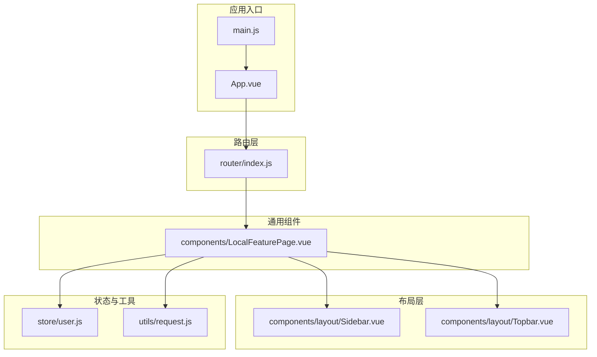
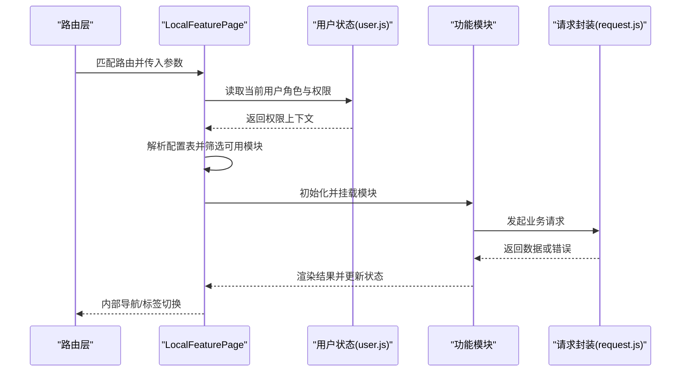
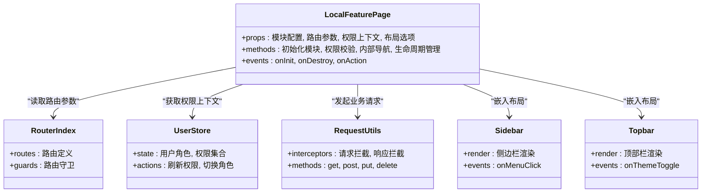

# 本地功能页面组件

<cite>
**本文档引用的文件**   
- [LocalFeaturePage.vue](file://frontend/src/components/LocalFeaturePage.vue)
- [index.js](file://frontend/src/router/index.js)
- [App.vue](file://frontend/src/App.vue)
- [main.js](file://frontend/src/main.js)
- [Sidebar.vue](file://frontend/src/components/layout/Sidebar.vue)
- [Topbar.vue](file://frontend/src/components/layout/Topbar.vue)
- [user.js](file://frontend/src/store/user.js)
- [request.js](file://frontend/src/utils/request.js)
</cite>

## 目录
1. [简介](#简介)
2. [项目结构](#项目结构)
3. [核心组件](#核心组件)
4. [架构总览](#架构总览)
5. [详细组件分析](#详细组件分析)
6. [依赖关系分析](#依赖关系分析)
7. [性能考量](#性能考量)
8. [故障排查指南](#故障排查指南)
9. [结论](#结论)
10. [附录](#附录)

## 简介
本文件围绕前端组件 LocalFeaturePage（本地功能页面）进行系统化文档化，聚焦其作为“本地功能容器”的设计理念与架构模式。该组件负责承载并编排多种本地功能模块，统一处理路由管理、权限控制与界面适配，为不同角色用户提供一致的交互体验。本文从系统架构、组件职责、数据流、集成方式、扩展方法与最佳实践等维度展开说明，帮助开发者快速理解并高效使用该组件。

## 项目结构
前端采用模块化组织：视图层按角色划分（学生、宿管、管理员），布局组件提供侧边栏与顶部栏，路由集中管理，状态管理与请求封装分离。LocalFeaturePage 位于通用组件目录，作为多业务页面的统一容器，通过配置化的方式接入具体功能模块。

图表来源
- [main.js](file://frontend/src/main.js)
- [App.vue](file://frontend/src/App.vue)
- [index.js](file://frontend/src/router/index.js)
- [LocalFeaturePage.vue](file://frontend/src/components/LocalFeaturePage.vue)
- [Sidebar.vue](file://frontend/src/components/layout/Sidebar.vue)
- [Topbar.vue](file://frontend/src/components/layout/Topbar.vue)
- [user.js](file://frontend/src/store/user.js)
- [request.js](file://frontend/src/utils/request.js)

章节来源
- [main.js](file://frontend/src/main.js)
- [App.vue](file://frontend/src/App.vue)
- [index.js](file://frontend/src/router/index.js)

## 核心组件
LocalFeaturePage 作为本地功能容器，承担以下职责：
- 功能模块装配：根据配置动态加载并渲染各功能子模块，支持按需挂载与卸载。
- 路由管理：维护内部路由或标签页导航，实现页面内跳转与状态保持。
- 权限控制：结合用户角色与资源权限，决定模块可见性与操作能力。
- 界面适配：响应式布局与主题切换，保证在不同设备与主题下的良好体验。
- 生命周期管理：对子模块的初始化、更新、销毁进行统一管理，避免内存泄漏。

章节来源
- [LocalFeaturePage.vue](file://frontend/src/components/LocalFeaturePage.vue)

## 架构总览
LocalFeaturePage 采用“容器-内容”模式，将路由、权限、布局与业务模块解耦。整体流程如下：
- 应用启动后，路由解析到目标页面，由 LocalFeaturePage 接收路由参数与权限上下文。
- 组件根据配置表选择并注册对应功能模块，完成初始化。
- 在用户交互过程中，组件维护内部导航状态，切换模块时复用已加载实例以提升性能。
- 权限校验贯穿模块访问与操作执行，未授权路径将被拦截或降级展示。
- 所有网络请求通过统一的请求封装，确保鉴权头、错误处理与重试策略一致。

图表来源
- [index.js](file://frontend/src/router/index.js)
- [LocalFeaturePage.vue](file://frontend/src/components/LocalFeaturePage.vue)
- [user.js](file://frontend/src/store/user.js)
- [request.js](file://frontend/src/utils/request.js)

## 详细组件分析

### 组件属性与配置
- 模块配置表：定义模块标识、标题、图标、路由路径、权限要求、是否默认加载等元信息。
- 路由参数：支持查询参数与路径参数，用于模块初始化与数据预取。
- 权限上下文：来自用户状态，包含角色、资源权限集合，用于控制模块可见性与操作按钮。
- 布局选项：控制侧边栏/顶部栏显示、主题模式、紧凑模式等。
- 事件回调：模块生命周期钩子（如 onInit、onDestroy）、用户操作回调（如 onAction）。

章节来源
- [LocalFeaturePage.vue](file://frontend/src/components/LocalFeaturePage.vue)

### 路由管理与页面布局
- 内部路由：基于标签页或抽屉式导航，实现模块间切换并保持各自状态。
- 外部路由：与全局路由联动，支持深度链接与浏览器前进后退。
- 布局适配：根据屏幕尺寸与主题自动调整布局密度与元素排列。
- 导航守卫：在进入模块前进行权限校验与数据预检查，失败则回退或提示。

章节来源
- [LocalFeaturePage.vue](file://frontend/src/components/LocalFeaturePage.vue)
- [index.js](file://frontend/src/router/index.js)

### 权限控制与用户界面适配
- 权限模型：基于角色的访问控制（RBAC）与资源级权限，支持细粒度控制。
- 界面适配：响应式栅格、主题变量、暗色模式、国际化文案。
- 降级策略：无权限时展示占位或引导信息，避免空白页面。

章节来源
- [LocalFeaturePage.vue](file://frontend/src/components/LocalFeaturePage.vue)
- [user.js](file://frontend/src/store/user.js)

### 模块集成与生命周期管理
- 模块注册：通过配置表声明式注册，支持懒加载与条件加载。
- 生命周期：统一初始化、激活、暂停、恢复、销毁流程，确保资源释放。
- 通信机制：父组件与子模块通过事件总线或状态共享进行通信，避免紧耦合。

章节来源
- [LocalFeaturePage.vue](file://frontend/src/components/LocalFeaturePage.vue)

### 使用示例与扩展方法
- 基础用法：在路由中引入 LocalFeaturePage，并传入模块配置与权限上下文。
- 自定义模块：实现标准接口（初始化、渲染、销毁），并在配置表中注册。
- 扩展点：注入中间件（如埋点、日志）、扩展布局插槽、自定义权限校验器。

章节来源
- [LocalFeaturePage.vue](file://frontend/src/components/LocalFeaturePage.vue)
- [index.js](file://frontend/src/router/index.js)

### 最佳实践与开发指南
- 配置优先：尽量通过配置驱动模块行为，减少硬编码。
- 权限前置：在进入模块前完成权限校验，避免无效渲染。
- 懒加载：非首屏模块延迟加载，提升初始性能。
- 错误边界：为每个模块设置错误边界，防止崩溃扩散。
- 可测试性：为模块暴露稳定接口，便于单元测试与端到端测试。

章节来源
- [LocalFeaturePage.vue](file://frontend/src/components/LocalFeaturePage.vue)

## 依赖关系分析
LocalFeaturePage 依赖路由、用户状态、请求封装与布局组件，形成清晰的层次结构。模块之间通过配置表与事件通信，降低耦合度。

图表来源
- [LocalFeaturePage.vue](file://frontend/src/components/LocalFeaturePage.vue)
- [index.js](file://frontend/src/router/index.js)
- [user.js](file://frontend/src/store/user.js)
- [request.js](file://frontend/src/utils/request.js)
- [Sidebar.vue](file://frontend/src/components/layout/Sidebar.vue)
- [Topbar.vue](file://frontend/src/components/layout/Topbar.vue)

章节来源
- [LocalFeaturePage.vue](file://frontend/src/components/LocalFeaturePage.vue)
- [index.js](file://frontend/src/router/index.js)
- [user.js](file://frontend/src/store/user.js)
- [request.js](file://frontend/src/utils/request.js)

## 性能考量
- 懒加载模块：仅在需要时加载，减少首屏体积。
- 状态复用：切换模块时保留状态，避免重复初始化。
- 请求去重与缓存：对相同请求进行合并与缓存，降低网络压力。
- 虚拟滚动：大数据列表使用虚拟滚动，提升渲染性能。
- 错误边界：隔离异常，防止整页崩溃。

[本节为通用指导，不直接分析具体文件]

## 故障排查指南
- 权限问题：检查用户状态中的角色与权限集合是否正确加载，确认模块配置的权限要求。
- 路由异常：核对路由参数与模块配置的一致性，确认内部导航路径有效。
- 模块加载失败：查看控制台错误，确认模块路径与接口可达性。
- 请求错误：检查请求封装的拦截器配置与后端接口响应格式。
- 布局错乱：验证响应式样式与主题变量是否正确注入。

章节来源
- [LocalFeaturePage.vue](file://frontend/src/components/LocalFeaturePage.vue)
- [user.js](file://frontend/src/store/user.js)
- [request.js](file://frontend/src/utils/request.js)

## 结论
LocalFeaturePage 以配置驱动的容器模式，将路由、权限、布局与业务模块有机整合，提供了高内聚、低耦合的前端页面解决方案。通过标准化的模块接口与完善的生命周期管理，开发者可以快速扩展新功能，同时保证系统的稳定性与可维护性。遵循本文的最佳实践与开发指南，能够显著提升开发效率与用户体验。

[本节为总结性内容，不直接分析具体文件]

## 附录
- 术语表：
  - 模块：指代一个独立的功能单元，具备完整的生命周期与接口。
  - 权限上下文：包含用户角色与资源权限的对象，用于控制访问。
  - 内部导航：组件内的路由或标签切换机制。
- 参考文件：
  - [LocalFeaturePage.vue](file://frontend/src/components/LocalFeaturePage.vue)
  - [index.js](file://frontend/src/router/index.js)
  - [user.js](file://frontend/src/store/user.js)
  - [request.js](file://frontend/src/utils/request.js)
  - [Sidebar.vue](file://frontend/src/components/layout/Sidebar.vue)
  - [Topbar.vue](file://frontend/src/components/layout/Topbar.vue)

[本节为补充信息，不直接分析具体文件]