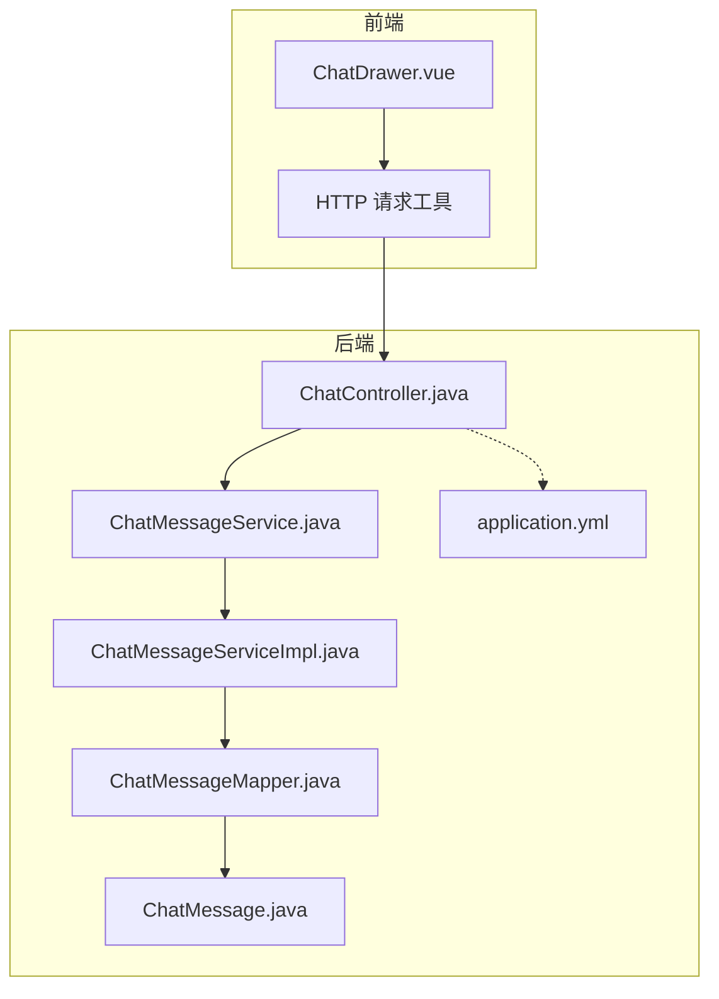
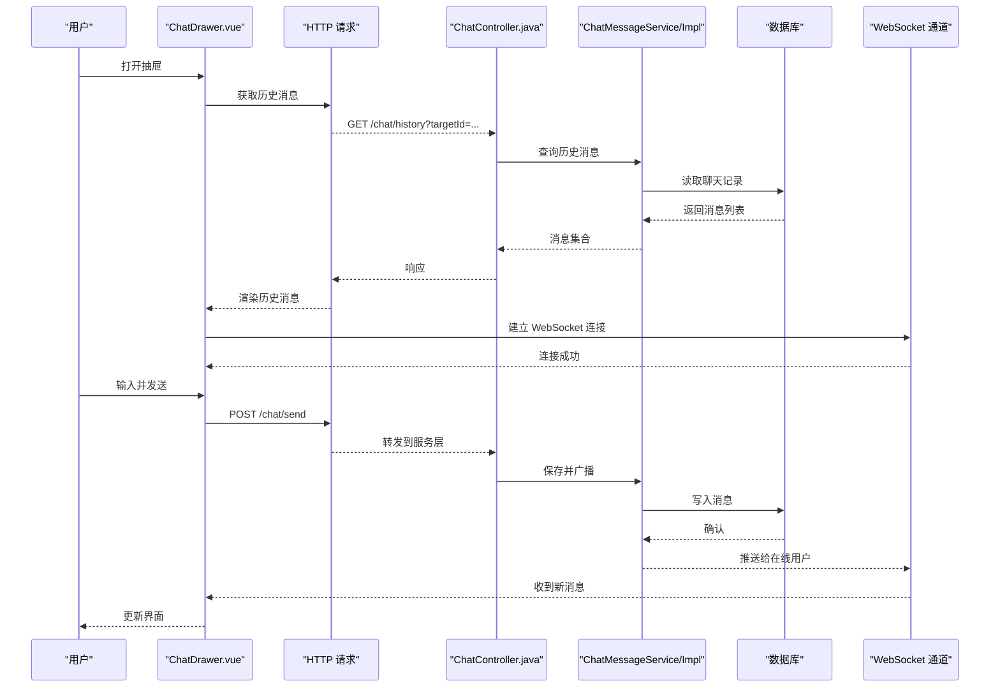
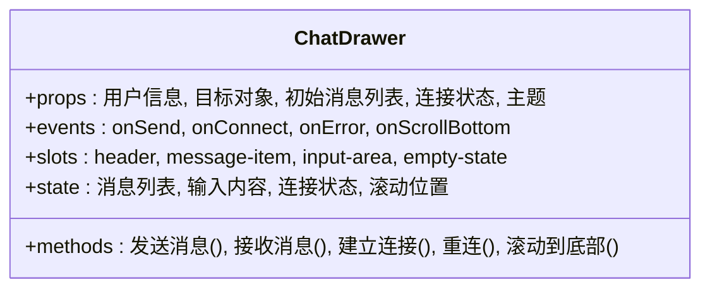
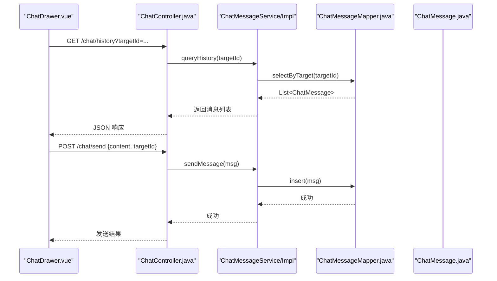
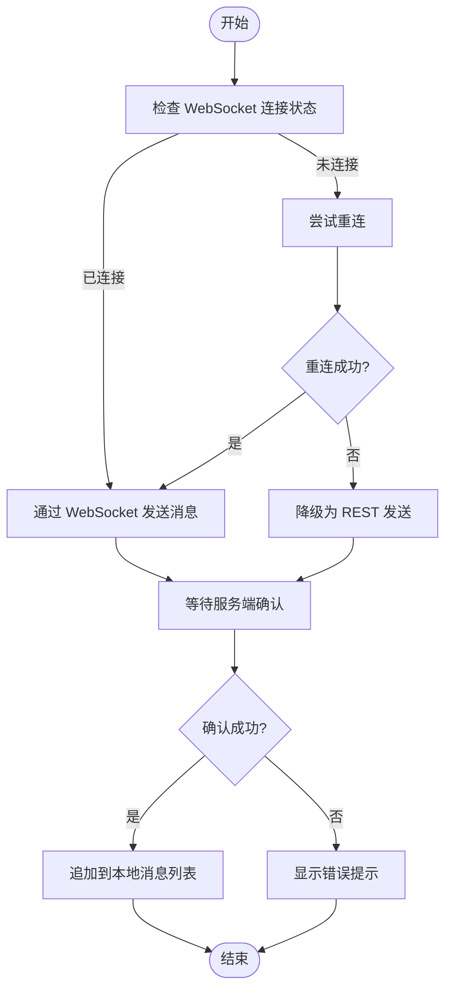
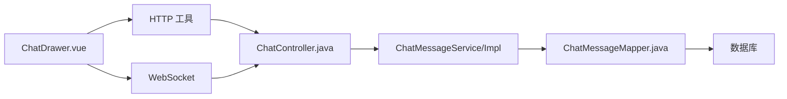

# 聊天抽屉组件

<cite>
**本文引用的文件**   
- [ChatDrawer.vue](file://frontend/src/components/ChatDrawer.vue)
- [ChatController.java](file://backend/src/main/java/com/dorm/backend/controller/ChatController.java)
- [ChatMessage.java](file://backend/src/main/java/com/dorm/backend/entity/ChatMessage.java)
- [ChatMessageServiceImpl.java](file://backend/src/main/java/com/dorm/backend/service/impl/ChatMessageServiceImpl.java)
- [ChatMessageService.java](file://backend/src/main/java/com/dorm/backend/service/ChatMessageService.java)
- [ChatMessageMapper.java](file://backend/src/main/java/com/dorm/backend/mapper/ChatMessageMapper.java)
- [application.yml](file://backend/src/main/resources/application.yml)
</cite>

## 目录
1. [简介](#简介)
2. [项目结构](#项目结构)
3. [核心组件](#核心组件)
4. [架构总览](#架构总览)
5. [详细组件分析](#详细组件分析)
6. [依赖关系分析](#依赖关系分析)
7. [性能考虑](#性能考虑)
8. [故障排查指南](#故障排查指南)
9. [结论](#结论)
10. [附录](#附录)

## 简介
本文件为“聊天抽屉组件”（ChatDrawer）的完整技术文档，面向前端与后端开发者。内容涵盖：
- 组件职责与核心功能：消息展示、发送接收、用户信息、连接状态、滚动与输入交互等
- Props 属性定义与事件模型：用户信息、消息列表、连接状态、回调事件等
- 插槽使用方式：自定义消息气泡、输入区、头部等
- 状态管理与实时通信：WebSocket 连接生命周期、断线重连、消息去重与排序
- 前后端集成：REST 接口与 WebSocket 协议约定、消息实体与持久化
- 使用示例、配置项、性能优化建议与调试技巧

## 项目结构
聊天抽屉组件位于前端 components 目录，后端提供聊天控制器、服务层、数据访问层及消息实体。整体采用前后端分离架构，通过 REST 获取历史消息，通过 WebSocket 实现实时通信。

图表来源
- [ChatDrawer.vue](file://frontend/src/components/ChatDrawer.vue)
- [ChatController.java](file://backend/src/main/java/com/dorm/backend/controller/ChatController.java)
- [ChatMessageService.java](file://backend/src/main/java/com/dorm/backend/service/ChatMessageService.java)
- [ChatMessageServiceImpl.java](file://backend/src/main/java/com/dorm/backend/service/impl/ChatMessageServiceImpl.java)
- [ChatMessageMapper.java](file://backend/src/main/java/com/dorm/backend/mapper/ChatMessageMapper.java)
- [ChatMessage.java](file://backend/src/main/java/com/dorm/backend/entity/ChatMessage.java)
- [application.yml](file://backend/src/main/resources/application.yml)

章节来源
- [ChatDrawer.vue](file://frontend/src/components/ChatDrawer.vue)
- [ChatController.java](file://backend/src/main/java/com/dorm/backend/controller/ChatController.java)
- [ChatMessage.java](file://backend/src/main/java/com/dorm/backend/entity/ChatMessage.java)
- [ChatMessageServiceImpl.java](file://backend/src/main/java/com/dorm/backend/service/impl/ChatMessageServiceImpl.java)
- [ChatMessageService.java](file://backend/src/main/java/com/dorm/backend/service/ChatMessageService.java)
- [ChatMessageMapper.java](file://backend/src/main/java/com/dorm/backend/mapper/ChatMessageMapper.java)
- [application.yml](file://backend/src/main/resources/application.yml)

## 核心组件
- ChatDrawer.vue：聊天抽屉 UI 与交互逻辑封装，负责渲染消息列表、处理输入、发起发送请求、维护本地消息状态与滚动行为，并管理 WebSocket 连接与重连策略。
- ChatController.java：暴露聊天相关 HTTP 接口（如获取历史消息、发送消息），以及可能的 WebSocket 端点。
- ChatMessageService/Impl：业务逻辑层，负责消息校验、权限控制、持久化与查询。
- ChatMessageMapper：数据访问层，映射数据库操作。
- ChatMessage.java：消息实体，包含发送者、接收者、内容、时间戳、类型等字段。
- application.yml：后端运行配置（端口、跨域、WebSocket 路径等）。

章节来源
- [ChatDrawer.vue](file://frontend/src/components/ChatDrawer.vue)
- [ChatController.java](file://backend/src/main/java/com/dorm/backend/controller/ChatController.java)
- [ChatMessageService.java](file://backend/src/main/java/com/dorm/backend/service/ChatMessageService.java)
- [ChatMessageServiceImpl.java](file://backend/src/main/java/com/dorm/backend/service/impl/ChatMessageServiceImpl.java)
- [ChatMessageMapper.java](file://backend/src/main/java/com/dorm/backend/mapper/ChatMessageMapper.java)
- [ChatMessage.java](file://backend/src/main/java/com/dorm/backend/entity/ChatMessage.java)
- [application.yml](file://backend/src/main/resources/application.yml)

## 架构总览
聊天抽屉组件采用“REST + WebSocket”混合通信模式：
- 首次加载或切换会话时，通过 REST 拉取历史消息；
- 建立 WebSocket 连接后，实时收发新消息；
- 断线自动重连，保证用户体验；
- 消息落库由后端统一处理，前端仅做必要缓存与去重。

图表来源
- [ChatDrawer.vue](file://frontend/src/components/ChatDrawer.vue)
- [ChatController.java](file://backend/src/main/java/com/dorm/backend/controller/ChatController.java)
- [ChatMessageService.java](file://backend/src/main/java/com/dorm/backend/service/ChatMessageService.java)
- [ChatMessageServiceImpl.java](file://backend/src/main/java/com/dorm/backend/service/impl/ChatMessageServiceImpl.java)
- [ChatMessageMapper.java](file://backend/src/main/java/com/dorm/backend/mapper/ChatMessageMapper.java)
- [ChatMessage.java](file://backend/src/main/java/com/dorm/backend/entity/ChatMessage.java)

## 详细组件分析

### ChatDrawer.vue 组件分析
- 核心职责
  - 渲染消息列表，支持按时间排序与滚动到底部
  - 处理用户输入、发送消息、显示发送状态（加载中、成功、失败）
  - 管理 WebSocket 连接生命周期（连接、断开、重连、错误处理）
  - 维护本地消息缓存，避免重复渲染与闪烁
  - 暴露 props、事件与插槽，便于上层页面定制
- 关键 props
  - 用户信息：当前登录用户标识、昵称、头像等
  - 目标对象：聊天对象 ID（如管理员、客服、室友等）
  - 初始消息列表：用于预填充历史消息
  - 连接状态：是否已建立 WebSocket 连接
  - 主题与样式开关：深色/浅色、气泡样式等
- 事件模型
  - onSend(message)：发送消息回调，供父组件统一处理或拦截
  - onConnect(state)：连接状态变化通知
  - onError(error)：错误事件，便于全局提示
  - onScrollBottom()：滚动到底部事件，可用于懒加载更多历史
- 插槽使用
  - header：自定义抽屉头部（标题、关闭按钮等）
  - message-item：自定义单条消息气泡（左右对齐、时间、状态图标）
  - input-area：自定义输入区域（富文本、表情、附件）
  - empty-state：空状态占位图或引导文案
- 状态管理
  - 本地消息数组：追加新消息，保持有序
  - 输入框内容：双向绑定，支持回车发送
  - 连接状态：connected/disconnecting/reconnecting/error
  - 滚动位置：自动滚动到底部，支持手动上滚查看历史
- 实时通信
  - 首次进入建立 WebSocket，监听消息事件
  - 断线指数退避重连，限制最大重试次数
  - 心跳保活，超时自动重连
  - 消息去重：基于唯一 ID 或时间戳+内容哈希
- 错误处理
  - 网络异常捕获与提示
  - 服务端错误码映射为用户友好提示
  - 降级策略：WebSocket 不可用时回退到轮询或仅 REST

图表来源
- [ChatDrawer.vue](file://frontend/src/components/ChatDrawer.vue)

章节来源
- [ChatDrawer.vue](file://frontend/src/components/ChatDrawer.vue)

### 后端聊天控制器与服务层
- ChatController.java
  - 提供 REST 接口：获取历史消息、发送消息
  - 可能暴露 WebSocket 端点，用于实时通信
  - 参数校验、鉴权、异常统一处理
- ChatMessageService/Impl
  - 业务规则：消息合法性校验、权限检查、敏感词过滤（可选）
  - 持久化：保存消息、分页查询、按会话聚合
  - 广播：将新消息推送至在线客户端
- ChatMessageMapper
  - 数据访问：插入、查询、分页、条件筛选
- ChatMessage.java
  - 字段：id、senderId、receiverId、content、type、timestamp、status 等

图表来源
- [ChatController.java](file://backend/src/main/java/com/dorm/backend/controller/ChatController.java)
- [ChatMessageService.java](file://backend/src/main/java/com/dorm/backend/service/ChatMessageService.java)
- [ChatMessageServiceImpl.java](file://backend/src/main/java/com/dorm/backend/service/impl/ChatMessageServiceImpl.java)
- [ChatMessageMapper.java](file://backend/src/main/java/com/dorm/backend/mapper/ChatMessageMapper.java)
- [ChatMessage.java](file://backend/src/main/java/com/dorm/backend/entity/ChatMessage.java)

章节来源
- [ChatController.java](file://backend/src/main/java/com/dorm/backend/controller/ChatController.java)
- [ChatMessageService.java](file://backend/src/main/java/com/dorm/backend/service/ChatMessageService.java)
- [ChatMessageServiceImpl.java](file://backend/src/main/java/com/dorm/backend/service/impl/ChatMessageServiceImpl.java)
- [ChatMessageMapper.java](file://backend/src/main/java/com/dorm/backend/mapper/ChatMessageMapper.java)
- [ChatMessage.java](file://backend/src/main/java/com/dorm/backend/entity/ChatMessage.java)

### 消息发送与接收流程（算法流程图）

图表来源
- [ChatDrawer.vue](file://frontend/src/components/ChatDrawer.vue)
- [ChatController.java](file://backend/src/main/java/com/dorm/backend/controller/ChatController.java)

章节来源
- [ChatDrawer.vue](file://frontend/src/components/ChatDrawer.vue)
- [ChatController.java](file://backend/src/main/java/com/dorm/backend/controller/ChatController.java)

### 使用示例与集成方法
- 在父组件中引入 ChatDrawer 并传入必要 props
- 监听 onSend 事件以统一处理发送逻辑（如埋点、审计）
- 监听 onConnect/onError 进行连接状态与错误提示
- 使用插槽自定义外观与交互细节
- 与路由/状态管理集成：根据当前会话动态切换 targetId

章节来源
- [ChatDrawer.vue](file://frontend/src/components/ChatDrawer.vue)

## 依赖关系分析
- 前端依赖
  - Vue 组件系统、事件总线或状态管理（如 Vuex/Pinia）
  - HTTP 请求工具（Axios 或 fetch）
  - WebSocket 原生或封装库
- 后端依赖
  - Spring MVC/WebSocket
  - MyBatis/MyBatis-Plus
  - 数据库（MySQL/PostgreSQL）
  - 安全框架（JWT/Session）

图表来源
- [ChatDrawer.vue](file://frontend/src/components/ChatDrawer.vue)
- [ChatController.java](file://backend/src/main/java/com/dorm/backend/controller/ChatController.java)
- [ChatMessageServiceImpl.java](file://backend/src/main/java/com/dorm/backend/service/impl/ChatMessageServiceImpl.java)
- [ChatMessageMapper.java](file://backend/src/main/java/com/dorm/backend/mapper/ChatMessageMapper.java)

章节来源
- [ChatDrawer.vue](file://frontend/src/components/ChatDrawer.vue)
- [ChatController.java](file://backend/src/main/java/com/dorm/backend/controller/ChatController.java)
- [ChatMessageServiceImpl.java](file://backend/src/main/java/com/dorm/backend/service/impl/ChatMessageServiceImpl.java)
- [ChatMessageMapper.java](file://backend/src/main/java/com/dorm/backend/mapper/ChatMessageMapper.java)

## 性能考虑
- 消息列表虚拟化：长列表使用虚拟滚动减少 DOM 节点数量
- 增量渲染：仅追加新消息，避免全量重绘
- 防抖与节流：输入框防抖、滚动节流
- WebSocket 优化：心跳保活、批量发送、压缩传输
- 缓存策略：本地缓存最近 N 条消息，减少重复请求
- 图片与富媒体：懒加载、缩略图、CDN 加速
- 错误降级：WebSocket 不可用时回退 REST，保障可用性

[本节为通用指导，不直接分析具体文件]

## 故障排查指南
- 连接问题
  - 检查 WebSocket 地址与端口配置
  - 查看浏览器控制台网络面板，确认握手成功
  - 检查防火墙与代理设置
- 消息丢失或重复
  - 核对消息唯一 ID 生成策略
  - 检查去重逻辑与本地缓存一致性
  - 服务端幂等性设计与重试机制
- 性能卡顿
  - 使用性能分析工具定位渲染瓶颈
  - 检查大消息渲染与富媒体加载
- 日志与调试
  - 开启前端调试日志与后端访问日志
  - 使用断点与抓包工具定位问题链路

章节来源
- [ChatDrawer.vue](file://frontend/src/components/ChatDrawer.vue)
- [ChatController.java](file://backend/src/main/java/com/dorm/backend/controller/ChatController.java)
- [application.yml](file://backend/src/main/resources/application.yml)

## 结论
ChatDrawer 组件通过清晰的 props/events/slots 设计，结合 REST 与 WebSocket 的混合通信模式，实现了稳定、可扩展的聊天抽屉能力。配合后端的分层架构与消息实体规范，能够支撑多场景下的实时对话需求。建议在大规模使用时引入虚拟化与缓存策略，并完善监控与告警体系。

[本节为总结性内容，不直接分析具体文件]

## 附录
- 配置项参考
  - WebSocket 路径、端口、超时时间
  - 跨域配置与安全策略
  - 日志级别与输出格式
- 最佳实践
  - 统一消息协议与版本管理
  - 前端错误边界与用户提示
  - 后端限流与熔断保护

[本节为补充信息，不直接分析具体文件]