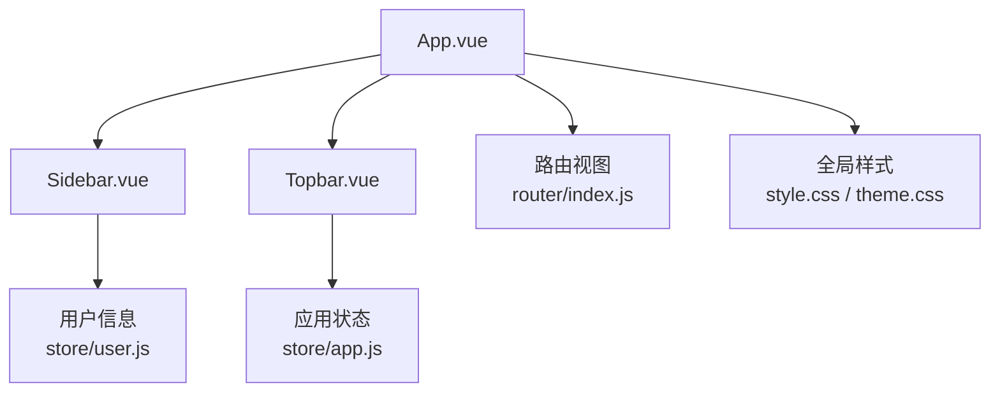
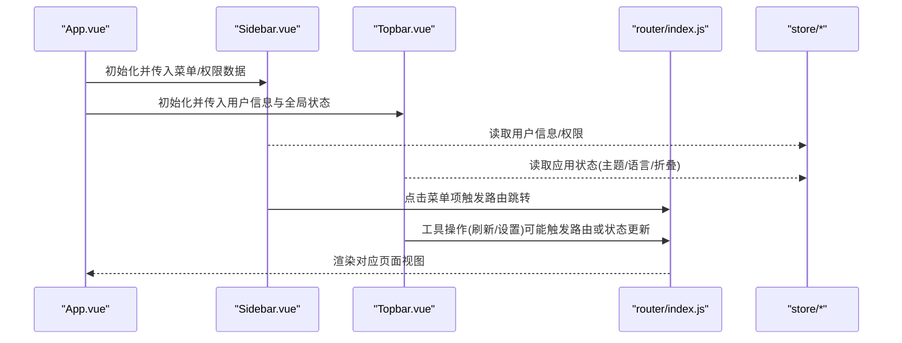
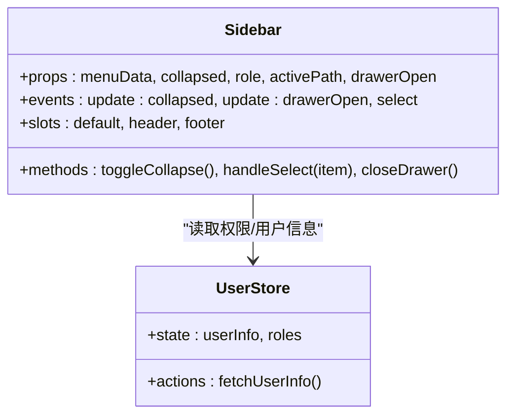
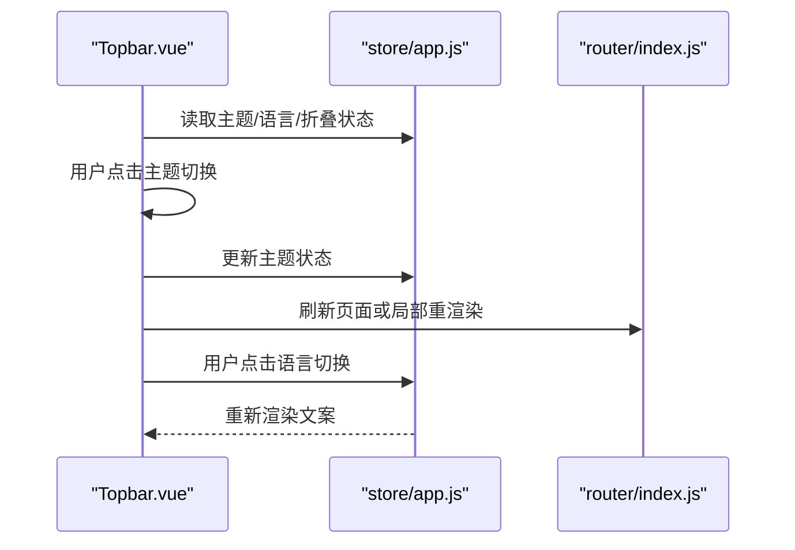
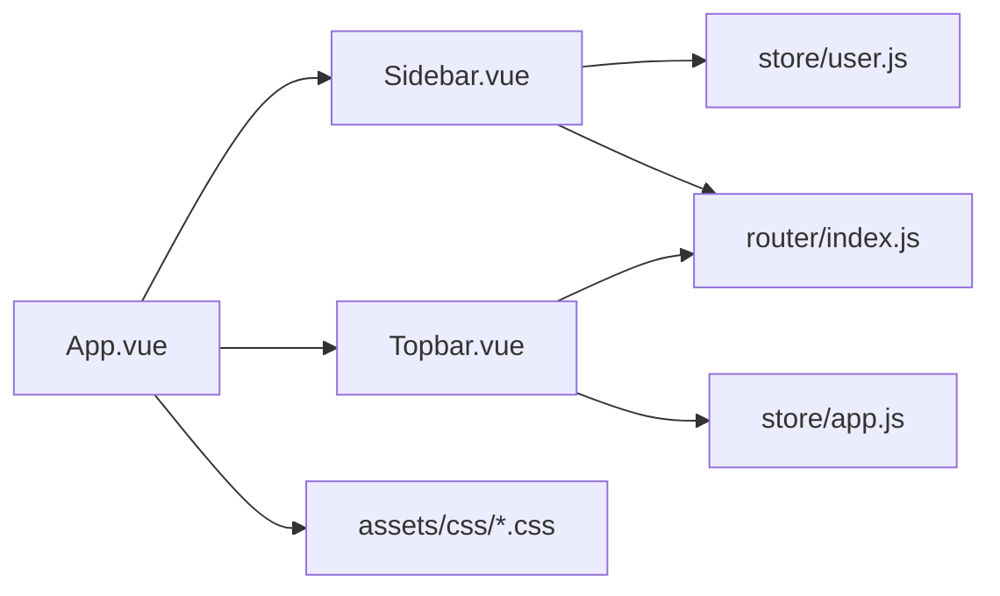

# 布局组件

<cite>
**本文引用的文件**   
- [Sidebar.vue](file://frontend/src/components/layout/Sidebar.vue)
- [Topbar.vue](file://frontend/src/components/layout/Topbar.vue)
- [App.vue](file://frontend/src/App.vue)
- [main.js](file://frontend/src/main.js)
- [router/index.js](file://frontend/src/router/index.js)
- [store/app.js](file://frontend/src/store/app.js)
- [store/user.js](file://frontend/src/store/user.js)
- [assets/css/style.css](file://frontend/src/assets/css/style.css)
- [assets/css/theme.css](file://frontend/src/assets/css/theme.css)
</cite>

## 目录
1. [简介](#简介)
2. [项目结构](#项目结构)
3. [核心组件](#核心组件)
4. [架构总览](#架构总览)
5. [详细组件分析](#详细组件分析)
6. [依赖分析](#依赖分析)
7. [性能考虑](#性能考虑)
8. [故障排查指南](#故障排查指南)
9. [结论](#结论)
10. [附录](#附录)

## 简介
本文件面向Dorm-Sys前端中的布局组件，重点围绕侧边栏（Sidebar）与顶部导航（Topbar）的实现、使用与扩展。文档涵盖：
- 组件属性（props）、事件（events）与插槽（slots）说明
- 响应式设计与主题定制、样式配置
- 使用示例、最佳实践与注意事项
- 组件间通信机制与数据传递方式
- 可访问性支持与国际化配置建议

## 项目结构
前端采用Vue单页应用结构，布局相关代码集中在components/layout目录，路由与状态管理分别位于router与store目录，全局样式在assets/css中组织。整体布局由根组件App.vue组合Sidebar与Topbar，并通过路由与状态驱动内容区域渲染。

图表来源
- [App.vue](file://frontend/src/App.vue)
- [Sidebar.vue](file://frontend/src/components/layout/Sidebar.vue)
- [Topbar.vue](file://frontend/src/components/layout/Topbar.vue)
- [router/index.js](file://frontend/src/router/index.js)
- [store/app.js](file://frontend/src/store/app.js)
- [store/user.js](file://frontend/src/store/user.js)
- [assets/css/style.css](file://frontend/src/assets/css/style.css)
- [assets/css/theme.css](file://frontend/src/assets/css/theme.css)

章节来源
- [App.vue](file://frontend/src/App.vue)
- [main.js](file://frontend/src/main.js)
- [router/index.js](file://frontend/src/router/index.js)

## 核心组件
- Sidebar.vue：侧边栏导航，负责菜单展示、选中态、折叠与移动端抽屉行为，通常与用户权限或角色联动。
- Topbar.vue：顶部导航，负责面包屑、搜索、通知、用户头像下拉等，常与全局状态（如主题、语言、折叠状态）交互。

章节来源
- [Sidebar.vue](file://frontend/src/components/layout/Sidebar.vue)
- [Topbar.vue](file://frontend/src/components/layout/Topbar.vue)

## 架构总览
布局层由App.vue作为容器，将Sidebar与Topbar组合，中间为路由视图区。状态通过store进行集中管理，路由控制页面切换，样式通过CSS变量与主题文件统一配置。

图表来源
- [App.vue](file://frontend/src/App.vue)
- [Sidebar.vue](file://frontend/src/components/layout/Sidebar.vue)
- [Topbar.vue](file://frontend/src/components/layout/Topbar.vue)
- [router/index.js](file://frontend/src/router/index.js)
- [store/app.js](file://frontend/src/store/app.js)
- [store/user.js](file://frontend/src/store/user.js)

## 详细组件分析

### Sidebar 侧边栏组件
职责
- 展示导航菜单，支持多级菜单与图标
- 处理选中态高亮与路由同步
- 支持折叠/展开与移动端抽屉模式
- 根据用户角色/权限过滤菜单项

常用属性（props）
- menuData：菜单数据结构，包含标题、路径、图标、子项等
- collapsed：是否折叠
- role：当前用户角色，用于权限过滤
- activePath：当前激活路径，用于高亮匹配
- drawerOpen：移动端抽屉开关状态

常用事件（events）
- update:collapsed：折叠状态双向绑定
- update:drawerOpen：抽屉开关状态双向绑定
- select：菜单项选择回调，常用于记录日志或埋点

插槽（slots）
- default：自定义菜单项渲染
- header：侧边栏头部区域（Logo/标题）
- footer：侧边栏底部区域（帮助/退出登录）

响应式设计
- 桌面端：固定宽度，支持折叠收起
- 平板/手机：默认隐藏，通过抽屉滑出；点击遮罩关闭

主题与样式
- 通过CSS变量定义背景、文字、边框、悬停色
- 支持明暗主题切换（与Topbar联动）

可访问性
- 菜单按钮具备aria-label与键盘导航支持
- 焦点管理与Tab顺序合理

国际化
- 文本建议使用i18n键值，避免硬编码字符串

使用示例（概念）
- 在App.vue中引入Sidebar，传入menuData与collapsed状态，监听update:collapsed以持久化折叠状态
- 在移动端通过drawerOpen控制抽屉显示

最佳实践
- 菜单数据扁平化后按层级渲染，提升渲染性能
- 路由变化时自动计算activePath，避免手动维护
- 权限过滤在服务端返回菜单前完成，减少前端判断复杂度

注意事项
- 避免在菜单项中使用复杂DOM导致重排
- 移动端抽屉需阻止背景滚动

章节来源
- [Sidebar.vue](file://frontend/src/components/layout/Sidebar.vue)
- [store/user.js](file://frontend/src/store/user.js)
- [assets/css/theme.css](file://frontend/src/assets/css/theme.css)

#### 类关系图（概念映射到实际文件）

图表来源
- [Sidebar.vue](file://frontend/src/components/layout/Sidebar.vue)
- [store/user.js](file://frontend/src/store/user.js)

### Topbar 顶部导航组件
职责
- 展示面包屑、搜索框、通知入口、用户头像下拉
- 控制全局折叠状态、主题切换、语言切换
- 提供快捷操作（刷新、全屏、设置）

常用属性（props）
- user：用户信息对象（头像、姓名、角色）
- collapsed：全局折叠状态
- breadcrumb：面包屑数据
- notifications：通知列表

常用事件（events）
- update:collapsed：折叠状态双向绑定
- search：搜索输入回调
- logout：登出回调
- themeChange：主题切换回调
- langChange：语言切换回调

插槽（slots）
- left：左侧区域（Logo/标题）
- center：中间区域（搜索/面包屑）
- right：右侧区域（通知/用户）

响应式设计
- 桌面端：完整展示所有功能
- 平板/手机：隐藏次要功能，保留关键入口

主题与样式
- 通过CSS变量控制颜色、阴影、圆角
- 支持跟随系统主题或强制切换

可访问性
- 下拉菜单具备键盘导航与ARIA属性
- 按钮具备清晰的语义标签

国际化
- 文案通过i18n键值管理，支持动态切换

使用示例（概念）
- 在App.vue中引入Topbar，绑定collapsed与user信息，监听themeChange/langChange更新全局状态

最佳实践
- 将高频操作（如搜索）防抖处理
- 下拉菜单避免过深层级，保持易用性

注意事项
- 注意移动端点击区域大小，确保触控友好
- 通知列表过长时应分页或虚拟滚动

章节来源
- [Topbar.vue](file://frontend/src/components/layout/Topbar.vue)
- [store/app.js](file://frontend/src/store/app.js)
- [assets/css/theme.css](file://frontend/src/assets/css/theme.css)

#### 序列图（Topbar交互流程）

图表来源
- [Topbar.vue](file://frontend/src/components/layout/Topbar.vue)
- [store/app.js](file://frontend/src/store/app.js)
- [router/index.js](file://frontend/src/router/index.js)

### 组件间通信与数据传递
- 父子通信：App.vue作为父组件，向Sidebar与Topbar传递props（如menuData、user、collapsed），并通过事件回调接收子组件状态变更。
- 状态共享：store/app.js与store/user.js集中管理应用级状态（主题、语言、折叠、用户信息），组件通过读写store实现跨组件通信。
- 路由联动：Sidebar点击菜单项触发路由跳转，Topbar面包屑随路由变化更新。

章节来源
- [App.vue](file://frontend/src/App.vue)
- [store/app.js](file://frontend/src/store/app.js)
- [store/user.js](file://frontend/src/store/user.js)
- [router/index.js](file://frontend/src/router/index.js)

## 依赖分析
布局组件依赖以下模块：
- Vue运行时与组件系统
- 路由模块（router）用于页面跳转与面包屑生成
- 状态管理（store）用于主题、语言、用户信息等
- 样式文件（style.css、theme.css）用于主题与布局样式

图表来源
- [Sidebar.vue](file://frontend/src/components/layout/Sidebar.vue)
- [Topbar.vue](file://frontend/src/components/layout/Topbar.vue)
- [App.vue](file://frontend/src/App.vue)
- [store/app.js](file://frontend/src/store/app.js)
- [store/user.js](file://frontend/src/store/user.js)
- [router/index.js](file://frontend/src/router/index.js)
- [assets/css/style.css](file://frontend/src/assets/css/style.css)
- [assets/css/theme.css](file://frontend/src/assets/css/theme.css)

章节来源
- [assets/css/style.css](file://frontend/src/assets/css/style.css)
- [assets/css/theme.css](file://frontend/src/assets/css/theme.css)

## 性能考虑
- 菜单数据懒加载：仅在需要时请求并缓存，避免首屏过重
- 路由懒加载：页面组件按需加载，减少初始包体积
- 防抖与节流：搜索输入与窗口resize事件使用防抖/节流
- 虚拟滚动：长列表（通知、消息）使用虚拟滚动优化渲染
- CSS变量与主题切换：避免频繁DOM操作，优先使用变量覆盖

[本节为通用指导，不直接分析具体文件]

## 故障排查指南
常见问题与解决思路
- 菜单高亮不正确：检查activePath计算逻辑与路由匹配规则
- 移动端抽屉无法关闭：确认遮罩点击事件与drawerOpen状态同步
- 主题切换无效：检查CSS变量覆盖与浏览器缓存
- 国际化未生效：确认i18n资源加载与locale切换时机
- 权限过滤异常：核对后端返回的菜单数据与前端角色判断逻辑

章节来源
- [Sidebar.vue](file://frontend/src/components/layout/Sidebar.vue)
- [Topbar.vue](file://frontend/src/components/layout/Topbar.vue)
- [store/app.js](file://frontend/src/store/app.js)
- [store/user.js](file://frontend/src/store/user.js)

## 结论
Sidebar与Topbar作为Dorm-Sys的核心布局组件，承担了导航、状态控制与用户交互的关键职责。通过合理的props/events/slots设计、响应式适配、主题与国际化支持，以及清晰的组件通信机制，能够为后台管理系统提供稳定、可扩展的布局基础。建议在后续迭代中持续优化菜单数据模型、增强可访问性与性能表现。

[本节为总结性内容，不直接分析具体文件]

## 附录
- 使用示例（概念）
  - 在App.vue中引入Sidebar与Topbar，绑定collapsed与user信息，监听事件更新状态
  - 在Sidebar中传入menuData与role，实现权限过滤与路由跳转
  - 在Topbar中实现主题切换与语言切换，更新store状态并触发界面重渲染
- 最佳实践清单
  - 使用CSS变量统一管理主题色
  - 菜单数据与服务端保持一致，避免重复转换
  - 对长列表与搜索输入进行性能优化
  - 遵循可访问性规范，确保键盘与屏幕阅读器友好
- 注意事项
  - 避免在组件内直接修改外部状态，统一通过store管理
  - 移动端交互需考虑触控体验与手势冲突
  - 国际化资源需及时更新，避免遗漏文案

[本节为补充信息，不直接分析具体文件]