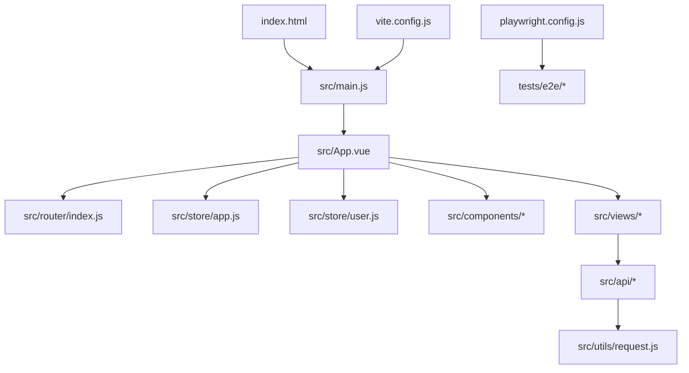
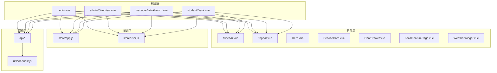
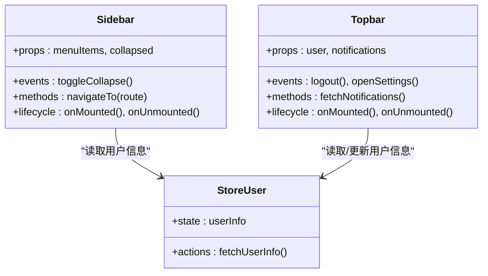
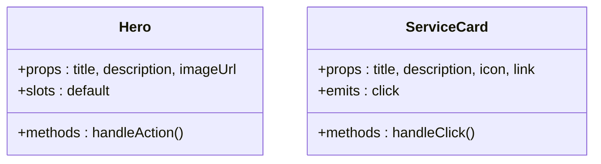
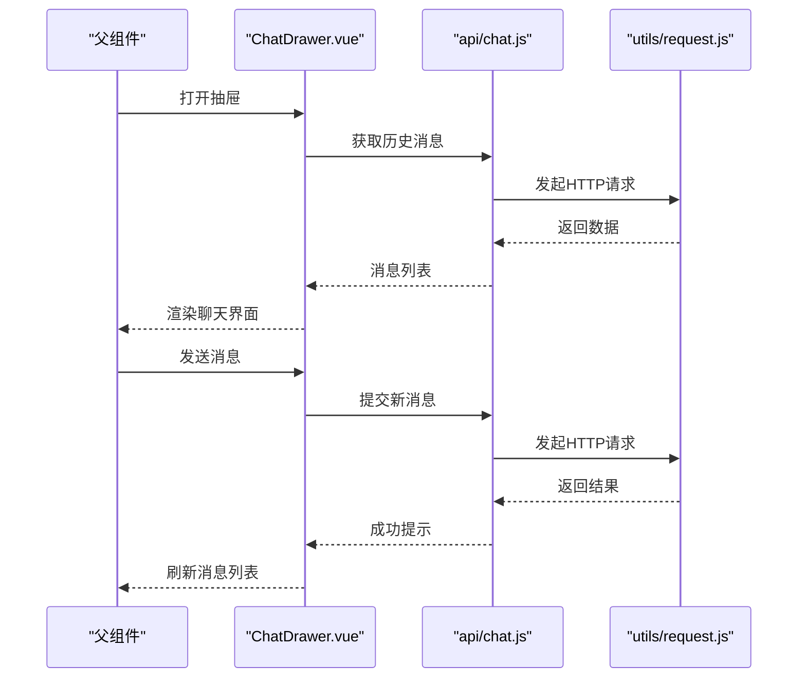
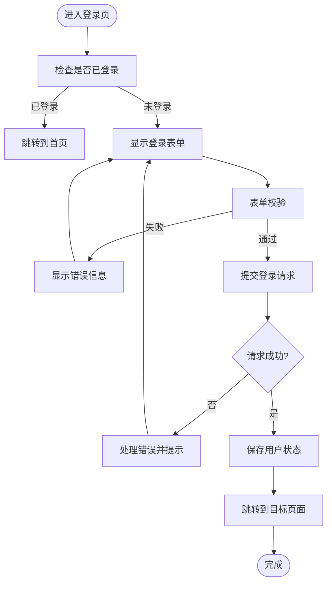
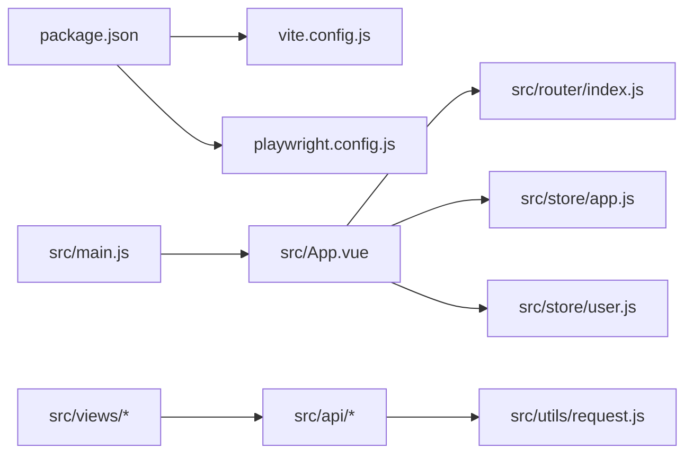

# 组件开发指南

<cite>
**本文引用的文件**   
- [package.json](file://frontend/package.json)
- [vite.config.js](file://frontend/vite.config.js)
- [playwright.config.js](file://frontend/playwright.config.js)
- [main.js](file://frontend/src/main.js)
- [App.vue](file://frontend/src/App.vue)
- [index.html](file://frontend/index.html)
- [router/index.js](file://frontend/src/router/index.js)
- [utils/request.js](file://frontend/src/utils/request.js)
- [store/app.js](file://frontend/src/store/app.js)
- [store/user.js](file://frontend/src/store/user.js)
- [components/layout/Sidebar.vue](file://frontend/src/components/layout/Sidebar.vue)
- [components/layout/Topbar.vue](file://frontend/src/components/layout/Topbar.vue)
- [components/ui/Hero.vue](file://frontend/src/components/ui/Hero.vue)
- [components/ui/ServiceCard.vue](file://frontend/src/components/ui/ServiceCard.vue)
- [components/ChatDrawer.vue](file://frontend/src/components/ChatDrawer.vue)
- [components/LocalFeaturePage.vue](file://frontend/src/components/LocalFeaturePage.vue)
- [components/WeatherWidget.vue](file://frontend/src/components/WeatherWidget.vue)
- [views/Login.vue](file://frontend/src/views/Login.vue)
- [views/admin/Overview.vue](file://frontend/src/views/admin/Overview.vue)
- [views/manager/Workbench.vue](file://frontend/src/views/manager/Workbench.vue)
- [views/student/Desk.vue](file://frontend/src/views/student/Desk.vue)
- [tests/e2e/roles.spec.js](file://frontend/tests/e2e/roles.spec.js)
</cite>

## 目录
1. [简介](#简介)
2. [项目结构](#项目结构)
3. [核心组件](#核心组件)
4. [架构总览](#架构总览)
5. [详细组件分析](#详细组件分析)
6. [依赖关系分析](#依赖关系分析)
7. [性能考虑](#性能考虑)
8. [故障排查指南](#故障排查指南)
9. [结论](#结论)
10. [附录](#附录)

## 简介
本指南面向Dorm-Sys前端（Vue 3）的组件开发，覆盖最佳实践、代码规范、设计模式、组件创建流程与文件组织、技术栈选择、属性定义、事件处理、插槽使用、生命周期管理、测试策略（单元与端到端）、文档生成、版本管理与发布流程，以及构建工具、打包优化与性能监控。目标是帮助开发者快速上手并持续产出高质量、可维护的前端组件。

## 项目结构
前端采用Vite + Vue 3工程化方案，目录按功能分层：
- src/api：封装后端接口调用
- src/assets：静态资源与样式
- src/components：可复用UI与业务组件
- src/router：路由配置
- src/store：状态管理
- src/utils：工具函数与请求封装
- src/views：页面级视图
- tests/e2e：端到端测试用例
- 根目录：构建与测试配置文件

图表来源
- [index.html:1-50](file://frontend/index.html#L1-L50)
- [main.js:1-50](file://frontend/src/main.js#L1-L50)
- [App.vue:1-100](file://frontend/src/App.vue#L1-L100)
- [router/index.js:1-100](file://frontend/src/router/index.js#L1-L100)
- [store/app.js:1-100](file://frontend/src/store/app.js#L1-L100)
- [store/user.js:1-100](file://frontend/src/store/user.js#L1-L100)
- [vite.config.js:1-100](file://frontend/vite.config.js#L1-L100)
- [playwright.config.js:1-100](file://frontend/playwright.config.js#L1-L100)

章节来源
- [package.json:1-100](file://frontend/package.json#L1-L100)
- [vite.config.js:1-100](file://frontend/vite.config.js#L1-L100)
- [playwright.config.js:1-100](file://frontend/playwright.config.js#L1-L100)
- [index.html:1-50](file://frontend/index.html#L1-L50)
- [main.js:1-50](file://frontend/src/main.js#L1-L50)
- [App.vue:1-100](file://frontend/src/App.vue#L1-L100)
- [router/index.js:1-100](file://frontend/src/router/index.js#L1-L100)
- [utils/request.js:1-100](file://frontend/src/utils/request.js#L1-L100)
- [store/app.js:1-100](file://frontend/src/store/app.js#L1-L100)
- [store/user.js:1-100](file://frontend/src/store/user.js#L1-L100)

## 核心组件
- 布局组件
  - Sidebar.vue：侧边导航，负责菜单渲染与路由跳转
  - Topbar.vue：顶部栏，展示用户信息、通知入口等
- UI基础组件
  - Hero.vue：首屏展示卡片
  - ServiceCard.vue：服务项卡片
- 业务组件
  - ChatDrawer.vue：聊天抽屉
  - LocalFeaturePage.vue：本地特性页
  - WeatherWidget.vue：天气小部件
- 页面视图
  - Login.vue：登录页
  - admin/Overview.vue：管理员概览
  - manager/Workbench.vue：宿管工作台
  - student/Desk.vue：学生桌面

组件职责边界清晰，遵循“单一职责”原则；通用UI下沉至ui目录，布局组件集中于layout目录，业务组件按功能域划分。

章节来源
- [components/layout/Sidebar.vue:1-200](file://frontend/src/components/layout/Sidebar.vue#L1-L200)
- [components/layout/Topbar.vue:1-200](file://frontend/src/components/layout/Topbar.vue#L1-L200)
- [components/ui/Hero.vue:1-200](file://frontend/src/components/ui/Hero.vue#L1-L200)
- [components/ui/ServiceCard.vue:1-200](file://frontend/src/components/ui/ServiceCard.vue#L1-L200)
- [components/ChatDrawer.vue:1-200](file://frontend/src/components/ChatDrawer.vue#L1-L200)
- [components/LocalFeaturePage.vue:1-200](file://frontend/src/components/LocalFeaturePage.vue#L1-L200)
- [components/WeatherWidget.vue:1-200](file://frontend/src/components/WeatherWidget.vue#L1-L200)
- [views/Login.vue:1-200](file://frontend/src/views/Login.vue#L1-L200)
- [views/admin/Overview.vue:1-200](file://frontend/src/views/admin/Overview.vue#L1-L200)
- [views/manager/Workbench.vue:1-200](file://frontend/src/views/manager/Workbench.vue#L1-L200)
- [views/student/Desk.vue:1-200](file://frontend/src/views/student/Desk.vue#L1-L200)

## 架构总览
整体采用“视图层 + 组件层 + 状态层 + 网络层”的分层架构：
- 视图层：路由驱动的页面组件
- 组件层：可复用的UI与业务组件
- 状态层：应用全局状态与用户状态
- 网络层：统一的HTTP请求封装

图表来源
- [router/index.js:1-100](file://frontend/src/router/index.js#L1-L100)
- [App.vue:1-100](file://frontend/src/App.vue#L1-L100)
- [store/app.js:1-100](file://frontend/src/store/app.js#L1-L100)
- [store/user.js:1-100](file://frontend/src/store/user.js#L1-L100)
- [utils/request.js:1-100](file://frontend/src/utils/request.js#L1-L100)
- [components/layout/Sidebar.vue:1-200](file://frontend/src/components/layout/Sidebar.vue#L1-L200)
- [components/layout/Topbar.vue:1-200](file://frontend/src/components/layout/Topbar.vue#L1-L200)
- [components/ui/Hero.vue:1-200](file://frontend/src/components/ui/Hero.vue#L1-L200)
- [components/ui/ServiceCard.vue:1-200](file://frontend/src/components/ui/ServiceCard.vue#L1-L200)
- [components/ChatDrawer.vue:1-200](file://frontend/src/components/ChatDrawer.vue#L1-L200)
- [components/LocalFeaturePage.vue:1-200](file://frontend/src/components/LocalFeaturePage.vue#L1-L200)
- [components/WeatherWidget.vue:1-200](file://frontend/src/components/WeatherWidget.vue#L1-L200)

## 详细组件分析

### 组件A：布局组件（Sidebar.vue 与 Topbar.vue）
- 职责
  - Sidebar：渲染菜单、高亮当前路由、响应式折叠
  - Topbar：展示用户信息、通知、主题切换入口
- 交互
  - 通过路由跳转与状态更新驱动界面变化
  - 与store中的用户信息联动显示
- 生命周期
  - 初始化时加载必要数据，销毁时清理监听器

图表来源
- [components/layout/Sidebar.vue:1-200](file://frontend/src/components/layout/Sidebar.vue#L1-L200)
- [components/layout/Topbar.vue:1-200](file://frontend/src/components/layout/Topbar.vue#L1-L200)
- [store/user.js:1-100](file://frontend/src/store/user.js#L1-L100)

章节来源
- [components/layout/Sidebar.vue:1-200](file://frontend/src/components/layout/Sidebar.vue#L1-L200)
- [components/layout/Topbar.vue:1-200](file://frontend/src/components/layout/Topbar.vue#1-L200)
- [store/user.js:1-100](file://frontend/src/store/user.js#L1-L100)

### 组件B：UI基础组件（Hero.vue 与 ServiceCard.vue）
- 职责
  - Hero：首屏大图与标题展示
  - ServiceCard：服务项卡片，支持点击跳转或回调
- 属性与事件
  - props：title, description, imageUrl, onClick
  - emits：click
- 插槽
  - default插槽用于扩展内容

图表来源
- [components/ui/Hero.vue:1-200](file://frontend/src/components/ui/Hero.vue#L1-L200)
- [components/ui/ServiceCard.vue:1-200](file://frontend/src/components/ui/ServiceCard.vue#L1-L200)

章节来源
- [components/ui/Hero.vue:1-200](file://frontend/src/components/ui/Hero.vue#L1-L200)
- [components/ui/ServiceCard.vue:1-200](file://frontend/src/components/ui/ServiceCard.vue#L1-L200)

### 组件C：业务组件（ChatDrawer.vue）
- 职责
  - 提供聊天面板，支持消息列表渲染、输入发送、滚动定位
- 数据流
  - 从store或父组件接收消息列表，提交新消息后触发刷新
- 生命周期
  - 进入时加载历史消息，离开时清理定时器

图表来源
- [components/ChatDrawer.vue:1-200](file://frontend/src/components/ChatDrawer.vue#L1-L200)
- [utils/request.js:1-100](file://frontend/src/utils/request.js#L1-L100)

章节来源
- [components/ChatDrawer.vue:1-200](file://frontend/src/components/ChatDrawer.vue#L1-L200)
- [utils/request.js:1-100](file://frontend/src/utils/request.js#L1-L100)

### 组件D：页面视图（Login.vue）
- 职责
  - 用户登录表单校验、提交、错误处理与跳转
- 数据流
  - 表单数据绑定到本地状态，提交后调用认证接口，成功后写入store并跳转
- 生命周期
  - 挂载时检查是否已登录，避免重复登录

图表来源
- [views/Login.vue:1-200](file://frontend/src/views/Login.vue#L1-L200)
- [store/user.js:1-100](file://frontend/src/store/user.js#L1-L100)
- [utils/request.js:1-100](file://frontend/src/utils/request.js#L1-L100)

章节来源
- [views/Login.vue:1-200](file://frontend/src/views/Login.vue#L1-L200)
- [store/user.js:1-100](file://frontend/src/store/user.js#L1-L100)
- [utils/request.js:1-100](file://frontend/src/utils/request.js#L1-L100)

## 依赖关系分析
- 构建与运行
  - Vite作为开发与构建工具，提供热更新与按需编译
  - Playwright用于端到端测试，基于浏览器自动化
- 运行时依赖
  - Vue 3为框架核心，配合路由与状态管理
  - 统一请求封装在utils/request.js中，所有api模块依赖该模块

图表来源
- [package.json:1-100](file://frontend/package.json#L1-L100)
- [vite.config.js:1-100](file://frontend/vite.config.js#L1-L100)
- [playwright.config.js:1-100](file://frontend/playwright.config.js#L1-L100)
- [main.js:1-50](file://frontend/src/main.js#L1-L50)
- [App.vue:1-100](file://frontend/src/App.vue#L1-L100)
- [router/index.js:1-100](file://frontend/src/router/index.js#L1-L100)
- [store/app.js:1-100](file://frontend/src/store/app.js#L1-L100)
- [store/user.js:1-100](file://frontend/src/store/user.js#L1-L100)
- [utils/request.js:1-100](file://frontend/src/utils/request.js#L1-L100)

章节来源
- [package.json:1-100](file://frontend/package.json#L1-L100)
- [vite.config.js:1-100](file://frontend/vite.config.js#L1-L100)
- [playwright.config.js:1-100](file://frontend/playwright.config.js#L1-L100)
- [main.js:1-50](file://frontend/src/main.js#L1-L50)
- [App.vue:1-100](file://frontend/src/App.vue#L1-L100)
- [router/index.js:1-100](file://frontend/src/router/index.js#L1-L100)
- [store/app.js:1-100](file://frontend/src/store/app.js#L1-L100)
- [store/user.js:1-100](file://frontend/src/store/user.js#L1-L100)
- [utils/request.js:1-100](file://frontend/src/utils/request.js#L1-L100)

## 性能考虑
- 构建优化
  - 使用Vite的按需加载与代码分割，减少首屏体积
  - 静态资源压缩与缓存策略
- 运行时优化
  - 组件懒加载与路由级分包
  - 列表渲染使用虚拟滚动（大数据场景）
  - 避免不必要的重渲染，合理使用computed与watch
- 监控与度量
  - 集成性能埋点，记录关键操作耗时与错误率
  - 使用浏览器性能面板与网络面板定位瓶颈

[本节为通用指导，不直接分析具体文件]

## 故障排查指南
- 常见问题
  - 路由跳转无效：检查路由配置与权限守卫
  - 接口请求失败：检查请求封装的错误处理与拦截器
  - 状态不同步：检查store的action与mutation调用链
- 调试建议
  - 使用浏览器开发者工具断点调试
  - 打印关键状态与网络请求日志
  - 端到端测试用例回放定位问题

章节来源
- [router/index.js:1-100](file://frontend/src/router/index.js#L1-L100)
- [utils/request.js:1-100](file://frontend/src/utils/request.js#L1-L100)
- [store/app.js:1-100](file://frontend/src/store/app.js#L1-L100)
- [store/user.js:1-100](file://frontend/src/store/user.js#L1-L100)

## 结论
通过清晰的组件分层、统一的请求封装与状态管理，结合Vite与Playwright的工程化能力，Dorm-Sys前端能够高效地交付稳定、可维护的组件与页面。遵循本指南的实践，可显著提升开发效率与产品质量。

[本节为总结性内容，不直接分析具体文件]

## 附录
- 组件创建流程
  - 明确组件职责与边界
  - 定义props、emits、插槽与内部状态
  - 实现生命周期钩子与副作用清理
  - 编写单元测试与端到端用例
  - 生成文档并纳入版本管理
- 代码规范与设计模式
  - 单一职责、组合优于继承
  - 使用Composition API组织逻辑
  - 保持组件无副作用与纯函数思维
- 测试策略
  - 单元测试：组件渲染、交互与状态变更
  - 端到端测试：关键业务流程验证
- 文档与发布
  - 使用JSDoc或Storybook生成组件文档
  - 语义化版本控制与变更日志
  - CI/CD流水线自动化构建与部署

[本节为概念性内容，不直接分析具体文件]