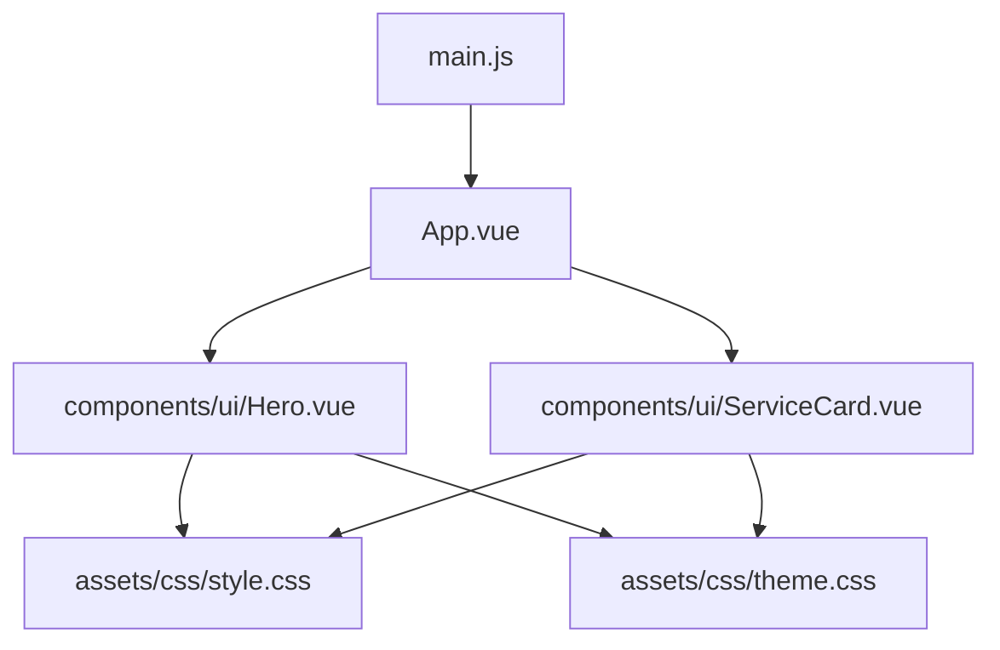
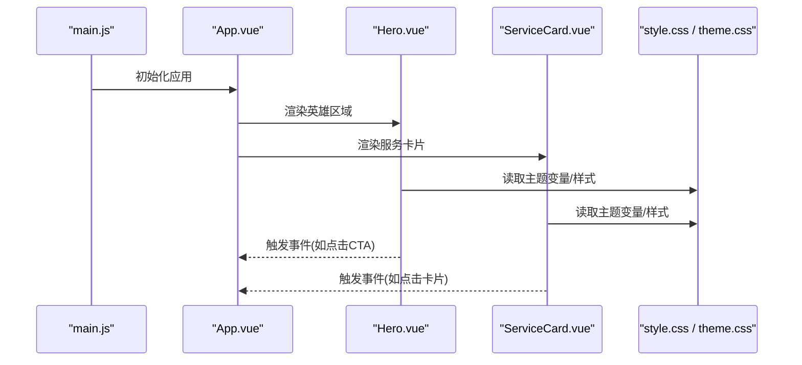
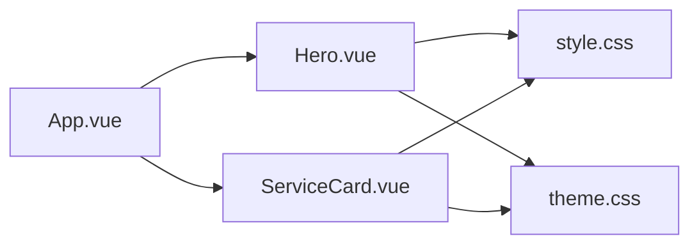

# 通用UI组件

<cite>
**本文引用的文件**   
- [Hero.vue](file://frontend/src/components/ui/Hero.vue)
- [ServiceCard.vue](file://frontend/src/components/ui/ServiceCard.vue)
- [style.css](file://frontend/src/assets/css/style.css)
- [theme.css](file://frontend/src/assets/css/theme.css)
- [App.vue](file://frontend/src/App.vue)
- [main.js](file://frontend/src/main.js)
</cite>

## 目录
1. [简介](#简介)
2. [项目结构](#项目结构)
3. [核心组件](#核心组件)
4. [架构总览](#架构总览)
5. [详细组件分析](#详细组件分析)
6. [依赖关系分析](#依赖关系分析)
7. [性能考量](#性能考量)
8. [故障排查指南](#故障排查指南)
9. [结论](#结论)
10. [附录](#附录)

## 简介
本文件面向Dorm-Sys前端通用UI组件，重点阐述“英雄区域”（Hero）与“服务卡片”（ServiceCard）两个组件的设计理念、实现要点与使用方式。文档覆盖以下方面：
- 组件属性（props）、事件（events）与插槽（slots）说明
- 样式定制选项、主题切换与样式覆盖方法
- 动画效果与交互行为
- 响应式适配与多端兼容性策略
- 使用示例、配置参数与扩展方法

## 项目结构
前端采用Vue 3 + Vite工程化方案，通用UI组件位于components/ui目录，样式集中在assets/css目录，应用入口为main.js与App.vue。

图表来源
- [main.js:1-20](file://frontend/src/main.js#L1-L20)
- [App.vue:1-40](file://frontend/src/App.vue#L1-L40)
- [Hero.vue:1-60](file://frontend/src/components/ui/Hero.vue#L1-L60)
- [ServiceCard.vue:1-60](file://frontend/src/components/ui/ServiceCard.vue#L1-L60)
- [style.css:1-40](file://frontend/src/assets/css/style.css#L1-L40)
- [theme.css:1-40](file://frontend/src/assets/css/theme.css#L1-L40)

章节来源
- [main.js:1-20](file://frontend/src/main.js#L1-L20)
- [App.vue:1-40](file://frontend/src/App.vue#L1-L40)

## 核心组件
- Hero（英雄区域）：用于页面首屏的视觉焦点区，承载标题、副标题、背景图/渐变、CTA按钮等，支持主题色、尺寸与动效配置。
- ServiceCard（服务卡片）：用于展示服务项或功能入口，包含图标、标题、描述、操作按钮等，支持点击反馈、悬停动效与主题适配。

章节来源
- [Hero.vue:1-60](file://frontend/src/components/ui/Hero.vue#L1-L60)
- [ServiceCard.vue:1-60](file://frontend/src/components/ui/ServiceCard.vue#L1-L60)

## 架构总览
组件通过App.vue在页面中引入并组合使用；样式由全局样式与主题变量驱动，确保跨页面一致性与可定制性。

图表来源
- [main.js:1-20](file://frontend/src/main.js#L1-L20)
- [App.vue:1-40](file://frontend/src/App.vue#L1-L40)
- [Hero.vue:1-60](file://frontend/src/components/ui/Hero.vue#L1-L60)
- [ServiceCard.vue:1-60](file://frontend/src/components/ui/ServiceCard.vue#L1-L60)
- [style.css:1-40](file://frontend/src/assets/css/style.css#L1-L40)
- [theme.css:1-40](file://frontend/src/assets/css/theme.css#L1-L40)

## 详细组件分析

### Hero（英雄区域）组件
设计理念
- 作为页面首屏的核心信息载体，强调视觉层次与品牌表达
- 提供灵活的布局与内容插槽，便于在不同业务场景复用
- 通过主题变量与样式类实现快速换肤与风格统一

属性（props）
- title：主标题文本
- subtitle：副标题文本
- background：背景类型（图片/渐变），支持URL或预设主题名
- ctaText：主行动按钮文案
- ctaLink：主行动按钮跳转链接
- variant：布局变体（如居中、左对齐）
- size：尺寸档位（默认、大、超大）
- animated：是否启用入场动画
- overlayOpacity：遮罩透明度
- align：内容对齐方式（左/中/右）

事件（events）
- clickCta：点击主行动按钮时触发，携带事件对象
- enterView：进入可视区域时触发（可用于埋点或懒加载）

插槽（slots）
- default：默认插槽，用于插入自定义内容（如统计数字、标签）
- actions：操作区插槽，用于放置额外按钮或表单控件
- background：背景插槽，用于自定义背景元素（如SVG装饰）

样式定制与主题
- 通过CSS变量控制主色、背景、文字颜色、圆角、阴影等
- 支持覆盖类名以调整间距、字号、行高、过渡时长
- 支持暗色/亮色主题切换，变量集中管理

动画与交互
- 入场动画：标题渐显、副标题延迟、CTA缩放
- 悬停效果：按钮阴影增强、背景微动
- 滚动监听：进入视口时触发动画

响应式与多端兼容
- 基于断点的栅格系统，自动调整字号与内边距
- 移动端优化触控区域与可读性
- 低性能设备降级动画

使用示例
- 基础用法：传入title、subtitle、ctaText即可快速展示
- 自定义背景：background设置为图片URL或主题名
- 扩展内容：使用default/actions插槽添加额外元素

扩展方法
- 注册自定义主题：在主题文件中新增变量映射
- 封装业务Hero：继承Hero并通过插槽注入业务逻辑

章节来源
- [Hero.vue:1-120](file://frontend/src/components/ui/Hero.vue#L1-L120)
- [style.css:1-80](file://frontend/src/assets/css/style.css#L1-L80)
- [theme.css:1-80](file://frontend/src/assets/css/theme.css#L1-L80)

### ServiceCard（服务卡片）组件
设计理念
- 以卡片形式聚合服务信息，强调清晰的信息层级与一致的交互体验
- 支持多种状态（默认、禁用、加载中）与主题适配
- 通过插槽与属性组合满足多样化展示需求

属性（props）
- icon：图标名称或路径
- title：卡片标题
- description：描述文本
- link：跳转链接
- disabled：是否禁用
- loading：是否显示加载态
- color：主题色（覆盖默认）
- shape：形状（圆角/方形）
- hoverEffect：悬停效果（上浮/缩放/发光）
- actionType：操作类型（按钮/链接/无）

事件（events）
- click：点击卡片时触发，携带事件对象
- hoverIn/hoverOut：悬停进出事件
- loadComplete：加载完成回调

插槽（slots）
- default：默认插槽，用于插入自定义内容
- footer：底部插槽，用于附加操作或说明
- iconSlot：图标插槽，用于替换默认图标

样式定制与主题
- 通过CSS变量控制边框、阴影、背景、文字颜色
- 支持覆盖类名调整布局与间距
- 主题切换时自动适配颜色与对比度

动画与交互
- 入场动画：淡入+上移
- 悬停效果：根据hoverEffect配置变化
- 加载态：骨架屏或旋转指示器

响应式与多端兼容
- 网格布局自适应列数
- 小屏幕下图标与文字排版优化
- 触摸友好：增大点击热区

使用示例
- 基础用法：传入icon、title、description即可
- 带操作：设置actionType为按钮并绑定click
- 自定义内容：使用footer插槽添加辅助信息

扩展方法
- 扩展状态：增加error/empty等状态展示
- 主题扩展：新增主题变量并映射到组件样式

章节来源
- [ServiceCard.vue:1-120](file://frontend/src/components/ui/ServiceCard.vue#L1-L120)
- [style.css:1-80](file://frontend/src/assets/css/style.css#L1-L80)
- [theme.css:1-80](file://frontend/src/assets/css/theme.css#L1-L80)

## 依赖关系分析
组件依赖关系如下：
- App.vue引入Hero与ServiceCard进行页面组装
- 组件样式依赖全局样式与主题变量
- main.js负责应用初始化与插件挂载

图表来源
- [App.vue:1-40](file://frontend/src/App.vue#L1-L40)
- [Hero.vue:1-60](file://frontend/src/components/ui/Hero.vue#L1-L60)
- [ServiceCard.vue:1-60](file://frontend/src/components/ui/ServiceCard.vue#L1-L60)
- [style.css:1-40](file://frontend/src/assets/css/style.css#L1-L40)
- [theme.css:1-40](file://frontend/src/assets/css/theme.css#L1-L40)

章节来源
- [App.vue:1-40](file://frontend/src/App.vue#L1-L40)
- [main.js:1-20](file://frontend/src/main.js#L1-L20)

## 性能考量
- 懒加载：Hero背景图与ServiceCard图标按需加载
- 动画优化：使用transform与opacity提升合成性能
- 样式隔离：避免全局样式污染，提高渲染效率
- 事件节流：高频交互事件添加防抖/节流

## 故障排查指南
常见问题与解决思路：
- 主题未生效：检查主题变量是否正确导入与覆盖优先级
- 插槽内容不显示：确认插槽名称与父组件传递一致
- 动画卡顿：减少复杂动画，使用硬件加速属性
- 响应式异常：检查断点配置与媒体查询冲突

## 结论
Hero与ServiceCard组件通过统一的属性、事件与插槽设计，提供了高度可复用的UI能力。结合主题系统与响应式策略，能够满足多端一致的视觉与交互体验。建议在实际项目中遵循本文档的配置与扩展指南，确保组件的一致性与可维护性。

## 附录
- 主题变量清单：查看theme.css中的变量定义
- 样式覆盖指南：通过类名前缀覆盖默认样式
- 扩展模板：参考现有组件结构创建新组件