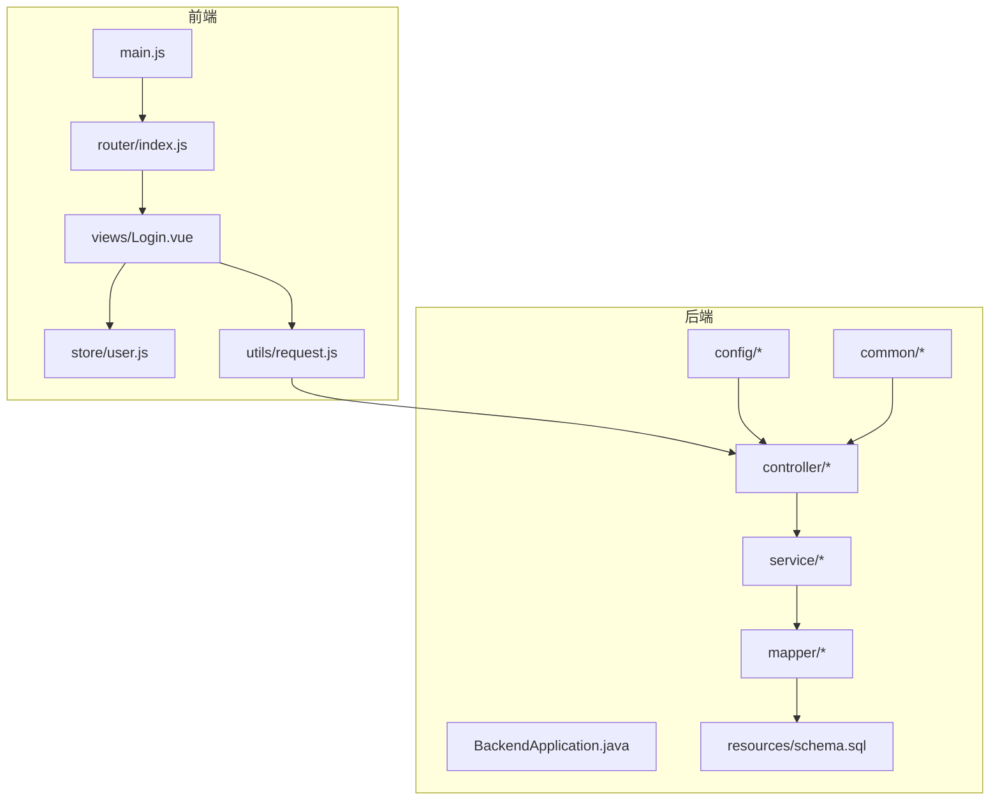
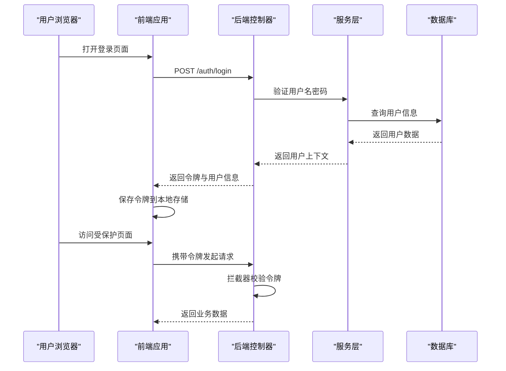
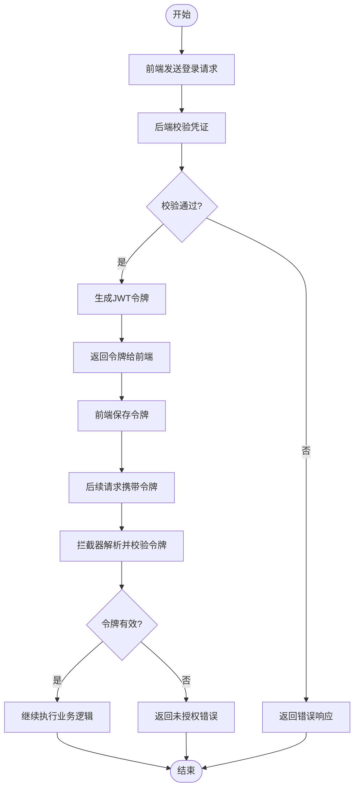
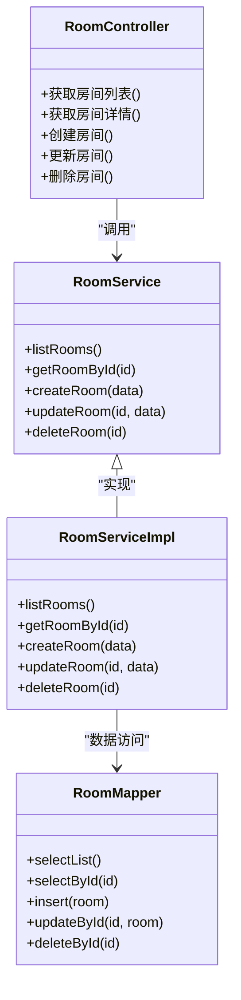
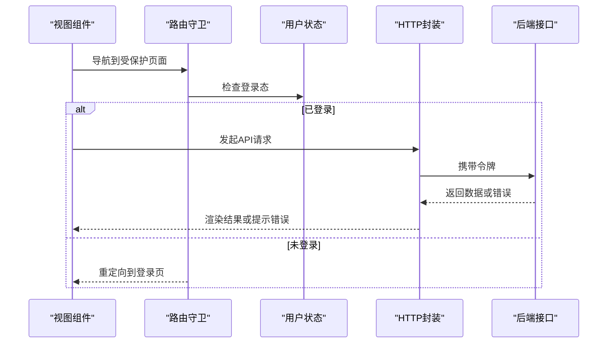
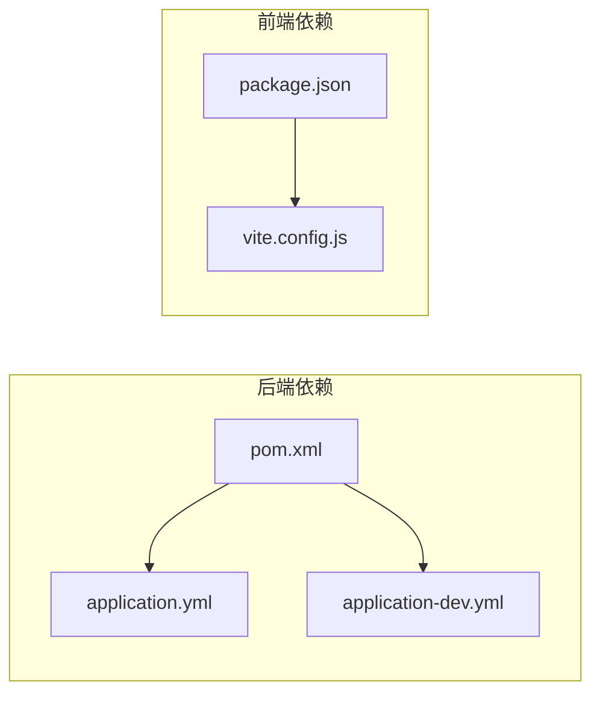

# 开发指南

<cite>
**本文引用的文件**   
- [pom.xml](file://backend/pom.xml)
- [application.yml](file://backend/src/main/resources/application.yml)
- [application-dev.yml](file://backend/src/main/resources/application-dev.yml)
- [BackendApplication.java](file://backend/src/main/java/com/dorm/backend/BackendApplication.java)
- [GlobalExceptionHandler.java](file://backend/src/main/java/com/dorm/backend/common/GlobalExceptionHandler.java)
- [JwtUtils.java](file://backend/src/main/java/com/dorm/backend/common/JwtUtils.java)
- [AuthUtils.java](file://backend/src/main/java/com/dorm/backend/common/AuthUtils.java)
- [Result.java](file://backend/src/main/java/com/dorm/backend/common/Result.java)
- [CorsConfig.java](file://backend/src/main/java/com/dorm/backend/config/CorsConfig.java)
- [JwtAuthInterceptor.java](file://backend/src/main/java/com/dorm/backend/config/JwtAuthInterceptor.java)
- [OperationAuditInterceptor.java](file://backend/src/main/java/com/dorm/backend/config/OperationAuditInterceptor.java)
- [WebMvcConfig.java](file://backend/src/main/java/com/dorm/backend/config/WebMvcConfig.java)
- [AuthController.java](file://backend/src/main/java/com/dorm/backend/controller/AuthController.java)
- [RoomController.java](file://backend/src/main/java/com/dorm/backend/controller/RoomController.java)
- [UserService.java](file://backend/src/main/java/com/dorm/backend/service/UserService.java)
- [UserServiceImpl.java](file://backend/src/main/java/com/dorm/backend/service/impl/UserServiceImpl.java)
- [UserMapper.java](file://backend/src/main/java/com/dorm/backend/mapper/UserMapper.java)
- [schema.sql](file://backend/src/main/resources/schema.sql)
- [package.json](file://frontend/package.json)
- [vite.config.js](file://frontend/vite.config.js)
- [main.js](file://frontend/src/main.js)
- [request.js](file://frontend/src/utils/request.js)
- [router/index.js](file://frontend/src/router/index.js)
- [store/user.js](file://frontend/src/store/user.js)
- [Login.vue](file://frontend/src/views/Login.vue)
- [tests/e2e/roles.spec.js](file://frontend/tests/e2e/roles.spec.js)
- [design-qa.md](file://design-qa.md)
</cite>

## 目录
1. [简介](#简介)
2. [项目结构](#项目结构)
3. [核心组件](#核心组件)
4. [架构总览](#架构总览)
5. [详细组件分析](#详细组件分析)
6. [依赖分析](#依赖分析)
7. [性能考虑](#性能考虑)
8. [故障排除指南](#故障排除指南)
9. [结论](#结论)
10. [附录](#附录)

## 简介
本指南面向Dorm-Sys项目的开发与维护人员，覆盖从环境搭建、代码规范、Git工作流到前后端工具配置、代码审查与发布流程的完整实践。文档同时提供新功能开发的端到端流程、常见问题排查、性能优化与安全加固建议，以及团队协作最佳实践与知识分享机制，帮助团队高效协作并保障系统质量。

## 项目结构
Dorm-Sys采用前后端分离架构：
- 后端：基于Spring Boot（Java），使用Maven构建，模块化分层清晰（controller、service、mapper、entity、config、common等）。
- 前端：基于Vue 3 + Vite，模块化组织（api、views、components、store、utils、router等），并提供E2E测试用例。

**图表来源** 
- [main.js](file://frontend/src/main.js)
- [router/index.js](file://frontend/src/router/index.js)
- [store/user.js](file://frontend/src/store/user.js)
- [request.js](file://frontend/src/utils/request.js)
- [Login.vue](file://frontend/src/views/Login.vue)
- [BackendApplication.java](file://backend/src/main/java/com/dorm/backend/BackendApplication.java)
- [WebMvcConfig.java](file://backend/src/main/java/com/dorm/backend/config/WebMvcConfig.java)
- [CorsConfig.java](file://backend/src/main/java/com/dorm/backend/config/CorsConfig.java)
- [JwtAuthInterceptor.java](file://backend/src/main/java/com/dorm/backend/config/JwtAuthInterceptor.java)
- [OperationAuditInterceptor.java](file://backend/src/main/java/com/dorm/backend/config/OperationAuditInterceptor.java)
- [AuthController.java](file://backend/src/main/java/com/dorm/backend/controller/AuthController.java)
- [UserService.java](file://backend/src/main/java/com/dorm/backend/service/UserService.java)
- [UserServiceImpl.java](file://backend/src/main/java/com/dorm/backend/service/impl/UserServiceImpl.java)
- [UserMapper.java](file://backend/src/main/java/com/dorm/backend/mapper/UserMapper.java)
- [schema.sql](file://backend/src/main/resources/schema.sql)

**章节来源**
- [package.json](file://frontend/package.json)
- [vite.config.js](file://frontend/vite.config.js)
- [pom.xml](file://backend/pom.xml)
- [application.yml](file://backend/src/main/resources/application.yml)
- [application-dev.yml](file://backend/src/main/resources/application-dev.yml)

## 核心组件
- 后端启动与配置
  - 应用入口类负责初始化Spring容器与扫描包。
  - Web层通过拦截器实现鉴权与审计，统一跨域与静态资源映射。
- 通用能力
  - 统一响应体封装、全局异常处理、JWT工具方法、认证辅助方法。
- 业务分层
  - Controller接收请求并调用Service；Service编排业务逻辑；Mapper对接数据库。
- 前端工程
  - Vite构建、路由管理、状态管理、HTTP封装、视图组件与API模块。

**章节来源**
- [BackendApplication.java](file://backend/src/main/java/com/dorm/backend/BackendApplication.java)
- [WebMvcConfig.java](file://backend/src/main/java/com/dorm/backend/config/WebMvcConfig.java)
- [CorsConfig.java](file://backend/src/main/java/com/dorm/backend/config/CorsConfig.java)
- [JwtAuthInterceptor.java](file://backend/src/main/java/com/dorm/backend/config/JwtAuthInterceptor.java)
- [OperationAuditInterceptor.java](file://backend/src/main/java/com/dorm/backend/config/OperationAuditInterceptor.java)
- [GlobalExceptionHandler.java](file://backend/src/main/java/com/dorm/backend/common/GlobalExceptionHandler.java)
- [Result.java](file://backend/src/main/java/com/dorm/backend/common/Result.java)
- [JwtUtils.java](file://backend/src/main/java/com/dorm/backend/common/JwtUtils.java)
- [AuthUtils.java](file://backend/src/main/java/com/dorm/backend/common/AuthUtils.java)
- [main.js](file://frontend/src/main.js)
- [router/index.js](file://frontend/src/router/index.js)
- [store/user.js](file://frontend/src/store/user.js)
- [request.js](file://frontend/src/utils/request.js)

## 架构总览
系统采用典型的前后端分离架构：前端通过HTTP API与后端交互，后端以RESTful风格暴露接口，数据持久化由关系型数据库完成。鉴权通过JWT在拦截器中校验，审计日志通过拦截器记录操作轨迹。

**图表来源** 
- [AuthController.java](file://backend/src/main/java/com/dorm/backend/controller/AuthController.java)
- [JwtAuthInterceptor.java](file://backend/src/main/java/com/dorm/backend/config/JwtAuthInterceptor.java)
- [UserService.java](file://backend/src/main/java/com/dorm/backend/service/UserService.java)
- [UserServiceImpl.java](file://backend/src/main/java/com/dorm/backend/service/impl/UserServiceImpl.java)
- [UserMapper.java](file://backend/src/main/java/com/dorm/backend/mapper/UserMapper.java)
- [schema.sql](file://backend/src/main/resources/schema.sql)
- [request.js](file://frontend/src/utils/request.js)
- [store/user.js](file://frontend/src/store/user.js)

## 详细组件分析

### 认证与授权流程
- 登录流程
  - 前端提交账号密码至后端登录接口。
  - 后端校验凭证并生成JWT令牌返回前端。
  - 前端将令牌存入本地存储并在后续请求头中携带。
- 鉴权流程
  - 后端拦截器解析请求头中的令牌，校验有效性并注入用户上下文。
  - 未通过校验的请求直接返回错误响应。

**图表来源** 
- [AuthController.java](file://backend/src/main/java/com/dorm/backend/controller/AuthController.java)
- [JwtAuthInterceptor.java](file://backend/src/main/java/com/dorm/backend/config/JwtAuthInterceptor.java)
- [JwtUtils.java](file://backend/src/main/java/com/dorm/backend/common/JwtUtils.java)
- [request.js](file://frontend/src/utils/request.js)
- [store/user.js](file://frontend/src/store/user.js)

**章节来源**
- [AuthController.java](file://backend/src/main/java/com/dorm/backend/controller/AuthController.java)
- [JwtAuthInterceptor.java](file://backend/src/main/java/com/dorm/backend/config/JwtAuthInterceptor.java)
- [JwtUtils.java](file://backend/src/main/java/com/dorm/backend/common/JwtUtils.java)
- [AuthUtils.java](file://backend/src/main/java/com/dorm/backend/common/AuthUtils.java)
- [request.js](file://frontend/src/utils/request.js)
- [store/user.js](file://frontend/src/store/user.js)

### 房间管理功能（示例）
- 控制器暴露房间相关接口（如列表、详情、创建、更新、删除）。
- 服务层实现业务规则（权限校验、状态机约束、并发控制）。
- Mapper层执行SQL操作，配合实体映射。

**图表来源** 
- [RoomController.java](file://backend/src/main/java/com/dorm/backend/controller/RoomController.java)
- [UserService.java](file://backend/src/main/java/com/dorm/backend/service/UserService.java)
- [UserServiceImpl.java](file://backend/src/main/java/com/dorm/backend/service/impl/UserServiceImpl.java)
- [UserMapper.java](file://backend/src/main/java/com/dorm/backend/mapper/UserMapper.java)

**章节来源**
- [RoomController.java](file://backend/src/main/java/com/dorm/backend/controller/RoomController.java)
- [UserService.java](file://backend/src/main/java/com/dorm/backend/service/UserService.java)
- [UserServiceImpl.java](file://backend/src/main/java/com/dorm/backend/service/impl/UserServiceImpl.java)
- [UserMapper.java](file://backend/src/main/java/com/dorm/backend/mapper/UserMapper.java)

### 前端请求封装与路由
- HTTP封装
  - 统一请求拦截器添加令牌、错误码处理与重试策略。
- 路由与状态
  - 路由守卫确保登录态；用户状态集中管理。

**图表来源** 
- [router/index.js](file://frontend/src/router/index.js)
- [store/user.js](file://frontend/src/store/user.js)
- [request.js](file://frontend/src/utils/request.js)
- [Login.vue](file://frontend/src/views/Login.vue)

**章节来源**
- [router/index.js](file://frontend/src/router/index.js)
- [store/user.js](file://frontend/src/store/user.js)
- [request.js](file://frontend/src/utils/request.js)
- [Login.vue](file://frontend/src/views/Login.vue)

## 依赖分析
- 后端依赖
  - Spring Boot核心、Web MVC、MyBatis、数据库驱动、JWT库、日志框架等。
- 前端依赖
  - Vue 3、Vite、路由、状态管理、HTTP客户端、测试框架等。

**图表来源** 
- [pom.xml](file://backend/pom.xml)
- [application.yml](file://backend/src/main/resources/application.yml)
- [application-dev.yml](file://backend/src/main/resources/application-dev.yml)
- [package.json](file://frontend/package.json)
- [vite.config.js](file://frontend/vite/config.js)

**章节来源**
- [pom.xml](file://backend/pom.xml)
- [application.yml](file://backend/src/main/resources/application.yml)
- [application-dev.yml](file://backend/src/main/resources/application-dev.yml)
- [package.json](file://frontend/package.json)
- [vite.config.js](file://frontend/vite/config.js)

## 性能考虑
- 后端
  - 合理分页与索引设计，避免N+1查询；缓存热点数据；连接池调优；异步处理耗时任务。
- 前端
  - 路由懒加载与组件按需引入；图片与静态资源压缩；请求去抖与节流；错误边界与降级策略。
- 数据库
  - 慢查询分析与优化；事务边界最小化；读写分离与分库分表评估。

[本节为通用指导，不直接分析具体文件]

## 故障排除指南
- 常见后端问题
  - 全局异常处理器捕获未处理异常并返回统一错误格式；检查拦截器链配置与跨域设置。
- 常见前端问题
  - 网络请求失败时查看拦截器错误处理；确认令牌有效期与刷新策略；路由守卫跳转逻辑。
- 调试技巧
  - 后端启用调试日志与断点；前端开启Source Map与Network面板；E2E用例定位集成问题。

**章节来源**
- [GlobalExceptionHandler.java](file://backend/src/main/java/com/dorm/backend/common/GlobalExceptionHandler.java)
- [CorsConfig.java](file://backend/src/main/java/com/dorm/backend/config/CorsConfig.java)
- [JwtAuthInterceptor.java](file://backend/src/main/java/com/dorm/backend/config/JwtAuthInterceptor.java)
- [request.js](file://frontend/src/utils/request.js)
- [router/index.js](file://frontend/src/router/index.js)
- [tests/e2e/roles.spec.js](file://frontend/tests/e2e/roles.spec.js)

## 结论
本指南系统化梳理了Dorm-Sys的开发环境与流程，涵盖架构、组件、依赖、性能与安全等方面。遵循本文档的实践可提升团队协作效率与交付质量，建议在迭代中持续完善规范与自动化流程。

[本节为总结性内容，不直接分析具体文件]

## 附录

### 开发环境搭建
- 后端
  - 安装JDK与Maven；导入后端工程；配置数据库连接（application.yml与application-dev.yml）；运行主类启动服务。
- 前端
  - 安装Node.js与包管理器；安装依赖；启动开发服务器；配置代理与端口。

**章节来源**
- [application.yml](file://backend/src/main/resources/application.yml)
- [application-dev.yml](file://backend/src/main/resources/application-dev.yml)
- [BackendApplication.java](file://backend/src/main/java/com/dorm/backend/BackendApplication.java)
- [package.json](file://frontend/package.json)
- [vite.config.js](file://frontend/vite/config.js)

### 代码规范与提交规范
- 命名约定
  - 包名小写、类名大驼峰、方法与变量小驼峰；常量全大写加下划线。
- 提交信息
  - 使用约定式提交（feat、fix、docs、refactor等）；描述变更影响范围与动机。
- 分支策略
  - main为稳定分支；develop为集成分支；feature/xxx用于功能开发；hotfix/xxx用于紧急修复。

[本节为通用指导，不直接分析具体文件]

### Git工作流与分支管理
- 工作流
  - 从develop拉取feature分支；完成后合并回develop；经测试后合并到main并发布。
- 分支保护
  - 启用分支保护规则；强制代码审查与CI通过；禁止直接推送至main。

[本节为通用指导，不直接分析具体文件]

### 前后端开发工具推荐
- IDE与插件
  - 后端：IntelliJ IDEA（Lombok、MyBatis插件、Spring Assistant）；前端：VS Code（Vue Language Features、ESLint、Prettier）。
- 调试技巧
  - 后端：断点调试与日志级别调整；前端：浏览器开发者工具与Source Map。

[本节为通用指导，不直接分析具体文件]

### 代码审查与质量保证
- 审查要点
  - 可读性与一致性；安全性与健壮性；性能与可扩展性；测试覆盖率。
- 质量标准
  - 静态检查与格式化；单元测试与集成测试；E2E关键路径覆盖。

[本节为通用指导，不直接分析具体文件]

### 发布流程
- 构建与打包
  - 后端Maven打包；前端Vite构建静态资源。
- 部署与验证
  - 环境隔离（dev/test/prod）；健康检查与灰度发布；回滚预案。

[本节为通用指导，不直接分析具体文件]

### 新功能开发全流程
- 需求分析
  - 明确用户故事与验收标准；识别风险与依赖。
- 设计与评审
  - 接口定义与数据模型；架构图与序列图；安全与性能考量。
- 开发与联调
  - 分支开发；单元测试；前后端联调与E2E验证。
- 上线与监控
  - 发布清单与回滚计划；监控告警与日志追踪。

[本节为通用指导，不直接分析具体文件]

### 团队协作与知识分享
- 协作机制
  - 定期站会与迭代回顾；共享文档与知识库；代码审查文化。
- 知识分享
  - 技术分享会与技术博客；案例复盘与最佳实践沉淀。

[本节为通用指导，不直接分析具体文件]

### 常见问题与解决方案
- 跨域问题
  - 检查后端CORS配置与前端请求域名；必要时启用代理。
- 令牌失效
  - 刷新令牌策略；前端自动重试与错误提示。
- 数据库连接失败
  - 核对连接参数与权限；检查防火墙与网络连通性。

**章节来源**
- [CorsConfig.java](file://backend/src/main/java/com/dorm/backend/config/CorsConfig.java)
- [JwtAuthInterceptor.java](file://backend/src/main/java/com/dorm/backend/config/JwtAuthInterceptor.java)
- [application.yml](file://backend/src/main/resources/application.yml)
- [application-dev.yml](file://backend/src/main/resources/application-dev.yml)
- [request.js](file://frontend/src/utils/request.js)

### 性能优化与安全加固
- 性能优化
  - 后端：缓存、连接池、异步化；前端：懒加载、资源压缩、请求优化。
- 安全加固
  - 输入校验与输出编码；敏感信息脱敏；HTTPS与密钥管理；权限最小化。

[本节为通用指导，不直接分析具体文件]

### 可扩展性设计
- 模块化与解耦
  - 按领域划分模块；接口抽象与依赖注入；事件驱动与消息队列。
- 水平扩展
  - 无状态服务设计；会话外置；数据库读写分离与分片。

[本节为通用指导，不直接分析具体文件]

### 参考与设计说明
- 设计问答与需求澄清
  - 参考设计文档中的问答与决策依据，确保实现与需求一致。

**章节来源**
- [design-qa.md](file://design-qa.md)