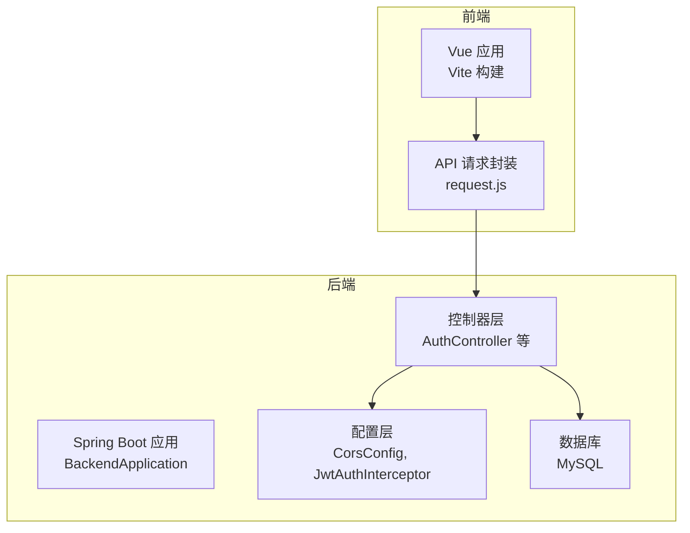
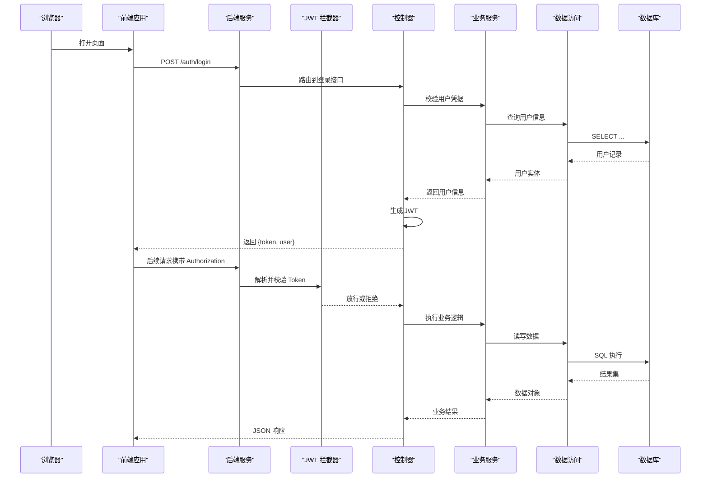
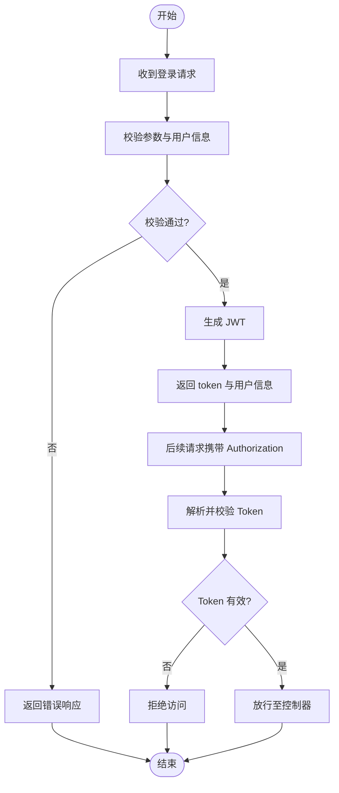
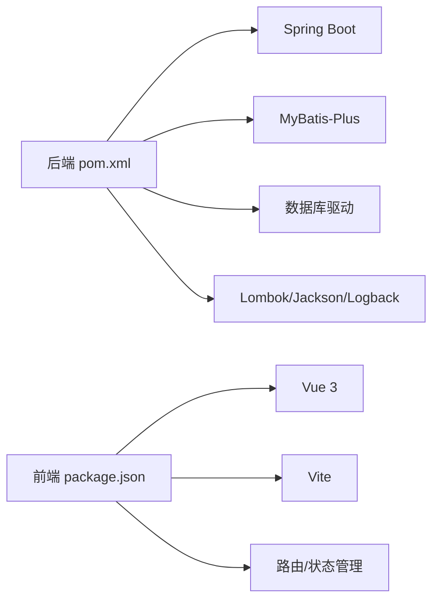

# 快速开始

<cite>
**本文引用的文件**   
- [pom.xml](file://backend/pom.xml)
- [application.yml](file://backend/src/main/resources/application.yml)
- [application-dev.yml](file://backend/src/main/resources/application-dev.yml)
- [schema.sql](file://backend/src/main/resources/schema.sql)
- [seed_buildings.sql](file://seed_buildings.sql)
- [seed_reasonable.sql](file://seed_reasonable.sql)
- [package.json](file://frontend/package.json)
- [vite.config.js](file://frontend/vite.config.js)
- [BackendApplication.java](file://backend/src/main/java/com/dorm/backend/BackendApplication.java)
- [AuthController.java](file://backend/src/main/java/com/dorm/backend/controller/AuthController.java)
- [JwtUtils.java](file://backend/src/main/java/com/dorm/backend/common/JwtUtils.java)
- [JwtAuthInterceptor.java](file://backend/src/main/java/com/dorm/backend/config/JwtAuthInterceptor.java)
- [CorsConfig.java](file://backend/src/main/java/com/dorm/backend/config/CorsConfig.java)
- [request.js](file://frontend/src/utils/request.js)
</cite>

## 目录
1. [简介](#简介)
2. [项目结构](#项目结构)
3. [核心组件](#核心组件)
4. [架构总览](#架构总览)
5. [详细组件分析](#详细组件分析)
6. [依赖分析](#依赖分析)
7. [性能注意事项](#性能注意事项)
8. [故障排除指南](#故障排除指南)
9. [结论](#结论)
10. [附录](#附录)

## 简介
本快速开始指南面向初学者与开发者，帮助你在本地环境快速搭建并运行 Dorm-Sys 宿舍管理系统。内容涵盖：
- 环境与依赖准备（Java、Node.js、数据库等）
- 后端与前端克隆、安装与初始化步骤
- 数据库初始化与服务启动
- 开发环境配置（数据库连接、JWT 密钥等）
- 基本验证步骤与常见问题排查

## 项目结构
Dorm-Sys 采用前后端分离架构：
- 后端：Spring Boot + MyBatis-Plus，提供 REST API、鉴权拦截器、跨域配置等
- 前端：Vue 3 + Vite，提供管理员、宿管、学生三类角色界面
- 资源：SQL 脚本用于建库与种子数据

**图表来源**
- [BackendApplication.java](file://backend/src/main/java/com/dorm/backend/BackendApplication.java)
- [AuthController.java](file://backend/src/main/java/com/dorm/backend/controller/AuthController.java)
- [CorsConfig.java](file://backend/src/main/java/com/dorm/backend/config/CorsConfig.java)
- [JwtAuthInterceptor.java](file://backend/src/main/java/com/dorm/backend/config/JwtAuthInterceptor.java)
- [request.js](file://frontend/src/utils/request.js)

**章节来源**
- [pom.xml](file://backend/pom.xml)
- [package.json](file://frontend/package.json)
- [vite.config.js](file://frontend/vite.config.js)

## 核心组件
- 后端入口与配置
  - Spring Boot 主类负责应用启动与自动装配
  - 全局跨域与 JWT 拦截器统一处理安全与跨域
- 认证与安全
  - 登录接口生成与校验 JWT
  - 拦截器在请求进入控制器前完成令牌解析与权限校验
- 前端请求封装
  - 统一的 HTTP 请求封装，设置基础地址、请求头、错误处理等

**章节来源**
- [BackendApplication.java](file://backend/src/main/java/com/dorm/backend/BackendApplication.java)
- [AuthController.java](file://backend/src/main/java/com/dorm/backend/controller/AuthController.java)
- [JwtUtils.java](file://backend/src/main/java/com/dorm/backend/common/JwtUtils.java)
- [JwtAuthInterceptor.java](file://backend/src/main/java/com/dorm/backend/config/JwtAuthInterceptor.java)
- [CorsConfig.java](file://backend/src/main/java/com/dorm/backend/config/CorsConfig.java)
- [request.js](file://frontend/src/utils/request.js)

## 架构总览
下图展示了从浏览器到后端的典型请求流程，包括跨域、鉴权与数据库访问。

**图表来源**
- [AuthController.java](file://backend/src/main/java/com/dorm/backend/controller/AuthController.java)
- [JwtAuthInterceptor.java](file://backend/src/main/java/com/dorm/backend/config/JwtAuthInterceptor.java)
- [JwtUtils.java](file://backend/src/main/java/com/dorm/backend/common/JwtUtils.java)

## 详细组件分析

### 后端启动与配置
- 启动方式
  - 使用 Maven Wrapper 或系统 Maven 运行后端主类
- 关键配置文件
  - application.yml：通用配置（如端口、日志、MyBatis 映射路径等）
  - application-dev.yml：开发环境配置（数据库连接、JWT 密钥等）
- 重要模块
  - 跨域配置：允许前端开发服务器访问
  - JWT 拦截器：统一鉴权，解析请求头中的令牌

**章节来源**
- [application.yml](file://backend/src/main/resources/application.yml)
- [application-dev.yml](file://backend/src/main/resources/application-dev.yml)
- [CorsConfig.java](file://backend/src/main/java/com/dorm/backend/config/CorsConfig.java)
- [JwtAuthInterceptor.java](file://backend/src/main/java/com/dorm/backend/config/JwtAuthInterceptor.java)

### 认证与授权流程
- 登录流程
  - 前端调用登录接口提交用户名与密码
  - 后端校验成功后签发 JWT 并返回给前端
- 鉴权流程
  - 前端在后续请求中携带 Authorization 头
  - 拦截器解析并校验 Token，通过后放行至控制器

**图表来源**
- [AuthController.java](file://backend/src/main/java/com/dorm/backend/controller/AuthController.java)
- [JwtUtils.java](file://backend/src/main/java/com/dorm/backend/common/JwtUtils.java)
- [JwtAuthInterceptor.java](file://backend/src/main/java/com/dorm/backend/config/JwtAuthInterceptor.java)

**章节来源**
- [AuthController.java](file://backend/src/main/java/com/dorm/backend/controller/AuthController.java)
- [JwtUtils.java](file://backend/src/main/java/com/dorm/backend/common/JwtUtils.java)
- [JwtAuthInterceptor.java](file://backend/src/main/java/com/dorm/backend/config/JwtAuthInterceptor.java)

### 前端请求封装
- 基础地址与超时
  - 统一设置后端基础 URL、请求超时时间
- 请求头与鉴权
  - 自动附加 Authorization 头，便于后端拦截器识别
- 错误处理
  - 统一捕获网络与业务错误，提示用户或跳转登录

**章节来源**
- [request.js](file://frontend/src/utils/request.js)

## 依赖分析
- 后端依赖
  - Java 运行时与编译工具链
  - Spring Boot 框架与 Web 模块
  - MyBatis-Plus 与数据库驱动
  - Lombok、Jackson、Logback 等常用库
- 前端依赖
  - Node.js 与包管理器（npm/yarn/pnpm）
  - Vue 3、Vite、路由与状态管理相关库

**图表来源**
- [pom.xml](file://backend/pom.xml)
- [package.json](file://frontend/package.json)

**章节来源**
- [pom.xml](file://backend/pom.xml)
- [package.json](file://frontend/package.json)

## 性能注意事项
- 数据库连接池
  - 合理配置最大连接数与空闲回收策略，避免连接耗尽
- 缓存与索引
  - 对高频查询字段建立索引；必要时引入缓存减少数据库压力
- 前端请求优化
  - 合并请求、分页加载、防抖节流，降低带宽与渲染开销
- 日志与监控
  - 生产环境开启必要日志与指标采集，定位慢查询与异常

[本节为通用建议，不直接分析具体文件]

## 故障排除指南
- 无法启动后端
  - 检查 Java 版本与 Maven 是否可用
  - 确认数据库服务已启动且连接信息正确
  - 查看控制台报错与日志文件
- 登录失败或鉴权失败
  - 核对 application-dev.yml 中的 JWT 密钥是否与前端期望一致
  - 确认 Authorization 头格式是否正确（通常为 Bearer <token>）
  - 检查拦截器是否放行白名单路径
- 跨域问题
  - 确保 CorsConfig 允许前端域名与端口
  - 开发阶段可使用代理或调整前端基础地址
- 数据库初始化失败
  - 先执行 schema.sql 创建表结构
  - 再根据需要执行 seed_buildings.sql 与 seed_reasonable.sql 插入种子数据
- 前端无法访问后端
  - 检查 vite.config.js 的代理或基础地址配置
  - 确认后端服务监听端口与前端请求地址一致

**章节来源**
- [application.yml](file://backend/src/main/resources/application.yml)
- [application-dev.yml](file://backend/src/main/resources/application-dev.yml)
- [schema.sql](file://backend/src/main/resources/schema.sql)
- [seed_buildings.sql](file://seed_buildings.sql)
- [seed_reasonable.sql](file://seed_reasonable.sql)
- [vite.config.js](file://frontend/vite.config.js)

## 结论
通过以上步骤，你可以在本地快速搭建并运行 Dorm-Sys 宿舍管理系统。建议初次运行按顺序执行：准备环境 → 初始化数据库 → 启动后端 → 启动前端 → 验证登录与核心功能。遇到问题优先检查配置与日志，逐步定位并解决。

[本节为总结性内容，不直接分析具体文件]

## 附录

### 环境准备清单
- 后端
  - JDK：建议使用 17（与 Spring Boot 兼容）
  - Maven：3.8+（或使用项目内 Maven Wrapper）
  - MySQL：8.0+（或其他兼容数据库）
- 前端
  - Node.js：18+（推荐 LTS）
  - 包管理器：npm/yarn/pnpm 任选其一
- 其他
  - Git：用于克隆代码
  - IDE：IntelliJ IDEA（后端）、VS Code（前端）

### 分步操作指南
- 克隆仓库
  - 将项目克隆到本地工作目录
- 初始化数据库
  - 使用 MySQL 客户端执行 schema.sql
  - 按需执行 seed_buildings.sql 与 seed_reasonable.sql
- 配置后端
  - 编辑 application-dev.yml，填写数据库连接信息与 JWT 密钥
  - 如需修改端口或日志级别，可在 application.yml 中调整
- 启动后端
  - 使用 Maven Wrapper 或系统 Maven 运行后端主类
  - 观察控制台输出，确认服务启动成功
- 启动前端
  - 进入 frontend 目录，安装依赖
  - 启动开发服务器，打开浏览器访问指定端口
- 基本验证
  - 使用默认账号登录（若种子数据包含），或注册新账号
  - 尝试管理员、宿管、学生角色的核心功能

**章节来源**
- [application.yml](file://backend/src/main/resources/application.yml)
- [application-dev.yml](file://backend/src/main/resources/application-dev.yml)
- [schema.sql](file://backend/src/main/resources/schema.sql)
- [seed_buildings.sql](file://seed_buildings.sql)
- [seed_reasonable.sql](file://seed_reasonable.sql)
- [package.json](file://frontend/package.json)
- [vite.config.js](file://frontend/vite.config.js)