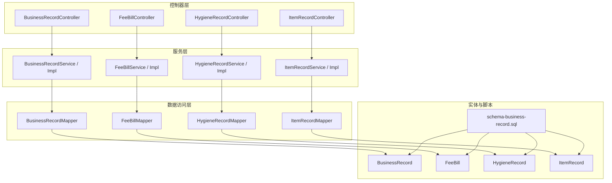
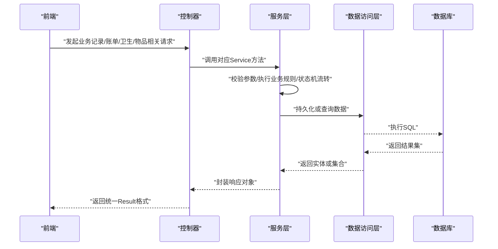
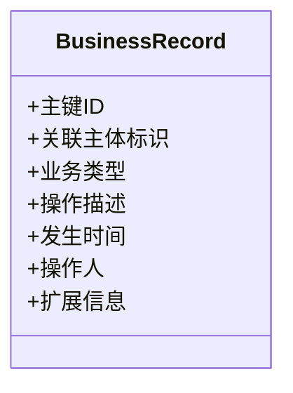
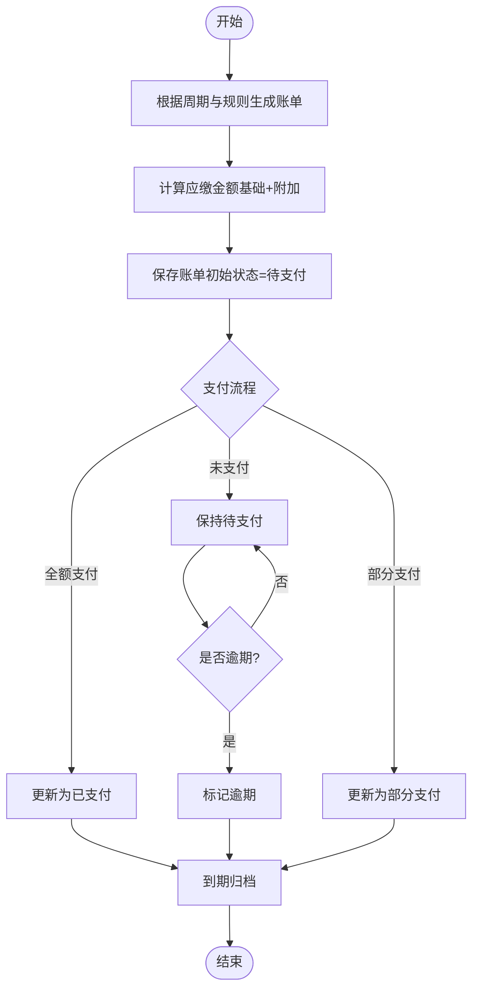
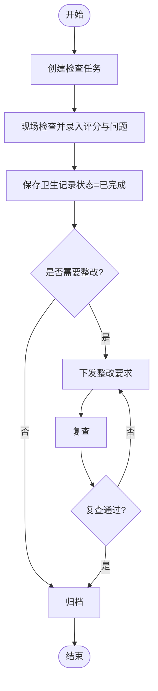
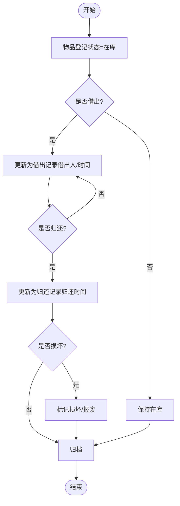
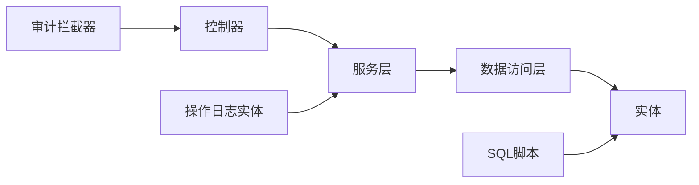

# 业务记录数据模型

<cite>
**本文引用的文件**   
- [BusinessRecord.java](file://backend/src/main/java/com/dorm/backend/entity/BusinessRecord.java)
- [FeeBill.java](file://backend/src/main/java/com/dorm/backend/entity/FeeBill.java)
- [HygieneRecord.java](file://backend/src/main/java/com/dorm/backend/entity/HygieneRecord.java)
- [ItemRecord.java](file://backend/src/main/java/com/dorm/backend/entity/ItemRecord.java)
- [BusinessRecordController.java](file://backend/src/main/java/com/dorm/backend/controller/BusinessRecordController.java)
- [FeeBillController.java](file://backend/src/main/java/com/dorm/backend/controller/FeeBillController.java)
- [HygieneRecordController.java](file://backend/src/main/java/com/dorm/backend/controller/HygieneRecordController.java)
- [ItemRecordController.java](file://backend/src/main/java/com/dorm/backend/controller/ItemRecordController.java)
- [BusinessRecordService.java](file://backend/src/main/java/com/dorm/backend/service/BusinessRecordService.java)
- [BusinessRecordServiceImpl.java](file://backend/src/main/java/com/dorm/backend/service/impl/BusinessRecordServiceImpl.java)
- [FeeBillService.java](file://backend/src/main/java/com/dorm/backend/service/FeeBillService.java)
- [FeeBillServiceImpl.java](file://backend/src/main/java/com/dorm/backend/service/impl/FeeBillServiceImpl.java)
- [HygieneRecordService.java](file://backend/src/main/java/com/dorm/backend/service/HygieneRecordService.java)
- [HygieneRecordServiceImpl.java](file://backend/src/main/java/com/dorm/backend/service/impl/HygieneRecordServiceImpl.java)
- [ItemRecordService.java](file://backend/src/main/java/com/dorm/backend/service/ItemRecordService.java)
- [ItemRecordServiceImpl.java](file://backend/src/main/java/com/dorm/backend/service/impl/ItemRecordServiceImpl.java)
- [BusinessRecordMapper.java](file://backend/src/main/java/com/dorm/backend/mapper/BusinessRecordMapper.java)
- [FeeBillMapper.java](file://backend/src/main/java/com/dorm/backend/mapper/FeeBillMapper.java)
- [HygieneRecordMapper.java](file://backend/src/main/java/com/dorm/backend/mapper/HygieneRecordMapper.java)
- [ItemRecordMapper.java](file://backend/src/main/java/com/dorm/backend/mapper/ItemRecordMapper.java)
- [schema-business-record.sql](file://backend/src/main/resources/schema-business-record.sql)
- [OperationLog.java](file://backend/src/main/java/com/dorm/backend/entity/OperationLog.java)
- [OperationAuditInterceptor.java](file://backend/src/main/java/com/dorm/backend/config/OperationAuditInterceptor.java)
- [AdminReportController.java](file://backend/src/main/java/com/dorm/backend/controller/AdminReportController.java)
</cite>

## 目录
1. [简介](#简介)
2. [项目结构](#项目结构)
3. [核心组件](#核心组件)
4. [架构总览](#架构总览)
5. [详细组件分析](#详细组件分析)
6. [依赖关系分析](#依赖关系分析)
7. [性能考虑](#性能考虑)
8. [故障排查指南](#故障排查指南)
9. [结论](#结论)
10. [附录](#附录)

## 简介
本文件围绕宿舍管理系统中的“业务记录数据模型”展开，重点说明 BusinessRecord（业务记录）、FeeBill（费用账单）、HygieneRecord（卫生记录）、ItemRecord（物品记录）等实体的设计目的、字段含义与使用场景；阐述各类记录的生成规则、状态流转与生命周期管理；解释费用计算逻辑、卫生检查标准与物品登记流程的数据结构设计；并给出查询统计与报表生成的数据支撑方案、历史数据归档策略以及审计追溯的实现思路。文档面向技术与非技术读者，力求以循序渐进的方式呈现系统设计与实现要点。

## 项目结构
后端采用典型的分层架构：Controller 暴露接口，Service 承载业务逻辑，Entity 定义数据模型，Mapper 负责数据访问，SQL 脚本提供数据库初始化与扩展。业务记录相关模块遵循统一的命名与职责划分，便于扩展与维护。

图表来源 
- [BusinessRecordController.java](file://backend/src/main/java/com/dorm/backend/controller/BusinessRecordController.java)
- [BusinessRecordService.java](file://backend/src/main/java/com/dorm/backend/service/BusinessRecordService.java)
- [BusinessRecordServiceImpl.java](file://backend/src/main/java/com/dorm/backend/service/impl/BusinessRecordServiceImpl.java)
- [BusinessRecordMapper.java](file://backend/src/main/java/com/dorm/backend/mapper/BusinessRecordMapper.java)
- [BusinessRecord.java](file://backend/src/main/java/com/dorm/backend/entity/BusinessRecord.java)
- [FeeBillController.java](file://backend/src/main/java/com/dorm/backend/controller/FeeBillController.java)
- [FeeBillService.java](file://backend/src/main/java/com/dorm/backend/service/FeeBillService.java)
- [FeeBillServiceImpl.java](file://backend/src/main/java/com/dorm/backend/service/impl/FeeBillServiceImpl.java)
- [FeeBillMapper.java](file://backend/src/main/java/com/dorm/backend/mapper/FeeBillMapper.java)
- [FeeBill.java](file://backend/src/main/java/com/dorm/backend/entity/FeeBill.java)
- [HygieneRecordController.java](file://backend/src/main/java/com/dorm/backend/controller/HygieneRecordController.java)
- [HygieneRecordService.java](file://backend/src/main/java/com/dorm/backend/service/HygieneRecordService.java)
- [HygieneRecordServiceImpl.java](file://backend/src/main/java/com/dorm/backend/service/impl/HygieneRecordServiceImpl.java)
- [HygieneRecordMapper.java](file://backend/src/main/java/com/dorm/backend/mapper/HygieneRecordMapper.java)
- [HygieneRecord.java](file://backend/src/main/java/com/dorm/backend/entity/HygieneRecord.java)
- [ItemRecordController.java](file://backend/src/main/java/com/dorm/backend/controller/ItemRecordController.java)
- [ItemRecordService.java](file://backend/src/main/java/com/dorm/backend/service/ItemRecordService.java)
- [ItemRecordServiceImpl.java](file://backend/src/main/java/com/dorm/backend/service/impl/ItemRecordServiceImpl.java)
- [ItemRecordMapper.java](file://backend/src/main/java/com/dorm/backend/mapper/ItemRecordMapper.java)
- [ItemRecord.java](file://backend/src/main/java/com/dorm/backend/entity/ItemRecord.java)
- [schema-business-record.sql](file://backend/src/main/resources/schema-business-record.sql)

章节来源
- [BusinessRecordController.java](file://backend/src/main/java/com/dorm/backend/controller/BusinessRecordController.java)
- [FeeBillController.java](file://backend/src/main/java/com/dorm/backend/controller/FeeBillController.java)
- [HygieneRecordController.java](file://backend/src/main/java/com/dorm/backend/controller/HygieneRecordController.java)
- [ItemRecordController.java](file://backend/src/main/java/com/dorm/backend/controller/ItemRecordController.java)

## 核心组件
- BusinessRecord（业务记录）：用于汇聚宿舍管理过程中的关键事件与操作轨迹，作为跨模块的通用记录载体，支持按时间、主体、类型等维度检索与统计。
- FeeBill（费用账单）：记录学生住宿相关的费用明细与结算状态，支持按周期、房间、学生等维度进行对账与报表输出。
- HygieneRecord（卫生记录）：记录卫生检查的结果与评分，支撑卫生评比、整改通知与周期性趋势分析。
- ItemRecord（物品记录）：记录公共或私人物品的登记、借用、归还、损坏与报废等全生命周期信息，保障资产可追踪。

章节来源
- [BusinessRecord.java](file://backend/src/main/java/com/dorm/backend/entity/BusinessRecord.java)
- [FeeBill.java](file://backend/src/main/java/com/dorm/backend/entity/FeeBill.java)
- [HygieneRecord.java](file://backend/src/main/java/com/dorm/backend/entity/HygieneRecord.java)
- [ItemRecord.java](file://backend/src/main/java/com/dorm/backend/entity/ItemRecord.java)

## 架构总览
下图展示了从前端请求到数据落库的整体调用链，以及各层之间的职责边界。

图表来源 
- [BusinessRecordController.java](file://backend/src/main/java/com/dorm/backend/controller/BusinessRecordController.java)
- [BusinessRecordService.java](file://backend/src/main/java/com/dorm/backend/service/BusinessRecordService.java)
- [BusinessRecordServiceImpl.java](file://backend/src/main/java/com/dorm/backend/service/impl/BusinessRecordServiceImpl.java)
- [BusinessRecordMapper.java](file://backend/src/main/java/com/dorm/backend/mapper/BusinessRecordMapper.java)
- [FeeBillController.java](file://backend/src/main/java/com/dorm/backend/controller/FeeBillController.java)
- [FeeBillService.java](file://backend/src/main/java/com/dorm/backend/service/FeeBillService.java)
- [FeeBillServiceImpl.java](file://backend/src/main/java/com/dorm/backend/service/impl/FeeBillServiceImpl.java)
- [FeeBillMapper.java](file://backend/src/main/java/com/dorm/backend/mapper/FeeBillMapper.java)
- [HygieneRecordController.java](file://backend/src/main/java/com/dorm/backend/controller/HygieneRecordController.java)
- [HygieneRecordService.java](file://backend/src/main/java/com/dorm/backend/service/HygieneRecordService.java)
- [HygieneRecordServiceImpl.java](file://backend/src/main/java/com/dorm/backend/service/impl/HygieneRecordServiceImpl.java)
- [HygieneRecordMapper.java](file://backend/src/main/java/com/dorm/backend/mapper/HygieneRecordMapper.java)
- [ItemRecordController.java](file://backend/src/main/java/com/dorm/backend/controller/ItemRecordController.java)
- [ItemRecordService.java](file://backend/src/main/java/com/dorm/backend/service/ItemRecordService.java)
- [ItemRecordServiceImpl.java](file://backend/src/main/java/com/dorm/backend/service/impl/ItemRecordServiceImpl.java)
- [ItemRecordMapper.java](file://backend/src/main/java/com/dorm/backend/mapper/ItemRecordMapper.java)

## 详细组件分析

### BusinessRecord（业务记录）
- 设计目的：为宿舍管理中的关键事件提供统一记录载体，便于跨模块关联、审计与统计分析。
- 关键字段（概念性说明）：记录ID、关联主体（如学生/房间/人员）、业务类型、操作描述、发生时间、操作人、扩展信息等。
- 生成规则：在关键业务节点（如入住、退宿、报修、访客登记、费用变更等）由对应 Service 触发写入。
- 状态流转：通常无复杂状态，但可通过类型与时间轴构建事件序列。
- 生命周期：创建后长期保留，支持按时间范围与类型筛选。

图表来源 
- [BusinessRecord.java](file://backend/src/main/java/com/dorm/backend/entity/BusinessRecord.java)
- [BusinessRecordController.java](file://backend/src/main/java/com/dorm/backend/controller/BusinessRecordController.java)
- [BusinessRecordService.java](file://backend/src/main/java/com/dorm/backend/service/BusinessRecordService.java)
- [BusinessRecordServiceImpl.java](file://backend/src/main/java/com/dorm/backend/service/impl/BusinessRecordServiceImpl.java)
- [BusinessRecordMapper.java](file://backend/src/main/java/com/dorm/backend/mapper/BusinessRecordMapper.java)

章节来源
- [BusinessRecord.java](file://backend/src/main/java/com/dorm/backend/entity/BusinessRecord.java)
- [BusinessRecordController.java](file://backend/src/main/java/com/dorm/backend/controller/BusinessRecordController.java)
- [BusinessRecordService.java](file://backend/src/main/java/com/dorm/backend/service/BusinessRecordService.java)
- [BusinessRecordServiceImpl.java](file://backend/src/main/java/com/dorm/backend/service/impl/BusinessRecordServiceImpl.java)
- [BusinessRecordMapper.java](file://backend/src/main/java/com/dorm/backend/mapper/BusinessRecordMapper.java)

### FeeBill（费用账单）
- 设计目的：集中管理住宿费及相关费用的明细、金额、支付状态与结算周期，支持对账与报表。
- 关键字段（概念性说明）：账单ID、关联学生/房间、费用类型、计费周期、应缴金额、实缴金额、支付状态、创建时间、更新时间、备注等。
- 生成规则：按周期自动生成基础住宿费，结合额外费用（如水电、维修、赔偿等）汇总成账单。
- 状态流转：待支付 → 部分支付 → 已支付 → 逾期/作废（视业务规则）。
- 生命周期：按月/学期生成，支付完成后进入归档阶段，支持历史查询。

图表来源 
- [FeeBill.java](file://backend/src/main/java/com/dorm/backend/entity/FeeBill.java)
- [FeeBillController.java](file://backend/src/main/java/com/dorm/backend/controller/FeeBillController.java)
- [FeeBillService.java](file://backend/src/main/java/com/dorm/backend/service/FeeBillService.java)
- [FeeBillServiceImpl.java](file://backend/src/main/java/com/dorm/backend/service/impl/FeeBillServiceImpl.java)
- [FeeBillMapper.java](file://backend/src/main/java/com/dorm/backend/mapper/FeeBillMapper.java)

章节来源
- [FeeBill.java](file://backend/src/main/java/com/dorm/backend/entity/FeeBill.java)
- [FeeBillController.java](file://backend/src/main/java/com/dorm/backend/controller/FeeBillController.java)
- [FeeBillService.java](file://backend/src/main/java/com/dorm/backend/service/FeeBillService.java)
- [FeeBillServiceImpl.java](file://backend/src/main/java/com/dorm/backend/service/impl/FeeBillServiceImpl.java)
- [FeeBillMapper.java](file://backend/src/main/java/com/dorm/backend/mapper/FeeBillMapper.java)

### HygieneRecord（卫生记录）
- 设计目的：记录每次卫生检查的评分、问题项与整改要求，支撑评比与趋势分析。
- 关键字段（概念性说明）：记录ID、关联房间/区域、检查日期、检查人、评分、问题清单、整改要求、检查结果、备注等。
- 生成规则：定期检查任务触发生成，检查人录入评分与问题项。
- 状态流转：检查中 → 已完成 → 整改中 → 复查通过/不通过。
- 生命周期：按检查周期累积，支持月度/学期汇总与排名。

图表来源 
- [HygieneRecord.java](file://backend/src/main/java/com/dorm/backend/entity/HygieneRecord.java)
- [HygieneRecordController.java](file://backend/src/main/java/com/dorm/backend/controller/HygieneRecordController.java)
- [HygieneRecordService.java](file://backend/src/main/java/com/dorm/backend/service/HygieneRecordService.java)
- [HygieneRecordServiceImpl.java](file://backend/src/main/java/com/dorm/backend/service/impl/HygieneRecordServiceImpl.java)
- [HygieneRecordMapper.java](file://backend/src/main/java/com/dorm/backend/mapper/HygieneRecordMapper.java)

章节来源
- [HygieneRecord.java](file://backend/src/main/java/com/dorm/backend/entity/HygieneRecord.java)
- [HygieneRecordController.java](file://backend/src/main/java/com/dorm/backend/controller/HygieneRecordController.java)
- [HygieneRecordService.java](file://backend/src/main/java/com/dorm/backend/service/HygieneRecordService.java)
- [HygieneRecordServiceImpl.java](file://backend/src/main/java/com/dorm/backend/service/impl/HygieneRecordServiceImpl.java)
- [HygieneRecordMapper.java](file://backend/src/main/java/com/dorm/backend/mapper/HygieneRecordMapper.java)

### ItemRecord（物品记录）
- 设计目的：对宿舍公共或私人物品进行登记、借还、损坏与报废的全流程管理，确保资产可追踪。
- 关键字段（概念性说明）：物品ID、名称、类别、数量、存放位置、责任人/借用人、登记时间、借出时间、归还时间、状态、备注等。
- 生成规则：新物品入库登记生成记录；借出/归还时更新状态与时间戳。
- 状态流转：在库 → 借出 → 归还 → 损坏/报废。
- 生命周期：自登记起长期保留，报废后仍保留历史记录以便审计。

图表来源 
- [ItemRecord.java](file://backend/src/main/java/com/dorm/backend/entity/ItemRecord.java)
- [ItemRecordController.java](file://backend/src/main/java/com/dorm/backend/controller/ItemRecordController.java)
- [ItemRecordService.java](file://backend/src/main/java/com/dorm/backend/service/ItemRecordService.java)
- [ItemRecordServiceImpl.java](file://backend/src/main/java/com/dorm/backend/service/impl/ItemRecordServiceImpl.java)
- [ItemRecordMapper.java](file://backend/src/main/java/com/dorm/backend/mapper/ItemRecordMapper.java)

章节来源
- [ItemRecord.java](file://backend/src/main/java/com/dorm/backend/entity/ItemRecord.java)
- [ItemRecordController.java](file://backend/src/main/java/com/dorm/backend/controller/ItemRecordController.java)
- [ItemRecordService.java](file://backend/src/main/java/com/dorm/backend/service/ItemRecordService.java)
- [ItemRecordServiceImpl.java](file://backend/src/main/java/com/dorm/backend/service/impl/ItemRecordServiceImpl.java)
- [ItemRecordMapper.java](file://backend/src/main/java/com/dorm/backend/mapper/ItemRecordMapper.java)

## 依赖关系分析
- Controller 依赖 Service：对外暴露 REST 接口，接收请求并委托给 Service 处理。
- Service 依赖 Mapper：封装业务规则、状态机与事务控制，调用 Mapper 完成数据存取。
- Entity 与 SQL：实体映射数据库表结构，SQL 脚本提供建表与扩展。
- 审计与日志：OperationLog 与 OperationAuditInterceptor 提供操作审计能力，辅助追溯。

图表来源 
- [BusinessRecordController.java](file://backend/src/main/java/com/dorm/backend/controller/BusinessRecordController.java)
- [BusinessRecordService.java](file://backend/src/main/java/com/dorm/backend/service/BusinessRecordService.java)
- [BusinessRecordServiceImpl.java](file://backend/src/main/java/com/dorm/backend/service/impl/BusinessRecordServiceImpl.java)
- [BusinessRecordMapper.java](file://backend/src/main/java/com/dorm/backend/mapper/BusinessRecordMapper.java)
- [BusinessRecord.java](file://backend/src/main/java/com/dorm/backend/entity/BusinessRecord.java)
- [OperationLog.java](file://backend/src/main/java/com/dorm/backend/entity/OperationLog.java)
- [OperationAuditInterceptor.java](file://backend/src/main/java/com/dorm/backend/config/OperationAuditInterceptor.java)
- [schema-business-record.sql](file://backend/src/main/resources/schema-business-record.sql)

章节来源
- [OperationLog.java](file://backend/src/main/java/com/dorm/backend/entity/OperationLog.java)
- [OperationAuditInterceptor.java](file://backend/src/main/java/com/dorm/backend/config/OperationAuditInterceptor.java)

## 性能考虑
- 索引优化：为高频查询字段（如时间、主体ID、类型、状态）建立索引，提升检索效率。
- 分页与过滤：列表查询默认分页，避免一次性加载大量数据。
- 批量操作：批量插入/更新减少往返开销。
- 读写分离：报表类重读场景可考虑只读副本或缓存。
- 归档策略：历史数据定期归档至冷存储，降低主库压力。

[本节为通用指导，无需具体文件引用]

## 故障排查指南
- 常见错误定位：查看控制器异常处理与服务层抛出的业务异常，确认输入校验与状态机约束。
- 审计追溯：通过 OperationLog 与 OperationAuditInterceptor 记录的操作日志，快速定位变更来源与时间。
- 数据一致性：检查事务边界与幂等性，防止重复提交导致的状态不一致。
- 报表异常：核对聚合条件与分组字段，确保统计口径一致。

章节来源
- [OperationLog.java](file://backend/src/main/java/com/dorm/backend/entity/OperationLog.java)
- [OperationAuditInterceptor.java](file://backend/src/main/java/com/dorm/backend/config/OperationAuditInterceptor.java)

## 结论
BusinessRecord、FeeBill、HygieneRecord、ItemRecord 构成了宿舍管理系统中业务记录的核心数据模型。通过清晰的实体设计、严格的生成规则与状态流转、完善的查询统计与归档策略，以及审计追溯机制，系统能够高效支撑日常运营与管理决策。建议在后续迭代中持续完善指标口径、优化索引与归档策略，并增强报表的可配置性与可视化能力。

[本节为总结性内容，无需具体文件引用]

## 附录
- 查询统计与报表支持：
  - 费用报表：按周期、房间、学生维度汇总应缴/实缴/逾期情况。
  - 卫生报表：按房间/区域统计评分趋势与整改完成率。
  - 物品报表：统计在库/借出/损坏/报废比例与周转率。
  - 业务记录：按类型与时间轴聚合事件，支撑运营看板。
- 历史数据归档：
  - 按月/学期将已完成且过期的账单、卫生记录与物品记录迁移至归档表或冷存储。
  - 保留审计日志与业务快照，确保可回溯。
- 审计与追溯：
  - 通过 OperationAuditInterceptor 自动记录关键操作的请求上下文与结果。
  - 结合 BusinessRecord 的事件流，形成完整的操作轨迹。

章节来源
- [AdminReportController.java](file://backend/src/main/java/com/dorm/backend/controller/AdminReportController.java)
- [OperationLog.java](file://backend/src/main/java/com/dorm/backend/entity/OperationLog.java)
- [OperationAuditInterceptor.java](file://backend/src/main/java/com/dorm/backend/config/OperationAuditInterceptor.java)