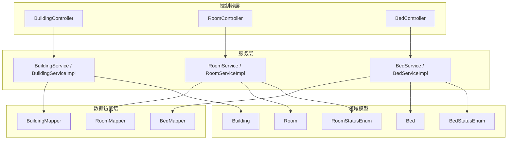
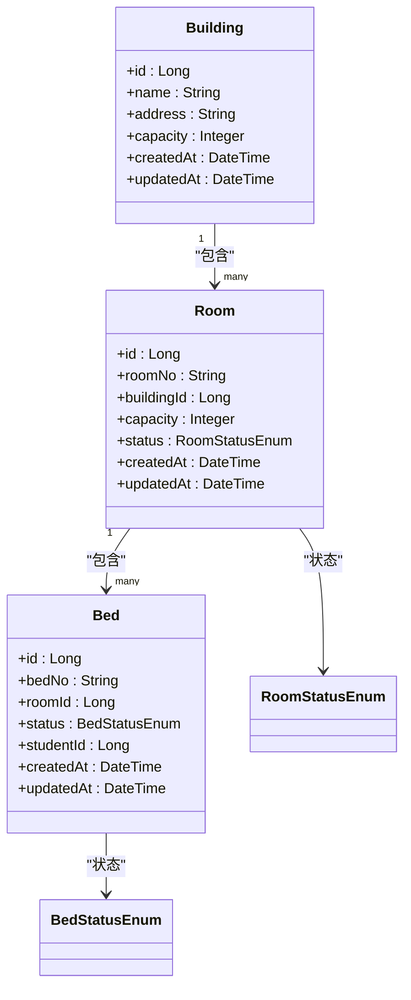
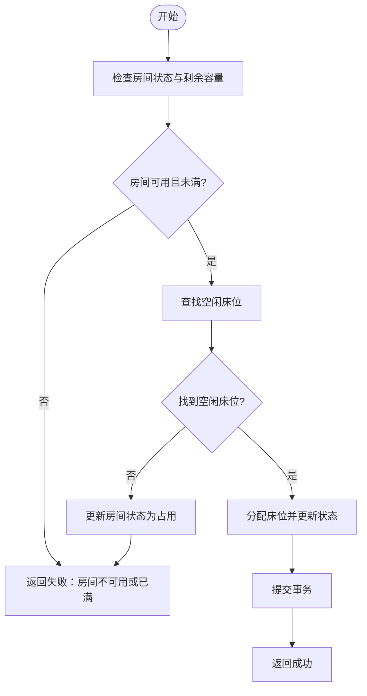
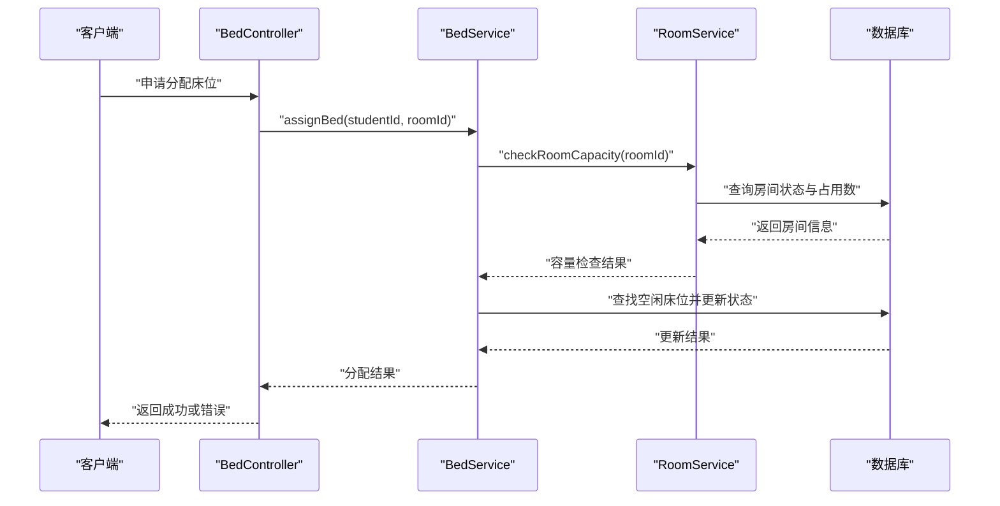
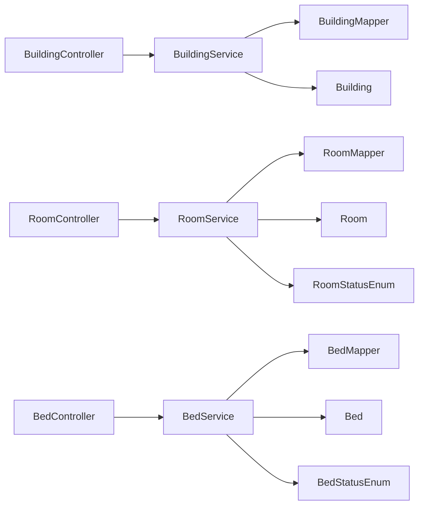

# 宿舍结构数据模型

<cite>
**本文引用的文件**   
- [Building.java](file://backend/src/main/java/com/dorm/backend/entity/Building.java)
- [Room.java](file://backend/src/main/java/com/dorm/backend/entity/Room.java)
- [Bed.java](file://backend/src/main/java/com/dorm/backend/entity/Bed.java)
- [RoomStatusEnum.java](file://backend/src/main/java/com/dorm/backend/enums/RoomStatusEnum.java)
- [BedStatusEnum.java](file://backend/src/main/java/com/dorm/backend/enums/BedStatusEnum.java)
- [BuildingController.java](file://backend/src/main/java/com/dorm/backend/controller/BuildingController.java)
- [RoomController.java](file://backend/src/main/java/com/dorm/backend/controller/RoomController.java)
- [BedController.java](file://backend/src/main/java/com/dorm/backend/controller/BedController.java)
- [BuildingService.java](file://backend/src/main/java/com/dorm/backend/service/BuildingService.java)
- [RoomService.java](file://backend/src/main/java/com/dorm/backend/service/RoomService.java)
- [BedService.java](file://backend/src/main/java/com/dorm/backend/service/BedService.java)
- [BuildingServiceImpl.java](file://backend/src/main/java/com/dorm/backend/service/impl/BuildingServiceImpl.java)
- [RoomServiceImpl.java](file://backend/src/main/java/com/dorm/backend/service/impl/RoomServiceImpl.java)
- [BedServiceImpl.java](file://backend/src/main/java/com/dorm/backend/service/impl/BedServiceImpl.java)
- [BuildingMapper.java](file://backend/src/main/java/com/dorm/backend/mapper/BuildingMapper.java)
- [RoomMapper.java](file://backend/src/main/java/com/dorm/backend/mapper/RoomMapper.java)
- [BedMapper.java](file://backend/src/main/java/com/dorm/backend/mapper/BedMapper.java)
- [schema.sql](file://backend/src/main/resources/schema.sql)
- [RoomBatchCreateRequest.java](file://backend/src/main/java/com/dorm/backend/dto/RoomBatchCreateRequest.java)
</cite>

## 目录
1. [引言](#引言)
2. [项目结构](#项目结构)
3. [核心组件](#核心组件)
4. [架构总览](#架构总览)
5. [详细组件分析](#详细组件分析)
6. [依赖关系分析](#依赖关系分析)
7. [性能考虑](#性能考虑)
8. [故障排查指南](#故障排查指南)
9. [结论](#结论)
10. [附录](#附录)

## 引言
本文件聚焦宿舍管理系统中的核心数据模型：Building（楼栋）、Room（房间）、Bed（床位），系统阐述其设计思路、字段定义与层级映射，并围绕房间状态管理、床位分配策略、容量控制机制展开。同时给出查询优化与批量操作模式建议，以及数据结构变更的迁移策略与兼容性处理方案，并提供资源调度与分配的算法参考。

## 项目结构
后端采用典型的分层架构：Controller 暴露接口，Service 封装业务逻辑，Mapper 负责数据访问，Entity 描述持久化实体，Enum 定义枚举状态，DTO 用于请求/响应数据传输。宿舍相关的数据模型与能力分布在 entity、enums、controller、service、mapper 等包中。

图表来源
- [BuildingController.java](file://backend/src/main/java/com/dorm/backend/controller/BuildingController.java)
- [RoomController.java](file://backend/src/main/java/com/dorm/backend/controller/RoomController.java)
- [BedController.java](file://backend/src/main/java/com/dorm/backend/controller/BedController.java)
- [BuildingService.java](file://backend/src/main/java/com/dorm/backend/service/BuildingService.java)
- [RoomService.java](file://backend/src/main/java/com/dorm/backend/service/RoomService.java)
- [BedService.java](file://backend/src/main/java/com/dorm/backend/service/BedService.java)
- [BuildingServiceImpl.java](file://backend/src/main/java/com/dorm/backend/service/impl/BuildingServiceImpl.java)
- [RoomServiceImpl.java](file://backend/src/main/java/com/dorm/backend/service/impl/RoomServiceImpl.java)
- [BedServiceImpl.java](file://backend/src/main/java/com/dorm/backend/service/impl/BedServiceImpl.java)
- [BuildingMapper.java](file://backend/src/main/java/com/dorm/backend/mapper/BuildingMapper.java)
- [RoomMapper.java](file://backend/src/main/java/com/dorm/backend/mapper/RoomMapper.java)
- [BedMapper.java](file://backend/src/main/java/com/dorm/backend/mapper/BedMapper.java)
- [Building.java](file://backend/src/main/java/com/dorm/backend/entity/Building.java)
- [Room.java](file://backend/src/main/java/com/dorm/backend/entity/Room.java)
- [Bed.java](file://backend/src/main/java/com/dorm/backend/entity/Bed.java)
- [RoomStatusEnum.java](file://backend/src/main/java/com/dorm/backend/enums/RoomStatusEnum.java)
- [BedStatusEnum.java](file://backend/src/main/java/com/dorm/backend/enums/BedStatusEnum.java)

章节来源
- [Building.java](file://backend/src/main/java/com/dorm/backend/entity/Building.java)
- [Room.java](file://backend/src/main/java/com/dorm/backend/entity/Room.java)
- [Bed.java](file://backend/src/main/java/com/dorm/backend/entity/Bed.java)
- [RoomStatusEnum.java](file://backend/src/main/java/com/dorm/backend/enums/RoomStatusEnum.java)
- [BedStatusEnum.java](file://backend/src/main/java/com/dorm/backend/enums/BedStatusEnum.java)
- [schema.sql](file://backend/src/main/resources/schema.sql)

## 核心组件
本节对 Building、Room、Bed 三个核心实体进行结构化说明，包括设计目标、关键属性与约束、以及与状态枚举的关系。

- Building（楼栋）
  - 设计目标：作为宿舍资源的顶层组织单元，承载楼栋基本信息与元数据。
  - 关键属性：标识、名称、位置/地址信息、容量上限（可选）、创建与更新时间戳等。
  - 约束与索引：唯一性约束（如编号或名称）、常用查询字段建立索引（如名称、位置）。
  - 关联关系：一对多关联到 Room。

- Room（房间）
  - 设计目标：表示具体房间，承载房间号、所属楼栋、容量与当前占用情况。
  - 关键属性：标识、房间号、所属楼栋外键、容量、状态（空闲/占用/维护等）、创建与更新时间戳。
  - 约束与索引：房间号在楼栋内唯一；按楼栋与状态查询的复合索引；容量字段参与分配计算。
  - 关联关系：多对一关联到 Building；一对多关联到 Bed。

- Bed（床位）
  - 设计目标：最小可分配单位，记录床位编号、所属房间、状态与占用者信息。
  - 关键属性：标识、床号、所属房间外键、状态（空闲/已分配/使用中/维修等）、占用学生ID（可选）、创建与更新时间戳。
  - 约束与索引：床号在房间内唯一；按房间与状态查询的复合索引；占用者ID建立索引以支持快速定位。
  - 关联关系：多对一关联到 Room。

- 状态枚举
  - RoomStatusEnum：定义房间可用状态，如“空闲”、“占用”、“维护”等，驱动房间级容量与可用性判断。
  - BedStatusEnum：定义床位可用状态，如“空闲”、“已分配”、“使用中”、“维修”等，驱动床位级分配与释放流程。

章节来源
- [Building.java](file://backend/src/main/java/com/dorm/backend/entity/Building.java)
- [Room.java](file://backend/src/main/java/com/dorm/backend/entity/Room.java)
- [Bed.java](file://backend/src/main/java/com/dorm/backend/entity/Bed.java)
- [RoomStatusEnum.java](file://backend/src/main/java/com/dorm/backend/enums/RoomStatusEnum.java)
- [BedStatusEnum.java](file://backend/src/main/java/com/dorm/backend/enums/BedStatusEnum.java)
- [schema.sql](file://backend/src/main/resources/schema.sql)

## 架构总览
宿舍资源采用“楼栋-房间-床位”三层结构，通过外键与状态机协同实现容量控制与分配策略。服务层封装业务规则，控制器提供REST接口，数据访问层由MyBatis Mapper完成SQL映射。

图表来源
- [Building.java](file://backend/src/main/java/com/dorm/backend/entity/Building.java)
- [Room.java](file://backend/src/main/java/com/dorm/backend/entity/Room.java)
- [Bed.java](file://backend/src/main/java/com/dorm/backend/entity/Bed.java)
- [RoomStatusEnum.java](file://backend/src/main/java/com/dorm/backend/enums/RoomStatusEnum.java)
- [BedStatusEnum.java](file://backend/src/main/java/com/dorm/backend/enums/BedStatusEnum.java)

## 详细组件分析

### 实体设计与字段定义
- Building
  - 字段涵盖标识、名称、地址、容量、时间戳等，支撑楼栋维度的统计与展示。
  - 建议在名称与地址字段上建立索引，便于搜索与筛选。
- Room
  - 字段包含房间号、所属楼栋、容量、状态、时间戳等，是容量控制的关键节点。
  - 建议为（buildingId, status）建立复合索引，提升按楼栋与状态的查询效率。
- Bed
  - 字段包含床号、所属房间、状态、占用学生ID、时间戳等，是分配的最小粒度。
  - 建议为（roomId, status）建立复合索引，并为 studentId 建立索引以加速占用查询。

章节来源
- [Building.java](file://backend/src/main/java/com/dorm/backend/entity/Building.java)
- [Room.java](file://backend/src/main/java/com/dorm/backend/entity/Room.java)
- [Bed.java](file://backend/src/main/java/com/dorm/backend/entity/Bed.java)
- [schema.sql](file://backend/src/main/resources/schema.sql)

### 层级关系与容量控制
- 层级关系
  - Building 包含多个 Room，Room 包含多个 Bed，形成清晰的树状结构。
  - 通过外键约束保证数据一致性，避免孤儿记录。
- 容量控制
  - Room.capacity 定义房间最大床位数；Bed 数量不应超过该值。
  - Room.status 反映房间整体可用性（如空闲/占用/维护），影响分配决策。
  - Bed.status 反映床位个体可用性（如空闲/已分配/使用中/维修），决定具体分配结果。

图表来源
- [RoomServiceImpl.java](file://backend/src/main/java/com/dorm/backend/service/impl/RoomServiceImpl.java)
- [BedServiceImpl.java](file://backend/src/main/java/com/dorm/backend/service/impl/BedServiceImpl.java)
- [RoomStatusEnum.java](file://backend/src/main/java/com/dorm/backend/enums/RoomStatusEnum.java)
- [BedStatusEnum.java](file://backend/src/main/java/com/dorm/backend/enums/BedStatusEnum.java)

### 房间状态管理与床位分配策略
- 房间状态管理
  - 空闲：允许分配新床位。
  - 占用：至少有一个床位被占用，禁止新增分配。
  - 维护：禁止任何分配与占用操作。
- 床位分配策略
  - 优先选择空闲床位，若房间容量不足则拒绝分配。
  - 分配成功后更新 Bed.status 与 Room.status，确保一致性。
  - 释放时根据剩余占用情况回写 Room.status。

图表来源
- [BedController.java](file://backend/src/main/java/com/dorm/backend/controller/BedController.java)
- [BedService.java](file://backend/src/main/java/com/dorm/backend/service/BedService.java)
- [BedServiceImpl.java](file://backend/src/main/java/com/dorm/backend/service/impl/BedServiceImpl.java)
- [RoomService.java](file://backend/src/main/java/com/dorm/backend/service/RoomService.java)
- [RoomServiceImpl.java](file://backend/src/main/java/com/dorm/backend/service/impl/RoomServiceImpl.java)

### 查询优化与批量操作模式
- 查询优化
  - 使用复合索引（如 buildingId+status、roomId+status）提升筛选效率。
  - 分页查询结合排序字段，避免全表扫描。
  - 聚合统计（如房间占用率、床位空闲数）尽量在数据库层完成。
- 批量操作
  - 批量创建房间：通过 DTO 接收批量请求，在服务层循环校验并批量插入。
  - 批量分配/释放：使用事务包裹多条更新，保证一致性。
  - 建议限制单次批量大小，避免长事务与锁竞争。

章节来源
- [RoomBatchCreateRequest.java](file://backend/src/main/java/com/dorm/backend/dto/RoomBatchCreateRequest.java)
- [RoomServiceImpl.java](file://backend/src/main/java/com/dorm/backend/service/impl/RoomServiceImpl.java)
- [BedServiceImpl.java](file://backend/src/main/java/com/dorm/backend/service/impl/BedServiceImpl.java)
- [schema.sql](file://backend/src/main/resources/schema.sql)

### 数据结构变更的迁移策略与兼容性处理
- 迁移策略
  - 增量变更：新增字段默认可空并设置合理默认值，逐步填充数据后再加非空约束。
  - 向后兼容：新增字段不影响现有查询路径，旧版本接口继续可用。
  - 回滚预案：保留迁移脚本的回滚语句，确保异常时可恢复。
- 兼容性处理
  - 数据库层：使用迁移工具（如 Flyway/Liquibase）管理版本化脚本。
  - 应用层：通过特性开关或版本路由控制新旧逻辑并行运行。
  - 数据校验：在写入路径增加字段存在性与格式校验，防止脏数据。

章节来源
- [schema.sql](file://backend/src/main/resources/schema.sql)

### 宿舍资源调度与分配算法参考
- 分配算法
  - 输入：学生ID、目标楼栋/房间、容量限制。
  - 步骤：
    1) 校验房间状态与容量。
    2) 选择空闲床位（可按楼层/朝向等策略扩展）。
    3) 更新床位与房间状态。
    4) 记录分配历史（可选）。
- 释放算法
  - 输入：学生ID、床位ID。
  - 步骤：
    1) 校验占用关系。
    2) 更新床位状态为空闲。
    3) 重新计算房间占用数并更新房间状态。
- 复杂度
  - 分配/释放均为 O(1) 主路径，查询空闲床位受索引影响接近 O(log n)。

章节来源
- [BedServiceImpl.java](file://backend/src/main/java/com/dorm/backend/service/impl/BedServiceImpl.java)
- [RoomServiceImpl.java](file://backend/src/main/java/com/dorm/backend/service/impl/RoomServiceImpl.java)
- [BedStatusEnum.java](file://backend/src/main/java/com/dorm/backend/enums/BedStatusEnum.java)
- [RoomStatusEnum.java](file://backend/src/main/java/com/dorm/backend/enums/RoomStatusEnum.java)

## 依赖关系分析
宿舍模块的依赖关系清晰：Controller 依赖 Service，Service 依赖 Mapper 与 Entity，状态由 Enum 驱动。通过外键与事务保证数据一致性。

图表来源
- [BuildingController.java](file://backend/src/main/java/com/dorm/backend/controller/BuildingController.java)
- [RoomController.java](file://backend/src/main/java/com/dorm/backend/controller/RoomController.java)
- [BedController.java](file://backend/src/main/java/com/dorm/backend/controller/BedController.java)
- [BuildingService.java](file://backend/src/main/java/com/dorm/backend/service/BuildingService.java)
- [RoomService.java](file://backend/src/main/java/com/dorm/backend/service/RoomService.java)
- [BedService.java](file://backend/src/main/java/com/dorm/backend/service/BedService.java)
- [BuildingMapper.java](file://backend/src/main/java/com/dorm/backend/mapper/BuildingMapper.java)
- [RoomMapper.java](file://backend/src/main/java/com/dorm/backend/mapper/RoomMapper.java)
- [BedMapper.java](file://backend/src/main/java/com/dorm/backend/mapper/BedMapper.java)
- [Building.java](file://backend/src/main/java/com/dorm/backend/entity/Building.java)
- [Room.java](file://backend/src/main/java/com/dorm/backend/entity/Room.java)
- [Bed.java](file://backend/src/main/java/com/dorm/backend/entity/Bed.java)
- [RoomStatusEnum.java](file://backend/src/main/java/com/dorm/backend/enums/RoomStatusEnum.java)
- [BedStatusEnum.java](file://backend/src/main/java/com/dorm/backend/enums/BedStatusEnum.java)

章节来源
- [BuildingController.java](file://backend/src/main/java/com/dorm/backend/controller/BuildingController.java)
- [RoomController.java](file://backend/src/main/java/com/dorm/backend/controller/RoomController.java)
- [BedController.java](file://backend/src/main/java/com/dorm/backend/controller/BedController.java)
- [BuildingService.java](file://backend/src/main/java/com/dorm/backend/service/BuildingService.java)
- [RoomService.java](file://backend/src/main/java/com/dorm/backend/service/RoomService.java)
- [BedService.java](file://backend/src/main/java/com/dorm/backend/service/BedService.java)
- [BuildingMapper.java](file://backend/src/main/java/com/dorm/backend/mapper/BuildingMapper.java)
- [RoomMapper.java](file://backend/src/main/java/com/dorm/backend/mapper/RoomMapper.java)
- [BedMapper.java](file://backend/src/main/java/com/dorm/backend/mapper/BedMapper.java)
- [Building.java](file://backend/src/main/java/com/dorm/backend/entity/Building.java)
- [Room.java](file://backend/src/main/java/com/dorm/backend/entity/Room.java)
- [Bed.java](file://backend/src/main/java/com/dorm/backend/entity/Bed.java)
- [RoomStatusEnum.java](file://backend/src/main/java/com/dorm/backend/enums/RoomStatusEnum.java)
- [BedStatusEnum.java](file://backend/src/main/java/com/dorm/backend/enums/BedStatusEnum.java)

## 性能考虑
- 索引设计
  - 为高频查询字段建立索引，如 buildingId、roomId、status、studentId。
  - 复合索引覆盖常见过滤条件组合，减少回表。
- 事务与锁
  - 分配/释放操作使用短事务，降低锁持有时间。
  - 批量操作拆分批次，避免长事务导致锁竞争。
- 缓存与统计
  - 热点数据（如楼栋/房间概览）可引入缓存层减轻数据库压力。
  - 统计类指标尽量物化或定时刷新，避免实时聚合开销。

[本节为通用指导，不直接分析具体文件]

## 故障排查指南
- 常见问题
  - 分配失败：检查房间状态是否为空闲、容量是否充足、床位是否存在空闲。
  - 状态不一致：核对床位与房间状态更新是否在同一事务中提交。
  - 查询缓慢：确认索引是否命中，必要时添加复合索引。
- 排查步骤
  - 查看控制器日志与参数校验结果。
  - 检查服务层业务规则与状态转换逻辑。
  - 审查数据库事务与锁等待情况。
  - 验证索引与执行计划是否符合预期。

章节来源
- [BedController.java](file://backend/src/main/java/com/dorm/backend/controller/BedController.java)
- [RoomController.java](file://backend/src/main/java/com/dorm/backend/controller/RoomController.java)
- [BedServiceImpl.java](file://backend/src/main/java/com/dorm/backend/service/impl/BedServiceImpl.java)
- [RoomServiceImpl.java](file://backend/src/main/java/com/dorm/backend/service/impl/RoomServiceImpl.java)
- [schema.sql](file://backend/src/main/resources/schema.sql)

## 结论
Building、Room、Bed 三层模型清晰表达了宿舍资源的层次结构与容量控制机制。通过状态枚举与事务保障，实现了可靠的分配与释放流程。配合合理的索引与批量操作策略，可在高并发场景下保持良好性能。建议在后续迭代中引入更细粒度的分配策略与监控指标，进一步提升系统的可扩展性与可观测性。

[本节为总结性内容，不直接分析具体文件]

## 附录
- 术语表
  - 楼栋：宿舍顶层组织单元。
  - 房间：楼栋下的具体居住单元。
  - 床位：房间内的最小可分配单位。
  - 状态：描述资源可用性的枚举值。
- 参考文件
  - 实体定义：Building.java、Room.java、Bed.java
  - 状态枚举：RoomStatusEnum.java、BedStatusEnum.java
  - 控制器与服务：各 Controller 与 Service 实现
  - 数据访问：各 Mapper 接口
  - 数据库结构：schema.sql

[本节为补充信息，不直接分析具体文件]