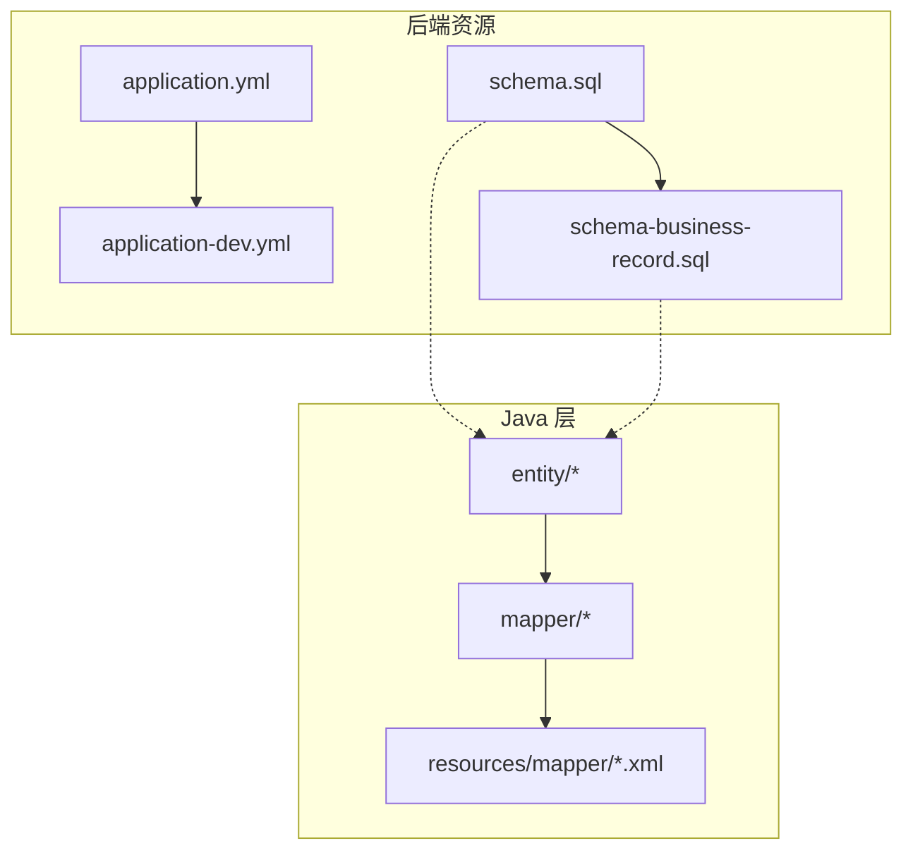
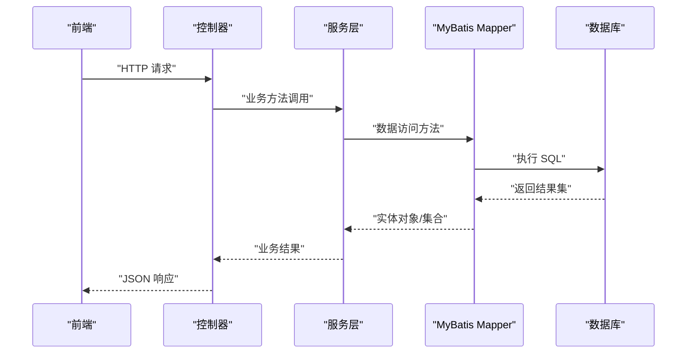
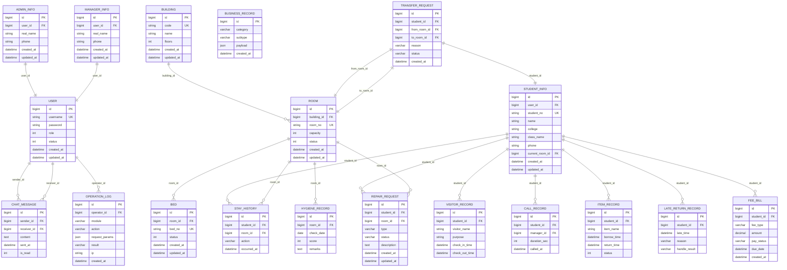

# 数据库表结构设计

<cite>
**本文引用的文件**   
- [schema.sql](file://backend/src/main/resources/schema.sql)
- [schema-business-record.sql](file://backend/src/main/resources/schema-business-record.sql)
- [application.yml](file://backend/src/main/resources/application.yml)
- [application-dev.yml](file://backend/src/main/resources/application-dev.yml)
- [AdminInfo.java](file://backend/src/main/java/com/dorm/backend/entity/AdminInfo.java)
- [Bed.java](file://backend/src/main/java/com/dorm/backend/entity/Bed.java)
- [Building.java](file://backend/src/main/java/com/dorm/backend/entity/Building.java)
- [BusinessRecord.java](file://backend/src/main/java/com/dorm/backend/entity/BusinessRecord.java)
- [CallRecord.java](file://backend/src/main/java/com/dorm/backend/entity/CallRecord.java)
- [ChatMessage.java](file://backend/src/main/java/com/dorm/backend/entity/ChatMessage.java)
- [FeeBill.java](file://backend/src/main/java/com/dorm/backend/entity/FeeBill.java)
- [HygieneRecord.java](file://backend/src/main/java/com/dorm/backend/entity/HygieneRecord.java)
- [ItemRecord.java](file://backend/src/main/java/com/dorm/backend/entity/ItemRecord.java)
- [LateReturnRecord.java](file://backend/src/main/java/com/dorm/backend/entity/LateReturnRecord.java)
- [ManagerInfo.java](file://backend/src/main/java/com/dorm/backend/entity/ManagerInfo.java)
- [OperationLog.java](file://backend/src/main/java/com/dorm/backend/entity/OperationLog.java)
- [RepairRequest.java](file://backend/src/main/java/com/dorm/backend/entity/RepairRequest.java)
- [Room.java](file://backend/src/main/java/com/dorm/backend/entity/Room.java)
- [StayHistory.java](file://backend/src/main/java/com/dorm/backend/entity/StayHistory.java)
- [StudentInfo.java](file://backend/src/main/java/com/dorm/backend/entity/StudentInfo.java)
- [TransferRequest.java](file://backend/src/main/java/com/dorm/backend/entity/TransferRequest.java)
- [User.java](file://backend/src/main/java/com/dorm/backend/entity/User.java)
- [VisitorRecord.java](file://backend/src/main/java/com/dorm/backend/entity/VisitorRecord.java)
</cite>

## 目录
1. [简介](#简介)
2. [项目结构](#项目结构)
3. [核心组件](#核心组件)
4. [架构总览](#架构总览)
5. [详细组件分析](#详细组件分析)
6. [依赖关系分析](#依赖关系分析)
7. [性能考虑](#性能考虑)
8. [故障排查指南](#故障排查指南)
9. [结论](#结论)
10. [附录](#附录)

## 简介
本文件面向宿舍管理系统（Dorm-Sys）的数据库设计，系统性梳理所有数据表的建表语句、字段定义与数据类型选择；说明表间外键约束、索引设计与查询优化策略；给出分区策略、备份恢复方案与性能调优配置；阐述版本管理与迁移脚本管理方式；并覆盖安全配置、访问控制与数据加密策略。同时提供监控、故障排查与扩容升级指导，帮助读者从概念到落地全面掌握该系统的数据库设计与运维要点。

## 项目结构
后端采用 Spring Boot + MyBatis 架构，实体类位于 entity 包，Mapper 接口位于 mapper 包，SQL 映射文件位于 resources/mapper，数据库初始化脚本位于 resources 下的 schema*.sql。应用配置文件 application.yml 与 application-dev.yml 用于环境区分与连接参数设置。

图表来源 
- [application.yml](file://backend/src/main/resources/application.yml)
- [application-dev.yml](file://backend/src/main/resources/application-dev.yml)
- [schema.sql](file://backend/src/main/resources/schema.sql)
- [schema-business-record.sql](file://backend/src/main/resources/schema-business-record.sql)

章节来源
- [application.yml](file://backend/src/main/resources/application.yml)
- [application-dev.yml](file://backend/src/main/resources/application-dev.yml)
- [schema.sql](file://backend/src/main/resources/schema.sql)
- [schema-business-record.sql](file://backend/src/main/resources/schema-business-record.sql)

## 核心组件
- 实体模型：以 entity 包中的 Java 类为核心，描述各业务实体的属性与关系，如用户、管理员、宿管、楼栋、房间、床位、学生信息、报修、访客、通话记录、卫生检查、物品借用、晚归、费用账单、停留历史、操作日志等。
- 数据访问：mapper 接口配合 XML 映射文件实现 SQL 编排与结果映射。
- 初始化脚本：schema.sql 与 schema-business-record.sql 分别承载基础结构与业务扩展结构。

章节来源
- [AdminInfo.java](file://backend/src/main/java/com/dorm/backend/entity/AdminInfo.java)
- [Bed.java](file://backend/src/main/java/com/dorm/backend/entity/Bed.java)
- [Building.java](file://backend/src/main/java/com/dorm/backend/entity/Building.java)
- [BusinessRecord.java](file://backend/src/main/java/com/dorm/backend/entity/BusinessRecord.java)
- [CallRecord.java](file://backend/src/main/java/com/dorm/backend/entity/CallRecord.java)
- [ChatMessage.java](file://backend/src/main/java/com/dorm/backend/entity/ChatMessage.java)
- [FeeBill.java](file://backend/src/main/java/com/dorm/backend/entity/FeeBill.java)
- [HygieneRecord.java](file://backend/src/main/java/com/dorm/backend/entity/HygieneRecord.java)
- [ItemRecord.java](file://backend/src/main/java/com/dorm/backend/entity/ItemRecord.java)
- [LateReturnRecord.java](file://backend/src/main/java/com/dorm/backend/entity/LateReturnRecord.java)
- [ManagerInfo.java](file://backend/src/main/java/com/dorm/backend/entity/ManagerInfo.java)
- [OperationLog.java](file://backend/src/main/java/com/dorm/backend/entity/OperationLog.java)
- [RepairRequest.java](file://backend/src/main/java/com/dorm/backend/entity/RepairRequest.java)
- [Room.java](file://backend/src/main/java/com/dorm/backend/entity/Room.java)
- [StayHistory.java](file://backend/src/main/java/com/dorm/backend/entity/StayHistory.java)
- [StudentInfo.java](file://backend/src/main/java/com/dorm/backend/entity/StudentInfo.java)
- [TransferRequest.java](file://backend/src/main/java/com/dorm/backend/entity/TransferRequest.java)
- [User.java](file://backend/src/main/java/com/dorm/backend/entity/User.java)
- [VisitorRecord.java](file://backend/src/main/java/com/dorm/backend/entity/VisitorRecord.java)

## 架构总览
下图展示系统整体数据流与关键组件交互：前端通过 API 调用后端控制器，服务层调用 Mapper，最终由 MyBatis 执行 SQL 访问数据库。数据库初始化脚本由 CI/CD 或部署流程触发，确保环境一致性。

图表来源 
- [application.yml](file://backend/src/main/resources/application.yml)
- [schema.sql](file://backend/src/main/resources/schema.sql)
- [schema-business-record.sql](file://backend/src/main/resources/schema-business-record.sql)

## 详细组件分析
本节围绕核心数据域进行表级分析与关系建模，结合实体类与 SQL 脚本定位字段与约束，并给出索引与查询优化建议。

### 用户与权限域
- 涉及实体：User、AdminInfo、ManagerInfo
- 典型字段：用户标识、账号、密码、角色、状态、创建时间、更新时间等
- 关系说明：用户表作为统一身份入口，管理员与宿管信息通过外键关联用户表，便于权限与范围控制
- 索引建议：账号唯一索引、角色与状态复合索引
- 查询优化：登录与鉴权路径优先命中账号索引；分页查询避免深分页

章节来源
- [User.java](file://backend/src/main/java/com/dorm/backend/entity/User.java)
- [AdminInfo.java](file://backend/src/main/java/com/dorm/backend/entity/AdminInfo.java)
- [ManagerInfo.java](file://backend/src/main/java/com/dorm/backend/entity/ManagerInfo.java)

### 住宿资源域
- 涉及实体：Building、Room、Bed
- 典型字段：楼栋编号与名称、房间号与容量、床位号与状态、所属关系
- 关系说明：楼栋一对多房间，房间一对多床位；床位状态驱动入住与退宿流程
- 索引建议：房间号唯一索引、床位号与状态复合索引、楼栋ID索引
- 查询优化：按楼栋与房间维度聚合统计；床位状态变更使用批量更新

章节来源
- [Building.java](file://backend/src/main/java/com/dorm/backend/entity/Building.java)
- [Room.java](file://backend/src/main/java/com/dorm/backend/entity/Room.java)
- [Bed.java](file://backend/src/main/java/com/dorm/backend/entity/Bed.java)

### 学生信息与停留历史域
- 涉及实体：StudentInfo、StayHistory
- 典型字段：学号、姓名、学院、班级、联系方式、入住/退宿时间、当前房间、历史轨迹
- 关系说明：学生与房间存在当前入住关系；停留历史记录每次变动
- 索引建议：学号唯一索引、房间ID与时间复合索引
- 查询优化：历史查询按时间范围过滤；当前入住查询走房间ID索引

章节来源
- [StudentInfo.java](file://backend/src/main/java/com/dorm/backend/entity/StudentInfo.java)
- [StayHistory.java](file://backend/src/main/java/com/dorm/backend/entity/StayHistory.java)

### 报修与业务记录域
- 涉及实体：RepairRequest、BusinessRecord
- 典型字段：报修单号、问题类型、处理状态、处理人、时间戳、业务分类
- 关系说明：报修单与用户、房间、处理人存在关联；业务记录用于审计与汇总
- 索引建议：状态与时间复合索引、用户ID与房间ID索引
- 查询优化：待办列表按状态与时间排序；统计报表使用物化视图或定时汇总

章节来源
- [RepairRequest.java](file://backend/src/main/java/com/dorm/backend/entity/RepairRequest.java)
- [BusinessRecord.java](file://backend/src/main/java/com/dorm/backend/entity/BusinessRecord.java)

### 访客与通话记录域
- 涉及实体：VisitorRecord、CallRecord
- 典型字段：访客姓名、被访人、进出时间、事由、通话时长、通话时间
- 关系说明：访客与被访学生关联；通话记录可与学生或管理员关联
- 索引建议：被访人ID与时间复合索引、通话时间索引
- 查询优化：按时间段导出；高频查询建立覆盖索引

章节来源
- [VisitorRecord.java](file://backend/src/main/java/com/dorm/backend/entity/VisitorRecord.java)
- [CallRecord.java](file://backend/src/main/java/com/dorm/backend/entity/CallRecord.java)

### 卫生检查与物品借用域
- 涉及实体：HygieneRecord、ItemRecord
- 典型字段：检查日期、评分、扣分项、物品名称、借出/归还时间、责任人
- 关系说明：卫生记录与房间关联；物品借用与学生关联
- 索引建议：房间ID与日期复合索引、借出状态与时间索引
- 查询优化：月度汇总按房间与月份分组；逾期提醒基于时间与状态

章节来源
- [HygieneRecord.java](file://backend/src/main/java/com/dorm/backend/entity/HygieneRecord.java)
- [ItemRecord.java](file://backend/src/main/java/com/dorm/backend/entity/ItemRecord.java)

### 晚归与费用账单域
- 涉及实体：LateReturnRecord、FeeBill
- 典型字段：晚归时间、原因、处理结果、费用类型、金额、支付状态、截止日期
- 关系说明：晚归记录与学生关联；费用账单与学生关联并可关联支付流水
- 索引建议：学生ID与时间复合索引、支付状态与截止日期索引
- 查询优化：催缴清单按截止日期排序；晚归统计按学期分组

章节来源
- [LateReturnRecord.java](file://backend/src/main/java/com/dorm/backend/entity/LateReturnRecord.java)
- [FeeBill.java](file://backend/src/main/java/com/dorm/backend/entity/FeeBill.java)

### 聊天消息域
- 涉及实体：ChatMessage
- 典型字段：发送者、接收者、内容、时间戳、已读状态
- 关系说明：消息在用户之间流转，支持会话聚合
- 索引建议：会话键（双方ID组合）与时间索引
- 查询优化：分页拉取最近消息；历史归档按会话与时间分片

章节来源
- [ChatMessage.java](file://backend/src/main/java/com/dorm/backend/entity/ChatMessage.java)

### 转寝申请域
- 涉及实体：TransferRequest
- 典型字段：申请人、原房间、目标房间、申请原因、审批状态、处理时间
- 关系说明：与原房间和目标房间存在校验关系
- 索引建议：申请人ID与状态复合索引、目标房间ID索引
- 查询优化：待审批列表按状态与时间排序

章节来源
- [TransferRequest.java](file://backend/src/main/java/com/dorm/backend/entity/TransferRequest.java)

### 操作日志域
- 涉及实体：OperationLog
- 典型字段：操作人、操作模块、动作、请求参数、结果、IP、时间戳
- 关系说明：与用户表关联，用于审计与追溯
- 索引建议：操作人ID与时间复合索引、模块与动作索引
- 查询优化：按时间范围滚动归档；热点查询建立覆盖索引

章节来源
- [OperationLog.java](file://backend/src/main/java/com/dorm/backend/entity/OperationLog.java)

### ER 关系图

图表来源 
- [schema.sql](file://backend/src/main/resources/schema.sql)
- [schema-business-record.sql](file://backend/src/main/resources/schema-business-record.sql)

## 依赖关系分析
- 实体与脚本对应：实体类属性与 schema*.sql 中字段一一对应，保证 ORM 映射一致。
- 外键约束：用户主表为权威源，管理员、宿管、学生均通过 user_id 关联；房间与楼栋、床位与房间形成层级关系；各类记录通过学生ID或房间ID关联。
- 索引与查询：高频查询路径（登录鉴权、房间床位查询、历史记录分页、报修待办、费用催缴）均通过合理索引优化。
- 潜在循环依赖：无直接循环外键；跨表校验建议在应用层完成（如转寝申请的目标房间可用性）。

章节来源
- [schema.sql](file://backend/src/main/resources/schema.sql)
- [schema-business-record.sql](file://backend/src/main/resources/schema-business-record.sql)

## 性能考虑
- 索引策略
  - 唯一性字段：用户名、学号、楼栋编号、房间号、床位号等设置唯一索引
  - 查询热点：状态+时间、用户ID+时间、房间ID+时间等复合索引
  - 覆盖索引：对常用列表页查询构建覆盖索引，减少回表
- 分区策略
  - 日志与记录类表（操作日志、通话记录、卫生记录、晚归记录）按时间分区（月/季度），提升归档与清理效率
  - 聊天消息按会话与时间分片，支持冷热分离
- 读写分离与缓存
  - 读多写少场景启用只读副本；热点数据（楼栋、房间、床位状态）使用缓存
  - 报表与统计使用物化视图或定时任务预计算
- 事务与锁
  - 床位状态变更、费用支付等关键路径使用短事务与行级锁，避免长事务
- 批处理
  - 批量插入/更新（如开学季床位分配、批量生成费用账单）使用分批提交

[本节为通用性能建议，不直接分析具体文件]

## 故障排查指南
- 连接与配置
  - 检查 application.yml 与 application-dev.yml 的数据库连接参数、时区、字符集
  - 确认连接池大小、超时与重试策略
- 慢查询定位
  - 开启慢查询日志，结合 EXPLAIN 分析执行计划
  - 关注全表扫描、临时表与文件排序
- 锁与死锁
  - 查看 InnoDB 锁等待与死锁日志，优化事务粒度与索引
- 备份与恢复
  - 定期逻辑备份（mysqldump）与物理备份（XtraBackup）
  - 演练恢复流程，验证完整性与一致性
- 监控告警
  - 监控连接数、QPS、TPS、缓冲池命中率、磁盘 IO、复制延迟
  - 设置阈值告警，快速定位异常

章节来源
- [application.yml](file://backend/src/main/resources/application.yml)
- [application-dev.yml](file://backend/src/main/resources/application-dev.yml)

## 结论
本设计以用户为中心，围绕住宿资源、学生信息与各类业务记录构建完整的数据模型。通过合理的索引与分区策略、严格的权限与审计机制、完善的备份与监控体系，保障系统在规模增长与高并发场景下的稳定性与可维护性。后续可在读写分离、缓存与物化视图方面持续优化，进一步提升性能与可扩展性。

[本节为总结性内容，不直接分析具体文件]

## 附录
- 建表语句与字段定义
  - 基础结构：参见 schema.sql
  - 业务扩展：参见 schema-business-record.sql
- 版本管理与迁移脚本
  - 使用版本号命名迁移脚本（如 V1__init.sql、V2__add_indexes.sql）
  - 引入迁移工具（如 Flyway/Liquibase）管理变更，确保幂等与回滚能力
  - 在 CI/CD 中自动执行迁移，失败即阻断发布
- 安全配置与访问控制
  - 最小权限原则：应用账户仅授予必要 DDL/DML 权限
  - 传输加密：启用 TLS；敏感字段（密码、手机号、身份证）加密存储
  - 审计与脱敏：操作日志记录、查询结果脱敏输出
- 监控与扩容升级
  - 指标采集：CPU、内存、IO、连接数、慢查询、复制状态
  - 水平扩容：分库分表策略（按学生ID或房间ID哈希）、读写分离
  - 灰度发布：先小流量验证，再逐步放量

章节来源
- [schema.sql](file://backend/src/main/resources/schema.sql)
- [schema-business-record.sql](file://backend/src/main/resources/schema-business-record.sql)
- [application.yml](file://backend/src/main/resources/application.yml)
- [application-dev.yml](file://backend/src/main/resources/application-dev.yml)