# 数据模型设计

<cite>
**本文引用的文件**   
- [schema.sql](file://backend/src/main/resources/schema.sql)
- [schema-business-record.sql](file://backend/src/main/resources/schema-business-record.sql)
- [AdminInfo.java](file://backend/src/main/java/com/dorm/backend/entity/AdminInfo.java)
- [User.java](file://backend/src/main/java/com/dorm/backend/entity/User.java)
- [StudentInfo.java](file://backend/src/main/java/com/dorm/backend/entity/StudentInfo.java)
- [ManagerInfo.java](file://backend/src/main/java/com/dorm/backend/entity/ManagerInfo.java)
- [Building.java](file://backend/src/main/java/com/dorm/backend/entity/Building.java)
- [Room.java](file://backend/src/main/java/com/dorm/backend/entity/Room.java)
- [Bed.java](file://backend/src/main/java/com/dorm/backend/entity/Bed.java)
- [StayHistory.java](file://backend/src/main/java/com/dorm/backend/entity/StayHistory.java)
- [TransferRequest.java](file://backend/src/main/java/com/dorm/backend/entity/TransferRequest.java)
- [RepairRequest.java](file://backend/src/main/java/com/dorm/backend/entity/RepairRequest.java)
- [FeeBill.java](file://backend/src/main/java/com/dorm/backend/entity/FeeBill.java)
- [HygieneRecord.java](file://backend/src/main/java/com/dorm/backend/entity/HygieneRecord.java)
- [ItemRecord.java](file://backend/src/main/java/com/dorm/backend/entity/ItemRecord.java)
- [LateReturnRecord.java](file://backend/src/main/java/com/dorm/backend/entity/LateReturnRecord.java)
- [CallRecord.java](file://backend/src/main/java/com/dorm/backend/entity/CallRecord.java)
- [VisitorRecord.java](file://backend/src/main/java/com/dorm/backend/entity/VisitorRecord.java)
- [BusinessRecord.java](file://backend/src/main/java/com/dorm/backend/entity/BusinessRecord.java)
- [OperationLog.java](file://backend/src/main/java/com/dorm/backend/entity/OperationLog.java)
- [ChatMessage.java](file://backend/src/main/java/com/dorm/backend/entity/ChatMessage.java)
- [BedStatusEnum.java](file://backend/src/main/java/com/dorm/backend/enums/BedStatusEnum.java)
- [RoomStatusEnum.java](file://backend/src/main/java/com/dorm/backend/enums/RoomStatusEnum.java)
- [FeeStatusEnum.java](file://backend/src/main/java/com/dorm/backend/enums/FeeStatusEnum.java)
- [RepairStatusEnum.java](file://backend/src/main/java/com/dorm/backend/enums/RepairStatusEnum.java)
</cite>

## 目录
1. [简介](#简介)
2. [项目结构](#项目结构)
3. [核心组件](#核心组件)
4. [架构总览](#架构总览)
5. [详细组件分析](#详细组件分析)
6. [依赖关系分析](#依赖关系分析)
7. [性能考虑](#性能考虑)
8. [故障排查指南](#故障排查指南)
9. [结论](#结论)
10. [附录](#附录)

## 简介
本文件面向Dorm-Sys的数据模型设计，系统性梳理实体类定义、字段与数据类型、实体间关系映射（一对一、一对多、多对多）、数据库表结构设计、索引策略与约束条件、数据验证规则与业务约束、数据完整性保证、数据迁移与版本管理、备份恢复机制、缓存策略、查询优化与性能调优方案，并给出ER图与关系图的可视化说明。文档力求在技术细节与可读性之间取得平衡，便于不同背景的读者理解和使用。

## 项目结构
后端采用典型的分层架构：Controller层暴露REST接口，Service层实现业务逻辑，Mapper层对接持久化，Entity层定义数据模型，Enum层提供枚举常量，resources下包含SQL脚本与配置文件。数据模型主要分布在entity包中，并通过MyBatis的Mapper接口进行持久化操作。数据库初始化脚本位于resources目录下，包括主结构与业务扩展结构。

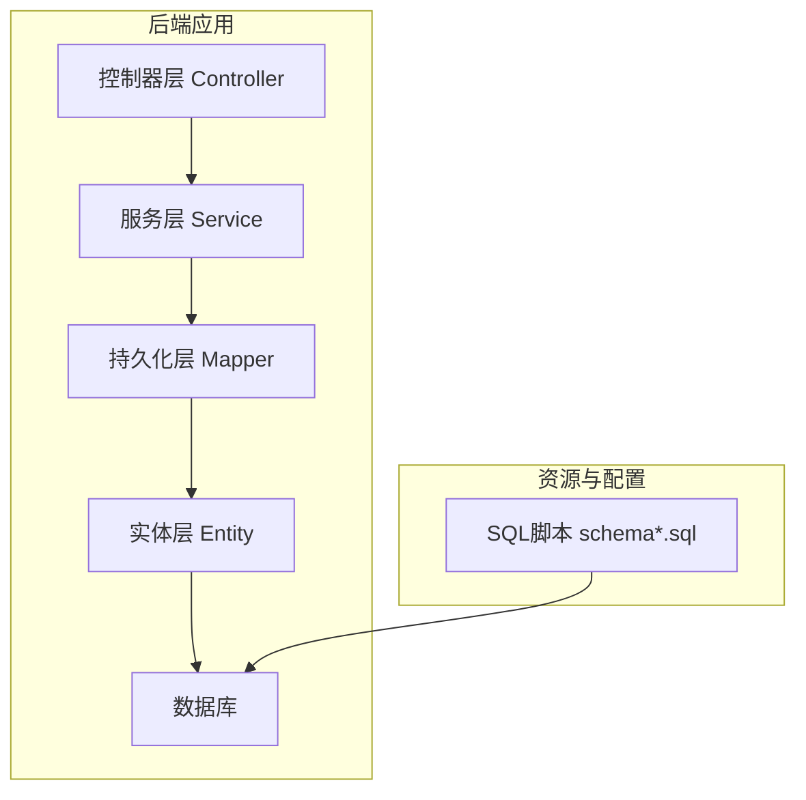

图表来源
- [AdminInfo.java](file://backend/src/main/java/com/dorm/backend/entity/AdminInfo.java)
- [User.java](file://backend/src/main/java/com/dorm/backend/entity/User.java)
- [schema.sql](file://backend/src/main/resources/schema.sql)

章节来源
- [schema.sql](file://backend/src/main/resources/schema.sql)
- [schema-business-record.sql](file://backend/src/main/resources/schema-business-record.sql)

## 核心组件
本节聚焦数据模型的核心实体及其职责边界，涵盖用户与角色、宿管设施、住宿与床位、费用与账单、报修与卫生、访客与通话、业务记录与审计日志等。每个实体均对应数据库表，字段类型与约束由SQL脚本与实体注解共同定义。

- 用户与角色
  - 管理员 AdminInfo：管理员账号信息，关联系统用户。
  - 系统用户 User：统一认证主体，支持角色区分。
  - 学生 StudentInfo：学生基本信息，关联宿舍分配与历史。
  - 宿管 ManagerInfo：宿管人员信息，负责楼栋或房间管理范围。

- 宿管设施
  - 楼栋 Building：宿舍楼基础信息。
  - 房间 Room：楼栋下的房间，含状态与容量。
  - 床位 Bed：房间内的床位，含占用状态。

- 住宿与流转
  - 住宿历史 StayHistory：记录学生入住、退宿等历史事件。
  - 换宿申请 TransferRequest：学生换宿流程与审批。

- 费用与账单
  - 费用账单 FeeBill：学生费用明细与支付状态。

- 报修与卫生
  - 报修单 RepairRequest：报修申请、处理状态与反馈。
  - 卫生检查 HygieneRecord：房间卫生评分与记录。

- 物品与晚归
  - 物品登记 ItemRecord：宿舍公共物品登记与盘点。
  - 晚归记录 LateReturnRecord：学生晚归登记与统计。

- 访客与通话
  - 访客记录 VisitorRecord：访客进出登记。
  - 通话记录 CallRecord：宿管与学生通话记录。

- 业务与审计
  - 业务记录 BusinessRecord：通用业务流水记录。
  - 操作日志 OperationLog：系统操作审计日志。
  - 聊天消息 ChatMessage：系统内聊天消息存储。

章节来源
- [AdminInfo.java](file://backend/src/main/java/com/dorm/backend/entity/AdminInfo.java)
- [User.java](file://backend/src/main/java/com/dorm/backend/entity/User.java)
- [StudentInfo.java](file://backend/src/main/java/com/dorm/backend/entity/StudentInfo.java)
- [ManagerInfo.java](file://backend/src/main/java/com/dorm/backend/entity/ManagerInfo.java)
- [Building.java](file://backend/src/main/java/com/dorm/backend/entity/Building.java)
- [Room.java](file://backend/src/main/java/com/dorm/backend/entity/Room.java)
- [Bed.java](file://backend/src/main/java/com/dorm/backend/entity/Bed.java)
- [StayHistory.java](file://backend/src/main/java/com/dorm/backend/entity/StayHistory.java)
- [TransferRequest.java](file://backend/src/main/java/com/dorm/backend/entity/TransferRequest.java)
- [FeeBill.java](file://backend/src/main/java/com/dorm/backend/entity/FeeBill.java)
- [RepairRequest.java](file://backend/src/main/java/com/dorm/backend/entity/RepairRequest.java)
- [HygieneRecord.java](file://backend/src/main/java/com/dorm/backend/entity/HygieneRecord.java)
- [ItemRecord.java](file://backend/src/main/java/com/dorm/backend/entity/ItemRecord.java)
- [LateReturnRecord.java](file://backend/src/main/java/com/dorm/backend/entity/LateReturnRecord.java)
- [CallRecord.java](file://backend/src/main/java/com/dorm/backend/entity/CallRecord.java)
- [VisitorRecord.java](file://backend/src/main/java/com/dorm/backend/entity/VisitorRecord.java)
- [BusinessRecord.java](file://backend/src/main/java/com/dorm/backend/entity/BusinessRecord.java)
- [OperationLog.java](file://backend/src/main/java/com/dorm/backend/entity/OperationLog.java)
- [ChatMessage.java](file://backend/src/main/java/com/dorm/backend/entity/ChatMessage.java)

## 架构总览
下图展示数据模型的整体关系，包括用户体系、宿管设施、住宿流转、费用与报修、卫生与物品、访客与通话、业务与审计等模块之间的关联。

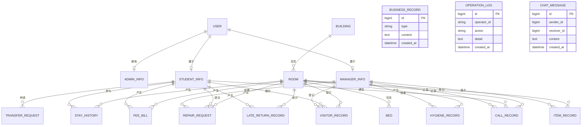

图表来源
- [schema.sql](file://backend/src/main/resources/schema.sql)
- [schema-business-record.sql](file://backend/src/main/resources/schema-business-record.sql)
- [User.java](file://backend/src/main/java/com/dorm/backend/entity/User.java)
- [AdminInfo.java](file://backend/src/main/java/com/dorm/backend/entity/AdminInfo.java)
- [StudentInfo.java](file://backend/src/main/java/com/dorm/backend/entity/StudentInfo.java)
- [ManagerInfo.java](file://backend/src/main/java/com/dorm/backend/entity/ManagerInfo.java)
- [Building.java](file://backend/src/main/java/com/dorm/backend/entity/Building.java)
- [Room.java](file://backend/src/main/java/com/dorm/backend/entity/Room.java)
- [Bed.java](file://backend/src/main/java/com/dorm/backend/entity/Bed.java)
- [StayHistory.java](file://backend/src/main/java/com/dorm/backend/entity/StayHistory.java)
- [TransferRequest.java](file://backend/src/main/java/com/dorm/backend/entity/TransferRequest.java)
- [FeeBill.java](file://backend/src/main/java/com/dorm/backend/entity/FeeBill.java)
- [RepairRequest.java](file://backend/src/main/java/com/dorm/backend/entity/RepairRequest.java)
- [HygieneRecord.java](file://backend/src/main/java/com/dorm/backend/entity/HygieneRecord.java)
- [ItemRecord.java](file://backend/src/main/java/com/dorm/backend/entity/ItemRecord.java)
- [LateReturnRecord.java](file://backend/src/main/java/com/dorm/backend/entity/LateReturnRecord.java)
- [CallRecord.java](file://backend/src/main/java/com/dorm/backend/entity/CallRecord.java)
- [VisitorRecord.java](file://backend/src/main/java/com/dorm/backend/entity/VisitorRecord.java)
- [BusinessRecord.java](file://backend/src/main/java/com/dorm/backend/entity/BusinessRecord.java)
- [OperationLog.java](file://backend/src/main/java/com/dorm/backend/entity/OperationLog.java)
- [ChatMessage.java](file://backend/src/main/java/com/dorm/backend/entity/ChatMessage.java)

## 详细组件分析

### 用户与角色实体
- 系统用户 User：作为统一身份主体，支撑登录认证与权限控制。
- 管理员 AdminInfo：管理员扩展信息，通常与User一对一关联。
- 学生 StudentInfo：学生基本信息，关联宿舍分配与历史记录。
- 宿管 ManagerInfo：宿管人员信息，关联管理范围与业务操作。

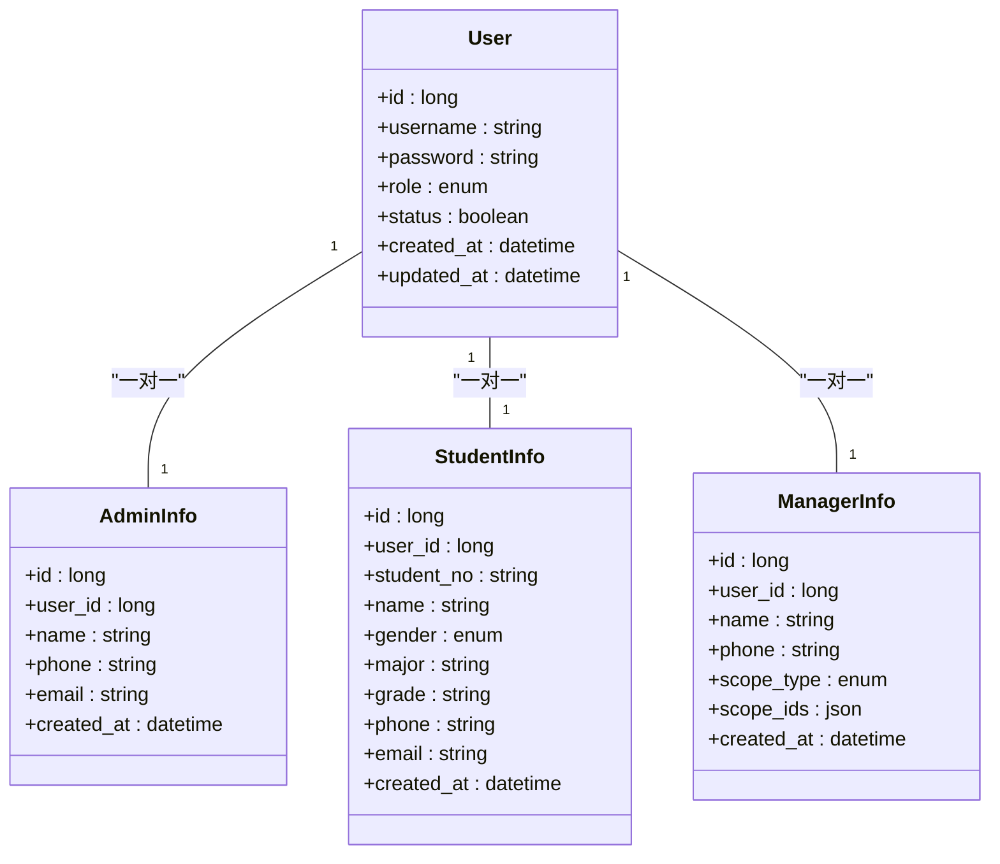

图表来源
- [User.java](file://backend/src/main/java/com/dorm/backend/entity/User.java)
- [AdminInfo.java](file://backend/src/main/java/com/dorm/backend/entity/AdminInfo.java)
- [StudentInfo.java](file://backend/src/main/java/com/dorm/backend/entity/StudentInfo.java)
- [ManagerInfo.java](file://backend/src/main/java/com/dorm/backend/entity/ManagerInfo.java)

章节来源
- [User.java](file://backend/src/main/java/com/dorm/backend/entity/User.java)
- [AdminInfo.java](file://backend/src/main/java/com/dorm/backend/entity/AdminInfo.java)
- [StudentInfo.java](file://backend/src/main/java/com/dorm/backend/entity/StudentInfo.java)
- [ManagerInfo.java](file://backend/src/main/java/com/dorm/backend/entity/ManagerInfo.java)

### 宿管设施实体
- 楼栋 Building：宿舍楼基础信息，作为房间的上层组织。
- 房间 Room：楼栋下的房间，包含状态、容量与负责人。
- 床位 Bed：房间内的床位，包含占用状态与编号。

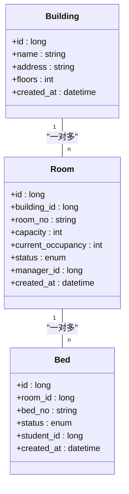

图表来源
- [Building.java](file://backend/src/main/java/com/dorm/backend/entity/Building.java)
- [Room.java](file://backend/src/main/java/com/dorm/backend/entity/Room.java)
- [Bed.java](file://backend/src/main/java/com/dorm/backend/entity/Bed.java)
- [RoomStatusEnum.java](file://backend/src/main/java/com/dorm/backend/enums/RoomStatusEnum.java)
- [BedStatusEnum.java](file://backend/src/main/java/com/dorm/backend/enums/BedStatusEnum.java)

章节来源
- [Building.java](file://backend/src/main/java/com/dorm/backend/entity/Building.java)
- [Room.java](file://backend/src/main/java/com/dorm/backend/entity/Room.java)
- [Bed.java](file://backend/src/main/java/com/dorm/backend/entity/Bed.java)
- [RoomStatusEnum.java](file://backend/src/main/java/com/dorm/backend/enums/RoomStatusEnum.java)
- [BedStatusEnum.java](file://backend/src/main/java/com/dorm/backend/enums/BedStatusEnum.java)

### 住宿与流转实体
- 住宿历史 StayHistory：记录学生入住、退宿、换宿等事件。
- 换宿申请 TransferRequest：学生发起换宿申请，经审批后更新住宿历史与床位状态。

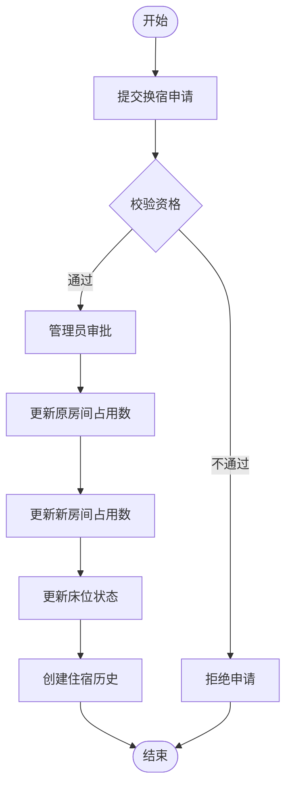

图表来源
- [StayHistory.java](file://backend/src/main/java/com/dorm/backend/entity/StayHistory.java)
- [TransferRequest.java](file://backend/src/main/java/com/dorm/backend/entity/TransferRequest.java)
- [Room.java](file://backend/src/main/java/com/dorm/backend/entity/Room.java)
- [Bed.java](file://backend/src/main/java/com/dorm/backend/entity/Bed.java)

章节来源
- [StayHistory.java](file://backend/src/main/java/com/dorm/backend/entity/StayHistory.java)
- [TransferRequest.java](file://backend/src/main/java/com/dorm/backend/entity/TransferRequest.java)
- [Room.java](file://backend/src/main/java/com/dorm/backend/entity/Room.java)
- [Bed.java](file://backend/src/main/java/com/dorm/backend/entity/Bed.java)

### 费用与账单实体
- 费用账单 FeeBill：学生费用明细，包含金额、类型、状态与支付时间。

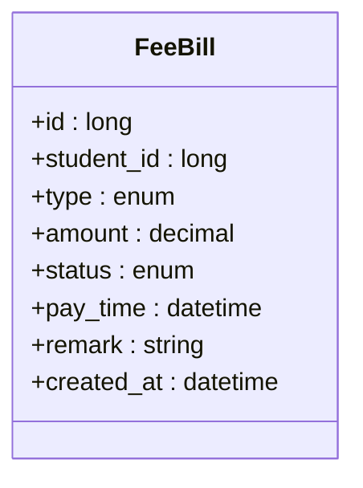

图表来源
- [FeeBill.java](file://backend/src/main/java/com/dorm/backend/entity/FeeBill.java)
- [FeeStatusEnum.java](file://backend/src/main/java/com/dorm/backend/enums/FeeStatusEnum.java)

章节来源
- [FeeBill.java](file://backend/src/main/java/com/dorm/backend/entity/FeeBill.java)
- [FeeStatusEnum.java](file://backend/src/main/java/com/dorm/backend/enums/FeeStatusEnum.java)

### 报修与卫生实体
- 报修单 RepairRequest：报修申请、处理状态、反馈与责任人。
- 卫生检查 HygieneRecord：房间卫生评分与检查记录。

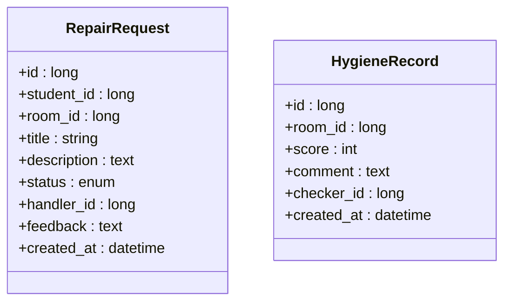

图表来源
- [RepairRequest.java](file://backend/src/main/java/com/dorm/backend/entity/RepairRequest.java)
- [HygieneRecord.java](file://backend/src/main/java/com/dorm/backend/entity/HygieneRecord.java)
- [RepairStatusEnum.java](file://backend/src/main/java/com/dorm/backend/enums/RepairStatusEnum.java)

章节来源
- [RepairRequest.java](file://backend/src/main/java/com/dorm/backend/entity/RepairRequest.java)
- [HygieneRecord.java](file://backend/src/main/java/com/dorm/backend/entity/HygieneRecord.java)
- [RepairStatusEnum.java](file://backend/src/main/java/com/dorm/backend/enums/RepairStatusEnum.java)

### 物品与晚归实体
- 物品登记 ItemRecord：宿舍公共物品登记与盘点。
- 晚归记录 LateReturnRecord：学生晚归登记与统计。

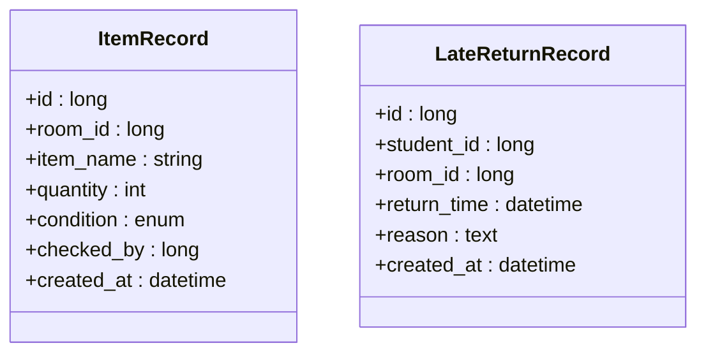

图表来源
- [ItemRecord.java](file://backend/src/main/java/com/dorm/backend/entity/ItemRecord.java)
- [LateReturnRecord.java](file://backend/src/main/java/com/dorm/backend/entity/LateReturnRecord.java)

章节来源
- [ItemRecord.java](file://backend/src/main/java/com/dorm/backend/entity/ItemRecord.java)
- [LateReturnRecord.java](file://backend/src/main/java/com/dorm/backend/entity/LateReturnRecord.java)

### 访客与通话实体
- 访客记录 VisitorRecord：访客进出登记，关联学生与宿管。
- 通话记录 CallRecord：宿管与学生通话记录。

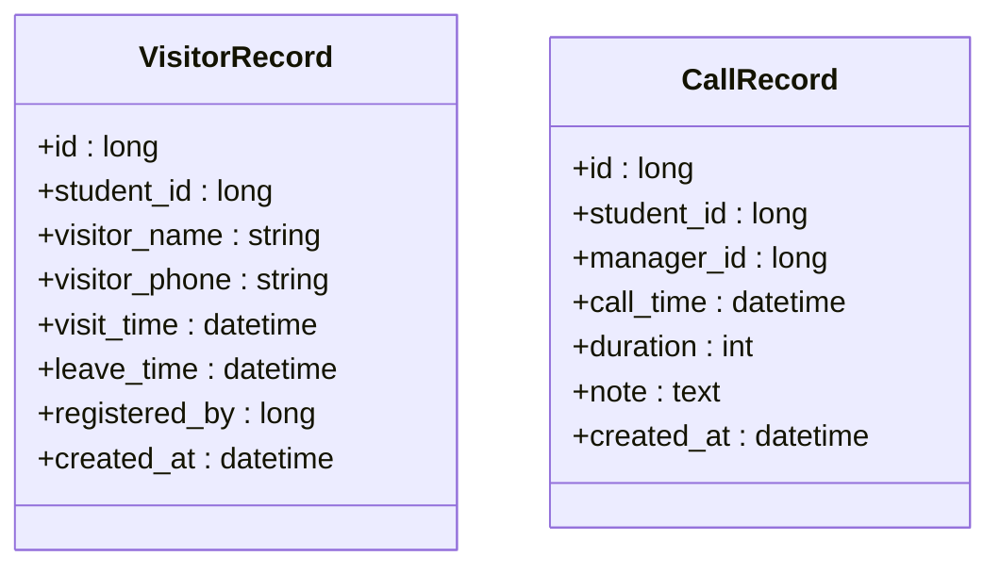

图表来源
- [VisitorRecord.java](file://backend/src/main/java/com/dorm/backend/entity/VisitorRecord.java)
- [CallRecord.java](file://backend/src/main/java/com/dorm/backend/entity/CallRecord.java)

章节来源
- [VisitorRecord.java](file://backend/src/main/java/com/dorm/backend/entity/VisitorRecord.java)
- [CallRecord.java](file://backend/src/main/java/com/dorm/backend/entity/CallRecord.java)

### 业务与审计实体
- 业务记录 BusinessRecord：通用业务流水记录，用于追踪关键业务事件。
- 操作日志 OperationLog：系统操作审计日志，记录操作人、动作与详情。
- 聊天消息 ChatMessage：系统内聊天消息存储，支持发送者与接收者。

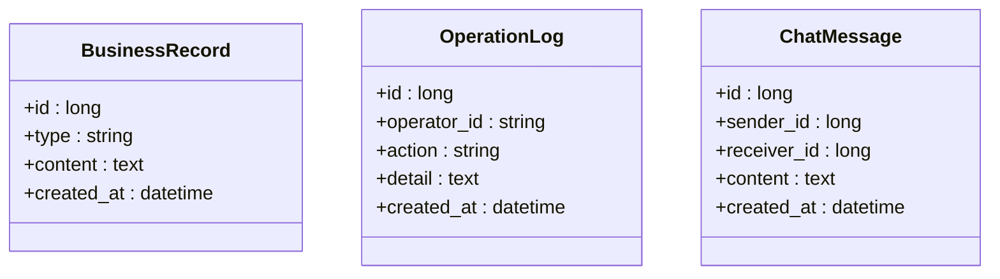

图表来源
- [BusinessRecord.java](file://backend/src/main/java/com/dorm/backend/entity/BusinessRecord.java)
- [OperationLog.java](file://backend/src/main/java/com/dorm/backend/entity/OperationLog.java)
- [ChatMessage.java](file://backend/src/main/java/com/dorm/backend/entity/ChatMessage.java)
- [schema-business-record.sql](file://backend/src/main/resources/schema-business-record.sql)

章节来源
- [BusinessRecord.java](file://backend/src/main/java/com/dorm/backend/entity/BusinessRecord.java)
- [OperationLog.java](file://backend/src/main/java/com/dorm/backend/entity/OperationLog.java)
- [ChatMessage.java](file://backend/src/main/java/com/dorm/backend/entity/ChatMessage.java)
- [schema-business-record.sql](file://backend/src/main/resources/schema-business-record.sql)

## 依赖关系分析
数据模型间的依赖主要体现在外键与业务关联上：
- 用户体系：User与AdminInfo、StudentInfo、ManagerInfo为一对一关系，确保身份唯一性与扩展信息分离。
- 宿管设施：Building到Room一对多，Room到Bed一对多，形成层级结构。
- 住宿流转：StayHistory与StudentInfo、Room、Bed关联；TransferRequest驱动状态变更。
- 费用与报修：FeeBill、RepairRequest、HygieneRecord、ItemRecord、LateReturnRecord、VisitorRecord、CallRecord分别关联StudentInfo与Room。
- 业务与审计：BusinessRecord、OperationLog、ChatMessage为通用记录，支撑可追溯性与沟通。

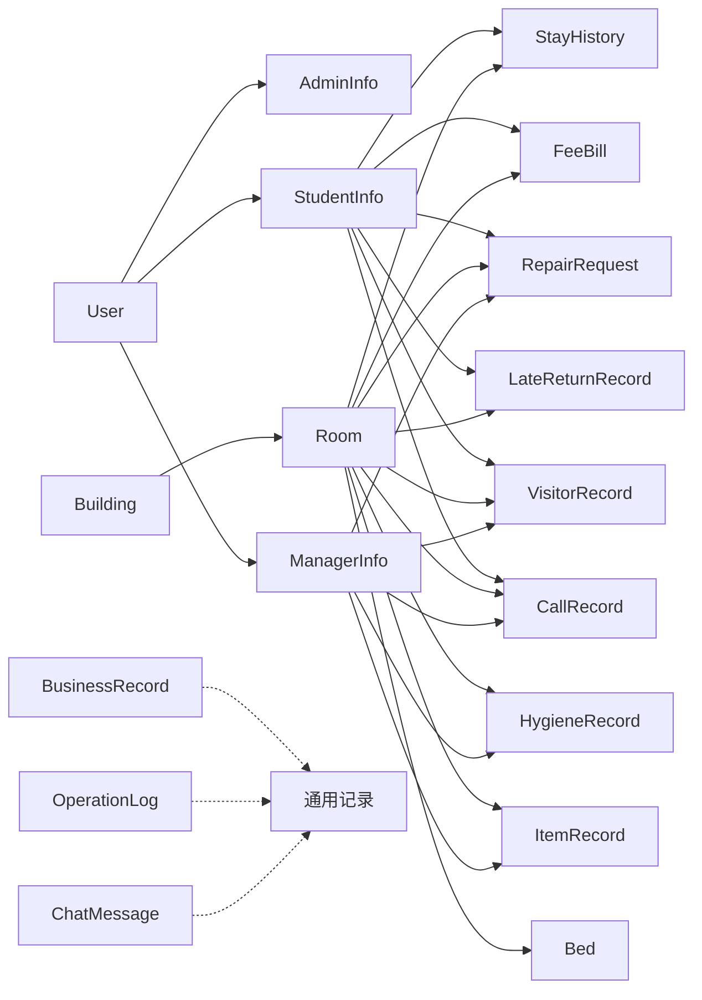

图表来源
- [schema.sql](file://backend/src/main/resources/schema.sql)
- [schema-business-record.sql](file://backend/src/main/resources/schema-business-record.sql)

章节来源
- [schema.sql](file://backend/src/main/resources/schema.sql)
- [schema-business-record.sql](file://backend/src/main/resources/schema-business-record.sql)

## 性能考虑
- 索引策略
  - 高频查询字段建立索引：如学生学号、房间号、床位号、用户名、手机号、时间戳等。
  - 复合索引：针对常见筛选条件组合（如房间+状态、学生+时间范围）建立复合索引以提升查询效率。
  - 外键索引：确保关联查询性能，避免全表扫描。
- 查询优化
  - 分页查询：列表接口默认分页，限制返回条数。
  - 懒加载：按需加载关联数据，减少一次性加载开销。
  - 批量操作：批量插入与更新，降低事务次数。
- 缓存策略
  - 热点数据缓存：楼栋、房间、床位等静态或低频变更数据使用缓存。
  - 会话缓存：用户会话与权限信息缓存，提升鉴权性能。
  - 读写分离：读多写少场景考虑读写分离与缓存一致性策略。
- 事务与一致性
  - 短事务：尽量缩短事务范围，减少锁竞争。
  - 幂等性：关键操作具备幂等性，防止重复提交导致数据不一致。
  - 补偿机制：失败重试与补偿任务，保障最终一致性。

[本节为通用指导，无需特定文件来源]

## 故障排查指南
- 常见问题定位
  - 外键约束冲突：检查关联数据是否存在，确保删除顺序正确。
  - 索引缺失导致慢查询：通过执行计划分析，补充必要索引。
  - 事务超时：拆分大事务，优化SQL与索引。
  - 数据不一致：核对业务流水与审计日志，定位异常点。
- 调试建议
  - 启用详细日志：记录关键操作与SQL执行。
  - 监控指标：关注慢查询、连接池、缓存命中率。
  - 数据校验：在写入前进行输入校验与业务规则校验。

[本节为通用指导，无需特定文件来源]

## 结论
Dorm-Sys的数据模型设计围绕宿舍管理的核心业务展开，实体清晰、关系明确，覆盖用户与角色、宿管设施、住宿流转、费用与报修、卫生与物品、访客与通话、业务与审计等关键领域。通过合理的索引策略、缓存设计与事务管理，能够有效支撑高并发与复杂查询场景。建议在后续迭代中持续优化数据模型与查询路径，确保系统的可扩展性与稳定性。

[本节为总结，无需特定文件来源]

## 附录
- ER图与关系图已在“架构总览”与“详细组件分析”中提供，便于直观理解数据模型。
- 数据迁移策略
  - 版本化管理：SQL脚本按版本命名，确保可回滚与增量升级。
  - 灰度发布：先在测试环境验证，再逐步上线生产。
  - 备份恢复：定期全量备份与增量备份，制定恢复演练计划。
- 数据验证规则
  - 前端校验：必填项、格式校验、范围校验。
  - 后端校验：参数校验、业务规则校验、权限校验。
  - 数据库约束：非空、唯一、外键、检查约束。
- 最佳实践
  - 单一职责：每个实体对应一个业务概念。
  - 规范化设计：合理拆分表，避免冗余。
  - 可维护性：命名规范、注释完整、版本可控。

[本节为补充内容，无需特定文件来源]