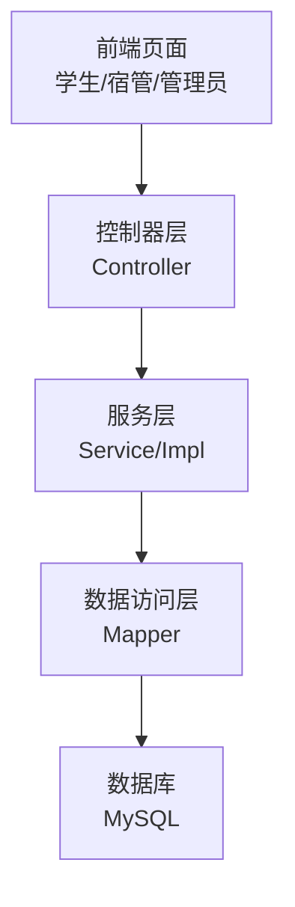
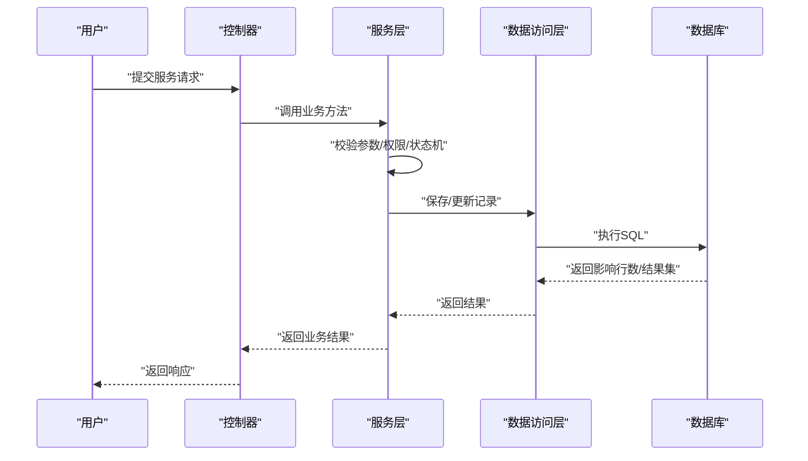
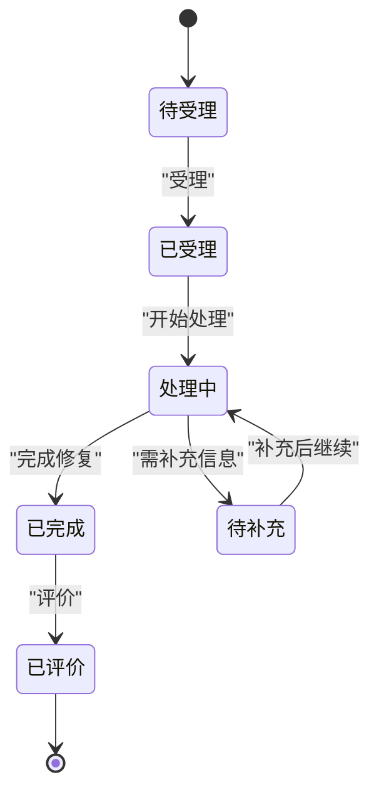
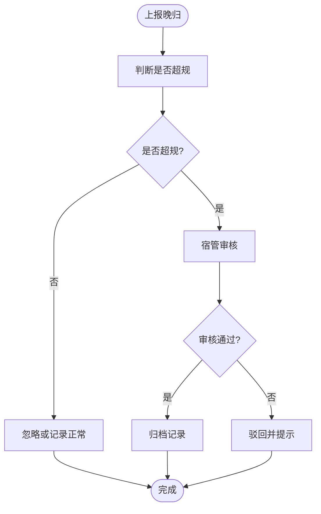
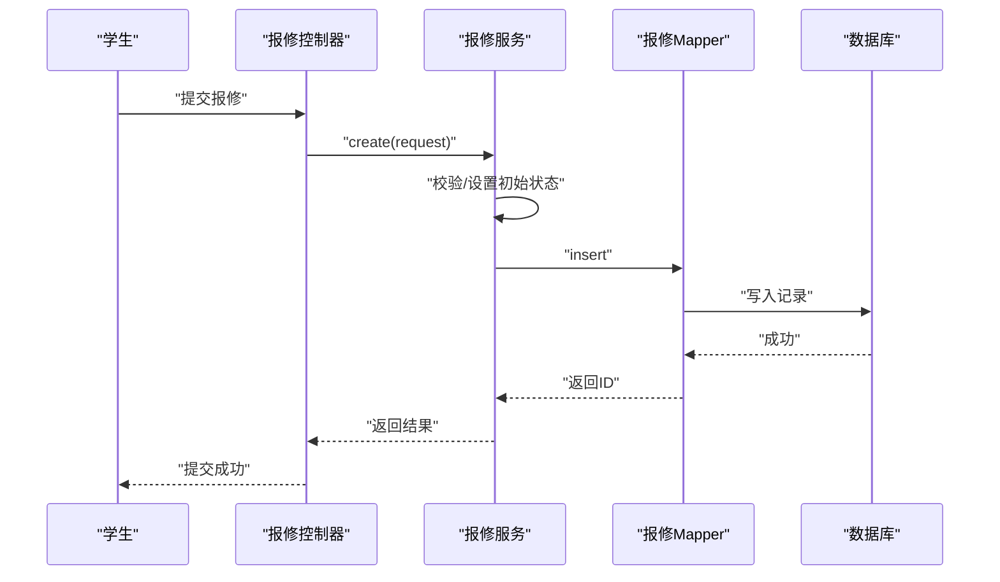
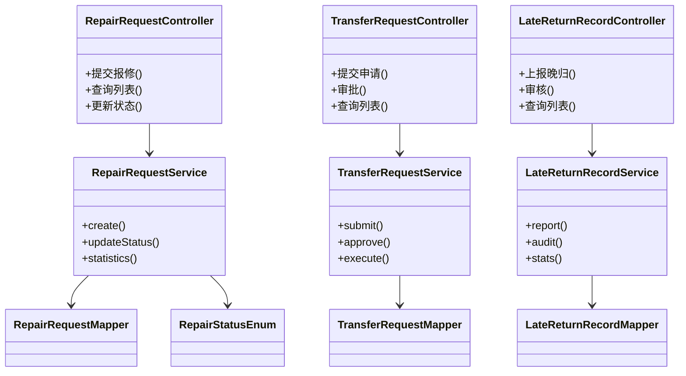

```mermaid
flowchart TD
Start(["提交申请"]) --> Validate["校验必填与材料"]
Validate --> Valid{"校验通过?"}
Valid --> |否| Reject["驳回并提示修改"]
Valid --> |是| Review1["宿管初审"]
Review1 --> Pass1{"初审通过?"}
Pass1 --> |否| Reject
Pass1 --> |是| Review2["管理员复审"]
Review2 --> Pass2{"复审通过?"}
Pass2 --> |否| Reject
Pass2 --> |是| Execute["执行换宿变更"]
Execute --> End(["完成"])
```

# 服务请求数据模型

<cite>
**本文引用的文件**   
- [RepairRequest.java](file://backend/src/main/java/com/dorm/backend/entity/RepairRequest.java)
- [TransferRequest.java](file://backend/src/main/java/com/dorm/backend/entity/TransferRequest.java)
- [LateReturnRecord.java](file://backend/src/main/java/com/dorm/backend/entity/LateReturnRecord.java)
- [RepairStatusEnum.java](file://backend/src/main/java/com/dorm/backend/enums/RepairStatusEnum.java)
- [RepairRequestController.java](file://backend/src/main/java/com/dorm/backend/controller/RepairRequestController.java)
- [TransferRequestController.java](file://backend/src/main/java/com/dorm/backend/controller/TransferRequestController.java)
- [LateReturnRecordController.java](file://backend/src/main/java/com/dorm/backend/controller/LateReturnRecordController.java)
- [RepairRequestService.java](file://backend/src/main/java/com/dorm/backend/service/RepairRequestService.java)
- [TransferRequestService.java](file://backend/src/main/java/com/dorm/backend/service/TransferRequestService.java)
- [LateReturnRecordService.java](file://backend/src/main/java/com/dorm/backend/service/LateReturnRecordService.java)
- [RepairRequestServiceImpl.java](file://backend/src/main/java/com/dorm/backend/service/impl/RepairRequestServiceImpl.java)
- [TransferRequestServiceImpl.java](file://backend/src/main/java/com/dorm/backend/service/impl/TransferRequestServiceImpl.java)
- [LateReturnRecordServiceImpl.java](file://backend/src/main/java/com/dorm/backend/service/impl/LateReturnRecordServiceImpl.java)
- [RepairRequestMapper.java](file://backend/src/main/java/com/dorm/backend/mapper/RepairRequestMapper.java)
- [TransferRequestMapper.java](file://backend/src/main/java/com/dorm/backend/mapper/TransferRequestMapper.java)
- [LateReturnRecordMapper.java](file://backend/src/main/java/com/dorm/backend/mapper/LateReturnRecordMapper.java)
- [schema.sql](file://backend/src/main/resources/schema.sql)
</cite>

## 目录
1. [简介](#简介)
2. [项目结构](#项目结构)
3. [核心组件](#核心组件)
4. [架构总览](#架构总览)
5. [详细组件分析](#详细组件分析)
6. [依赖关系分析](#依赖关系分析)
7. [性能考虑](#性能考虑)
8. [故障排查指南](#故障排查指南)
9. [结论](#结论)
10. [附录](#附录)

## 简介
本文件聚焦宿舍管理系统中的“服务请求”数据模型，围绕报修请求（RepairRequest）、换宿申请（TransferRequest）、晚归记录（LateReturnRecord）三类实体进行系统化说明。文档涵盖：
- 实体设计与字段含义
- 业务流程与状态流转（提交、审批、完成等）
- 不同服务类型的特殊字段与处理逻辑
- 优先级管理与超时处理策略
- 服务质量评估指标与统计分析
- 自动化处理与人工干预的平衡方案

## 项目结构
后端采用典型的分层架构：控制器层暴露REST接口，服务层封装业务逻辑，数据访问层通过MyBatis Mapper操作数据库，实体类映射表结构，枚举定义状态与类型。前端通过API调用实现用户交互。

图表来源
- [RepairRequestController.java](file://backend/src/main/java/com/dorm/backend/controller/RepairRequestController.java)
- [TransferRequestController.java](file://backend/src/main/java/com/dorm/backend/controller/TransferRequestController.java)
- [LateReturnRecordController.java](file://backend/src/main/java/com/dorm/backend/controller/LateReturnRecordController.java)
- [RepairRequestService.java](file://backend/src/main/java/com/dorm/backend/service/RepairRequestService.java)
- [TransferRequestService.java](file://backend/src/main/java/com/dorm/backend/service/TransferRequestService.java)
- [LateReturnRecordService.java](file://backend/src/main/java/com/dorm/backend/service/LateReturnRecordService.java)
- [RepairRequestMapper.java](file://backend/src/main/java/com/dorm/backend/mapper/RepairRequestMapper.java)
- [TransferRequestMapper.java](file://backend/src/main/java/com/dorm/backend/mapper/TransferRequestMapper.java)
- [LateReturnRecordMapper.java](file://backend/src/main/java/com/dorm/backend/mapper/LateReturnRecordMapper.java)
- [schema.sql](file://backend/src/main/resources/schema.sql)

章节来源
- [RepairRequestController.java](file://backend/src/main/java/com/dorm/backend/controller/RepairRequestController.java)
- [TransferRequestController.java](file://backend/src/main/java/com/dorm/backend/controller/TransferRequestController.java)
- [LateReturnRecordController.java](file://backend/src/main/java/com/dorm/backend/controller/LateReturnRecordController.java)
- [RepairRequestService.java](file://backend/src/main/java/com/dorm/backend/service/RepairRequestService.java)
- [TransferRequestService.java](file://backend/src/main/java/com/dorm/backend/service/TransferRequestService.java)
- [LateReturnRecordService.java](file://backend/src/main/java/com/dorm/backend/service/LateReturnRecordService.java)
- [RepairRequestMapper.java](file://backend/src/main/java/com/dorm/backend/mapper/RepairRequestMapper.java)
- [TransferRequestMapper.java](file://backend/src/main/java/com/dorm/backend/mapper/TransferRequestMapper.java)
- [LateReturnRecordMapper.java](file://backend/src/main/java/com/dorm/backend/mapper/LateReturnRecordMapper.java)
- [schema.sql](file://backend/src/main/resources/schema.sql)

## 核心组件
- 实体层
  - RepairRequest：报修请求，包含报修人、楼栋房间、问题分类、描述、图片、优先级、状态、时间戳等。
  - TransferRequest：换宿申请，包含申请人、原房间、目标房间、原因、证明材料、审批状态、时间戳等。
  - LateReturnRecord：晚归记录，包含学生、宿舍、返回时间、备注、审核状态、时间戳等。
- 枚举层
  - RepairStatusEnum：报修状态枚举，用于表达从提交到完成的完整生命周期。
- 控制器层
  - RepairRequestController、TransferRequestController、LateReturnRecordController：对外提供CRUD与流程控制接口。
- 服务层
  - RepairRequestService/Impl、TransferRequestService/Impl、LateReturnRecordService/Impl：封装业务规则、状态机、权限校验、统计与审计。
- 数据访问层
  - RepairRequestMapper、TransferRequestMapper、LateReturnRecordMapper：定义SQL查询与更新方法。
- 数据库
  - schema.sql：定义表结构与约束。

章节来源
- [RepairRequest.java](file://backend/src/main/java/com/dorm/backend/entity/RepairRequest.java)
- [TransferRequest.java](file://backend/src/main/java/com/dorm/backend/entity/TransferRequest.java)
- [LateReturnRecord.java](file://backend/src/main/java/com/dorm/backend/entity/LateReturnRecord.java)
- [RepairStatusEnum.java](file://backend/src/main/java/com/dorm/backend/enums/RepairStatusEnum.java)
- [RepairRequestController.java](file://backend/src/main/java/com/dorm/backend/controller/RepairRequestController.java)
- [TransferRequestController.java](file://backend/src/main/java/com/dorm/backend/controller/TransferRequestController.java)
- [LateReturnRecordController.java](file://backend/src/main/java/com/dorm/backend/controller/LateReturnRecordController.java)
- [RepairRequestService.java](file://backend/src/main/java/com/dorm/backend/service/RepairRequestService.java)
- [TransferRequestService.java](file://backend/src/main/java/com/dorm/backend/service/TransferRequestService.java)
- [LateReturnRecordService.java](file://backend/src/main/java/com/dorm/backend/service/LateReturnRecordService.java)
- [RepairRequestMapper.java](file://backend/src/main/java/com/dorm/backend/mapper/RepairRequestMapper.java)
- [TransferRequestMapper.java](file://backend/src/main/java/com/dorm/backend/mapper/TransferRequestMapper.java)
- [LateReturnRecordMapper.java](file://backend/src/main/java/com/dorm/backend/mapper/LateReturnRecordMapper.java)
- [schema.sql](file://backend/src/main/resources/schema.sql)

## 架构总览
下图展示服务请求在系统中的端到端流程：前端发起请求，控制器接收并校验参数，服务层执行业务逻辑（含状态机与权限），数据访问层持久化，最终返回结果。

图表来源
- [RepairRequestController.java](file://backend/src/main/java/com/dorm/backend/controller/RepairRequestController.java)
- [TransferRequestController.java](file://backend/src/main/java/com/dorm/backend/controller/TransferRequestController.java)
- [LateReturnRecordController.java](file://backend/src/main/java/com/dorm/backend/controller/LateReturnRecordController.java)
- [RepairRequestService.java](file://backend/src/main/java/com/dorm/backend/service/RepairRequestService.java)
- [TransferRequestService.java](file://backend/src/main/java/com/dorm/backend/service/TransferRequestService.java)
- [LateReturnRecordService.java](file://backend/src/main/java/com/dorm/backend/service/LateReturnRecordService.java)
- [RepairRequestMapper.java](file://backend/src/main/java/com/dorm/backend/mapper/RepairRequestMapper.java)
- [TransferRequestMapper.java](file://backend/src/main/java/com/dorm/backend/mapper/TransferRequestMapper.java)
- [LateReturnRecordMapper.java](file://backend/src/main/java/com/dorm/backend/mapper/LateReturnRecordMapper.java)
- [schema.sql](file://backend/src/main/resources/schema.sql)

## 详细组件分析

### 报修请求（RepairRequest）
- 设计要点
  - 关键字段：报修人、楼栋/房间、问题分类、详细描述、附件（图片/视频）、优先级、状态、处理人、处理意见、完成时间、更新时间。
  - 优先级：支持高/中/低或数值等级，结合SLA进行超时预警。
  - 状态机：由RepairStatusEnum驱动，典型路径包括“待受理→已受理→处理中→已完成→已评价”，允许退回与撤销。
- 业务流程
  - 提交：学生提交报修，系统生成唯一编号，默认状态为“待受理”。
  - 受理：宿管或维修人员查看并受理，分配处理人。
  - 处理：更新进度与处理意见，必要时上传现场照片。
  - 完成：标记完成并通知申请人。
  - 评价：申请人对服务质量评分与反馈。
- 特殊字段与逻辑
  - 紧急程度与优先级联动，触发自动提醒与升级策略。
  - 附件存储路径与预览链接管理。
  - 处理时效统计（首次响应时长、解决时长）。
- 状态流转图

图表来源
- [RepairStatusEnum.java](file://backend/src/main/java/com/dorm/backend/enums/RepairStatusEnum.java)
- [RepairRequestController.java](file://backend/src/main/java/com/dorm/backend/controller/RepairRequestController.java)
- [RepairRequestService.java](file://backend/src/main/java/com/dorm/backend/service/RepairRequestService.java)
- [RepairRequestServiceImpl.java](file://backend/src/main/java/com/dorm/backend/service/impl/RepairRequestServiceImpl.java)
- [RepairRequestMapper.java](file://backend/src/main/java/com/dorm/backend/mapper/RepairRequestMapper.java)
- [schema.sql](file://backend/src/main/resources/schema.sql)

章节来源
- [RepairRequest.java](file://backend/src/main/java/com/dorm/backend/entity/RepairRequest.java)
- [RepairStatusEnum.java](file://backend/src/main/java/com/dorm/backend/enums/RepairStatusEnum.java)
- [RepairRequestController.java](file://backend/src/main/java/com/dorm/backend/controller/RepairRequestController.java)
- [RepairRequestService.java](file://backend/src/main/java/com/dorm/backend/service/RepairRequestService.java)
- [RepairRequestServiceImpl.java](file://backend/src/main/java/com/dorm/backend/service/impl/RepairRequestServiceImpl.java)
- [RepairRequestMapper.java](file://backend/src/main/java/com/dorm/backend/mapper/RepairRequestMapper.java)
- [schema.sql](file://backend/src/main/resources/schema.sql)

### 换宿申请（TransferRequest）
- 设计要点
  - 关键字段：申请人、原房间、目标房间、换宿原因、证明材料、审批状态、审批意见、审批人、时间戳。
  - 审批流：通常涉及宿管初审、辅导员/管理员复审，可能有多级审批。
- 业务流程
  - 提交：学生填写换宿原因与材料，系统校验必填项。
  - 初审：宿管核对资格与材料完整性。
  - 复审：管理员根据空床情况与政策决定批准与否。
  - 执行：批准后更新床位占用与历史记录。
- 特殊字段与逻辑
  - 目标房间可用性校验（容量、性别限制、费用差异）。
  - 审批意见留痕与版本化管理。
  - 可配置审批链与回退机制。
- 流程图

图表来源
- [TransferRequestController.java](file://backend/src/main/java/com/dorm/backend/controller/TransferRequestController.java)
- [TransferRequestService.java](file://backend/src/main/java/com/dorm/backend/service/TransferRequestService.java)
- [TransferRequestServiceImpl.java](file://backend/src/main/java/com/dorm/backend/service/impl/TransferRequestServiceImpl.java)
- [TransferRequestMapper.java](file://backend/src/main/java/com/dorm/backend/mapper/TransferRequestMapper.java)
- [schema.sql](file://backend/src/main/resources/schema.sql)

章节来源
- [TransferRequest.java](file://backend/src/main/java/com/dorm/backend/entity/TransferRequest.java)
- [TransferRequestController.java](file://backend/src/main/java/com/dorm/backend/controller/TransferRequestController.java)
- [TransferRequestService.java](file://backend/src/main/java/com/dorm/backend/service/TransferRequestService.java)
- [TransferRequestServiceImpl.java](file://backend/src/main/java/com/dorm/backend/service/impl/TransferRequestServiceImpl.java)
- [TransferRequestMapper.java](file://backend/src/main/java/com/dorm/backend/mapper/TransferRequestMapper.java)
- [schema.sql](file://backend/src/main/resources/schema.sql)

### 晚归记录（LateReturnRecord）
- 设计要点
  - 关键字段：学生、宿舍、返回时间、备注、审核状态、时间戳。
  - 审核：宿管或值班人员审核是否违规，可附加警告或记录。
- 业务流程
  - 上报：门禁或学生自助上报晚归。
  - 审核：宿管核实并标注原因（如就医、活动）。
  - 归档：形成个人晚归历史，用于统计与预警。
- 特殊字段与逻辑
  - 时间窗口判定（例如超过规定时间即视为晚归）。
  - 白名单与豁免规则（活动报备、病假证明）。
  - 累计次数阈值触发提醒或处分建议。
- 流程图

图表来源
- [LateReturnRecordController.java](file://backend/src/main/java/com/dorm/backend/controller/LateReturnRecordController.java)
- [LateReturnRecordService.java](file://backend/src/main/java/com/dorm/backend/service/LateReturnRecordService.java)
- [LateReturnRecordServiceImpl.java](file://backend/src/main/java/com/dorm/backend/service/impl/LateReturnRecordServiceImpl.java)
- [LateReturnRecordMapper.java](file://backend/src/main/java/com/dorm/backend/mapper/LateReturnRecordMapper.java)
- [schema.sql](file://backend/src/main/resources/schema.sql)

章节来源
- [LateReturnRecord.java](file://backend/src/main/java/com/dorm/backend/entity/LateReturnRecord.java)
- [LateReturnRecordController.java](file://backend/src/main/java/com/dorm/backend/controller/LateReturnRecordController.java)
- [LateReturnRecordService.java](file://backend/src/main/java/com/dorm/backend/service/LateReturnRecordService.java)
- [LateReturnRecordServiceImpl.java](file://backend/src/main/java/com/dorm/backend/service/impl/LateReturnRecordServiceImpl.java)
- [LateReturnRecordMapper.java](file://backend/src/main/java/com/dorm/backend/mapper/LateReturnRecordMapper.java)
- [schema.sql](file://backend/src/main/resources/schema.sql)

### 服务请求生命周期与状态机
- 通用阶段
  - 提交：创建记录，进入初始状态。
  - 受理：指定处理人或进入队列。
  - 处理：推进至进行中，记录过程日志。
  - 完成：结束流程，触发通知与评价。
  - 关闭：归档与统计。
- 状态机驱动
  - RepairStatusEnum定义报修状态；其他类型可通过扩展枚举或统一状态表实现。
- 时序图（以报修为例）

图表来源
- [RepairRequestController.java](file://backend/src/main/java/com/dorm/backend/controller/RepairRequestController.java)
- [RepairRequestService.java](file://backend/src/main/java/com/dorm/backend/service/RepairRequestService.java)
- [RepairRequestServiceImpl.java](file://backend/src/main/java/com/dorm/backend/service/impl/RepairRequestServiceImpl.java)
- [RepairRequestMapper.java](file://backend/src/main/java/com/dorm/backend/mapper/RepairRequestMapper.java)
- [RepairStatusEnum.java](file://backend/src/main/java/com/dorm/backend/enums/RepairStatusEnum.java)
- [schema.sql](file://backend/src/main/resources/schema.sql)

章节来源
- [RepairStatusEnum.java](file://backend/src/main/java/com/dorm/backend/enums/RepairStatusEnum.java)
- [RepairRequestController.java](file://backend/src/main/java/com/dorm/backend/controller/RepairRequestController.java)
- [RepairRequestService.java](file://backend/src/main/java/com/dorm/backend/service/RepairRequestService.java)
- [RepairRequestServiceImpl.java](file://backend/src/main/java/com/dorm/backend/service/impl/RepairRequestServiceImpl.java)
- [RepairRequestMapper.java](file://backend/src/main/java/com/dorm/backend/mapper/RepairRequestMapper.java)
- [schema.sql](file://backend/src/main/resources/schema.sql)

## 依赖关系分析
- 控制器依赖服务接口，服务实现依赖Mapper与枚举，Mapper依赖数据库表结构。
- 各模块职责清晰，耦合度低，便于扩展与维护。

图表来源
- [RepairRequestController.java](file://backend/src/main/java/com/dorm/backend/controller/RepairRequestController.java)
- [TransferRequestController.java](file://backend/src/main/java/com/dorm/backend/controller/TransferRequestController.java)
- [LateReturnRecordController.java](file://backend/src/main/java/com/dorm/backend/controller/LateReturnRecordController.java)
- [RepairRequestService.java](file://backend/src/main/java/com/dorm/backend/service/RepairRequestService.java)
- [TransferRequestService.java](file://backend/src/main/java/com/dorm/backend/service/TransferRequestService.java)
- [LateReturnRecordService.java](file://backend/src/main/java/com/dorm/backend/service/LateReturnRecordService.java)
- [RepairRequestMapper.java](file://backend/src/main/java/com/dorm/backend/mapper/RepairRequestMapper.java)
- [TransferRequestMapper.java](file://backend/src/main/java/com/dorm/backend/mapper/TransferRequestMapper.java)
- [LateReturnRecordMapper.java](file://backend/src/main/java/com/dorm/backend/mapper/LateReturnRecordMapper.java)
- [RepairStatusEnum.java](file://backend/src/main/java/com/dorm/backend/enums/RepairStatusEnum.java)

章节来源
- [RepairRequestController.java](file://backend/src/main/java/com/dorm/backend/controller/RepairRequestController.java)
- [TransferRequestController.java](file://backend/src/main/java/com/dorm/backend/controller/TransferRequestController.java)
- [LateReturnRecordController.java](file://backend/src/main/java/com/dorm/backend/controller/LateReturnRecordController.java)
- [RepairRequestService.java](file://backend/src/main/java/com/dorm/backend/service/RepairRequestService.java)
- [TransferRequestService.java](file://backend/src/main/java/com/dorm/backend/service/TransferRequestService.java)
- [LateReturnRecordService.java](file://backend/src/main/java/com/dorm/backend/service/LateReturnRecordService.java)
- [RepairRequestMapper.java](file://backend/src/main/java/com/dorm/backend/mapper/RepairRequestMapper.java)
- [TransferRequestMapper.java](file://backend/src/main/java/com/dorm/backend/mapper/TransferRequestMapper.java)
- [LateReturnRecordMapper.java](file://backend/src/main/java/com/dorm/backend/mapper/LateReturnRecordMapper.java)
- [RepairStatusEnum.java](file://backend/src/main/java/com/dorm/backend/enums/RepairStatusEnum.java)

## 性能考虑
- 索引优化
  - 为常用查询字段建立索引（如申请人、楼栋房间、状态、时间范围）。
  - 复合索引覆盖高频筛选条件（如状态+时间）。
- 分页与限流
  - 列表查询使用分页，避免一次性加载大量数据。
  - 提交接口增加限流与防抖，防止重复提交。
- 异步与缓存
  - 耗时操作（如邮件/短信通知、报表生成）异步处理。
  - 热点数据（如公告、统计数据）短期缓存。
- 事务与一致性
  - 关键流程（如换宿执行）使用事务保证数据一致性。
  - 状态变更采用乐观锁或版本号避免并发冲突。

[本节为通用指导，不直接分析具体文件]

## 故障排查指南
- 常见问题
  - 状态不一致：检查状态机转换逻辑与并发更新。
  - 审批失败：确认权限与角色范围，检查前置校验。
  - 超时未处理：监控SLA与告警，定位处理人负载。
- 排查步骤
  - 查看操作日志与审计记录。
  - 检查数据库事务与锁等待。
  - 验证接口入参与枚举值合法性。
- 建议工具
  - 日志聚合与链路追踪。
  - 慢查询分析与索引优化。
  - 单元测试与集成测试覆盖关键流程。

章节来源
- [RepairRequestController.java](file://backend/src/main/java/com/dorm/backend/controller/RepairRequestController.java)
- [TransferRequestController.java](file://backend/src/main/java/com/dorm/backend/controller/TransferRequestController.java)
- [LateReturnRecordController.java](file://backend/src/main/java/com/dorm/backend/controller/LateReturnRecordController.java)
- [RepairRequestService.java](file://backend/src/main/java/com/dorm/backend/service/RepairRequestService.java)
- [TransferRequestService.java](file://backend/src/main/java/com/dorm/backend/service/TransferRequestService.java)
- [LateReturnRecordService.java](file://backend/src/main/java/com/dorm/backend/service/LateReturnRecordService.java)
- [RepairRequestMapper.java](file://backend/src/main/java/com/dorm/backend/mapper/RepairRequestMapper.java)
- [TransferRequestMapper.java](file://backend/src/main/java/com/dorm/backend/mapper/TransferRequestMapper.java)
- [LateReturnRecordMapper.java](file://backend/src/main/java/com/dorm/backend/mapper/LateReturnRecordMapper.java)
- [schema.sql](file://backend/src/main/resources/schema.sql)

## 结论
通过对RepairRequest、TransferRequest、LateReturnRecord三类实体的深入分析，明确了其数据结构、业务流程与状态管理机制。结合优先级与SLA、自动化与人工干预的平衡策略，以及服务质量评估与统计分析能力，系统能够高效、可靠地支撑宿舍日常服务需求。后续可在通知、审计、报表等方面进一步增强可观测性与可运营性。

[本节为总结性内容，不直接分析具体文件]

## 附录
- 服务质量评估指标（建议）
  - 首次响应时长、平均解决时长、按时完成率、重开率、满意度评分。
- 统计分析功能（建议）
  - 按类型/时间段/区域维度汇总数量与趋势。
  - 处理人绩效排名与瓶颈识别。
- 自动化与人工干预平衡
  - 简单场景自动化（如晚归白名单自动通过）。
  - 复杂场景人工介入（如换宿多部门审批）。
  - 异常升级与兜底策略（超时转派、重试与补偿）。

[本节为概念性内容，不直接分析具体文件]