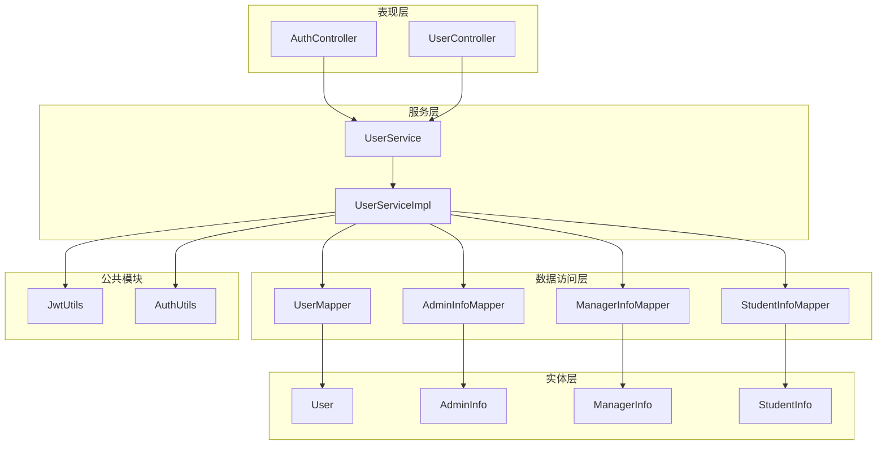
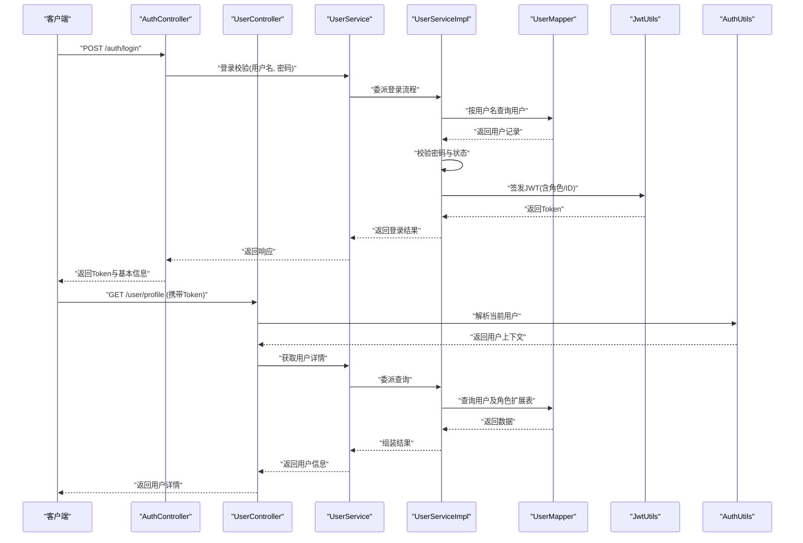
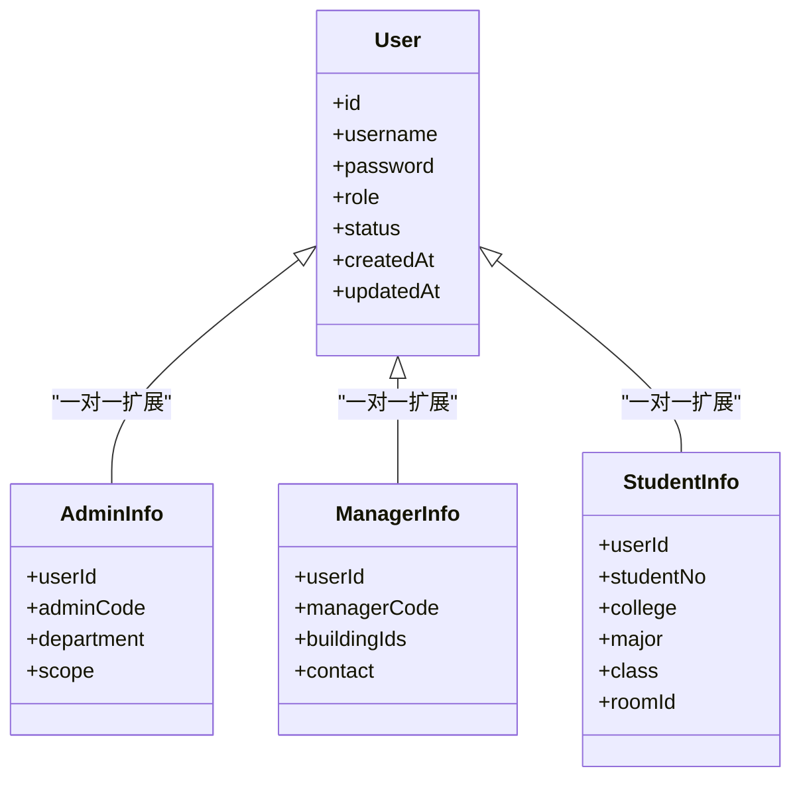
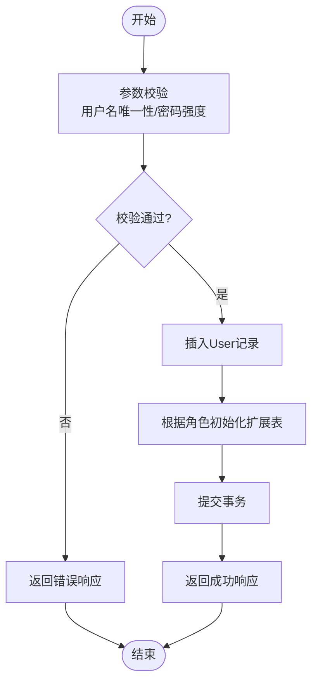
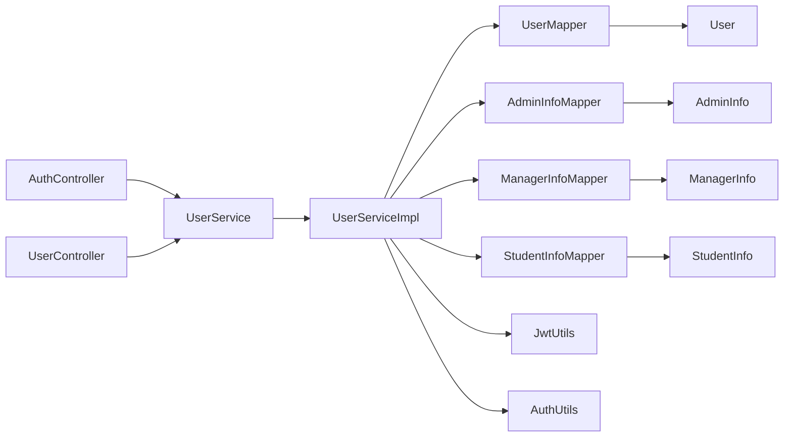

# 用户管理数据模型

<cite>
**本文引用的文件**   
- [User.java](file://backend/src/main/java/com/dorm/backend/entity/User.java)
- [AdminInfo.java](file://backend/src/main/java/com/dorm/backend/entity/AdminInfo.java)
- [ManagerInfo.java](file://backend/src/main/java/com/dorm/backend/entity/ManagerInfo.java)
- [StudentInfo.java](file://backend/src/main/java/com/dorm/backend/entity/StudentInfo.java)
- [UserMapper.java](file://backend/src/main/java/com/dorm/backend/mapper/UserMapper.java)
- [AdminInfoMapper.java](file://backend/src/main/java/com/dorm/backend/mapper/AdminInfoMapper.java)
- [ManagerInfoMapper.java](file://backend/src/main/java/com/dorm/backend/mapper/ManagerInfoMapper.java)
- [StudentInfoMapper.java](file://backend/src/main/java/com/dorm/backend/mapper/StudentInfoMapper.java)
- [UserServiceImpl.java](file://backend/src/main/java/com/dorm/backend/service/impl/UserServiceImpl.java)
- [UserService.java](file://backend/src/main/java/com/dorm/backend/service/UserService.java)
- [AuthController.java](file://backend/src/main/java/com/dorm/backend/controller/AuthController.java)
- [UserController.java](file://backend/src/main/java/com/dorm/backend/controller/UserController.java)
- [JwtUtils.java](file://backend/src/main/java/com/dorm/backend/common/JwtUtils.java)
- [AuthUtils.java](file://backend/src/main/java/com/dorm/backend/common/AuthUtils.java)
- [application.yml](file://backend/src/main/resources/application.yml)
- [schema.sql](file://backend/src/main/resources/schema.sql)
</cite>

## 目录
1. [引言](#引言)
2. [项目结构](#项目结构)
3. [核心组件](#核心组件)
4. [架构总览](#架构总览)
5. [详细组件分析](#详细组件分析)
6. [依赖关系分析](#依赖关系分析)
7. [性能考虑](#性能考虑)
8. [故障排查指南](#故障排查指南)
9. [结论](#结论)
10. [附录](#附录)

## 引言
本文件聚焦于宿舍管理系统中的“用户管理数据模型”，围绕 User、AdminInfo、ManagerInfo、StudentInfo 等实体类，系统阐述字段定义、数据类型与业务含义；解释管理员、宿管、学生三类角色的权限划分与数据隔离机制；说明认证相关字段（用户名、密码、状态等）的存储策略；梳理用户信息扩展表的设计思路与关联关系；总结用户数据的 CRUD 操作模式与查询优化方案；并给出用户数据迁移与版本管理的最佳实践。

## 项目结构
本项目采用典型的分层架构：
- 表现层：控制器（Controller）暴露 REST API，处理登录、用户管理等请求
- 服务层：接口与实现（Service/Impl）封装业务逻辑，协调 Mapper 与工具类
- 数据访问层：MyBatis Mapper 接口与 XML 映射，负责 SQL 执行
- 实体层：JPA/MyBatis 实体类（User、AdminInfo、ManagerInfo、StudentInfo）
- 公共模块：JWT、鉴权、结果封装、全局异常等

图表来源
- [AuthController.java](file://backend/src/main/java/com/dorm/backend/controller/AuthController.java)
- [UserController.java](file://backend/src/main/java/com/dorm/backend/controller/UserController.java)
- [UserService.java](file://backend/src/main/java/com/dorm/backend/service/UserService.java)
- [UserServiceImpl.java](file://backend/src/main/java/com/dorm/backend/service/impl/UserServiceImpl.java)
- [UserMapper.java](file://backend/src/main/java/com/dorm/backend/mapper/UserMapper.java)
- [AdminInfoMapper.java](file://backend/src/main/java/com/dorm/backend/mapper/AdminInfoMapper.java)
- [ManagerInfoMapper.java](file://backend/src/main/java/com/dorm/backend/mapper/ManagerInfoMapper.java)
- [StudentInfoMapper.java](file://backend/src/main/java/com/dorm/backend/mapper/StudentInfoMapper.java)
- [User.java](file://backend/src/main/java/com/dorm/backend/entity/User.java)
- [AdminInfo.java](file://backend/src/main/java/com/dorm/backend/entity/AdminInfo.java)
- [ManagerInfo.java](file://backend/src/main/java/com/dorm/backend/entity/ManagerInfo.java)
- [StudentInfo.java](file://backend/src/main/java/com/dorm/backend/entity/StudentInfo.java)
- [JwtUtils.java](file://backend/src/main/java/com/dorm/backend/common/JwtUtils.java)
- [AuthUtils.java](file://backend/src/main/java/com/dorm/backend/common/AuthUtils.java)

章节来源
- [application.yml](file://backend/src/main/resources/application.yml)
- [schema.sql](file://backend/src/main/resources/schema.sql)

## 核心组件
- 用户主表（User）：承载统一身份标识、登录名、密码、角色类型、状态、创建/更新时间等基础认证与生命周期字段
- 角色扩展表（AdminInfo、ManagerInfo、StudentInfo）：分别承载管理员、宿管、学生的专属属性，通过外键与 User 关联
- 数据访问层（UserMapper、AdminInfoMapper、ManagerInfoMapper、StudentInfoMapper）：提供按角色维度的增删改查与联合查询能力
- 服务层（UserService、UserServiceImpl）：封装用户注册、登录校验、角色数据初始化、CRUD 与权限控制逻辑
- 认证与安全（JwtUtils、AuthUtils）：JWT 签发与解析、当前用户上下文获取、角色判断

章节来源
- [User.java](file://backend/src/main/java/com/dorm/backend/entity/User.java)
- [AdminInfo.java](file://backend/src/main/java/com/dorm/backend/entity/AdminInfo.java)
- [ManagerInfo.java](file://backend/src/main/java/com/dorm/backend/entity/ManagerInfo.java)
- [StudentInfo.java](file://backend/src/main/java/com/dorm/backend/entity/StudentInfo.java)
- [UserMapper.java](file://backend/src/main/java/com/dorm/backend/mapper/UserMapper.java)
- [AdminInfoMapper.java](file://backend/src/main/java/com/dorm/backend/mapper/AdminInfoMapper.java)
- [ManagerInfoMapper.java](file://backend/src/main/java/com/dorm/backend/mapper/ManagerInfoMapper.java)
- [StudentInfoMapper.java](file://backend/src/main/java/com/dorm/backend/mapper/StudentInfoMapper.java)
- [UserService.java](file://backend/src/main/java/com/dorm/backend/service/UserService.java)
- [UserServiceImpl.java](file://backend/src/main/java/com/dorm/backend/service/impl/UserServiceImpl.java)
- [JwtUtils.java](file://backend/src/main/java/com/dorm/backend/common/JwtUtils.java)
- [AuthUtils.java](file://backend/src/main/java/com/dorm/backend/common/AuthUtils.java)

## 架构总览
下图展示用户认证与授权的关键调用链：客户端发起登录或受保护请求，控制器委托服务层进行认证与鉴权，服务层通过 Mapper 访问数据库，并使用 JWT 工具完成令牌签发与解析。

图表来源
- [AuthController.java](file://backend/src/main/java/com/dorm/backend/controller/AuthController.java)
- [UserController.java](file://backend/src/main/java/com/dorm/backend/controller/UserController.java)
- [UserService.java](file://backend/src/main/java/com/dorm/backend/service/UserService.java)
- [UserServiceImpl.java](file://backend/src/main/java/com/dorm/backend/service/impl/UserServiceImpl.java)
- [UserMapper.java](file://backend/src/main/java/com/dorm/backend/mapper/UserMapper.java)
- [JwtUtils.java](file://backend/src/main/java/com/dorm/backend/common/JwtUtils.java)
- [AuthUtils.java](file://backend/src/main/java/com/dorm/backend/common/AuthUtils.java)

## 详细组件分析

### 实体类与字段定义
- User（用户主表）
  - 关键字段：唯一标识、用户名、密码、角色类型、状态、创建时间、更新时间
  - 业务含义：统一身份入口，承载认证与生命周期管理；角色类型决定后续扩展表归属
  - 安全建议：密码需加密存储；状态字段用于启用/禁用控制；时间戳便于审计与排序
- AdminInfo（管理员扩展）
  - 关键字段：用户ID（外键）、管理员专属属性（如工号、部门、权限范围等）
  - 业务含义：管理员的职能与组织维度信息，支撑管理端功能的数据隔离
- ManagerInfo（宿管扩展）
  - 关键字段：用户ID（外键）、宿管专属属性（如负责楼栋/楼层、联系方式等）
  - 业务含义：宿管的管辖范围与联系信息，用于报修、访客、卫生检查等业务的数据过滤
- StudentInfo（学生扩展）
  - 关键字段：用户ID（外键）、学号、学院、专业、班级、宿舍房间等
  - 业务含义：学生的学籍与住宿信息，作为学生端数据隔离的核心依据

图表来源
- [User.java](file://backend/src/main/java/com/dorm/backend/entity/User.java)
- [AdminInfo.java](file://backend/src/main/java/com/dorm/backend/entity/AdminInfo.java)
- [ManagerInfo.java](file://backend/src/main/java/com/dorm/backend/entity/ManagerInfo.java)
- [StudentInfo.java](file://backend/src/main/java/com/dorm/backend/entity/StudentInfo.java)

章节来源
- [User.java](file://backend/src/main/java/com/dorm/backend/entity/User.java)
- [AdminInfo.java](file://backend/src/main/java/com/dorm/backend/entity/AdminInfo.java)
- [ManagerInfo.java](file://backend/src/main/java/com/dorm/backend/entity/ManagerInfo.java)
- [StudentInfo.java](file://backend/src/main/java/com/dorm/backend/entity/StudentInfo.java)

### 角色体系与权限划分
- 角色类型
  - 管理员（ADMIN）：具备系统级管理能力，可跨部门、跨楼栋操作
  - 宿管（MANAGER）：仅能操作其管辖范围内的楼栋/房间与学生数据
  - 学生（STUDENT）：仅能查看与操作本人相关的数据（如个人报修、访客、费用等）
- 权限控制
  - 基于角色（RBAC）在控制器或服务层进行方法级校验
  - 数据隔离通过用户上下文（AuthUtils）与查询条件（如 userId、buildingId、roomId）实现
- 数据隔离机制
  - 管理员：无限制或按组织范围过滤
  - 宿管：按负责楼栋/房间集合过滤
  - 学生：强制限定为本人 userId

章节来源
- [AuthUtils.java](file://backend/src/main/java/com/dorm/backend/common/AuthUtils.java)
- [UserServiceImpl.java](file://backend/src/main/java/com/dorm/backend/service/impl/UserServiceImpl.java)
- [UserController.java](file://backend/src/main/java/com/dorm/backend/controller/UserController.java)

### 认证相关字段存储策略
- 用户名（username）：唯一索引，用于登录识别
- 密码（password）：使用强哈希算法（如 BCrypt）加密存储，禁止明文保存
- 状态（status）：启用/禁用标志，登录时校验是否可用
- 角色（role）：枚举值，决定扩展表与权限范围
- 时间戳（createdAt/updatedAt）：审计与排序，支持软删除扩展

章节来源
- [User.java](file://backend/src/main/java/com/dorm/backend/entity/User.java)
- [application.yml](file://backend/src/main/resources/application.yml)

### 用户信息扩展表设计与关联关系
- 设计思路
  - 将通用认证信息与角色专属信息解耦，提升扩展性与可读性
  - 通过 userId 建立一对一关联，保证数据一致性
- 关联关系
  - User.id = AdminInfo.userId
  - User.id = ManagerInfo.userId
  - User.id = StudentInfo.userId
- 查询优化
  - 常用查询使用 JOIN 一次性加载用户与扩展信息
  - 对高频过滤字段（如 studentNo、buildingId、roomId）建立索引

章节来源
- [UserMapper.java](file://backend/src/main/java/com/dorm/backend/mapper/UserMapper.java)
- [AdminInfoMapper.java](file://backend/src/main/java/com/dorm/backend/mapper/AdminInfoMapper.java)
- [ManagerInfoMapper.java](file://backend/src/main/java/com/dorm/backend/mapper/ManagerInfoMapper.java)
- [StudentInfoMapper.java](file://backend/src/main/java/com/dorm/backend/mapper/StudentInfoMapper.java)

### 用户数据 CRU D 操作模式
- 创建（Create）
  - 注册新用户：插入 User，并根据 role 初始化对应扩展表记录
  - 校验用户名唯一性、密码强度、必填字段完整性
- 读取（Read）
  - 按 ID/用户名查询用户与扩展信息
  - 列表查询支持分页、排序、多条件过滤（角色、状态、关键字）
- 更新（Update）
  - 修改用户基本信息与扩展信息，注意事务一致性
  - 敏感字段（如密码）需二次确认与加密
- 删除（Delete）
  - 推荐软删除（标记 status=禁用），保留审计轨迹
  - 级联清理或归档策略需在业务层明确

图表来源
- [UserServiceImpl.java](file://backend/src/main/java/com/dorm/backend/service/impl/UserServiceImpl.java)
- [UserMapper.java](file://backend/src/main/java/com/dorm/backend/mapper/UserMapper.java)
- [AdminInfoMapper.java](file://backend/src/main/java/com/dorm/backend/mapper/AdminInfoMapper.java)
- [ManagerInfoMapper.java](file://backend/src/main/java/com/dorm/backend/mapper/ManagerInfoMapper.java)
- [StudentInfoMapper.java](file://backend/src/main/java/com/dorm/backend/mapper/StudentInfoMapper.java)

章节来源
- [UserServiceImpl.java](file://backend/src/main/java/com/dorm/backend/service/impl/UserServiceImpl.java)
- [UserMapper.java](file://backend/src/main/java/com/dorm/backend/mapper/UserMapper.java)

### 查询优化方案
- 索引策略
  - 对 username、studentNo、buildingId、roomId 等高频过滤字段建立索引
  - 复合索引覆盖常见查询组合（如 buildingId + status）
- 查询方式
  - 使用 JOIN 减少往返次数，避免 N+1 问题
  - 分页查询使用 LIMIT/OFFSET 或游标分页
- 缓存策略
  - 热点用户信息（如当前登录用户）可短期缓存
  - 字典类数据（角色、状态）可集中缓存

章节来源
- [UserMapper.java](file://backend/src/main/java/com/dorm/backend/mapper/UserMapper.java)
- [application.yml](file://backend/src/main/resources/application.yml)

### 用户数据迁移与版本管理最佳实践
- 版本化脚本
  - 使用 schema.sql 或迁移工具（如 Flyway/Liquibase）管理数据库变更
  - 每次变更附带版本号与回滚脚本
- 增量更新
  - 新增字段默认值与兼容性处理
  - 数据清洗脚本在上线前执行并验证
- 灰度发布
  - 先在小范围环境验证迁移脚本
  - 监控关键指标（错误率、慢查询）

章节来源
- [schema.sql](file://backend/src/main/resources/schema.sql)

## 依赖关系分析
用户模块依赖关系如下：
- Controller 依赖 Service
- Service 依赖 Mapper 与工具类（JwtUtils、AuthUtils）
- Mapper 依赖实体类与数据库
- 实体类之间通过 userId 建立一对一关联

图表来源
- [AuthController.java](file://backend/src/main/java/com/dorm/backend/controller/AuthController.java)
- [UserController.java](file://backend/src/main/java/com/dorm/backend/controller/UserController.java)
- [UserService.java](file://backend/src/main/java/com/dorm/backend/service/UserService.java)
- [UserServiceImpl.java](file://backend/src/main/java/com/dorm/backend/service/impl/UserServiceImpl.java)
- [UserMapper.java](file://backend/src/main/java/com/dorm/backend/mapper/UserMapper.java)
- [AdminInfoMapper.java](file://backend/src/main/java/com/dorm/backend/mapper/AdminInfoMapper.java)
- [ManagerInfoMapper.java](file://backend/src/main/java/com/dorm/backend/mapper/ManagerInfoMapper.java)
- [StudentInfoMapper.java](file://backend/src/main/java/com/dorm/backend/mapper/StudentInfoMapper.java)
- [User.java](file://backend/src/main/java/com/dorm/backend/entity/User.java)
- [AdminInfo.java](file://backend/src/main/java/com/dorm/backend/entity/AdminInfo.java)
- [ManagerInfo.java](file://backend/src/main/java/com/dorm/backend/entity/ManagerInfo.java)
- [StudentInfo.java](file://backend/src/main/java/com/dorm/backend/entity/StudentInfo.java)
- [JwtUtils.java](file://backend/src/main/java/com/dorm/backend/common/JwtUtils.java)
- [AuthUtils.java](file://backend/src/main/java/com/dorm/backend/common/AuthUtils.java)

章节来源
- [application.yml](file://backend/src/main/resources/application.yml)

## 性能考虑
- 数据库层面
  - 合理索引与查询计划审查
  - 避免全表扫描与大结果集传输
- 应用层面
  - 减少不必要的对象转换与重复查询
  - 使用批量操作降低 I/O 开销
- 缓存层面
  - 热点数据短 TTL 缓存
  - 分布式场景下注意缓存一致性与失效策略

[本节为通用指导，不直接分析具体文件]

## 故障排查指南
- 登录失败
  - 检查用户名是否存在、密码是否正确、用户状态是否启用
  - 查看 JWT 签发与解析日志
- 权限不足
  - 核对用户角色与目标资源的数据隔离条件
  - 检查 AuthUtils 中当前用户上下文是否正确注入
- 数据不一致
  - 检查事务边界与回滚策略
  - 核查扩展表初始化逻辑与外键约束

章节来源
- [AuthController.java](file://backend/src/main/java/com/dorm/backend/controller/AuthController.java)
- [UserServiceImpl.java](file://backend/src/main/java/com/dorm/backend/service/impl/UserServiceImpl.java)
- [JwtUtils.java](file://backend/src/main/java/com/dorm/backend/common/JwtUtils.java)
- [AuthUtils.java](file://backend/src/main/java/com/dorm/backend/common/AuthUtils.java)

## 结论
本数据模型以 User 为核心，结合角色扩展表实现灵活的角色体系与数据隔离。通过清晰的层次结构与统一的认证授权机制，保障了系统的可扩展性与安全性。建议在开发过程中持续优化索引与查询，完善迁移脚本与监控告警，确保系统在规模增长下的稳定性与性能。

[本节为总结性内容，不直接分析具体文件]

## 附录
- 字段命名规范：统一使用小驼峰，时间字段使用 createdAt/updatedAt
- 状态枚举：建议使用明确的枚举类型，避免魔法值
- 审计要求：所有写操作记录操作人与时间，便于追溯

[本节为补充说明，不直接分析具体文件]