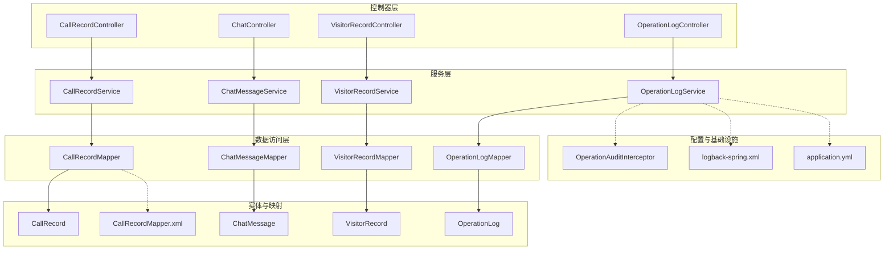
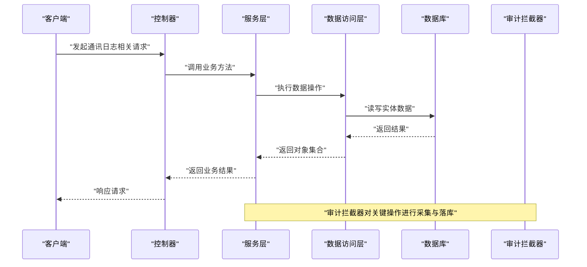
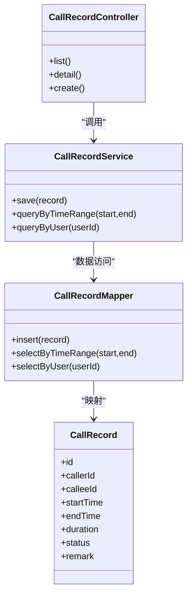
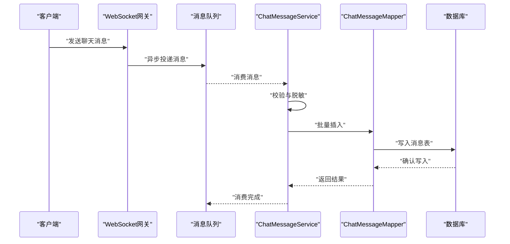
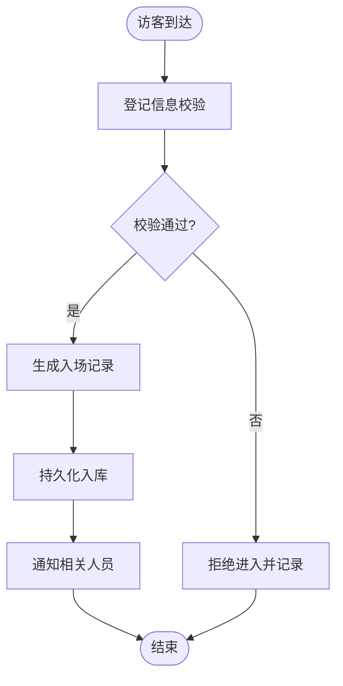
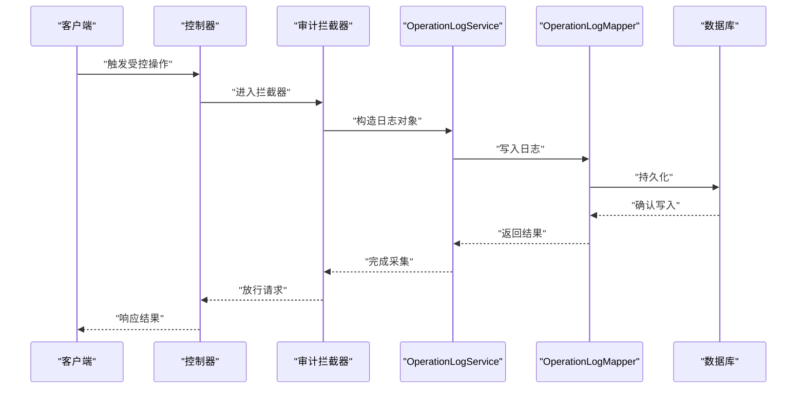
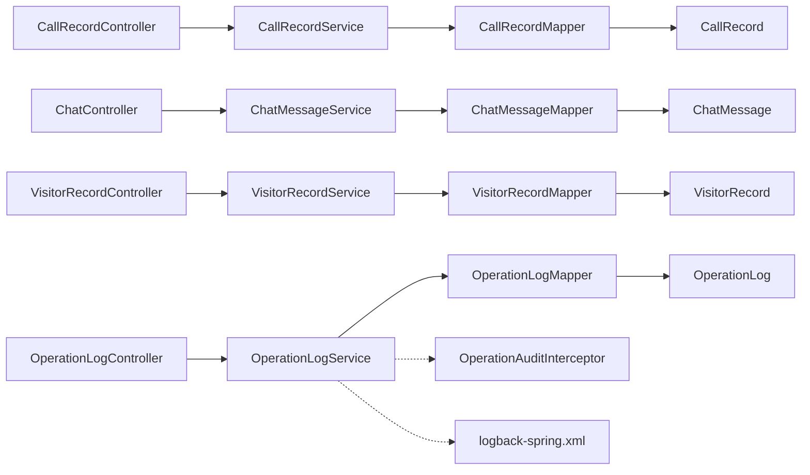

# 通讯日志数据模型

<cite>
**本文引用的文件**   
- [CallRecord.java](file://backend/src/main/java/com/dorm/backend/entity/CallRecord.java)
- [ChatMessage.java](file://backend/src/main/java/com/dorm/backend/entity/ChatMessage.java)
- [VisitorRecord.java](file://backend/src/main/java/com/dorm/backend/entity/VisitorRecord.java)
- [OperationLog.java](file://backend/src/main/java/com/dorm/backend/entity/OperationLog.java)
- [CallRecordController.java](file://backend/src/main/java/com/dorm/backend/controller/CallRecordController.java)
- [ChatController.java](file://backend/src/main/java/com/dorm/backend/controller/ChatController.java)
- [VisitorRecordController.java](file://backend/src/main/java/com/dorm/backend/controller/VisitorRecordController.java)
- [OperationLogController.java](file://backend/src/main/java/com/dorm/backend/controller/OperationLogController.java)
- [CallRecordService.java](file://backend/src/main/java/com/dorm/backend/service/CallRecordService.java)
- [ChatMessageService.java](file://backend/src/main/java/com/dorm/backend/service/ChatMessageService.java)
- [VisitorRecordService.java](file://backend/src/main/java/com/dorm/backend/service/VisitorRecordService.java)
- [OperationLogService.java](file://backend/src/main/java/com/dorm/backend/service/OperationLogService.java)
- [CallRecordServiceImpl.java](file://backend/src/main/java/com/dorm/backend/service/impl/CallRecordServiceImpl.java)
- [ChatMessageServiceImpl.java](file://backend/src/main/java/com/dorm/backend/service/impl/ChatMessageServiceImpl.java)
- [VisitorRecordServiceImpl.java](file://backend/src/main/java/com/dorm/backend/service/impl/VisitorRecordServiceImpl.java)
- [OperationLogServiceImpl.java](file://backend/src/main/java/com/dorm/backend/service/impl/OperationLogServiceImpl.java)
- [CallRecordMapper.java](file://backend/src/main/java/com/dorm/backend/mapper/CallRecordMapper.java)
- [ChatMessageMapper.java](file://backend/src/main/java/com/dorm/backend/mapper/ChatMessageMapper.java)
- [VisitorRecordMapper.java](file://backend/src/main/java/com/dorm/backend/mapper/VisitorRecordMapper.java)
- [OperationLogMapper.java](file://backend/src/main/java/com/dorm/backend/mapper/OperationLogMapper.java)
- [CallRecordMapper.xml](file://backend/src/main/resources/mapper/CallRecordMapper.xml)
- [schema.sql](file://backend/src/main/resources/schema.sql)
- [logback-spring.xml](file://backend/src/main/resources/logback-spring.xml)
- [application.yml](file://backend/src/main/resources/application.yml)
- [ApplicationAuditInterceptor.java](file://backend/src/main/java/com/dorm/backend/config/OperationAuditInterceptor.java)
</cite>

## 目录
1. [引言](#引言)
2. [项目结构](#项目结构)
3. [核心组件](#核心组件)
4. [架构总览](#架构总览)
5. [详细组件分析](#详细组件分析)
6. [依赖关系分析](#依赖关系分析)
7. [性能考虑](#性能考虑)
8. [故障排查指南](#故障排查指南)
9. [结论](#结论)
10. [附录](#附录)

## 引言
本文件围绕宿舍管理系统的“通讯日志数据模型”进行系统化说明，重点覆盖以下实体与能力：
- CallRecord（通话记录）：用于记录学生或管理员的通话事件，支持查询、统计与审计。
- ChatMessage（聊天消息）：用于持久化系统内聊天消息，支撑实时通讯的历史回溯与合规审计。
- VisitorRecord（访客记录）：用于记录访客出入信息，支撑访客管理与安全审计。
- OperationLog（操作日志）：用于采集系统关键操作的审计日志，支撑合规与安全追溯。

文档将阐述各实体的设计目的、存储策略、实时消息持久化方案、消息队列集成思路、访客出入与安全审计流程、操作日志采集规则与查询优化，以及大规模日志数据的分片与归档策略和隐私合规处理方案。

## 项目结构
后端采用分层架构：Controller 暴露 REST API，Service 封装业务逻辑，Mapper 负责数据访问，Entity 定义数据模型，XML 提供 SQL 映射，配置文件管理运行时行为。日志与审计通过拦截器与日志框架实现。

图表来源
- [CallRecordController.java](file://backend/src/main/java/com/dorm/backend/controller/CallRecordController.java)
- [ChatController.java](file://backend/src/main/java/com/dorm/backend/controller/ChatController.java)
- [VisitorRecordController.java](file://backend/src/main/java/com/dorm/backend/controller/VisitorRecordController.java)
- [OperationLogController.java](file://backend/src/main/java/com/dorm/backend/controller/OperationLogController.java)
- [CallRecordService.java](file://backend/src/main/java/com/dorm/backend/service/CallRecordService.java)
- [ChatMessageService.java](file://backend/src/main/java/com/dorm/backend/service/ChatMessageService.java)
- [VisitorRecordService.java](file://backend/src/main/java/com/dorm/backend/service/VisitorRecordService.java)
- [OperationLogService.java](file://backend/src/main/java/com/dorm/backend/service/OperationLogService.java)
- [CallRecordMapper.java](file://backend/src/main/java/com/dorm/backend/mapper/CallRecordMapper.java)
- [ChatMessageMapper.java](file://backend/src/main/java/com/dorm/backend/mapper/ChatMessageMapper.java)
- [VisitorRecordMapper.java](file://backend/src/main/java/com/dorm/backend/mapper/VisitorRecordMapper.java)
- [OperationLogMapper.java](file://backend/src/main/java/com/dorm/backend/mapper/OperationLogMapper.java)
- [CallRecordMapper.xml](file://backend/src/main/resources/mapper/CallRecordMapper.xml)
- [application.yml](file://backend/src/main/resources/application.yml)
- [logback-spring.xml](file://backend/src/main/resources/logback-spring.xml)
- [OperationAuditInterceptor.java](file://backend/src/main/java/com/dorm/backend/config/OperationAuditInterceptor.java)

章节来源
- [CallRecordController.java](file://backend/src/main/java/com/dorm/backend/controller/CallRecordController.java)
- [ChatController.java](file://backend/src/main/java/com/dorm/backend/controller/ChatController.java)
- [VisitorRecordController.java](file://backend/src/main/java/com/dorm/backend/controller/VisitorRecordController.java)
- [OperationLogController.java](file://backend/src/main/java/com/dorm/backend/controller/OperationLogController.java)
- [application.yml](file://backend/src/main/resources/application.yml)
- [logback-spring.xml](file://backend/src/main/resources/logback-spring.xml)

## 核心组件
本节聚焦四个核心实体及其在系统中的职责与交互方式：
- CallRecord：记录通话事件（如主被叫、时间、时长、状态等），便于事后查询与统计。
- ChatMessage：记录聊天消息内容、发送者、接收者、时间戳、类型等，支撑历史回溯与审计。
- VisitorRecord：记录访客进出信息（如访客身份、关联人员、进出时间、事由等），支撑访客管理与安全审计。
- OperationLog：记录系统关键操作（如用户登录、权限变更、数据修改等），支撑合规审计与问题定位。

章节来源
- [CallRecord.java](file://backend/src/main/java/com/dorm/backend/entity/CallRecord.java)
- [ChatMessage.java](file://backend/src/main/java/com/dorm/backend/entity/ChatMessage.java)
- [VisitorRecord.java](file://backend/src/main/java/com/dorm/backend/entity/VisitorRecord.java)
- [OperationLog.java](file://backend/src/main/java/com/dorm/backend/entity/OperationLog.java)

## 架构总览
下图展示了从请求进入控制器到服务层、数据访问层及数据库的完整调用链路，并标注了审计拦截器的介入点。

图表来源
- [CallRecordController.java](file://backend/src/main/java/com/dorm/backend/controller/CallRecordController.java)
- [ChatController.java](file://backend/src/main/java/com/dorm/backend/controller/ChatController.java)
- [VisitorRecordController.java](file://backend/src/main/java/com/dorm/backend/controller/VisitorRecordController.java)
- [OperationLogController.java](file://backend/src/main/java/com/dorm/backend/controller/OperationLogController.java)
- [CallRecordService.java](file://backend/src/main/java/com/dorm/backend/service/CallRecordService.java)
- [ChatMessageService.java](file://backend/src/main/java/com/dorm/backend/service/ChatMessageService.java)
- [VisitorRecordService.java](file://backend/src/main/java/com/dorm/backend/service/VisitorRecordService.java)
- [OperationLogService.java](file://backend/src/main/java/com/dorm/backend/service/OperationLogService.java)
- [CallRecordMapper.java](file://backend/src/main/java/com/dorm/backend/mapper/CallRecordMapper.java)
- [ChatMessageMapper.java](file://backend/src/main/java/com/dorm/backend/mapper/ChatMessageMapper.java)
- [VisitorRecordMapper.java](file://backend/src/main/java/com/dorm/backend/mapper/VisitorRecordMapper.java)
- [OperationLogMapper.java](file://backend/src/main/java/com/dorm/backend/mapper/OperationLogMapper.java)
- [OperationAuditInterceptor.java](file://backend/src/main/java/com/dorm/backend/config/OperationAuditInterceptor.java)

## 详细组件分析

### CallRecord（通话记录）
- 设计目的：记录通话事件，便于事后查询、统计与审计；为客服或宿管提供通话溯源能力。
- 存储策略：以关系型表存储，包含主键、关联用户、通话时间、时长、状态等字段；可通过日期范围、用户维度进行高效查询。
- 数据流：控制器接收请求 -> 服务层校验与组装 -> 数据访问层写入/读取 -> 数据库持久化。
- 查询优化：建议对通话时间、用户ID建立索引；分页查询避免全表扫描。

图表来源
- [CallRecord.java](file://backend/src/main/java/com/dorm/backend/entity/CallRecord.java)
- [CallRecordController.java](file://backend/src/main/java/com/dorm/backend/controller/CallRecordController.java)
- [CallRecordService.java](file://backend/src/main/java/com/dorm/backend/service/CallRecordService.java)
- [CallRecordMapper.java](file://backend/src/main/java/com/dorm/backend/mapper/CallRecordMapper.java)
- [CallRecordMapper.xml](file://backend/src/main/resources/mapper/CallRecordMapper.xml)

章节来源
- [CallRecord.java](file://backend/src/main/java/com/dorm/backend/entity/CallRecord.java)
- [CallRecordController.java](file://backend/src/main/java/com/dorm/backend/controller/CallRecordController.java)
- [CallRecordService.java](file://backend/src/main/java/com/dorm/backend/service/CallRecordService.java)
- [CallRecordMapper.java](file://backend/src/main/java/com/dorm/backend/mapper/CallRecordMapper.java)
- [CallRecordMapper.xml](file://backend/src/main/resources/mapper/CallRecordMapper.xml)

### ChatMessage（聊天消息）
- 设计目的：持久化聊天消息，支撑历史回溯、审计与合规检查；为实时通讯提供可靠的数据基础。
- 存储策略：消息体可较大，建议按时间分表或分区；关键字段（发送者、接收者、时间戳、类型）建立索引；敏感内容脱敏存储。
- 实时持久化方案：消息到达后先入内存队列（或消息中间件），再由消费者批量写入数据库，保证高吞吐与一致性。
- 查询优化：按会话ID与时间范围查询；分页加载；冷热分离（近期热数据快速访问，历史数据归档）。

图表来源
- [ChatMessage.java](file://backend/src/main/java/com/dorm/backend/entity/ChatMessage.java)
- [ChatController.java](file://backend/src/main/java/com/dorm/backend/controller/ChatController.java)
- [ChatMessageService.java](file://backend/src/main/java/com/dorm/backend/service/ChatMessageService.java)
- [ChatMessageMapper.java](file://backend/src/main/java/com/dorm/backend/mapper/ChatMessageMapper.java)

章节来源
- [ChatMessage.java](file://backend/src/main/java/com/dorm/backend/entity/ChatMessage.java)
- [ChatController.java](file://backend/src/main/java/com/dorm/backend/controller/ChatController.java)
- [ChatMessageService.java](file://backend/src/main/java/com/dorm/backend/service/ChatMessageService.java)
- [ChatMessageMapper.java](file://backend/src/main/java/com/dorm/backend/mapper/ChatMessageMapper.java)

### VisitorRecord（访客记录）
- 设计目的：记录访客出入信息，支撑访客管理与安全审计；便于追踪异常访问与事件复盘。
- 存储策略：包含访客身份、关联人员、进出时间、事由、状态等；按日期与房间/楼栋维度查询。
- 安全审计：出入记录需不可篡改（追加为主），必要时结合数字签名或哈希链增强防篡改能力。
- 查询优化：对进出时间、访客ID、关联人员ID建立索引；支持按时间段与地点聚合统计。

图表来源
- [VisitorRecord.java](file://backend/src/main/java/com/dorm/backend/entity/VisitorRecord.java)
- [VisitorRecordController.java](file://backend/src/main/java/com/dorm/backend/controller/VisitorRecordController.java)
- [VisitorRecordService.java](file://backend/src/main/java/com/dorm/backend/service/VisitorRecordService.java)
- [VisitorRecordMapper.java](file://backend/src/main/java/com/dorm/backend/mapper/VisitorRecordMapper.java)

章节来源
- [VisitorRecord.java](file://backend/src/main/java/com/dorm/backend/entity/VisitorRecord.java)
- [VisitorRecordController.java](file://backend/src/main/java/com/dorm/backend/controller/VisitorRecordController.java)
- [VisitorRecordService.java](file://backend/src/main/java/com/dorm/backend/service/VisitorRecordService.java)
- [VisitorRecordMapper.java](file://backend/src/main/java/com/dorm/backend/mapper/VisitorRecordMapper.java)

### OperationLog（操作日志）
- 设计目的：采集系统关键操作，支撑合规审计、问题定位与责任追溯。
- 采集规则：通过拦截器统一采集（如登录、权限变更、数据修改），记录操作人、IP、时间、模块、动作、参数摘要、结果状态等。
- 存储格式：结构化JSON或固定字段表，便于检索与分析；敏感字段脱敏存储。
- 查询优化：按时间范围、操作人、模块、结果状态筛选；分页与排序优化；冷热数据分离与归档。

图表来源
- [OperationLog.java](file://backend/src/main/java/com/dorm/backend/entity/OperationLog.java)
- [OperationLogController.java](file://backend/src/main/java/com/dorm/backend/controller/OperationLogController.java)
- [OperationLogService.java](file://backend/src/main/java/com/dorm/backend/service/OperationLogService.java)
- [OperationLogMapper.java](file://backend/src/main/java/com/dorm/backend/mapper/OperationLogMapper.java)
- [OperationAuditInterceptor.java](file://backend/src/main/java/com/dorm/backend/config/OperationAuditInterceptor.java)

章节来源
- [OperationLog.java](file://backend/src/main/java/com/dorm/backend/entity/OperationLog.java)
- [OperationLogController.java](file://backend/src/main/java/com/dorm/backend/controller/OperationLogController.java)
- [OperationLogService.java](file://backend/src/main/java/com/dorm/backend/service/OperationLogService.java)
- [OperationLogMapper.java](file://backend/src/main/java/com/dorm/backend/mapper/OperationLogMapper.java)
- [OperationAuditInterceptor.java](file://backend/src/main/java/com/dorm/backend/config/OperationAuditInterceptor.java)

## 依赖关系分析
- 控制器与服务层解耦：每个功能域有独立的 Controller 与 Service，职责清晰。
- 数据访问抽象：Mapper 接口与 XML 映射分离，便于维护与扩展。
- 审计与日志：通过拦截器与日志框架统一采集，降低业务侵入性。
- 外部依赖：数据库（MySQL）、可选的消息队列（Kafka/RabbitMQ）、日志框架（Logback）。

图表来源
- [CallRecordController.java](file://backend/src/main/java/com/dorm/backend/controller/CallRecordController.java)
- [ChatController.java](file://backend/src/main/java/com/dorm/backend/controller/ChatController.java)
- [VisitorRecordController.java](file://backend/src/main/java/com/dorm/backend/controller/VisitorRecordController.java)
- [OperationLogController.java](file://backend/src/main/java/com/dorm/backend/controller/OperationLogController.java)
- [CallRecordService.java](file://backend/src/main/java/com/dorm/backend/service/CallRecordService.java)
- [ChatMessageService.java](file://backend/src/main/java/com/dorm/backend/service/ChatMessageService.java)
- [VisitorRecordService.java](file://backend/src/main/java/com/dorm/backend/service/VisitorRecordService.java)
- [OperationLogService.java](file://backend/src/main/java/com/dorm/backend/service/OperationLogService.java)
- [CallRecordMapper.java](file://backend/src/main/java/com/dorm/backend/mapper/CallRecordMapper.java)
- [ChatMessageMapper.java](file://backend/src/main/java/com/dorm/backend/mapper/ChatMessageMapper.java)
- [VisitorRecordMapper.java](file://backend/src/main/java/com/dorm/backend/mapper/VisitorRecordMapper.java)
- [OperationLogMapper.java](file://backend/src/main/java/com/dorm/backend/mapper/OperationLogMapper.java)
- [OperationAuditInterceptor.java](file://backend/src/main/java/com/dorm/backend/config/OperationAuditInterceptor.java)
- [logback-spring.xml](file://backend/src/main/resources/logback-spring.xml)

章节来源
- [CallRecordController.java](file://backend/src/main/java/com/dorm/backend/controller/CallRecordController.java)
- [ChatController.java](file://backend/src/main/java/com/dorm/backend/controller/ChatController.java)
- [VisitorRecordController.java](file://backend/src/main/java/com/dorm/backend/controller/VisitorRecordController.java)
- [OperationLogController.java](file://backend/src/main/java/com/dorm/backend/controller/OperationLogController.java)
- [OperationAuditInterceptor.java](file://backend/src/main/java/com/dorm/backend/config/OperationAuditInterceptor.java)
- [logback-spring.xml](file://backend/src/main/resources/logback-spring.xml)

## 性能考虑
- 索引设计：为高频查询字段（时间、用户ID、会话ID、访客ID）建立合适索引，避免全表扫描。
- 分页与限流：所有列表接口必须分页；对写热点接口增加限流保护。
- 批量写入：消息与日志采用批量插入减少事务开销。
- 冷热分离：近期数据放热表，历史数据归档至冷表或对象存储。
- 异步处理：消息持久化与日志采集走异步通道，提升响应速度。
- 连接池与缓存：合理配置数据库连接池；对热点查询使用缓存（如Redis）。

[本节为通用性能指导，不直接分析具体文件]

## 故障排查指南
- 日志查看：通过日志框架输出级别与滚动策略定位问题；关注错误堆栈与审计日志。
- 数据库慢查询：开启慢查询日志，分析执行计划与索引命中情况。
- 消息堆积：监控消息队列积压，调整消费者并发与批大小。
- 审计缺失：检查拦截器是否生效，确认受控操作是否纳入采集范围。
- 数据不一致：核对事务边界与重试机制，确保最终一致性。

章节来源
- [logback-spring.xml](file://backend/src/main/resources/logback-spring.xml)
- [application.yml](file://backend/src/main/resources/application.yml)
- [OperationAuditInterceptor.java](file://backend/src/main/java/com/dorm/backend/config/OperationAuditInterceptor.java)

## 结论
通过对 CallRecord、ChatMessage、VisitorRecord、OperationLog 四大实体的设计与实现分析，本系统在通讯日志方面具备完善的持久化、审计与查询能力。结合索引优化、异步处理、冷热分离与归档策略，可在高吞吐场景下保持良好性能与稳定性。同时，隐私保护与合规措施贯穿数据采集、存储与查询全流程，满足审计与监管要求。

[本节为总结性内容，不直接分析具体文件]

## 附录

### 分片存储与归档策略
- 分片策略：按时间（月/季度）或业务维度（用户/会话）进行水平分表；路由键选择均匀分布且查询友好。
- 归档流程：定期将过期数据迁移至归档表或对象存储；保留元数据以便检索。
- 恢复策略：归档数据支持按需回迁；建立校验与完整性检查机制。

[本节为概念性说明，不直接分析具体文件]

### 隐私保护与合规处理
- 最小化采集：仅采集必要字段，避免过度收集个人信息。
- 脱敏与加密：对敏感字段（手机号、身份证号、聊天内容）进行脱敏或加密存储。
- 访问控制：基于角色的访问控制（RBAC），限制敏感数据访问范围。
- 留存周期：设定合理的留存期限，到期自动清理或匿名化处理。
- 审计追踪：所有访问与导出操作均记录审计日志，便于追溯。

[本节为概念性说明，不直接分析具体文件]