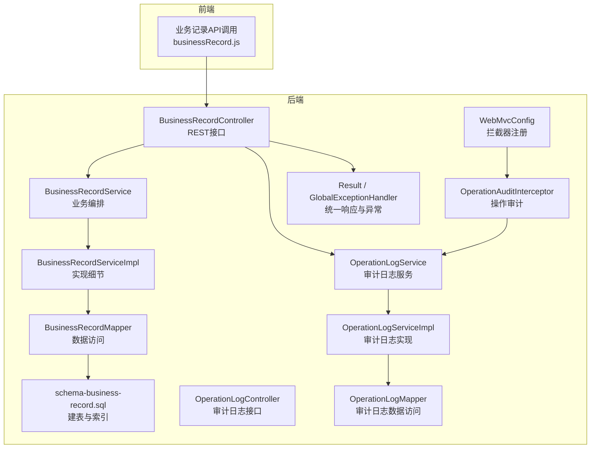
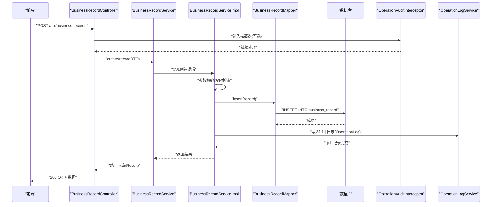
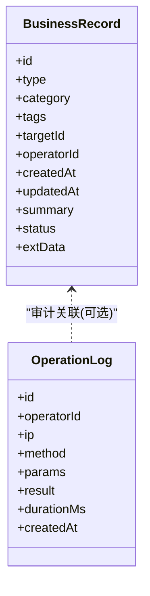
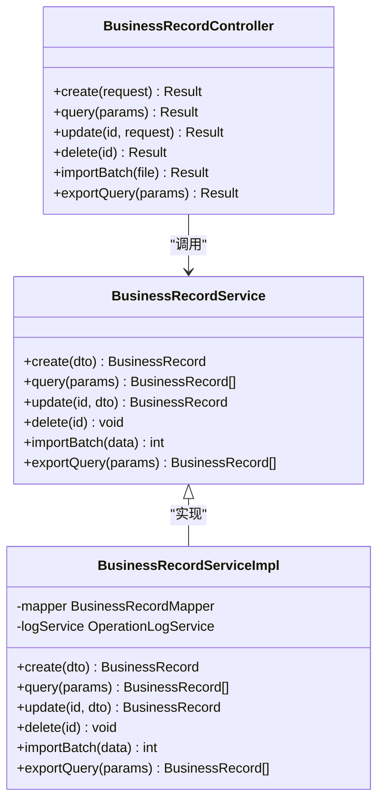
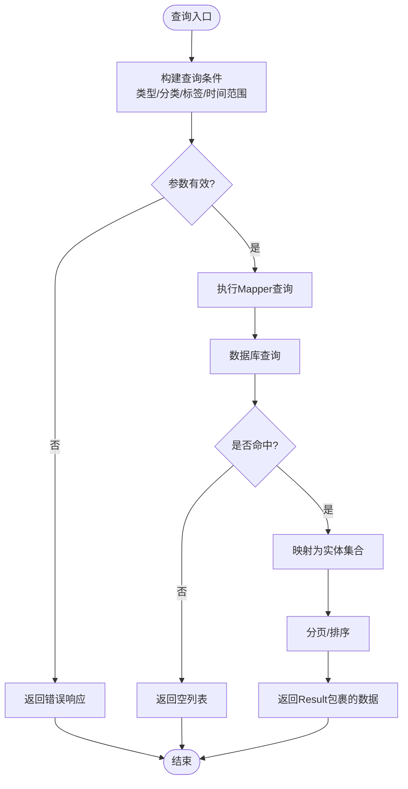
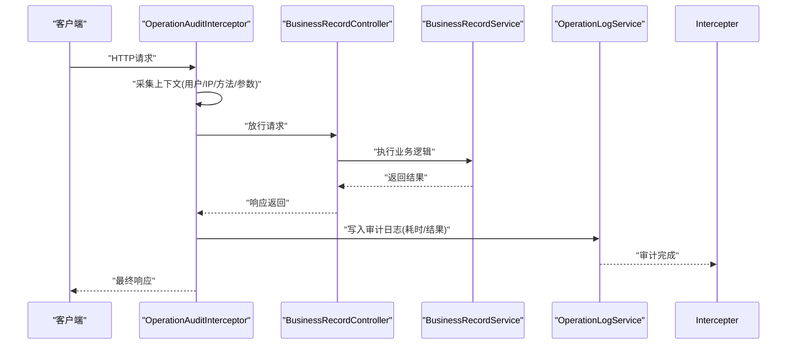
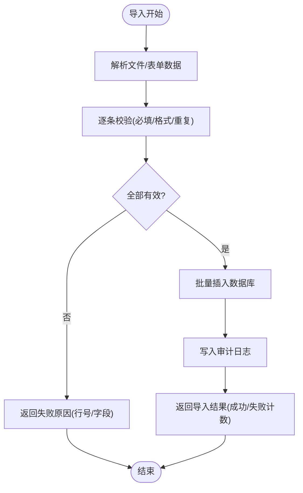
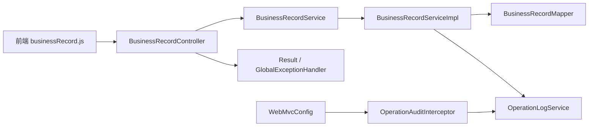

# 业务记录模块

<cite>
**本文引用的文件**   
- [BusinessRecord.java](file://backend/src/main/java/com/dorm/backend/entity/BusinessRecord.java)
- [BusinessRecordController.java](file://backend/src/main/java/com/dorm/backend/controller/BusinessRecordController.java)
- [BusinessRecordService.java](file://backend/src/main/java/com/dorm/backend/service/BusinessRecordService.java)
- [BusinessRecordServiceImpl.java](file://backend/src/main/java/com/dorm/backend/service/impl/BusinessRecordServiceImpl.java)
- [BusinessRecordMapper.java](file://backend/src/main/java/com/dorm/backend/mapper/BusinessRecordMapper.java)
- [schema-business-record.sql](file://backend/src/main/resources/schema-business-record.sql)
- [OperationLog.java](file://backend/src/main/java/com/dorm/backend/entity/OperationLog.java)
- [OperationLogController.java](file://backend/src/main/java/com/dorm/backend/controller/OperationLogController.java)
- [OperationLogService.java](file://backend/src/main/java/com/dorm/backend/service/OperationLogService.java)
- [OperationLogServiceImpl.java](file://backend/src/main/java/com/dorm/backend/service/impl/OperationLogServiceImpl.java)
- [OperationAuditInterceptor.java](file://backend/src/main/java/com/dorm/backend/config/OperationAuditInterceptor.java)
- [WebMvcConfig.java](file://backend/src/main/java/com/dorm/backend/config/WebMvcConfig.java)
- [Result.java](file://backend/src/main/java/com/dorm/backend/common/Result.java)
- [GlobalExceptionHandler.java](file://backend/src/main/java/com/dorm/backend/common/GlobalExceptionHandler.java)
- [businessRecord.js](file://frontend/src/api/businessRecord.js)
</cite>

## 目录
1. [简介](#简介)
2. [项目结构](#项目结构)
3. [核心组件](#核心组件)
4. [架构总览](#架构总览)
5. [详细组件分析](#详细组件分析)
6. [依赖关系分析](#依赖关系分析)
7. [性能考虑](#性能考虑)
8. [故障排查指南](#故障排查指南)
9. [结论](#结论)
10. [附录](#附录)

## 简介
本模块为宿舍管理系统提供统一的“业务记录”能力，用于对各类业务操作进行标准化记录、存储与查询。其目标包括：
- 统一记录：将跨模块的业务变更（如入住、报修、访客登记等）以统一模型持久化，便于审计与追溯。
- 数据模型与扩展：通过可扩展字段与分类标签体系，支持多类业务场景的灵活接入。
- 审计追踪与版本控制：结合操作日志与变更记录，形成可回溯的版本历史。
- 分类与检索：提供分类、标签与多维检索能力，提升查询效率与可用性。
- 批量导入导出与备份恢复：支持大批量数据的导入导出与数据库级备份恢复。
- 集成与事件驱动：与其他业务模块解耦集成，基于事件机制触发记录生成。
- 统计分析与可视化：提供报表与图表展示，辅助管理决策。
- API与扩展：提供REST接口与开发扩展指南，便于二次开发与集成。

## 项目结构
后端采用分层架构：控制器层暴露API，服务层封装业务逻辑，数据访问层通过MyBatis Mapper与SQL脚本交互；配置层包含拦截器与全局配置；通用组件提供统一响应与异常处理。前端通过API调用实现页面交互。

**图示来源** 
- [BusinessRecordController.java](file://backend/src/main/java/com/dorm/backend/controller/BusinessRecordController.java)
- [BusinessRecordService.java](file://backend/src/main/java/com/dorm/backend/service/BusinessRecordService.java)
- [BusinessRecordServiceImpl.java](file://backend/src/main/java/com/dorm/backend/service/impl/BusinessRecordServiceImpl.java)
- [BusinessRecordMapper.java](file://backend/src/main/java/com/dorm/backend/mapper/BusinessRecordMapper.java)
- [schema-business-record.sql](file://backend/src/main/resources/schema-business-record.sql)
- [WebMvcConfig.java](file://backend/src/main/java/com/dorm/backend/config/WebMvcConfig.java)
- [OperationAuditInterceptor.java](file://backend/src/main/java/com/dorm/backend/config/OperationAuditInterceptor.java)
- [OperationLogController.java](file://backend/src/main/java/com/dorm/backend/controller/OperationLogController.java)
- [OperationLogService.java](file://backend/src/main/java/com/dorm/backend/service/OperationLogService.java)
- [OperationLogServiceImpl.java](file://backend/src/main/java/com/dorm/backend/service/impl/OperationLogServiceImpl.java)
- [Result.java](file://backend/src/main/java/com/dorm/backend/common/Result.java)
- [GlobalExceptionHandler.java](file://backend/src/main/java/com/dorm/backend/common/GlobalExceptionHandler.java)
- [businessRecord.js](file://frontend/src/api/businessRecord.js)

**章节来源**
- [BusinessRecordController.java](file://backend/src/main/java/com/dorm/backend/controller/BusinessRecordController.java)
- [BusinessRecordService.java](file://backend/src/main/java/com/dorm/backend/service/BusinessRecordService.java)
- [BusinessRecordServiceImpl.java](file://backend/src/main/java/com/dorm/backend/service/impl/BusinessRecordServiceImpl.java)
- [BusinessRecordMapper.java](file://backend/src/main/java/com/dorm/backend/mapper/BusinessRecordMapper.java)
- [schema-business-record.sql](file://backend/src/main/resources/schema-business-record.sql)
- [WebMvcConfig.java](file://backend/src/main/java/com/dorm/backend/config/WebMvcConfig.java)
- [OperationAuditInterceptor.java](file://backend/src/main/java/com/dorm/backend/config/OperationAuditInterceptor.java)
- [OperationLogController.java](file://backend/src/main/java/com/dorm/backend/controller/OperationLogController.java)
- [OperationLogService.java](file://backend/src/main/java/com/dorm/backend/service/OperationLogService.java)
- [OperationLogServiceImpl.java](file://backend/src/main/java/com/dorm/backend/service/impl/OperationLogServiceImpl.java)
- [Result.java](file://backend/src/main/java/com/dorm/backend/common/Result.java)
- [GlobalExceptionHandler.java](file://backend/src/main/java/com/dorm/backend/common/GlobalExceptionHandler.java)
- [businessRecord.js](file://frontend/src/api/businessRecord.js)

## 核心组件
- 实体模型：BusinessRecord定义业务记录的统一数据结构，包含类型、分类、标签、关联对象、操作人、时间戳、内容摘要、状态等字段，并支持扩展字段。
- 控制器：BusinessRecordController暴露REST接口，提供创建、查询、更新、删除、批量导入导出等操作。
- 服务层：BusinessRecordService与BusinessRecordServiceImpl负责业务编排、校验、事务控制、审计记录写入、版本历史生成。
- 数据访问：BusinessRecordMapper与SQL脚本完成持久化与复杂查询。
- 审计追踪：OperationLog相关组件记录系统操作轨迹，配合OperationAuditInterceptor在请求链路中自动采集关键信息。
- 通用组件：Result统一返回格式，GlobalExceptionHandler集中处理异常。

**章节来源**
- [BusinessRecord.java](file://backend/src/main/java/com/dorm/backend/entity/BusinessRecord.java)
- [BusinessRecordController.java](file://backend/src/main/java/com/dorm/backend/controller/BusinessRecordController.java)
- [BusinessRecordService.java](file://backend/src/main/java/com/dorm/backend/service/BusinessRecordService.java)
- [BusinessRecordServiceImpl.java](file://backend/src/main/java/com/dorm/backend/service/impl/BusinessRecordServiceImpl.java)
- [BusinessRecordMapper.java](file://backend/src/main/java/com/dorm/backend/mapper/BusinessRecordMapper.java)
- [OperationLog.java](file://backend/src/main/java/com/dorm/backend/entity/OperationLog.java)
- [OperationLogController.java](file://backend/src/main/java/com/dorm/backend/controller/OperationLogController.java)
- [OperationLogService.java](file://backend/src/main/java/com/dorm/backend/service/OperationLogService.java)
- [OperationLogServiceImpl.java](file://backend/src/main/java/com/dorm/backend/service/impl/OperationLogServiceImpl.java)
- [OperationAuditInterceptor.java](file://backend/src/main/java/com/dorm/backend/config/OperationAuditInterceptor.java)
- [Result.java](file://backend/src/main/java/com/dorm/backend/common/Result.java)
- [GlobalExceptionHandler.java](file://backend/src/main/java/com/dorm/backend/common/GlobalExceptionHandler.java)

## 架构总览
业务记录模块采用“控制器-服务-数据访问”的分层设计，并通过拦截器实现无侵入式审计。前端通过API调用完成CRUD与批量操作，服务层保证事务与一致性，数据层通过索引优化查询性能。

**图示来源** 
- [BusinessRecordController.java](file://backend/src/main/java/com/dorm/backend/controller/BusinessRecordController.java)
- [BusinessRecordService.java](file://backend/src/main/java/com/dorm/backend/service/BusinessRecordService.java)
- [BusinessRecordServiceImpl.java](file://backend/src/main/java/com/dorm/backend/service/impl/BusinessRecordServiceImpl.java)
- [BusinessRecordMapper.java](file://backend/src/main/java/com/dorm/backend/mapper/BusinessRecordMapper.java)
- [OperationAuditInterceptor.java](file://backend/src/main/java/com/dorm/backend/config/OperationAuditInterceptor.java)
- [OperationLogService.java](file://backend/src/main/java/com/dorm/backend/service/OperationLogService.java)

## 详细组件分析

### 数据模型与字段定义
- BusinessRecord实体：包含主键、业务类型、分类、标签、关联ID、操作人、时间戳、内容摘要、状态、扩展字段等。字段设计支持多业务场景复用，扩展字段可通过JSON或附加表实现。
- OperationLog实体：记录操作人、IP、方法、参数、结果、耗时、时间戳等，用于审计追踪。

**图示来源** 
- [BusinessRecord.java](file://backend/src/main/java/com/dorm/backend/entity/BusinessRecord.java)
- [OperationLog.java](file://backend/src/main/java/com/dorm/backend/entity/OperationLog.java)

**章节来源**
- [BusinessRecord.java](file://backend/src/main/java/com/dorm/backend/entity/BusinessRecord.java)
- [OperationLog.java](file://backend/src/main/java/com/dorm/backend/entity/OperationLog.java)

### 控制器与服务层
- BusinessRecordController：提供REST接口，接收前端请求，调用服务层完成业务逻辑，返回统一Result。
- BusinessRecordService与BusinessRecordServiceImpl：实现创建、查询、更新、删除、批量导入导出、版本历史生成、审计记录写入等。

**图示来源** 
- [BusinessRecordController.java](file://backend/src/main/java/com/dorm/backend/controller/BusinessRecordController.java)
- [BusinessRecordService.java](file://backend/src/main/java/com/dorm/backend/service/BusinessRecordService.java)
- [BusinessRecordServiceImpl.java](file://backend/src/main/java/com/dorm/backend/service/impl/BusinessRecordServiceImpl.java)

**章节来源**
- [BusinessRecordController.java](file://backend/src/main/java/com/dorm/backend/controller/BusinessRecordController.java)
- [BusinessRecordService.java](file://backend/src/main/java/com/dorm/backend/service/BusinessRecordService.java)
- [BusinessRecordServiceImpl.java](file://backend/src/main/java/com/dorm/backend/service/impl/BusinessRecordServiceImpl.java)

### 数据访问与SQL脚本
- BusinessRecordMapper：定义CRUD与复杂查询方法，配合XML映射文件执行SQL。
- schema-business-record.sql：定义business_record表的建表语句、索引与约束，确保查询性能与数据完整性。

**图示来源** 
- [BusinessRecordMapper.java](file://backend/src/main/java/com/dorm/backend/mapper/BusinessRecordMapper.java)
- [schema-business-record.sql](file://backend/src/main/resources/schema-business-record.sql)

**章节来源**
- [BusinessRecordMapper.java](file://backend/src/main/java/com/dorm/backend/mapper/BusinessRecordMapper.java)
- [schema-business-record.sql](file://backend/src/main/resources/schema-business-record.sql)

### 审计追踪与版本控制
- OperationAuditInterceptor：在请求进入时采集操作人、IP、方法、参数等信息，并在返回后记录耗时与结果。
- OperationLogService与OperationLogServiceImpl：负责审计日志的持久化与查询。
- 版本控制：BusinessRecordServiceImpl在更新时生成变更记录，保留历史快照，支持对比与回滚。

**图示来源** 
- [OperationAuditInterceptor.java](file://backend/src/main/java/com/dorm/backend/config/OperationAuditInterceptor.java)
- [OperationLogService.java](file://backend/src/main/java/com/dorm/backend/service/OperationLogService.java)
- [OperationLogServiceImpl.java](file://backend/src/main/java/com/dorm/backend/service/impl/OperationLogServiceImpl.java)
- [BusinessRecordController.java](file://backend/src/main/java/com/dorm/backend/controller/BusinessRecordController.java)

**章节来源**
- [OperationAuditInterceptor.java](file://backend/src/main/java/com/dorm/backend/config/OperationAuditInterceptor.java)
- [OperationLogService.java](file://backend/src/main/java/com/dorm/backend/service/OperationLogService.java)
- [OperationLogServiceImpl.java](file://backend/src/main/java/com/dorm/backend/service/impl/OperationLogServiceImpl.java)
- [BusinessRecordController.java](file://backend/src/main/java/com/dorm/backend/controller/BusinessRecordController.java)

### 分类管理与标签系统
- 分类：通过category字段区分不同业务域（如入住、报修、访客等），可在查询时按分类过滤。
- 标签：通过tags字段支持多标签，便于细粒度检索与聚合统计。
- 扩展机制：extData字段支持JSON扩展，满足未来新增字段的平滑演进。

**章节来源**
- [BusinessRecord.java](file://backend/src/main/java/com/dorm/backend/entity/BusinessRecord.java)

### 批量导入导出
- 导入：BusinessRecordController提供批量导入接口，接收文件或CSV/Excel数据，服务层解析并批量插入，同时写入审计日志。
- 导出：支持按查询条件导出数据，便于离线分析与备份。

**图示来源** 
- [BusinessRecordController.java](file://backend/src/main/java/com/dorm/backend/controller/BusinessRecordController.java)
- [BusinessRecordServiceImpl.java](file://backend/src/main/java/com/dorm/backend/service/impl/BusinessRecordServiceImpl.java)
- [OperationLogService.java](file://backend/src/main/java/com/dorm/backend/service/OperationLogService.java)

**章节来源**
- [BusinessRecordController.java](file://backend/src/main/java/com/dorm/backend/controller/BusinessRecordController.java)
- [BusinessRecordServiceImpl.java](file://backend/src/main/java/com/dorm/backend/service/impl/BusinessRecordServiceImpl.java)
- [OperationLogService.java](file://backend/src/main/java/com/dorm/backend/service/OperationLogService.java)

### 数据备份恢复
- 备份：基于schema-business-record.sql与数据库工具导出业务记录表结构与数据。
- 恢复：在测试或灾备环境导入SQL脚本与数据，确保一致性。

**章节来源**
- [schema-business-record.sql](file://backend/src/main/resources/schema-business-record.sql)

### 统计分析、报表与可视化
- 统计：按类型、分类、标签、时间维度聚合统计数量与趋势。
- 报表：服务端提供聚合接口，前端使用图表库渲染。
- 可视化：Dashboard或Reports页面展示关键指标与分布图。

[本节为概念性说明，不直接分析具体文件]

### API接口文档
- 基础路径：/api/business-records
- 主要接口：
  - 创建：POST /api/business-records
  - 查询：GET /api/business-records?category=&tags=&timeRange=
  - 更新：PUT /api/business-records/{id}
  - 删除：DELETE /api/business-records/{id}
  - 批量导入：POST /api/business-records/import
  - 导出：GET /api/business-records/export?query=...
- 统一响应：Result包裹code、message、data

**章节来源**
- [BusinessRecordController.java](file://backend/src/main/java/com/dorm/backend/controller/BusinessRecordController.java)
- [Result.java](file://backend/src/main/java/com/dorm/backend/common/Result.java)
- [businessRecord.js](file://frontend/src/api/businessRecord.js)

### 开发扩展指南
- 新增业务类型：在BusinessRecord.type枚举或字典中添加新值，并在查询与统计逻辑中兼容。
- 扩展字段：通过extData JSON字段或新增列+迁移脚本实现，避免破坏现有结构。
- 审计增强：在OperationAuditInterceptor中扩展采集字段，或在OperationLogService中增加自定义审计项。
- 事件驱动：在服务层发布领域事件（如BusinessRecordCreatedEvent），由监听器异步处理后续动作（通知、归档等）。

**章节来源**
- [BusinessRecord.java](file://backend/src/main/java/com/dorm/backend/entity/BusinessRecord.java)
- [OperationAuditInterceptor.java](file://backend/src/main/java/com/dorm/backend/config/OperationAuditInterceptor.java)
- [OperationLogService.java](file://backend/src/main/java/com/dorm/backend/service/OperationLogService.java)

## 依赖关系分析
- 控制器依赖服务层，服务层依赖数据访问层与审计服务。
- 拦截器与WebMvcConfig耦合，确保审计贯穿请求链路。
- 前端通过businessRecord.js调用后端API，保持前后端解耦。

**图示来源** 
- [businessRecord.js](file://frontend/src/api/businessRecord.js)
- [BusinessRecordController.java](file://backend/src/main/java/com/dorm/backend/controller/BusinessRecordController.java)
- [BusinessRecordService.java](file://backend/src/main/java/com/dorm/backend/service/BusinessRecordService.java)
- [BusinessRecordServiceImpl.java](file://backend/src/main/java/com/dorm/backend/service/impl/BusinessRecordServiceImpl.java)
- [BusinessRecordMapper.java](file://backend/src/main/java/com/dorm/backend/mapper/BusinessRecordMapper.java)
- [OperationLogService.java](file://backend/src/main/java/com/dorm/backend/service/OperationLogService.java)
- [WebMvcConfig.java](file://backend/src/main/java/com/dorm/backend/config/WebMvcConfig.java)
- [OperationAuditInterceptor.java](file://backend/src/main/java/com/dorm/backend/config/OperationAuditInterceptor.java)
- [Result.java](file://backend/src/main/java/com/dorm/backend/common/Result.java)
- [GlobalExceptionHandler.java](file://backend/src/main/java/com/dorm/backend/common/GlobalExceptionHandler.java)

**章节来源**
- [businessRecord.js](file://frontend/src/api/businessRecord.js)
- [BusinessRecordController.java](file://backend/src/main/java/com/dorm/backend/controller/BusinessRecordController.java)
- [BusinessRecordService.java](file://backend/src/main/java/com/dorm/backend/service/BusinessRecordService.java)
- [BusinessRecordServiceImpl.java](file://backend/src/main/java/com/dorm/backend/service/impl/BusinessRecordServiceImpl.java)
- [BusinessRecordMapper.java](file://backend/src/main/java/com/dorm/backend/mapper/BusinessRecordMapper.java)
- [OperationLogService.java](file://backend/src/main/java/com/dorm/backend/service/OperationLogService.java)
- [WebMvcConfig.java](file://backend/src/main/java/com/dorm/backend/config/WebMvcConfig.java)
- [OperationAuditInterceptor.java](file://backend/src/main/java/com/dorm/backend/config/OperationAuditInterceptor.java)
- [Result.java](file://backend/src/main/java/com/dorm/backend/common/Result.java)
- [GlobalExceptionHandler.java](file://backend/src/main/java/com/dorm/backend/common/GlobalExceptionHandler.java)

## 性能考虑
- 索引策略：在category、tags、createdAt、operatorId等高频查询字段建立索引，提升检索性能。
- 分页与排序：查询接口默认分页，避免一次性加载大量数据。
- 批量操作：导入使用批量插入减少往返次数，降低事务开销。
- 审计日志异步化：在高并发场景下，可将审计日志写入改为异步队列处理，降低主链路延迟。
- 缓存热点：对常用统计与报表数据进行缓存，缩短响应时间。

[本节为通用性能建议，不直接分析具体文件]

## 故障排查指南
- 统一异常处理：GlobalExceptionHandler捕获异常并返回标准错误码与消息。
- 审计日志定位：通过OperationLogController查询操作轨迹，定位问题发生点与耗时。
- 数据一致性：检查事务边界与回滚策略，确保导入与更新的一致性。
- 常见错误：参数校验失败、权限不足、数据重复、数据库连接异常等。

**章节来源**
- [GlobalExceptionHandler.java](file://backend/src/main/java/com/dorm/backend/common/GlobalExceptionHandler.java)
- [OperationLogController.java](file://backend/src/main/java/com/dorm/backend/controller/OperationLogController.java)
- [OperationLogService.java](file://backend/src/main/java/com/dorm/backend/service/OperationLogService.java)
- [OperationLogServiceImpl.java](file://backend/src/main/java/com/dorm/backend/service/impl/OperationLogServiceImpl.java)

## 结论
业务记录模块通过统一的数据模型、完善的审计追踪、灵活的分类与标签体系，以及高效的批量操作与查询能力，为宿舍管理系统的各业务模块提供了可靠的记录与追溯支撑。结合事件驱动与扩展机制，模块具备良好的可维护性与可扩展性，能够满足未来业务增长与变更需求。

[本节为总结性内容，不直接分析具体文件]

## 附录
- 前端API调用示例：businessRecord.js中封装了业务记录的增删改查与导入导出方法。
- 数据库脚本：schema-business-record.sql定义了表结构与索引，便于部署与迁移。

**章节来源**
- [businessRecord.js](file://frontend/src/api/businessRecord.js)
- [schema-business-record.sql](file://backend/src/main/resources/schema-business-record.sql)