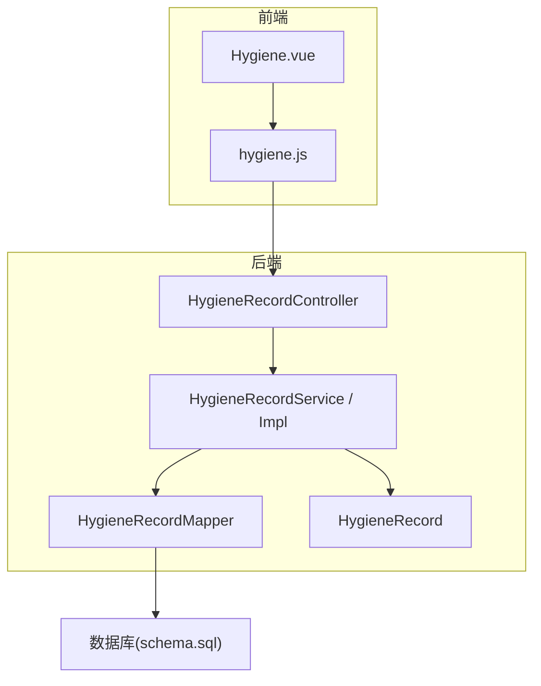
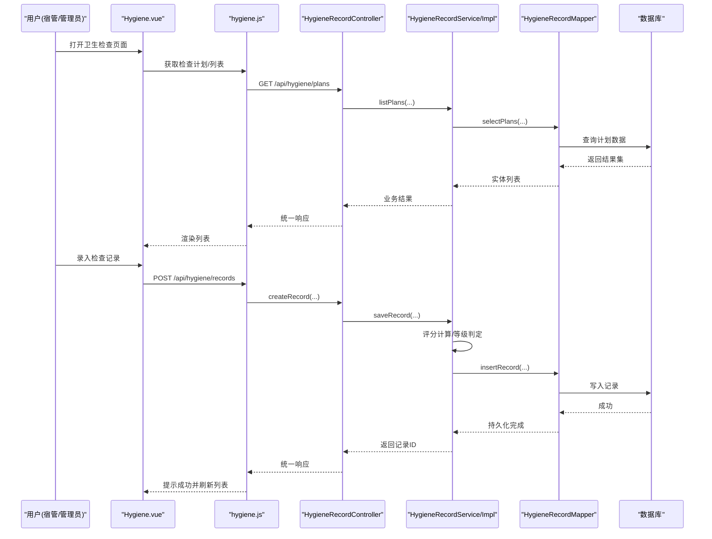
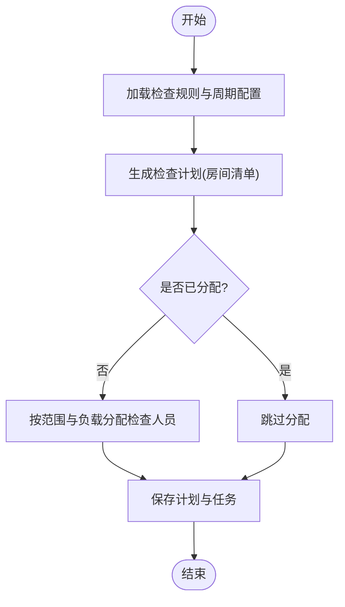
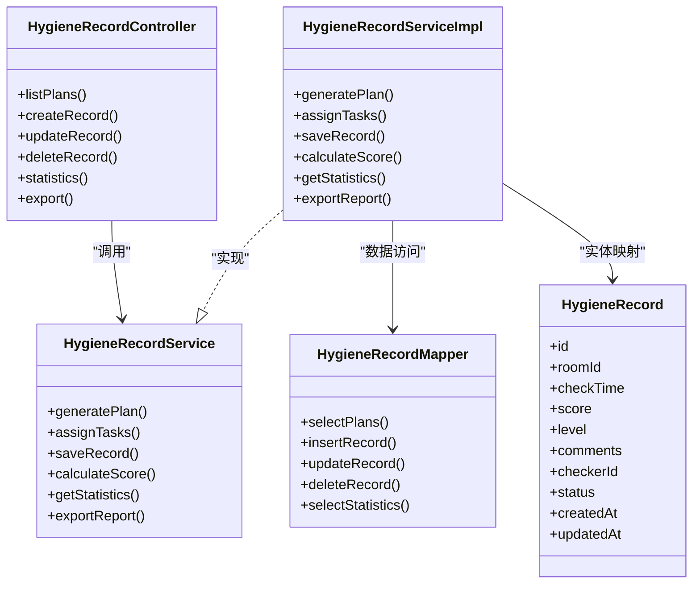

# 卫生检查模块

<cite>
**本文引用的文件**   
- [HygieneRecordController.java](file://backend/src/main/java/com/dorm/backend/controller/HygieneRecordController.java)
- [HygieneRecordServiceImpl.java](file://backend/src/main/java/com/dorm/backend/service/impl/HygieneRecordServiceImpl.java)
- [HygieneRecordService.java](file://backend/src/main/java/com/dorm/backend/service/HygieneRecordService.java)
- [HygieneRecordMapper.java](file://backend/src/main/java/com/dorm/backend/mapper/HygieneRecordMapper.java)
- [HygieneRecord.java](file://backend/src/main/java/com/dorm/backend/entity/HygieneRecord.java)
- [application.yml](file://backend/src/main/resources/application.yml)
- [schema.sql](file://backend/src/main/resources/schema.sql)
- [hygiene.js](file://frontend/src/api/hygiene.js)
- [Hygiene.vue](file://frontend/src/views/manager/Hygiene.vue)
</cite>

## 目录
1. [简介](#简介)
2. [项目结构](#项目结构)
3. [核心组件](#核心组件)
4. [架构总览](#架构总览)
5. [详细组件分析](#详细组件分析)
6. [依赖关系分析](#依赖关系分析)
7. [性能考虑](#性能考虑)
8. [故障排查指南](#故障排查指南)
9. [结论](#结论)
10. [附录](#附录)

## 简介
本模块围绕宿舍卫生检查的标准化、执行与评估，提供从标准制定、计划生成、任务分配、记录录入到结果分析与报告的全流程能力。重点覆盖：
- 评分体系与等级划分、奖惩机制
- 检查计划的自动生成与人员任务分配
- 检查记录的录入、校验与归档
- 结果统计、排名公示与改进建议
- 历史查询对比、趋势分析与报告导出
- 与宿舍管理、学生评价系统的集成点
- 标准配置、自定义评分规则与批量导入导出
- API 接口文档与最佳实践

## 项目结构
后端采用 Spring Boot + MyBatis 的分层架构（Controller-Service-Mapper-Entity），前端基于 Vue 3 + Vite，通过 RESTful API 与后端交互。卫生检查相关代码主要分布在以下位置：
- 控制器层：处理 HTTP 请求与响应
- 服务层：业务编排与事务控制
- 数据访问层：MyBatis Mapper 与 SQL
- 实体层：数据库表映射对象
- 前端 API 封装与页面视图

图表来源
- [HygieneRecordController.java](file://backend/src/main/java/com/dorm/backend/controller/HygieneRecordController.java)
- [HygieneRecordServiceImpl.java](file://backend/src/main/java/com/dorm/backend/service/impl/HygieneRecordServiceImpl.java)
- [HygieneRecordService.java](file://backend/src/main/java/com/dorm/backend/service/HygieneRecordService.java)
- [HygieneRecordMapper.java](file://backend/src/main/java/com/dorm/backend/mapper/HygieneRecordMapper.java)
- [HygieneRecord.java](file://backend/src/main/java/com/dorm/backend/entity/HygieneRecord.java)
- [schema.sql](file://backend/src/main/resources/schema.sql)
- [hygiene.js](file://frontend/src/api/hygiene.js)
- [Hygiene.vue](file://frontend/src/views/manager/Hygiene.vue)

章节来源
- [application.yml](file://backend/src/main/resources/application.yml)
- [schema.sql](file://backend/src/main/resources/schema.sql)

## 核心组件
- HygieneRecordController：对外暴露卫生检查相关的 REST 接口，负责参数校验、权限拦截后的业务调用与统一响应封装。
- HygieneRecordService/Impl：定义并实现卫生检查的业务逻辑，包括检查计划生成、任务分配、记录保存、评分计算、统计分析等。
- HygieneRecordMapper：数据访问抽象，提供增删改查与复杂查询方法。
- HygieneRecord：卫生检查记录实体，映射数据库表字段，承载检查时间、房间、评分、评语、检查人等信息。
- 前端 hygiene.js：封装对后端的 API 调用，便于页面组件复用。
- Hygiene.vue：卫生检查管理页面，包含计划查看、任务分配、记录录入、结果展示与导出等功能。

章节来源
- [HygieneRecordController.java](file://backend/src/main/java/com/dorm/backend/controller/HygieneRecordController.java)
- [HygieneRecordService.java](file://backend/src/main/java/com/dorm/backend/service/HygieneRecordService.java)
- [HygieneRecordServiceImpl.java](file://backend/src/main/java/com/dorm/backend/service/impl/HygieneRecordServiceImpl.java)
- [HygieneRecordMapper.java](file://backend/src/main/java/com/dorm/backend/mapper/HygieneRecordMapper.java)
- [HygieneRecord.java](file://backend/src/main/java/com/dorm/backend/entity/HygieneRecord.java)
- [hygiene.js](file://frontend/src/api/hygiene.js)
- [Hygiene.vue](file://frontend/src/views/manager/Hygiene.vue)

## 架构总览
卫生检查模块遵循“前后端分离 + 分层架构”的设计原则，关键交互如下：
- 前端页面发起请求，经 API 封装调用后端控制器
- 控制器进行参数校验与权限校验后，委托服务层处理
- 服务层编排业务流程，必要时调用其他服务或工具类
- 数据访问层通过 MyBatis 操作数据库
- 返回统一响应格式，前端渲染结果

图表来源
- [HygieneRecordController.java](file://backend/src/main/java/com/dorm/backend/controller/HygieneRecordController.java)
- [HygieneRecordServiceImpl.java](file://backend/src/main/java/com/dorm/backend/service/impl/HygieneRecordServiceImpl.java)
- [HygieneRecordMapper.java](file://backend/src/main/java/com/dorm/backend/mapper/HygieneRecordMapper.java)
- [hygiene.js](file://frontend/src/api/hygiene.js)
- [Hygiene.vue](file://frontend/src/views/manager/Hygiene.vue)

## 详细组件分析

### 控制器层：HygieneRecordController
职责与要点：
- 暴露卫生检查相关 REST 接口，如计划查询、记录创建、统计查询、导出等
- 统一使用 Result 封装响应体，保证前后端数据结构一致
- 结合全局异常处理器与鉴权拦截器，确保安全性与一致性

接口设计建议（示例）：
- 获取检查计划列表：GET /api/hygiene/plans
- 创建检查记录：POST /api/hygiene/records
- 更新检查记录：PUT /api/hygiene/records/{id}
- 删除检查记录：DELETE /api/hygiene/records/{id}
- 查询统计信息：GET /api/hygiene/statistics
- 导出报表：GET /api/hygiene/export

章节来源
- [HygieneRecordController.java](file://backend/src/main/java/com/dorm/backend/controller/HygieneRecordController.java)

### 服务层：HygieneRecordService/Impl
职责与要点：
- 定义并实现卫生检查的核心业务逻辑
- 检查计划自动生成：按周期（周/月）或事件触发生成待检房间清单
- 任务分配：根据宿管范围、负载均衡策略分配检查人员
- 记录保存与校验：必填项校验、重复提交防护、状态流转控制
- 评分与等级：依据评分规则计算总分与等级，支持自定义权重与阈值
- 统计分析：按房间、楼栋、时间段、检查人等多维度聚合
- 报告导出：支持 CSV/Excel 导出，便于线下归档与公示

关键流程（计划生成与任务分配）：

图表来源
- [HygieneRecordServiceImpl.java](file://backend/src/main/java/com/dorm/backend/service/impl/HygieneRecordServiceImpl.java)
- [HygieneRecordService.java](file://backend/src/main/java/com/dorm/backend/service/HygieneRecordService.java)

章节来源
- [HygieneRecordService.java](file://backend/src/main/java/com/dorm/backend/service/HygieneRecordService.java)
- [HygieneRecordServiceImpl.java](file://backend/src/main/java/com/dorm/backend/service/impl/HygieneRecordServiceImpl.java)

### 数据访问层：HygieneRecordMapper
职责与要点：
- 提供基础 CRUD 方法与复杂查询（分页、条件筛选、聚合统计）
- 与实体 HygieneRecord 一一对应，避免 SQL 注入与类型转换问题
- 支持批量插入与导出优化（分批读取、流式输出）

章节来源
- [HygieneRecordMapper.java](file://backend/src/main/java/com/dorm/backend/mapper/HygieneRecordMapper.java)

### 实体层：HygieneRecord
字段说明（示例）：
- id：主键
- room_id：房间标识
- check_time：检查时间
- score：总分
- level：等级（如 A/B/C/D）
- comments：评语
- checker_id：检查人
- status：状态（待检/已检/已复核）
- created_at/updated_at：时间戳

章节来源
- [HygieneRecord.java](file://backend/src/main/java/com/dorm/backend/entity/HygieneRecord.java)

### 前端：hygiene.js 与 Hygiene.vue
- hygiene.js：封装对后端的 API 调用，统一处理请求头、错误提示与重试策略
- Hygiene.vue：提供计划查看、任务分配、记录录入、结果展示、统计图表与导出功能

章节来源
- [hygiene.js](file://frontend/src/api/hygiene.js)
- [Hygiene.vue](file://frontend/src/views/manager/Hygiene.vue)

## 依赖关系分析
- 控制器依赖服务层，服务层依赖数据访问层与实体
- 前端通过 API 模块与控制器交互
- 数据库通过 schema.sql 定义表结构与索引

图表来源
- [HygieneRecordController.java](file://backend/src/main/java/com/dorm/backend/controller/HygieneRecordController.java)
- [HygieneRecordService.java](file://backend/src/main/java/com/dorm/backend/service/HygieneRecordService.java)
- [HygieneRecordServiceImpl.java](file://backend/src/main/java/com/dorm/backend/service/impl/HygieneRecordServiceImpl.java)
- [HygieneRecordMapper.java](file://backend/src/main/java/com/dorm/backend/mapper/HygieneRecordMapper.java)
- [HygieneRecord.java](file://backend/src/main/java/com/dorm/backend/entity/HygieneRecord.java)

章节来源
- [application.yml](file://backend/src/main/resources/application.yml)
- [schema.sql](file://backend/src/main/resources/schema.sql)

## 性能考虑
- 分页与过滤：列表查询务必分页，并按常用条件建立索引（房间、检查时间、检查人）
- 批量操作：导入导出使用分批读写，避免一次性加载大数据导致内存溢出
- 缓存策略：对不频繁变更的配置（评分规则、等级阈值）可短期缓存
- 异步处理：计划生成与任务分配可采用异步任务，降低接口响应时间
- 连接池与慢查询：合理配置数据库连接池，监控慢查询日志

[本节为通用指导，无需特定文件引用]

## 故障排查指南
常见问题与定位思路：
- 接口返回 401/403：检查 JWT 鉴权与角色权限配置
- 数据不一致：核对事务边界与并发写冲突，确认唯一约束与幂等性
- 导出失败：检查文件路径权限与内存占用，启用分批导出
- 统计不准确：核对聚合 SQL 与分组维度，验证数据清洗逻辑

章节来源
- [application.yml](file://backend/src/main/resources/application.yml)
- [schema.sql](file://backend/src/main/resources/schema.sql)

## 结论
卫生检查模块以清晰的分层架构与完善的业务流程，支撑了从标准制定、计划生成、任务分配到记录录入、评分统计与报告导出的全链路需求。通过合理的性能优化与健壮的错误处理，系统具备良好的可扩展性与可维护性。后续可进一步引入 AI 辅助评分建议、移动端扫码打卡与多租户隔离等增强能力。

[本节为总结性内容，无需特定文件引用]

## 附录

### API 接口文档（示例）
- 获取检查计划列表
  - 方法：GET
  - 路径：/api/hygiene/plans
  - 参数：page, size, startDate, endDate, roomId
  - 响应：Result<List<PlanVO>>
- 创建检查记录
  - 方法：POST
  - 路径：/api/hygiene/records
  - 请求体：{roomId, checkTime, score, level, comments, checkerId}
  - 响应：Result<RecordVO>
- 更新检查记录
  - 方法：PUT
  - 路径：/api/hygiene/records/{id}
  - 请求体：同创建
  - 响应：Result<Boolean>
- 删除检查记录
  - 方法：DELETE
  - 路径：/api/hygiene/records/{id}
  - 响应：Result<Boolean>
- 查询统计信息
  - 方法：GET
  - 路径：/api/hygiene/statistics
  - 参数：groupBy(room/building/time), startDate, endDate
  - 响应：Result<StatisticsVO>
- 导出报表
  - 方法：GET
  - 路径：/api/hygiene/export
  - 参数：format(csv/excel), startDate, endDate
  - 响应：文件流

章节来源
- [HygieneRecordController.java](file://backend/src/main/java/com/dorm/backend/controller/HygieneRecordController.java)
- [hygiene.js](file://frontend/src/api/hygiene.js)

### 评分体系与等级划分（示例）
- 评分维度：地面清洁、物品摆放、空气质量、公共区域、安全规范
- 权重配置：各维度权重可配置，默认均分或按重要性加权
- 等级阈值：A≥90，80≤B<90，70≤C<80，D<70
- 奖惩机制：连续 A 级给予奖励；连续 D 级触发整改通知与复查

章节来源
- [HygieneRecordServiceImpl.java](file://backend/src/main/java/com/dorm/backend/service/impl/HygieneRecordServiceImpl.java)
- [HygieneRecord.java](file://backend/src/main/java/com/dorm/backend/entity/HygieneRecord.java)

### 检查计划自动生成与任务分配（示例）
- 生成策略：按周/月周期或随机抽查策略生成计划
- 分配规则：按宿管范围、负载均衡、历史负荷综合分配
- 提醒机制：到期前自动提醒检查人与被检房间

章节来源
- [HygieneRecordServiceImpl.java](file://backend/src/main/java/com/dorm/backend/service/impl/HygieneRecordServiceImpl.java)

### 历史记录查询与趋势分析（示例）
- 查询维度：房间、楼栋、时间段、检查人、等级分布
- 趋势分析：月度平均分、等级占比变化、改进率
- 报告生成：PDF/Excel 导出，含图表与改进建议

章节来源
- [HygieneRecordMapper.java](file://backend/src/main/java/com/dorm/backend/mapper/HygieneRecordMapper.java)
- [Hygiene.vue](file://frontend/src/views/manager/Hygiene.vue)

### 与宿舍管理、学生评价系统集成（示例）
- 宿舍管理：房间、楼栋、床位信息与检查计划联动
- 学生评价：将卫生检查结果纳入学生综合素质评价
- 数据同步：通过统一数据模型与事件总线保持数据一致性

章节来源
- [schema.sql](file://backend/src/main/resources/schema.sql)
- [HygieneRecord.java](file://backend/src/main/java/com/dorm/backend/entity/HygieneRecord.java)

### 最佳实践指南
- 接口设计：RESTful 风格，统一响应体与错误码
- 数据校验：服务端严格校验，前端友好提示
- 事务管理：跨表操作使用事务，保证一致性
- 日志审计：关键操作记录审计日志，便于追溯
- 安全加固：JWT 鉴权、最小权限原则、敏感数据脱敏

章节来源
- [application.yml](file://backend/src/main/resources/application.yml)
- [HygieneRecordController.java](file://backend/src/main/java/com/dorm/backend/controller/HygieneRecordController.java)