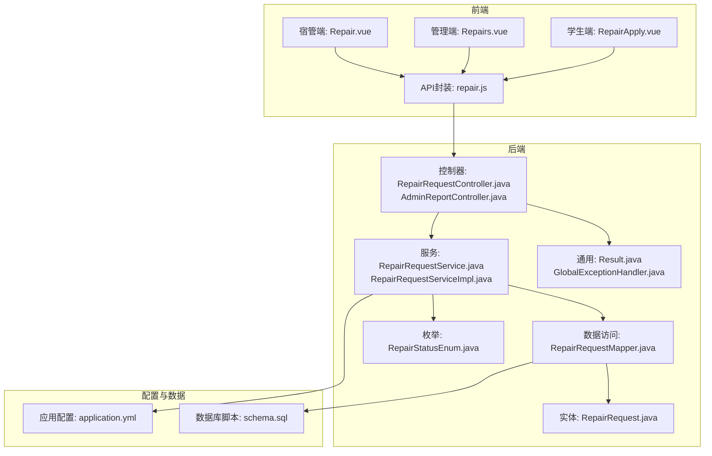
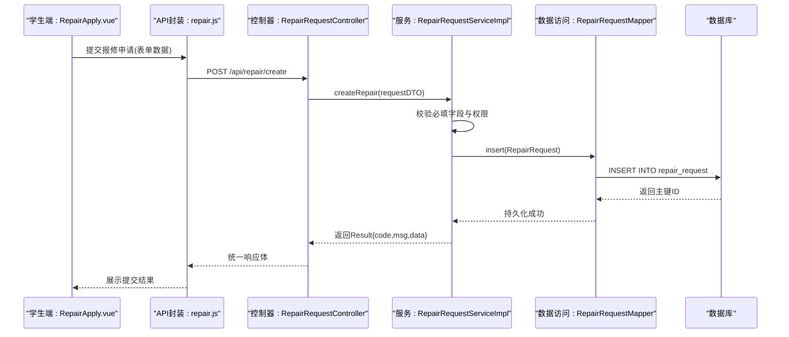
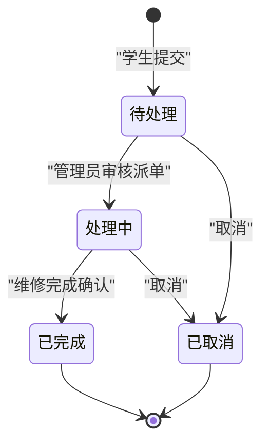
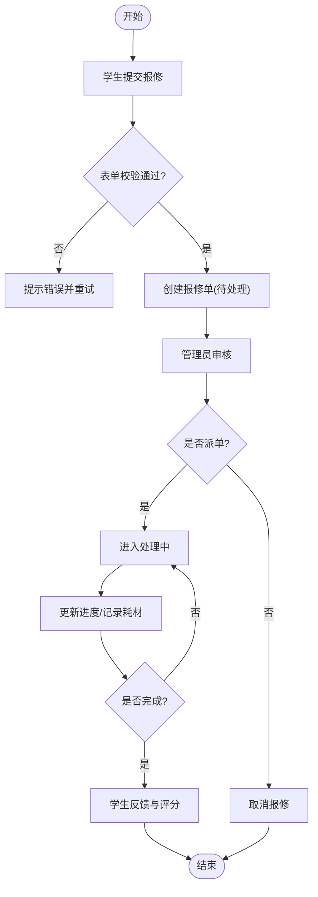
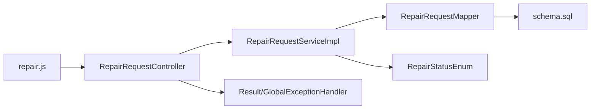

# 报修服务模块

<cite>
**本文引用的文件**   
- [RepairRequestController.java](file://backend/src/main/java/com/dorm/backend/controller/RepairRequestController.java)
- [AdminReportController.java](file://backend/src/main/java/com/dorm/backend/controller/AdminReportController.java)
- [RepairRequestService.java](file://backend/src/main/java/com/dorm/backend/service/RepairRequestService.java)
- [RepairRequestServiceImpl.java](file://backend/src/main/java/com/dorm/backend/service/impl/RepairRequestServiceImpl.java)
- [RepairRequestMapper.java](file://backend/src/main/java/com/dorm/backend/mapper/RepairRequestMapper.java)
- [RepairRequest.java](file://backend/src/main/java/com/dorm/backend/entity/RepairRequest.java)
- [RepairStatusEnum.java](file://backend/src/main/java/com/dorm/backend/enums/RepairStatusEnum.java)
- [Result.java](file://backend/src/main/java/com/dorm/backend/common/Result.java)
- [GlobalExceptionHandler.java](file://backend/src/main/java/com/dorm/backend/common/GlobalExceptionHandler.java)
- [application.yml](file://backend/src/main/resources/application.yml)
- [schema.sql](file://backend/src/main/resources/schema.sql)
- [repair.js](file://frontend/src/api/repair.js)
- [Repairs.vue](file://frontend/src/views/admin/Repairs.vue)
- [RepairApply.vue](file://frontend/src/views/student/RepairApply.vue)
- [Repair.vue](file://frontend/src/views/manager/Repair.vue)
</cite>

## 目录
1. [简介](#简介)
2. [项目结构](#项目结构)
3. [核心组件](#核心组件)
4. [架构总览](#架构总览)
5. [详细组件分析](#详细组件分析)
6. [依赖关系分析](#依赖关系分析)
7. [性能考虑](#性能考虑)
8. [故障排查指南](#故障排查指南)
9. [结论](#结论)
10. [附录](#附录)

## 简介
本模块为宿舍管理系统中的“报修服务”子系统，覆盖学生提交报修、管理员审核与派单、维修进度跟踪、结果反馈与统计报表等完整生命周期。系统通过统一的状态机管理报修单状态流转，支持优先级与紧急程度分类，提供查询、导出与统计能力，并与费用管理、库存管理等模块进行集成。

## 项目结构
后端采用典型的分层架构：控制器层暴露REST接口，服务层封装业务逻辑，数据访问层使用MyBatis Mapper，实体与枚举定义数据模型与状态枚举。前端基于Vue组织页面与API调用。

图表来源
- [RepairRequestController.java](file://backend/src/main/java/com/dorm/backend/controller/RepairRequestController.java)
- [AdminReportController.java](file://backend/src/main/java/com/dorm/backend/controller/AdminReportController.java)
- [RepairRequestService.java](file://backend/src/main/java/com/dorm/backend/service/RepairRequestService.java)
- [RepairRequestServiceImpl.java](file://backend/src/main/java/com/dorm/backend/service/impl/RepairRequestServiceImpl.java)
- [RepairRequestMapper.java](file://backend/src/main/java/com/dorm/backend/mapper/RepairRequestMapper.java)
- [RepairRequest.java](file://backend/src/main/java/com/dorm/backend/entity/RepairRequest.java)
- [RepairStatusEnum.java](file://backend/src/main/java/com/dorm/backend/enums/RepairStatusEnum.java)
- [Result.java](file://backend/src/main/java/com/dorm/backend/common/Result.java)
- [GlobalExceptionHandler.java](file://backend/src/main/java/com/dorm/backend/common/GlobalExceptionHandler.java)
- [application.yml](file://backend/src/main/resources/application.yml)
- [schema.sql](file://backend/src/main/resources/schema.sql)
- [repair.js](file://frontend/src/api/repair.js)
- [Repairs.vue](file://frontend/src/views/admin/Repairs.vue)
- [RepairApply.vue](file://frontend/src/views/student/RepairApply.vue)
- [Repair.vue](file://frontend/src/views/manager/Repair.vue)

章节来源
- [RepairRequestController.java](file://backend/src/main/java/com/dorm/backend/controller/RepairRequestController.java)
- [AdminReportController.java](file://backend/src/main/java/com/dorm/backend/controller/AdminReportController.java)
- [RepairRequestService.java](file://backend/src/main/java/com/dorm/backend/service/RepairRequestService.java)
- [RepairRequestServiceImpl.java](file://backend/src/main/java/com/dorm/backend/service/impl/RepairRequestServiceImpl.java)
- [RepairRequestMapper.java](file://backend/src/main/java/com/dorm/backend/mapper/RepairRequestMapper.java)
- [RepairRequest.java](file://backend/src/main/java/com/dorm/backend/entity/RepairRequest.java)
- [RepairStatusEnum.java](file://backend/src/main/java/com/dorm/backend/enums/RepairStatusEnum.java)
- [Result.java](file://backend/src/main/java/com/dorm/backend/common/Result.java)
- [GlobalExceptionHandler.java](file://backend/src/main/java/com/dorm/backend/common/GlobalExceptionHandler.java)
- [application.yml](file://backend/src/main/resources/application.yml)
- [schema.sql](file://backend/src/main/resources/schema.sql)
- [repair.js](file://frontend/src/api/repair.js)
- [Repairs.vue](file://frontend/src/views/admin/Repairs.vue)
- [RepairApply.vue](file://frontend/src/views/student/RepairApply.vue)
- [Repair.vue](file://frontend/src/views/manager/Repair.vue)

## 核心组件
- 控制器层
  - RepairRequestController：对外暴露报修单的增删改查、状态变更、分页查询、导出等接口。
  - AdminReportController：面向管理端的统计报表与汇总查询。
- 服务层
  - RepairRequestService/Impl：实现报修单的业务流程（创建、审核、派单、处理、完成、取消）、状态校验、自动分配策略、统计聚合。
- 数据访问层
  - RepairRequestMapper：MyBatis映射，负责SQL执行与结果映射。
- 实体与枚举
  - RepairRequest：报修单实体，包含字段定义与约束。
  - RepairStatusEnum：报修状态枚举，定义状态机与流转规则。
- 通用组件
  - Result：统一响应体封装。
  - GlobalExceptionHandler：全局异常处理，保证错误码与消息一致性。
- 前端
  - repair.js：API封装，统一请求拦截与错误处理。
  - RepairApply.vue：学生端报修申请页。
  - Repairs.vue：管理端报修列表与操作页。
  - Repair.vue：宿管端报修处理页。

章节来源
- [RepairRequestController.java](file://backend/src/main/java/com/dorm/backend/controller/RepairRequestController.java)
- [AdminReportController.java](file://backend/src/main/java/com/dorm/backend/controller/AdminReportController.java)
- [RepairRequestService.java](file://backend/src/main/java/com/dorm/backend/service/RepairRequestService.java)
- [RepairRequestServiceImpl.java](file://backend/src/main/java/com/dorm/backend/service/impl/RepairRequestServiceImpl.java)
- [RepairRequestMapper.java](file://backend/src/main/java/com/dorm/backend/mapper/RepairRequestMapper.java)
- [RepairRequest.java](file://backend/src/main/java/com/dorm/backend/entity/RepairRequest.java)
- [RepairStatusEnum.java](file://backend/src/main/java/com/dorm/backend/enums/RepairStatusEnum.java)
- [Result.java](file://backend/src/main/java/com/dorm/backend/common/Result.java)
- [GlobalExceptionHandler.java](file://backend/src/main/java/com/dorm/backend/common/GlobalExceptionHandler.java)
- [repair.js](file://frontend/src/api/repair.js)
- [RepairApply.vue](file://frontend/src/views/student/RepairApply.vue)
- [Repairs.vue](file://frontend/src/views/admin/Repairs.vue)
- [Repair.vue](file://frontend/src/views/manager/Repair.vue)

## 架构总览
报修服务遵循前后端分离的分层架构，前端通过API调用后端控制器，控制器委托服务层执行业务逻辑，服务层通过Mapper访问数据库。状态机由枚举驱动，确保状态流转合法；统一响应体与全局异常处理器保障接口一致性与健壮性。

图表来源
- [RepairRequestController.java](file://backend/src/main/java/com/dorm/backend/controller/RepairRequestController.java)
- [RepairRequestServiceImpl.java](file://backend/src/main/java/com/dorm/backend/service/impl/RepairRequestServiceImpl.java)
- [RepairRequestMapper.java](file://backend/src/main/java/com/dorm/backend/mapper/RepairRequestMapper.java)
- [RepairRequest.java](file://backend/src/main/java/com/dorm/backend/entity/RepairRequest.java)
- [repair.js](file://frontend/src/api/repair.js)
- [RepairApply.vue](file://frontend/src/views/student/RepairApply.vue)

## 详细组件分析

### 数据模型设计（RepairRequest）
- 关键字段
  - id：主键，唯一标识报修单。
  - student_id：报修学生ID，关联学生信息。
  - room_id/bed_id：房间/床位定位，便于现场维修。
  - title/description：标题与详细描述，支持富文本或图片附件路径。
  - category/priority/urgency：类别、优先级、紧急程度，用于筛选与自动分配。
  - status：当前状态，受状态机控制。
  - assignee_id：被指派维修人员ID。
  - cost/materials：费用与耗材记录，与费用/库存模块联动。
  - start_time/end_time：开始与结束时间，用于SLA与统计。
  - feedback/score：学生反馈与评分。
  - audit_comment：审核意见。
  - created_at/updated_at：审计时间戳。
- 约束条件
  - 必填字段校验（如title、description、category）。
  - 状态流转合法性校验（仅允许合法转换）。
  - 外键约束（student_id、room_id/bed_id、assignee_id）。
  - 索引优化（按status、priority、created_at建立常用查询索引）。

章节来源
- [RepairRequest.java](file://backend/src/main/java/com/dorm/backend/entity/RepairRequest.java)
- [schema.sql](file://backend/src/main/resources/schema.sql)

### 状态管理与业务规则
- 状态枚举（RepairStatusEnum）
  - 待处理：新提交的报修单。
  - 处理中：已派单并开始维修。
  - 已完成：维修结束并确认。
  - 已取消：报修单被撤销。
- 流转规则
  - 待处理 → 处理中：管理员审核后派单。
  - 处理中 → 已完成：维修完成后提交结果。
  - 任意状态 → 已取消：在允许阶段可取消（通常待处理/处理中）。
- 自动分配机制
  - 根据优先级与紧急程度匹配可用维修人员。
  - 若无人可用，进入排队队列或升级通知。

图表来源
- [RepairStatusEnum.java](file://backend/src/main/java/com/dorm/backend/enums/RepairStatusEnum.java)
- [RepairRequestServiceImpl.java](file://backend/src/main/java/com/dorm/backend/service/impl/RepairRequestServiceImpl.java)

章节来源
- [RepairStatusEnum.java](file://backend/src/main/java/com/dorm/backend/enums/RepairStatusEnum.java)
- [RepairRequestServiceImpl.java](file://backend/src/main/java/com/dorm/backend/service/impl/RepairRequestServiceImpl.java)

### 报修生命周期流程
- 学生提交报修：填写表单，前端校验后调用创建接口。
- 管理员审核：查看待处理列表，选择是否派单给宿管或维修人员。
- 维修处理：维修人员更新进度，记录耗时与耗材。
- 结果反馈：学生确认完成并可评分，形成闭环。

图表来源
- [RepairRequestController.java](file://backend/src/main/java/com/dorm/backend/controller/RepairRequestController.java)
- [RepairRequestServiceImpl.java](file://backend/src/main/java/com/dorm/backend/service/impl/RepairRequestServiceImpl.java)
- [RepairApply.vue](file://frontend/src/views/student/RepairApply.vue)
- [Repairs.vue](file://frontend/src/views/admin/Repairs.vue)
- [Repair.vue](file://frontend/src/views/manager/Repair.vue)

章节来源
- [RepairRequestController.java](file://backend/src/main/java/com/dorm/backend/controller/RepairRequestController.java)
- [RepairRequestServiceImpl.java](file://backend/src/main/java/com/dorm/backend/service/impl/RepairRequestServiceImpl.java)
- [RepairApply.vue](file://frontend/src/views/student/RepairApply.vue)
- [Repairs.vue](file://frontend/src/views/admin/Repairs.vue)
- [Repair.vue](file://frontend/src/views/manager/Repair.vue)

### 优先级与紧急程度分类
- 优先级：高/中/低，影响派单顺序与提醒策略。
- 紧急程度：一般/紧急/特急，触发不同SLA与升级机制。
- 自动分配：结合优先级、紧急程度与维修人员负载进行匹配。

章节来源
- [RepairRequestServiceImpl.java](file://backend/src/main/java/com/dorm/backend/service/impl/RepairRequestServiceImpl.java)
- [RepairRequest.java](file://backend/src/main/java/com/dorm/backend/entity/RepairRequest.java)

### 统计报表与历史查询
- 统计维度：按状态、优先级、紧急程度、时间段、区域（楼栋/房间）聚合。
- 导出功能：支持CSV/Excel导出，便于线下分析与归档。
- 历史查询：支持多条件组合筛选与分页加载。

章节来源
- [AdminReportController.java](file://backend/src/main/java/com/dorm/backend/controller/AdminReportController.java)
- [RepairRequestServiceImpl.java](file://backend/src/main/java/com/dorm/backend/service/impl/RepairRequestServiceImpl.java)
- [RepairRequestMapper.java](file://backend/src/main/java/com/dorm/backend/mapper/RepairRequestMapper.java)

### 与费用管理、库存管理的集成
- 费用管理：维修产生的费用计入学生账单，支持费用明细与对账。
- 库存管理：耗材出库扣减，支持库存预警与补货提醒。
- 数据联动：报修单完成时同步更新费用与库存记录。

章节来源
- [RepairRequestServiceImpl.java](file://backend/src/main/java/com/dorm/backend/service/impl/RepairRequestServiceImpl.java)
- [FeeBillController.java](file://backend/src/main/java/com/dorm/backend/controller/FeeBillController.java)
- [ItemRecordController.java](file://backend/src/main/java/com/dorm/backend/controller/ItemRecordController.java)

### API接口使用示例与最佳实践
- 创建报修：POST /api/repair/create，请求体包含必要字段，返回统一Result。
- 查询列表：GET /api/repair/list，支持分页与筛选参数。
- 状态变更：PUT /api/repair/status，需携带状态与原因。
- 导出报表：GET /api/repair/export，返回文件流或下载链接。
- 错误处理：统一错误码与消息，前端捕获并提示用户。

章节来源
- [RepairRequestController.java](file://backend/src/main/java/com/dorm/backend/controller/RepairRequestController.java)
- [Result.java](file://backend/src/main/java/com/dorm/backend/common/Result.java)
- [GlobalExceptionHandler.java](file://backend/src/main/java/com/dorm/backend/common/GlobalExceptionHandler.java)
- [repair.js](file://frontend/src/api/repair.js)

## 依赖关系分析
- 控制器依赖服务层，服务层依赖Mapper与枚举。
- 前端依赖API封装，API封装调用控制器接口。
- 数据访问依赖数据库脚本定义表结构与索引。

图表来源
- [repair.js](file://frontend/src/api/repair.js)
- [RepairRequestController.java](file://backend/src/main/java/com/dorm/backend/controller/RepairRequestController.java)
- [RepairRequestServiceImpl.java](file://backend/src/main/java/com/dorm/backend/service/impl/RepairRequestServiceImpl.java)
- [RepairRequestMapper.java](file://backend/src/main/java/com/dorm/backend/mapper/RepairRequestMapper.java)
- [RepairStatusEnum.java](file://backend/src/main/java/com/dorm/backend/enums/RepairStatusEnum.java)
- [schema.sql](file://backend/src/main/resources/schema.sql)
- [Result.java](file://backend/src/main/java/com/dorm/backend/common/Result.java)
- [GlobalExceptionHandler.java](file://backend/src/main/java/com/dorm/backend/common/GlobalExceptionHandler.java)

章节来源
- [repair.js](file://frontend/src/api/repair.js)
- [RepairRequestController.java](file://backend/src/main/java/com/dorm/backend/controller/RepairRequestController.java)
- [RepairRequestServiceImpl.java](file://backend/src/main/java/com/dorm/backend/service/impl/RepairRequestServiceImpl.java)
- [RepairRequestMapper.java](file://backend/src/main/java/com/dorm/backend/mapper/RepairRequestMapper.java)
- [RepairStatusEnum.java](file://backend/src/main/java/com/dorm/backend/enums/RepairStatusEnum.java)
- [schema.sql](file://backend/src/main/resources/schema.sql)
- [Result.java](file://backend/src/main/java/com/dorm/backend/common/Result.java)
- [GlobalExceptionHandler.java](file://backend/src/main/java/com/dorm/backend/common/GlobalExceptionHandler.java)

## 性能考虑
- 数据库索引：针对常用查询字段（status、priority、created_at）建立索引。
- 分页查询：避免一次性加载大量数据，提升响应速度。
- 异步处理：对于耗时操作（如导出报表）建议异步执行并通知用户。
- 缓存策略：对热点数据（如统计报表）引入缓存减少数据库压力。

[本节为通用指导，不直接分析具体文件]

## 故障排查指南
- 常见错误
  - 参数校验失败：检查必填字段与格式。
  - 状态流转非法：确认当前状态与目标状态的合法性。
  - 权限不足：验证用户角色与操作范围。
- 调试建议
  - 查看全局异常日志，定位错误堆栈。
  - 检查数据库事务是否回滚，确认数据一致性。
  - 前端网络请求监控，确认接口响应与错误码。

章节来源
- [GlobalExceptionHandler.java](file://backend/src/main/java/com/dorm/backend/common/GlobalExceptionHandler.java)
- [Result.java](file://backend/src/main/java/com/dorm/backend/common/Result.java)

## 结论
报修服务模块通过清晰的分层架构与状态机管理，实现了从提交到完成的完整业务流程。结合优先级与紧急程度分类，提升了派单效率与用户体验。与费用、库存模块的集成确保了业务闭环。统一的响应体与异常处理保障了接口的健壮性。未来可进一步优化异步处理与缓存策略，提升系统性能与可扩展性。

[本节为总结性内容，不直接分析具体文件]

## 附录
- 配置参考：application.yml中的数据库连接、日志级别等。
- 前端页面：RepairApply.vue、Repairs.vue、Repair.vue的使用说明与交互流程。

章节来源
- [application.yml](file://backend/src/main/resources/application.yml)
- [RepairApply.vue](file://frontend/src/views/student/RepairApply.vue)
- [Repairs.vue](file://frontend/src/views/admin/Repairs.vue)
- [Repair.vue](file://frontend/src/views/manager/Repair.vue)