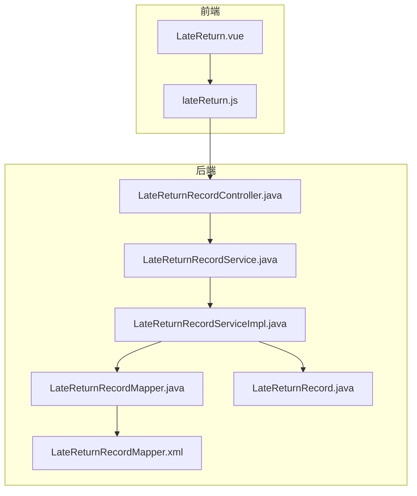
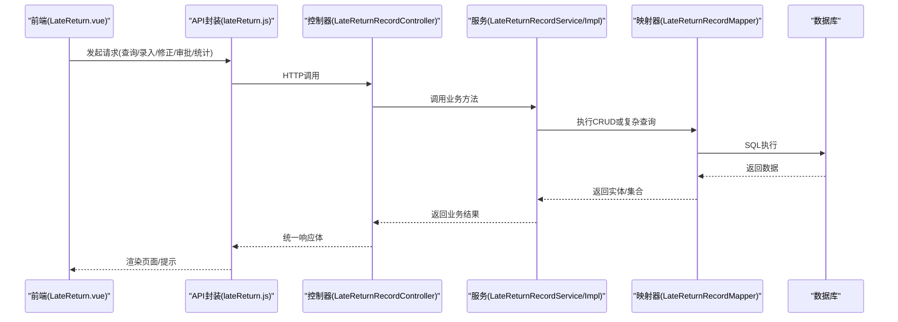
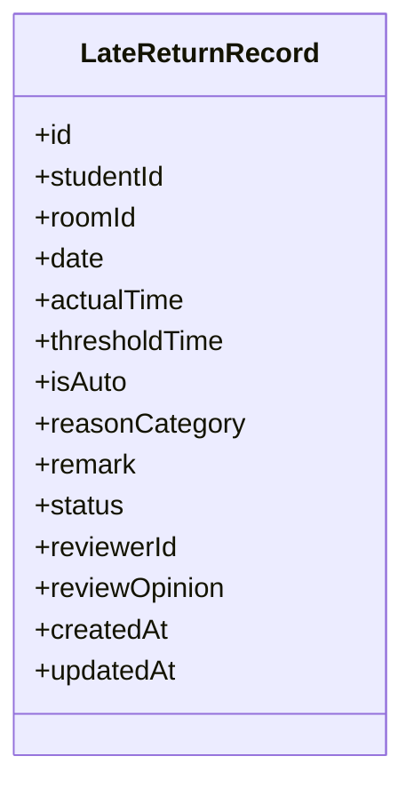
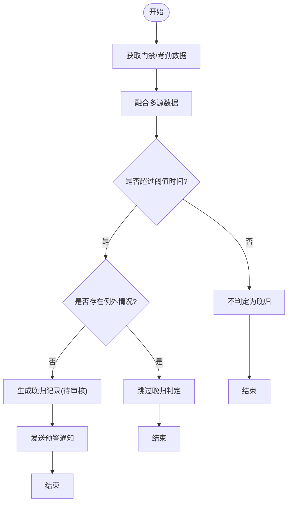
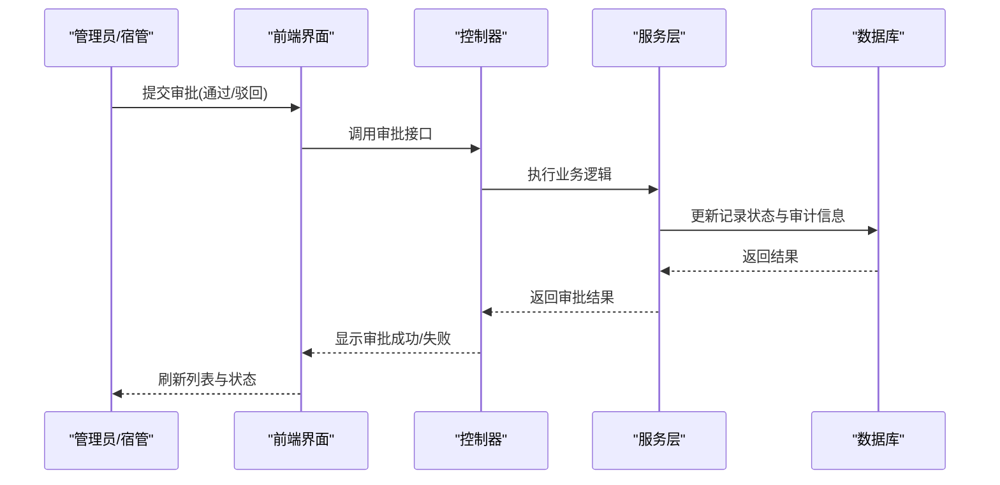
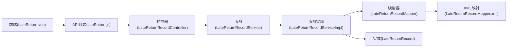

# 晚归记录模块

<cite>
**本文引用的文件**   
- [LateReturnRecordController.java](file://backend/src/main/java/com/dorm/backend/controller/LateReturnRecordController.java)
- [LateReturnRecordServiceImpl.java](file://backend/src/main/java/com/dorm/backend/service/impl/LateReturnRecordServiceImpl.java)
- [LateReturnRecordService.java](file://backend/src/main/java/com/dorm/backend/service/LateReturnRecordService.java)
- [LateReturnRecordMapper.java](file://backend/src/main/java/com/dorm/backend/mapper/LateReturnRecordMapper.java)
- [LateReturnRecordMapper.xml](file://backend/src/main/resources/mapper/LateReturnRecordMapper.xml)
- [LateReturnRecord.java](file://backend/src/main/java/com/dorm/backend/entity/LateReturnRecord.java)
- [lateReturn.js](file://frontend/src/api/lateReturn.js)
- [LateReturn.vue](file://frontend/src/views/manager/LateReturn.vue)
</cite>

## 目录
1. [简介](#简介)
2. [项目结构](#项目结构)
3. [核心组件](#核心组件)
4. [架构总览](#架构总览)
5. [详细组件分析](#详细组件分析)
6. [依赖关系分析](#依赖关系分析)
7. [性能考虑](#性能考虑)
8. [故障排查指南](#故障排查指南)
9. [结论](#结论)
10. [附录](#附录)

## 简介
本模块面向宿舍管理场景，提供学生晚归行为的检测、记录、处理与统计的完整能力。功能覆盖：
- 晚归时间判定规则与例外处理（如节假日、活动报备等）
- 自动生成、手动录入与修正机制
- 审批流程与通知预警
- 统计分析报告、趋势分析与个性化提醒
- 历史记录查询与导出
- 与门禁系统、考勤系统的集成与数据同步
- 规则自定义配置、批量数据处理与管理员操作界面
- API接口规范与集成示例

## 项目结构
后端采用Spring Boot分层架构，围绕“控制器-服务-映射器-实体”组织代码；前端基于Vue，提供管理员与宿管的操作界面，并通过API调用后端服务。

图表来源
- [LateReturn.vue:1-1000](file://frontend/src/views/manager/LateReturn.vue#L1-L1000)
- [lateReturn.js:1-1000](file://frontend/src/api/lateReturn.js#L1-L1000)
- [LateReturnRecordController.java:1-1000](file://backend/src/main/java/com/dorm/backend/controller/LateReturnRecordController.java#L1-L1000)
- [LateReturnRecordService.java:1-1000](file://backend/src/main/java/com/dorm/backend/service/LateReturnRecordService.java#L1-L1000)
- [LateReturnRecordServiceImpl.java:1-1000](file://backend/src/main/java/com/dorm/backend/service/impl/LateReturnRecordServiceImpl.java#L1-L1000)
- [LateReturnRecordMapper.java:1-1000](file://backend/src/main/java/com/dorm/backend/mapper/LateReturnRecordMapper.java#L1-L1000)
- [LateReturnRecordMapper.xml:1-1000](file://backend/src/main/resources/mapper/LateReturnRecordMapper.xml#L1-L1000)
- [LateReturnRecord.java:1-1000](file://backend/src/main/java/com/dorm/backend/entity/LateReturnRecord.java#L1-L1000)

章节来源
- [LateReturnRecordController.java:1-1000](file://backend/src/main/java/com/dorm/backend/controller/LateReturnRecordController.java#L1-L1000)
- [LateReturnRecordServiceImpl.java:1-1000](file://backend/src/main/java/com/dorm/backend/service/impl/LateReturnRecordServiceImpl.java#L1-L1000)
- [LateReturnRecordMapper.java:1-1000](file://backend/src/main/java/com/dorm/backend/mapper/LateReturnRecordMapper.java#L1-L1000)
- [LateReturnRecordMapper.xml:1-1000](file://backend/src/main/resources/mapper/LateReturnRecordMapper.xml#L1-L1000)
- [LateReturnRecord.java:1-1000](file://backend/src/main/java/com/dorm/backend/entity/LateReturnRecord.java#L1-L1000)
- [lateReturn.js:1-1000](file://frontend/src/api/lateReturn.js#L1-L1000)
- [LateReturn.vue:1-1000](file://frontend/src/views/manager/LateReturn.vue#L1-L1000)

## 核心组件
- 控制器层：对外暴露REST接口，负责参数校验、权限控制与结果封装。
- 服务层：实现晚归判定、记录生成、审批流转、统计汇总、通知预警等核心业务逻辑。
- 持久层：通过MyBatis映射器与XML定义SQL，完成数据的增删改查与复杂查询。
- 实体模型：晚归记录的数据结构与字段约束。
- 前端页面与API封装：提供查询、录入、修正、审批、统计与导出等功能入口。

章节来源
- [LateReturnRecordController.java:1-1000](file://backend/src/main/java/com/dorm/backend/controller/LateReturnRecordController.java#L1-L1000)
- [LateReturnRecordService.java:1-1000](file://backend/src/main/java/com/dorm/backend/service/LateReturnRecordService.java#L1-L1000)
- [LateReturnRecordServiceImpl.java:1-1000](file://backend/src/main/java/com/dorm/backend/service/impl/LateReturnRecordServiceImpl.java#L1-L1000)
- [LateReturnRecordMapper.java:1-1000](file://backend/src/main/java/com/dorm/backend/mapper/LateReturnRecordMapper.java#L1-L1000)
- [LateReturnRecordMapper.xml:1-1000](file://backend/src/main/resources/mapper/LateReturnRecordMapper.xml#L1-L1000)
- [LateReturnRecord.java:1-1000](file://backend/src/main/java/com/dorm/backend/entity/LateReturnRecord.java#L1-L1000)
- [lateReturn.js:1-1000](file://frontend/src/api/lateReturn.js#L1-L1000)
- [LateReturn.vue:1-1000](file://frontend/src/views/manager/LateReturn.vue#L1-L1000)

## 架构总览
晚归记录模块遵循典型的Web应用分层架构，前后端分离，通过REST API交互。后端以Service为核心编排业务，Mapper负责数据访问，Entity承载数据模型。

图表来源
- [LateReturn.vue:1-1000](file://frontend/src/views/manager/LateReturn.vue#L1-L1000)
- [lateReturn.js:1-1000](file://frontend/src/api/lateReturn.js#L1-L1000)
- [LateReturnRecordController.java:1-1000](file://backend/src/main/java/com/dorm/backend/controller/LateReturnRecordController.java#L1-L1000)
- [LateReturnRecordService.java:1-1000](file://backend/src/main/java/com/dorm/backend/service/LateReturnRecordService.java#L1-L1000)
- [LateReturnRecordServiceImpl.java:1-1000](file://backend/src/main/java/com/dorm/backend/service/impl/LateReturnRecordServiceImpl.java#L1-L1000)
- [LateReturnRecordMapper.java:1-1000](file://backend/src/main/java/com/dorm/backend/mapper/LateReturnRecordMapper.java#L1-L1000)

## 详细组件分析

### 实体模型与数据结构
- LateReturnRecord实体定义了晚归记录的核心字段，包括学生信息、宿舍信息、晚归时间、原因、状态、审批信息等。
- 建议字段包含：主键、学生ID、宿舍ID、日期、实际回寝时间、阈值时间、是否自动判定、原因分类、备注、创建时间、更新时间、审核状态、审核人、审核意见等。

图表来源
- [LateReturnRecord.java:1-1000](file://backend/src/main/java/com/dorm/backend/entity/LateReturnRecord.java#L1-L1000)

章节来源
- [LateReturnRecord.java:1-1000](file://backend/src/main/java/com/dorm/backend/entity/LateReturnRecord.java#L1-L1000)

### 控制器层接口设计
- 提供晚归记录的查询、新增、修改、删除、批量导入、导出、审批、统计等接口。
- 典型接口包括：
  - 分页查询晚归记录（支持按学生、宿舍、日期范围、状态筛选）
  - 新增晚归记录（支持自动判定与手动录入）
  - 修改与撤销（含审计日志）
  - 批量导入（Excel/CSV）
  - 导出报表（PDF/Excel）
  - 审批流程（通过/驳回/转交）
  - 统计汇总（个人/宿舍/楼栋/全校维度）

章节来源
- [LateReturnRecordController.java:1-1000](file://backend/src/main/java/com/dorm/backend/controller/LateReturnRecordController.java#L1-L1000)

### 服务层业务逻辑
- 晚归判定规则：
  - 基础规则：对比实际回寝时间与阈值时间，超过阈值即判定为晚归。
  - 例外规则：节假日、学校活动、请假报备、宿管豁免等可排除晚归判定。
  - 多源数据融合：门禁刷卡记录、考勤打卡、宿舍传感器信号等综合判断。
- 记录生成：
  - 自动生成：定时任务扫描门禁/考勤数据，生成待确认记录。
  - 手动录入：宿管或辅导员根据情况补充记录。
  - 修正机制：允许在限定时间内修正，保留历史版本与审计轨迹。
- 审批流程：
  - 多级审批：宿管初审、辅导员复审、学院终审。
  - 状态机：待审核、已通过、已驳回、已撤销。
- 统计与分析：
  - 个人/宿舍/楼栋/全校维度统计。
  - 趋势分析：周/月/学期趋势，异常波动预警。
  - 报告生成：可视化图表与导出。
- 通知与干预：
  - 预警通知：对高频晚归学生发送提醒。
  - 教育干预：推送安全教育内容、预约谈话。

章节来源
- [LateReturnRecordService.java:1-1000](file://backend/src/main/java/com/dorm/backend/service/LateReturnRecordService.java#L1-L1000)
- [LateReturnRecordServiceImpl.java:1-1000](file://backend/src/main/java/com/dorm/backend/service/impl/LateReturnRecordServiceImpl.java#L1-L1000)

### 持久层与SQL映射
- MyBatis Mapper接口定义常用CRUD与复杂查询方法。
- XML映射文件编写SQL语句，支持动态条件、分页、聚合统计。
- 关键查询包括：按条件筛选、分组统计、趋势计算、关联学生/宿舍信息。

章节来源
- [LateReturnRecordMapper.java:1-1000](file://backend/src/main/java/com/dorm/backend/mapper/LateReturnRecordMapper.java#L1-L1000)
- [LateReturnRecordMapper.xml:1-1000](file://backend/src/main/resources/mapper/LateReturnRecordMapper.xml#L1-L1000)

### 前端界面与交互
- LateReturn.vue提供晚归记录的管理界面，包括：
  - 查询与筛选面板
  - 新增/编辑表单
  - 审批操作区
  - 统计图表展示
  - 批量导入/导出按钮
- lateReturn.js封装API调用，统一错误处理与加载状态。

章节来源
- [LateReturn.vue:1-1000](file://frontend/src/views/manager/LateReturn.vue#L1-L1000)
- [lateReturn.js:1-1000](file://frontend/src/api/lateReturn.js#L1-L1000)

### 晚归判定流程图

图表来源
- [LateReturnRecordServiceImpl.java:1-1000](file://backend/src/main/java/com/dorm/backend/service/impl/LateReturnRecordServiceImpl.java#L1-L1000)

### 审批流程时序图

图表来源
- [LateReturnRecordController.java:1-1000](file://backend/src/main/java/com/dorm/backend/controller/LateReturnRecordController.java#L1-L1000)
- [LateReturnRecordServiceImpl.java:1-1000](file://backend/src/main/java/com/dorm/backend/service/impl/LateReturnRecordServiceImpl.java#L1-L1000)

## 依赖关系分析
- 控制器依赖服务接口，服务实现依赖映射器与实体。
- 前端依赖API封装，API封装依赖后端控制器。
- 无循环依赖，层次清晰。

图表来源
- [LateReturn.vue:1-1000](file://frontend/src/views/manager/LateReturn.vue#L1-L1000)
- [lateReturn.js:1-1000](file://frontend/src/api/lateReturn.js#L1-L1000)
- [LateReturnRecordController.java:1-1000](file://backend/src/main/java/com/dorm/backend/controller/LateReturnRecordController.java#L1-L1000)
- [LateReturnRecordService.java:1-1000](file://backend/src/main/java/com/dorm/backend/service/LateReturnRecordService.java#L1-L1000)
- [LateReturnRecordServiceImpl.java:1-1000](file://backend/src/main/java/com/dorm/backend/service/impl/LateReturnRecordServiceImpl.java#L1-L1000)
- [LateReturnRecordMapper.java:1-1000](file://backend/src/main/java/com/dorm/backend/mapper/LateReturnRecordMapper.java#L1-L1000)
- [LateReturnRecordMapper.xml:1-1000](file://backend/src/main/resources/mapper/LateReturnRecordMapper.xml#L1-L1000)
- [LateReturnRecord.java:1-1000](file://backend/src/main/java/com/dorm/backend/entity/LateReturnRecord.java#L1-L1000)

章节来源
- [LateReturnRecordController.java:1-1000](file://backend/src/main/java/com/dorm/backend/controller/LateReturnRecordController.java#L1-L1000)
- [LateReturnRecordServiceImpl.java:1-1000](file://backend/src/main/java/com/dorm/backend/service/impl/LateReturnRecordServiceImpl.java#L1-L1000)
- [LateReturnRecordMapper.java:1-1000](file://backend/src/main/java/com/dorm/backend/mapper/LateReturnRecordMapper.java#L1-L1000)
- [LateReturnRecordMapper.xml:1-1000](file://backend/src/main/resources/mapper/LateReturnRecordMapper.xml#L1-L1000)
- [LateReturnRecord.java:1-1000](file://backend/src/main/java/com/dorm/backend/entity/LateReturnRecord.java#L1-L1000)
- [lateReturn.js:1-1000](file://frontend/src/api/lateReturn.js#L1-L1000)
- [LateReturn.vue:1-1000](file://frontend/src/views/manager/LateReturn.vue#L1-L1000)

## 性能考虑
- 查询优化：合理使用索引（学生ID、宿舍ID、日期、状态），避免全表扫描。
- 分页与懒加载：大数据量查询采用分页，前端按需加载。
- 异步处理：批量导入与导出使用异步任务，避免阻塞。
- 缓存策略：热点统计数据可缓存，减少数据库压力。
- 连接池与事务：合理配置连接池大小，控制事务粒度。

[本节为通用指导，无需特定文件引用]

## 故障排查指南
- 接口报错：检查请求参数、权限认证、后端日志。
- 数据不一致：核对门禁/考勤数据源，检查数据同步任务。
- 审批卡住：查看审批状态机与流转规则，确认审批人权限。
- 性能问题：监控慢查询，优化SQL与索引。
- 前端渲染异常：检查API响应格式与字段映射。

章节来源
- [LateReturnRecordController.java:1-1000](file://backend/src/main/java/com/dorm/backend/controller/LateReturnRecordController.java#L1-L1000)
- [LateReturnRecordServiceImpl.java:1-1000](file://backend/src/main/java/com/dorm/backend/service/impl/LateReturnRecordServiceImpl.java#L1-L1000)
- [LateReturnRecordMapper.xml:1-1000](file://backend/src/main/resources/mapper/LateReturnRecordMapper.xml#L1-L1000)
- [lateReturn.js:1-1000](file://frontend/src/api/lateReturn.js#L1-L1000)
- [LateReturn.vue:1-1000](file://frontend/src/views/manager/LateReturn.vue#L1-L1000)

## 结论
晚归记录模块通过清晰的架构设计与完善的业务流程，实现了从数据采集、判定、记录、审批到统计与通知的全链路管理。建议持续优化性能与用户体验，完善规则配置与扩展性，以满足不同校区与学院的差异化需求。

[本节为总结，无需特定文件引用]

## 附录

### API接口规范（示例）
- 查询晚归记录
  - 方法：GET
  - 路径：/api/late-return/records
  - 参数：studentId, roomId, startDate, endDate, status, page, size
  - 响应：分页结果集
- 新增晚归记录
  - 方法：POST
  - 路径：/api/late-return/records
  - 请求体：晚归记录对象
  - 响应：创建结果
- 修改晚归记录
  - 方法：PUT
  - 路径：/api/late-return/records/{id}
  - 请求体：更新字段
  - 响应：更新结果
- 审批操作
  - 方法：POST
  - 路径：/api/late-return/records/{id}/approve
  - 请求体：{action: "approve"|"reject", opinion: string}
  - 响应：审批结果
- 批量导入
  - 方法：POST
  - 路径：/api/late-return/import
  - 请求体：multipart/form-data(file)
  - 响应：导入结果
- 导出报表
  - 方法：GET
  - 路径：/api/late-export/report
  - 参数：startDate, endDate, format
  - 响应：文件流

[本节为规范说明，无需特定文件引用]

### 集成示例（伪代码）
- 前端调用查询接口并渲染表格
- 后端控制器接收请求，调用服务层进行数据查询
- 服务层组装查询条件，调用映射器执行SQL
- 返回结果至前端，完成数据展示

[本节为概念示例，无需特定文件引用]