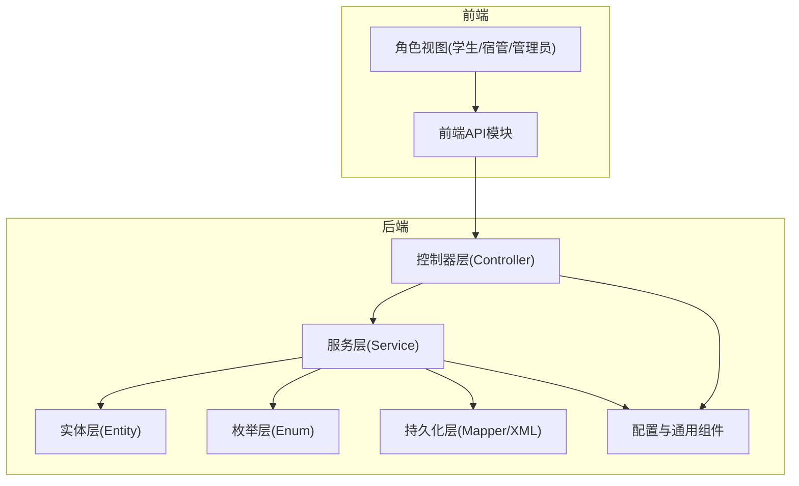
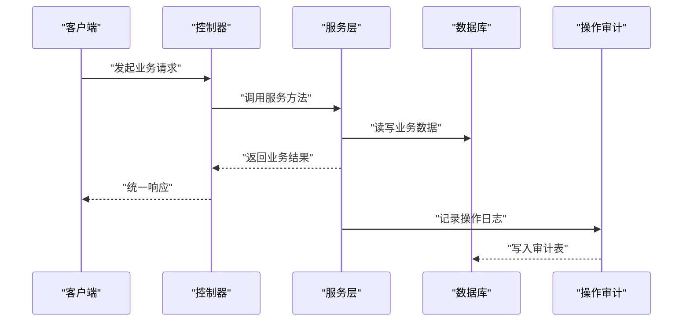
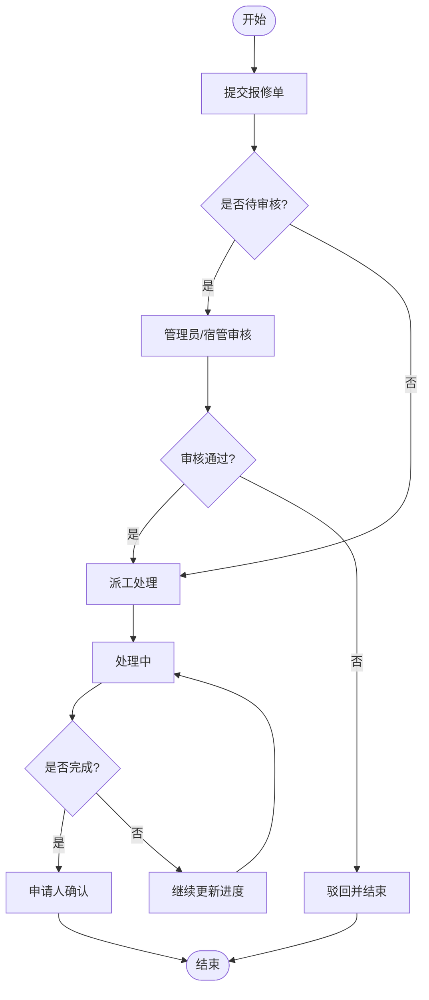
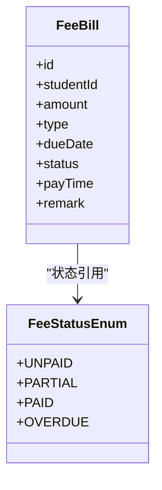
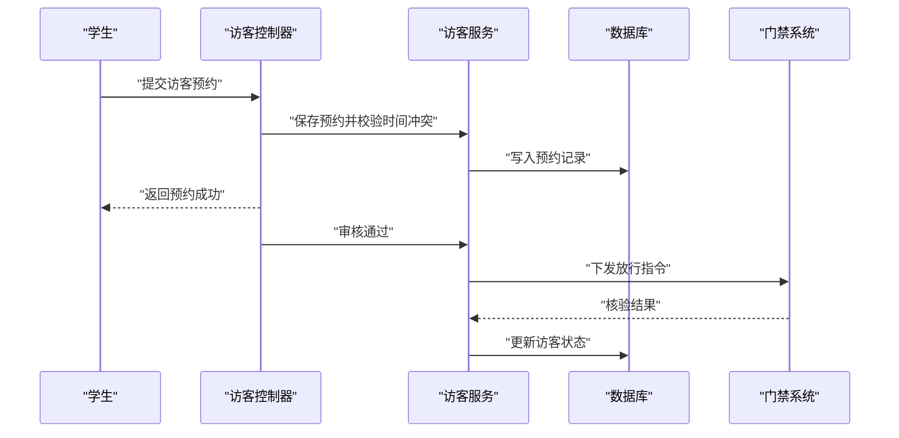
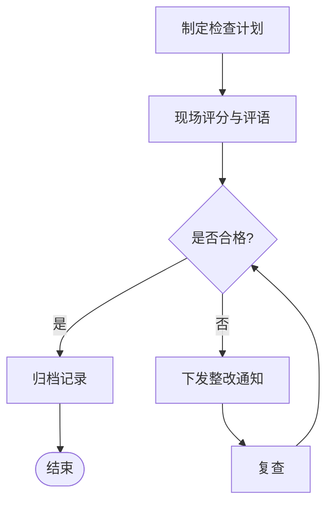
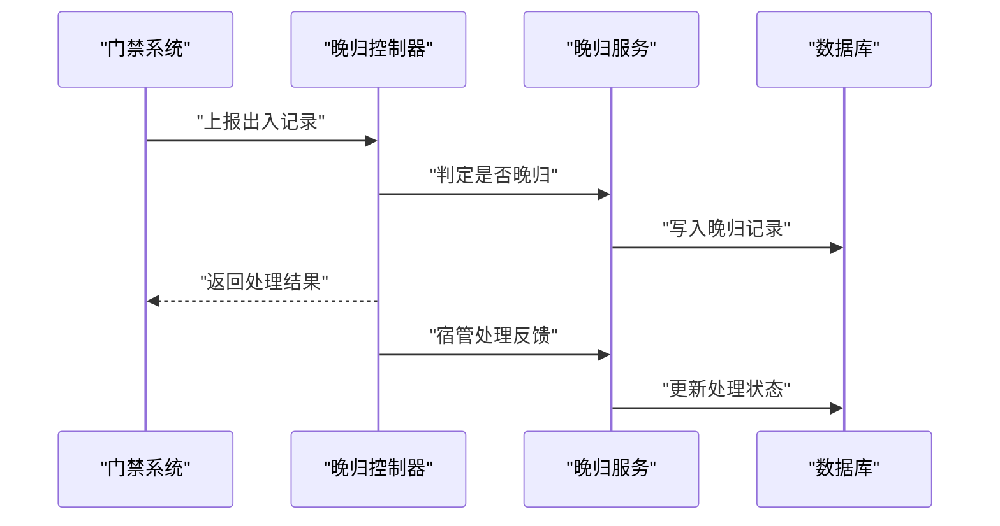
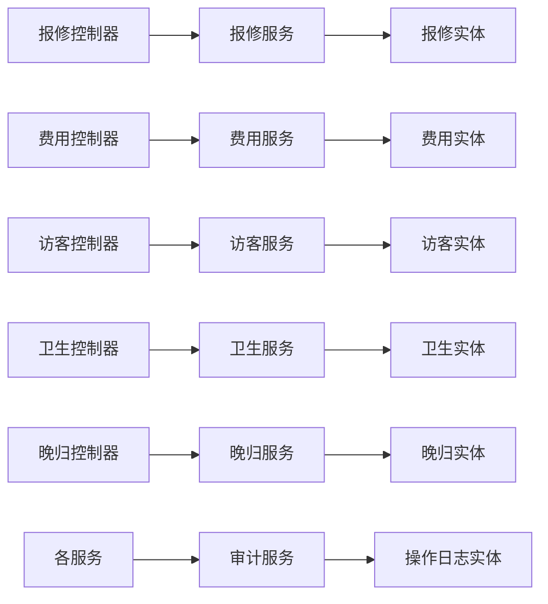

# 服务功能模块

<cite>
**本文引用的文件**
- [RepairRequestController.java](file://backend/src/main/java/com/dorm/backend/controller/RepairRequestController.java)
- [RepairRequestServiceImpl.java](file://backend/src/main/java/com/dorm/backend/service/impl/RepairRequestServiceImpl.java)
- [RepairRequestService.java](file://backend/src/main/java/com/dorm/backend/service/RepairRequestService.java)
- [RepairRequest.java](file://backend/src/main/java/com/dorm/backend/entity/RepairRequest.java)
- [RepairStatusEnum.java](file://backend/src/main/java/com/dorm/backend/enums/RepairStatusEnum.java)
- [FeeBillController.java](file://backend/src/main/java/com/dorm/backend/controller/FeeBillController.java)
- [FeeBillServiceImpl.java](file://backend/src/main/java/com/dorm/backend/service/impl/FeeBillServiceImpl.java)
- [FeeBillService.java](file://backend/src/main/java/com/dorm/backend/service/FeeBillService.java)
- [FeeBill.java](file://backend/src/main/java/com/dorm/backend/entity/FeeBill.java)
- [FeeStatusEnum.java](file://backend/src/main/java/com/dorm/backend/enums/FeeStatusEnum.java)
- [VisitorRecordController.java](file://backend/src/main/java/com/dorm/backend/controller/VisitorRecordController.java)
- [VisitorRecordServiceImpl.java](file://backend/src/main/java/com/dorm/backend/service/impl/VisitorRecordServiceImpl.java)
- [VisitorRecordService.java](file://backend/src/main/java/com/dorm/backend/service/VisitorRecordService.java)
- [VisitorRecord.java](file://backend/src/main/java/com/dorm/backend/entity/VisitorRecord.java)
- [HygieneRecordController.java](file://backend/src/main/java/com/dorm/backend/controller/HygieneRecordController.java)
- [HygieneRecordServiceImpl.java](file://backend/src/main/java/com/dorm/backend/service/impl/HygieneRecordServiceImpl.java)
- [HygieneRecordService.java](file://backend/src/main/java/com/dorm/backend/service/HygieneRecordService.java)
- [HygieneRecord.java](file://backend/src/main/java/com/dorm/backend/entity/HygieneRecord.java)
- [LateReturnRecordController.java](file://backend/src/main/java/com/dorm/backend/controller/LateReturnRecordController.java)
- [LateReturnRecordServiceImpl.java](file://backend/src/main/java/com/dorm/backend/service/impl/LateReturnRecordServiceImpl.java)
- [LateReturnRecordService.java](file://backend/src/main/java/com/dorm/backend/service/LateReturnRecordService.java)
- [LateReturnRecord.java](file://backend/src/main/java/com/dorm/backend/entity/LateReturnRecord.java)
- [GlobalExceptionHandler.java](file://backend/src/main/java/com/dorm/backend/common/GlobalExceptionHandler.java)
- [OperationLogController.java](file://backend/src/main/java/com/dorm/backend/controller/OperationLogController.java)
- [OperationLogServiceImpl.java](file://backend/src/main/java/com/dorm/backend/service/impl/OperationLogServiceImpl.java)
- [OperationLogService.java](file://backend/src/main/java/com/dorm/backend/service/OperationLogService.java)
- [OperationLog.java](file://backend/src/main/java/com/dorm/backend/entity/OperationLog.java)
- [logback-spring.xml](file://backend/src/main/resources/logback-spring.xml)
- [application.yml](file://backend/src/main/resources/application.yml)
- [schema.sql](file://backend/src/main/resources/schema.sql)
</cite>

## 目录
1. [简介](#简介)
2. [项目结构](#项目结构)
3. [核心组件](#核心组件)
4. [架构总览](#架构总览)
5. [详细组件分析](#详细组件分析)
6. [依赖关系分析](#依赖关系分析)
7. [性能考虑](#性能考虑)
8. [故障排查指南](#故障排查指南)
9. [结论](#结论)
10. [附录](#附录)

## 简介
本文件面向Dorm-Sys的服务功能模块，聚焦报修服务、费用管理、访客管理、卫生检查、晚归记录五大业务域。文档从请求发起、审批流转到结果反馈的全链路视角，阐述各服务的业务流程、状态管理、通知机制与统计分析能力；同时给出接口使用示例与最佳实践，并覆盖错误处理、日志记录与监控告警机制，最后提供扩展与自定义开发指导。

## 项目结构
后端采用典型的分层架构：控制器层负责HTTP接口编排，服务层封装业务逻辑，实体层定义数据模型，枚举层统一状态码，Mapper层对接持久化，配置与通用组件支撑鉴权、异常处理与审计。前端通过API模块调用后端接口，页面视图按角色（学生、宿管、管理员）组织。

图表来源
- [RepairRequestController.java](file://backend/src/main/java/com/dorm/backend/controller/RepairRequestController.java)
- [FeeBillController.java](file://backend/src/main/java/com/dorm/backend/controller/FeeBillController.java)
- [VisitorRecordController.java](file://backend/src/main/java/com/dorm/backend/controller/VisitorRecordController.java)
- [HygieneRecordController.java](file://backend/src/main/java/com/dorm/backend/controller/HygieneRecordController.java)
- [LateReturnRecordController.java](file://backend/src/main/java/com/dorm/backend/controller/LateReturnRecordController.java)
- [application.yml](file://backend/src/main/resources/application.yml)

章节来源
- [application.yml](file://backend/src/main/resources/application.yml)
- [schema.sql](file://backend/src/main/resources/schema.sql)

## 核心组件
本节概述五个服务模块的公共结构与职责边界：
- 控制器：暴露RESTful接口，参数校验、权限控制、统一响应封装。
- 服务：实现领域流程、状态机、事务与跨表关联。
- 实体：映射数据库表结构，承载字段约束与基础校验。
- 枚举：集中定义业务状态值，保证一致性。
- 持久化：MyBatis Mapper及XML，完成SQL映射与批量操作。

章节来源
- [RepairRequestController.java](file://backend/src/main/java/com/dorm/backend/controller/RepairRequestController.java)
- [RepairRequestServiceImpl.java](file://backend/src/main/java/com/dorm/backend/service/impl/RepairRequestServiceImpl.java)
- [RepairRequestService.java](file://backend/src/main/java/com/dorm/backend/service/RepairRequestService.java)
- [RepairRequest.java](file://backend/src/main/java/com/dorm/backend/entity/RepairRequest.java)
- [RepairStatusEnum.java](file://backend/src/main/java/com/dorm/backend/enums/RepairStatusEnum.java)
- [FeeBillController.java](file://backend/src/main/java/com/dorm/backend/controller/FeeBillController.java)
- [FeeBillServiceImpl.java](file://backend/src/main/java/com/dorm/backend/service/impl/FeeBillServiceImpl.java)
- [FeeBillService.java](file://backend/src/main/java/com/dorm/backend/service/FeeBillService.java)
- [FeeBill.java](file://backend/src/main/java/com/dorm/backend/entity/FeeBill.java)
- [FeeStatusEnum.java](file://backend/src/main/java/com/dorm/backend/enums/FeeStatusEnum.java)
- [VisitorRecordController.java](file://backend/src/main/java/com/dorm/backend/controller/VisitorRecordController.java)
- [VisitorRecordServiceImpl.java](file://backend/src/main/java/com/dorm/backend/service/impl/VisitorRecordServiceImpl.java)
- [VisitorRecordService.java](file://backend/src/main/java/com/dorm/backend/service/VisitorRecordService.java)
- [VisitorRecord.java](file://backend/src/main/java/com/dorm/backend/entity/VisitorRecord.java)
- [HygieneRecordController.java](file://backend/src/main/java/com/dorm/backend/controller/HygieneRecordController.java)
- [HygieneRecordServiceImpl.java](file://backend/src/main/java/com/dorm/backend/service/impl/HygieneRecordServiceImpl.java)
- [HygieneRecordService.java](file://backend/src/main/java/com/dorm/backend/service/HygieneRecordService.java)
- [HygieneRecord.java](file://backend/src/main/java/com/dorm/backend/entity/HygieneRecord.java)
- [LateReturnRecordController.java](file://backend/src/main/java/com/dorm/backend/controller/LateReturnRecordController.java)
- [LateReturnRecordServiceImpl.java](file://backend/src/main/java/com/dorm/backend/service/impl/LateReturnRecordServiceImpl.java)
- [LateReturnRecordService.java](file://backend/src/main/java/com/dorm/backend/service/LateReturnRecordService.java)
- [LateReturnRecord.java](file://backend/src/main/java/com/dorm/backend/entity/LateReturnRecord.java)

## 架构总览
下图展示五个服务在系统内的交互与数据流向，强调“请求—服务—持久化—审计”的主路径以及跨服务的数据依赖。

图表来源
- [RepairRequestController.java](file://backend/src/main/java/com/dorm/backend/controller/RepairRequestController.java)
- [FeeBillController.java](file://backend/src/main/java/com/dorm/backend/controller/FeeBillController.java)
- [VisitorRecordController.java](file://backend/src/main/java/com/dorm/backend/controller/VisitorRecordController.java)
- [HygieneRecordController.java](file://backend/src/main/java/com/dorm/backend/controller/HygieneRecordController.java)
- [LateReturnRecordController.java](file://backend/src/main/java/com/dorm/backend/controller/LateReturnRecordController.java)
- [OperationLogController.java](file://backend/src/main/java/com/dorm/backend/controller/OperationLogController.java)
- [OperationLogServiceImpl.java](file://backend/src/main/java/com/dorm/backend/service/impl/OperationLogServiceImpl.java)
- [OperationLogService.java](file://backend/src/main/java/com/dorm/backend/service/OperationLogService.java)
- [OperationLog.java](file://backend/src/main/java/com/dorm/backend/entity/OperationLog.java)

## 详细组件分析

### 报修服务
- 业务目标：学生提交报修单，宿管或管理员审核、派工、处理与验收，形成闭环。
- 关键实体与状态：报修单实体包含房间、申请人、问题描述、优先级等；状态枚举涵盖待审核、已派工、处理中、已完成、已关闭等。
- 工作流：
  - 提交：创建报修单，默认状态为待审核。
  - 审核：管理员或宿管审核通过后进入派工阶段。
  - 处理：维修人员更新进度，完成后标记完成。
  - 反馈：申请人确认或评价，必要时回退至处理中。
- 统计与分析：按房间、类型、时间维度统计报修量、平均处理时长、完成率。
- 通知机制：状态变更时触发站内消息或短信通知（可扩展）。
- 接口示例（概念性）：
  - 提交报修：POST /api/repair/apply
  - 查询列表：GET /api/repair/list?status=...&room=...
  - 审核通过：PUT /api/repair/approve/{id}
  - 处理更新：PUT /api/repair/update/{id}
  - 完成确认：PUT /api/repair/complete/{id}
- 最佳实践：
  - 使用事务确保状态流转原子性。
  - 对敏感操作进行权限与范围校验（如仅允许本人或管辖房间）。
  - 记录操作日志便于追溯。

图表来源
- [RepairRequestController.java](file://backend/src/main/java/com/dorm/backend/controller/RepairRequestController.java)
- [RepairRequestServiceImpl.java](file://backend/src/main/java/com/dorm/backend/service/impl/RepairRequestServiceImpl.java)
- [RepairRequestService.java](file://backend/src/main/java/com/dorm/backend/service/RepairRequestService.java)
- [RepairRequest.java](file://backend/src/main/java/com/dorm/backend/entity/RepairRequest.java)
- [RepairStatusEnum.java](file://backend/src/main/java/com/dorm/backend/enums/RepairStatusEnum.java)

章节来源
- [RepairRequestController.java](file://backend/src/main/java/com/dorm/backend/controller/RepairRequestController.java)
- [RepairRequestServiceImpl.java](file://backend/src/main/java/com/dorm/backend/service/impl/RepairRequestServiceImpl.java)
- [RepairRequestService.java](file://backend/src/main/java/com/dorm/backend/service/RepairRequestService.java)
- [RepairRequest.java](file://backend/src/main/java/com/dorm/backend/entity/RepairRequest.java)
- [RepairStatusEnum.java](file://backend/src/main/java/com/dorm/backend/enums/RepairStatusEnum.java)

### 费用管理
- 业务目标：生成账单、支付、核销、欠费提醒与统计。
- 关键实体与状态：账单实体包含金额、周期、类型、截止日期等；状态枚举涵盖未支付、部分支付、已支付、逾期等。
- 工作流：
  - 生成：按月或学期批量生成账单。
  - 支付：用户在线支付后回调更新状态。
  - 核销：财务核对后归档。
  - 提醒：逾期自动发送提醒。
- 统计与分析：按宿舍楼、年级、欠费率、收缴率统计。
- 接口示例（概念性）：
  - 生成账单：POST /api/fee/generate
  - 查询账单：GET /api/fee/list?type=...&status=...
  - 支付回调：POST /api/fee/pay/callback
  - 导出报表：GET /api/fee/export
- 最佳实践：
  - 支付回调幂等处理，避免重复入账。
  - 使用分布式锁防止并发修改同一账单。
  - 定时任务驱动生成与提醒。

图表来源
- [FeeBillController.java](file://backend/src/main/java/com/dorm/backend/controller/FeeBillController.java)
- [FeeBillServiceImpl.java](file://backend/src/main/java/com/dorm/backend/service/impl/FeeBillServiceImpl.java)
- [FeeBillService.java](file://backend/src/main/java/com/dorm/backend/service/FeeBillService.java)
- [FeeBill.java](file://backend/src/main/java/com/dorm/backend/entity/FeeBill.java)
- [FeeStatusEnum.java](file://backend/src/main/java/com/dorm/backend/enums/FeeStatusEnum.java)

章节来源
- [FeeBillController.java](file://backend/src/main/java/com/dorm/backend/controller/FeeBillController.java)
- [FeeBillServiceImpl.java](file://backend/src/main/java/com/dorm/backend/service/impl/FeeBillServiceImpl.java)
- [FeeBillService.java](file://backend/src/main/java/com/dorm/backend/service/FeeBillService.java)
- [FeeBill.java](file://backend/src/main/java/com/dorm/backend/entity/FeeBill.java)
- [FeeStatusEnum.java](file://backend/src/main/java/com/dorm/backend/enums/FeeStatusEnum.java)

### 访客管理
- 业务目标：登记访客信息、预约入宿、门禁放行与离宿记录。
- 关键实体：访客记录包含访客姓名、证件号、被访人、时间段、状态等。
- 工作流：
  - 预约：学生发起访客预约，宿管审核。
  - 核验：门禁扫码或人工核验，状态变更为已入内。
  - 离宿：自动或手动标记离宿。
- 统计与分析：按楼栋、时段、访客类型统计流量与合规率。
- 接口示例（概念性）：
  - 预约访客：POST /api/visitor/apply
  - 审核访客：PUT /api/visitor/approve/{id}
  - 核验入内：PUT /api/visitor/checkin/{id}
  - 查询记录：GET /api/visitor/list?date=...&building=...
- 最佳实践：
  - 预约时间冲突检测。
  - 敏感信息脱敏存储与传输。
  - 与门禁系统对接需具备重试与补偿机制。

图表来源
- [VisitorRecordController.java](file://backend/src/main/java/com/dorm/backend/controller/VisitorRecordController.java)
- [VisitorRecordServiceImpl.java](file://backend/src/main/java/com/dorm/backend/service/impl/VisitorRecordServiceImpl.java)
- [VisitorRecordService.java](file://backend/src/main/java/com/dorm/backend/service/VisitorRecordService.java)
- [VisitorRecord.java](file://backend/src/main/java/com/dorm/backend/entity/VisitorRecord.java)

章节来源
- [VisitorRecordController.java](file://backend/src/main/java/com/dorm/backend/controller/VisitorRecordController.java)
- [VisitorRecordServiceImpl.java](file://backend/src/main/java/com/dorm/backend/service/impl/VisitorRecordServiceImpl.java)
- [VisitorRecordService.java](file://backend/src/main/java/com/dorm/backend/service/VisitorRecordService.java)
- [VisitorRecord.java](file://backend/src/main/java/com/dorm/backend/entity/VisitorRecord.java)

### 卫生检查
- 业务目标：定期开展宿舍卫生评分、整改通知与复查闭环。
- 关键实体：卫生记录包含宿舍号、检查日期、评分、评语、整改要求、复查结果等。
- 工作流：
  - 计划：制定检查计划并下发。
  - 检查：宿管现场打分并上传评语。
  - 整改：不合格宿舍限期整改。
  - 复查：复查合格后归档。
- 统计与分析：按楼栋、班级、月度趋势分析卫生质量。
- 接口示例（概念性）：
  - 创建检查：POST /api/hygiene/create
  - 提交评分：PUT /api/hygiene/score/{id}
  - 整改通知：PUT /api/hygiene/remind/{id}
  - 复查归档：PUT /api/hygiene/recheck/{id}
- 最佳实践：
  - 评分规则可配置化。
  - 支持批量导入/导出检查结果。
  - 与通知系统集成推送整改提醒。

图表来源
- [HygieneRecordController.java](file://backend/src/main/java/com/dorm/backend/controller/HygieneRecordController.java)
- [HygieneRecordServiceImpl.java](file://backend/src/main/java/com/dorm/backend/service/impl/HygieneRecordServiceImpl.java)
- [HygieneRecordService.java](file://backend/src/main/java/com/dorm/backend/service/HygieneRecordService.java)
- [HygieneRecord.java](file://backend/src/main/java/com/dorm/backend/entity/HygieneRecord.java)

章节来源
- [HygieneRecordController.java](file://backend/src/main/java/com/dorm/backend/controller/HygieneRecordController.java)
- [HygieneRecordServiceImpl.java](file://backend/src/main/java/com/dorm/backend/service/impl/HygieneRecordServiceImpl.java)
- [HygieneRecordService.java](file://backend/src/main/java/com/dorm/backend/service/HygieneRecordService.java)
- [HygieneRecord.java](file://backend/src/main/java/com/dorm/backend/entity/HygieneRecord.java)

### 晚归记录
- 业务目标：记录学生晚归情况，进行预警、通报与教育闭环。
- 关键实体：晚归记录包含学生、宿舍、时间、原因、处理状态等。
- 工作流：
  - 采集：门禁或宿管上报晚归事件。
  - 判定：超过阈值标记为晚归。
  - 处理：宿管联系学生并记录处理意见。
  - 归档：形成教育记录。
- 统计与分析：按宿舍、月份统计晚归率与趋势。
- 接口示例（概念性）：
  - 上报晚归：POST /api/latereturn/report
  - 查询记录：GET /api/latereturn/list?date=...&dorm=...
  - 处理反馈：PUT /api/latereturn/process/{id}
  - 导出报表：GET /api/latereturn/export
- 最佳实践：
  - 与门禁系统数据同步需去重与容错。
  - 支持批量导入历史数据。
  - 预警阈值可配置。

图表来源
- [LateReturnRecordController.java](file://backend/src/main/java/com/dorm/backend/controller/LateReturnRecordController.java)
- [LateReturnRecordServiceImpl.java](file://backend/src/main/java/com/dorm/backend/service/impl/LateReturnRecordServiceImpl.java)
- [LateReturnRecordService.java](file://backend/src/main/java/com/dorm/backend/service/LateReturnRecordService.java)
- [LateReturnRecord.java](file://backend/src/main/java/com/dorm/backend/entity/LateReturnRecord.java)

章节来源
- [LateReturnRecordController.java](file://backend/src/main/java/com/dorm/backend/controller/LateReturnRecordController.java)
- [LateReturnRecordServiceImpl.java](file://backend/src/main/java/com/dorm/backend/service/impl/LateReturnRecordServiceImpl.java)
- [LateReturnRecordService.java](file://backend/src/main/java/com/dorm/backend/service/LateReturnRecordService.java)
- [LateReturnRecord.java](file://backend/src/main/java/com/dorm/backend/entity/LateReturnRecord.java)

## 依赖关系分析
- 控制器与服务：每个业务域均遵循“控制器→服务→持久化”的单向依赖，降低耦合。
- 服务与实体/枚举：服务层组合实体与枚举，保证领域语义一致。
- 审计与日志：所有写操作建议通过审计服务记录操作日志，便于追踪与审计。
- 外部集成：访客门禁、支付回调、门禁数据同步等外部系统通过适配器或服务网关接入。

图表来源
- [RepairRequestController.java](file://backend/src/main/java/com/dorm/backend/controller/RepairRequestController.java)
- [FeeBillController.java](file://backend/src/main/java/com/dorm/backend/controller/FeeBillController.java)
- [VisitorRecordController.java](file://backend/src/main/java/com/dorm/backend/controller/VisitorRecordController.java)
- [HygieneRecordController.java](file://backend/src/main/java/com/dorm/backend/controller/HygieneRecordController.java)
- [LateReturnRecordController.java](file://backend/src/main/java/com/dorm/backend/controller/LateReturnRecordController.java)
- [OperationLogController.java](file://backend/src/main/java/com/dorm/backend/controller/OperationLogController.java)
- [OperationLogServiceImpl.java](file://backend/src/main/java/com/dorm/backend/service/impl/OperationLogServiceImpl.java)
- [OperationLogService.java](file://backend/src/main/java/com/dorm/backend/service/OperationLogService.java)
- [OperationLog.java](file://backend/src/main/java/com/dorm/backend/entity/OperationLog.java)

章节来源
- [OperationLogController.java](file://backend/src/main/java/com/dorm/backend/controller/OperationLogController.java)
- [OperationLogServiceImpl.java](file://backend/src/main/java/com/dorm/backend/service/impl/OperationLogServiceImpl.java)
- [OperationLogService.java](file://backend/src/main/java/com/dorm/backend/service/OperationLogService.java)
- [OperationLog.java](file://backend/src/main/java/com/dorm/backend/entity/OperationLog.java)

## 性能考虑
- 数据库层面：合理索引查询条件（如房间号、时间、状态），分页查询避免全表扫描。
- 事务边界：将状态流转与多表更新放入事务，减少锁竞争。
- 缓存策略：热点数据（如字典、配置）使用缓存，减轻数据库压力。
- 异步处理：通知、报表导出等耗时操作采用消息队列异步执行。
- 限流与降级：对外部接口（支付、门禁）增加超时与重试策略，避免雪崩。

[本节为通用性能建议，不直接分析具体文件]

## 故障排查指南
- 全局异常处理：统一捕获业务异常与系统异常，返回标准错误码与提示。
- 日志记录：基于Logback输出结构化日志，区分INFO/WARN/ERROR级别，便于检索。
- 审计追踪：通过操作日志记录关键变更，定位问题根因。
- 监控告警：结合应用指标与日志关键字，设置告警规则（如失败率、延迟、异常堆栈）。

章节来源
- [GlobalExceptionHandler.java](file://backend/src/main/java/com/dorm/backend/common/GlobalExceptionHandler.java)
- [logback-spring.xml](file://backend/src/main/resources/logback-spring.xml)
- [OperationLogController.java](file://backend/src/main/java/com/dorm/backend/controller/OperationLogController.java)
- [OperationLogServiceImpl.java](file://backend/src/main/java/com/dorm/backend/service/impl/OperationLogServiceImpl.java)
- [OperationLogService.java](file://backend/src/main/java/com/dorm/backend/service/OperationLogService.java)
- [OperationLog.java](file://backend/src/main/java/com/dorm/backend/entity/OperationLog.java)

## 结论
Dorm-Sys服务功能模块以清晰的分层架构与统一的领域模型，实现了报修、费用、访客、卫生、晚归五大核心业务的闭环管理。通过状态机、审计与日志体系，保障流程可追溯与系统可观测。建议在后续迭代中强化异步化、缓存与监控能力，提升系统稳定性与扩展性。

[本节为总结性内容，不直接分析具体文件]

## 附录
- 接口使用示例（概念性）
  - 报修：提交、查询、审核、处理、完成
  - 费用：生成、支付回调、导出
  - 访客：预约、审核、核验、查询
  - 卫生：创建、评分、整改、复查
  - 晚归：上报、查询、处理、导出
- 最佳实践清单
  - 使用事务保证一致性
  - 幂等设计避免重复处理
  - 权限与范围校验
  - 审计与日志完备
  - 外部系统容错与重试
- 扩展与自定义开发指导
  - 新增服务：复制现有控制器/服务模板，定义实体与枚举，注册路由与权限。
  - 通知扩展：抽象通知渠道接口，实现短信/邮件/站内信。
  - 统计扩展：基于维度聚合查询，提供报表导出接口。
  - 配置化：将阈值、规则、模板抽取至配置文件或配置中心。

[本节为补充说明，不直接分析具体文件]