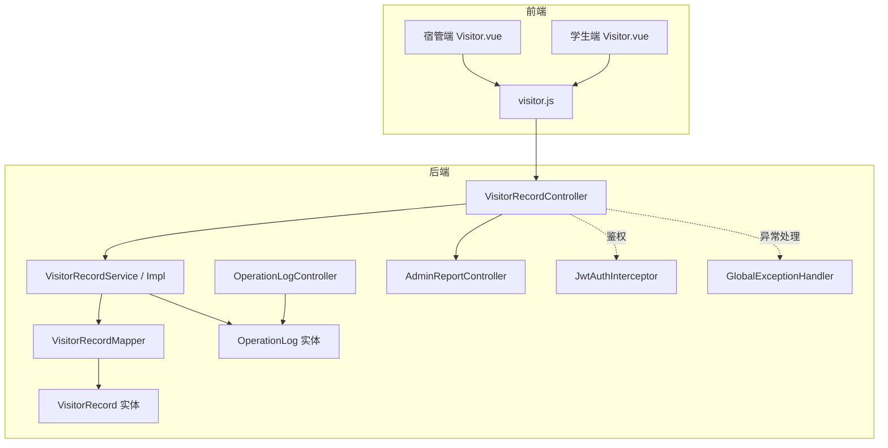
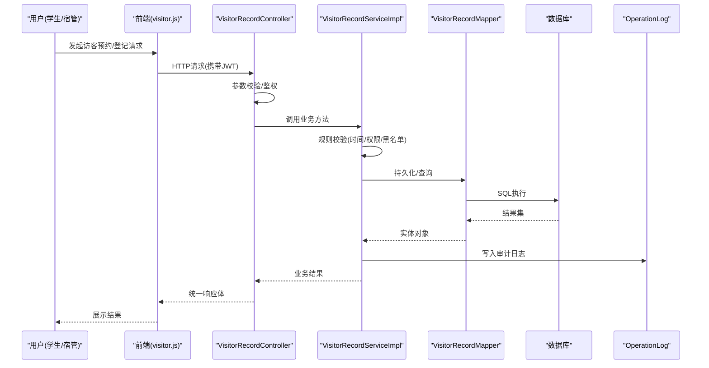
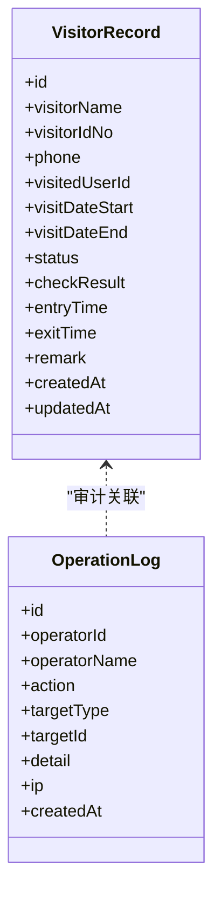
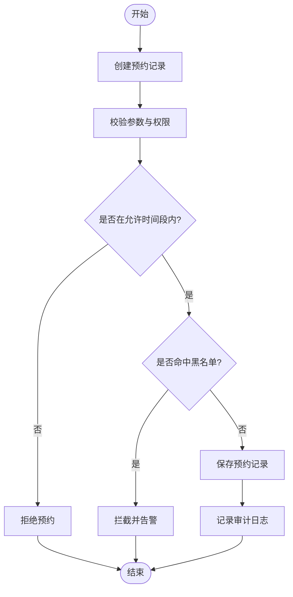
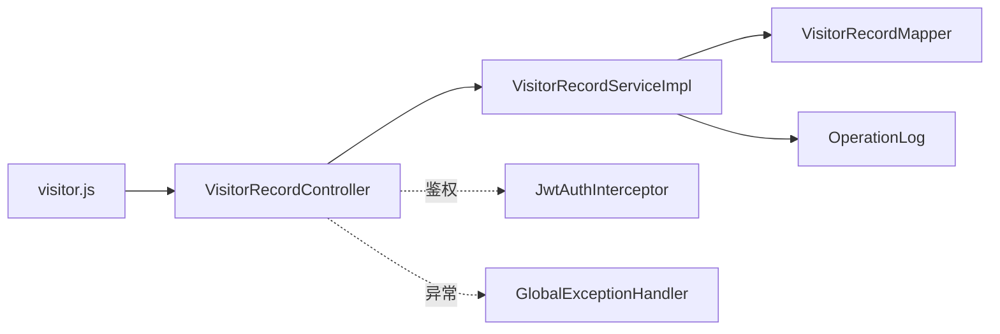

# 访客管理模块

<cite>
**本文引用的文件**   
- [VisitorRecordController.java](file://backend/src/main/java/com/dorm/backend/controller/VisitorRecordController.java)
- [VisitorRecordService.java](file://backend/src/main/java/com/dorm/backend/service/VisitorRecordService.java)
- [VisitorRecordServiceImpl.java](file://backend/src/main/java/com/dorm/backend/service/impl/VisitorRecordServiceImpl.java)
- [VisitorRecordMapper.java](file://backend/src/main/java/com/dorm/backend/mapper/VisitorRecordMapper.java)
- [VisitorRecord.java](file://backend/src/main/java/com/dorm/backend/entity/VisitorRecord.java)
- [OperationLog.java](file://backend/src/main/java/com/dorm/backend/entity/OperationLog.java)
- [OperationLogController.java](file://backend/src/main/java/com/dorm/backend/controller/OperationLogController.java)
- [AdminReportController.java](file://backend/src/main/java/com/dorm/backend/controller/AdminReportController.java)
- [JwtAuthInterceptor.java](file://backend/src/main/java/com/dorm/backend/config/JwtAuthInterceptor.java)
- [GlobalExceptionHandler.java](file://backend/src/main/java/com/dorm/backend/common/GlobalExceptionHandler.java)
- [application.yml](file://backend/src/main/resources/application.yml)
- [visitor.js](file://frontend/src/api/visitor.js)
- [Visitor.vue（宿管端）](file://frontend/src/views/manager/Visitor.vue)
- [Visitor.vue（学生端）](file://frontend/src/views/student/Visitor.vue)
</cite>

## 目录
1. [简介](#简介)
2. [项目结构](#项目结构)
3. [核心组件](#核心组件)
4. [架构总览](#架构总览)
5. [详细组件分析](#详细组件分析)
6. [依赖关系分析](#依赖关系分析)
7. [性能考虑](#性能考虑)
8. [故障排查指南](#故障排查指南)
9. [结论](#结论)
10. [附录：API接口规范与使用示例](#附录api接口规范与使用示例)

## 简介
本模块面向宿舍场景的访客管理，覆盖访客预约、登记、出入管理与安全监控全流程。重点包括：
- 访客信息验证与身份核验流程
- 安全检查机制与异常行为检测
- 权限控制、访问区域限制与时间段管理
- 访客记录的自动生成、修改与删除权限控制
- 黑名单管理、告警通知
- 与门禁系统、监控系统的数据集成
- 统计报表、出入记录与审计日志
- API接口规范与前端使用示例

## 项目结构
后端采用分层架构：Controller 暴露REST接口，Service 封装业务逻辑，Mapper 负责数据访问，Entity 定义数据模型。前端通过Vue页面与JS API调用后端接口。

图表来源
- [VisitorRecordController.java](file://backend/src/main/java/com/dorm/backend/controller/VisitorRecordController.java)
- [VisitorRecordService.java](file://backend/src/main/java/com/dorm/backend/service/VisitorRecordService.java)
- [VisitorRecordServiceImpl.java](file://backend/src/main/java/com/dorm/backend/service/impl/VisitorRecordServiceImpl.java)
- [VisitorRecordMapper.java](file://backend/src/main/java/com/dorm/backend/mapper/VisitorRecordMapper.java)
- [VisitorRecord.java](file://backend/src/main/java/com/dorm/backend/entity/VisitorRecord.java)
- [OperationLog.java](file://backend/src/main/java/com/dorm/backend/entity/OperationLog.java)
- [OperationLogController.java](file://backend/src/main/java/com/dorm/backend/controller/OperationLogController.java)
- [AdminReportController.java](file://backend/src/main/java/com/dorm/backend/controller/AdminReportController.java)
- [JwtAuthInterceptor.java](file://backend/src/main/java/com/dorm/backend/config/JwtAuthInterceptor.java)
- [GlobalExceptionHandler.java](file://backend/src/main/java/com/dorm/backend/common/GlobalExceptionHandler.java)
- [visitor.js](file://frontend/src/api/visitor.js)
- [Visitor.vue（宿管端）](file://frontend/src/views/manager/Visitor.vue)
- [Visitor.vue（学生端）](file://frontend/src/views/student/Visitor.vue)

章节来源
- [VisitorRecordController.java](file://backend/src/main/java/com/dorm/backend/controller/VisitorRecordController.java)
- [VisitorRecordService.java](file://backend/src/main/java/com/dorm/backend/service/VisitorRecordService.java)
- [VisitorRecordServiceImpl.java](file://backend/src/main/java/com/dorm/backend/service/impl/VisitorRecordServiceImpl.java)
- [VisitorRecordMapper.java](file://backend/src/main/java/com/dorm/backend/mapper/VisitorRecordMapper.java)
- [VisitorRecord.java](file://backend/src/main/java/com/dorm/backend/entity/VisitorRecord.java)
- [OperationLog.java](file://backend/src/main/java/com/dorm/backend/entity/OperationLog.java)
- [OperationLogController.java](file://backend/src/main/java/com/dorm/backend/controller/OperationLogController.java)
- [AdminReportController.java](file://backend/src/main/java/com/dorm/backend/controller/AdminReportController.java)
- [JwtAuthInterceptor.java](file://backend/src/main/java/com/dorm/backend/config/JwtAuthInterceptor.java)
- [GlobalExceptionHandler.java](file://backend/src/main/java/com/dorm/backend/common/GlobalExceptionHandler.java)
- [visitor.js](file://frontend/src/api/visitor.js)
- [Visitor.vue（宿管端）](file://frontend/src/views/manager/Visitor.vue)
- [Visitor.vue（学生端）](file://frontend/src/views/student/Visitor.vue)

## 核心组件
- 控制器层：提供访客预约、登记、出入、查询、统计等REST接口，统一返回格式与异常处理。
- 服务层：实现访客业务流程（预约校验、状态流转、时间窗口检查、权限判定、审计日志、黑名单拦截）。
- 数据访问层：基于MyBatis的Mapper接口，完成CRUD与条件查询。
- 实体层：VisitorRecord 描述访客记录；OperationLog 记录操作审计。
- 前端：宿管与学生双端页面，分别承担审批/登记与预约/查看功能。

章节来源
- [VisitorRecordController.java](file://backend/src/main/java/com/dorm/backend/controller/VisitorRecordController.java)
- [VisitorRecordService.java](file://backend/src/main/java/com/dorm/backend/service/VisitorRecordService.java)
- [VisitorRecordServiceImpl.java](file://backend/src/main/java/com/dorm/backend/service/impl/VisitorRecordServiceImpl.java)
- [VisitorRecordMapper.java](file://backend/src/main/java/com/dorm/backend/mapper/VisitorRecordMapper.java)
- [VisitorRecord.java](file://backend/src/main/java/com/dorm/backend/entity/VisitorRecord.java)
- [OperationLog.java](file://backend/src/main/java/com/dorm/backend/entity/OperationLog.java)

## 架构总览
整体遵循“前端页面 -> 前端API -> 后端Controller -> Service -> Mapper -> DB”的分层模式，并通过JWT鉴权与全局异常处理保障安全与稳定性。

图表来源
- [VisitorRecordController.java](file://backend/src/main/java/com/dorm/backend/controller/VisitorRecordController.java)
- [VisitorRecordServiceImpl.java](file://backend/src/main/java/com/dorm/backend/service/impl/VisitorRecordServiceImpl.java)
- [VisitorRecordMapper.java](file://backend/src/main/java/com/dorm/backend/mapper/VisitorRecordMapper.java)
- [OperationLog.java](file://backend/src/main/java/com/dorm/backend/entity/OperationLog.java)

## 详细组件分析

### 实体与数据模型
- VisitorRecord：存储访客基本信息、被访人、预约时段、当前状态、核验结果、进出记录、备注等。
- OperationLog：记录关键操作的审计信息，便于追溯与合规。

图表来源
- [VisitorRecord.java](file://backend/src/main/java/com/dorm/backend/entity/VisitorRecord.java)
- [OperationLog.java](file://backend/src/main/java/com/dorm/backend/entity/OperationLog.java)

章节来源
- [VisitorRecord.java](file://backend/src/main/java/com/dorm/backend/entity/VisitorRecord.java)
- [OperationLog.java](file://backend/src/main/java/com/dorm/backend/entity/OperationLog.java)

### 控制器层（VisitorRecordController）
职责：
- 暴露访客相关REST接口：预约、登记、出入登记、查询、统计、导出等。
- 统一参数校验、鉴权、异常处理与响应封装。
- 触发审计日志记录。

关键点：
- 鉴权由拦截器统一处理，未授权请求直接拒绝。
- 异常由全局处理器捕获并返回标准错误结构。

章节来源
- [VisitorRecordController.java](file://backend/src/main/java/com/dorm/backend/controller/VisitorRecordController.java)
- [JwtAuthInterceptor.java](file://backend/src/main/java/com/dorm/backend/config/JwtAuthInterceptor.java)
- [GlobalExceptionHandler.java](file://backend/src/main/java/com/dorm/backend/common/GlobalExceptionHandler.java)

### 服务层（VisitorRecordService/Impl）
职责：
- 实现访客全生命周期业务：预约创建、审核、登记、进出登记、状态变更、权限校验、时间段检查、黑名单拦截、异常检测、审计日志。
- 与Mapper交互进行数据读写。
- 对外提供统计与报表数据聚合能力。

关键流程（以预约到登记为例）：

图表来源
- [VisitorRecordServiceImpl.java](file://backend/src/main/java/com/dorm/backend/service/impl/VisitorRecordServiceImpl.java)

章节来源
- [VisitorRecordService.java](file://backend/src/main/java/com/dorm/backend/service/VisitorRecordService.java)
- [VisitorRecordServiceImpl.java](file://backend/src/main/java/com/dorm/backend/service/impl/VisitorRecordServiceImpl.java)

### 数据访问层（VisitorRecordMapper）
职责：
- 提供访客记录的增删改查与条件查询方法。
- 支持按时间段、状态、被访人、访客ID等维度筛选。

章节来源
- [VisitorRecordMapper.java](file://backend/src/main/java/com/dorm/backend/mapper/VisitorRecordMapper.java)

### 前端（visitor.js 与 Visitor.vue）
- visitor.js：封装对后端访客接口的HTTP调用，包含请求头设置、错误处理与分页参数组装。
- 宿管端 Visitor.vue：负责预约审批、现场登记、出入登记、黑名单管理、统计报表查看。
- 学生端 Visitor.vue：负责发起预约、查看预约状态、查看出入记录。

章节来源
- [visitor.js](file://frontend/src/api/visitor.js)
- [Visitor.vue（宿管端）](file://frontend/src/views/manager/Visitor.vue)
- [Visitor.vue（学生端）](file://frontend/src/views/student/Visitor.vue)

## 依赖关系分析
- Controller 依赖 Service 进行业务编排，依赖拦截器进行鉴权，依赖全局异常处理器进行错误收敛。
- Service 依赖 Mapper 进行数据访问，依赖审计实体记录操作轨迹。
- 前端依赖 JS API 模块，页面组件负责交互与展示。

图表来源
- [visitor.js](file://frontend/src/api/visitor.js)
- [VisitorRecordController.java](file://backend/src/main/java/com/dorm/backend/controller/VisitorRecordController.java)
- [VisitorRecordServiceImpl.java](file://backend/src/main/java/com/dorm/backend/service/impl/VisitorRecordServiceImpl.java)
- [VisitorRecordMapper.java](file://backend/src/main/java/com/dorm/backend/mapper/VisitorRecordMapper.java)
- [OperationLog.java](file://backend/src/main/java/com/dorm/backend/entity/OperationLog.java)
- [JwtAuthInterceptor.java](file://backend/src/main/java/com/dorm/backend/config/JwtAuthInterceptor.java)
- [GlobalExceptionHandler.java](file://backend/src/main/java/com/dorm/backend/common/GlobalExceptionHandler.java)

章节来源
- [VisitorRecordController.java](file://backend/src/main/java/com/dorm/backend/controller/VisitorRecordController.java)
- [VisitorRecordServiceImpl.java](file://backend/src/main/java/com/dorm/backend/service/impl/VisitorRecordServiceImpl.java)
- [VisitorRecordMapper.java](file://backend/src/main/java/com/dorm/backend/mapper/VisitorRecordMapper.java)
- [OperationLog.java](file://backend/src/main/java/com/dorm/backend/entity/OperationLog.java)
- [visitor.js](file://frontend/src/api/visitor.js)

## 性能考虑
- 查询优化：在常用查询字段（如预约时间、状态、被访人ID）建立索引，避免全表扫描。
- 分页与限流：列表接口默认分页，避免一次性加载大量数据；必要时对高频接口做限流。
- 缓存策略：热点数据（如黑名单、时间段配置）可引入缓存减少数据库压力。
- 异步处理：耗时操作（如生成报表、发送告警）建议异步化，提升响应速度。
- 连接池：合理配置数据库连接池大小与超时，避免连接耗尽。

[本节为通用指导，不直接分析具体文件]

## 故障排查指南
常见问题与定位思路：
- 鉴权失败：检查JWT令牌是否有效、过期或权限不足；确认拦截器配置是否正确。
- 参数校验失败：核对请求体字段类型、必填项与取值范围。
- 业务规则拒绝：检查时间段、权限、黑名单匹配逻辑；查看审计日志定位原因。
- 数据库异常：检查SQL语句、索引与连接池配置；查看慢查询日志。
- 前端报错：检查网络请求、跨域配置与错误提示映射。

章节来源
- [JwtAuthInterceptor.java](file://backend/src/main/java/com/dorm/backend/config/JwtAuthInterceptor.java)
- [GlobalExceptionHandler.java](file://backend/src/main/java/com/dorm/backend/common/GlobalExceptionHandler.java)
- [application.yml](file://backend/src/main/resources/application.yml)

## 结论
访客管理模块通过清晰的分层架构与完善的业务规则，实现了从预约、登记到出入与安全监控的闭环管理。结合审计日志、黑名单与异常检测，提升了安全性与可追溯性。后续可在缓存、异步与监控方面进一步优化，增强系统性能与可观测性。

[本节为总结性内容，不直接分析具体文件]

## 附录：API接口规范与使用示例
说明：以下为接口分类与典型用法指引，实际字段与路径以后端实现为准。

- 预约管理
  - 创建预约：POST /api/visitor/appointment
    - 入参：访客姓名、身份证号、手机号、被访人ID、预约起止时间、备注
    - 出参：预约ID、状态、提示信息
  - 查询预约：GET /api/visitor/appointments
    - 查询条件：时间范围、状态、被访人、访客ID
    - 分页参数：page、size
  - 取消预约：PUT /api/visitor/appointment/{id}/cancel

- 登记与出入
  - 现场登记：POST /api/visitor/checkin
    - 入参：预约ID、核验结果、入场时间、安检结果
  - 出场登记：POST /api/visitor/checkout
    - 入参：预约ID、离场时间、备注
  - 查询出入记录：GET /api/visitor/access-records
    - 查询条件：时间范围、预约ID、访客ID

- 权限与区域
  - 权限校验：在预约与登记时校验角色与访问区域，越权将返回拒绝
  - 时间段管理：超出允许时间段将拒绝预约或登记

- 黑名单与告警
  - 黑名单管理：新增/移除/查询黑名单
  - 异常检测：重复预约、频繁出入、黑名单命中触发告警

- 统计与审计
  - 统计报表：GET /api/admin/report/visitor
    - 维度：日期、楼栋、房间、访客类型
  - 审计日志：GET /api/admin/logs
    - 过滤：操作人、操作类型、目标类型、时间范围

- 使用示例（前端）
  - 发起预约：调用 visitor.js 中的预约接口，传入必要字段，成功后刷新列表
  - 现场登记：选择预约记录，填写核验信息与安检结果，提交后更新状态
  - 查看报表：选择时间范围与维度，渲染图表与表格

章节来源
- [VisitorRecordController.java](file://backend/src/main/java/com/dorm/backend/controller/VisitorRecordController.java)
- [VisitorRecordService.java](file://backend/src/main/java/com/dorm/backend/service/VisitorRecordService.java)
- [VisitorRecordServiceImpl.java](file://backend/src/main/java/com/dorm/backend/service/impl/VisitorRecordServiceImpl.java)
- [visitor.js](file://frontend/src/api/visitor.js)
- [Visitor.vue（宿管端）](file://frontend/src/views/manager/Visitor.vue)
- [Visitor.vue（学生端）](file://frontend/src/views/student/Visitor.vue)
- [AdminReportController.java](file://backend/src/main/java/com/dorm/backend/controller/AdminReportController.java)
- [OperationLogController.java](file://backend/src/main/java/com/dorm/backend/controller/OperationLogController.java)