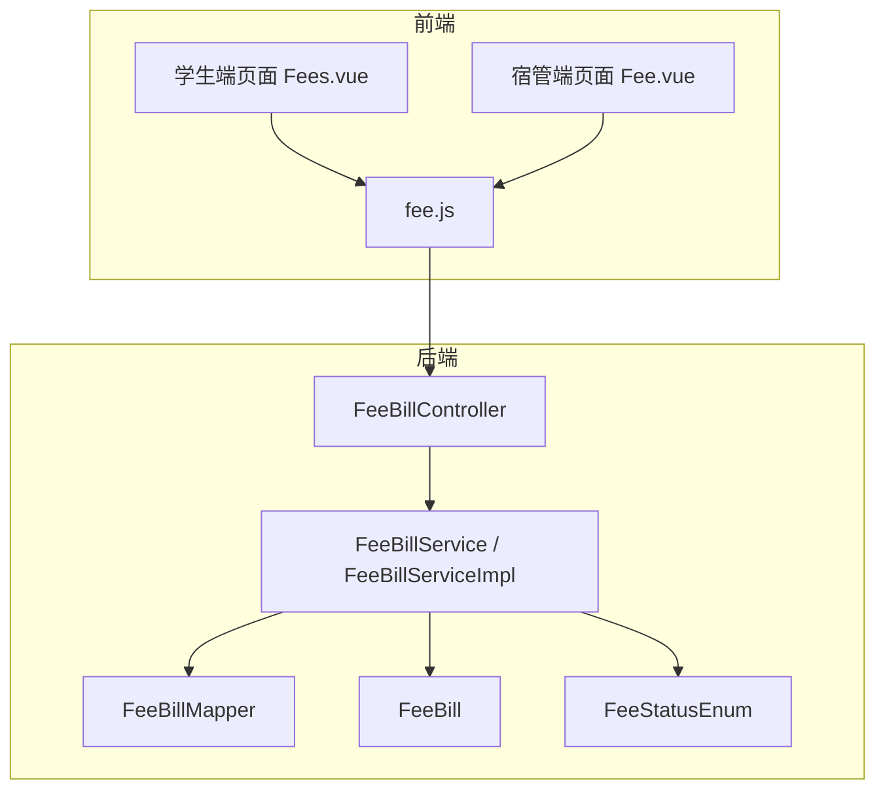
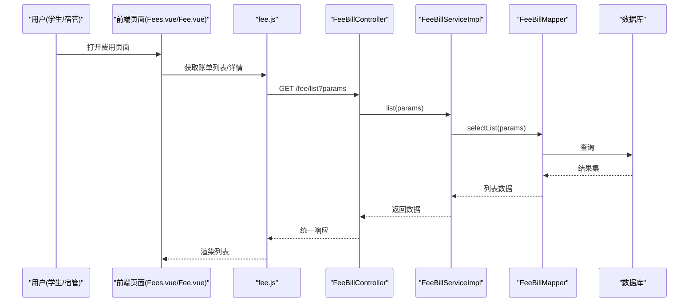
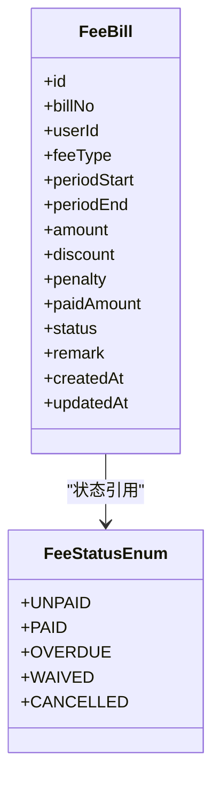
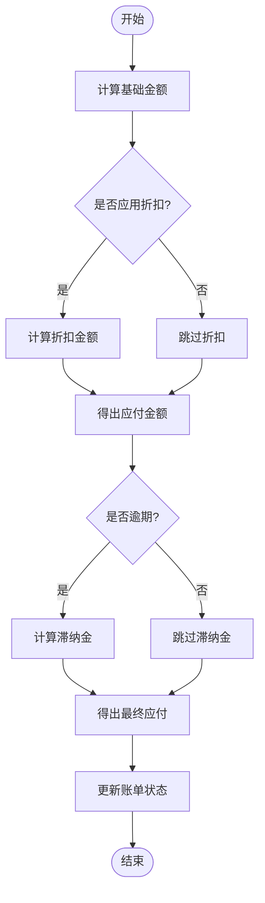
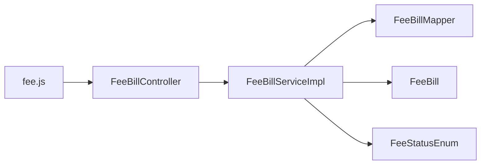

# 费用管理模块

<cite>
**本文引用的文件**   
- [FeeBillController.java](file://backend/src/main/java/com/dorm/backend/controller/FeeBillController.java)
- [FeeBillServiceImpl.java](file://backend/src/main/java/com/dorm/backend/service/impl/FeeBillServiceImpl.java)
- [FeeBillService.java](file://backend/src/main/java/com/dorm/backend/service/FeeBillService.java)
- [FeeBillMapper.java](file://backend/src/main/java/com/dorm/backend/mapper/FeeBillMapper.java)
- [FeeBill.java](file://backend/src/main/java/com/dorm/backend/entity/FeeBill.java)
- [FeeStatusEnum.java](file://backend/src/main/java/com/dorm/backend/enums/FeeStatusEnum.java)
- [fee.js](file://frontend/src/api/fee.js)
- [Fees.vue](file://frontend/src/views/student/Fees.vue)
- [Fee.vue](file://frontend/src/views/manager/Fee.vue)
</cite>

## 目录
1. [简介](#简介)
2. [项目结构](#项目结构)
3. [核心组件](#核心组件)
4. [架构总览](#架构总览)
5. [详细组件分析](#详细组件分析)
6. [依赖关系分析](#依赖关系分析)
7. [性能考虑](#性能考虑)
8. [故障排查指南](#故障排查指南)
9. [结论](#结论)
10. [附录：API 接口与使用示例](#附录api-接口与使用示例)

## 简介
本模块面向宿舍费用账单的生成、管理与支付全流程，覆盖住宿费、水电费、网费等常见费用类型；提供账单状态管理（未支付、已支付、逾期、减免等）、自动提醒机制、计费规则（含折扣与滞纳金）、批量生成、费用调整与退款处理；并与用户账户、支付系统对接，支持统计分析、报表生成与数据导出。

## 项目结构
费用管理模块在后端采用 Controller-Service-Mapper-Entity 分层架构，前端通过 API 调用与页面交互。关键文件分布如下：
- 控制器层：FeeBillController 暴露 REST 接口
- 服务层：FeeBillService 定义业务契约，FeeBillServiceImpl 实现具体逻辑
- 数据访问层：FeeBillMapper 负责数据库操作
- 实体与枚举：FeeBill 描述账单字段，FeeStatusEnum 描述账单状态
- 前端 API：fee.js 封装请求方法
- 前端页面：student/Fees.vue（学生端）、manager/Fee.vue（宿管端）

图表来源
- [FeeBillController.java](file://backend/src/main/java/com/dorm/backend/controller/FeeBillController.java)
- [FeeBillServiceImpl.java](file://backend/src/main/java/com/dorm/backend/service/impl/FeeBillServiceImpl.java)
- [FeeBillService.java](file://backend/src/main/java/com/dorm/backend/service/FeeBillService.java)
- [FeeBillMapper.java](file://backend/src/main/java/com/dorm/backend/mapper/FeeBillMapper.java)
- [FeeBill.java](file://backend/src/main/java/com/dorm/backend/entity/FeeBill.java)
- [FeeStatusEnum.java](file://backend/src/main/java/com/dorm/backend/enums/FeeStatusEnum.java)
- [fee.js](file://frontend/src/api/fee.js)
- [Fees.vue](file://frontend/src/views/student/Fees.vue)
- [Fee.vue](file://frontend/src/views/manager/Fee.vue)

章节来源
- [FeeBillController.java](file://backend/src/main/java/com/dorm/backend/controller/FeeBillController.java)
- [FeeBillServiceImpl.java](file://backend/src/main/java/com/dorm/backend/service/impl/FeeBillServiceImpl.java)
- [FeeBillService.java](file://backend/src/main/java/com/dorm/backend/service/FeeBillService.java)
- [FeeBillMapper.java](file://backend/src/main/java/com/dorm/backend/mapper/FeeBillMapper.java)
- [FeeBill.java](file://backend/src/main/java/com/dorm/backend/entity/FeeBill.java)
- [FeeStatusEnum.java](file://backend/src/main/java/com/dorm/backend/enums/FeeStatusEnum.java)
- [fee.js](file://frontend/src/api/fee.js)
- [Fees.vue](file://frontend/src/views/student/Fees.vue)
- [Fee.vue](file://frontend/src/views/manager/Fee.vue)

## 核心组件
- 控制器层（FeeBillController）
  - 职责：接收 HTTP 请求，参数校验，调用服务层，返回统一响应体
  - 典型能力：分页查询、按条件筛选、创建账单、更新状态、批量生成、导出报表
- 服务层（FeeBillService / FeeBillServiceImpl）
  - 职责：编排计费规则、状态流转、通知触发、事务边界控制
  - 典型能力：计算金额（含折扣与滞纳金）、批量生成、调整与退款、统计汇总
- 数据访问层（FeeBillMapper）
  - 职责：SQL 映射与复杂查询
  - 典型能力：分页、多条件筛选、聚合统计、批量插入
- 实体与枚举（FeeBill, FeeStatusEnum）
  - 职责：持久化模型与状态枚举
  - 典型能力：字段约束、状态机定义

章节来源
- [FeeBillController.java](file://backend/src/main/java/com/dorm/backend/controller/FeeBillController.java)
- [FeeBillService.java](file://backend/src/main/java/com/dorm/backend/service/FeeBillService.java)
- [FeeBillServiceImpl.java](file://backend/src/main/java/com/dorm/backend/service/impl/FeeBillServiceImpl.java)
- [FeeBillMapper.java](file://backend/src/main/java/com/dorm/backend/mapper/FeeBillMapper.java)
- [FeeBill.java](file://backend/src/main/java/com/dorm/backend/entity/FeeBill.java)
- [FeeStatusEnum.java](file://backend/src/main/java/com/dorm/backend/enums/FeeStatusEnum.java)

## 架构总览
费用管理模块遵循“请求-控制-服务-数据”的标准链路，前端通过 fee.js 发起请求，控制器进行鉴权与参数校验后交由服务层处理，服务层组合计费规则、状态机与通知策略，最终通过 Mapper 完成数据读写。

图表来源
- [FeeBillController.java](file://backend/src/main/java/com/dorm/backend/controller/FeeBillController.java)
- [FeeBillServiceImpl.java](file://backend/src/main/java/com/dorm/backend/service/impl/FeeBillServiceImpl.java)
- [FeeBillMapper.java](file://backend/src/main/java/com/dorm/backend/mapper/FeeBillMapper.java)
- [fee.js](file://frontend/src/api/fee.js)
- [Fees.vue](file://frontend/src/views/student/Fees.vue)
- [Fee.vue](file://frontend/src/views/manager/Fee.vue)

## 详细组件分析

### 实体与状态模型（FeeBill、FeeStatusEnum）
- 费用类型
  - 住宿费：按床位/房间周期计费
  - 水电费：按用量或固定额度计费
  - 网费：按套餐或时长计费
- 账单关键字段
  - 账单编号、关联用户、费用类型、计费周期、应缴金额、实收金额、折扣、滞纳金、状态、备注、创建/更新时间
- 状态机
  - 未支付、已支付、逾期、减免、作废等
  - 状态转换受时间、支付回调、管理员操作驱动

图表来源
- [FeeBill.java](file://backend/src/main/java/com/dorm/backend/entity/FeeBill.java)
- [FeeStatusEnum.java](file://backend/src/main/java/com/dorm/backend/enums/FeeStatusEnum.java)

章节来源
- [FeeBill.java](file://backend/src/main/java/com/dorm/backend/entity/FeeBill.java)
- [FeeStatusEnum.java](file://backend/src/main/java/com/dorm/backend/enums/FeeStatusEnum.java)

### 服务层：计费规则与状态流转（FeeBillService / FeeBillServiceImpl）
- 计费规则
  - 基础金额 = 单价 × 数量/天数/用量
  - 折扣 = 比例或固定减免
  - 滞纳金 = 逾期天数 × 日利率 × 应缴金额
- 状态流转
  - 未支付 → 已支付（支付成功回调）
  - 未支付 → 逾期（超过缴费期限）
  - 未支付/逾期 → 减免（管理员审批）
  - 任意 → 作废（异常场景）
- 批量生成
  - 按用户+费用类型+周期批量创建账单
- 调整与退款
  - 调整：修改应缴金额并记录原因
  - 退款：对已支付账单进行部分或全额退款，回写实收金额与状态

图表来源
- [FeeBillServiceImpl.java](file://backend/src/main/java/com/dorm/backend/service/impl/FeeBillServiceImpl.java)
- [FeeBillService.java](file://backend/src/main/java/com/dorm/backend/service/FeeBillService.java)

章节来源
- [FeeBillService.java](file://backend/src/main/java/com/dorm/backend/service/FeeBillService.java)
- [FeeBillServiceImpl.java](file://backend/src/main/java/com/dorm/backend/service/impl/FeeBillServiceImpl.java)

### 控制器层：REST 接口（FeeBillController）
- 主要能力
  - 分页查询与筛选：支持按用户、类型、状态、周期范围
  - 创建账单：单条或批量
  - 更新状态：支付确认、标记逾期、减免、作废
  - 导出报表：CSV/Excel（由服务层组装数据）
- 安全与校验
  - 鉴权拦截、参数校验、权限控制（学生仅查看本人，宿管可管理范围内）

章节来源
- [FeeBillController.java](file://backend/src/main/java/com/dorm/backend/controller/FeeBillController.java)

### 数据访问层（FeeBillMapper）
- 典型操作
  - 分页查询、多条件筛选、聚合统计（总额、应收、实收、逾期率）
  - 批量插入（批量生成账单）
  - 更新状态与金额（支付、调整、退款）

章节来源
- [FeeBillMapper.java](file://backend/src/main/java/com/dorm/backend/mapper/FeeBillMapper.java)

### 前端集成（fee.js、Fees.vue、Fee.vue）
- fee.js
  - 封装请求方法：getFeeList、getFeeDetail、createFee、updateFeeStatus、exportReport 等
- student/Fees.vue
  - 展示学生个人账单列表、详情、支付入口、逾期提示
- manager/Fee.vue
  - 宿管批量生成、审核减免、导出报表、统计看板

章节来源
- [fee.js](file://frontend/src/api/fee.js)
- [Fees.vue](file://frontend/src/views/student/Fees.vue)
- [Fee.vue](file://frontend/src/views/manager/Fee.vue)

## 依赖关系分析
- 控制器依赖服务层，服务层依赖 Mapper 与实体/枚举
- 前端通过 fee.js 依赖后端接口
- 状态枚举贯穿服务与数据层，确保一致性

图表来源
- [fee.js](file://frontend/src/api/fee.js)
- [FeeBillController.java](file://backend/src/main/java/com/dorm/backend/controller/FeeBillController.java)
- [FeeBillServiceImpl.java](file://backend/src/main/java/com/dorm/backend/service/impl/FeeBillServiceImpl.java)
- [FeeBillMapper.java](file://backend/src/main/java/com/dorm/backend/mapper/FeeBillMapper.java)
- [FeeBill.java](file://backend/src/main/java/com/dorm/backend/entity/FeeBill.java)
- [FeeStatusEnum.java](file://backend/src/main/java/com/dorm/backend/enums/FeeStatusEnum.java)

章节来源
- [fee.js](file://frontend/src/api/fee.js)
- [FeeBillController.java](file://backend/src/main/java/com/dorm/backend/controller/FeeBillController.java)
- [FeeBillServiceImpl.java](file://backend/src/main/java/com/dorm/backend/service/impl/FeeBillServiceImpl.java)
- [FeeBillMapper.java](file://backend/src/main/java/com/dorm/backend/mapper/FeeBillMapper.java)
- [FeeBill.java](file://backend/src/main/java/com/dorm/backend/entity/FeeBill.java)
- [FeeStatusEnum.java](file://backend/src/main/java/com/dorm/backend/enums/FeeStatusEnum.java)

## 性能考虑
- 分页与索引
  - 列表查询必须分页，避免全表扫描
  - 为常用筛选字段建立索引（用户ID、费用类型、状态、周期起止）
- 批量操作
  - 批量生成账单使用批量插入，减少往返次数
- 缓存策略
  - 对热点统计数据（如月度应收/实收）可引入缓存
- 异步任务
  - 滞纳金计算、逾期判定、通知发送建议异步执行，降低主流程延迟

[本节为通用指导，不直接分析具体文件]

## 故障排查指南
- 常见问题
  - 账单状态不一致：检查状态转换逻辑与并发更新
  - 金额计算错误：核对折扣与滞纳金公式及精度处理
  - 批量生成失败：检查输入数据完整性与唯一性约束
  - 支付回调丢失：核对回调签名验证与幂等处理
- 定位手段
  - 查看日志输出（请求入参、中间状态、异常堆栈）
  - 使用分页与筛选快速缩小问题范围
  - 对关键路径添加断点或临时日志

章节来源
- [FeeBillServiceImpl.java](file://backend/src/main/java/com/dorm/backend/service/impl/FeeBillServiceImpl.java)
- [FeeBillController.java](file://backend/src/main/java/com/dorm/backend/controller/FeeBillController.java)

## 结论
费用管理模块以清晰的分层架构与明确的状态机为基础，实现了从计费、生成、支付到统计的全流程闭环。通过批量生成、灵活调整与退款能力，满足宿舍管理的多样化需求。建议在后续迭代中完善通知提醒、报表导出与性能优化，提升用户体验与管理效率。

[本节为总结性内容，不直接分析具体文件]

## 附录：API 接口与使用示例
以下列出费用管理相关的主要接口与前端调用方式（以功能说明为主，具体路径与方法以后端实现为准）。

- 列表查询
  - 方法：GET
  - 路径：/fee/list
  - 参数：page、size、userId、feeType、status、periodStart、periodEnd
  - 返回：分页数据（账单列表、总数）
  - 前端调用：fee.js 中的 getFeeList
  - 页面使用：Fees.vue、Fee.vue

- 详情查询
  - 方法：GET
  - 路径：/fee/detail/{id}
  - 返回：账单详情（含金额明细、状态、备注）
  - 前端调用：fee.js 中的 getFeeDetail

- 创建账单
  - 方法：POST
  - 路径：/fee/create
  - 请求体：userId、feeType、periodStart、periodEnd、amount、discount、remark
  - 返回：新建账单 ID 与状态
  - 前端调用：fee.js 中的 createFee

- 批量生成
  - 方法：POST
  - 路径：/fee/batchCreate
  - 请求体：[{userId, feeType, periodStart, periodEnd, amount, discount}]
  - 返回：生成结果（成功数、失败数、错误明细）
  - 前端调用：fee.js 中的 batchCreate

- 更新状态（支付确认）
  - 方法：PUT
  - 路径：/fee/status/pay
  - 请求体：billId、paidAmount、payTime、payMethod
  - 返回：更新后的账单状态与金额
  - 前端调用：fee.js 中的 updateFeeStatus

- 标记逾期
  - 方法：PUT
  - 路径：/fee/status/overdue
  - 请求体：billId、overdueDays、penaltyRate
  - 返回：更新后的账单状态与滞纳金
  - 前端调用：fee.js 中的 updateFeeStatus

- 减免申请与审批
  - 方法：POST
  - 路径：/fee/waive
  - 请求体：billId、waiveAmount、reason、approverId
  - 返回：审批结果与新的状态
  - 前端调用：fee.js 中的 waiveFee

- 费用调整
  - 方法：PUT
  - 路径：/fee/adjust
  - 请求体：billId、newAmount、reason
  - 返回：调整后金额与状态
  - 前端调用：fee.js 中的 adjustFee

- 退款处理
  - 方法：POST
  - 路径：/fee/refund
  - 请求体：billId、refundAmount、reason
  - 返回：退款结果与新的实收金额
  - 前端调用：fee.js 中的 refundFee

- 导出报表
  - 方法：GET/POST
  - 路径：/fee/export
  - 参数：筛选条件（同列表查询）
  - 返回：文件流（CSV/Excel）
  - 前端调用：fee.js 中的 exportReport

章节来源
- [FeeBillController.java](file://backend/src/main/java/com/dorm/backend/controller/FeeBillController.java)
- [FeeBillService.java](file://backend/src/main/java/com/dorm/backend/service/FeeBillService.java)
- [FeeBillServiceImpl.java](file://backend/src/main/java/com/dorm/backend/service/impl/FeeBillServiceImpl.java)
- [fee.js](file://frontend/src/api/fee.js)
- [Fees.vue](file://frontend/src/views/student/Fees.vue)
- [Fee.vue](file://frontend/src/views/manager/Fee.vue)