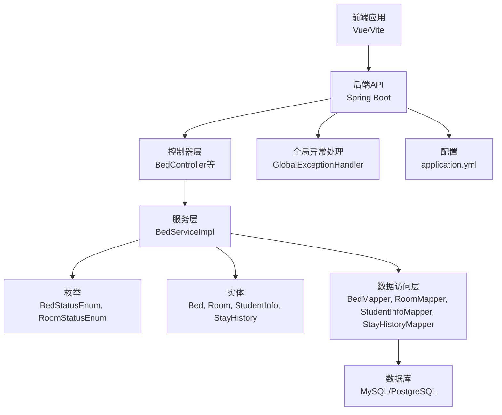
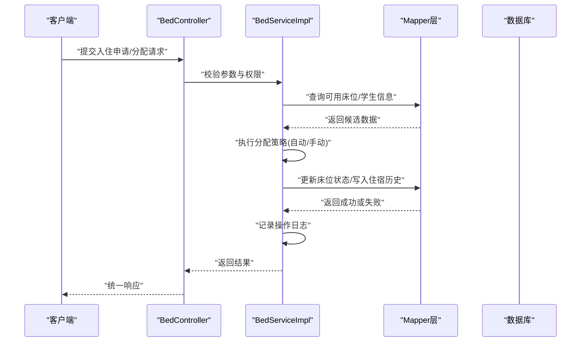
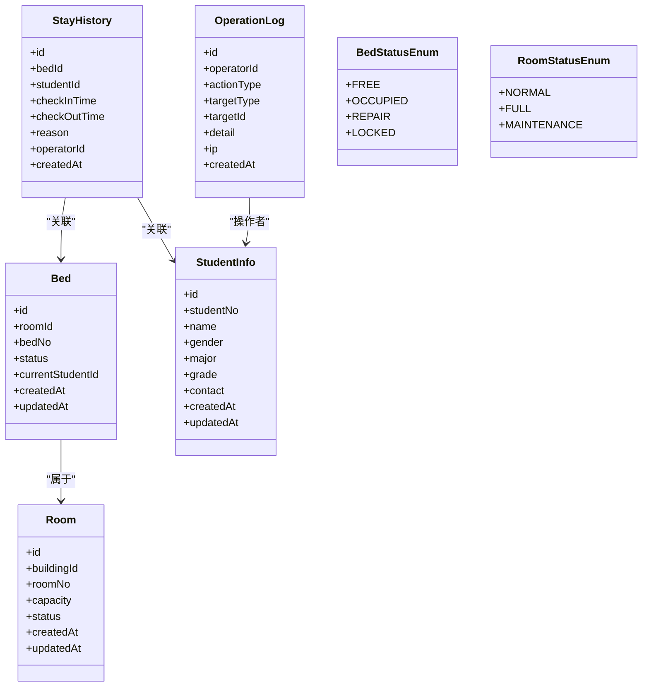
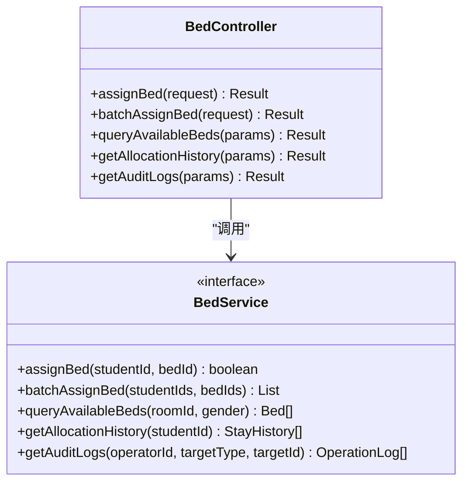
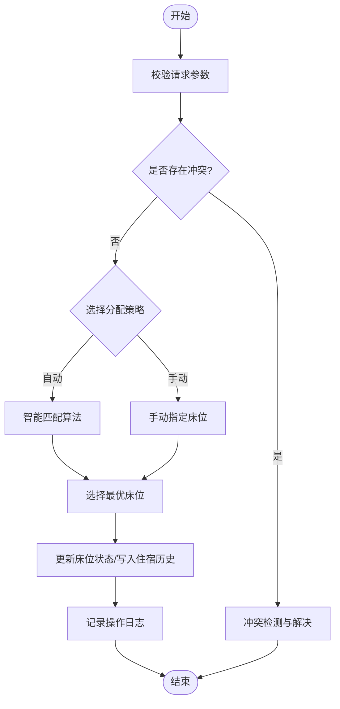
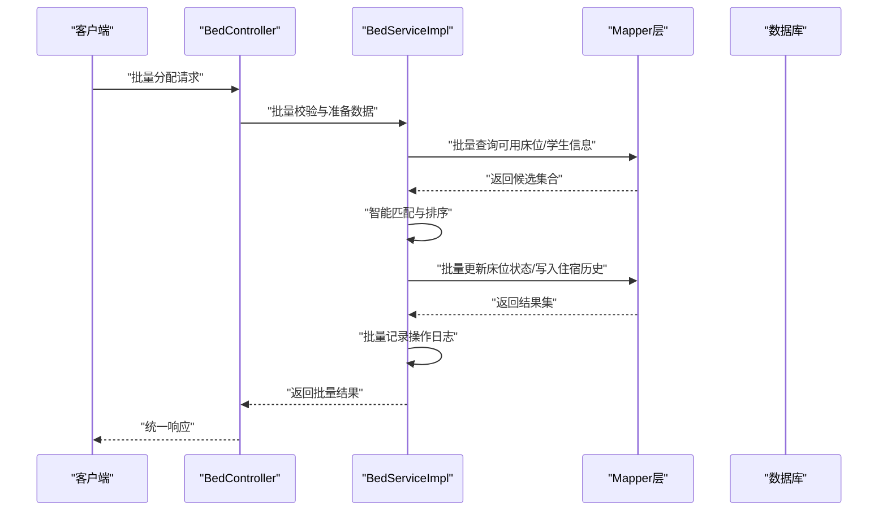
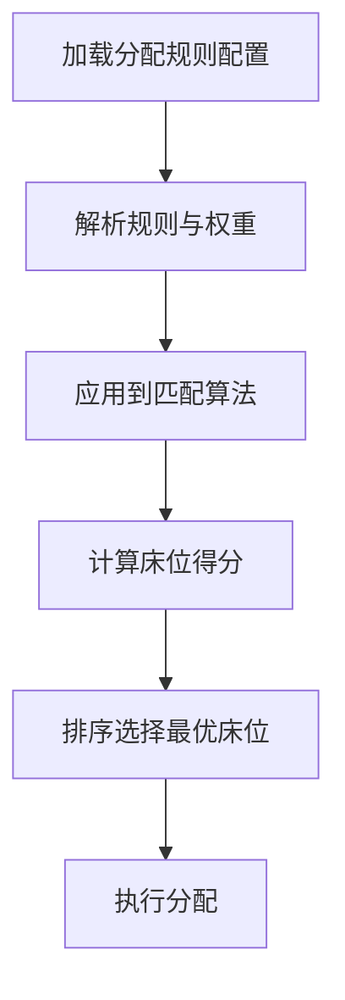
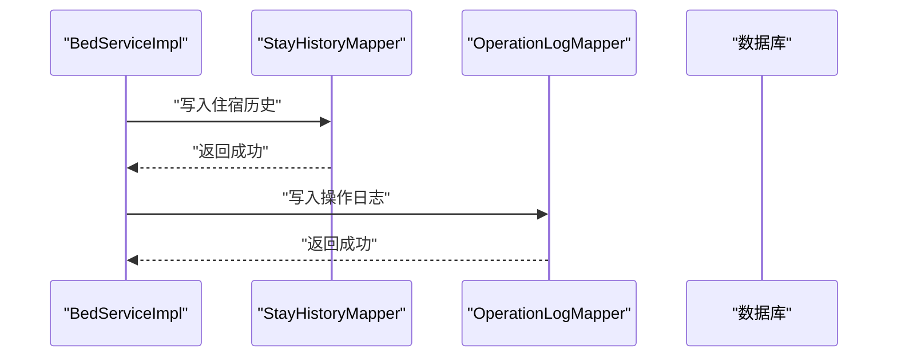
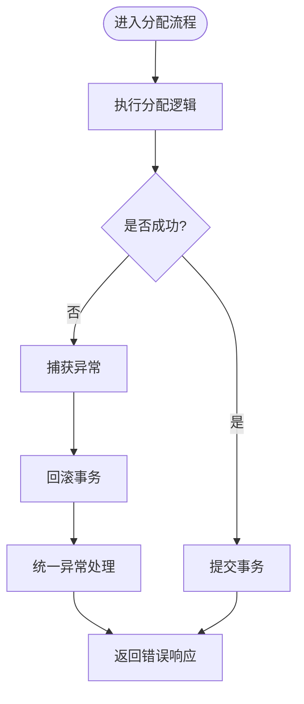
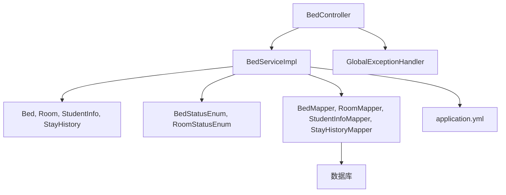

# 宿舍资源分配

<cite>
**本文引用的文件**   
- [BedController.java](file://backend/src/main/java/com/dorm/backend/controller/BedController.java)
- [BedServiceImpl.java](file://backend/src/main/java/com/dorm/backend/service/impl/BedServiceImpl.java)
- [BedService.java](file://backend/src/main/java/com/dorm/backend/service/BedService.java)
- [Bed.java](file://backend/src/main/java/com/dorm/backend/entity/Bed.java)
- [Room.java](file://backend/src/main/java/com/dorm/backend/entity/Room.java)
- [StudentInfo.java](file://backend/src/main/java/com/dorm/backend/entity/StudentInfo.java)
- [StayHistory.java](file://backend/src/main/java/com/dorm/backend/entity/StayHistory.java)
- [OperationLog.java](file://backend/src/main/java/com/dorm/backend/entity/OperationLog.java)
- [BedStatusEnum.java](file://backend/src/main/java/com/dorm/backend/enums/BedStatusEnum.java)
- [RoomStatusEnum.java](file://backend/src/main/java/com/dorm/backend/enums/RoomStatusEnum.java)
- [BedMapper.java](file://backend/src/main/java/com/dorm/backend/mapper/BedMapper.java)
- [RoomMapper.java](file://backend/src/main/java/com/dorm/backend/mapper/RoomMapper.java)
- [StudentInfoMapper.java](file://backend/src/main/java/com/dorm/backend/mapper/StudentInfoMapper.java)
- [StayHistoryMapper.java](file://backend/src/main/java/com/dorm/backend/mapper/StayHistoryMapper.java)
- [OperationLogMapper.java](file://backend/src/main/java/com/dorm/backend/mapper/OperationLogMapper.java)
- [GlobalExceptionHandler.java](file://backend/src/main/java/com/dorm/backend/common/GlobalExceptionHandler.java)
- [Result.java](file://backend/src/main/java/com/dorm/backend/common/Result.java)
- [application.yml](file://backend/src/main/resources/application.yml)
- [schema.sql](file://backend/src/main/resources/schema.sql)
</cite>

## 目录
1. [简介](#简介)
2. [项目结构](#项目结构)
3. [核心组件](#核心组件)
4. [架构总览](#架构总览)
5. [详细组件分析](#详细组件分析)
6. [依赖关系分析](#依赖关系分析)
7. [性能考虑](#性能考虑)
8. [故障排查指南](#故障排查指南)
9. [结论](#结论)
10. [附录](#附录)

## 简介
本文件面向“宿舍资源分配系统”的完整业务流程与实现说明，覆盖学生入住申请、床位分配算法（自动与手动）、批量分配、智能匹配、冲突检测与解决、规则配置与优先级、历史记录与审计追踪、异常处理与回滚机制，以及性能优化建议。文档以代码仓库为依据，结合后端控制器、服务层、实体与枚举、数据访问层及全局异常处理进行系统化阐述，帮助读者快速理解并高效使用该系统。

## 项目结构
后端采用分层架构：控制器层暴露接口，服务层封装业务逻辑（含分配策略），实体与枚举描述数据模型，Mapper 负责数据访问，全局异常处理器统一错误响应。前端提供管理端、宿管端与学生端的界面，通过 API 调用后端服务完成入住申请、分配与查询等操作。

图表来源
- [BedController.java](file://backend/src/main/java/com/dorm/backend/controller/BedController.java)
- [BedServiceImpl.java](file://backend/src/main/java/com/dorm/backend/service/impl/BedServiceImpl.java)
- [BedService.java](file://backend/src/main/java/com/dorm/backend/service/BedService.java)
- [Bed.java](file://backend/src/main/java/com/dorm/backend/entity/Bed.java)
- [Room.java](file://backend/src/main/java/com/dorm/backend/entity/Room.java)
- [StudentInfo.java](file://backend/src/main/java/com/dorm/backend/entity/StudentInfo.java)
- [StayHistory.java](file://backend/src/main/java/com/dorm/backend/entity/StayHistory.java)
- [BedStatusEnum.java](file://backend/src/main/java/com/dorm/backend/enums/BedStatusEnum.java)
- [RoomStatusEnum.java](file://backend/src/main/java/com/dorm/backend/enums/RoomStatusEnum.java)
- [BedMapper.java](file://backend/src/main/java/com/dorm/backend/mapper/BedMapper.java)
- [RoomMapper.java](file://backend/src/main/java/com/dorm/backend/mapper/RoomMapper.java)
- [StudentInfoMapper.java](file://backend/src/main/java/com/dorm/backend/mapper/StudentInfoMapper.java)
- [StayHistoryMapper.java](file://backend/src/main/java/com/dorm/backend/mapper/StayHistoryMapper.java)
- [GlobalExceptionHandler.java](file://backend/src/main/java/com/dorm/backend/common/GlobalExceptionHandler.java)
- [application.yml](file://backend/src/main/resources/application.yml)

章节来源
- [BedController.java](file://backend/src/main/java/com/dorm/backend/controller/BedController.java)
- [BedServiceImpl.java](file://backend/src/main/java/com/dorm/backend/service/impl/BedServiceImpl.java)
- [application.yml](file://backend/src/main/resources/application.yml)

## 核心组件
- 控制器层：对外暴露床位分配相关接口，包括单床分配、批量分配、查询可用床位、分配历史与审计日志等。
- 服务层：实现分配策略（自动/手动）、冲突检测、事务控制、历史记录写入与审计记录生成。
- 实体与枚举：定义床位、房间、学生、住宿历史、操作日志等数据结构；床位状态与房间状态用于约束分配流程。
- 数据访问层：提供床位、房间、学生、住宿历史、操作日志的增删改查能力。
- 全局异常处理：统一捕获业务异常与系统异常，返回标准结果对象。

章节来源
- [BedController.java](file://backend/src/main/java/com/dorm/backend/controller/BedController.java)
- [BedService.java](file://backend/src/main/java/com/dorm/backend/service/BedService.java)
- [BedServiceImpl.java](file://backend/src/main/java/com/dorm/backend/service/impl/BedServiceImpl.java)
- [Bed.java](file://backend/src/main/java/com/dorm/backend/entity/Bed.java)
- [Room.java](file://backend/src/main/java/com/dorm/backend/entity/Room.java)
- [StudentInfo.java](file://backend/src/main/java/com/dorm/backend/entity/StudentInfo.java)
- [StayHistory.java](file://backend/src/main/java/com/dorm/backend/entity/StayHistory.java)
- [OperationLog.java](file://backend/src/main/java/com/dorm/backend/entity/OperationLog.java)
- [BedStatusEnum.java](file://backend/src/main/java/com/dorm/backend/enums/BedStatusEnum.java)
- [RoomStatusEnum.java](file://backend/src/main/java/com/dorm/backend/enums/RoomStatusEnum.java)
- [BedMapper.java](file://backend/src/main/java/com/dorm/backend/mapper/BedMapper.java)
- [RoomMapper.java](file://backend/src/main/java/com/dorm/backend/mapper/RoomMapper.java)
- [StudentInfoMapper.java](file://backend/src/main/java/com/dorm/backend/mapper/StudentInfoMapper.java)
- [StayHistoryMapper.java](file://backend/src/main/java/com/dorm/backend/mapper/StayHistoryMapper.java)
- [OperationLogMapper.java](file://backend/src/main/java/com/dorm/backend/mapper/OperationLogMapper.java)
- [GlobalExceptionHandler.java](file://backend/src/main/java/com/dorm/backend/common/GlobalExceptionHandler.java)
- [Result.java](file://backend/src/main/java/com/dorm/backend/common/Result.java)

## 架构总览
系统围绕“床位”这一核心资源展开，学生在申请入住后，由服务层根据规则选择可用床位并完成分配；同时记录住宿历史与操作日志，确保可追溯。整体流程强调并发安全与一致性，避免同一床位被重复分配。

图表来源
- [BedController.java](file://backend/src/main/java/com/dorm/backend/controller/BedController.java)
- [BedServiceImpl.java](file://backend/src/main/java/com/dorm/backend/service/impl/BedServiceImpl.java)
- [BedMapper.java](file://backend/src/main/java/com/dorm/backend/mapper/BedMapper.java)
- [StayHistoryMapper.java](file://backend/src/main/java/com/dorm/backend/mapper/StayHistoryMapper.java)
- [OperationLogMapper.java](file://backend/src/main/java/com/dorm/backend/mapper/OperationLogMapper.java)

## 详细组件分析

### 床位实体与状态机
床位是资源分配的核心实体，其状态变化驱动整个分配流程。典型状态包括空闲、占用、维修中、锁定等；房间状态影响床位可用性。

图表来源
- [Bed.java](file://backend/src/main/java/com/dorm/backend/entity/Bed.java)
- [Room.java](file://backend/src/main/java/com/dorm/backend/entity/Room.java)
- [StudentInfo.java](file://backend/src/main/java/com/dorm/backend/entity/StudentInfo.java)
- [StayHistory.java](file://backend/src/main/java/com/dorm/backend/entity/StayHistory.java)
- [OperationLog.java](file://backend/src/main/java/com/dorm/backend/entity/OperationLog.java)
- [BedStatusEnum.java](file://backend/src/main/java/com/dorm/backend/enums/BedStatusEnum.java)
- [RoomStatusEnum.java](file://backend/src/main/java/com/dorm/backend/enums/RoomStatusEnum.java)

章节来源
- [Bed.java](file://backend/src/main/java/com/dorm/backend/entity/Bed.java)
- [Room.java](file://backend/src/main/java/com/dorm/backend/entity/Room.java)
- [StudentInfo.java](file://backend/src/main/java/com/dorm/backend/entity/StudentInfo.java)
- [StayHistory.java](file://backend/src/main/java/com/dorm/backend/entity/StayHistory.java)
- [OperationLog.java](file://backend/src/main/java/com/dorm/backend/entity/OperationLog.java)
- [BedStatusEnum.java](file://backend/src/main/java/com/dorm/backend/enums/BedStatusEnum.java)
- [RoomStatusEnum.java](file://backend/src/main/java/com/dorm/backend/enums/RoomStatusEnum.java)

### 分配控制器与服务接口
控制器负责接收前端请求并进行基础校验，服务接口定义分配相关的核心方法，如单床分配、批量分配、查询可用床位、分配历史与审计日志查询等。

图表来源
- [BedController.java](file://backend/src/main/java/com/dorm/backend/controller/BedController.java)
- [BedService.java](file://backend/src/main/java/com/dorm/backend/service/BedService.java)

章节来源
- [BedController.java](file://backend/src/main/java/com/dorm/backend/controller/BedController.java)
- [BedService.java](file://backend/src/main/java/com/dorm/backend/service/BedService.java)

### 分配策略与冲突检测
服务层实现自动与手动两种分配策略，并在分配前进行冲突检测，确保同一床位不会被重复分配。自动分配通常基于性别、年级、专业、楼层偏好等规则；手动分配允许管理员指定床位。

图表来源
- [BedServiceImpl.java](file://backend/src/main/java/com/dorm/backend/service/impl/BedServiceImpl.java)
- [BedStatusEnum.java](file://backend/src/main/java/com/dorm/backend/enums/BedStatusEnum.java)
- [StayHistory.java](file://backend/src/main/java/com/dorm/backend/entity/StayHistory.java)
- [OperationLog.java](file://backend/src/main/java/com/dorm/backend/entity/OperationLog.java)

章节来源
- [BedServiceImpl.java](file://backend/src/main/java/com/dorm/backend/service/impl/BedServiceImpl.java)
- [BedStatusEnum.java](file://backend/src/main/java/com/dorm/backend/enums/BedStatusEnum.java)
- [StayHistory.java](file://backend/src/main/java/com/dorm/backend/entity/StayHistory.java)
- [OperationLog.java](file://backend/src/main/java/com/dorm/backend/entity/OperationLog.java)

### 批量分配与智能匹配
批量分配支持一次为多个学生分配床位，智能匹配算法综合考虑学生属性与床位条件，优先选择同楼层、同性别、相近年级的床位，提升室友兼容性。

图表来源
- [BedController.java](file://backend/src/main/java/com/dorm/backend/controller/BedController.java)
- [BedServiceImpl.java](file://backend/src/main/java/com/dorm/backend/service/impl/BedServiceImpl.java)
- [BedMapper.java](file://backend/src/main/java/com/dorm/backend/mapper/BedMapper.java)
- [StudentInfoMapper.java](file://backend/src/main/java/com/dorm/backend/mapper/StudentInfoMapper.java)
- [StayHistoryMapper.java](file://backend/src/main/java/com/dorm/backend/mapper/StayHistoryMapper.java)
- [OperationLogMapper.java](file://backend/src/main/java/com/dorm/backend/mapper/OperationLogMapper.java)

章节来源
- [BedController.java](file://backend/src/main/java/com/dorm/backend/controller/BedController.java)
- [BedServiceImpl.java](file://backend/src/main/java/com/dorm/backend/service/impl/BedServiceImpl.java)
- [BedMapper.java](file://backend/src/main/java/com/dorm/backend/mapper/BedMapper.java)
- [StudentInfoMapper.java](file://backend/src/main/java/com/dorm/backend/mapper/StudentInfoMapper.java)
- [StayHistoryMapper.java](file://backend/src/main/java/com/dorm/backend/mapper/StayHistoryMapper.java)
- [OperationLogMapper.java](file://backend/src/main/java/com/dorm/backend/mapper/OperationLogMapper.java)

### 分配规则配置与优先级
分配规则可通过配置文件或数据库表进行自定义，支持设置性别匹配、年级/专业偏好、楼层限制、床位类型优先级等。服务层在智能匹配时读取这些规则，按权重计算最优床位。

图表来源
- [application.yml](file://backend/src/main/resources/application.yml)
- [BedServiceImpl.java](file://backend/src/main/java/com/dorm/backend/service/impl/BedServiceImpl.java)

章节来源
- [application.yml](file://backend/src/main/resources/application.yml)
- [BedServiceImpl.java](file://backend/src/main/java/com/dorm/backend/service/impl/BedServiceImpl.java)

### 历史记录与审计追踪
每次分配都会写入住宿历史与操作日志，包含操作人、目标类型、目标ID、详情、IP等信息，便于审计与回溯。

图表来源
- [BedServiceImpl.java](file://backend/src/main/java/com/dorm/backend/service/impl/BedServiceImpl.java)
- [StayHistoryMapper.java](file://backend/src/main/java/com/dorm/backend/mapper/StayHistoryMapper.java)
- [OperationLogMapper.java](file://backend/src/main/java/com/dorm/backend/mapper/OperationLogMapper.java)

章节来源
- [BedServiceImpl.java](file://backend/src/main/java/com/dorm/backend/service/impl/BedServiceImpl.java)
- [StayHistoryMapper.java](file://backend/src/main/java/com/dorm/backend/mapper/StayHistoryMapper.java)
- [OperationLogMapper.java](file://backend/src/main/java/com/dorm/backend/mapper/OperationLogMapper.java)

### 异常处理与回滚机制
全局异常处理器统一捕获业务异常与系统异常，返回标准结果对象。分配过程使用事务保证一致性，出现异常时自动回滚，确保床位状态与历史记录的一致性。

图表来源
- [GlobalExceptionHandler.java](file://backend/src/main/java/com/dorm/backend/common/GlobalExceptionHandler.java)
- [Result.java](file://backend/src/main/java/com/dorm/backend/common/Result.java)
- [BedServiceImpl.java](file://backend/src/main/java/com/dorm/backend/service/impl/BedServiceImpl.java)

章节来源
- [GlobalExceptionHandler.java](file://backend/src/main/java/com/dorm/backend/common/GlobalExceptionHandler.java)
- [Result.java](file://backend/src/main/java/com/dorm/backend/common/Result.java)
- [BedServiceImpl.java](file://backend/src/main/java/com/dorm/backend/service/impl/BedServiceImpl.java)

## 依赖关系分析
服务层依赖实体、枚举与Mapper，控制器依赖服务层，全局异常处理器拦截所有异常。数据访问层与数据库交互，配置文件提供运行时参数。

图表来源
- [BedController.java](file://backend/src/main/java/com/dorm/backend/controller/BedController.java)
- [BedServiceImpl.java](file://backend/src/main/java/com/dorm/backend/service/impl/BedServiceImpl.java)
- [Bed.java](file://backend/src/main/java/com/dorm/backend/entity/Bed.java)
- [Room.java](file://backend/src/main/java/com/dorm/backend/entity/Room.java)
- [StudentInfo.java](file://backend/src/main/java/com/dorm/backend/entity/StudentInfo.java)
- [StayHistory.java](file://backend/src/main/java/com/dorm/backend/entity/StayHistory.java)
- [BedStatusEnum.java](file://backend/src/main/java/com/dorm/backend/enums/BedStatusEnum.java)
- [RoomStatusEnum.java](file://backend/src/main/java/com/dorm/backend/enums/RoomStatusEnum.java)
- [BedMapper.java](file://backend/src/main/java/com/dorm/backend/mapper/BedMapper.java)
- [RoomMapper.java](file://backend/src/main/java/com/dorm/backend/mapper/RoomMapper.java)
- [StudentInfoMapper.java](file://backend/src/main/java/com/dorm/backend/mapper/StudentInfoMapper.java)
- [StayHistoryMapper.java](file://backend/src/main/java/com/dorm/backend/mapper/StayHistoryMapper.java)
- [GlobalExceptionHandler.java](file://backend/src/main/java/com/dorm/backend/common/GlobalExceptionHandler.java)
- [application.yml](file://backend/src/main/resources/application.yml)

章节来源
- [BedController.java](file://backend/src/main/java/com/dorm/backend/controller/BedController.java)
- [BedServiceImpl.java](file://backend/src/main/java/com/dorm/backend/service/impl/BedServiceImpl.java)
- [application.yml](file://backend/src/main/resources/application.yml)

## 性能考虑
- 并发控制：对床位分配加锁或使用乐观锁，避免重复分配。
- 索引优化：为床位号、房间号、学生学号、状态字段建立索引，提高查询效率。
- 批量操作：使用批量插入/更新减少数据库往返。
- 缓存策略：对常用规则与可用床位列表进行缓存，降低热点查询压力。
- 分页与限流：对查询接口实施分页与限流，防止大查询导致性能下降。

[本节为通用指导，不直接分析具体文件]

## 故障排查指南
- 常见错误：床位已被占用、学生信息不存在、权限不足、数据库连接失败。
- 排查步骤：检查全局异常日志、查看操作日志与住宿历史、确认床位状态与房间状态、验证配置参数。
- 回滚验证：确认事务是否正确回滚，避免部分更新导致数据不一致。

章节来源
- [GlobalExceptionHandler.java](file://backend/src/main/java/com/dorm/backend/common/GlobalExceptionHandler.java)
- [OperationLog.java](file://backend/src/main/java/com/dorm/backend/entity/OperationLog.java)
- [StayHistory.java](file://backend/src/main/java/com/dorm/backend/entity/StayHistory.java)

## 结论
宿舍资源分配系统通过清晰的分层架构与严格的冲突检测机制，实现了稳定高效的床位分配流程。自动与手动分配策略相结合，配合智能匹配与规则配置，满足多样化场景需求。完善的审计追踪与异常处理保障了系统的可追溯性与健壮性。通过性能优化建议，系统可在高并发环境下保持良好表现。

[本节为总结，不直接分析具体文件]

## 附录
- 数据库模式参考：schema.sql
- 配置文件：application.yml

章节来源
- [schema.sql](file://backend/src/main/resources/schema.sql)
- [application.yml](file://backend/src/main/resources/application.yml)