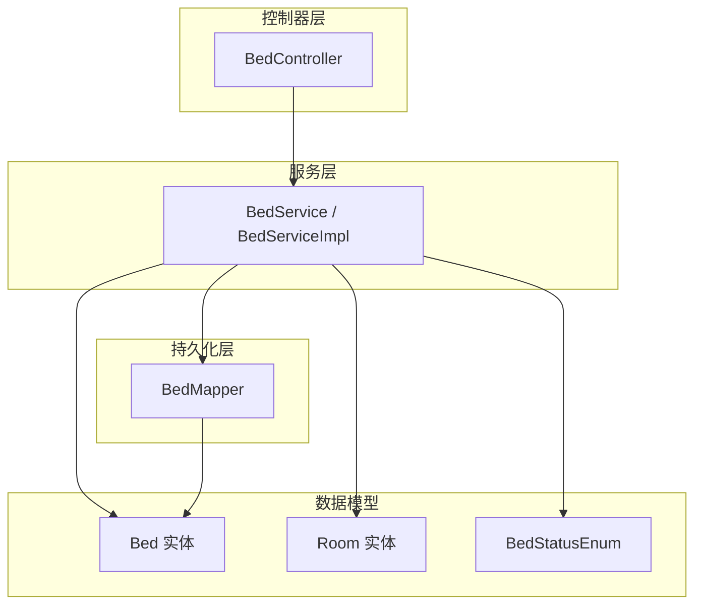
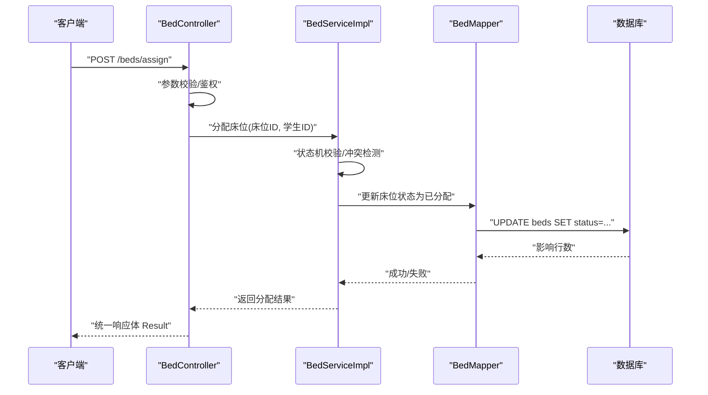
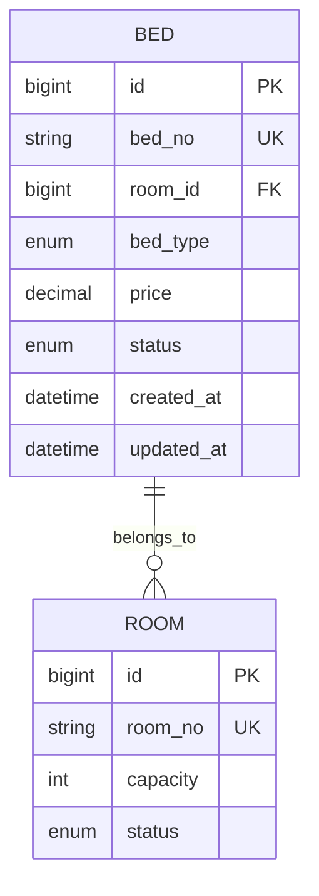
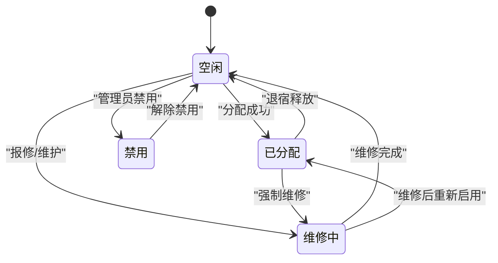
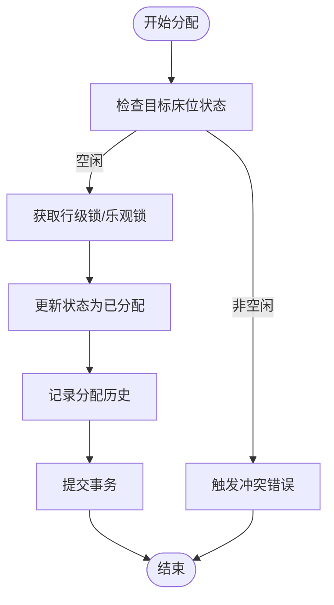
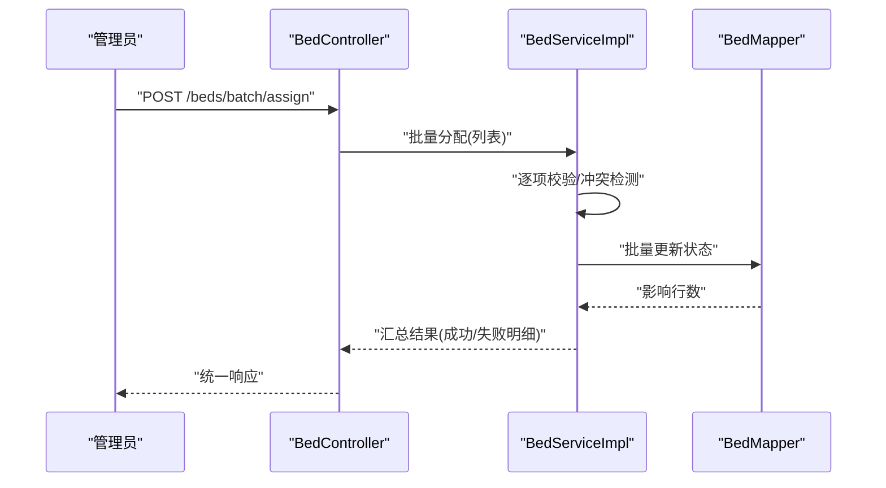
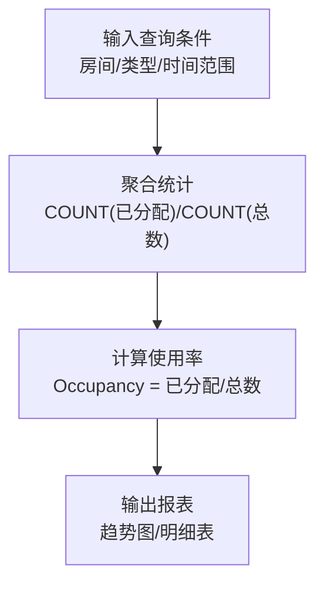
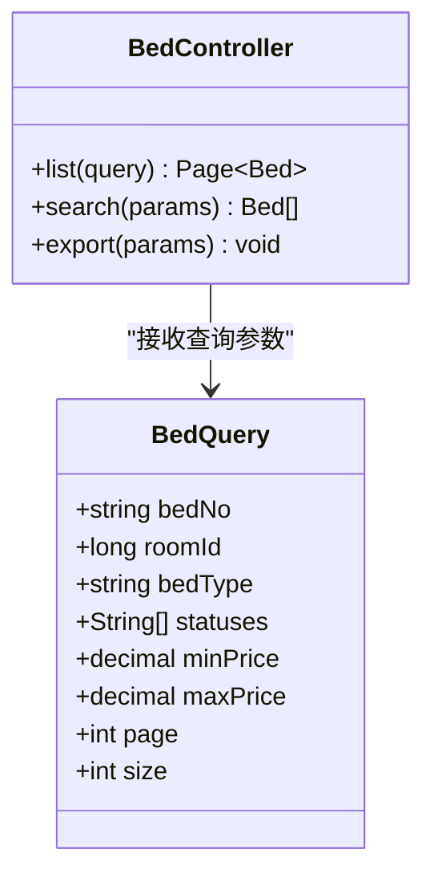
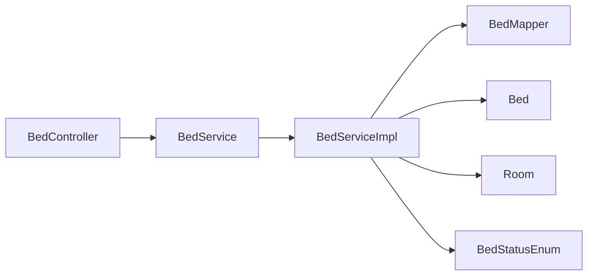

# 床位管理模块

<cite>
**本文档引用的文件**   
- [Bed.java](file://backend/src/main/java/com/dorm/backend/entity/Bed.java)
- [BedStatusEnum.java](file://backend/src/main/java/com/dorm/backend/enums/BedStatusEnum.java)
- [BedController.java](file://backend/src/main/java/com/dorm/backend/controller/BedController.java)
- [BedService.java](file://backend/src/main/java/com/dorm/backend/service/BedService.java)
- [BedServiceImpl.java](file://backend/src/main/java/com/dorm/backend/service/impl/BedServiceImpl.java)
- [BedMapper.java](file://backend/src/main/java/com/dorm/backend/mapper/BedMapper.java)
- [Room.java](file://backend/src/main/java/com/dorm/backend/entity/Room.java)
- [schema.sql](file://backend/src/main/resources/schema.sql)
</cite>

## 目录
1. [简介](#简介)
2. [项目结构](#项目结构)
3. [核心组件](#核心组件)
4. [架构总览](#架构总览)
5. [详细组件分析](#详细组件分析)
6. [依赖关系分析](#依赖关系分析)
7. [性能考虑](#性能考虑)
8. [故障排查指南](#故障排查指南)
9. [结论](#结论)
10. [附录](#附录)

## 简介
本模块围绕“床位”这一核心资源，提供床位数据模型、状态机管理、分配与冲突检测、调整与调换、批量操作、使用率统计与占用分析、查询筛选与高级搜索、以及数据同步与一致性保证等能力。目标是支撑宿舍管理系统中床位的稳定、高效、可审计的运营。

## 项目结构
床位管理相关代码采用典型的分层架构：
- 控制器层：对外暴露 REST API，负责参数校验与结果封装
- 服务层：实现业务逻辑（状态流转、冲突检测、分配策略、统计）
- 持久化层：MyBatis Mapper 接口及 SQL 映射，完成数据存取
- 实体与枚举：定义床位实体结构与状态枚举

图表来源
- [BedController.java](file://backend/src/main/java/com/dorm/backend/controller/BedController.java)
- [BedService.java](file://backend/src/main/java/com/dorm/backend/service/BedService.java)
- [BedServiceImpl.java](file://backend/src/main/java/com/dorm/backend/service/impl/BedServiceImpl.java)
- [BedMapper.java](file://backend/src/main/java/com/dorm/backend/mapper/BedMapper.java)
- [Bed.java](file://backend/src/main/java/com/dorm/backend/entity/Bed.java)
- [Room.java](file://backend/src/main/java/com/dorm/backend/entity/Room.java)
- [BedStatusEnum.java](file://backend/src/main/java/com/dorm/backend/enums/BedStatusEnum.java)

章节来源
- [BedController.java](file://backend/src/main/java/com/dorm/backend/controller/BedController.java)
- [BedService.java](file://backend/src/main/java/com/dorm/backend/service/BedService.java)
- [BedServiceImpl.java](file://backend/src/main/java/com/dorm/backend/service/impl/BedServiceImpl.java)
- [BedMapper.java](file://backend/src/main/java/com/dorm/backend/mapper/BedMapper.java)
- [Bed.java](file://backend/src/main/java/com/dorm/backend/entity/Bed.java)
- [Room.java](file://backend/src/main/java/com/dorm/backend/entity/Room.java)
- [BedStatusEnum.java](file://backend/src/main/java/com/dorm/backend/enums/BedStatusEnum.java)

## 核心组件
- 床位实体 Bed：包含床位编号、所属房间、床位类型、价格、状态、创建与更新时间等字段
- 状态枚举 BedStatusEnum：定义空闲、已分配、维修中、禁用等状态及其语义
- 控制器 BedController：提供床位 CRUD、分配、调换、批量操作、统计与查询接口
- 服务 BedService/BedServiceImpl：实现状态机、分配策略、冲突检测、统计与分析
- 持久化 BedMapper：提供床位数据的增删改查与复杂查询

章节来源
- [Bed.java](file://backend/src/main/java/com/dorm/backend/entity/Bed.java)
- [BedStatusEnum.java](file://backend/src/main/java/com/dorm/backend/enums/BedStatusEnum.java)
- [BedController.java](file://backend/src/main/java/com/dorm/backend/controller/BedController.java)
- [BedService.java](file://backend/src/main/java/com/dorm/backend/service/BedService.java)
- [BedServiceImpl.java](file://backend/src/main/java/com/dorm/backend/service/impl/BedServiceImpl.java)
- [BedMapper.java](file://backend/src/main/java/com/dorm/backend/mapper/BedMapper.java)

## 架构总览
床位管理模块遵循“控制器-服务-持久化”的分层调用链，结合 MyBatis 进行数据访问。关键流程包括：
- 请求进入 BedController，进行参数校验与权限检查
- 调用 BedService 执行业务逻辑（状态机、冲突检测、分配策略、统计）
- BedServiceImpl 通过 BedMapper 访问数据库，确保事务一致性与并发安全

图表来源
- [BedController.java](file://backend/src/main/java/com/dorm/backend/controller/BedController.java)
- [BedServiceImpl.java](file://backend/src/main/java/com/dorm/backend/service/impl/BedServiceImpl.java)
- [BedMapper.java](file://backend/src/main/java/com/dorm/backend/mapper/BedMapper.java)

## 详细组件分析

### 数据模型与字段说明
- 床位编号：唯一标识床位，用于分配与调换
- 所属房间：关联 Room 实体，体现床位与房间的归属关系
- 床位类型：如单人床、上下铺等，影响价格与容量
- 价格：按床位计费的单价或周期费用
- 状态：由 BedStatusEnum 管理，包括空闲、已分配、维修中、禁用等
- 时间戳：创建时间与更新时间，便于审计与追踪

图表来源
- [Bed.java](file://backend/src/main/java/com/dorm/backend/entity/Bed.java)
- [Room.java](file://backend/src/main/java/com/dorm/backend/entity/Room.java)
- [schema.sql](file://backend/src/main/resources/schema.sql)

章节来源
- [Bed.java](file://backend/src/main/java/com/dorm/backend/entity/Bed.java)
- [Room.java](file://backend/src/main/java/com/dorm/backend/entity/Room.java)
- [schema.sql](file://backend/src/main/resources/schema.sql)

### 状态机与生命周期
- 空闲：初始可用状态，允许分配
- 已分配：被学生占用，禁止重复分配；支持退宿释放
- 维修中：不可用，阻止分配；维修完成后恢复空闲
- 禁用：长期不可用，通常用于报废或冻结

图表来源
- [BedStatusEnum.java](file://backend/src/main/java/com/dorm/backend/enums/BedStatusEnum.java)

章节来源
- [BedStatusEnum.java](file://backend/src/main/java/com/dorm/backend/enums/BedStatusEnum.java)

### 分配策略与冲突检测
- 分配策略：优先选择同房间的空闲床位，其次跨房间匹配；支持按类型与价格过滤
- 冲突检测：在并发场景下，基于数据库行级锁或乐观锁避免重复分配
- 事务保障：分配过程在事务内执行，确保状态更新与历史记录的一致性

图表来源
- [BedServiceImpl.java](file://backend/src/main/java/com/dorm/backend/service/impl/BedServiceImpl.java)
- [BedMapper.java](file://backend/src/main/java/com/dorm/backend/mapper/BedMapper.java)

章节来源
- [BedServiceImpl.java](file://backend/src/main/java/com/dorm/backend/service/impl/BedServiceImpl.java)
- [BedMapper.java](file://backend/src/main/java/com/dorm/backend/mapper/BedMapper.java)

### 床位调整、调换与批量操作
- 调整：修改床位类型、价格、所属房间等元信息，需校验新房间容量与状态
- 调换：在学生之间交换床位，涉及双向状态回滚与历史记录
- 批量操作：批量分配、批量释放、批量变更状态，要求原子性执行与失败回滚

图表来源
- [BedController.java](file://backend/src/main/java/com/dorm/backend/controller/BedController.java)
- [BedServiceImpl.java](file://backend/src/main/java/com/dorm/backend/service/impl/BedServiceImpl.java)
- [BedMapper.java](file://backend/src/main/java/com/dorm/backend/mapper/BedMapper.java)

章节来源
- [BedController.java](file://backend/src/main/java/com/dorm/backend/controller/BedController.java)
- [BedServiceImpl.java](file://backend/src/main/java/com/dorm/backend/service/impl/BedServiceImpl.java)
- [BedMapper.java](file://backend/src/main/java/com/dorm/backend/mapper/BedMapper.java)

### 使用率统计与 Occupancy 分析
- 使用率：统计各房间/楼栋/类型的床位占用比例
- Occupancy 分析：按时间段统计入住率、空置率、平均停留时长
- 指标维度：房间、楼栋、床位类型、价格区间、状态分布

图表来源
- [BedServiceImpl.java](file://backend/src/main/java/com/dorm/backend/service/impl/BedServiceImpl.java)
- [BedMapper.java](file://backend/src/main/java/com/dorm/backend/mapper/BedMapper.java)

章节来源
- [BedServiceImpl.java](file://backend/src/main/java/com/dorm/backend/service/impl/BedServiceImpl.java)
- [BedMapper.java](file://backend/src/main/java/com/dorm/backend/mapper/BedMapper.java)

### 查询、筛选与高级搜索
- 基础查询：按 ID、编号、房间、类型、状态分页查询
- 筛选：按价格区间、状态集合、房间容量、创建时间范围过滤
- 高级搜索：组合条件、模糊匹配、排序与导出

图表来源
- [BedController.java](file://backend/src/main/java/com/dorm/backend/controller/BedController.java)

章节来源
- [BedController.java](file://backend/src/main/java/com/dorm/backend/controller/BedController.java)

### 数据同步与一致性保证
- 事务边界：分配、调换、批量操作均在事务内执行，失败回滚
- 并发控制：使用行级锁或乐观锁防止重复分配与覆盖写
- 审计日志：关键操作记录操作人、时间、前后状态，便于追溯
- 缓存一致性：如需缓存，采用失效策略或版本号机制保证最终一致

章节来源
- [BedServiceImpl.java](file://backend/src/main/java/com/dorm/backend/service/impl/BedServiceImpl.java)
- [BedMapper.java](file://backend/src/main/java/com/dorm/backend/mapper/BedMapper.java)

## 依赖关系分析
- BedController 依赖 BedService，仅处理 HTTP 交互
- BedServiceImpl 依赖 BedMapper 与实体/枚举，承载核心业务
- BedMapper 依赖数据库表结构，确保 SQL 与实体映射正确

图表来源
- [BedController.java](file://backend/src/main/java/com/dorm/backend/controller/BedController.java)
- [BedService.java](file://backend/src/main/java/com/dorm/backend/service/BedService.java)
- [BedServiceImpl.java](file://backend/src/main/java/com/dorm/backend/service/impl/BedServiceImpl.java)
- [BedMapper.java](file://backend/src/main/java/com/dorm/backend/mapper/BedMapper.java)
- [Bed.java](file://backend/src/main/java/com/dorm/backend/entity/Bed.java)
- [Room.java](file://backend/src/main/java/com/dorm/backend/entity/Room.java)
- [BedStatusEnum.java](file://backend/src/main/java/com/dorm/backend/enums/BedStatusEnum.java)

章节来源
- [BedController.java](file://backend/src/main/java/com/dorm/backend/controller/BedController.java)
- [BedService.java](file://backend/src/main/java/com/dorm/backend/service/BedService.java)
- [BedServiceImpl.java](file://backend/src/main/java/com/dorm/backend/service/impl/BedServiceImpl.java)
- [BedMapper.java](file://backend/src/main/java/com/dorm/backend/mapper/BedMapper.java)
- [Bed.java](file://backend/src/main/java/com/dorm/backend/entity/Bed.java)
- [Room.java](file://backend/src/main/java/com/dorm/backend/entity/Room.java)
- [BedStatusEnum.java](file://backend/src/main/java/com/dorm/backend/enums/BedStatusEnum.java)

## 性能考虑
- 索引优化：对 bed_no、room_id、status 建立索引，提升查询与分配效率
- 分页与限流：列表查询默认分页，避免一次性加载大量数据
- 批量操作：使用批量 SQL 减少往返次数，提高吞吐
- 缓存策略：热点数据（如房间容量、状态分布）可短期缓存，注意失效时机
- 事务粒度：尽量缩小事务范围，降低锁持有时间

[本节为通用指导，不直接分析具体文件]

## 故障排查指南
- 分配冲突：检查并发锁与状态机，确认是否存在重复分配或状态不一致
- 批量失败：查看失败明细与回滚日志，定位异常条目
- 统计偏差：核对聚合 SQL 与时间窗口，确认是否包含已删除或禁用数据
- 权限问题：确认拦截器与角色权限配置是否正确

章节来源
- [BedServiceImpl.java](file://backend/src/main/java/com/dorm/backend/service/impl/BedServiceImpl.java)
- [BedController.java](file://backend/src/main/java/com/dorm/backend/controller/BedController.java)

## 结论
床位管理模块以清晰的分层架构与严谨的状态机设计，实现了床位资源的高效分配、冲突规避与统计分析。通过事务与并发控制保证数据一致性，配合灵活的查询与批量操作满足多样化运营需求。建议持续优化索引与缓存策略，完善审计与监控，进一步提升系统稳定性与可观测性。

## 附录
- 接口示例路径参考：
  - 分配床位：BedController 中的分配方法
  - 调换床位：BedController 中的调换方法
  - 批量操作：BedController 中的批量分配/释放方法
  - 统计查询：BedController 中的使用率与 occupancy 分析方法
- 数据模型参考：
  - 床位实体：Bed.java
  - 房间实体：Room.java
  - 状态枚举：BedStatusEnum.java
  - 建表脚本：schema.sql

章节来源
- [BedController.java](file://backend/src/main/java/com/dorm/backend/controller/BedController.java)
- [BedServiceImpl.java](file://backend/src/main/java/com/dorm/backend/service/impl/BedServiceImpl.java)
- [Bed.java](file://backend/src/main/java/com/dorm/backend/entity/Bed.java)
- [Room.java](file://backend/src/main/java/com/dorm/backend/entity/Room.java)
- [BedStatusEnum.java](file://backend/src/main/java/com/dorm/backend/enums/BedStatusEnum.java)
- [schema.sql](file://backend/src/main/resources/schema.sql)