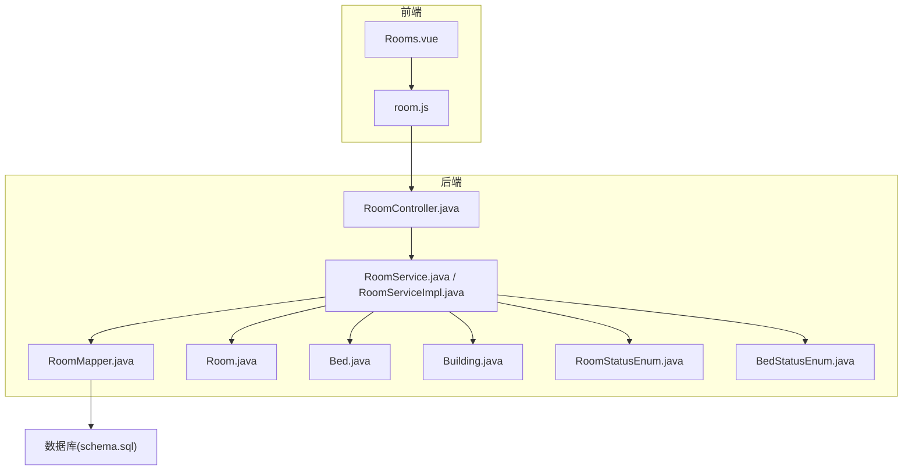
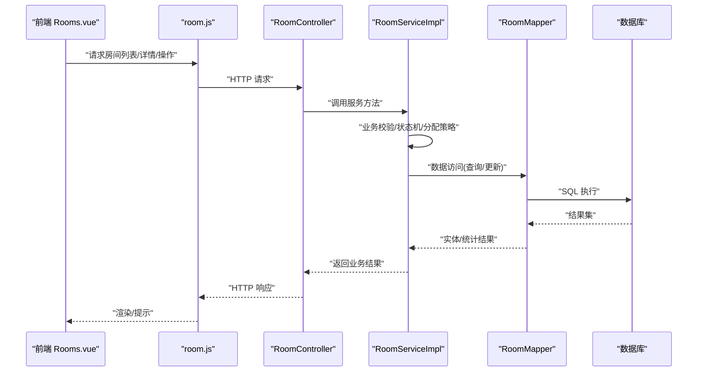
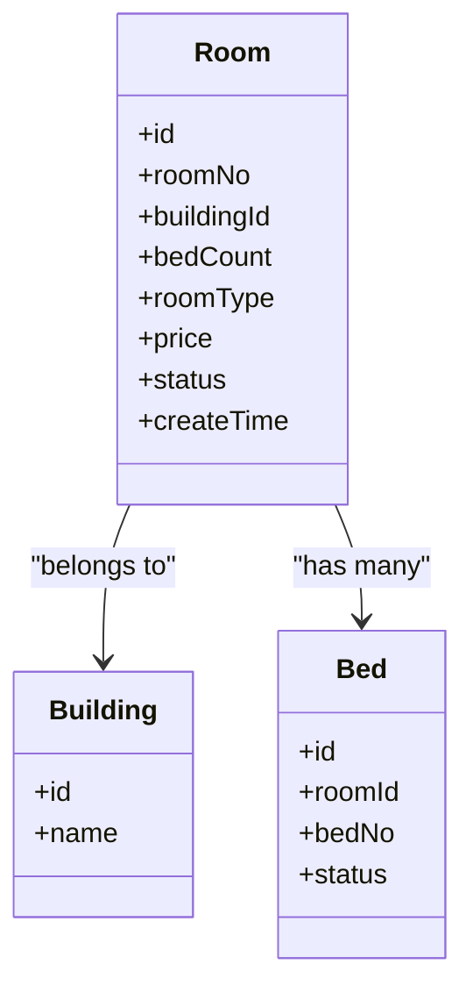
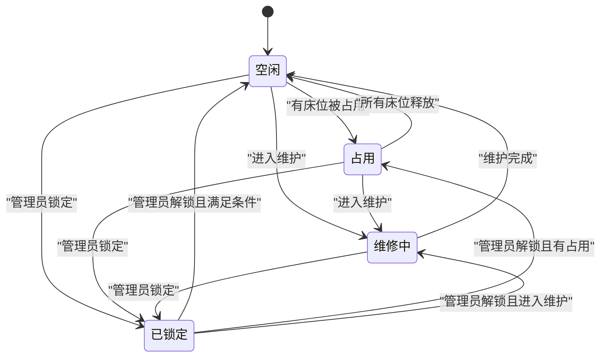
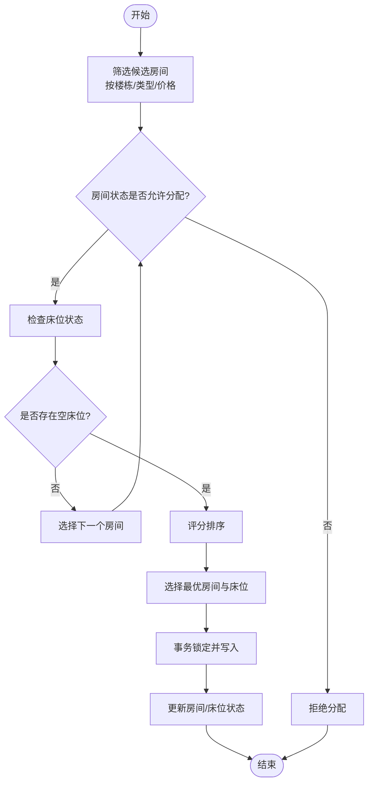
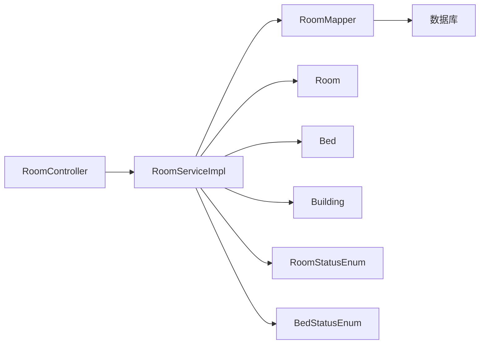

# 房间管理模块

<cite>
**本文引用的文件**   
- [Room.java](file://backend/src/main/java/com/dorm/backend/entity/Room.java)
- [RoomStatusEnum.java](file://backend/src/main/java/com/dorm/backend/enums/RoomStatusEnum.java)
- [Bed.java](file://backend/src/main/java/com/dorm/backend/entity/Bed.java)
- [BedStatusEnum.java](file://backend/src/main/java/com/dorm/backend/enums/BedStatusEnum.java)
- [Building.java](file://backend/src/main/java/com/dorm/backend/entity/Building.java)
- [RoomController.java](file://backend/src/main/java/com/dorm/backend/controller/RoomController.java)
- [RoomService.java](file://backend/src/main/java/com/dorm/backend/service/RoomService.java)
- [RoomServiceImpl.java](file://backend/src/main/java/com/dorm/backend/service/impl/RoomServiceImpl.java)
- [RoomMapper.java](file://backend/src/main/java/com/dorm/backend/mapper/RoomMapper.java)
- [RoomBatchCreateRequest.java](file://backend/src/main/java/com/dorm/backend/dto/RoomBatchCreateRequest.java)
- [schema.sql](file://backend/src/main/resources/schema.sql)
- [application.yml](file://backend/src/main/resources/application.yml)
- [room.js](file://frontend/src/api/room.js)
- [Rooms.vue](file://frontend/src/views/admin/Rooms.vue)
</cite>

## 目录
1. [简介](#简介)
2. [项目结构](#项目结构)
3. [核心组件](#核心组件)
4. [架构总览](#架构总览)
5. [详细组件分析](#详细组件分析)
6. [依赖关系分析](#依赖关系分析)
7. [性能考虑](#性能考虑)
8. [故障排查指南](#故障排查指南)
9. [结论](#结论)
10. [附录](#附录)

## 简介
本模块围绕宿舍系统中的“房间”实体，提供完整的生命周期管理与业务操作能力。文档涵盖：
- 房间实体的完整数据结构（房间号、所属楼栋、床位数量、房间类型、价格等）
- 房间状态管理机制（空闲、占用、维修中、已锁定等状态的转换规则）
- 房间分配算法与自动分配逻辑
- 批量创建、调整与维护操作实现
- 房间利用率统计与报表生成
- 搜索、筛选与分页查询的实现细节
- 数据完整性约束与业务规则验证

## 项目结构
后端采用典型的分层架构：Controller 暴露 REST API，Service 封装业务逻辑，Mapper 负责数据访问，Entity/Enum 定义数据模型与枚举。前端通过 API 调用与页面交互完成房间管理。

图表来源
- [RoomController.java](file://backend/src/main/java/com/dorm/backend/controller/RoomController.java)
- [RoomService.java](file://backend/src/main/java/com/dorm/backend/service/RoomService.java)
- [RoomServiceImpl.java](file://backend/src/main/java/com/dorm/backend/service/impl/RoomServiceImpl.java)
- [RoomMapper.java](file://backend/src/main/java/com/dorm/backend/mapper/RoomMapper.java)
- [Room.java](file://backend/src/main/java/com/dorm/backend/entity/Room.java)
- [Bed.java](file://backend/src/main/java/com/dorm/backend/entity/Bed.java)
- [Building.java](file://backend/src/main/java/com/dorm/backend/entity/Building.java)
- [RoomStatusEnum.java](file://backend/src/main/java/com/dorm/backend/enums/RoomStatusEnum.java)
- [BedStatusEnum.java](file://backend/src/main/java/com/dorm/backend/enums/BedStatusEnum.java)
- [schema.sql](file://backend/src/main/resources/schema.sql)

章节来源
- [RoomController.java](file://backend/src/main/java/com/dorm/backend/controller/RoomController.java)
- [RoomService.java](file://backend/src/main/java/com/dorm/backend/service/RoomService.java)
- [RoomServiceImpl.java](file://backend/src/main/java/com/dorm/backend/service/impl/RoomServiceImpl.java)
- [RoomMapper.java](file://backend/src/main/java/com/dorm/backend/mapper/RoomMapper.java)
- [Room.java](file://backend/src/main/java/com/dorm/backend/entity/Room.java)
- [Bed.java](file://backend/src/main/java/com/dorm/backend/entity/Bed.java)
- [Building.java](file://backend/src/main/java/com/dorm/backend/entity/Building.java)
- [RoomStatusEnum.java](file://backend/src/main/java/com/dorm/backend/enums/RoomStatusEnum.java)
- [BedStatusEnum.java](file://backend/src/main/java/com/dorm/backend/enums/BedStatusEnum.java)
- [schema.sql](file://backend/src/main/resources/schema.sql)

## 核心组件
- 房间实体与状态枚举
  - 房间实体包含房间标识、房间号、所属楼栋、床位数量、房间类型、单价、状态、创建时间等字段。
  - 房间状态枚举定义了空闲、占用、维修中、已锁定等状态及其含义。
- 床铺实体与状态枚举
  - 床铺实体关联房间，记录床位编号、状态（如空闲、占用、维修中等）。
  - 床位状态与房间状态联动，影响房间可用性判断。
- 服务层接口与实现
  - 服务层提供房间的增删改查、批量创建、状态变更、分配与释放、统计与报表等能力。
- 控制器层
  - 对外暴露房间管理的 REST 接口，包括列表查询、详情获取、新增、修改、删除、批量创建、状态更新、分配/释放、统计报表等。
- 数据访问层
  - 通过 Mapper 进行 SQL 映射，支持条件查询、分页、聚合统计等。

章节来源
- [Room.java](file://backend/src/main/java/com/dorm/backend/entity/Room.java)
- [RoomStatusEnum.java](file://backend/src/main/java/com/dorm/backend/enums/RoomStatusEnum.java)
- [Bed.java](file://backend/src/main/java/com/dorm/backend/entity/Bed.java)
- [BedStatusEnum.java](file://backend/src/main/java/com/dorm/backend/enums/BedStatusEnum.java)
- [RoomService.java](file://backend/src/main/java/com/dorm/backend/service/RoomService.java)
- [RoomServiceImpl.java](file://backend/src/main/java/com/dorm/backend/service/impl/RoomServiceImpl.java)
- [RoomController.java](file://backend/src/main/java/com/dorm/backend/controller/RoomController.java)
- [RoomMapper.java](file://backend/src/main/java/com/dorm/backend/mapper/RoomMapper.java)

## 架构总览
房间管理模块遵循前后端分离与分层设计：
- 前端页面发起请求，调用 room.js 封装的 API。
- 后端 Controller 接收请求并校验参数，委托 Service 处理业务。
- Service 组合多个领域对象（房间、床铺、楼栋），执行状态机与分配策略，调用 Mapper 持久化。
- Mapper 通过 MyBatis 与数据库交互，执行 SQL 语句。

图表来源
- [RoomController.java](file://backend/src/main/java/com/dorm/backend/controller/RoomController.java)
- [RoomServiceImpl.java](file://backend/src/main/java/com/dorm/backend/service/impl/RoomServiceImpl.java)
- [RoomMapper.java](file://backend/src/main/java/com/dorm/backend/mapper/RoomMapper.java)
- [room.js](file://frontend/src/api/room.js)
- [Rooms.vue](file://frontend/src/views/admin/Rooms.vue)

## 详细组件分析

### 房间实体与数据结构
- 关键字段说明
  - 房间号：唯一标识房间，用于检索与展示。
  - 所属楼栋：外键关联楼栋实体，支持按楼栋维度统计与筛选。
  - 床位数量：决定房间容量，影响分配策略与利用率计算。
  - 房间类型：如普通间、单人间、双人间等，影响价格与配置。
  - 价格：房间单价，用于计费与报表统计。
  - 状态：房间当前可用状态，受床位状态与业务规则影响。
  - 创建时间：记录创建时间戳，便于审计与排序。
- 数据完整性约束
  - 房间号唯一性约束，避免重复。
  - 床位数量非负且与房间类型匹配。
  - 价格非负，符合财务规范。
  - 楼栋外键存在性约束，确保归属有效。

图表来源
- [Room.java](file://backend/src/main/java/com/dorm/backend/entity/Room.java)
- [Building.java](file://backend/src/main/java/com/dorm/backend/entity/Building.java)
- [Bed.java](file://backend/src/main/java/com/dorm/backend/entity/Bed.java)

章节来源
- [Room.java](file://backend/src/main/java/com/dorm/backend/entity/Room.java)
- [Building.java](file://backend/src/main/java/com/dorm/backend/entity/Building.java)
- [Bed.java](file://backend/src/main/java/com/dorm/backend/entity/Bed.java)
- [schema.sql](file://backend/src/main/resources/schema.sql)

### 房间状态管理机制
- 状态定义
  - 空闲：房间无占用床位，可分配。
  - 占用：至少有一个床位被占用，不可新分配。
  - 维修中：房间处于维护或检修，禁止分配。
  - 已锁定：管理员手动锁定，禁止任何分配操作。
- 状态转换规则
  - 空闲 → 占用：当有学生入住时触发。
  - 占用 → 空闲：当所有床位释放后恢复。
  - 任意状态 → 维修中：进入维护流程。
  - 维修中 → 空闲：维护完成后恢复。
  - 任意状态 → 已锁定：管理员强制锁定。
  - 已锁定 → 其他状态：需管理员解锁后再按规则流转。
- 与床位状态的联动
  - 房间状态由床位状态综合判定：若任一床位为占用，则房间为占用；若全部为空闲且无锁定/维修标记，则为空闲。

图表来源
- [RoomStatusEnum.java](file://backend/src/main/java/com/dorm/backend/enums/RoomStatusEnum.java)
- [BedStatusEnum.java](file://backend/src/main/java/com/dorm/backend/enums/BedStatusEnum.java)

章节来源
- [RoomStatusEnum.java](file://backend/src/main/java/com/dorm/backend/enums/RoomStatusEnum.java)
- [BedStatusEnum.java](file://backend/src/main/java/com/dorm/backend/enums/BedStatusEnum.java)
- [RoomServiceImpl.java](file://backend/src/main/java/com/dorm/backend/service/impl/RoomServiceImpl.java)

### 房间分配算法与自动分配逻辑
- 分配目标
  - 根据学生偏好（性别、楼层、楼栋）、床位状态与房间状态，选择最优房间与床位。
- 算法步骤
  - 筛选候选房间：按楼栋、类型、价格区间过滤。
  - 检查房间状态：仅允许空闲或可转为空闲的房间。
  - 检查床位状态：优先选择空床位，避免冲突。
  - 评分与排序：基于距离、价格、历史入住率等权重打分。
  - 锁定与写入：事务内锁定床位并写入入住记录，保证一致性。
- 自动分配触发点
  - 新生报到、转寝申请审批通过、退宿后重新分配等场景。

图表来源
- [RoomServiceImpl.java](file://backend/src/main/java/com/dorm/backend/service/impl/RoomServiceImpl.java)
- [Bed.java](file://backend/src/main/java/com/dorm/backend/entity/Bed.java)
- [Room.java](file://backend/src/main/java/com/dorm/backend/entity/Room.java)

章节来源
- [RoomServiceImpl.java](file://backend/src/main/java/com/dorm/backend/service/impl/RoomServiceImpl.java)
- [Bed.java](file://backend/src/main/java/com/dorm/backend/entity/Bed.java)
- [Room.java](file://backend/src/main/java/com/dorm/backend/entity/Room.java)

### 批量创建、调整与维护操作
- 批量创建
  - 通过 DTO 传入楼栋、房间类型、床位数量、价格等模板信息，循环创建房间与床位。
  - 支持导入 Excel/CSV 批量初始化。
- 调整与维护
  - 调整床位数量：在维护窗口内进行，需校验占用情况与历史数据一致性。
  - 维护操作：设置维修中状态，记录维护日志，完成后恢复状态。
- 接口与实现
  - 控制器提供批量创建接口，服务层实现批量插入与校验，Mapper 执行批量 SQL。

章节来源
- [RoomBatchCreateRequest.java](file://backend/src/main/java/com/dorm/backend/dto/RoomBatchCreateRequest.java)
- [RoomController.java](file://backend/src/main/java/com/dorm/backend/controller/RoomController.java)
- [RoomServiceImpl.java](file://backend/src/main/java/com/dorm/backend/service/impl/RoomServiceImpl.java)
- [RoomMapper.java](file://backend/src/main/java/com/dorm/backend/mapper/RoomMapper.java)

### 房间利用率统计与报表生成
- 指标定义
  - 房间利用率 = 占用房间数 / 总房间数。
  - 床位利用率 = 占用床位数 / 总床位数。
  - 平均入住时长、空置天数分布等辅助指标。
- 数据来源
  - 房间状态、床位状态、入住/退宿历史记录。
- 报表输出
  - 支持按楼栋、房间类型、时间段聚合统计，导出 CSV/PDF。
- 实现要点
  - 使用聚合 SQL 与缓存提升性能。
  - 定时任务刷新统计数据。

章节来源
- [RoomServiceImpl.java](file://backend/src/main/java/com/dorm/backend/service/impl/RoomServiceImpl.java)
- [RoomMapper.java](file://backend/src/main/java/com/dorm/backend/mapper/RoomMapper.java)
- [schema.sql](file://backend/src/main/resources/schema.sql)

### 搜索、筛选与分页查询
- 查询条件
  - 房间号模糊匹配、楼栋 ID、房间类型、价格区间、状态、创建时间范围。
- 分页实现
  - 使用 MyBatis 分页插件或 LIMIT/OFFSET，结合排序字段。
- 前端交互
  - 表格展示、条件表单、分页控件、导出按钮。

章节来源
- [RoomController.java](file://backend/src/main/java/com/dorm/backend/controller/RoomController.java)
- [RoomServiceImpl.java](file://backend/src/main/java/com/dorm/backend/service/impl/RoomServiceImpl.java)
- [RoomMapper.java](file://backend/src/main/java/com/dorm/backend/mapper/RoomMapper.java)
- [room.js](file://frontend/src/api/room.js)
- [Rooms.vue](file://frontend/src/views/admin/Rooms.vue)

### 数据完整性约束与业务规则验证
- 完整性约束
  - 房间号唯一、楼栋外键存在、价格非负、床位数量与类型匹配。
- 业务规则
  - 维修中/已锁定房间禁止分配。
  - 占用房间释放前不允许删除。
  - 批量创建时需校验模板合法性与重复性。
- 校验位置
  - 控制器参数校验、服务层业务校验、数据库约束。

章节来源
- [RoomController.java](file://backend/src/main/java/com/dorm/backend/controller/RoomController.java)
- [RoomServiceImpl.java](file://backend/src/main/java/com/dorm/backend/service/impl/RoomServiceImpl.java)
- [schema.sql](file://backend/src/main/resources/schema.sql)

## 依赖关系分析
- 组件耦合
  - Controller 依赖 Service，Service 依赖 Entity/Enum 与 Mapper。
  - Room 与 Bed、Building 存在强关联，需在分配与状态变更时保持一致性。
- 外部依赖
  - MyBatis 用于数据访问，应用配置文件管理数据库连接与行为开关。

图表来源
- [RoomController.java](file://backend/src/main/java/com/dorm/backend/controller/RoomController.java)
- [RoomServiceImpl.java](file://backend/src/main/java/com/dorm/backend/service/impl/RoomServiceImpl.java)
- [RoomMapper.java](file://backend/src/main/java/com/dorm/backend/mapper/RoomMapper.java)
- [Room.java](file://backend/src/main/java/com/dorm/backend/entity/Room.java)
- [Bed.java](file://backend/src/main/java/com/dorm/backend/entity/Bed.java)
- [Building.java](file://backend/src/main/java/com/dorm/backend/entity/Building.java)
- [RoomStatusEnum.java](file://backend/src/main/java/com/dorm/backend/enums/RoomStatusEnum.java)
- [BedStatusEnum.java](file://backend/src/main/java/com/dorm/backend/enums/BedStatusEnum.java)
- [schema.sql](file://backend/src/main/resources/schema.sql)

章节来源
- [RoomController.java](file://backend/src/main/java/com/dorm/backend/controller/RoomController.java)
- [RoomServiceImpl.java](file://backend/src/main/java/com/dorm/backend/service/impl/RoomServiceImpl.java)
- [RoomMapper.java](file://backend/src/main/java/com/dorm/backend/mapper/RoomMapper.java)
- [application.yml](file://backend/src/main/resources/application.yml)

## 性能考虑
- 查询优化
  - 合理使用索引（房间号、楼栋 ID、状态、创建时间）。
  - 分页查询避免大偏移量，必要时使用游标或延迟关联。
- 并发控制
  - 分配与释放使用事务与行级锁，防止超卖与状态不一致。
- 统计报表
  - 预计算与缓存热点指标，定时任务异步刷新。
- I/O 优化
  - 批量插入与更新减少往返次数，使用批量 SQL。

[本节为通用指导，不直接分析具体文件]

## 故障排查指南
- 常见问题
  - 房间状态异常：检查床位状态与房间状态同步逻辑。
  - 分配失败：查看事务回滚日志与锁竞争情况。
  - 批量创建失败：校验模板数据与重复性约束。
- 定位手段
  - 启用调试日志，关注服务层关键方法调用链。
  - 检查数据库约束错误与外键冲突。
  - 前端网络请求与响应体分析。

章节来源
- [RoomServiceImpl.java](file://backend/src/main/java/com/dorm/backend/service/impl/RoomServiceImpl.java)
- [RoomController.java](file://backend/src/main/java/com/dorm/backend/controller/RoomController.java)
- [application.yml](file://backend/src/main/resources/application.yml)

## 结论
房间管理模块以清晰的分层架构与严谨的状态机为核心，提供了从基础 CRUD 到复杂分配与统计的全链路能力。通过完善的约束与校验、高效的查询与批处理、以及可扩展的报表功能，能够满足宿舍系统对房间资源的高效管理与运营需求。

[本节为总结性内容，不直接分析具体文件]

## 附录
- 相关接口与页面
  - 前端 API：room.js
  - 管理页面：Rooms.vue
  - 后端控制器：RoomController.java
  - 服务实现：RoomServiceImpl.java
  - 数据模型：Room.java、Bed.java、Building.java
  - 枚举定义：RoomStatusEnum.java、BedStatusEnum.java
  - 数据库脚本：schema.sql
  - 应用配置：application.yml

章节来源
- [room.js](file://frontend/src/api/room.js)
- [Rooms.vue](file://frontend/src/views/admin/Rooms.vue)
- [RoomController.java](file://backend/src/main/java/com/dorm/backend/controller/RoomController.java)
- [RoomServiceImpl.java](file://backend/src/main/java/com/dorm/backend/service/impl/RoomServiceImpl.java)
- [Room.java](file://backend/src/main/java/com/dorm/backend/entity/Room.java)
- [Bed.java](file://backend/src/main/java/com/dorm/backend/entity/Bed.java)
- [Building.java](file://backend/src/main/java/com/dorm/backend/entity/Building.java)
- [RoomStatusEnum.java](file://backend/src/main/java/com/dorm/backend/enums/RoomStatusEnum.java)
- [BedStatusEnum.java](file://backend/src/main/java/com/dorm/backend/enums/BedStatusEnum.java)
- [schema.sql](file://backend/src/main/resources/schema.sql)
- [application.yml](file://backend/src/main/resources/application.yml)