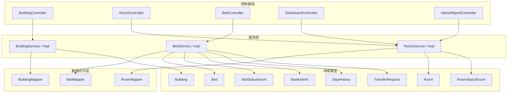
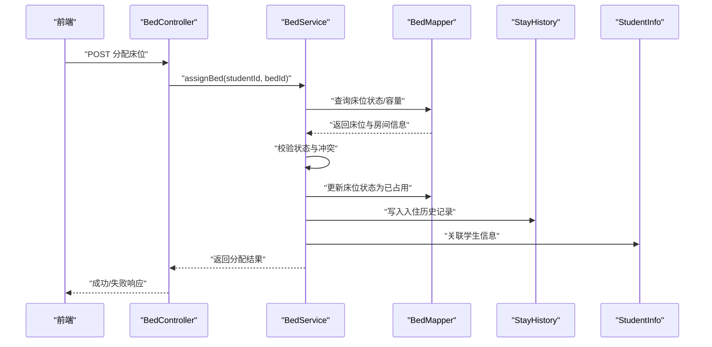
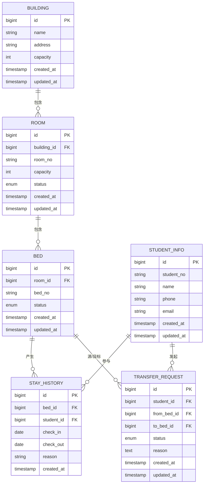
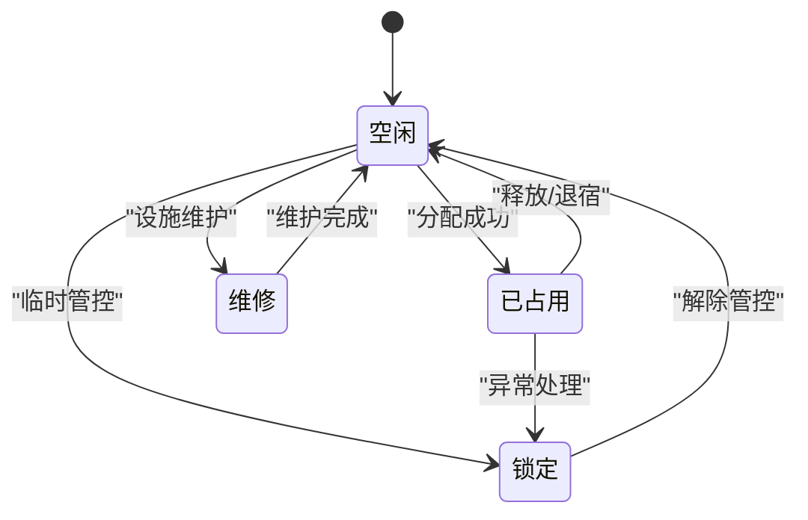
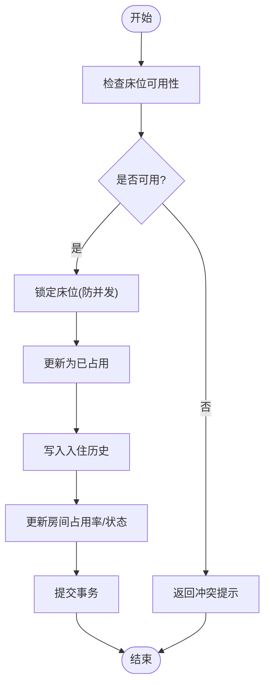
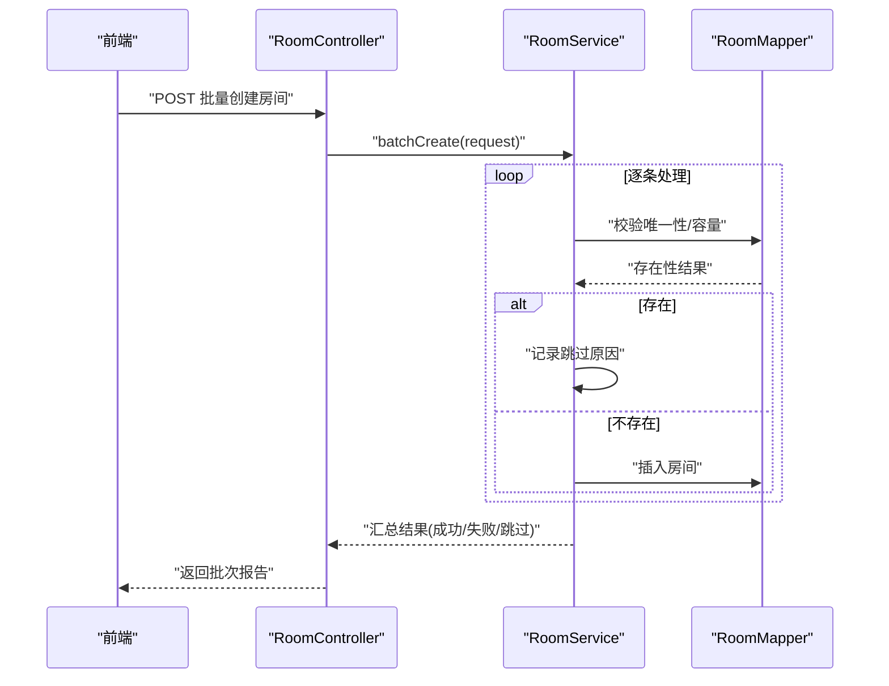
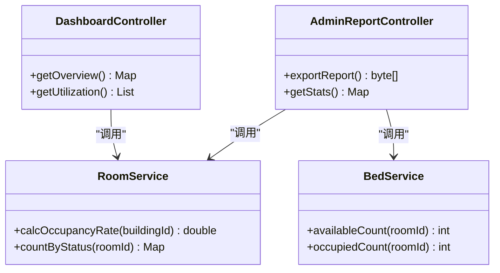
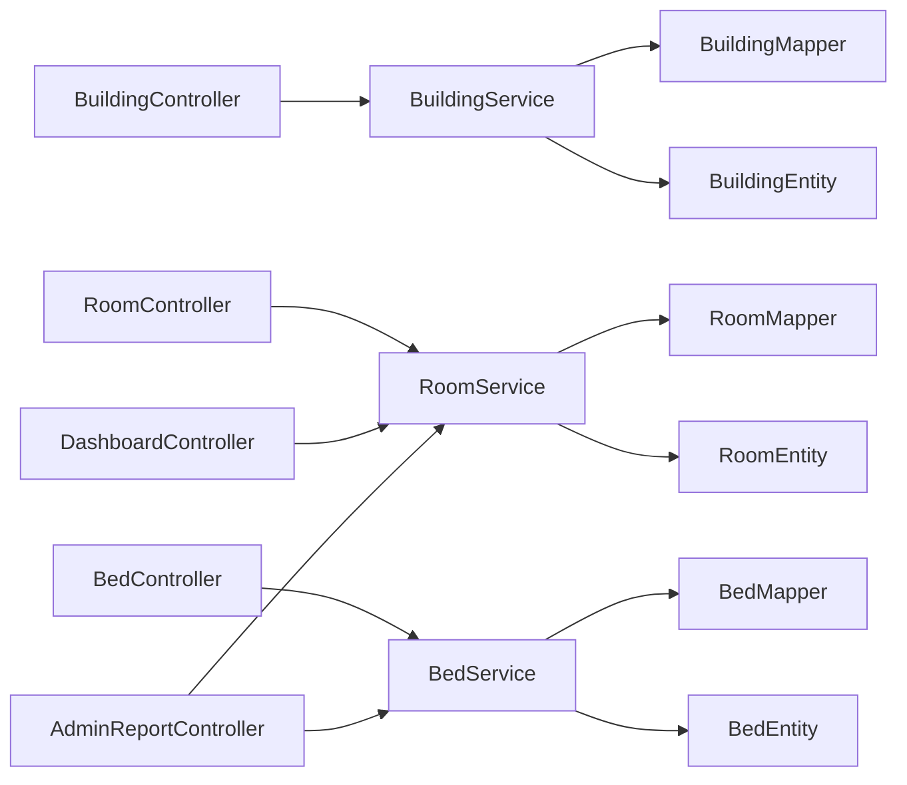

# 核心业务模块

<cite>
**本文引用的文件**   
- [Building.java](file://backend/src/main/java/com/dorm/backend/entity/Building.java)
- [Room.java](file://backend/src/main/java/com/dorm/backend/entity/Room.java)
- [Bed.java](file://backend/src/main/java/com/dorm/backend/entity/Bed.java)
- [StudentInfo.java](file://backend/src/main/java/com/dorm/backend/entity/StudentInfo.java)
- [StayHistory.java](file://backend/src/main/java/com/dorm/backend/entity/StayHistory.java)
- [TransferRequest.java](file://backend/src/main/java/com/dorm/backend/entity/TransferRequest.java)
- [BedStatusEnum.java](file://backend/src/main/java/com/dorm/backend/enums/BedStatusEnum.java)
- [RoomStatusEnum.java](file://backend/src/main/java/com/dorm/backend/enums/RoomStatusEnum.java)
- [BuildingController.java](file://backend/src/main/java/com/dorm/backend/controller/BuildingController.java)
- [RoomController.java](file://backend/src/main/java/com/dorm/backend/controller/RoomController.java)
- [BedController.java](file://backend/src/main/java/com/dorm/backend/controller/BedController.java)
- [BuildingService.java](file://backend/src/main/java/com/dorm/backend/service/BuildingService.java)
- [RoomService.java](file://backend/src/main/java/com/dorm/backend/service/RoomService.java)
- [BedService.java](file://backend/src/main/java/com/dorm/backend/service/BedService.java)
- [BuildingServiceImpl.java](file://backend/src/main/java/com/dorm/backend/service/impl/BuildingServiceImpl.java)
- [RoomServiceImpl.java](file://backend/src/main/java/com/dorm/backend/service/impl/RoomServiceImpl.java)
- [BedServiceImpl.java](file://backend/src/main/java/com/dorm/backend/service/impl/BedServiceImpl.java)
- [BuildingMapper.java](file://backend/src/main/java/com/dorm/backend/mapper/BuildingMapper.java)
- [RoomMapper.java](file://backend/src/main/java/com/dorm/backend/mapper/RoomMapper.java)
- [BedMapper.java](file://backend/src/main/java/com/dorm/backend/mapper/BedMapper.java)
- [DashboardController.java](file://backend/src/main/java/com/dorm/backend/controller/DashboardController.java)
- [AdminReportController.java](file://backend/src/main/java/com/dorm/backend/controller/AdminReportController.java)
- [RoomBatchCreateRequest.java](file://backend/src/main/java/com/dorm/backend/dto/RoomBatchCreateRequest.java)
- [application.yml](file://backend/src/main/resources/application.yml)
</cite>

## 目录
1. [简介](#简介)
2. [项目结构](#项目结构)
3. [核心组件](#核心组件)
4. [架构总览](#架构总览)
5. [详细组件分析](#详细组件分析)
6. [依赖关系分析](#依赖关系分析)
7. [性能考虑](#性能考虑)
8. [故障排查指南](#故障排查指南)
9. [结论](#结论)
10. [附录](#附录)

## 简介
本文件聚焦 Dorm-Sys 宿舍管理系统的核心业务模块，围绕楼栋(Building)、房间(Room)与床位(Bed)三大实体展开，系统阐述数据模型、状态机、业务流程（分配、调整、维护）、批量操作与导入导出、资源统计与利用率分析、事务与一致性保障等。文档面向不同技术背景的读者，提供从概念到代码级的分层说明，并辅以架构图与时序图帮助理解。

## 项目结构
后端采用典型的分层架构：
- 控制器层(controller)：对外暴露 REST API，负责参数校验与结果封装
- 服务层(service/impl)：承载核心业务逻辑，编排多实体操作与事务边界
- 数据访问层(mapper)：基于 MyBatis 的持久化接口
- 实体与枚举(entity/enums)：领域模型与状态枚举
- DTO：请求/响应数据传输对象
- 配置(resources)：应用配置、日志、SQL 脚本等

图表来源
- [BuildingController.java](file://backend/src/main/java/com/dorm/backend/controller/BuildingController.java)
- [RoomController.java](file://backend/src/main/java/com/dorm/backend/controller/RoomController.java)
- [BedController.java](file://backend/src/main/java/com/dorm/backend/controller/BedController.java)
- [DashboardController.java](file://backend/src/main/java/com/dorm/backend/controller/DashboardController.java)
- [AdminReportController.java](file://backend/src/main/java/com/dorm/backend/controller/AdminReportController.java)
- [BuildingService.java](file://backend/src/main/java/com/dorm/backend/service/BuildingService.java)
- [RoomService.java](file://backend/src/main/java/com/dorm/backend/service/RoomService.java)
- [BedService.java](file://backend/src/main/java/com/dorm/backend/service/BedService.java)
- [BuildingServiceImpl.java](file://backend/src/main/java/com/dorm/backend/service/impl/BuildingServiceImpl.java)
- [RoomServiceImpl.java](file://backend/src/main/java/com/dorm/backend/service/impl/RoomServiceImpl.java)
- [BedServiceImpl.java](file://backend/src/main/java/com/dorm/backend/service/impl/BedServiceImpl.java)
- [BuildingMapper.java](file://backend/src/main/java/com/dorm/backend/mapper/BuildingMapper.java)
- [RoomMapper.java](file://backend/src/main/java/com/dorm/backend/mapper/RoomMapper.java)
- [BedMapper.java](file://backend/src/main/java/com/dorm/backend/mapper/BedMapper.java)
- [Building.java](file://backend/src/main/java/com/dorm/backend/entity/Building.java)
- [Room.java](file://backend/src/main/java/com/dorm/backend/entity/Room.java)
- [Bed.java](file://backend/src/main/java/com/dorm/backend/entity/Bed.java)
- [StudentInfo.java](file://backend/src/main/java/com/dorm/backend/entity/StudentInfo.java)
- [StayHistory.java](file://backend/src/main/java/com/dorm/backend/entity/StayHistory.java)
- [TransferRequest.java](file://backend/src/main/java/com/dorm/backend/entity/TransferRequest.java)
- [BedStatusEnum.java](file://backend/src/main/java/com/dorm/backend/enums/BedStatusEnum.java)
- [RoomStatusEnum.java](file://backend/src/main/java/com/dorm/backend/enums/RoomStatusEnum.java)

章节来源
- [application.yml](file://backend/src/main/resources/application.yml)

## 核心组件
- 实体模型
  - 楼栋(Building)：宿舍楼基础信息，作为房间归属维度
  - 房间(Room)：隶属于楼栋，具有容量与状态，关联多个床位
  - 床位(Bed)：最小可分配单元，关联学生与历史入住记录，具备占用状态
  - 学生(StudentInfo)：被分配到床位的主体
  - 入住历史(StayHistory)：记录学生在某床位的起止时间，支撑统计与审计
  - 调宿申请(TransferRequest)：跨房间/楼栋的调宿流程载体
- 状态枚举
  - 床位状态(BedStatusEnum)：空闲、已占用、锁定、维修等
  - 房间状态(RoomStatusEnum)：可用、满员、锁定、整修等
- 控制器与服务
  - BuildingController/Service：楼栋增删改查与关联查询
  - RoomController/Service：房间创建、状态变更、容量校验、批量创建
  - BedController/Service：床位分配、释放、状态更新、冲突检测
- 数据访问
  - BuildingMapper/RoomMapper/BedMapper：MyBatis 映射接口，支持复杂条件查询与聚合统计

章节来源
- [Building.java](file://backend/src/main/java/com/dorm/backend/entity/Building.java)
- [Room.java](file://backend/src/main/java/com/dorm/backend/entity/Room.java)
- [Bed.java](file://backend/src/main/java/com/dorm/backend/entity/Bed.java)
- [StudentInfo.java](file://backend/src/main/java/com/dorm/backend/entity/StudentInfo.java)
- [StayHistory.java](file://backend/src/main/java/com/dorm/backend/entity/StayHistory.java)
- [TransferRequest.java](file://backend/src/main/java/com/dorm/backend/entity/TransferRequest.java)
- [BedStatusEnum.java](file://backend/src/main/java/com/dorm/backend/enums/BedStatusEnum.java)
- [RoomStatusEnum.java](file://backend/src/main/java/com/dorm/backend/enums/RoomStatusEnum.java)
- [BuildingController.java](file://backend/src/main/java/com/dorm/backend/controller/BuildingController.java)
- [RoomController.java](file://backend/src/main/java/com/dorm/backend/controller/RoomController.java)
- [BedController.java](file://backend/src/main/java/com/dorm/backend/controller/BedController.java)
- [BuildingService.java](file://backend/src/main/java/com/dorm/backend/service/BuildingService.java)
- [RoomService.java](file://backend/src/main/java/com/dorm/backend/service/RoomService.java)
- [BedService.java](file://backend/src/main/java/com/dorm/backend/service/BedService.java)
- [BuildingMapper.java](file://backend/src/main/java/com/dorm/backend/mapper/BuildingMapper.java)
- [RoomMapper.java](file://backend/src/main/java/com/dorm/backend/mapper/RoomMapper.java)
- [BedMapper.java](file://backend/src/main/java/com/dorm/backend/mapper/BedMapper.java)

## 架构总览
系统采用“控制器-服务-数据访问”三层架构，结合枚举驱动的状态管理与 MyBatis 持久化。核心数据流自控制器进入服务层进行业务编排，再通过 Mapper 访问数据库；统计与报表由 Dashboard/AdminReport 控制器聚合服务层能力输出。

图表来源
- [BedController.java](file://backend/src/main/java/com/dorm/backend/controller/BedController.java)
- [BedService.java](file://backend/src/main/java/com/dorm/backend/service/BedService.java)
- [BedServiceImpl.java](file://backend/src/main/java/com/dorm/backend/service/impl/BedServiceImpl.java)
- [BedMapper.java](file://backend/src/main/java/com/dorm/backend/mapper/BedMapper.java)
- [Bed.java](file://backend/src/main/java/com/dorm/backend/entity/Bed.java)
- [StayHistory.java](file://backend/src/main/java/com/dorm/backend/entity/StayHistory.java)
- [StudentInfo.java](file://backend/src/main/java/com/dorm/backend/entity/StudentInfo.java)

## 详细组件分析

### 实体关系与数据模型
- 楼栋-房间-床位层级：一栋包含多房间，一间包含多床位
- 床位-学生：一对一当前占用关系，通过历史表实现多对多历史
- 房间状态：受床位占用情况影响，达到容量阈值时自动或手动切换状态
- 调宿申请：跨房间/楼栋的资源再平衡流程

图表来源
- [Building.java](file://backend/src/main/java/com/dorm/backend/entity/Building.java)
- [Room.java](file://backend/src/main/java/com/dorm/backend/entity/Room.java)
- [Bed.java](file://backend/src/main/java/com/dorm/backend/entity/Bed.java)
- [StudentInfo.java](file://backend/src/main/java/com/dorm/backend/entity/StudentInfo.java)
- [StayHistory.java](file://backend/src/main/java/com/dorm/backend/entity/StayHistory.java)
- [TransferRequest.java](file://backend/src/main/java/com/dorm/backend/entity/TransferRequest.java)

章节来源
- [Building.java](file://backend/src/main/java/com/dorm/backend/entity/Building.java)
- [Room.java](file://backend/src/main/java/com/dorm/backend/entity/Room.java)
- [Bed.java](file://backend/src/main/java/com/dorm/backend/entity/Bed.java)
- [StudentInfo.java](file://backend/src/main/java/com/dorm/backend/entity/StudentInfo.java)
- [StayHistory.java](file://backend/src/main/java/com/dorm/backend/entity/StayHistory.java)
- [TransferRequest.java](file://backend/src/main/java/com/dorm/backend/entity/TransferRequest.java)

### 状态管理与实时更新机制
- 床位状态流转：空闲→已占用/锁定/维修；释放后回空闲
- 房间状态：根据床位占用比例与管理员策略在可用/满员/锁定间切换
- 实时性：分配/释放/调宿成功后立即更新状态，并写入历史，确保统计口径一致

图表来源
- [BedStatusEnum.java](file://backend/src/main/java/com/dorm/backend/enums/BedStatusEnum.java)
- [RoomStatusEnum.java](file://backend/src/main/java/com/dorm/backend/enums/RoomStatusEnum.java)
- [BedServiceImpl.java](file://backend/src/main/java/com/dorm/backend/service/impl/BedServiceImpl.java)
- [RoomServiceImpl.java](file://backend/src/main/java/com/dorm/backend/service/impl/RoomServiceImpl.java)

章节来源
- [BedStatusEnum.java](file://backend/src/main/java/com/dorm/backend/enums/BedStatusEnum.java)
- [RoomStatusEnum.java](file://backend/src/main/java/com/dorm/backend/enums/RoomStatusEnum.java)
- [BedServiceImpl.java](file://backend/src/main/java/com/dorm/backend/service/impl/BedServiceImpl.java)
- [RoomServiceImpl.java](file://backend/src/main/java/com/dorm/backend/service/impl/RoomServiceImpl.java)

### 宿舍分配、调整与维护流程
- 分配流程：选择空闲床位→校验冲突→写入历史→更新状态→刷新房间容量
- 调整流程：发起调宿申请→审批→目标床位校验→原子切换源/目标状态→归档历史
- 维护流程：标记维修/锁定→限制分配→完成后恢复状态

图表来源
- [BedServiceImpl.java](file://backend/src/main/java/com/dorm/backend/service/impl/BedServiceImpl.java)
- [RoomServiceImpl.java](file://backend/src/main/java/com/dorm/backend/service/impl/RoomServiceImpl.java)
- [BedMapper.java](file://backend/src/main/java/com/dorm/backend/mapper/BedMapper.java)
- [RoomMapper.java](file://backend/src/main/java/com/dorm/backend/mapper/RoomMapper.java)
- [StayHistory.java](file://backend/src/main/java/com/dorm/backend/entity/StayHistory.java)

章节来源
- [BedServiceImpl.java](file://backend/src/main/java/com/dorm/backend/service/impl/BedServiceImpl.java)
- [RoomServiceImpl.java](file://backend/src/main/java/com/dorm/backend/service/impl/RoomServiceImpl.java)
- [BedMapper.java](file://backend/src/main/java/com/dorm/backend/mapper/BedMapper.java)
- [RoomMapper.java](file://backend/src/main/java/com/dorm/backend/mapper/RoomMapper.java)
- [StayHistory.java](file://backend/src/main/java/com/dorm/backend/entity/StayHistory.java)

### 批量操作与数据导入导出
- 批量创建房间：通过 RoomBatchCreateRequest 定义批量规则（楼栋、起始编号、容量等），服务层循环创建并校验唯一性
- 导入导出：控制器接收 Excel/CSV，服务层解析并分批入库，失败项记录错误明细，支持回滚或跳过策略
- 幂等性与去重：基于房间号/床位号唯一约束，避免重复导入

图表来源
- [RoomController.java](file://backend/src/main/java/com/dorm/backend/controller/RoomController.java)
- [RoomService.java](file://backend/src/main/java/com/dorm/backend/service/RoomService.java)
- [RoomServiceImpl.java](file://backend/src/main/java/com/dorm/backend/service/impl/RoomServiceImpl.java)
- [RoomBatchCreateRequest.java](file://backend/src/main/java/com/dorm/backend/dto/RoomBatchCreateRequest.java)
- [RoomMapper.java](file://backend/src/main/java/com/dorm/backend/mapper/RoomMapper.java)

章节来源
- [RoomController.java](file://backend/src/main/java/com/dorm/backend/controller/RoomController.java)
- [RoomService.java](file://backend/src/main/java/com/dorm/backend/service/RoomService.java)
- [RoomServiceImpl.java](file://backend/src/main/java/com/dorm/backend/service/impl/RoomServiceImpl.java)
- [RoomBatchCreateRequest.java](file://backend/src/main/java/com/dorm/backend/dto/RoomBatchCreateRequest.java)
- [RoomMapper.java](file://backend/src/main/java/com/dorm/backend/mapper/RoomMapper.java)

### 资源统计与利用率分析
- 指标维度：楼栋/房间/床位级别占用率、空床数、满房数、平均入住时长
- 数据来源：床位状态聚合、入住历史区间统计、房间容量对比
- 输出接口：Dashboard/AdminReport 控制器聚合服务层计算结果，供前端可视化展示

图表来源
- [DashboardController.java](file://backend/src/main/java/com/dorm/backend/controller/DashboardController.java)
- [AdminReportController.java](file://backend/src/main/java/com/dorm/backend/controller/AdminReportController.java)
- [RoomService.java](file://backend/src/main/java/com/dorm/backend/service/RoomService.java)
- [BedService.java](file://backend/src/main/java/com/dorm/backend/service/BedService.java)

章节来源
- [DashboardController.java](file://backend/src/main/java/com/dorm/backend/controller/DashboardController.java)
- [AdminReportController.java](file://backend/src/main/java/com/dorm/backend/controller/AdminReportController.java)
- [RoomService.java](file://backend/src/main/java/com/dorm/backend/service/RoomService.java)
- [BedService.java](file://backend/src/main/java/com/dorm/backend/service/BedService.java)

### 接口调用示例（描述）
- 分配床位：POST /bed/assign，请求体包含学生ID与床位ID，返回分配结果与状态码
- 释放床位：POST /bed/release，请求体包含床位ID与释放原因，返回更新后的状态
- 批量创建房间：POST /room/batch-create，请求体遵循 RoomBatchCreateRequest 结构，返回批次报告
- 资源统计：GET /dashboard/overview，返回各维度统计概览

章节来源
- [BedController.java](file://backend/src/main/java/com/dorm/backend/controller/BedController.java)
- [RoomController.java](file://backend/src/main/java/com/dorm/backend/controller/RoomController.java)
- [RoomBatchCreateRequest.java](file://backend/src/main/java/com/dorm/backend/dto/RoomBatchCreateRequest.java)
- [DashboardController.java](file://backend/src/main/java/com/dorm/backend/controller/DashboardController.java)

## 依赖关系分析
- 控制器依赖服务：BedController→BedService，RoomController→RoomService，BuildingController→BuildingService
- 服务依赖 Mapper：BedService→BedMapper，RoomService→RoomMapper，BuildingService→BuildingMapper
- 服务依赖实体与枚举：状态判断、容量计算、历史写入均依赖对应实体与枚举
- 统计模块依赖：Dashboard/AdminReport 依赖 RoomService/BedService 提供的聚合方法

图表来源
- [BuildingController.java](file://backend/src/main/java/com/dorm/backend/controller/BuildingController.java)
- [RoomController.java](file://backend/src/main/java/com/dorm/backend/controller/RoomController.java)
- [BedController.java](file://backend/src/main/java/com/dorm/backend/controller/BedController.java)
- [BuildingService.java](file://backend/src/main/java/com/dorm/backend/service/BuildingService.java)
- [RoomService.java](file://backend/src/main/java/com/dorm/backend/service/RoomService.java)
- [BedService.java](file://backend/src/main/java/com/dorm/backend/service/BedService.java)
- [BuildingMapper.java](file://backend/src/main/java/com/dorm/backend/mapper/BuildingMapper.java)
- [RoomMapper.java](file://backend/src/main/java/com/dorm/backend/mapper/RoomMapper.java)
- [BedMapper.java](file://backend/src/main/java/com/dorm/backend/mapper/BedMapper.java)
- [Building.java](file://backend/src/main/java/com/dorm/backend/entity/Building.java)
- [Room.java](file://backend/src/main/java/com/dorm/backend/entity/Room.java)
- [Bed.java](file://backend/src/main/java/com/dorm/backend/entity/Bed.java)
- [DashboardController.java](file://backend/src/main/java/com/dorm/backend/controller/DashboardController.java)
- [AdminReportController.java](file://backend/src/main/java/com/dorm/backend/controller/AdminReportController.java)

章节来源
- [BuildingController.java](file://backend/src/main/java/com/dorm/backend/controller/BuildingController.java)
- [RoomController.java](file://backend/src/main/java/com/dorm/backend/controller/RoomController.java)
- [BedController.java](file://backend/src/main/java/com/dorm/backend/controller/BedController.java)
- [BuildingService.java](file://backend/src/main/java/com/dorm/backend/service/BuildingService.java)
- [RoomService.java](file://backend/src/main/java/com/dorm/backend/service/RoomService.java)
- [BedService.java](file://backend/src/main/java/com/dorm/backend/service/BedService.java)
- [BuildingMapper.java](file://backend/src/main/java/com/dorm/backend/mapper/BuildingMapper.java)
- [RoomMapper.java](file://backend/src/main/java/com/dorm/backend/mapper/RoomMapper.java)
- [BedMapper.java](file://backend/src/main/java/com/dorm/backend/mapper/BedMapper.java)
- [Building.java](file://backend/src/main/java/com/dorm/backend/entity/Building.java)
- [Room.java](file://backend/src/main/java/com/dorm/backend/entity/Room.java)
- [Bed.java](file://backend/src/main/java/com/dorm/backend/entity/Bed.java)
- [DashboardController.java](file://backend/src/main/java/com/dorm/backend/controller/DashboardController.java)
- [AdminReportController.java](file://backend/src/main/java/com/dorm/backend/controller/AdminReportController.java)

## 性能考虑
- 批量操作分片：大列表导入按固定大小分片，减少单次事务压力
- 索引优化：房间号、床位号、学生学号建立唯一索引，提升查询与去重效率
- 缓存热点：房间容量与占用率可在内存中短期缓存，降低频繁聚合计算
- 异步处理：非关键路径（如通知、报表生成）使用异步任务，缩短主流程耗时
- 连接池与超时：合理配置数据库连接池与读写超时，避免长事务阻塞

[本节为通用指导，不直接分析具体文件]

## 故障排查指南
- 分配冲突：检查床位状态是否为空闲，确认是否存在并发分配导致的状态不一致
- 容量超限：核对房间容量与已占床位数量，必要时修正容量或释放无效占用
- 导入失败：查看批次报告中的失败明细，定位字段错误或重复键冲突
- 状态异常：核查状态枚举值与状态机流转逻辑，确认是否有非法跳转
- 事务回滚：关注服务层事务注解与异常抛出点，确保异常传播正确

章节来源
- [BedServiceImpl.java](file://backend/src/main/java/com/dorm/backend/service/impl/BedServiceImpl.java)
- [RoomServiceImpl.java](file://backend/src/main/java/com/dorm/backend/service/impl/RoomServiceImpl.java)
- [BedStatusEnum.java](file://backend/src/main/java/com/dorm/backend/enums/BedStatusEnum.java)
- [RoomStatusEnum.java](file://backend/src/main/java/com/dorm/backend/enums/RoomStatusEnum.java)

## 结论
Dorm-Sys 的核心业务模块以清晰的实体关系与状态机为基础，通过分层架构与事务控制保障数据一致性与高内聚的业务逻辑。借助批量操作、导入导出与统计报表能力，系统能够高效支撑宿舍资源的日常运营与管理。建议在生产环境完善监控告警、审计追踪与性能基准测试，持续提升稳定性与可观测性。

[本节为总结性内容，不直接分析具体文件]

## 附录
- 配置参考：application.yml 中数据库、日志、拦截器等配置项用于支撑上述功能运行
- 扩展建议：增加床位级权限控制、调审流程自动化、智能推荐分配算法等

章节来源
- [application.yml](file://backend/src/main/resources/application.yml)