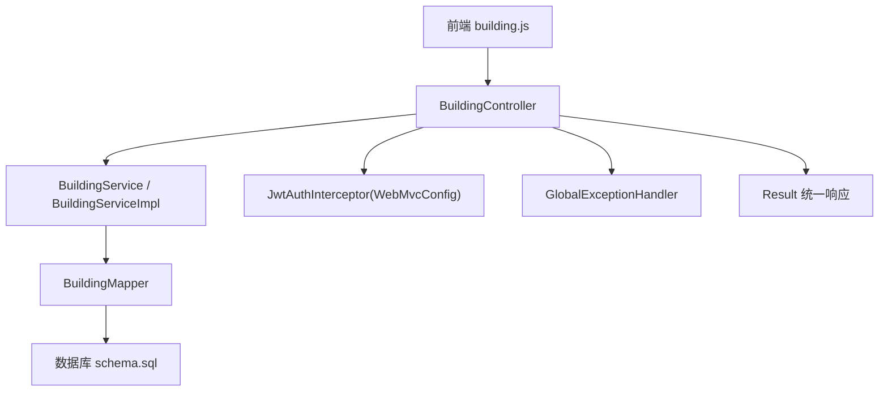
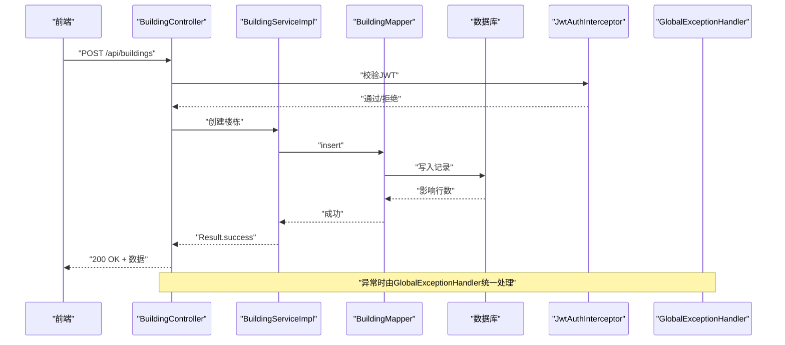
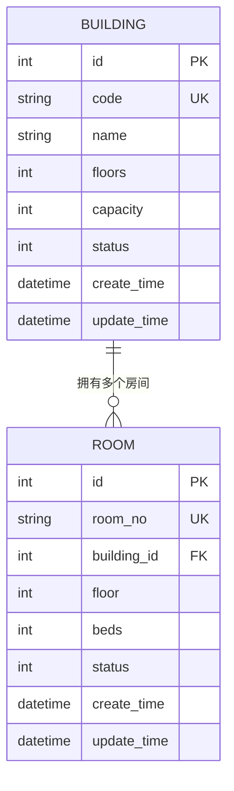
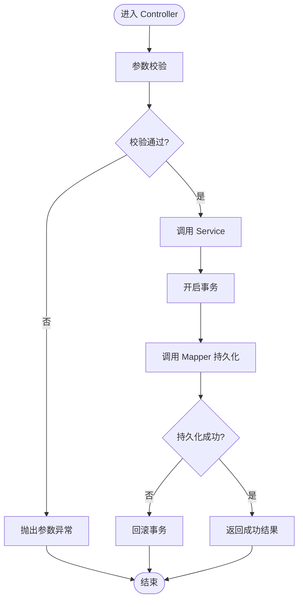
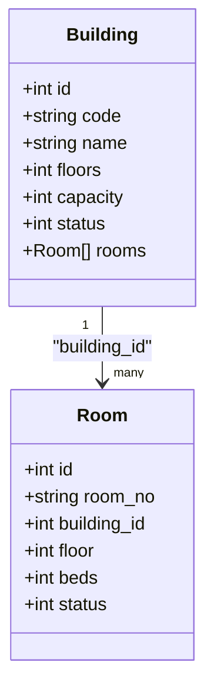
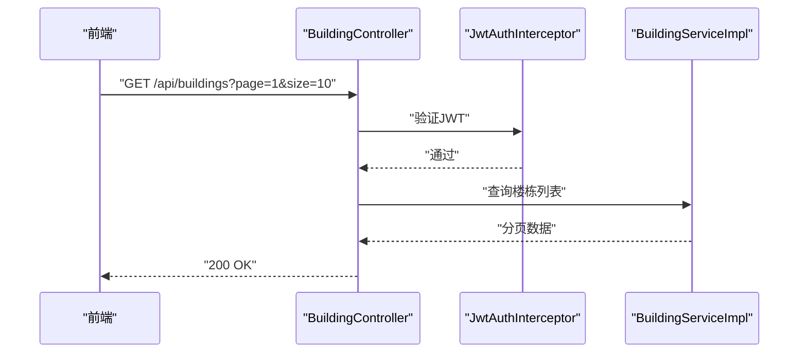
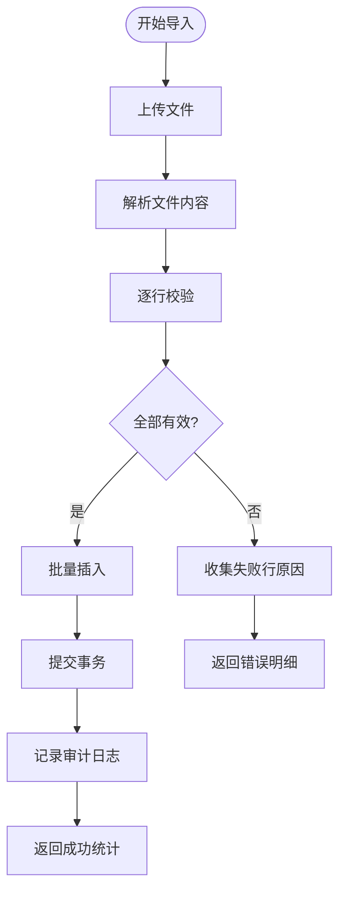
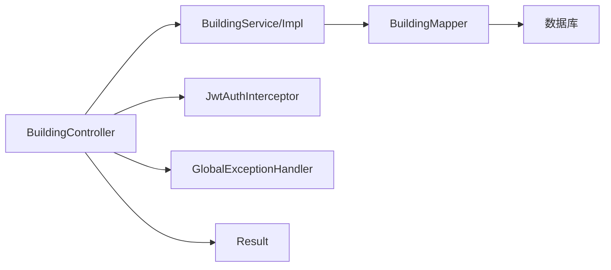

# 楼栋管理模块

<cite>
**本文引用的文件**   
- [Building.java](file://backend/src/main/java/com/dorm/backend/entity/Building.java)
- [BuildingController.java](file://backend/src/main/java/com/dorm/backend/controller/BuildingController.java)
- [BuildingService.java](file://backend/src/main/java/com/dorm/backend/service/BuildingService.java)
- [BuildingServiceImpl.java](file://backend/src/main/java/com/dorm/backend/service/impl/BuildingServiceImpl.java)
- [BuildingMapper.java](file://backend/src/main/java/com/dorm/backend/mapper/BuildingMapper.java)
- [Room.java](file://backend/src/main/java/com/dorm/backend/entity/Room.java)
- [RoomController.java](file://backend/src/main/java/com/dorm/backend/controller/RoomController.java)
- [Result.java](file://backend/src/main/java/com/dorm/backend/common/Result.java)
- [GlobalExceptionHandler.java](file://backend/src/main/java/com/dorm/backend/common/GlobalExceptionHandler.java)
- [JwtAuthInterceptor.java](file://backend/src/main/java/com/dorm/backend/config/JwtAuthInterceptor.java)
- [WebMvcConfig.java](file://backend/src/main/java/com/dorm/backend/config/WebMvcConfig.java)
- [application.yml](file://backend/src/main/resources/application.yml)
- [schema.sql](file://backend/src/main/resources/schema.sql)
- [building.js](file://frontend/src/api/building.js)
</cite>

## 目录
1. [简介](#简介)
2. [项目结构](#项目结构)
3. [核心组件](#核心组件)
4. [架构总览](#架构总览)
5. [详细组件分析](#详细组件分析)
6. [依赖关系分析](#依赖关系分析)
7. [性能考虑](#性能考虑)
8. [故障排查指南](#故障排查指南)
9. [结论](#结论)
10. [附录](#附录)

## 简介
本模块为宿舍管理系统中的“楼栋管理”功能，提供楼栋实体的增删改查、与房间的一对多关系映射、状态管理与权限控制、以及批量导入导出能力。后端基于 Spring Boot + MyBatis，前端通过 API 调用进行交互。文档面向技术与非技术读者，力求以循序渐进的方式说明数据模型、接口设计、业务流程与排错方法。

## 项目结构
楼栋管理相关代码主要分布在以下包：
- entity: 实体类（如 Building、Room）
- controller: 对外暴露的 REST 接口（BuildingController）
- service/impl: 业务逻辑实现（BuildingService、BuildingServiceImpl）
- mapper: 数据访问层（BuildingMapper）
- common: 统一返回体与全局异常处理（Result、GlobalExceptionHandler）
- config: 拦截器与 MVC 配置（JwtAuthInterceptor、WebMvcConfig）
- resources: 应用配置与数据库脚本（application.yml、schema.sql）
- frontend/api: 前端对楼栋接口的封装（building.js）

图表来源
- [BuildingController.java](file://backend/src/main/java/com/dorm/backend/controller/BuildingController.java)
- [BuildingService.java](file://backend/src/main/java/com/dorm/backend/service/BuildingService.java)
- [BuildingServiceImpl.java](file://backend/src/main/java/com/dorm/backend/service/impl/BuildingServiceImpl.java)
- [BuildingMapper.java](file://backend/src/main/java/com/dorm/backend/mapper/BuildingMapper.java)
- [JwtAuthInterceptor.java](file://backend/src/main/java/com/dorm/backend/config/JwtAuthInterceptor.java)
- [WebMvcConfig.java](file://backend/src/main/java/com/dorm/backend/config/WebMvcConfig.java)
- [GlobalExceptionHandler.java](file://backend/src/main/java/com/dorm/backend/common/GlobalExceptionHandler.java)
- [Result.java](file://backend/src/main/java/com/dorm/backend/common/Result.java)
- [schema.sql](file://backend/src/main/resources/schema.sql)

章节来源
- [BuildingController.java](file://backend/src/main/java/com/dorm/backend/controller/BuildingController.java)
- [BuildingService.java](file://backend/src/main/java/com/dorm/backend/service/BuildingService.java)
- [BuildingServiceImpl.java](file://backend/src/main/java/com/dorm/backend/service/impl/BuildingServiceImpl.java)
- [BuildingMapper.java](file://backend/src/main/java/com/dorm/backend/mapper/BuildingMapper.java)
- [application.yml](file://backend/src/main/resources/application.yml)
- [schema.sql](file://backend/src/main/resources/schema.sql)

## 核心组件
- 实体 Building: 定义楼栋编号、名称、楼层数、容量等字段及校验规则。
- 控制器 BuildingController: 暴露新增、修改、删除、查询列表等 REST 接口。
- 服务层 BuildingService/Impl: 封装业务逻辑，包括参数校验、事务控制、与 Mapper 交互。
- 数据访问 BuildingMapper: 定义 SQL 操作（CRUD、分页、条件查询）。
- 统一响应 Result: 标准化接口返回格式。
- 全局异常 GlobalExceptionHandler: 统一捕获并返回错误信息。
- 鉴权 JwtAuthInterceptor: 基于 JWT 的访问控制，配合 WebMvcConfig 注册。

章节来源
- [Building.java](file://backend/src/main/java/com/dorm/backend/entity/Building.java)
- [BuildingController.java](file://backend/src/main/java/com/dorm/backend/controller/BuildingController.java)
- [BuildingService.java](file://backend/src/main/java/com/dorm/backend/service/BuildingService.java)
- [BuildingServiceImpl.java](file://backend/src/main/java/com/dorm/backend/service/impl/BuildingServiceImpl.java)
- [BuildingMapper.java](file://backend/src/main/java/com/dorm/backend/mapper/BuildingMapper.java)
- [Result.java](file://backend/src/main/java/com/dorm/backend/common/Result.java)
- [GlobalExceptionHandler.java](file://backend/src/main/java/com/dorm/backend/common/GlobalExceptionHandler.java)
- [JwtAuthInterceptor.java](file://backend/src/main/java/com/dorm/backend/config/JwtAuthInterceptor.java)
- [WebMvcConfig.java](file://backend/src/main/java/com/dorm/backend/config/WebMvcConfig.java)

## 架构总览
楼栋管理采用典型的分层架构：
- 表现层（Controller）接收请求，参数校验后委托 Service。
- 业务层（Service/Impl）执行业务规则、事务边界、调用 Mapper。
- 持久层（Mapper）执行 SQL，读写数据库。
- 横切关注点：鉴权（JWT）、日志审计、统一响应与异常处理。

图表来源
- [BuildingController.java](file://backend/src/main/java/com/dorm/backend/controller/BuildingController.java)
- [BuildingServiceImpl.java](file://backend/src/main/java/com/dorm/backend/service/impl/BuildingServiceImpl.java)
- [BuildingMapper.java](file://backend/src/main/java/com/dorm/backend/mapper/BuildingMapper.java)
- [JwtAuthInterceptor.java](file://backend/src/main/java/com/dorm/backend/config/JwtAuthInterceptor.java)
- [GlobalExceptionHandler.java](file://backend/src/main/java/com/dorm/backend/common/GlobalExceptionHandler.java)

## 详细组件分析

### 实体与数据模型
- 楼栋实体 Building 包含以下关键属性（示例字段，具体以源码为准）：
  - 楼栋编号（唯一标识）
  - 楼栋名称
  - 楼层数
  - 容量（床位数或可容纳人数）
  - 状态（启用/停用）
  - 创建时间、更新时间
- 房间实体 Room 与 Building 存在一对多关系：一个楼栋对应多个房间，房间表通常包含外键指向楼栋编号。

图表来源
- [Building.java](file://backend/src/main/java/com/dorm/backend/entity/Building.java)
- [Room.java](file://backend/src/main/java/com/dorm/backend/entity/Room.java)
- [schema.sql](file://backend/src/main/resources/schema.sql)

章节来源
- [Building.java](file://backend/src/main/java/com/dorm/backend/entity/Building.java)
- [Room.java](file://backend/src/main/java/com/dorm/backend/entity/Room.java)
- [schema.sql](file://backend/src/main/resources/schema.sql)

### CRUD 接口设计与流程
- 新增楼栋：提交楼栋基本信息，服务端校验并持久化。
- 修改信息：根据 ID 更新楼栋属性，支持部分更新。
- 删除楼栋：逻辑删除或物理删除，需检查是否有关联房间。
- 查询列表：支持分页、按名称/编号/状态筛选。

图表来源
- [BuildingController.java](file://backend/src/main/java/com/dorm/backend/controller/BuildingController.java)
- [BuildingServiceImpl.java](file://backend/src/main/java/com/dorm/backend/service/impl/BuildingServiceImpl.java)
- [BuildingMapper.java](file://backend/src/main/java/com/dorm/backend/mapper/BuildingMapper.java)

章节来源
- [BuildingController.java](file://backend/src/main/java/com/dorm/backend/controller/BuildingController.java)
- [BuildingServiceImpl.java](file://backend/src/main/java/com/dorm/backend/service/impl/BuildingServiceImpl.java)
- [BuildingMapper.java](file://backend/src/main/java/com/dorm/backend/mapper/BuildingMapper.java)

### 楼栋与房间的关系映射
- 一对多关系：Building 与 Room 通过 building_id 关联。
- 删除楼栋前需校验是否存在关联房间；若存在，应阻止删除或提示先迁移房间。
- 查询楼栋时可级联获取房间列表（按需懒加载或显式 JOIN）。

图表来源
- [Building.java](file://backend/src/main/java/com/dorm/backend/entity/Building.java)
- [Room.java](file://backend/src/main/java/com/dorm/backend/entity/Room.java)

章节来源
- [Building.java](file://backend/src/main/java/com/dorm/backend/entity/Building.java)
- [Room.java](file://backend/src/main/java/com/dorm/backend/entity/Room.java)

### 状态管理与权限控制
- 状态管理：楼栋状态字段用于控制可用性与展示逻辑（启用/停用），在创建、更新时进行合法性校验。
- 权限控制：通过 JwtAuthInterceptor 校验请求头中的 JWT，结合 WebMvcConfig 的路径白名单与拦截规则，确保只有授权用户可访问管理接口。
- 建议：在 Service 层增加基于角色或范围的权限判断（例如管理员/宿管范围）。

图表来源
- [JwtAuthInterceptor.java](file://backend/src/main/java/com/dorm/backend/config/JwtAuthInterceptor.java)
- [WebMvcConfig.java](file://backend/src/main/java/com/dorm/backend/config/WebMvcConfig.java)
- [BuildingController.java](file://backend/src/main/java/com/dorm/backend/controller/BuildingController.java)
- [BuildingServiceImpl.java](file://backend/src/main/java/com/dorm/backend/service/impl/BuildingServiceImpl.java)

章节来源
- [JwtAuthInterceptor.java](file://backend/src/main/java/com/dorm/backend/config/JwtAuthInterceptor.java)
- [WebMvcConfig.java](file://backend/src/main/java/com/dorm/backend/config/WebMvcConfig.java)
- [BuildingController.java](file://backend/src/main/java/com/dorm/backend/controller/BuildingController.java)
- [BuildingServiceImpl.java](file://backend/src/main/java/com/dorm/backend/service/impl/BuildingServiceImpl.java)

### 批量导入与导出
- 导入：支持 Excel/CSV 批量导入楼栋数据，服务端解析、校验、去重、批量插入，失败行给出明细错误。
- 导出：按条件筛选楼栋数据，生成 Excel/CSV 供下载。
- 建议：使用异步任务处理大批量导入，避免阻塞请求线程；导入过程中记录审计日志。

[本节为概念性流程图，不直接映射到具体文件]

### API 调用示例与错误处理
- 新增楼栋：POST /api/buildings，请求体包含楼栋编号、名称、楼层数、容量等。
- 修改楼栋：PUT /api/buildings/{id}，请求体包含需要更新的字段。
- 删除楼栋：DELETE /api/buildings/{id}，返回删除结果。
- 查询列表：GET /api/buildings?page=1&size=10&name=xxx&status=1。
- 统一响应：所有接口返回 Result 包装体，包含状态码、消息与数据。
- 错误处理：参数非法、重复编号、关联约束冲突等由 GlobalExceptionHandler 统一捕获并返回标准错误格式。

章节来源
- [BuildingController.java](file://backend/src/main/java/com/dorm/backend/controller/BuildingController.java)
- [Result.java](file://backend/src/main/java/com/dorm/backend/common/Result.java)
- [GlobalExceptionHandler.java](file://backend/src/main/java/com/dorm/backend/common/GlobalExceptionHandler.java)

## 依赖关系分析
- Controller 依赖 Service，Service 依赖 Mapper，Mapper 依赖数据库。
- 鉴权拦截器在请求到达 Controller 之前执行，未通过则直接拒绝。
- 统一响应与异常处理贯穿各层，保证前后端契约一致。

图表来源
- [BuildingController.java](file://backend/src/main/java/com/dorm/backend/controller/BuildingController.java)
- [BuildingService.java](file://backend/src/main/java/com/dorm/backend/service/BuildingService.java)
- [BuildingServiceImpl.java](file://backend/src/main/java/com/dorm/backend/service/impl/BuildingServiceImpl.java)
- [BuildingMapper.java](file://backend/src/main/java/com/dorm/backend/mapper/BuildingMapper.java)
- [JwtAuthInterceptor.java](file://backend/src/main/java/com/dorm/backend/config/JwtAuthInterceptor.java)
- [GlobalExceptionHandler.java](file://backend/src/main/java/com/dorm/backend/common/GlobalExceptionHandler.java)
- [Result.java](file://backend/src/main/java/com/dorm/backend/common/Result.java)

章节来源
- [BuildingController.java](file://backend/src/main/java/com/dorm/backend/controller/BuildingController.java)
- [BuildingService.java](file://backend/src/main/java/com/dorm/backend/service/BuildingService.java)
- [BuildingServiceImpl.java](file://backend/src/main/java/com/dorm/backend/service/impl/BuildingServiceImpl.java)
- [BuildingMapper.java](file://backend/src/main/java/com/dorm/backend/mapper/BuildingMapper.java)
- [JwtAuthInterceptor.java](file://backend/src/main/java/com/dorm/backend/config/JwtAuthInterceptor.java)
- [GlobalExceptionHandler.java](file://backend/src/main/java/com/dorm/backend/common/GlobalExceptionHandler.java)
- [Result.java](file://backend/src/main/java/com/dorm/backend/common/Result.java)

## 性能考虑
- 分页查询：列表接口必须支持分页，避免一次性拉取大量数据。
- 索引优化：对常用查询字段（楼栋编号、名称、状态）建立索引。
- 批量操作：导入时使用批量插入减少往返开销。
- 缓存策略：热点楼栋信息可加入缓存（如 Redis）以降低数据库压力。
- 连接池：合理配置数据库连接池大小与超时时间。

[本节为通用性能建议，不直接分析具体文件]

## 故障排查指南
- 鉴权失败：检查请求头是否携带有效的 JWT，确认拦截器路径配置是否正确。
- 参数校验失败：查看请求体字段是否符合要求，注意必填项与格式限制。
- 重复编号：新增时若编号已存在，应返回明确错误提示。
- 关联约束冲突：删除楼栋前检查是否存在关联房间，若有则提示先处理房间。
- 数据库异常：查看日志定位 SQL 错误或连接问题，必要时回滚事务。

章节来源
- [GlobalExceptionHandler.java](file://backend/src/main/java/com/dorm/backend/common/GlobalExceptionHandler.java)
- [JwtAuthInterceptor.java](file://backend/src/main/java/com/dorm/backend/config/JwtAuthInterceptor.java)
- [WebMvcConfig.java](file://backend/src/main/java/com/dorm/backend/config/WebMvcConfig.java)

## 结论
楼栋管理模块通过清晰的分层架构与统一的响应/异常处理，提供了完整的 CRUD 能力与关系映射支持。结合 JWT 鉴权与状态管理，可满足宿舍管理中楼栋数据的规范化维护需求。建议在后续迭代中完善批量导入导出的错误明细与审计追踪，进一步提升用户体验与可运维性。

## 附录
- 前端 API 封装：building.js 提供对后端楼栋接口的调用封装，便于页面集成。
- 数据库脚本：schema.sql 定义了楼栋与房间等基础表结构，确保环境初始化一致性。

章节来源
- [building.js](file://frontend/src/api/building.js)
- [schema.sql](file://backend/src/main/resources/schema.sql)