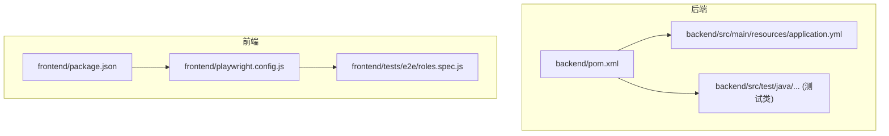
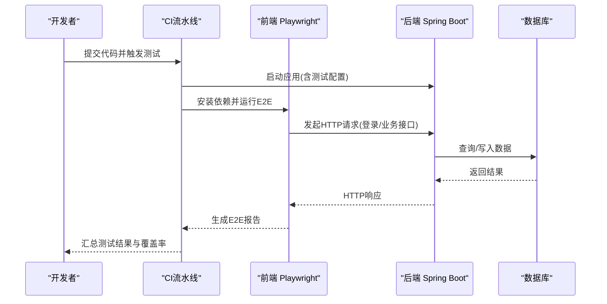
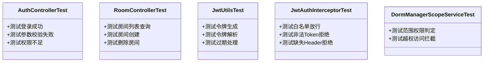
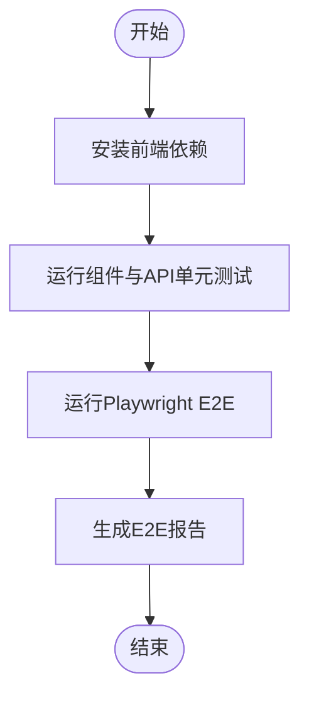
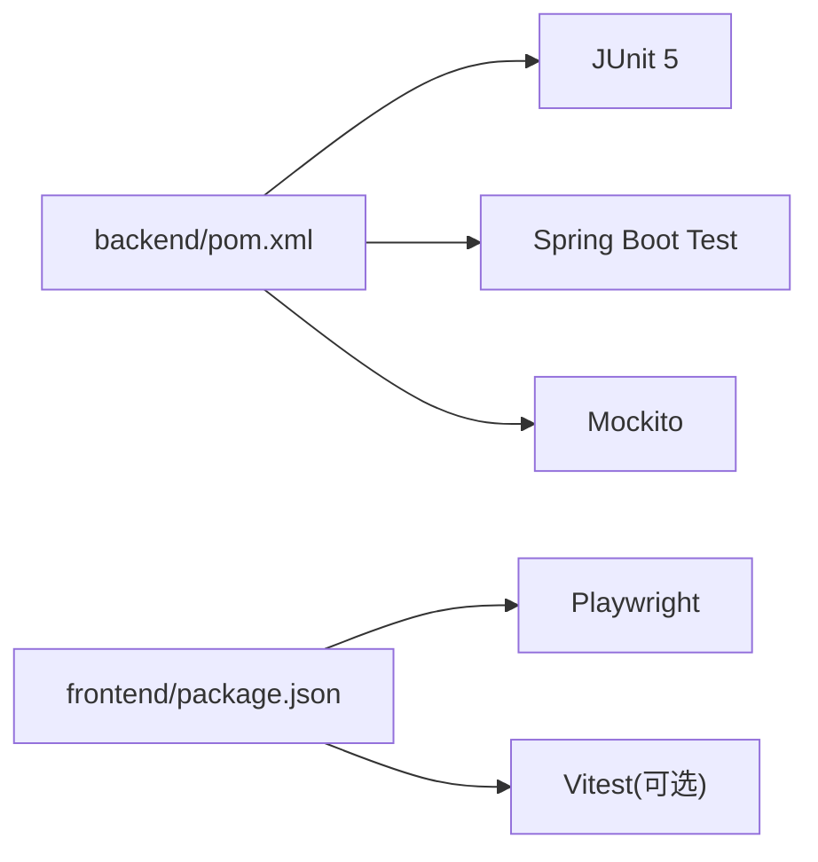

# 测试指南

<cite>
**本文档引用的文件**   
- [pom.xml](file://backend/pom.xml)
- [application.yml](file://backend/src/main/resources/application.yml)
- [BackendApplicationTests.java](file://backend/src/test/java/com/dorm/backend/BackendApplicationTests.java)
- [AuthControllerTest.java](file://backend/src/test/java/com/dorm/backend/controller/AuthControllerTest.java)
- [RoomControllerTest.java](file://backend/src/test/java/com/dorm/backend/controller/RoomControllerTest.java)
- [JwtUtilsTest.java](file://backend/src/test/java/com/dorm/backend/common/JwtUtilsTest.java)
- [JwtAuthInterceptorTest.java](file://backend/src/test/java/com/dorm/backend/config/JwtAuthInterceptorTest.java)
- [DormManagerScopeServiceTest.java](file://backend/src/test/java/com/dorm/backend/service/DormManagerScopeServiceTest.java)
- [package.json](file://frontend/package.json)
- [playwright.config.js](file://frontend/playwright.config.js)
- [roles.spec.js](file://frontend/tests/e2e/roles.spec.js)
</cite>

## 目录
1. [简介](#简介)
2. [项目结构](#项目结构)
3. [核心组件](#核心组件)
4. [架构总览](#架构总览)
5. [详细组件分析](#详细组件分析)
6. [依赖分析](#依赖分析)
7. [性能考虑](#性能考虑)
8. [故障排查指南](#故障排查指南)
9. [结论](#结论)
10. [附录](#附录)

## 简介
本指南面向Dorm-Sys项目的测试实践，覆盖后端Spring Boot与前端Vue的单元测试、集成测试与端到端（E2E）测试。文档说明测试策略、框架选型、配置方法、Mock与断言实践、覆盖率与质量检查标准、持续集成与报告生成，以及性能、压力与安全测试的实施建议，帮助团队建立稳定可维护的测试体系。

## 项目结构
后端采用Maven + Spring Boot，测试位于src/test下，包含控制器、服务、通用工具与拦截器的测试类；前端基于Vite构建，使用Playwright进行E2E测试，配置文件位于根目录。

**图表来源** 
- [pom.xml](file://backend/pom.xml)
- [application.yml](file://backend/src/main/resources/application.yml)
- [package.json](file://frontend/package.json)
- [playwright.config.js](file://frontend/playwright.config.js)

**章节来源**
- [pom.xml](file://backend/pom.xml)
- [application.yml](file://backend/src/main/resources/application.yml)
- [package.json](file://frontend/package.json)
- [playwright.config.js](file://frontend/playwright.config.js)

## 核心组件
- 后端测试框架：JUnit 5 + Spring Boot Test + Mockito（通过Maven依赖管理）。
- 前端E2E框架：Playwright（Node.js），用于浏览器级自动化测试。
- 测试分层：
  - 单元测试：工具类、拦截器、服务逻辑等无外部依赖或已Mock的单元。
  - 集成测试：控制器层HTTP请求、数据库交互、事务回滚等。
  - 端到端测试：模拟真实用户操作，覆盖关键业务流程。

**章节来源**
- [pom.xml](file://backend/pom.xml)
- [package.json](file://frontend/package.json)

## 架构总览
下图展示前后端测试在CI中的协作关系：前端E2E用例驱动浏览器访问后端接口，后端通过Spring Boot Test执行控制器与服务层验证。

[该图为概念性流程示意，不直接映射具体源码文件]

## 详细组件分析

### 后端Spring Boot测试配置与方法
- 测试入口与基础配置：
  - 使用Spring Boot Test注解加载测试上下文，支持@ActiveProfiles切换环境配置。
  - 通过application.yml定义数据库、缓存、第三方服务等测试配置。
- 控制器测试：
  - 使用MockMvc发起HTTP请求，验证状态码、响应体与Header。
  - 对依赖的服务层使用@MockBean进行替换，确保隔离性。
- 服务层测试：
  - 使用Mockito对Mapper/Repository进行Mock，验证业务逻辑分支与异常路径。
- 通用组件测试：
  - 工具类（如JWT工具）与拦截器（如鉴权拦截器）提供独立单元测试，覆盖边界条件。

**图表来源** 
- [AuthControllerTest.java](file://backend/src/test/java/com/dorm/backend/controller/AuthControllerTest.java)
- [RoomControllerTest.java](file://backend/src/test/java/com/dorm/backend/controller/RoomControllerTest.java)
- [JwtUtilsTest.java](file://backend/src/test/java/com/dorm/backend/common/JwtUtilsTest.java)
- [JwtAuthInterceptorTest.java](file://backend/src/test/java/com/dorm/backend/config/JwtAuthInterceptorTest.java)
- [DormManagerScopeServiceTest.java](file://backend/src/test/java/com/dorm/backend/service/DormManagerScopeServiceTest.java)

**章节来源**
- [BackendApplicationTests.java](file://backend/src/test/java/com/dorm/backend/BackendApplicationTests.java)
- [application.yml](file://backend/src/main/resources/application.yml)
- [AuthControllerTest.java](file://backend/src/test/java/com/dorm/backend/controller/AuthControllerTest.java)
- [RoomControllerTest.java](file://backend/src/test/java/com/dorm/backend/controller/RoomControllerTest.java)
- [JwtUtilsTest.java](file://backend/src/test/java/com/dorm/backend/common/JwtUtilsTest.java)
- [JwtAuthInterceptorTest.java](file://backend/src/test/java/com/dorm/backend/config/JwtAuthInterceptorTest.java)
- [DormManagerScopeServiceTest.java](file://backend/src/test/java/com/dorm/backend/service/DormManagerScopeServiceTest.java)

### 前端测试实现
- 组件测试：
  - 针对Vue组件进行渲染与交互测试，推荐使用Vitest + Vue Testing Library（可在package.json中引入）。
  - 对API调用进行Mock，确保组件行为独立于后端。
- API测试：
  - 对封装的请求模块进行单元测试，验证请求参数、错误处理与重试逻辑。
- 端到端测试：
  - 使用Playwright编写角色化场景（如管理员、宿管、学生），覆盖登录、数据查看与操作。
  - 通过playwright.config.js配置浏览器、超时、截图与报告输出。

**图表来源** 
- [package.json](file://frontend/package.json)
- [playwright.config.js](file://frontend/playwright.config.js)
- [roles.spec.js](file://frontend/tests/e2e/roles.spec.js)

**章节来源**
- [package.json](file://frontend/package.json)
- [playwright.config.js](file://frontend/playwright.config.js)
- [roles.spec.js](file://frontend/tests/e2e/roles.spec.js)

### 测试数据与断言最佳实践
- 测试数据：
  - 使用工厂方法或JSON fixtures生成一致、可复用的测试数据。
  - 对敏感信息（密码、Token）进行脱敏或Mock。
- 断言验证：
  - 控制器层断言HTTP状态码、响应结构与业务字段。
  - 服务层断言方法调用次数、参数与返回值。
  - E2E断言页面元素、路由跳转与用户反馈。

[本节为通用实践说明，不直接分析具体文件]

### 覆盖率要求与代码质量检查
- 覆盖率目标：
  - 后端：行覆盖率≥80%，分支覆盖率≥70%（可按模块逐步提升）。
  - 前端：组件与API模块覆盖率≥75%。
- 质量检查：
  - 后端：SonarQube扫描，禁止新增严重问题，保持技术债比例低于阈值。
  - 前端：ESLint规则统一风格，Prettier格式化，Husky在提交前检查。

[本节为通用规范说明，不直接分析具体文件]

### 持续集成与测试报告
- CI流程建议：
  - 拉取代码后并行执行后端测试与前端E2E。
  - 生成Junit XML与HTML覆盖率报告，上传至制品库。
  - 失败时阻断合并，成功时归档报告供审查。
- 报告内容：
  - 后端：单元测试结果、覆盖率、静态扫描结果。
  - 前端：E2E通过率、截图与视频（可选）、控制台日志。

[本节为通用CI建议，不直接分析具体文件]

### 性能测试、压力测试与安全测试
- 性能测试：
  - 使用JMeter或k6对关键接口进行基准测试，关注RT、吞吐与资源占用。
- 压力测试：
  - 模拟高并发登录与批量数据操作，观察数据库连接池与线程池瓶颈。
- 安全测试：
  - 使用OWASP ZAP扫描常见漏洞（XSS、CSRF、SQL注入）。
  - 对鉴权与授权路径进行渗透式用例设计，确保最小权限原则。

[本节为通用测试方法说明，不直接分析具体文件]

## 依赖分析
后端测试依赖由Maven管理，前端E2E依赖由npm管理。两者在CI中分别安装与执行，互不干扰但共同产出测试报告。

**图表来源** 
- [pom.xml](file://backend/pom.xml)
- [package.json](file://frontend/package.json)

**章节来源**
- [pom.xml](file://backend/pom.xml)
- [package.json](file://frontend/package.json)

## 性能考虑
- 后端测试：
  - 避免在单元测试中启动完整容器，优先使用内存数据库或Testcontainers按需启动。
  - 合理设置Mock粒度，减少不必要的I/O与网络开销。
- 前端E2E：
  - 控制并发用例数量，避免CI资源争用。
  - 使用固定种子数据与预置账号，缩短准备时间。

[本节为通用优化建议，不直接分析具体文件]

## 故障排查指南
- 常见问题：
  - 端口冲突：修改测试端口或使用随机端口分配。
  - 数据库连接失败：检查测试配置与Schema初始化脚本。
  - 鉴权失败：确认Token生成与拦截器白名单配置。
  - E2E不稳定：增加等待策略、禁用动画、使用稳定的选择器。
- 定位步骤：
  - 查看测试日志与堆栈，定位失败用例。
  - 本地复现并缩小范围，逐步添加断言与日志。
  - 对Mock对象验证调用链，确保期望与实际一致。

[本节为通用排错指导，不直接分析具体文件]

## 结论
通过分层测试策略与完善的CI流程，Dorm-Sys能够保障功能稳定性与交付质量。建议持续完善覆盖率与质量门禁，结合性能与安全测试，形成闭环的质量保障体系。

[本节为总结性内容，不直接分析具体文件]

## 附录
- 常用命令（示例）：
  - 后端单元测试：mvn test
  - 后端集成测试：mvn verify -Dspring.profiles.active=test
  - 前端E2E：npx playwright test
- 参考文件：
  - 后端测试入口与基础配置：[BackendApplicationTests.java](file://backend/src/test/java/com/dorm/backend/BackendApplicationTests.java)
  - 控制器测试示例：[AuthControllerTest.java](file://backend/src/test/java/com/dorm/backend/controller/AuthControllerTest.java)、[RoomControllerTest.java](file://backend/src/test/java/com/dorm/backend/controller/RoomControllerTest.java)
  - 工具与拦截器测试：[JwtUtilsTest.java](file://backend/src/test/java/com/dorm/backend/common/JwtUtilsTest.java)、[JwtAuthInterceptorTest.java](file://backend/src/test/java/com/dorm/backend/config/JwtAuthInterceptorTest.java)
  - 服务层权限测试：[DormManagerScopeServiceTest.java](file://backend/src/test/java/com/dorm/backend/service/DormManagerScopeServiceTest.java)
  - 前端E2E配置与用例：[playwright.config.js](file://frontend/playwright.config.js)、[roles.spec.js](file://frontend/tests/e2e/roles.spec.js)

**章节来源**
- [BackendApplicationTests.java](file://backend/src/test/java/com/dorm/backend/BackendApplicationTests.java)
- [AuthControllerTest.java](file://backend/src/test/java/com/dorm/backend/controller/AuthControllerTest.java)
- [RoomControllerTest.java](file://backend/src/test/java/com/dorm/backend/controller/RoomControllerTest.java)
- [JwtUtilsTest.java](file://backend/src/test/java/com/dorm/backend/common/JwtUtilsTest.java)
- [JwtAuthInterceptorTest.java](file://backend/src/test/java/com/dorm/backend/config/JwtAuthInterceptorTest.java)
- [DormManagerScopeServiceTest.java](file://backend/src/test/java/com/dorm/backend/service/DormManagerScopeServiceTest.java)
- [playwright.config.js](file://frontend/playwright.config.js)
- [roles.spec.js](file://frontend/tests/e2e/roles.spec.js)