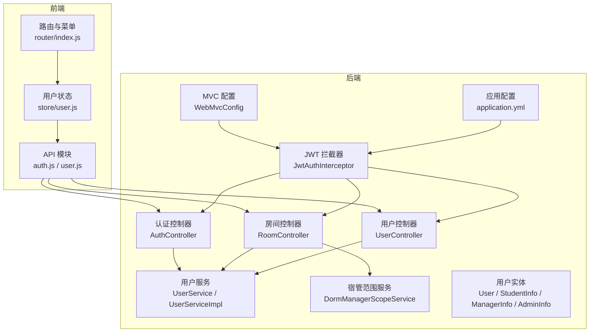
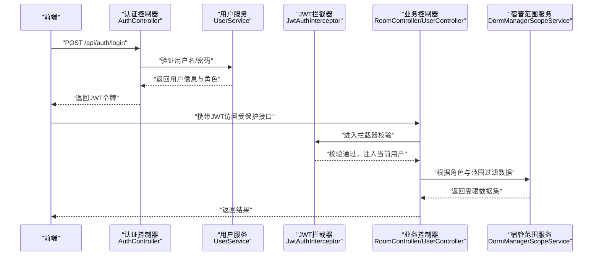
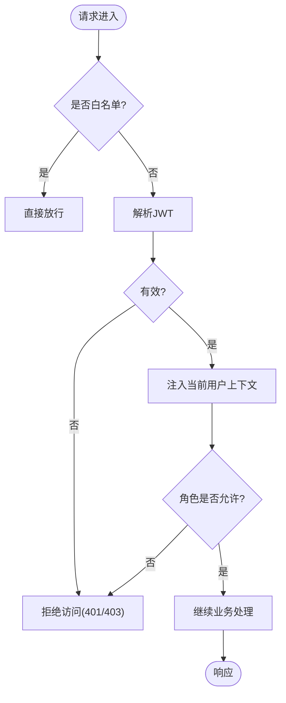
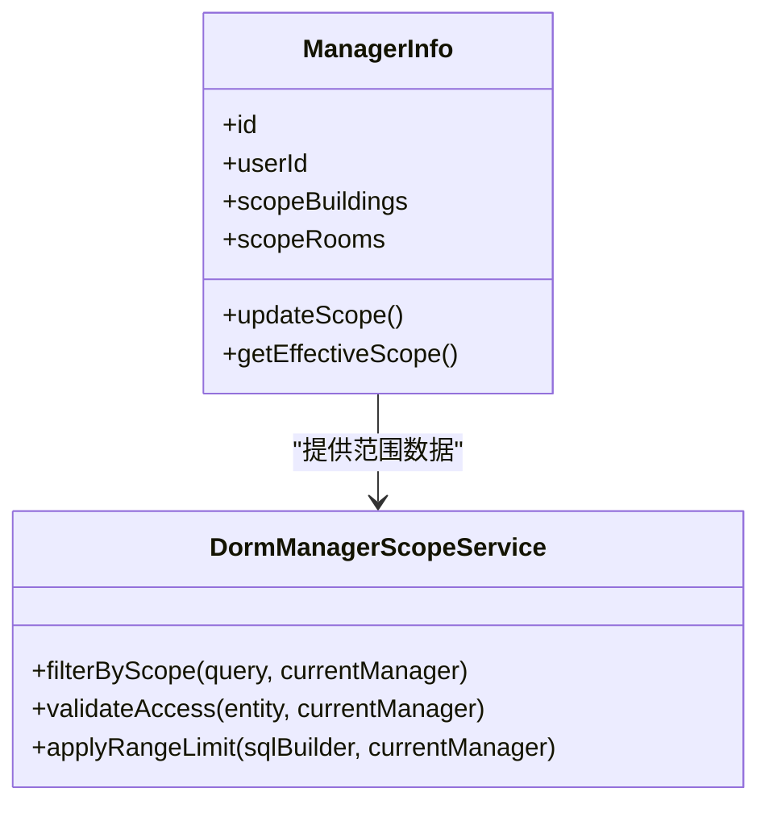
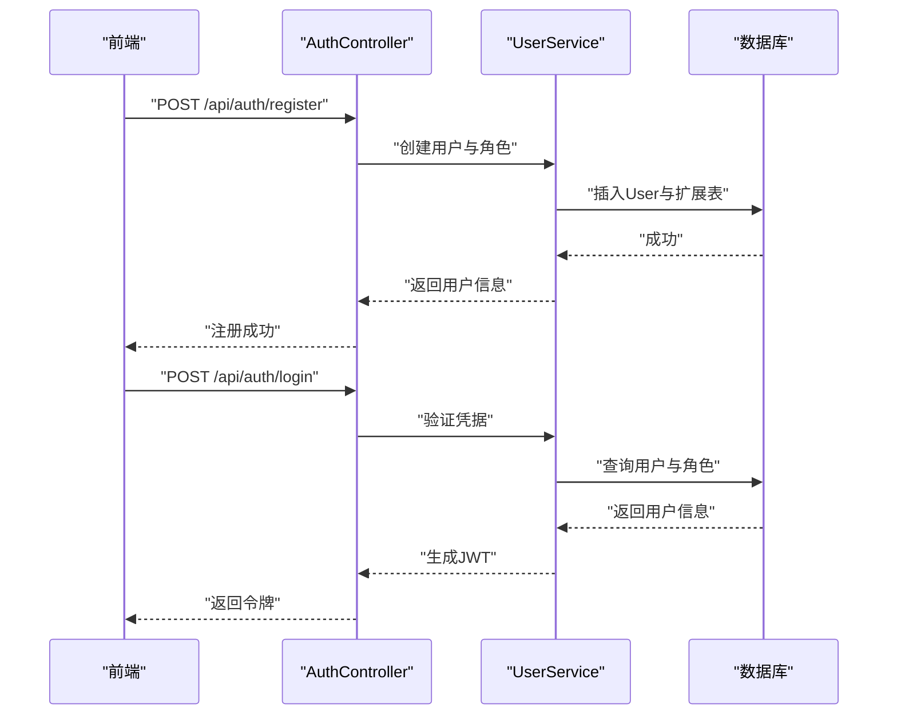
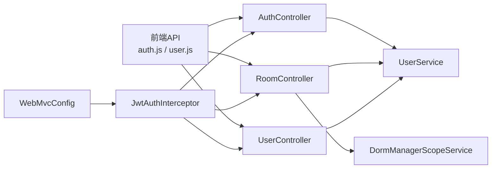

# 用户角色与权限

<cite>
**本文引用的文件**   
- [AuthController.java](file://backend/src/main/java/com/dorm/backend/controller/AuthController.java)
- [JwtAuthInterceptor.java](file://backend/src/main/java/com/dorm/backend/config/JwtAuthInterceptor.java)
- [WebMvcConfig.java](file://backend/src/main/java/com/dorm/backend/config/WebMvcConfig.java)
- [User.java](file://backend/src/main/java/com/dorm/backend/entity/User.java)
- [StudentInfo.java](file://backend/src/main/java/com/dorm/backend/entity/StudentInfo.java)
- [ManagerInfo.java](file://backend/src/main/java/com/dorm/backend/entity/ManagerInfo.java)
- [AdminInfo.java](file://backend/src/main/java/com/dorm/backend/entity/AdminInfo.java)
- [UserService.java](file://backend/src/main/java/com/dorm/backend/service/UserService.java)
- [UserServiceImpl.java](file://backend/src/main/java/com/dorm/backend/service/impl/UserServiceImpl.java)
- [DormManagerScopeService.java](file://backend/src/main/java/com/dorm/backend/service/DormManagerScopeService.java)
- [RoomController.java](file://backend/src/main/java/com/dorm/backend/controller/RoomController.java)
- [UserController.java](file://backend/src/main/java/com/dorm/backend/controller/UserController.java)
- [application.yml](file://backend/src/main/resources/application.yml)
- [schema.sql](file://backend/src/main/resources/schema.sql)
- [auth.js](file://frontend/src/api/auth.js)
- [user.js](file://frontend/src/api/user.js)
- [router/index.js](file://frontend/src/router/index.js)
- [store/user.js](file://frontend/src/store/user.js)
</cite>

## 目录
1. [引言](#引言)
2. [项目结构](#项目结构)
3. [核心组件](#核心组件)
4. [架构总览](#架构总览)
5. [详细组件分析](#详细组件分析)
6. [依赖关系分析](#依赖关系分析)
7. [性能考虑](#性能考虑)
8. [故障排查指南](#故障排查指南)
9. [结论](#结论)
10. [附录](#附录)

## 引言
本文件面向Dorm-Sys系统的“用户角色与权限”主题，系统性说明三类主要角色（学生、宿管人员、管理员）的权限范围与可访问功能；阐述基于角色的访问控制（RBAC）在后端拦截器与服务层中的实现机制，包括权限校验流程与数据隔离策略；解释宿管人员的管辖范围管理机制，确保数据安全与隐私保护；梳理用户注册、登录、密码管理等身份认证流程；提供权限配置最佳实践与安全建议；并给出角色扩展与自定义权限的开发指南。

## 项目结构
后端采用Spring Boot分层架构：控制器负责HTTP接口，服务层承载业务逻辑与权限校验，实体与Mapper映射数据库表，配置类集中管理跨域、拦截器与路由白名单等。前端使用Vue组织页面与路由，通过API模块调用后端接口，并在本地存储用户会话与权限信息。

图表来源
- [AuthController.java](file://backend/src/main/java/com/dorm/backend/controller/AuthController.java)
- [RoomController.java](file://backend/src/main/java/com/dorm/backend/controller/RoomController.java)
- [UserController.java](file://backend/src/main/java/com/dorm/backend/controller/UserController.java)
- [JwtAuthInterceptor.java](file://backend/src/main/java/com/dorm/backend/config/JwtAuthInterceptor.java)
- [WebMvcConfig.java](file://backend/src/main/java/com/dorm/backend/config/WebMvcConfig.java)
- [UserService.java](file://backend/src/main/java/com/dorm/backend/service/UserService.java)
- [UserServiceImpl.java](file://backend/src/main/java/com/dorm/backend/service/impl/UserServiceImpl.java)
- [DormManagerScopeService.java](file://backend/src/main/java/com/dorm/backend/service/DormManagerScopeService.java)
- [User.java](file://backend/src/main/java/com/dorm/backend/entity/User.java)
- [StudentInfo.java](file://backend/src/main/java/com/dorm/backend/entity/StudentInfo.java)
- [ManagerInfo.java](file://backend/src/main/java/com/dorm/backend/entity/ManagerInfo.java)
- [AdminInfo.java](file://backend/src/main/java/com/dorm/backend/entity/AdminInfo.java)
- [application.yml](file://backend/src/main/resources/application.yml)

章节来源
- [AuthController.java](file://backend/src/main/java/com/dorm/backend/controller/AuthController.java)
- [JwtAuthInterceptor.java](file://backend/src/main/java/com/dorm/backend/config/JwtAuthInterceptor.java)
- [WebMvcConfig.java](file://backend/src/main/java/com/dorm/backend/config/WebMvcConfig.java)
- [UserService.java](file://backend/src/main/java/com/dorm/backend/service/UserService.java)
- [UserServiceImpl.java](file://backend/src/main/java/com/dorm/backend/service/impl/UserServiceImpl.java)
- [DormManagerScopeService.java](file://backend/src/main/java/com/dorm/backend/service/DormManagerScopeService.java)
- [RoomController.java](file://backend/src/main/java/com/dorm/backend/controller/RoomController.java)
- [UserController.java](file://backend/src/main/java/com/dorm/backend/controller/UserController.java)
- [application.yml](file://backend/src/main/resources/application.yml)

## 核心组件
- 用户实体与角色划分
  - User：统一用户主表，包含账号、角色标识、状态等基础字段。
  - StudentInfo：学生扩展信息，关联宿舍、床位、班级等。
  - ManagerInfo：宿管人员扩展信息，包含管辖楼栋/房间范围。
  - AdminInfo：管理员扩展信息，具备系统级管理权限。
- 认证与授权
  - AuthController：处理注册、登录、登出、密码重置等认证相关接口。
  - JwtAuthInterceptor：统一鉴权拦截器，解析JWT、校验有效期、注入当前用户上下文。
  - WebMvcConfig：注册拦截器、配置白名单路径、跨域策略等。
- 服务层
  - UserService / UserServiceImpl：封装用户查询、角色判断、密码加密与校验、会话生成等。
  - DormManagerScopeService：提供宿管人员的数据范围过滤能力（按楼栋/房间）。
- 控制器
  - RoomController、UserController：在业务接口中结合当前用户角色与范围进行数据访问控制。

章节来源
- [User.java](file://backend/src/main/java/com/dorm/backend/entity/User.java)
- [StudentInfo.java](file://backend/src/main/java/com/dorm/backend/entity/StudentInfo.java)
- [ManagerInfo.java](file://backend/src/main/java/com/dorm/backend/entity/ManagerInfo.java)
- [AdminInfo.java](file://backend/src/main/java/com/dorm/backend/entity/AdminInfo.java)
- [AuthController.java](file://backend/src/main/java/com/dorm/backend/controller/AuthController.java)
- [JwtAuthInterceptor.java](file://backend/src/main/java/com/dorm/backend/config/JwtAuthInterceptor.java)
- [WebMvcConfig.java](file://backend/src/main/java/com/dorm/backend/config/WebMvcConfig.java)
- [UserService.java](file://backend/src/main/java/com/dorm/backend/service/UserService.java)
- [UserServiceImpl.java](file://backend/src/main/java/com/dorm/backend/service/impl/UserServiceImpl.java)
- [DormManagerScopeService.java](file://backend/src/main/java/com/dorm/backend/service/DormManagerScopeService.java)
- [RoomController.java](file://backend/src/main/java/com/dorm/backend/controller/RoomController.java)
- [UserController.java](file://backend/src/main/java/com/dorm/backend/controller/UserController.java)

## 架构总览
下图展示从前端请求到后端鉴权、授权与数据隔离的整体流程。

图表来源
- [AuthController.java](file://backend/src/main/java/com/dorm/backend/controller/AuthController.java)
- [UserService.java](file://backend/src/main/java/com/dorm/backend/service/UserService.java)
- [JwtAuthInterceptor.java](file://backend/src/main/java/com/dorm/backend/config/JwtAuthInterceptor.java)
- [RoomController.java](file://backend/src/main/java/com/dorm/backend/controller/RoomController.java)
- [UserController.java](file://backend/src/main/java/com/dorm/backend/controller/UserController.java)
- [DormManagerScopeService.java](file://backend/src/main/java/com/dorm/backend/service/DormManagerScopeService.java)

## 详细组件分析

### 角色与权限模型
- 角色定义
  - 学生：仅能访问个人相关数据与有限功能（如报修、访客登记、费用查看等）。
  - 宿管人员：可管理指定楼栋/房间范围内的数据（如入住办理、卫生检查、物品盘点、访客记录等），不可越权访问其他区域。
  - 管理员：拥有系统全局管理能力（用户管理、资源管理、报表与日志等）。
- 权限范围
  - 学生：以“本人”为数据边界，所有查询与操作均限制在当前学生ID范围内。
  - 宿管人员：以“管辖范围”为数据边界，所有查询与操作需经范围服务过滤。
  - 管理员：无数据边界限制，但需遵循最小权限原则进行细粒度控制。

章节来源
- [User.java](file://backend/src/main/java/com/dorm/backend/entity/User.java)
- [StudentInfo.java](file://backend/src/main/java/com/dorm/backend/entity/StudentInfo.java)
- [ManagerInfo.java](file://backend/src/main/java/com/dorm/backend/entity/ManagerInfo.java)
- [AdminInfo.java](file://backend/src/main/java/com/dorm/backend/entity/AdminInfo.java)

### RBAC鉴权流程（后端）
- 拦截器校验
  - 请求进入时由JwtAuthInterceptor解析Authorization头中的JWT。
  - 校验签名与过期时间，失败则拒绝访问。
  - 将当前用户信息注入请求上下文，供后续控制器与服务使用。
- 白名单与跨域
  - WebMvcConfig注册拦截器，并对登录、注册等公开接口放行。
  - 配置跨域策略，允许前端域名访问。
- 角色判断
  - 控制器或服务层根据用户角色决定可执行的操作与可见数据。

图表来源
- [JwtAuthInterceptor.java](file://backend/src/main/java/com/dorm/backend/config/JwtAuthInterceptor.java)
- [WebMvcConfig.java](file://backend/src/main/java/com/dorm/backend/config/WebMvcConfig.java)

章节来源
- [JwtAuthInterceptor.java](file://backend/src/main/java/com/dorm/backend/config/JwtAuthInterceptor.java)
- [WebMvcConfig.java](file://backend/src/main/java/com/dorm/backend/config/WebMvcConfig.java)

### 宿管人员管辖范围管理
- 范围来源
  - ManagerInfo中维护宿管的管辖楼栋/房间集合。
- 数据隔离
  - 所有涉及房间、床位、访客、卫生、物品等数据的查询与变更，均需通过DormManagerScopeService进行范围过滤。
  - 若请求参数未指定范围，默认以当前宿管的管辖范围为上限。
- 越权防护
  - 非宿管角色无法获取或修改他人管辖范围。
  - 范围变更需审计与审批（可通过OperationLog记录）。

图表来源
- [ManagerInfo.java](file://backend/src/main/java/com/dorm/backend/entity/ManagerInfo.java)
- [DormManagerScopeService.java](file://backend/src/main/java/com/dorm/backend/service/DormManagerScopeService.java)

章节来源
- [ManagerInfo.java](file://backend/src/main/java/com/dorm/backend/entity/ManagerInfo.java)
- [DormManagerScopeService.java](file://backend/src/main/java/com/dorm/backend/service/DormManagerScopeService.java)

### 用户注册、登录与密码管理
- 注册
  - 前端通过auth.js调用注册接口，后端校验唯一性、密码强度，写入User及对应角色扩展表。
- 登录
  - 前端提交用户名与密码，后端验证成功后生成JWT并返回。
  - 前端保存令牌至store/user.js，并在后续请求头中携带。
- 密码管理
  - 支持密码重置、修改；服务端进行强度校验与哈希存储。
  - 旧密码校验与更新原子性保证，避免并发问题。

图表来源
- [AuthController.java](file://backend/src/main/java/com/dorm/backend/controller/AuthController.java)
- [UserService.java](file://backend/src/main/java/com/dorm/backend/service/UserService.java)
- [UserServiceImpl.java](file://backend/src/main/java/com/dorm/backend/service/impl/UserServiceImpl.java)
- [auth.js](file://frontend/src/api/auth.js)
- [store/user.js](file://frontend/src/store/user.js)

章节来源
- [AuthController.java](file://backend/src/main/java/com/dorm/backend/controller/AuthController.java)
- [UserService.java](file://backend/src/main/java/com/dorm/backend/service/UserService.java)
- [UserServiceImpl.java](file://backend/src/main/java/com/dorm/backend/service/impl/UserServiceImpl.java)
- [auth.js](file://frontend/src/api/auth.js)
- [store/user.js](file://frontend/src/store/user.js)

### 前端路由与菜单权限
- 路由守卫
  - router/index.js根据用户角色动态挂载菜单与路由，未授权页面自动重定向。
- 状态管理
  - store/user.js维护用户信息、角色与令牌，提供统一的权限判断方法。
- API调用
  - auth.js与user.js封装登录、注册、用户信息等接口，统一错误处理与令牌刷新。

章节来源
- [router/index.js](file://frontend/src/router/index.js)
- [store/user.js](file://frontend/src/store/user.js)
- [auth.js](file://frontend/src/api/auth.js)
- [user.js](file://frontend/src/api/user.js)

## 依赖关系分析
- 控制器依赖服务层，服务层依赖实体与Mapper，拦截器依赖配置与JWT工具。
- 宿管范围服务作为横切能力被多个业务控制器复用，降低耦合度。
- 前端通过API模块解耦页面与后端交互，便于测试与维护。

图表来源
- [auth.js](file://frontend/src/api/auth.js)
- [user.js](file://frontend/src/api/user.js)
- [AuthController.java](file://backend/src/main/java/com/dorm/backend/controller/AuthController.java)
- [RoomController.java](file://backend/src/main/java/com/dorm/backend/controller/RoomController.java)
- [UserController.java](file://backend/src/main/java/com/dorm/backend/controller/UserController.java)
- [UserService.java](file://backend/src/main/java/com/dorm/backend/service/UserService.java)
- [DormManagerScopeService.java](file://backend/src/main/java/com/dorm/backend/service/DormManagerScopeService.java)
- [JwtAuthInterceptor.java](file://backend/src/main/java/com/dorm/backend/config/JwtAuthInterceptor.java)
- [WebMvcConfig.java](file://backend/src/main/java/com/dorm/backend/config/WebMvcConfig.java)

章节来源
- [auth.js](file://frontend/src/api/auth.js)
- [user.js](file://frontend/src/api/user.js)
- [AuthController.java](file://backend/src/main/java/com/dorm/backend/controller/AuthController.java)
- [RoomController.java](file://backend/src/main/java/com/dorm/backend/controller/RoomController.java)
- [UserController.java](file://backend/src/main/java/com/dorm/backend/controller/UserController.java)
- [UserService.java](file://backend/src/main/java/com/dorm/backend/service/UserService.java)
- [DormManagerScopeService.java](file://backend/src/main/java/com/dorm/backend/service/DormManagerScopeService.java)
- [JwtAuthInterceptor.java](file://backend/src/main/java/com/dorm/backend/config/JwtAuthInterceptor.java)
- [WebMvcConfig.java](file://backend/src/main/java/com/dorm/backend/config/WebMvcConfig.java)

## 性能考虑
- JWT校验开销低，建议在拦截器中缓存解析结果以减少重复计算。
- 宿管范围过滤应在SQL层完成，避免内存过滤导致大数据集传输。
- 对高频读接口启用缓存（如房间列表、公告），写接口保持强一致。
- 分页与索引优化：为常用查询字段建立索引，减少全表扫描。
- 连接池与线程池合理配置，避免高并发下资源争用。

[本节为通用指导，不直接分析具体文件]

## 故障排查指南
- 登录失败
  - 检查用户名/密码是否正确，确认User表中状态与角色字段。
  - 查看JWT生成与返回逻辑，确认前端是否正确保存与携带令牌。
- 权限不足
  - 核对当前用户角色与接口白名单配置。
  - 宿管人员数据为空时，检查ManagerInfo范围配置是否完整。
- 跨域问题
  - 确认WebMvcConfig中允许的源与方法。
- 数据越权
  - 检查DormManagerScopeService的范围过滤逻辑是否生效。
  - 审计日志定位异常操作。

章节来源
- [JwtAuthInterceptor.java](file://backend/src/main/java/com/dorm/backend/config/JwtAuthInterceptor.java)
- [WebMvcConfig.java](file://backend/src/main/java/com/dorm/backend/config/WebMvcConfig.java)
- [DormManagerScopeService.java](file://backend/src/main/java/com/dorm/backend/service/DormManagerScopeService.java)
- [User.java](file://backend/src/main/java/com/dorm/backend/entity/User.java)
- [ManagerInfo.java](file://backend/src/main/java/com/dorm/backend/entity/ManagerInfo.java)

## 结论
Dorm-Sys通过JWT拦截器与服务层范围过滤实现了稳健的RBAC体系，学生在“本人”维度、宿管在“管辖范围”维度、管理员在全局维度内获得一致的权限体验。通过清晰的职责分离与最小权限原则，系统在安全性与可维护性之间取得平衡。建议在生产环境持续完善审计、监控与限流策略，保障系统稳定运行。

[本节为总结性内容，不直接分析具体文件]

## 附录

### 权限配置最佳实践与安全建议
- 最小权限原则：为每个角色仅授予必要权限，避免过度授权。
- 白名单管理：严格限定无需鉴权的接口，定期审查。
- 密码安全：强制复杂度、历史密码去重、定期更换。
- 令牌安全：设置合理过期时间，支持刷新机制；敏感操作二次确认。
- 审计与日志：关键操作记录操作人、时间、IP与结果。
- 输入校验：对所有入参进行类型、长度、格式校验，防止注入与越权。
- 数据脱敏：对外输出敏感字段进行脱敏处理。

[本节为通用指导，不直接分析具体文件]

### 角色扩展与自定义权限开发指南
- 新增角色
  - 在User表中扩展角色枚举或新增角色表，并在UserService中补充角色判断逻辑。
- 新增权限点
  - 在控制器或服务层增加权限注解或方法级校验，结合拦截器统一处理。
- 范围扩展
  - 若新角色需要数据范围控制，参考DormManagerScopeService设计，提供范围过滤方法。
- 前端适配
  - 在router与store中新增角色对应的路由与菜单，确保界面与权限一致。
- 测试覆盖
  - 编写单元测试与端到端测试，覆盖正常与异常路径，确保权限边界正确。

章节来源
- [User.java](file://backend/src/main/java/com/dorm/backend/entity/User.java)
- [UserService.java](file://backend/src/main/java/com/dorm/backend/service/UserService.java)
- [DormManagerScopeService.java](file://backend/src/main/java/com/dorm/backend/service/DormManagerScopeService.java)
- [router/index.js](file://frontend/src/router/index.js)
- [store/user.js](file://frontend/src/store/user.js)

### 数据模型与表结构要点
- User：用户主表，包含账号、角色、状态等。
- StudentInfo：学生扩展信息，关联宿舍、床位等。
- ManagerInfo：宿管扩展信息，包含管辖楼栋/房间范围。
- AdminInfo：管理员扩展信息，用于系统管理。
- 其他业务表：房间、床位、访客、卫生、物品、报修、费用等，均在查询与变更时受角色与范围控制。

章节来源
- [schema.sql](file://backend/src/main/resources/schema.sql)
- [User.java](file://backend/src/main/java/com/dorm/backend/entity/User.java)
- [StudentInfo.java](file://backend/src/main/java/com/dorm/backend/entity/StudentInfo.java)
- [ManagerInfo.java](file://backend/src/main/java/com/dorm/backend/entity/ManagerInfo.java)
- [AdminInfo.java](file://backend/src/main/java/com/dorm/backend/entity/AdminInfo.java)