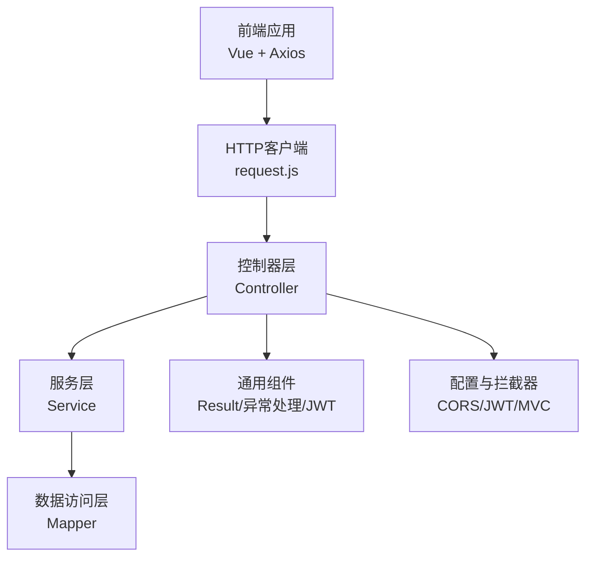
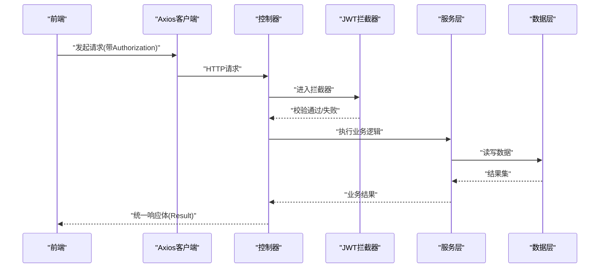
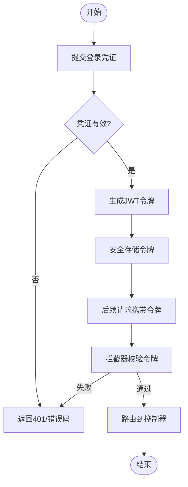

# API设计规范

<cite>
**本文引用的文件**   
- [Result.java](file://backend/src/main/java/com/dorm/backend/common/Result.java)
- [GlobalExceptionHandler.java](file://backend/src/main/java/com/dorm/backend/common/GlobalExceptionHandler.java)
- [JwtUtils.java](file://backend/src/main/java/com/dorm/backend/common/JwtUtils.java)
- [AuthController.java](file://backend/src/main/java/com/dorm/backend/controller/AuthController.java)
- [UserController.java](file://backend/src/main/java/com/dorm/backend/controller/UserController.java)
- [RoomController.java](file://backend/src/main/java/com/dorm/backend/controller/RoomController.java)
- [BedController.java](file://backend/src/main/java/com/dorm/backend/controller/BedController.java)
- [BuildingController.java](file://backend/src/main/java/com/dorm/backend/controller/BuildingController.java)
- [RepairRequestController.java](file://backend/src/main/java/com/dorm/backend/controller/RepairRequestController.java)
- [BusinessRecordController.java](file://backend/src/main/java/com/dorm/backend/controller/BusinessRecordController.java)
- [OperationLogController.java](file://backend/src/main/java/com/dorm/backend/controller/OperationLogController.java)
- [AdminReportController.java](file://backend/src/main/java/com/dorm/backend/controller/AdminReportController.java)
- [AiController.java](file://backend/src/main/java/com/dorm/backend/controller/AiController.java)
- [ChatController.java](file://backend/src/main/java/com/dorm/backend/controller/ChatController.java)
- [DashboardController.java](file://backend/src/main/java/com/dorm/backend/controller/DashboardController.java)
- [FeeBillController.java](file://backend/src/main/java/com/dorm/backend/controller/FeeBillController.java)
- [HygieneRecordController.java](file://backend/src/main/java/com/dorm/backend/controller/HygieneRecordController.java)
- [ItemRecordController.java](file://backend/src/main/java/com/dorm/backend/controller/ItemRecordController.java)
- [LateReturnRecordController.java](file://backend/src/main/java/com/dorm/backend/controller/LateReturnRecordController.java)
- [StayHistoryController.java](file://backend/src/main/java/com/dorm/backend/controller/StayHistoryController.java)
- [TransferRequestController.java](file://backend/src/main/java/com/dorm/backend/controller/TransferRequestController.java)
- [VisitorRecordController.java](file://backend/src/main/java/com/dorm/backend/controller/VisitorRecordController.java)
- [LoginDTO.java](file://backend/src/main/java/com/dorm/backend/dto/LoginDTO.java)
- [RoomBatchCreateRequest.java](file://backend/src/main/java/com/dorm/backend/dto/RoomBatchCreateRequest.java)
- [CorsConfig.java](file://backend/src/main/java/com/dorm/backend/config/CorsConfig.java)
- [JwtAuthInterceptor.java](file://backend/src/main/java/com/dorm/backend/config/JwtAuthInterceptor.java)
- [WebMvcConfig.java](file://backend/src/main/java/com/dorm/backend/config/WebMvcConfig.java)
- [request.js](file://frontend/src/utils/request.js)
- [auth.js](file://frontend/src/api/auth.js)
- [user.js](file://frontend/src/api/user.js)
- [room.js](file://frontend/src/api/room.js)
</cite>

## 目录
1. [简介](#简介)
2. [项目结构](#项目结构)
3. [核心组件](#核心组件)
4. [架构总览](#架构总览)
5. [详细组件分析](#详细组件分析)
6. [依赖关系分析](#依赖关系分析)
7. [性能考虑](#性能考虑)
8. [故障排查指南](#故障排查指南)
9. [结论](#结论)
10. [附录](#附录)

## 简介
本规范面向宿舍管理系统的RESTful API设计，统一约定URL路径、HTTP方法、状态码、请求与响应格式、参数校验、错误码、版本管理与向后兼容策略，并提供标准调用示例与最佳实践。目标是让前后端协作高效、接口稳定可演进、错误可观测易定位。

## 项目结构
后端采用分层架构：控制器层暴露REST接口，服务层实现业务逻辑，数据访问层通过Mapper操作数据库；通用能力集中在common包（统一响应、异常处理、JWT工具等），配置集中在config包（CORS、拦截器、MVC配置）。前端通过统一的HTTP客户端封装调用后端API。

**图表来源** 
- [WebMvcConfig.java](file://backend/src/main/java/com/dorm/backend/config/WebMvcConfig.java)
- [CorsConfig.java](file://backend/src/main/java/com/dorm/backend/config/CorsConfig.java)
- [JwtAuthInterceptor.java](file://backend/src/main/java/com/dorm/backend/config/JwtAuthInterceptor.java)
- [Result.java](file://backend/src/main/java/com/dorm/backend/common/Result.java)
- [GlobalExceptionHandler.java](file://backend/src/main/java/com/dorm/backend/common/GlobalExceptionHandler.java)
- [request.js](file://frontend/src/utils/request.js)

**章节来源**
- [WebMvcConfig.java](file://backend/src/main/java/com/dorm/backend/config/WebMvcConfig.java)
- [CorsConfig.java](file://backend/src/main/java/com/dorm/backend/config/CorsConfig.java)
- [JwtAuthInterceptor.java](file://backend/src/main/java/com/dorm/backend/config/JwtAuthInterceptor.java)

## 核心组件
- 统一响应体 Result：所有API返回统一结构，包含状态码、消息、数据载荷与时间戳，便于前端一致化处理。
- 全局异常处理器 GlobalExceptionHandler：集中捕获并转换为统一响应，保证错误信息标准化。
- JWT工具 JwtUtils：用于令牌生成与解析，配合拦截器完成鉴权。
- 认证控制器 AuthController：登录、登出、刷新令牌等入口。
- 业务控制器：用户、房间、床位、楼栋、报修、记录等模块的REST接口。

**章节来源**
- [Result.java](file://backend/src/main/java/com/dorm/backend/common/Result.java)
- [GlobalExceptionHandler.java](file://backend/src/main/java/com/dorm/backend/common/GlobalExceptionHandler.java)
- [JwtUtils.java](file://backend/src/main/java/com/dorm/backend/common/JwtUtils.java)
- [AuthController.java](file://backend/src/main/java/com/dorm/backend/controller/AuthController.java)

## 架构总览
下图展示一次典型受保护接口的调用流程：前端携带Token发起请求，经过CORS与JWT拦截器校验后进入控制器，再经服务层与数据层处理，最终由统一响应体返回。

**图表来源** 
- [JwtAuthInterceptor.java](file://backend/src/main/java/com/dorm/backend/config/JwtAuthInterceptor.java)
- [AuthController.java](file://backend/src/main/java/com/dorm/backend/controller/AuthController.java)
- [Result.java](file://backend/src/main/java/com/dorm/backend/common/Result.java)

## 详细组件分析

### RESTful API设计原则与命名约定
- URL路径
  - 使用名词复数表示资源集合，如 /users、/rooms、/beds、/buildings、/repair-requests、/business-records、/operation-logs、/admin-reports、/chat、/dashboard、/fee-bills、/hygiene-records、/item-records、/late-return-records、/stay-histories、/transfer-requests、/visitor-records。
  - 层级清晰，子资源用路径嵌套，如 /rooms/{roomId}/beds。
  - 避免动词，使用HTTP方法表达动作，如 GET/POST/PUT/DELETE。
- HTTP方法
  - GET：查询资源或列表，支持分页与过滤。
  - POST：创建资源或执行无副作用的操作（如登录）。
  - PUT：全量更新资源。
  - PATCH：部分更新资源。
  - DELETE：删除资源。
- 查询参数
  - 分页：page、size、sort。
  - 过滤：按字段名传递，如 status、keyword。
  - 排序：sort=field,asc|desc。
- 头部与编码
  - Content-Type: application/json。
  - Authorization: Bearer <token>（受保护接口）。
  - Accept-Language：可选，用于国际化。
- 版本管理
  - 建议通过URL前缀进行版本控制，如 /api/v1/...。当前代码未显式包含版本前缀，建议在网关或路由层统一添加，保持向后兼容。

**章节来源**
- [AuthController.java](file://backend/src/main/java/com/dorm/backend/controller/AuthController.java)
- [UserController.java](file://backend/src/main/java/com/dorm/backend/controller/UserController.java)
- [RoomController.java](file://backend/src/main/java/com/dorm/backend/controller/RoomController.java)
- [BedController.java](file://backend/src/main/java/com/dorm/backend/controller/BedController.java)
- [BuildingController.java](file://backend/src/main/java/com/dorm/backend/controller/BuildingController.java)
- [RepairRequestController.java](file://backend/src/main/java/com/dorm/backend/controller/RepairRequestController.java)
- [BusinessRecordController.java](file://backend/src/main/java/com/dorm/backend/controller/BusinessRecordController.java)
- [OperationLogController.java](file://backend/src/main/java/com/dorm/backend/controller/OperationLogController.java)
- [AdminReportController.java](file://backend/src/main/java/com/dorm/backend/controller/AdminReportController.java)
- [AiController.java](file://backend/src/main/java/com/dorm/backend/controller/AiController.java)
- [ChatController.java](file://backend/src/main/java/com/dorm/backend/controller/ChatController.java)
- [DashboardController.java](file://backend/src/main/java/com/dorm/backend/controller/DashboardController.java)
- [FeeBillController.java](file://backend/src/main/java/com/dorm/backend/controller/FeeBillController.java)
- [HygieneRecordController.java](file://backend/src/main/java/com/dorm/backend/controller/HygieneRecordController.java)
- [ItemRecordController.java](file://backend/src/main/java/com/dorm/backend/controller/ItemRecordController.java)
- [LateReturnRecordController.java](file://backend/src/main/java/com/dorm/backend/controller/LateReturnRecordController.java)
- [StayHistoryController.java](file://backend/src/main/java/com/dorm/backend/controller/StayHistoryController.java)
- [TransferRequestController.java](file://backend/src/main/java/com/dorm/backend/controller/TransferRequestController.java)
- [VisitorRecordController.java](file://backend/src/main/java/com/dorm/backend/controller/VisitorRecordController.java)

### 统一响应格式 Result
- 结构字段
  - code：业务状态码（整数）。
  - message：人类可读的消息（字符串）。
  - data：业务数据载荷（对象或数组，可为空）。
  - timestamp：响应时间戳（毫秒）。
- 语义
  - 成功：code为业务成功码，data承载数据。
  - 失败：code为非成功码，message描述错误原因。
- 前端处理
  - 前端应基于code判断成功与否，并在失败时提示message。

**章节来源**
- [Result.java](file://backend/src/main/java/com/dorm/backend/common/Result.java)

### 请求参数验证规则
- 必填校验：对关键入参进行非空校验（如用户名、密码、ID等）。
- 类型与长度：确保数据类型正确，限制字符串长度与数值范围。
- 格式校验：邮箱、手机号、日期等遵循标准格式。
- 业务校验：唯一性、权限、状态机约束等在服务层完成。
- 校验失败：返回统一错误响应，包含具体字段级错误信息。

**章节来源**
- [LoginDTO.java](file://backend/src/main/java/com/dorm/backend/dto/LoginDTO.java)
- [RoomBatchCreateRequest.java](file://backend/src/main/java/com/dorm/backend/dto/RoomBatchCreateRequest.java)
- [GlobalExceptionHandler.java](file://backend/src/main/java/com/dorm/backend/common/GlobalExceptionHandler.java)

### 错误码规范
- 分类
  - 系统级：网络、超时、内部错误等。
  - 业务级：资源不存在、权限不足、参数非法、业务规则冲突等。
- 定义
  - 使用Result.code区分不同错误类别。
  - 在GlobalExceptionHandler中统一转换异常为Result。
- 示例
  - 400：参数错误。
  - 401：未认证或令牌无效。
  - 403：权限不足。
  - 404：资源不存在。
  - 500：服务器内部错误。

**章节来源**
- [GlobalExceptionHandler.java](file://backend/src/main/java/com/dorm/backend/common/GlobalExceptionHandler.java)
- [JwtUtils.java](file://backend/src/main/java/com/dorm/backend/common/JwtUtils.java)

### 认证与授权
- 认证流程
  - 登录：POST /auth/login，返回令牌。
  - 鉴权：受保护接口需携带Authorization头，由JWT拦截器校验。
- 令牌管理
  - 生成与解析由JwtUtils负责。
  - 过期与刷新策略应在服务端明确，前端妥善存储与重试。
- 权限控制
  - 基于角色或范围的细粒度授权可在服务层或拦截器扩展。

**图表来源** 
- [AuthController.java](file://backend/src/main/java/com/dorm/backend/controller/AuthController.java)
- [JwtAuthInterceptor.java](file://backend/src/main/java/com/dorm/backend/config/JwtAuthInterceptor.java)
- [JwtUtils.java](file://backend/src/main/java/com/dorm/backend/common/JwtUtils.java)

**章节来源**
- [AuthController.java](file://backend/src/main/java/com/dorm/backend/controller/AuthController.java)
- [JwtAuthInterceptor.java](file://backend/src/main/java/com/dorm/backend/config/JwtAuthInterceptor.java)
- [JwtUtils.java](file://backend/src/main/java/com/dorm/backend/common/JwtUtils.java)

### API版本管理与向后兼容
- 版本策略
  - 推荐URL前缀 /api/v1/...，新增功能在不破坏既有契约的前提下迭代。
  - 废弃字段与接口保留过渡期，提供迁移指引。
- 兼容性保证
  - 不删除已有字段，仅标记废弃。
  - 新增可选字段，默认值明确。
  - 变更枚举值时提供映射与降级策略。
- 前端适配
  - 根据version字段选择适配逻辑，逐步升级。

[本节为概念性说明，不直接分析具体文件]

### 标准API调用示例与最佳实践
- 登录
  - 方法：POST
  - 路径：/auth/login
  - 请求体：包含用户名与密码
  - 响应：统一Result，data中包含令牌
- 获取用户信息
  - 方法：GET
  - 路径：/users/me
  - 头部：Authorization: Bearer <token>
  - 响应：统一Result，data为用户对象
- 房间列表
  - 方法：GET
  - 路径：/rooms?page=1&size=20&status=available
  - 响应：统一Result，data为分页数据
- 最佳实践
  - 始终使用HTTPS。
  - 合理设置缓存与ETag。
  - 幂等性：POST重复提交需去重。
  - 限流与熔断：对高频接口实施保护。
  - 日志与审计：记录关键操作与错误。

**章节来源**
- [auth.js](file://frontend/src/api/auth.js)
- [user.js](file://frontend/src/api/user.js)
- [room.js](file://frontend/src/api/room.js)
- [request.js](file://frontend/src/utils/request.js)

## 依赖关系分析
- 控制器依赖服务层，服务层依赖数据访问层。
- 通用组件被各层复用：Result用于响应封装，GlobalExceptionHandler统一错误处理，JwtUtils辅助鉴权。
- 配置类集中管理跨域、拦截器与MVC行为。

```mermaid
classDiagram
class AuthController {
+login()
+logout()
}
class UserController {
+getMe()
+updateProfile()
}
class RoomController {
+listRooms()
+createRoom()
+updateRoom()
+deleteRoom()
}
class BedController {
+listBeds()
+assignBed()
}
class BuildingController {
+listBuildings()
+createBuilding()
}
class RepairRequestController {
+submitRepair()
+queryRepairs()
}
class BusinessRecordController {
+createRecord()
+queryRecords()
}
class OperationLogController {
+queryLogs()
}
class AdminReportController {
+generateReport()
}
class AiController {
+askAI()
}
class ChatController {
+sendMessage()
+receiveMessage()
}
class DashboardController {
+getOverview()
}
class FeeBillController {
+createBill()
+queryBills()
}
class HygieneRecordController {
+submitHygiene()
+queryHygiene()
}
class ItemRecordController {
+addItem()
+queryItems()
}
class LateReturnRecordController {
+reportLate()
+queryLate()
}
class StayHistoryController {
+checkin()
+checkout()
+queryHistory()
}
class TransferRequestController {
+submitTransfer()
+approveTransfer()
}
class VisitorRecordController {
+registerVisitor()
+queryVisitors()
}
class Result {
+code
+message
+data
+timestamp
}
class GlobalExceptionHandler {
+handleException()
}
class JwtUtils {
+generateToken()
+parseToken()
}
class JwtAuthInterceptor {
+preHandle()
}
AuthController --> Result : "返回"
UserController --> Result : "返回"
RoomController --> Result : "返回"
BedController --> Result : "返回"
BuildingController --> Result : "返回"
RepairRequestController --> Result : "返回"
BusinessRecordController --> Result : "返回"
OperationLogController --> Result : "返回"
AdminReportController --> Result : "返回"
AiController --> Result : "返回"
ChatController --> Result : "返回"
DashboardController --> Result : "返回"
FeeBillController --> Result : "返回"
HygieneRecordController --> Result : "返回"
ItemRecordController --> Result : "返回"
LateReturnRecordController --> Result : "返回"
StayHistoryController --> Result : "返回"
TransferRequestController --> Result : "返回"
VisitorRecordController --> Result : "返回"
GlobalExceptionHandler --> Result : "封装错误"
JwtAuthInterceptor --> JwtUtils : "使用"
```

**图表来源** 
- [AuthController.java](file://backend/src/main/java/com/dorm/backend/controller/AuthController.java)
- [UserController.java](file://backend/src/main/java/com/dorm/backend/controller/UserController.java)
- [RoomController.java](file://backend/src/main/java/com/dorm/backend/controller/RoomController.java)
- [BedController.java](file://backend/src/main/java/com/dorm/backend/controller/BedController.java)
- [BuildingController.java](file://backend/src/main/java/com/dorm/backend/controller/BuildingController.java)
- [RepairRequestController.java](file://backend/src/main/java/com/dorm/backend/controller/RepairRequestController.java)
- [BusinessRecordController.java](file://backend/src/main/java/com/dorm/backend/controller/BusinessRecordController.java)
- [OperationLogController.java](file://backend/src/main/java/com/dorm/backend/controller/OperationLogController.java)
- [AdminReportController.java](file://backend/src/main/java/com/dorm/backend/controller/AdminReportController.java)
- [AiController.java](file://backend/src/main/java/com/dorm/backend/controller/AiController.java)
- [ChatController.java](file://backend/src/main/java/com/dorm/backend/controller/ChatController.java)
- [DashboardController.java](file://backend/src/main/java/com/dorm/backend/controller/DashboardController.java)
- [FeeBillController.java](file://backend/src/main/java/com/dorm/backend/controller/FeeBillController.java)
- [HygieneRecordController.java](file://backend/src/main/java/com/dorm/backend/controller/HygieneRecordController.java)
- [ItemRecordController.java](file://backend/src/main/java/com/dorm/backend/controller/ItemRecordController.java)
- [LateReturnRecordController.java](file://backend/src/main/java/com/dorm/backend/controller/LateReturnRecordController.java)
- [StayHistoryController.java](file://backend/src/main/java/com/dorm/backend/controller/StayHistoryController.java)
- [TransferRequestController.java](file://backend/src/main/java/com/dorm/backend/controller/TransferRequestController.java)
- [VisitorRecordController.java](file://backend/src/main/java/com/dorm/backend/controller/VisitorRecordController.java)
- [Result.java](file://backend/src/main/java/com/dorm/backend/common/Result.java)
- [GlobalExceptionHandler.java](file://backend/src/main/java/com/dorm/backend/common/GlobalExceptionHandler.java)
- [JwtUtils.java](file://backend/src/main/java/com/dorm/backend/common/JwtUtils.java)
- [JwtAuthInterceptor.java](file://backend/src/main/java/com/dorm/backend/config/JwtAuthInterceptor.java)

## 性能考虑
- 分页与索引：列表接口强制分页，数据库层建立合适索引。
- 缓存策略：热点数据使用缓存（如Redis），减少数据库压力。
- 连接池：合理配置数据库与HTTP连接池大小。
- 异步处理：耗时任务异步化，避免阻塞主线程。
- 压缩与传输：启用Gzip压缩，减少带宽占用。
- 监控与告警：接入APM与日志聚合，快速定位瓶颈。

[本节为通用指导，不直接分析具体文件]

## 故障排查指南
- 常见问题
  - 401未认证：检查Authorization头与令牌有效性。
  - 403权限不足：确认用户角色与资源范围。
  - 404资源不存在：核对路径与ID。
  - 500服务器错误：查看服务端日志与堆栈。
- 调试步骤
  - 使用浏览器开发者工具或Postman复现问题。
  - 检查请求头、请求体与响应体。
  - 查看GlobalExceptionHandler输出的错误信息。
  - 结合日志定位服务层与数据层问题。

**章节来源**
- [GlobalExceptionHandler.java](file://backend/src/main/java/com/dorm/backend/common/GlobalExceptionHandler.java)
- [JwtAuthInterceptor.java](file://backend/src/main/java/com/dorm/backend/config/JwtAuthInterceptor.java)
- [JwtUtils.java](file://backend/src/main/java/com/dorm/backend/common/JwtUtils.java)

## 结论
本规范明确了宿舍管理系统API的设计原则、命名约定、统一响应格式、参数校验与错误码、版本管理与兼容性策略，以及标准调用示例与最佳实践。遵循本规范可实现接口一致性、可维护性与可扩展性，提升团队协作效率与用户体验。

## 附录
- CORS配置：允许跨域请求，确保开发环境顺畅联调。
- MVC配置：注册拦截器与视图解析器，统一处理请求生命周期。
- 前端HTTP客户端：统一封装请求、响应与错误处理逻辑。

**章节来源**
- [CorsConfig.java](file://backend/src/main/java/com/dorm/backend/config/CorsConfig.java)
- [WebMvcConfig.java](file://backend/src/main/java/com/dorm/backend/config/WebMvcConfig.java)
- [request.js](file://frontend/src/utils/request.js)