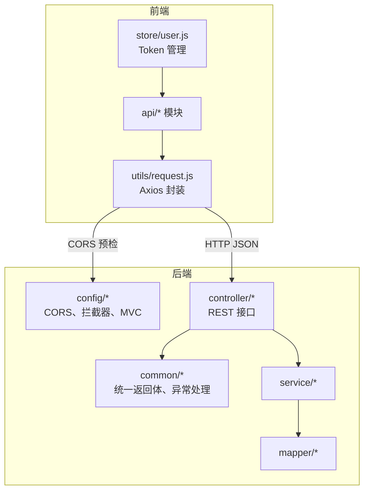
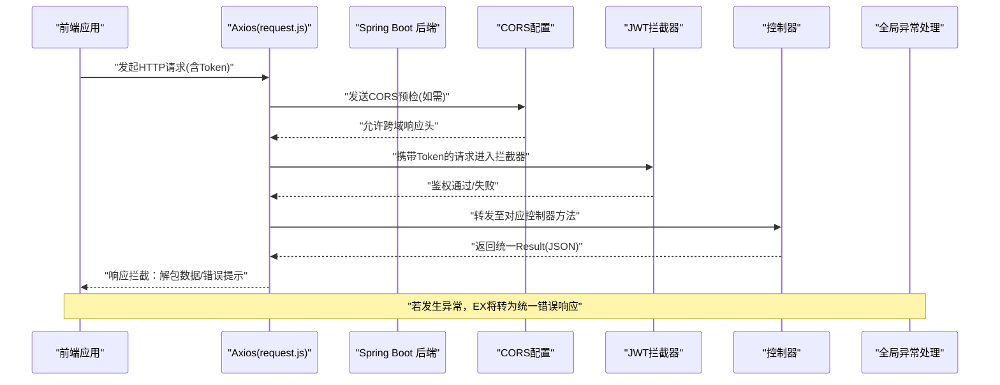
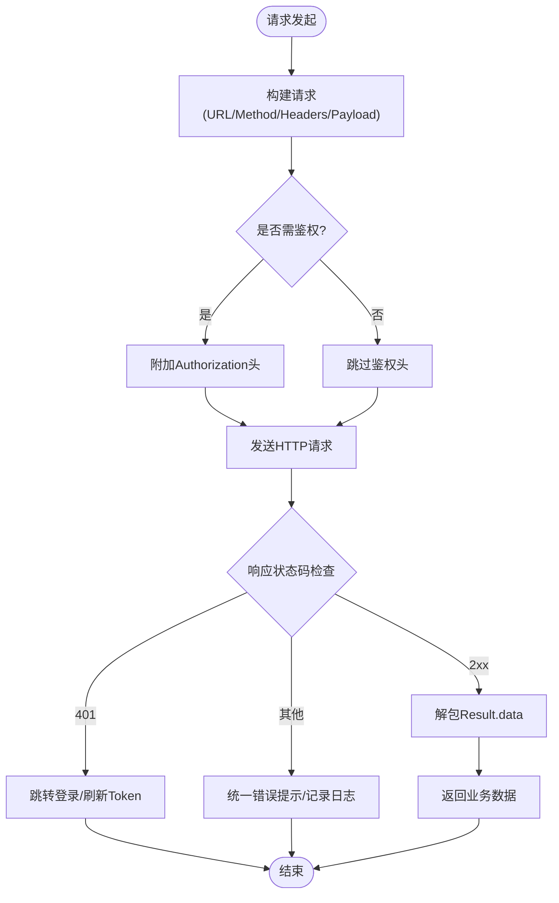
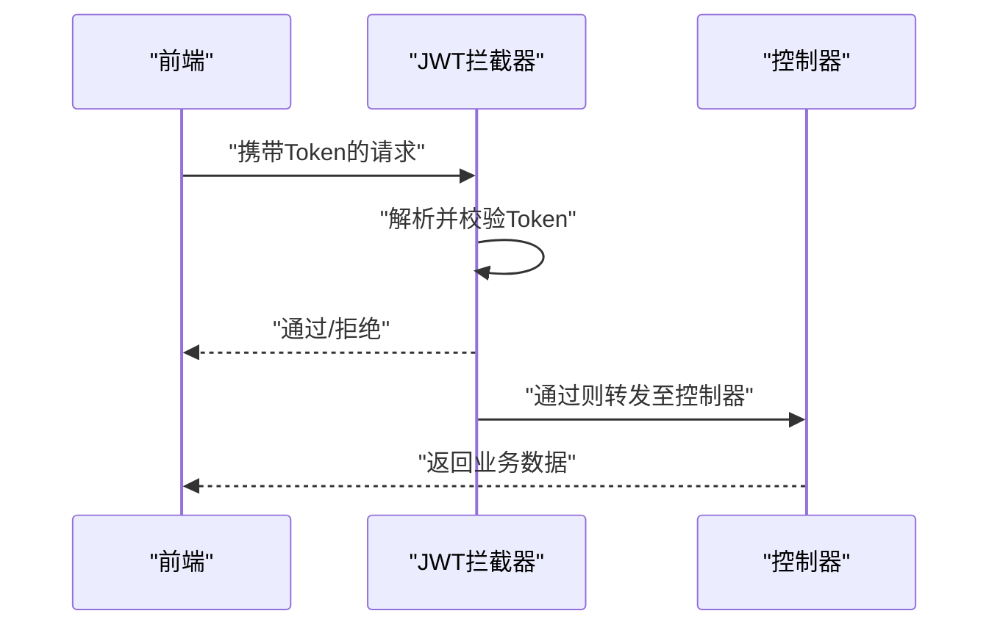
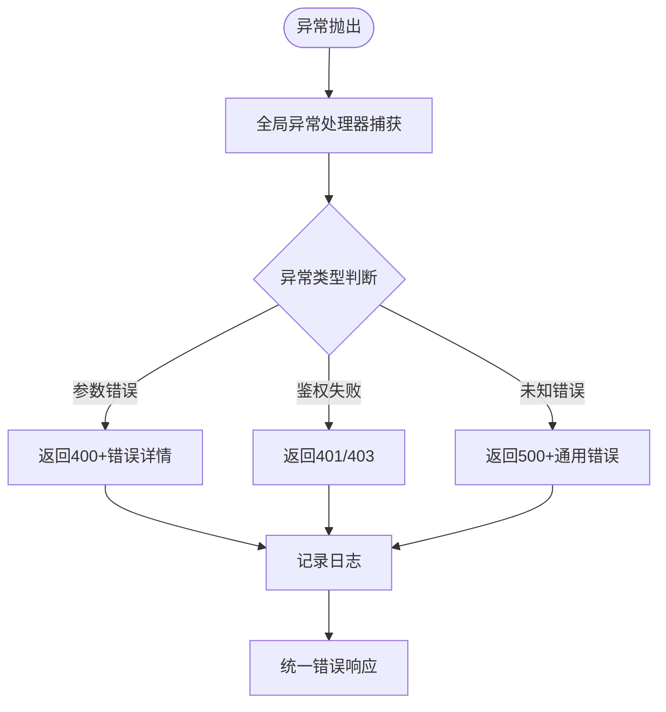
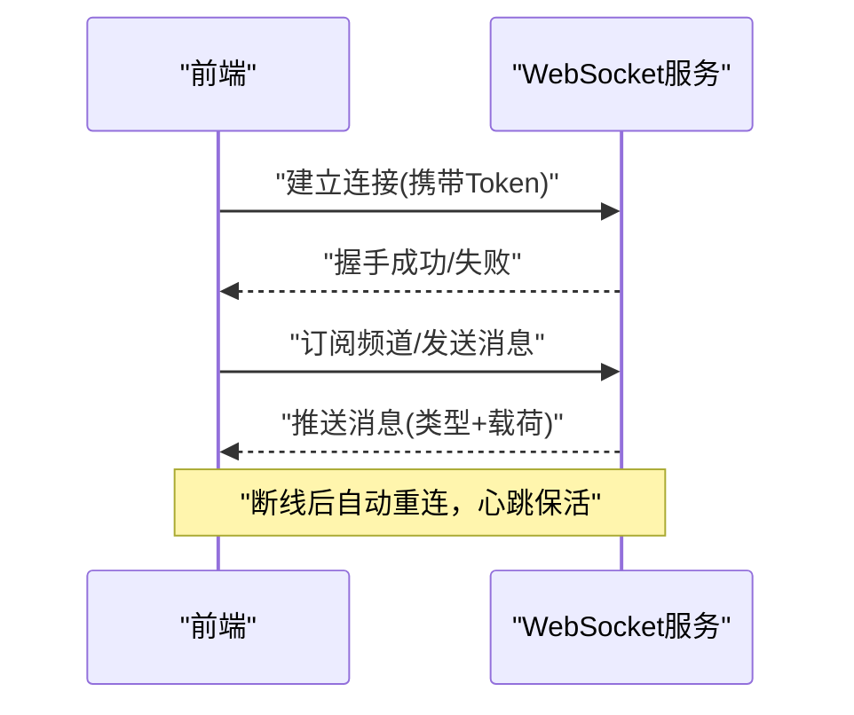
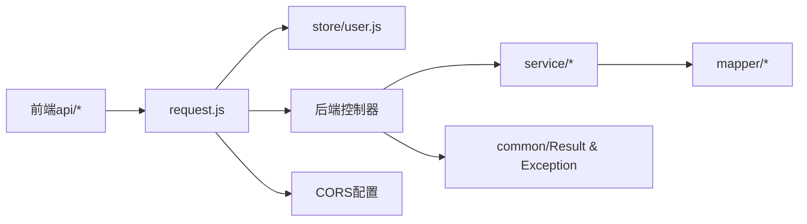

# 前后端通信

<cite>
**本文引用的文件**   
- [backend/src/main/java/com/dorm/backend/common/GlobalExceptionHandler.java](file://backend/src/main/java/com/dorm/backend/common/GlobalExceptionHandler.java)
- [backend/src/main/java/com/dorm/backend/common/Result.java](file://backend/src/main/java/com/dorm/backend/common/Result.java)
- [backend/src/main/java/com/dorm/backend/config/CorsConfig.java](file://backend/src/main/java/com/dorm/backend/config/CorsConfig.java)
- [backend/src/main/java/com/dorm/backend/config/JwtAuthInterceptor.java](file://backend/src/main/java/com/dorm/backend/config/JwtAuthInterceptor.java)
- [backend/src/main/java/com/dorm/backend/config/WebMvcConfig.java](file://backend/src/main/java/com/dorm/backend/config/WebMvcConfig.java)
- [backend/src/main/java/com/dorm/backend/controller/AuthController.java](file://backend/src/main/java/com/dorm/backend/controller/AuthController.java)
- [backend/src/main/java/com/dorm/backend/controller/UserController.java](file://backend/src/main/java/com/dorm/backend/controller/UserController.java)
- [backend/src/main/java/com/dorm/backend/controller/ChatController.java](file://backend/src/main/java/com/dorm/backend/controller/ChatController.java)
- [frontend/src/utils/request.js](file://frontend/src/utils/request.js)
- [frontend/src/api/auth.js](file://frontend/src/api/auth.js)
- [frontend/src/api/user.js](file://frontend/src/api/user.js)
- [frontend/src/store/user.js](file://frontend/src/store/user.js)
</cite>

## 目录
1. [简介](#简介)
2. [项目结构](#项目结构)
3. [核心组件](#核心组件)
4. [架构总览](#架构总览)
5. [详细组件分析](#详细组件分析)
6. [依赖关系分析](#依赖关系分析)
7. [性能考虑](#性能考虑)
8. [故障排查指南](#故障排查指南)
9. [结论](#结论)
10. [附录](#附录)

## 简介
本文件面向宿舍管理系统的前后端通信，覆盖 RESTful API 设计规范、JSON 数据交换格式、HTTP 请求封装与响应处理、错误处理机制、跨域资源共享（CORS）配置与安全、API 版本管理与向后兼容策略、请求/响应拦截器实现与使用、常用 API 调用示例与最佳实践，以及 WebSocket 实时通信方案。文档基于仓库中的后端 Spring Boot 控制器、全局异常处理、CORS 与拦截器配置，以及前端 Axios 请求封装与 API 模块进行说明。

## 项目结构
- 后端采用 Spring Boot 分层架构：controller（接口层）、service（业务层）、mapper（数据访问层）、common（通用组件如统一返回体与异常处理）、config（Web 配置如 CORS、拦截器）。
- 前端采用 Vue 工程，通过 utils/request.js 封装 Axios 实例，api/* 按功能域组织接口调用，store 管理用户状态（如 Token）。

**图表来源** 
- [backend/src/main/java/com/dorm/backend/config/CorsConfig.java](file://backend/src/main/java/com/dorm/backend/config/CorsConfig.java)
- [backend/src/main/java/com/dorm/backend/config/WebMvcConfig.java](file://backend/src/main/java/com/dorm/backend/config/WebMvcConfig.java)
- [backend/src/main/java/com/dorm/backend/controller/AuthController.java](file://backend/src/main/java/com/dorm/backend/controller/AuthController.java)
- [backend/src/main/java/com/dorm/backend/common/Result.java](file://backend/src/main/java/com/dorm/backend/common/Result.java)
- [backend/src/main/java/com/dorm/backend/common/GlobalExceptionHandler.java](file://backend/src/main/java/com/dorm/backend/common/GlobalExceptionHandler.java)
- [frontend/src/utils/request.js](file://frontend/src/utils/request.js)
- [frontend/src/api/auth.js](file://frontend/src/api/auth.js)
- [frontend/src/store/user.js](file://frontend/src/store/user.js)

**章节来源**
- [backend/src/main/java/com/dorm/backend/config/CorsConfig.java](file://backend/src/main/java/com/dorm/backend/config/CorsConfig.java)
- [backend/src/main/java/com/dorm/backend/config/WebMvcConfig.java](file://backend/src/main/java/com/dorm/backend/config/WebMvcConfig.java)
- [backend/src/main/java/com/dorm/backend/common/Result.java](file://backend/src/main/java/com/dorm/backend/common/Result.java)
- [backend/src/main/java/com/dorm/backend/common/GlobalExceptionHandler.java](file://backend/src/main/java/com/dorm/backend/common/GlobalExceptionHandler.java)
- [frontend/src/utils/request.js](file://frontend/src/utils/request.js)
- [frontend/src/api/auth.js](file://frontend/src/api/auth.js)
- [frontend/src/store/user.js](file://frontend/src/store/user.js)

## 核心组件
- 统一返回体 Result：所有接口以统一 JSON 结构返回，包含状态码、消息与数据字段，便于前端一致化处理。
- 全局异常处理 GlobalExceptionHandler：捕获未处理异常并转换为统一错误响应，保证错误信息一致性。
- CORS 配置 CorsConfig：允许跨域请求，限定允许的源、方法与头，保障安全。
- JWT 认证拦截器 JwtAuthInterceptor：校验请求携带的 Token，完成鉴权与权限控制。
- MVC 注册 WebMvcConfig：注册拦截器、路径前缀等。
- 前端 Axios 封装 request.js：集中处理请求拦截（附加 Token、设置超时等）、响应拦截（统一解包、错误提示、跳转登录）。
- API 模块 auth.js、user.js：按领域组织接口调用，保持职责单一。

**章节来源**
- [backend/src/main/java/com/dorm/backend/common/Result.java](file://backend/src/main/java/com/dorm/backend/common/Result.java)
- [backend/src/main/java/com/dorm/backend/common/GlobalExceptionHandler.java](file://backend/src/main/java/com/dorm/backend/common/GlobalExceptionHandler.java)
- [backend/src/main/java/com/dorm/backend/config/CorsConfig.java](file://backend/src/main/java/com/dorm/backend/config/CorsConfig.java)
- [backend/src/main/java/com/dorm/backend/config/JwtAuthInterceptor.java](file://backend/src/main/java/com/dorm/backend/config/JwtAuthInterceptor.java)
- [backend/src/main/java/com/dorm/backend/config/WebMvcConfig.java](file://backend/src/main/java/com/dorm/backend/config/WebMvcConfig.java)
- [frontend/src/utils/request.js](file://frontend/src/utils/request.js)
- [frontend/src/api/auth.js](file://frontend/src/api/auth.js)
- [frontend/src/api/user.js](file://frontend/src/api/user.js)

## 架构总览
下图展示从前端发起请求到后端处理的完整链路，包括 CORS 预检、JWT 鉴权、控制器处理、统一返回与异常转换。

**图表来源** 
- [frontend/src/utils/request.js](file://frontend/src/utils/request.js)
- [backend/src/main/java/com/dorm/backend/config/CorsConfig.java](file://backend/src/main/java/com/dorm/backend/config/CorsConfig.java)
- [backend/src/main/java/com/dorm/backend/config/JwtAuthInterceptor.java](file://backend/src/main/java/com/dorm/backend/config/JwtAuthInterceptor.java)
- [backend/src/main/java/com/dorm/backend/controller/AuthController.java](file://backend/src/main/java/com/dorm/backend/controller/AuthController.java)
- [backend/src/main/java/com/dorm/backend/common/GlobalExceptionHandler.java](file://backend/src/main/java/com/dorm/backend/common/GlobalExceptionHandler.java)

## 详细组件分析

### RESTful API 设计与 JSON 规范
- 资源命名：使用名词复数表示资源，如 /users、/rooms、/auth/login。
- HTTP 方法：GET 查询、POST 创建、PUT 全量更新、PATCH 局部更新、DELETE 删除。
- 状态码：遵循标准语义，成功 2xx，客户端错误 4xx，服务端错误 5xx。
- 统一返回体：所有接口返回统一的 JSON 结构，包含 code、message、data 字段；错误时 data 可为空或错误详情对象。
- 分页与排序：列表接口支持 page、size、sort 等参数，返回 total、list 等字段。
- 版本管理：建议通过 URL 前缀 /api/v1/ 或 Accept 头进行版本控制，保持向后兼容。

**章节来源**
- [backend/src/main/java/com/dorm/backend/common/Result.java](file://backend/src/main/java/com/dorm/backend/common/Result.java)
- [backend/src/main/java/com/dorm/backend/controller/AuthController.java](file://backend/src/main/java/com/dorm/backend/controller/AuthController.java)
- [backend/src/main/java/com/dorm/backend/controller/UserController.java](file://backend/src/main/java/com/dorm/backend/controller/UserController.java)

### HTTP 请求封装与响应处理（前端）
- 请求封装：在 request.js 中创建 Axios 实例，设置基础 URL、超时时间、Content-Type 为 application/json。
- 请求拦截器：自动附加 Authorization 头（Bearer Token），可添加请求 ID、调试信息等。
- 响应拦截器：统一解包 Result.data，对非 2xx 状态码进行错误提示与路由跳转（如 401 跳转登录）。
- 错误处理：区分网络错误、业务错误、超时错误，提供友好提示与重试机制。

**图表来源** 
- [frontend/src/utils/request.js](file://frontend/src/utils/request.js)
- [frontend/src/store/user.js](file://frontend/src/store/user.js)

**章节来源**
- [frontend/src/utils/request.js](file://frontend/src/utils/request.js)
- [frontend/src/store/user.js](file://frontend/src/store/user.js)

### 跨域资源共享（CORS）配置与安全
- 允许的源：限制为前端开发/生产域名，避免 * 通配。
- 允许的头部与方法：仅开放必要的请求头与 HTTP 方法。
- 凭证支持：如需 Cookie/授权头，启用 allowCredentials，并确保源白名单明确。
- 预检缓存：合理设置 maxAge，减少预检次数提升性能。
- 安全建议：结合 HTTPS、SameSite Cookie、CSRF 防护（如适用）。

**章节来源**
- [backend/src/main/java/com/dorm/backend/config/CorsConfig.java](file://backend/src/main/java/com/dorm/backend/config/CorsConfig.java)

### 鉴权与拦截器（JWT）
- 拦截器：在 WebMvcConfig 中注册，对需要鉴权的接口路径进行拦截。
- Token 校验：从请求头提取 Authorization，解析并验证有效期与签名。
- 权限控制：根据角色/范围决定放行或拒绝。
- 失败处理：返回 401 或 403，前端统一处理跳转登录或提示。

**图表来源** 
- [backend/src/main/java/com/dorm/backend/config/JwtAuthInterceptor.java](file://backend/src/main/java/com/dorm/backend/config/JwtAuthInterceptor.java)
- [backend/src/main/java/com/dorm/backend/config/WebMvcConfig.java](file://backend/src/main/java/com/dorm/backend/config/WebMvcConfig.java)

**章节来源**
- [backend/src/main/java/com/dorm/backend/config/JwtAuthInterceptor.java](file://backend/src/main/java/com/dorm/backend/config/JwtAuthInterceptor.java)
- [backend/src/main/java/com/dorm/backend/config/WebMvcConfig.java](file://backend/src/main/java/com/dorm/backend/config/WebMvcConfig.java)

### 错误处理机制（后端）
- 全局异常处理器：捕获运行时异常、参数校验异常等，转换为统一错误响应。
- 错误码设计：定义业务错误码与 HTTP 状态码映射，便于前端识别与提示。
- 日志记录：记录异常堆栈与上下文，便于定位问题。

**图表来源** 
- [backend/src/main/java/com/dorm/backend/common/GlobalExceptionHandler.java](file://backend/src/main/java/com/dorm/backend/common/GlobalExceptionHandler.java)

**章节来源**
- [backend/src/main/java/com/dorm/backend/common/GlobalExceptionHandler.java](file://backend/src/main/java/com/dorm/backend/common/GlobalExceptionHandler.java)

### API 版本管理与向后兼容
- URL 版本化：在控制器或网关层使用 /api/v1/ 前缀，逐步迁移旧接口。
- 兼容性策略：新增字段不破坏旧客户端，废弃字段保留一段时间并提供迁移指引。
- 灰度发布：通过特性开关或路由规则逐步放量新版本。

**章节来源**
- [backend/src/main/java/com/dorm/backend/controller/AuthController.java](file://backend/src/main/java/com/dorm/backend/controller/AuthController.java)
- [backend/src/main/java/com/dorm/backend/controller/UserController.java](file://backend/src/main/java/com/dorm/backend/controller/UserController.java)

### 常用 API 调用示例与最佳实践
- 登录流程：前端调用 auth.js 的登录接口，成功后保存 Token 到 store，后续请求由 request.js 自动附加。
- 用户信息获取：调用 user.js 的用户详情接口，处理 401 重定向登录。
- 最佳实践：
  - 统一错误提示与重试策略（指数退避）。
  - 敏感操作二次确认与防抖。
  - 大列表分页加载与虚拟滚动。
  - 接口幂等性设计（POST/PUT 去重键）。

**章节来源**
- [frontend/src/api/auth.js](file://frontend/src/api/auth.js)
- [frontend/src/api/user.js](file://frontend/src/api/user.js)
- [frontend/src/store/user.js](file://frontend/src/store/user.js)
- [frontend/src/utils/request.js](file://frontend/src/utils/request.js)

### WebSocket 实时通信方案
- 连接建立：前端在登录后建立 WebSocket 连接，携带 Token 作为鉴权参数。
- 消息协议：定义统一的消息类型与载荷结构，如 { type, payload, timestamp }。
- 断线重连：实现指数退避重连与心跳保活。
- 错误处理：区分网络错误与业务错误，提供用户提示与降级策略。
- 安全考虑：限制连接频率、校验 Token、过滤非法消息。

[本节为概念性说明，不直接映射具体源码文件]

## 依赖关系分析
- 前端依赖：request.js 被各 api/* 模块复用，store 管理 Token 供拦截器读取。
- 后端依赖：控制器依赖 service/mapper，统一返回体与异常处理贯穿整个接口层，CORS 与拦截器在 Web 层生效。

**图表来源** 
- [frontend/src/utils/request.js](file://frontend/src/utils/request.js)
- [frontend/src/api/auth.js](file://frontend/src/api/auth.js)
- [frontend/src/api/user.js](file://frontend/src/api/user.js)
- [frontend/src/store/user.js](file://frontend/src/store/user.js)
- [backend/src/main/java/com/dorm/backend/controller/AuthController.java](file://backend/src/main/java/com/dorm/backend/controller/AuthController.java)
- [backend/src/main/java/com/dorm/backend/controller/UserController.java](file://backend/src/main/java/com/dorm/backend/controller/UserController.java)
- [backend/src/main/java/com/dorm/backend/common/Result.java](file://backend/src/main/java/com/dorm/backend/common/Result.java)
- [backend/src/main/java/com/dorm/backend/common/GlobalExceptionHandler.java](file://backend/src/main/java/com/dorm/backend/common/GlobalExceptionHandler.java)
- [backend/src/main/java/com/dorm/backend/config/CorsConfig.java](file://backend/src/main/java/com/dorm/backend/config/CorsConfig.java)

**章节来源**
- [frontend/src/utils/request.js](file://frontend/src/utils/request.js)
- [frontend/src/api/auth.js](file://frontend/src/api/auth.js)
- [frontend/src/api/user.js](file://frontend/src/api/user.js)
- [frontend/src/store/user.js](file://frontend/src/store/user.js)
- [backend/src/main/java/com/dorm/backend/controller/AuthController.java](file://backend/src/main/java/com/dorm/backend/controller/AuthController.java)
- [backend/src/main/java/com/dorm/backend/controller/UserController.java](file://backend/src/main/java/com/dorm/backend/controller/UserController.java)
- [backend/src/main/java/com/dorm/backend/common/Result.java](file://backend/src/main/java/com/dorm/backend/common/Result.java)
- [backend/src/main/java/com/dorm/backend/common/GlobalExceptionHandler.java](file://backend/src/main/java/com/dorm/backend/common/GlobalExceptionHandler.java)
- [backend/src/main/java/com/dorm/backend/config/CorsConfig.java](file://backend/src/main/java/com/dorm/backend/config/CorsConfig.java)

## 性能考虑
- 请求优化：合并请求、缓存 GET 结果、按需加载、分页与懒加载。
- 传输优化：启用 Gzip/Brotli、压缩图片与静态资源、CDN 加速。
- 后端优化：数据库索引、SQL 优化、缓存（Redis）、异步处理耗时任务。
- 监控与诊断：埋点关键接口耗时、错误率、慢查询分析。

[本节为通用指导，不直接分析具体文件]

## 故障排查指南
- 常见问题：
  - CORS 错误：检查允许的源、方法与头，确认预检响应头正确。
  - 401/403：检查 Token 是否存在、是否过期、权限是否足够。
  - 500：查看后端日志与异常堆栈，定位业务逻辑或数据库问题。
  - 网络超时：调整超时时间、检查服务器负载与带宽。
- 调试技巧：
  - 前端：浏览器开发者工具 Network 面板查看请求/响应、拦截器日志。
  - 后端：开启调试日志、打印关键参数与返回值、使用 APM 工具。

**章节来源**
- [backend/src/main/java/com/dorm/backend/common/GlobalExceptionHandler.java](file://backend/src/main/java/com/dorm/backend/common/GlobalExceptionHandler.java)
- [frontend/src/utils/request.js](file://frontend/src/utils/request.js)

## 结论
本系统通过统一的返回体与全局异常处理确保前后端交互的一致性；前端 Axios 封装简化了鉴权与错误处理；CORS 与 JWT 拦截器保障了跨域与鉴权安全；API 版本化与兼容性策略支撑长期演进。建议持续完善错误监控、性能优化与实时通信能力，以提升用户体验与系统稳定性。

[本节为总结性内容，不直接分析具体文件]

## 附录
- 术语表：
  - CORS：跨域资源共享
  - JWT：JSON Web Token
  - Axios：HTTP 客户端库
  - REST：表述性状态转移
- 参考路径：
  - 统一返回体：[backend/src/main/java/com/dorm/backend/common/Result.java](file://backend/src/main/java/com/dorm/backend/common/Result.java)
  - 全局异常处理：[backend/src/main/java/com/dorm/backend/common/GlobalExceptionHandler.java](file://backend/src/main/java/com/dorm/backend/common/GlobalExceptionHandler.java)
  - CORS 配置：[backend/src/main/java/com/dorm/backend/config/CorsConfig.java](file://backend/src/main/java/com/dorm/backend/config/CorsConfig.java)
  - JWT 拦截器：[backend/src/main/java/com/dorm/backend/config/JwtAuthInterceptor.java](file://backend/src/main/java/com/dorm/backend/config/JwtAuthInterceptor.java)
  - MVC 注册：[backend/src/main/java/com/dorm/backend/config/WebMvcConfig.java](file://backend/src/main/java/com/dorm/backend/config/WebMvcConfig.java)
  - 前端请求封装：[frontend/src/utils/request.js](file://frontend/src/utils/request.js)
  - 登录接口：[frontend/src/api/auth.js](file://frontend/src/api/auth.js)
  - 用户接口：[frontend/src/api/user.js](file://frontend/src/api/user.js)
  - 用户状态：[frontend/src/store/user.js](file://frontend/src/store/user.js)