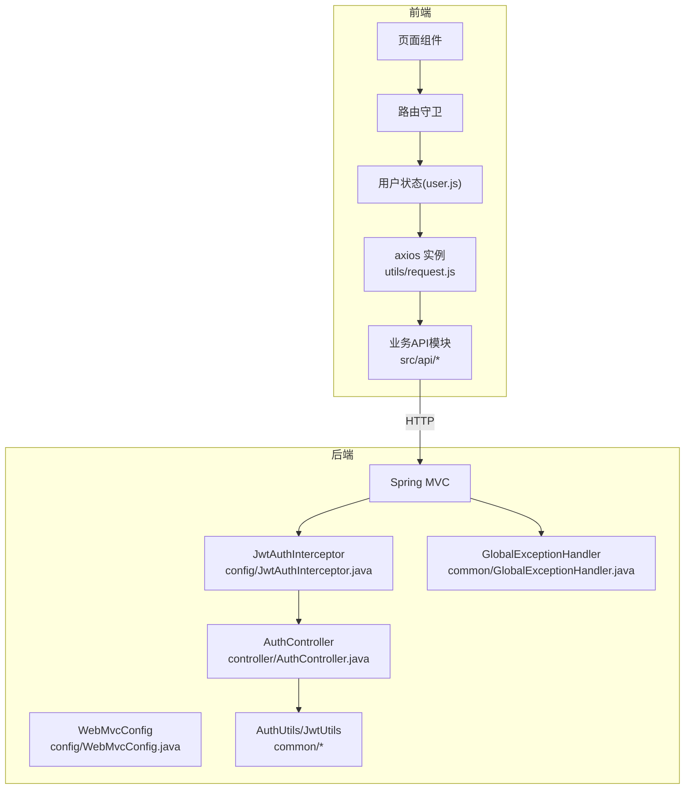
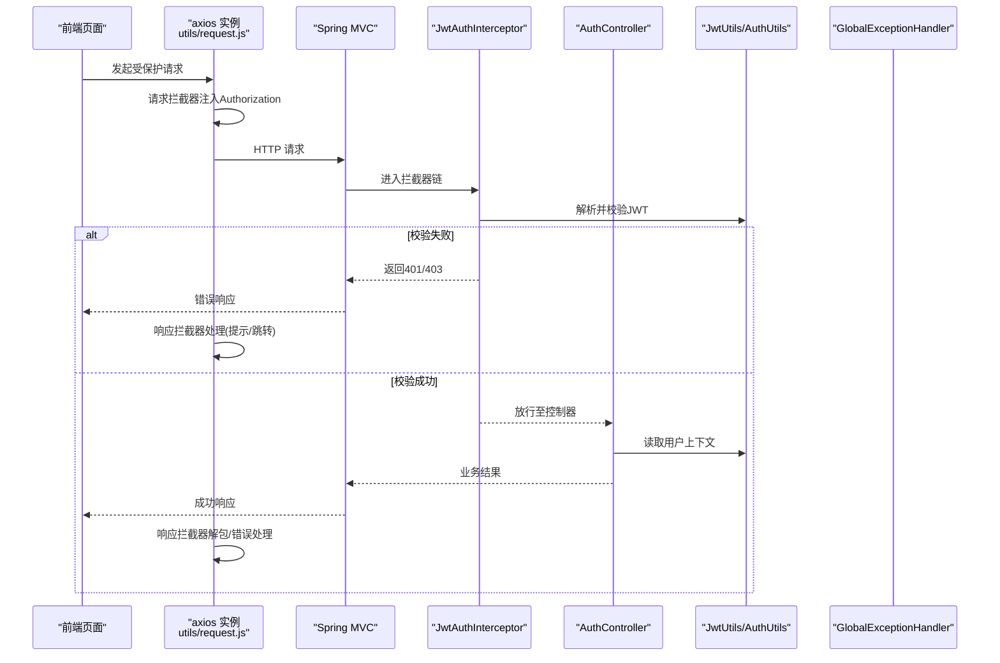
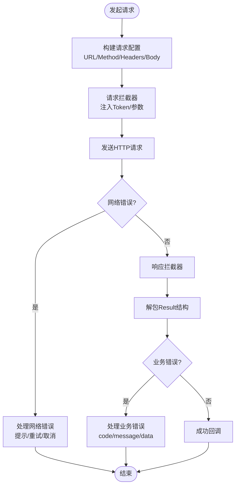
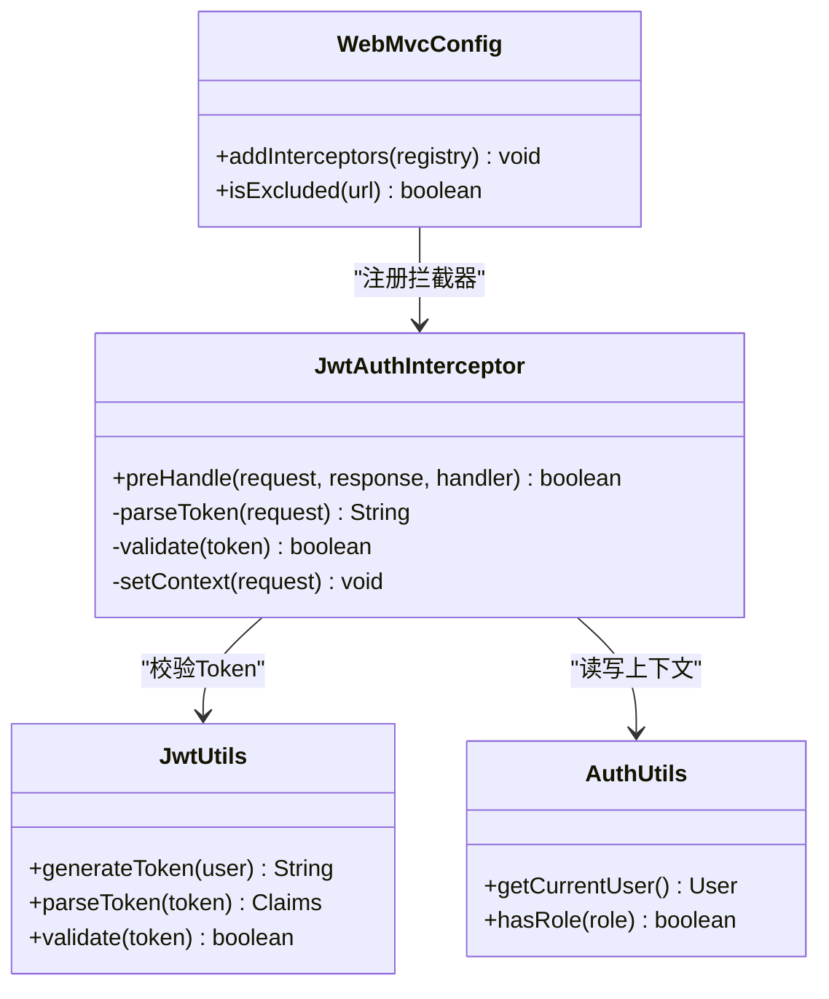
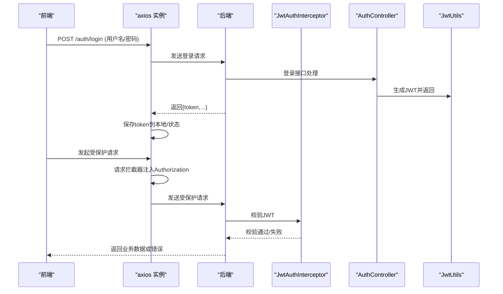
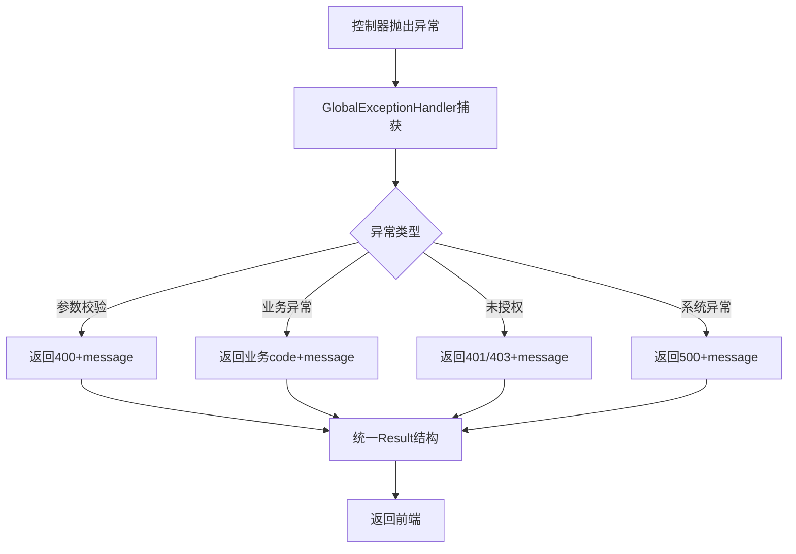
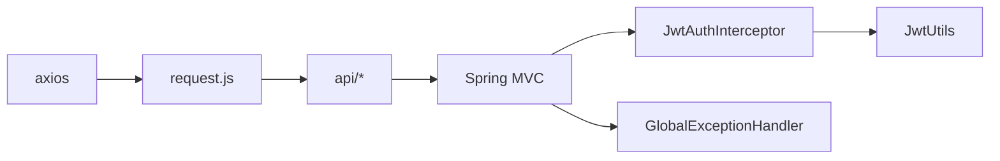

# 请求处理机制

<cite>
**本文引用的文件**   
- [frontend/src/utils/request.js](file://frontend/src/utils/request.js)
- [frontend/src/api/auth.js](file://frontend/src/api/auth.js)
- [backend/src/main/java/com/dorm/backend/config/JwtAuthInterceptor.java](file://backend/src/main/java/com/dorm/backend/config/JwtAuthInterceptor.java)
- [backend/src/main/java/com/dorm/backend/config/WebMvcConfig.java](file://backend/src/main/java/com/dorm/backend/config/WebMvcConfig.java)
- [backend/src/main/java/com/dorm/backend/common/GlobalExceptionHandler.java](file://backend/src/main/java/com/dorm/backend/common/GlobalExceptionHandler.java)
- [backend/src/main/java/com/dorm/backend/common/AuthUtils.java](file://backend/src/main/java/com/dorm/backend/common/AuthUtils.java)
- [backend/src/main/java/com/dorm/backend/common/JwtUtils.java](file://backend/src/main/java/com/dorm/backend/common/JwtUtils.java)
- [backend/src/main/java/com/dorm/backend/controller/AuthController.java](file://backend/src/main/java/com/dorm/backend/controller/AuthController.java)
</cite>

## 目录
1. [简介](#简介)
2. [项目结构](#项目结构)
3. [核心组件](#核心组件)
4. [架构总览](#架构总览)
5. [详细组件分析](#详细组件分析)
6. [依赖关系分析](#依赖关系分析)
7. [性能考虑](#性能考虑)
8. [故障排查指南](#故障排查指南)
9. [结论](#结论)
10. [附录](#附录)

## 简介
本文件围绕宿舍管理系统的“请求处理机制”进行系统化说明，覆盖前端 axios 封装（请求拦截器、响应拦截器）、JWT 认证在前后端的流转、后端拦截器的实现与配置，以及超时、重试与取消请求等关键能力。文档面向不同技术背景的读者，提供从概念到代码级映射的完整说明，并给出流程图与示例路径，便于快速定位与落地实践。

## 项目结构
- 前端：基于 Vue + Vite，HTTP 客户端统一通过 utils/request.js 封装；业务 API 模块位于 src/api/*；路由与状态管理分别位于 router 与 store。
- 后端：Spring Boot 应用，Web 层由 Controller 暴露接口；鉴权通过自定义拦截器 JwtAuthInterceptor 实现；全局异常处理由 GlobalExceptionHandler 统一收敛；工具类集中在 common 包。

图表来源 
- [frontend/src/utils/request.js](file://frontend/src/utils/request.js)
- [backend/src/main/java/com/dorm/backend/config/JwtAuthInterceptor.java](file://backend/src/main/java/com/dorm/backend/config/JwtAuthInterceptor.java)
- [backend/src/main/java/com/dorm/backend/config/WebMvcConfig.java](file://backend/src/main/java/com/dorm/backend/config/WebMvcConfig.java)
- [backend/src/main/java/com/dorm/backend/controller/AuthController.java](file://backend/src/main/java/com/dorm/backend/controller/AuthController.java)
- [backend/src/main/java/com/dorm/backend/common/GlobalExceptionHandler.java](file://backend/src/main/java/com/dorm/backend/common/GlobalExceptionHandler.java)

章节来源
- [frontend/src/utils/request.js](file://frontend/src/utils/request.js)
- [backend/src/main/java/com/dorm/backend/config/JwtAuthInterceptor.java](file://backend/src/main/java/com/dorm/backend/config/JwtAuthInterceptor.java)
- [backend/src/main/java/com/dorm/backend/config/WebMvcConfig.java](file://backend/src/main/java/com/dorm/backend/config/WebMvcConfig.java)
- [backend/src/main/java/com/dorm/backend/controller/AuthController.java](file://backend/src/main/java/com/dorm/backend/controller/AuthController.java)
- [backend/src/main/java/com/dorm/backend/common/GlobalExceptionHandler.java](file://backend/src/main/java/com/dorm/backend/common/GlobalExceptionHandler.java)

## 核心组件
- 前端 axios 封装（utils/request.js）
  - 创建 axios 实例，设置基础 URL、超时时间、Content-Type 等。
  - 请求拦截器：注入 Authorization 头（Bearer Token），附加必要业务参数（如租户/环境）。
  - 响应拦截器：统一解包数据、错误码处理、Token 过期自动刷新或跳转登录、加载态控制。
  - 可选能力：请求去重、重试策略、取消令牌（AbortController）集成。
- 后端 JWT 拦截器（JwtAuthInterceptor.java）
  - 解析请求头中的 Authorization 字段，校验签名与有效期。
  - 白名单放行（如登录、静态资源、健康检查）。
  - 将用户上下文写入请求属性或线程局部变量，供后续控制器使用。
- 拦截器注册（WebMvcConfig.java）
  - 注册 JwtAuthInterceptor，配置拦截路径与排除路径。
  - 可配置跨域、消息转换器、静态资源映射等。
- 全局异常处理（GlobalExceptionHandler.java）
  - 统一捕获业务异常、参数校验异常、未授权/禁止访问等。
  - 返回标准 Result 结构，包含 code、message、data。
- 工具类（AuthUtils.java, JwtUtils.java）
  - 生成/解析/验证 JWT，提取用户信息，权限判断辅助方法。

章节来源
- [frontend/src/utils/request.js](file://frontend/src/utils/request.js)
- [backend/src/main/java/com/dorm/backend/config/JwtAuthInterceptor.java](file://backend/src/main/java/com/dorm/backend/config/JwtAuthInterceptor.java)
- [backend/src/main/java/com/dorm/backend/config/WebMvcConfig.java](file://backend/src/main/java/com/dorm/backend/config/WebMvcConfig.java)
- [backend/src/main/java/com/dorm/backend/common/GlobalExceptionHandler.java](file://backend/src/main/java/com/dorm/backend/common/GlobalExceptionHandler.java)
- [backend/src/main/java/com/dorm/backend/common/AuthUtils.java](file://backend/src/main/java/com/dorm/backend/common/AuthUtils.java)
- [backend/src/main/java/com/dorm/backend/common/JwtUtils.java](file://backend/src/main/java/com/dorm/backend/common/JwtUtils.java)

## 架构总览
下图展示一次受保护接口的端到端流程：前端发起请求 → axios 拦截器注入 Token → Spring 拦截器校验 JWT → 控制器执行业务 → 统一异常处理 → 响应回前端 → 响应拦截器统一解包与错误处理。

图表来源 
- [frontend/src/utils/request.js](file://frontend/src/utils/request.js)
- [backend/src/main/java/com/dorm/backend/config/JwtAuthInterceptor.java](file://backend/src/main/java/com/dorm/backend/config/JwtAuthInterceptor.java)
- [backend/src/main/java/com/dorm/backend/controller/AuthController.java](file://backend/src/main/java/com/dorm/backend/controller/AuthController.java)
- [backend/src/main/java/com/dorm/backend/common/JwtUtils.java](file://backend/src/main/java/com/dorm/backend/common/JwtUtils.java)
- [backend/src/main/java/com/dorm/backend/common/AuthUtils.java](file://backend/src/main/java/com/dorm/backend/common/AuthUtils.java)
- [backend/src/main/java/com/dorm/backend/common/GlobalExceptionHandler.java](file://backend/src/main/java/com/dorm/backend/common/GlobalExceptionHandler.java)

## 详细组件分析

### 前端 axios 封装（请求/响应拦截器、超时、重试、取消）
- 请求拦截器
  - 作用：为每个请求附加 Authorization 头（Bearer Token），并可附加通用查询参数或追踪ID。
  - 建议：从本地存储或状态管理获取最新 Token；若为空则走公开接口逻辑。
- 响应拦截器
  - 作用：统一解包后端 Result 结构，处理业务错误码；对 401/403 做统一处理（刷新 Token、跳转登录、清空状态）。
  - 建议：结合 loading 状态与用户提示，提升体验。
- 超时处理
  - 在 axios 实例上设置 timeout；在请求拦截器中为单个请求设置更细粒度的超时。
  - 超时后触发网络错误分支，提示“请求超时”，支持重试或降级。
- 重试机制
  - 针对幂等 GET 请求可实现指数退避重试；非幂等请求谨慎重试。
  - 建议在响应拦截器中根据错误类型与次数决定是否重试。
- 取消请求
  - 使用 AbortController 或 axios.CancelToken，为页面切换/导航时取消未完成请求，避免内存泄漏与无效更新。
- 代码示例路径
  - 封装入口与拦截器：[frontend/src/utils/request.js](file://frontend/src/utils/request.js)
  - 典型调用示例（登录）：[frontend/src/api/auth.js](file://frontend/src/api/auth.js)

图表来源 
- [frontend/src/utils/request.js](file://frontend/src/utils/request.js)
- [frontend/src/api/auth.js](file://frontend/src/api/auth.js)

章节来源
- [frontend/src/utils/request.js](file://frontend/src/utils/request.js)
- [frontend/src/api/auth.js](file://frontend/src/api/auth.js)

### 后端 JWT 认证流程（拦截器与工具类）
- 拦截器职责
  - 从请求头解析 Authorization，提取 Bearer Token。
  - 使用 JwtUtils 校验签名、过期时间与格式。
  - 白名单放行（如 /auth/login、静态资源、健康检查）。
  - 校验通过后，将用户信息写入请求上下文（如 request.setAttribute 或 ThreadLocal）。
- 工具类职责
  - JwtUtils：签发、解析、校验 JWT，提取 claims。
  - AuthUtils：便捷获取当前用户、角色、权限判断。
- 配置方式
  - 在 WebMvcConfig 中注册 JwtAuthInterceptor，配置拦截与排除路径。
- 代码示例路径
  - 拦截器实现：[backend/src/main/java/com/dorm/backend/config/JwtAuthInterceptor.java](file://backend/src/main/java/com/dorm/backend/config/JwtAuthInterceptor.java)
  - 拦截器注册：[backend/src/main/java/com/dorm/backend/config/WebMvcConfig.java](file://backend/src/main/java/com/dorm/backend/config/WebMvcConfig.java)
  - 工具类：[backend/src/main/java/com/dorm/backend/common/JwtUtils.java](file://backend/src/main/java/com/dorm/backend/common/JwtUtils.java)、[backend/src/main/java/com/dorm/backend/common/AuthUtils.java](file://backend/src/main/java/com/dorm/backend/common/AuthUtils.java)

图表来源 
- [backend/src/main/java/com/dorm/backend/config/JwtAuthInterceptor.java](file://backend/src/main/java/com/dorm/backend/config/JwtAuthInterceptor.java)
- [backend/src/main/java/com/dorm/backend/config/WebMvcConfig.java](file://backend/src/main/java/com/dorm/backend/config/WebMvcConfig.java)
- [backend/src/main/java/com/dorm/backend/common/JwtUtils.java](file://backend/src/main/java/com/dorm/backend/common/JwtUtils.java)
- [backend/src/main/java/com/dorm/backend/common/AuthUtils.java](file://backend/src/main/java/com/dorm/backend/common/AuthUtils.java)

章节来源
- [backend/src/main/java/com/dorm/backend/config/JwtAuthInterceptor.java](file://backend/src/main/java/com/dorm/backend/config/JwtAuthInterceptor.java)
- [backend/src/main/java/com/dorm/backend/config/WebMvcConfig.java](file://backend/src/main/java/com/dorm/backend/config/WebMvcConfig.java)
- [backend/src/main/java/com/dorm/backend/common/JwtUtils.java](file://backend/src/main/java/com/dorm/backend/common/JwtUtils.java)
- [backend/src/main/java/com/dorm/backend/common/AuthUtils.java](file://backend/src/main/java/com/dorm/backend/common/AuthUtils.java)

### 登录与鉴权序列图（前端到后端）

图表来源 
- [frontend/src/api/auth.js](file://frontend/src/api/auth.js)
- [frontend/src/utils/request.js](file://frontend/src/utils/request.js)
- [backend/src/main/java/com/dorm/backend/controller/AuthController.java](file://backend/src/main/java/com/dorm/backend/controller/AuthController.java)
- [backend/src/main/java/com/dorm/backend/config/JwtAuthInterceptor.java](file://backend/src/main/java/com/dorm/backend/config/JwtAuthInterceptor.java)
- [backend/src/main/java/com/dorm/backend/common/JwtUtils.java](file://backend/src/main/java/com/dorm/backend/common/JwtUtils.java)

章节来源
- [frontend/src/api/auth.js](file://frontend/src/api/auth.js)
- [frontend/src/utils/request.js](file://frontend/src/utils/request.js)
- [backend/src/main/java/com/dorm/backend/controller/AuthController.java](file://backend/src/main/java/com/dorm/backend/controller/AuthController.java)
- [backend/src/main/java/com/dorm/backend/config/JwtAuthInterceptor.java](file://backend/src/main/java/com/dorm/backend/config/JwtAuthInterceptor.java)
- [backend/src/main/java/com/dorm/backend/common/JwtUtils.java](file://backend/src/main/java/com/dorm/backend/common/JwtUtils.java)

### 全局异常处理与统一响应
- 统一响应体：所有接口返回标准 Result 结构（code、message、data），便于前端统一处理。
- 异常分类：参数校验异常、业务异常、未授权/禁止访问、系统异常等。
- 处理策略：记录日志、返回友好 message、必要时附带 traceId。
- 代码示例路径
  - 全局异常处理器：[backend/src/main/java/com/dorm/backend/common/GlobalExceptionHandler.java](file://backend/src/main/java/com/dorm/backend/common/GlobalExceptionHandler.java)

图表来源 
- [backend/src/main/java/com/dorm/backend/common/GlobalExceptionHandler.java](file://backend/src/main/java/com/dorm/backend/common/GlobalExceptionHandler.java)

章节来源
- [backend/src/main/java/com/dorm/backend/common/GlobalExceptionHandler.java](file://backend/src/main/java/com/dorm/backend/common/GlobalExceptionHandler.java)

## 依赖关系分析
- 前端依赖
  - axios：HTTP 客户端，负责网络请求、拦截器、超时、取消等。
  - 状态管理（store/user.js）：持久化 token、用户信息。
- 后端依赖
  - Spring MVC：拦截器、控制器、异常处理。
  - JWT 工具库：用于签发与校验。
  - 数据库/服务层：业务数据访问（不在本主题范围）。

图表来源 
- [frontend/src/utils/request.js](file://frontend/src/utils/request.js)
- [backend/src/main/java/com/dorm/backend/config/JwtAuthInterceptor.java](file://backend/src/main/java/com/dorm/backend/config/JwtAuthInterceptor.java)
- [backend/src/main/java/com/dorm/backend/common/JwtUtils.java](file://backend/src/main/java/com/dorm/backend/common/JwtUtils.java)
- [backend/src/main/java/com/dorm/backend/common/GlobalExceptionHandler.java](file://backend/src/main/java/com/dorm/backend/common/GlobalExceptionHandler.java)

章节来源
- [frontend/src/utils/request.js](file://frontend/src/utils/request.js)
- [backend/src/main/java/com/dorm/backend/config/JwtAuthInterceptor.java](file://backend/src/main/java/com/dorm/backend/config/JwtAuthInterceptor.java)
- [backend/src/main/java/com/dorm/backend/common/JwtUtils.java](file://backend/src/main/java/com/dorm/backend/common/JwtUtils.java)
- [backend/src/main/java/com/dorm/backend/common/GlobalExceptionHandler.java](file://backend/src/main/java/com/dorm/backend/common/GlobalExceptionHandler.java)

## 性能考虑
- 超时与重试
  - 合理设置全局与单请求超时，避免长时间阻塞。
  - 仅对幂等请求启用重试，限制最大重试次数与退避间隔。
- 取消请求
  - 页面切换或路由跳转时取消未完成请求，减少无用网络与状态更新。
- 缓存与去重
  - 对相同请求在短时间内去重，避免重复网络开销。
- 后端优化
  - 拦截器尽量轻量，避免阻塞主链路。
  - 统一异常处理减少多次序列化与分支判断。

## 故障排查指南
- 前端常见问题
  - 401/403：检查 Token 是否存在、是否过期、是否被正确注入 Authorization。
  - 网络错误：检查代理/跨域、超时设置、取消逻辑是否正确。
  - 业务错误：查看后端返回的 code 与 message，定位具体业务异常。
- 后端常见问题
  - 未授权：确认白名单配置、拦截器排除路径、Token 解析逻辑。
  - 全局异常：检查异常捕获顺序、日志输出、统一响应结构。
- 定位步骤
  - 前端：打开浏览器开发者工具，查看 Network 面板的请求头、响应体与错误堆栈。
  - 后端：查看日志与异常堆栈，确认拦截器与控制器执行顺序。

章节来源
- [frontend/src/utils/request.js](file://frontend/src/utils/request.js)
- [backend/src/main/java/com/dorm/backend/config/JwtAuthInterceptor.java](file://backend/src/main/java/com/dorm/backend/config/JwtAuthInterceptor.java)
- [backend/src/main/java/com/dorm/backend/common/GlobalExceptionHandler.java](file://backend/src/main/java/com/dorm/backend/common/GlobalExceptionHandler.java)

## 结论
通过统一的 axios 封装与后端 JWT 拦截器，系统实现了稳定、安全且易维护的请求处理机制。配合全局异常处理与工具类，能够高效地处理认证、鉴权、错误与边界场景。建议在生产环境中完善重试、取消、缓存与监控告警，进一步提升用户体验与系统稳定性。

## 附录
- 最佳实践清单
  - 前端：集中管理 baseURL、超时、拦截器；统一错误提示；敏感操作二次确认。
  - 后端：严格白名单；最小权限原则；统一响应与异常；详尽日志。
  - 运维：限流与熔断；请求耗时监控；错误率告警。
- 参考路径
  - 前端封装与调用示例：[frontend/src/utils/request.js](file://frontend/src/utils/request.js)、[frontend/src/api/auth.js](file://frontend/src/api/auth.js)
  - 后端鉴权与配置：[backend/src/main/java/com/dorm/backend/config/JwtAuthInterceptor.java](file://backend/src/main/java/com/dorm/backend/config/JwtAuthInterceptor.java)、[backend/src/main/java/com/dorm/backend/config/WebMvcConfig.java](file://backend/src/main/java/com/dorm/backend/config/WebMvcConfig.java)
  - 统一异常处理：[backend/src/main/java/com/dorm/backend/common/GlobalExceptionHandler.java](file://backend/src/main/java/com/dorm/backend/common/GlobalExceptionHandler.java)