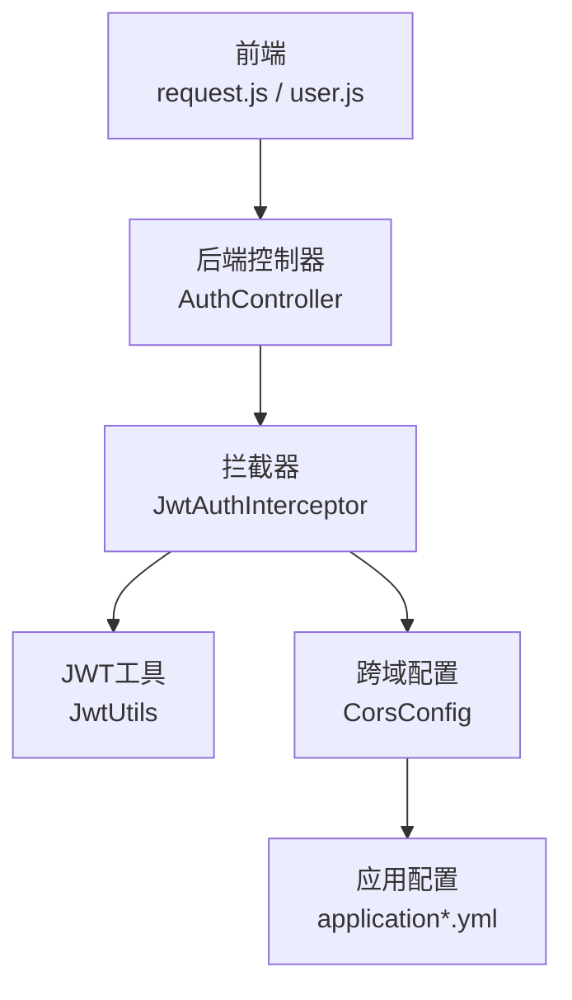
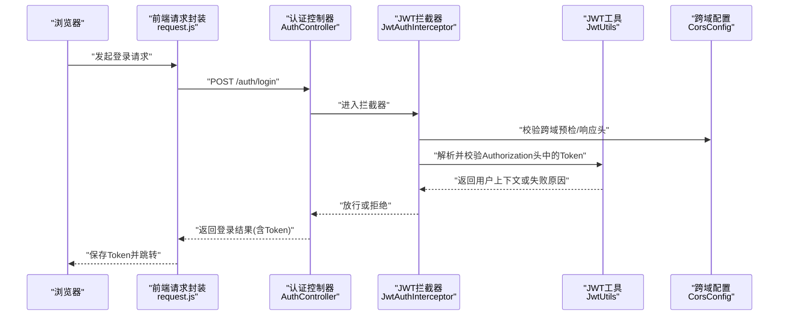
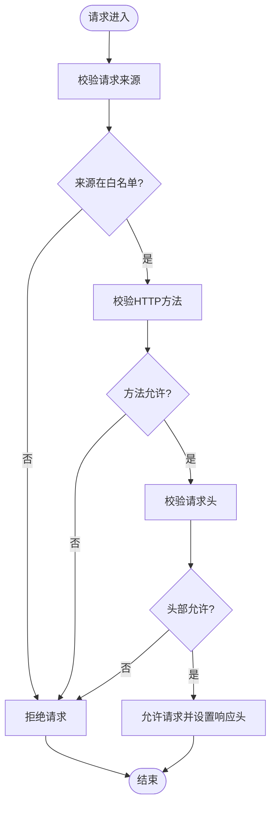
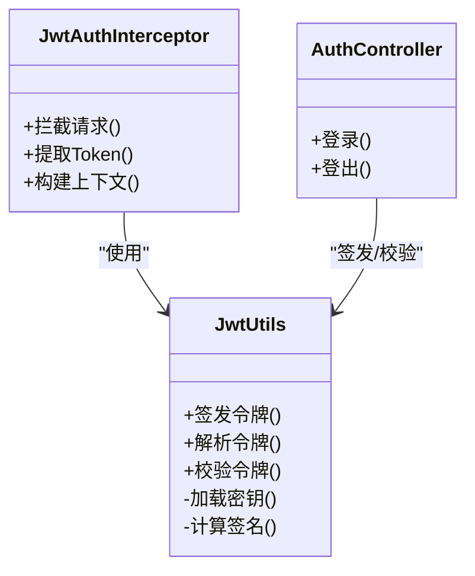
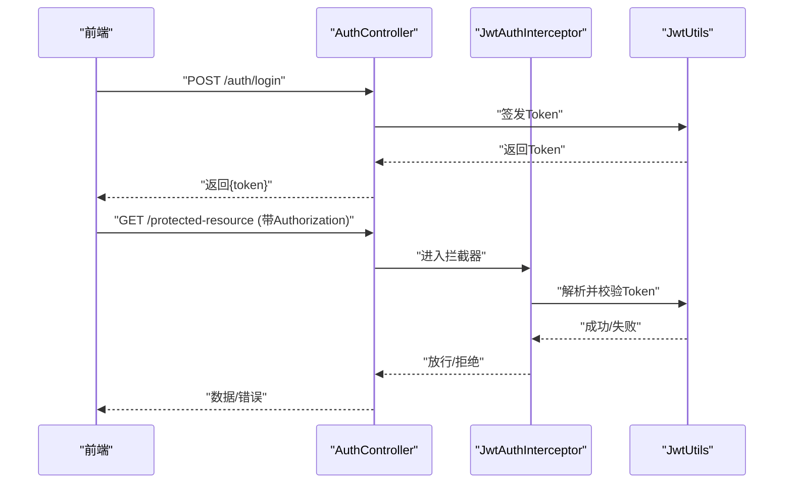
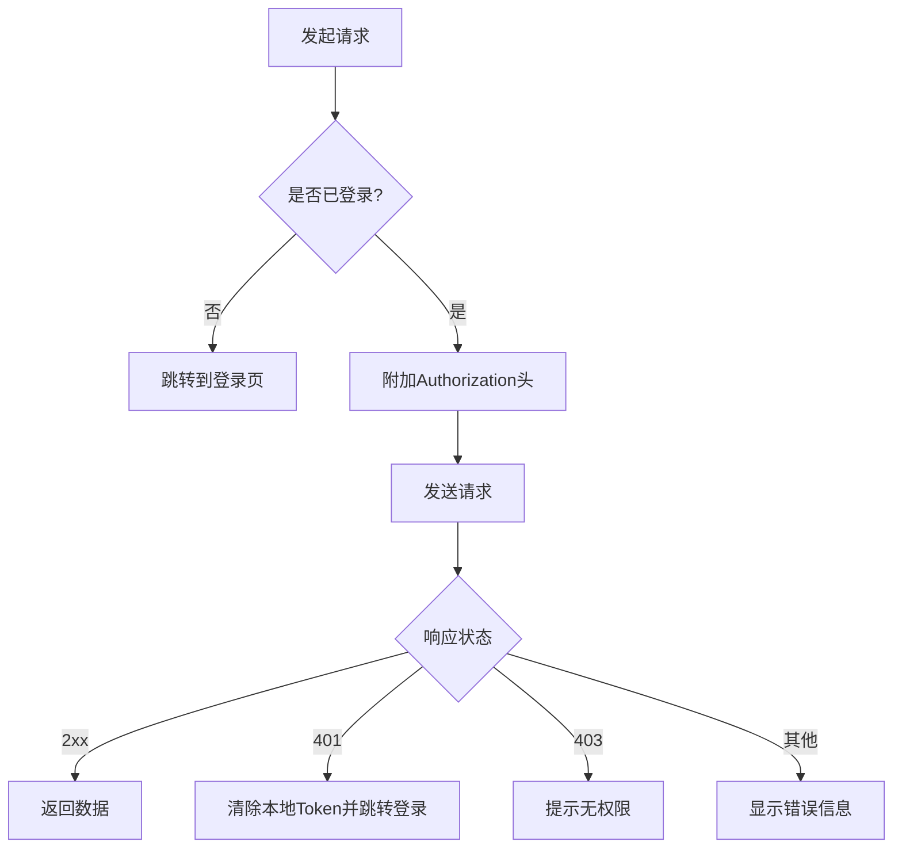
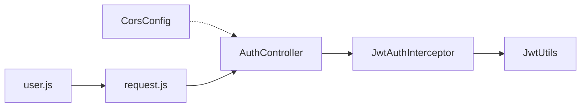

# 跨域与安全配置

<cite>
**本文引用的文件**   
- [backend/src/main/java/com/dorm/backend/config/CorsConfig.java](file://backend/src/main/java/com/dorm/backend/config/CorsConfig.java)
- [backend/src/main/java/com/dorm/backend/config/JwtAuthInterceptor.java](file://backend/src/main/java/com/dorm/backend/config/JwtAuthInterceptor.java)
- [backend/src/main/java/com/dorm/backend/common/JwtUtils.java](file://backend/src/main/java/com/dorm/backend/common/JwtUtils.java)
- [backend/src/main/java/com/dorm/backend/controller/AuthController.java](file://backend/src/main/java/com/dorm/backend/controller/AuthController.java)
- [backend/src/main/resources/application.yml](file://backend/src/main/resources/application.yml)
- [backend/src/main/resources/application-dev.yml](file://backend/src/main/resources/application-dev.yml)
- [frontend/src/utils/request.js](file://frontend/src/utils/request.js)
- [frontend/src/store/user.js](file://frontend/src/store/user.js)
- [frontend/vite.config.js](file://frontend/vite.config.js)
</cite>

## 目录
1. [简介](#简介)
2. [项目结构](#项目结构)
3. [核心组件](#核心组件)
4. [架构总览](#架构总览)
5. [详细组件分析](#详细组件分析)
6. [依赖关系分析](#依赖关系分析)
7. [性能考虑](#性能考虑)
8. [故障排查指南](#故障排查指南)
9. [结论](#结论)
10. [附录](#附录)

## 简介
本文件聚焦于宿舍管理系统在跨域资源共享（CORS）与整体安全方面的配置与实践，涵盖：
- CORS 跨域策略的配置方法与注意事项
- JWT 令牌的安全存储、传输与校验流程
- CSRF 防护与其他安全措施的实施建议
- 开发环境与生产环境的差异化管理
- 安全最佳实践、常见漏洞防范、检查清单与测试方法

## 项目结构
后端采用 Spring Boot 分层架构，安全相关能力集中在 config 与 common 包；前端通过请求封装统一处理鉴权头与错误。关键文件包括：
- 后端跨域与安全拦截器：CorsConfig、JwtAuthInterceptor
- JWT 工具类：JwtUtils
- 认证控制器：AuthController
- 应用配置：application.yml、application-dev.yml
- 前端请求封装与用户状态管理：request.js、user.js
- 前端开发代理配置：vite.config.js

**图表来源** 
- [backend/src/main/java/com/dorm/backend/config/CorsConfig.java](file://backend/src/main/java/com/dorm/backend/config/CorsConfig.java)
- [backend/src/main/java/com/dorm/backend/config/JwtAuthInterceptor.java](file://backend/src/main/java/com/dorm/backend/config/JwtAuthInterceptor.java)
- [backend/src/main/java/com/dorm/backend/common/JwtUtils.java](file://backend/src/main/java/com/dorm/backend/common/JwtUtils.java)
- [backend/src/main/java/com/dorm/backend/controller/AuthController.java](file://backend/src/main/java/com/dorm/backend/controller/AuthController.java)
- [backend/src/main/resources/application.yml](file://backend/src/main/resources/application.yml)
- [backend/src/main/resources/application-dev.yml](file://backend/src/main/resources/application-dev.yml)
- [frontend/src/utils/request.js](file://frontend/src/utils/request.js)
- [frontend/src/store/user.js](file://frontend/src/store/user.js)
- [frontend/vite.config.js](file://frontend/vite.config.js)

**章节来源**
- [backend/src/main/java/com/dorm/backend/config/CorsConfig.java](file://backend/src/main/java/com/dorm/backend/config/CorsConfig.java)
- [backend/src/main/java/com/dorm/backend/config/JwtAuthInterceptor.java](file://backend/src/main/java/com/dorm/backend/config/JwtAuthInterceptor.java)
- [backend/src/main/java/com/dorm/backend/common/JwtUtils.java](file://backend/src/main/java/com/dorm/backend/common/JwtUtils.java)
- [backend/src/main/java/com/dorm/backend/controller/AuthController.java](file://backend/src/main/java/com/dorm/backend/controller/AuthController.java)
- [backend/src/main/resources/application.yml](file://backend/src/main/resources/application.yml)
- [backend/src/src/main/resources/application-dev.yml](file://backend/src/main/resources/application-dev.yml)
- [frontend/src/utils/request.js](file://frontend/src/utils/request.js)
- [frontend/src/store/user.js](file://frontend/src/store/user.js)
- [frontend/vite.config.js](file://frontend/vite.config.js)

## 核心组件
- 跨域配置（CorsConfig）：定义允许的源、方法、头部与凭据策略，确保前后端分离场景下的安全访问。
- JWT 认证拦截器（JwtAuthInterceptor）：在请求进入控制器前解析并校验 JWT，完成身份识别与权限前置判断。
- JWT 工具（JwtUtils）：负责令牌的签发、解析与校验，包含密钥管理与过期控制。
- 认证控制器（AuthController）：提供登录、登出等接口，返回或接收 JWT。
- 应用配置（application*.yml）：集中管理端口、跨域白名单、JWT 密钥、日志等敏感参数。
- 前端请求封装（request.js）：统一设置 Authorization 头、处理 401/403 跳转与重试逻辑。
- 用户状态管理（user.js）：管理本地令牌存储与生命周期。
- 开发代理（vite.config.js）：开发期将前端请求转发到后端，避免本地跨域问题。

**章节来源**
- [backend/src/main/java/com/dorm/backend/config/CorsConfig.java](file://backend/src/main/java/com/dorm/backend/config/CorsConfig.java)
- [backend/src/main/java/com/dorm/backend/config/JwtAuthInterceptor.java](file://backend/src/main/java/com/dorm/backend/config/JwtAuthInterceptor.java)
- [backend/src/main/java/com/dorm/backend/common/JwtUtils.java](file://backend/src/main/java/com/dorm/backend/common/JwtUtils.java)
- [backend/src/main/java/com/dorm/backend/controller/AuthController.java](file://backend/src/main/java/com/dorm/backend/controller/AuthController.java)
- [backend/src/main/resources/application.yml](file://backend/src/main/resources/application.yml)
- [backend/src/main/resources/application-dev.yml](file://backend/src/main/resources/application-dev.yml)
- [frontend/src/utils/request.js](file://frontend/src/utils/request.js)
- [frontend/src/store/user.js](file://frontend/src/store/user.js)
- [frontend/vite.config.js](file://frontend/vite.config.js)

## 架构总览
下图展示了从浏览器发起登录到服务端鉴权的完整调用链，以及跨域与安全拦截的交互点。

**图表来源** 
- [backend/src/main/java/com/dorm/backend/controller/AuthController.java](file://backend/src/main/java/com/dorm/backend/controller/AuthController.java)
- [backend/src/main/java/com/dorm/backend/config/JwtAuthInterceptor.java](file://backend/src/main/java/com/dorm/backend/config/JwtAuthInterceptor.java)
- [backend/src/main/java/com/dorm/backend/common/JwtUtils.java](file://backend/src/main/java/com/dorm/backend/common/JwtUtils.java)
- [backend/src/main/java/com/dorm/backend/config/CorsConfig.java](file://backend/src/main/java/com/dorm/backend/config/CorsConfig.java)
- [frontend/src/utils/request.js](file://frontend/src/utils/request.js)

## 详细组件分析

### 跨域配置（CORS）
- 允许的来源：应精确匹配前端域名与协议，避免使用通配符。
- 允许的HTTP方法：仅暴露业务所需方法（如 GET、POST、PUT、DELETE）。
- 允许的请求头：限制为必要字段，避免泄露敏感信息。
- 凭据支持：当需要携带 Cookie 时，必须显式开启并配合严格的源白名单。
- 预检请求：对复杂请求需正确响应 OPTIONS 预检，减少重复开销。
- 环境差异：开发环境可放宽限制，生产环境必须收紧策略。

**图表来源** 
- [backend/src/main/java/com/dorm/backend/config/CorsConfig.java](file://backend/src/main/java/com/dorm/backend/config/CorsConfig.java)

**章节来源**
- [backend/src/main/java/com/dorm/backend/config/CorsConfig.java](file://backend/src/main/java/com/dorm/backend/config/CorsConfig.java)
- [backend/src/main/resources/application.yml](file://backend/src/main/resources/application.yml)
- [backend/src/main/resources/application-dev.yml](file://backend/src/main/resources/application-dev.yml)
- [frontend/vite.config.js](file://frontend/vite.config.js)

### JWT 令牌机制（签发、传输、存储、校验）
- 签发：认证成功后由服务端生成短时效 Token，签名密钥严格保密。
- 传输：通过 Authorization: Bearer <token> 传递，禁止出现在 URL 或日志中。
- 存储：前端优先使用内存或 HttpOnly Cookie，避免 localStorage 长期留存。
- 校验：拦截器解析 Token，验证签名与有效期，建立用户上下文。
- 刷新：结合短期 Access Token 与长期 Refresh Token，降低泄露风险。

**图表来源** 
- [backend/src/main/java/com/dorm/backend/common/JwtUtils.java](file://backend/src/main/java/com/dorm/backend/common/JwtUtils.java)
- [backend/src/main/java/com/dorm/backend/config/JwtAuthInterceptor.java](file://backend/src/main/java/com/dorm/backend/config/JwtAuthInterceptor.java)
- [backend/src/main/java/com/dorm/backend/controller/AuthController.java](file://backend/src/main/java/com/dorm/backend/controller/AuthController.java)

**章节来源**
- [backend/src/main/java/com/dorm/backend/common/JwtUtils.java](file://backend/src/main/java/com/dorm/backend/common/JwtUtils.java)
- [backend/src/main/java/com/dorm/backend/config/JwtAuthInterceptor.java](file://backend/src/main/java/com/dorm/backend/config/JwtAuthInterceptor.java)
- [backend/src/main/java/com/dorm/backend/controller/AuthController.java](file://backend/src/main/java/com/dorm/backend/controller/AuthController.java)
- [frontend/src/utils/request.js](file://frontend/src/utils/request.js)
- [frontend/src/store/user.js](file://frontend/src/store/user.js)

### 认证流程（登录与鉴权）
- 登录：前端提交用户名密码，服务端校验后签发 Token 并返回。
- 鉴权：后续请求经拦截器校验 Token，缺失或无效则拒绝。
- 错误处理：统一返回错误码与消息，前端根据状态码进行提示与跳转。

**图表来源** 
- [backend/src/main/java/com/dorm/backend/controller/AuthController.java](file://backend/src/main/java/com/dorm/backend/controller/AuthController.java)
- [backend/src/main/java/com/dorm/backend/config/JwtAuthInterceptor.java](file://backend/src/main/java/com/dorm/backend/config/JwtAuthInterceptor.java)
- [backend/src/main/java/com/dorm/backend/common/JwtUtils.java](file://backend/src/main/java/com/dorm/backend/common/JwtUtils.java)
- [frontend/src/utils/request.js](file://frontend/src/utils/request.js)

**章节来源**
- [backend/src/main/java/com/dorm/backend/controller/AuthController.java](file://backend/src/main/java/com/dorm/backend/controller/AuthController.java)
- [backend/src/main/java/com/dorm/backend/config/JwtAuthInterceptor.java](file://backend/src/main/java/com/dorm/backend/config/JwtAuthInterceptor.java)
- [backend/src/main/java/com/dorm/backend/common/JwtUtils.java](file://backend/src/main/java/com/dorm/backend/common/JwtUtils.java)
- [frontend/src/utils/request.js](file://frontend/src/utils/request.js)

### 前端请求封装与状态管理
- 请求封装：统一添加 Authorization 头、处理网络异常与 401/403 重定向。
- 状态管理：维护登录态与 Token 生命周期，支持自动刷新与失效清理。
- 开发代理：通过 Vite 代理将 /api 请求转发至后端，规避本地跨域。

**图表来源** 
- [frontend/src/utils/request.js](file://frontend/src/utils/request.js)
- [frontend/src/store/user.js](file://frontend/src/store/user.js)
- [frontend/vite.config.js](file://frontend/vite.config.js)

**章节来源**
- [frontend/src/utils/request.js](file://frontend/src/utils/request.js)
- [frontend/src/store/user.js](file://frontend/src/store/user.js)
- [frontend/vite.config.js](file://frontend/vite.config.js)

## 依赖关系分析
- 控制器依赖拦截器进行鉴权，拦截器依赖 JWT 工具进行令牌校验。
- 跨域配置独立于业务逻辑，作为横切关注点影响所有请求。
- 前端依赖请求封装与状态管理模块，保证统一的鉴权行为。

**图表来源** 
- [backend/src/main/java/com/dorm/backend/controller/AuthController.java](file://backend/src/main/java/com/dorm/backend/controller/AuthController.java)
- [backend/src/main/java/com/dorm/backend/config/JwtAuthInterceptor.java](file://backend/src/main/java/com/dorm/backend/config/JwtAuthInterceptor.java)
- [backend/src/main/java/com/dorm/backend/common/JwtUtils.java](file://backend/src/main/java/com/dorm/backend/common/JwtUtils.java)
- [backend/src/main/java/com/dorm/backend/config/CorsConfig.java](file://backend/src/main/java/com/dorm/backend/config/CorsConfig.java)
- [frontend/src/utils/request.js](file://frontend/src/utils/request.js)
- [frontend/src/store/user.js](file://frontend/src/store/user.js)

**章节来源**
- [backend/src/main/java/com/dorm/backend/controller/AuthController.java](file://backend/src/main/java/com/dorm/backend/controller/AuthController.java)
- [backend/src/main/java/com/dorm/backend/config/JwtAuthInterceptor.java](file://backend/src/main/java/com/dorm/backend/config/JwtAuthInterceptor.java)
- [backend/src/main/java/com/dorm/backend/common/JwtUtils.java](file://backend/src/main/java/com/dorm/backend/common/JwtUtils.java)
- [backend/src/main/java/com/dorm/backend/config/CorsConfig.java](file://backend/src/main/java/com/dorm/backend/config/CorsConfig.java)
- [frontend/src/utils/request.js](file://frontend/src/utils/request.js)
- [frontend/src/store/user.js](file://frontend/src/store/user.js)

## 性能考虑
- 跨域预检缓存：合理设置 Access-Control-Max-Age，减少 OPTIONS 请求。
- JWT 校验开销：避免在每次请求中进行昂贵操作，必要时引入缓存或会话缩短校验路径。
- 前端重试与退避：对网络抖动进行指数退避，避免雪崩。
- 静态资源与CDN：将非敏感静态资源托管至 CDN，减轻后端压力。

[本节为通用指导，不直接分析具体文件]

## 故障排查指南
- 跨域错误（CORS）：检查来源白名单、方法/头部配置、预检响应是否正确。
- 401/403 错误：确认 Authorization 头是否存在且格式正确，Token 是否过期或被篡改。
- 登录失败：核对用户名密码、服务可用性、日志输出。
- 前端代理问题：检查 vite.config.js 的代理规则与后端端口。

**章节来源**
- [backend/src/main/java/com/dorm/backend/config/CorsConfig.java](file://backend/src/main/java/com/dorm/backend/config/CorsConfig.java)
- [backend/src/main/java/com/dorm/backend/config/JwtAuthInterceptor.java](file://backend/src/main/java/com/dorm/backend/config/JwtAuthInterceptor.java)
- [backend/src/main/java/com/dorm/backend/common/JwtUtils.java](file://backend/src/main/java/com/dorm/backend/common/JwtUtils.java)
- [frontend/src/utils/request.js](file://frontend/src/utils/request.js)
- [frontend/vite.config.js](file://frontend/vite.config.js)

## 结论
通过严格的 CORS 策略、健壮的 JWT 校验与统一的前端鉴权封装，系统能够在前后端分离架构下实现安全的跨域访问与身份认证。建议在开发与生产环境中差异化配置，持续完善安全检查清单与自动化测试，以应对不断变化的安全威胁。

[本节为总结性内容，不直接分析具体文件]

## 附录

### 安全最佳实践
- 最小化暴露：仅开放必要的源、方法与头部。
- 密钥管理：JWT 密钥与环境变量管理，禁止硬编码。
- 令牌安全：短时效 Access Token，HttpOnly Cookie 或内存存储，避免 XSS/CSRF 风险。
- 输入校验：对所有入参进行类型与长度校验，防止注入攻击。
- 日志脱敏：禁止记录敏感信息（密码、Token、Cookie）。
- 速率限制：对登录与敏感接口实施限流与防抖。

[本节为通用指导，不直接分析具体文件]

### 常见漏洞与防范
- 跨站脚本（XSS）：启用 CSP、过滤输出、避免内联脚本。
- 跨站请求伪造（CSRF）：使用 SameSite Cookie、双重提交令牌或自定义 Header 校验。
- 中间人攻击（MITM）：强制 HTTPS、HSTS、证书校验。
- 暴力破解：账户锁定、验证码、多因素认证。
- 敏感数据泄露：加密传输与存储、最小化数据返回。

[本节为通用指导，不直接分析具体文件]

### 安全配置检查清单
- CORS 白名单是否精确匹配生产域名
- 是否禁用不必要的 HTTP 方法与头部
- 是否启用凭据并限制来源
- JWT 密钥是否足够强且定期轮换
- 是否启用 HTTPS 与 HSTS
- 是否对敏感接口实施限流与审计
- 前端是否避免在 localStorage 长期保存 Token
- 是否统一处理 401/403 并重定向登录

[本节为通用指导，不直接分析具体文件]

### 测试方法
- 单元测试：覆盖 JWT 签发与校验逻辑、拦截器分支。
- 集成测试：模拟跨域预检与实际请求，验证响应头与鉴权结果。
- 端到端测试：模拟登录、访问受保护资源、Token 过期与刷新流程。
- 安全扫描：使用 OWASP ZAP 或类似工具进行漏洞扫描。

**章节来源**
- [backend/src/test/java/com/dorm/backend/common/JwtUtilsTest.java](file://backend/src/test/java/com/dorm/backend/common/JwtUtilsTest.java)
- [backend/src/test/java/com/dorm/backend/config/JwtAuthInterceptorTest.java](file://backend/src/test/java/com/dorm/backend/config/JwtAuthInterceptorTest.java)
- [frontend/tests/e2e/roles.spec.js](file://frontend/tests/e2e/roles.spec.js)