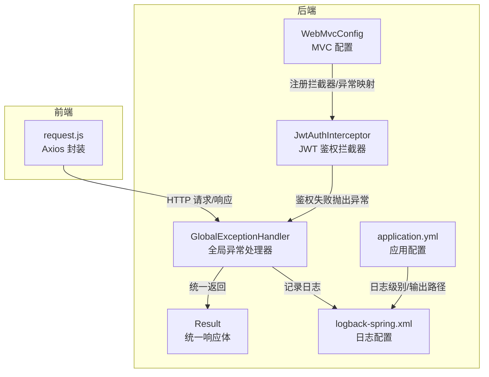
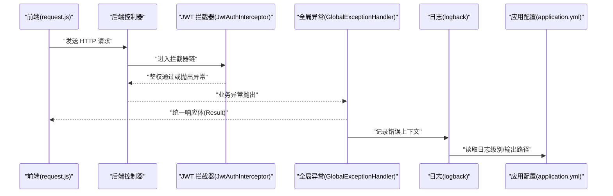
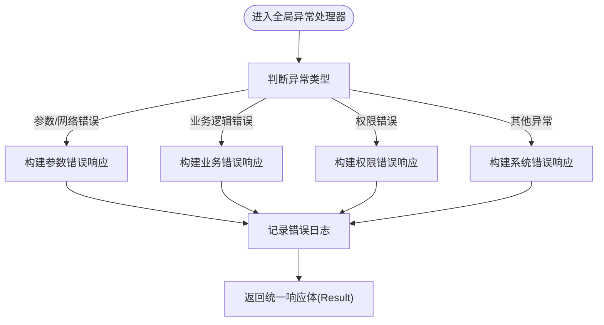
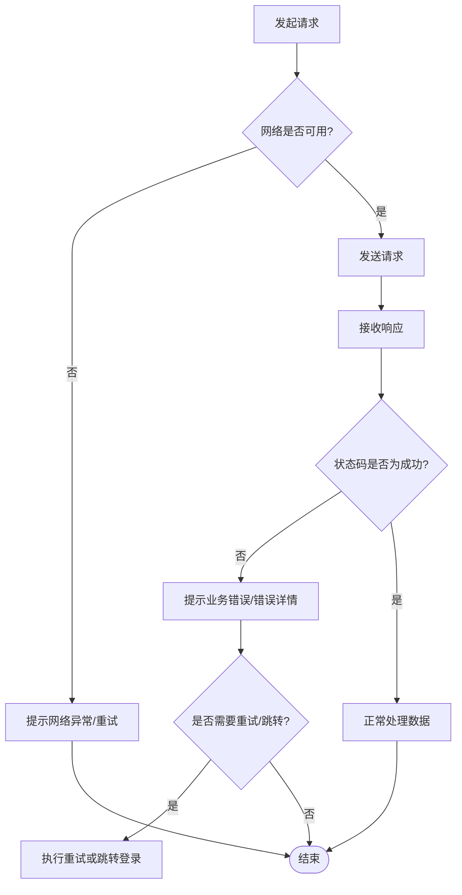
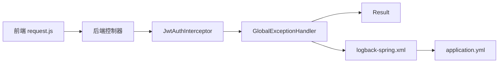

# 错误处理机制

<cite>
**本文引用的文件**   
- [GlobalExceptionHandler.java](file://backend/src/main/java/com/dorm/backend/common/GlobalExceptionHandler.java)
- [Result.java](file://backend/src/main/java/com/dorm/backend/common/Result.java)
- [JwtAuthInterceptor.java](file://backend/src/main/java/com/dorm/backend/config/JwtAuthInterceptor.java)
- [WebMvcConfig.java](file://backend/src/main/java/com/dorm/backend/config/WebMvcConfig.java)
- [logback-spring.xml](file://backend/src/main/resources/logback-spring.xml)
- [application.yml](file://backend/src/main/resources/application.yml)
- [request.js](file://frontend/src/utils/request.js)
</cite>

## 目录
1. [简介](#简介)
2. [项目结构](#项目结构)
3. [核心组件](#核心组件)
4. [架构总览](#架构总览)
5. [详细组件分析](#详细组件分析)
6. [依赖关系分析](#依赖关系分析)
7. [性能考虑](#性能考虑)
8. [故障排查指南](#故障排查指南)
9. [结论](#结论)
10. [附录](#附录) 

## 简介
本文件面向宿舍管理系统（Dorm-Sys）的错误处理机制，覆盖后端全局异常处理器、统一响应体、权限拦截与前端统一请求封装。文档重点说明：
- 全局异常捕获与分类策略（网络层、业务逻辑、权限等）
- 自定义异常类型的设计与使用建议
- 前端统一的错误提示与用户友好化处理
- 错误日志记录与监控方案
- 常见错误场景的处理示例与调试技巧

## 项目结构
错误处理相关的关键位置如下：
- 后端
  - common: 全局异常处理器、统一响应体、工具类
  - config: Web MVC 配置、JWT 鉴权拦截器、跨域配置
  - resources: 日志框架配置与应用配置
- 前端
  - utils: 基于 Axios 的请求封装，集中处理网络与业务错误

图表来源
- [GlobalExceptionHandler.java](file://backend/src/main/java/com/dorm/backend/common/GlobalExceptionHandler.java)
- [Result.java](file://backend/src/main/java/com/dorm/backend/common/Result.java)
- [JwtAuthInterceptor.java](file://backend/src/main/java/com/dorm/backend/config/JwtAuthInterceptor.java)
- [WebMvcConfig.java](file://backend/src/main/java/com/dorm/backend/config/WebMvcConfig.java)
- [logback-spring.xml](file://backend/src/main/resources/logback-spring.xml)
- [application.yml](file://backend/src/main/resources/application.yml)
- [request.js](file://frontend/src/utils/request.js)

章节来源
- [GlobalExceptionHandler.java](file://backend/src/main/java/com/dorm/backend/common/GlobalExceptionHandler.java)
- [Result.java](file://backend/src/main/java/com/dorm/backend/common/Result.java)
- [JwtAuthInterceptor.java](file://backend/src/main/java/com/dorm/backend/config/JwtAuthInterceptor.java)
- [WebMvcConfig.java](file://backend/src/main/java/com/dorm/backend/config/WebMvcConfig.java)
- [logback-spring.xml](file://backend/src/main/resources/logback-spring.xml)
- [application.yml](file://backend/src/main/resources/application.yml)
- [request.js](file://frontend/src/utils/request.js)

## 核心组件
- 全局异常处理器：统一捕获控制器及拦截器抛出的异常，按错误类别返回一致的 JSON 结构，并记录关键上下文信息。
- 统一响应体：定义标准返回字段（如状态码、消息、数据），便于前后端协作与前端统一解析。
- JWT 鉴权拦截器：在请求进入控制器前校验令牌，未通过时抛出鉴权异常，由全局异常处理器统一处理。
- 前端请求封装：集中处理 HTTP 错误、超时、业务错误码，提供友好的用户提示与重试/跳转策略。
- 日志与监控：基于 Logback 输出结构化日志，结合应用配置控制日志级别与输出目标，便于问题定位与监控告警。

章节来源
- [GlobalExceptionHandler.java](file://backend/src/main/java/com/dorm/backend/common/GlobalExceptionHandler.java)
- [Result.java](file://backend/src/main/java/com/dorm/backend/common/Result.java)
- [JwtAuthInterceptor.java](file://backend/src/main/java/com/dorm/backend/config/JwtAuthInterceptor.java)
- [request.js](file://frontend/src/utils/request.js)
- [logback-spring.xml](file://backend/src/main/resources/logback-spring.xml)
- [application.yml](file://backend/src/main/resources/application.yml)

## 架构总览
下图展示了从前端发起请求到后端统一异常处理的完整链路，以及错误日志的落盘流程。

图表来源
- [request.js](file://frontend/src/utils/request.js)
- [JwtAuthInterceptor.java](file://backend/src/main/java/com/dorm/backend/config/JwtAuthInterceptor.java)
- [GlobalExceptionHandler.java](file://backend/src/main/java/com/dorm/backend/common/GlobalExceptionHandler.java)
- [logback-spring.xml](file://backend/src/main/resources/logback-spring.xml)
- [application.yml](file://backend/src/main/resources/application.yml)

## 详细组件分析

### 全局异常处理器（GlobalExceptionHandler）
职责与行为
- 捕获所有未处理异常（包括参数校验、业务异常、权限异常、系统异常）。
- 将异常分类为：网络/参数错误、业务逻辑错误、权限错误、未知错误。
- 生成统一响应体（Result），包含状态码、提示信息与可选的数据负载。
- 记录关键上下文（请求路径、方法、用户标识、异常堆栈摘要），避免泄露敏感信息。

实现要点
- 针对不同类型异常定义对应的处理方法，确保错误语义清晰。
- 对鉴权失败（如 Token 过期、签名无效）进行专门处理，便于前端做登出或刷新流程。
- 对系统级异常（如数据库连接失败）进行降级与兜底，保证接口可用性。

图表来源
- [GlobalExceptionHandler.java](file://backend/src/main/java/com/dorm/backend/common/GlobalExceptionHandler.java)
- [Result.java](file://backend/src/main/java/com/dorm/backend/common/Result.java)
- [logback-spring.xml](file://backend/src/main/resources/logback-spring.xml)

章节来源
- [GlobalExceptionHandler.java](file://backend/src/main/java/com/dorm/backend/common/GlobalExceptionHandler.java)
- [Result.java](file://backend/src/main/java/com/dorm/backend/common/Result.java)

### 统一响应体（Result）
设计原则
- 固定字段：状态码、消息、数据对象，便于前端一致解析。
- 状态码规范：区分成功、客户端错误、服务端错误、鉴权失败等。
- 可扩展性：支持附加字段（如追踪 ID、时间戳）用于问题定位。

使用建议
- 控制器与服务层直接返回 Result，避免分散的错误处理逻辑。
- 前端根据状态码分支处理成功与失败路径，统一展示消息。

章节来源
- [Result.java](file://backend/src/main/java/com/dorm/backend/common/Result.java)

### 权限拦截器（JwtAuthInterceptor）
职责与行为
- 在请求到达控制器前校验 JWT 令牌的有效性（格式、签名、过期时间）。
- 校验通过后注入用户上下文；失败则抛出鉴权异常，交由全局异常处理器处理。
- 可结合角色/范围控制（如宿管范围）进行细粒度授权。

错误分类
- 令牌缺失或格式错误：归类为“参数/网络错误”。
- 签名无效或已过期：归类为“权限错误”，触发前端登出或刷新令牌流程。

章节来源
- [JwtAuthInterceptor.java](file://backend/src/main/java/com/dorm/backend/config/JwtAuthInterceptor.java)
- [GlobalExceptionHandler.java](file://backend/src/main/java/com/dorm/backend/common/GlobalExceptionHandler.java)

### 前端请求封装（request.js）
职责与行为
- 统一设置请求头（如 Authorization）、超时、基础 URL。
- 拦截响应：根据后端统一响应体状态码进行分支处理。
- 错误提示：对用户友好的消息展示（如网络不可用、服务繁忙、权限不足）。
- 错误恢复：自动重试（幂等请求）、重定向登录页、清空无效令牌。

错误分类与处理
- 网络错误：超时、DNS 解析失败、连接中断，提示“网络连接异常”并提供重试。
- 业务错误：非 200 的业务码，提示具体原因，必要时引导用户修正输入。
- 权限错误：Token 失效或未授权，提示“请先登录”并跳转登录页。

图表来源
- [request.js](file://frontend/src/utils/request.js)
- [Result.java](file://backend/src/main/java/com/dorm/backend/common/Result.java)

章节来源
- [request.js](file://frontend/src/utils/request.js)

### 日志与监控（logback-spring.xml 与 application.yml）
日志策略
- 按模块/级别输出日志（INFO/WARN/ERROR），错误日志包含请求上下文与异常摘要。
- 输出目标：控制台与文件分离，便于开发与生产环境差异化管理。
- 轮转策略：按大小/时间滚动，保留最近 N 天日志，控制磁盘占用。

监控建议
- 聚合日志到集中式平台（如 ELK），建立错误率、延迟、异常热点的看板。
- 对鉴权失败、数据库异常、超时等关键指标设置告警阈值。

章节来源
- [logback-spring.xml](file://backend/src/main/resources/logback-spring.xml)
- [application.yml](file://backend/src/main/resources/application.yml)

## 依赖关系分析
- GlobalExceptionHandler 依赖 Result 作为统一返回载体，依赖日志框架记录错误上下文。
- JwtAuthInterceptor 依赖全局异常处理器进行鉴权失败的统一处理。
- request.js 依赖后端统一响应体结构进行错误分支处理。
- logback-spring.xml 与 application.yml 共同决定日志输出与级别。

图表来源
- [request.js](file://frontend/src/utils/request.js)
- [JwtAuthInterceptor.java](file://backend/src/main/java/com/dorm/backend/config/JwtAuthInterceptor.java)
- [GlobalExceptionHandler.java](file://backend/src/main/java/com/dorm/backend/common/GlobalExceptionHandler.java)
- [Result.java](file://backend/src/main/java/com/dorm/backend/common/Result.java)
- [logback-spring.xml](file://backend/src/main/resources/logback-spring.xml)
- [application.yml](file://backend/src/main/resources/application.yml)

章节来源
- [GlobalExceptionHandler.java](file://backend/src/main/java/com/dorm/backend/common/GlobalExceptionHandler.java)
- [Result.java](file://backend/src/main/java/com/dorm/backend/common/Result.java)
- [JwtAuthInterceptor.java](file://backend/src/main/java/com/dorm/backend/config/JwtAuthInterceptor.java)
- [request.js](file://frontend/src/utils/request.js)
- [logback-spring.xml](file://backend/src/main/resources/logback-spring.xml)
- [application.yml](file://backend/src/main/resources/application.yml)

## 性能考虑
- 异常处理应尽量避免阻塞主流程，减少堆栈打印开销，仅记录必要上下文。
- 前端错误提示应避免频繁弹窗，合并同类错误，降低 UI 抖动。
- 日志写入采用异步方式，避免影响接口响应时间。
- 对高频错误（如鉴权失败）进行采样记录，防止日志风暴。

[本节为通用指导，不直接分析具体文件]

## 故障排查指南
常见问题与处理步骤
- 网络错误
  - 现象：请求超时、连接失败。
  - 排查：检查前端代理与后端服务可达性；查看 request.js 的重试与超时配置。
  - 处理：提升超时阈值、增加重试次数、优化网络路径。
- 业务逻辑错误
  - 现象：业务码非成功，提示具体原因。
  - 排查：查看后端日志中的业务错误信息与入参；核对数据一致性。
  - 处理：修复业务规则、完善参数校验、补充边界条件。
- 权限错误
  - 现象：Token 过期或无权限访问资源。
  - 排查：检查 JwtAuthInterceptor 的校验逻辑与前端 token 存储。
  - 处理：刷新令牌、重新登录、调整角色/范围授权。
- 系统错误
  - 现象：数据库连接失败、空指针等。
  - 排查：查看全局异常处理器记录的堆栈摘要与上下文；检查数据库与依赖服务健康。
  - 处理：修复代码缺陷、扩容资源、增加熔断与降级。

调试技巧
- 在后端开启 DEBUG 级别日志，复现问题时抓取完整上下文。
- 在前端打开网络面板，观察请求头、响应体与错误分支。
- 使用统一响应体的追踪字段（如请求 ID）串联前后端日志。

章节来源
- [GlobalExceptionHandler.java](file://backend/src/main/java/com/dorm/backend/common/GlobalExceptionHandler.java)
- [JwtAuthInterceptor.java](file://backend/src/main/java/com/dorm/backend/config/JwtAuthInterceptor.java)
- [request.js](file://frontend/src/utils/request.js)
- [logback-spring.xml](file://backend/src/main/resources/logback-spring.xml)

## 结论
本系统的错误处理机制以“统一响应体 + 全局异常处理器 + 前端请求封装”为核心，实现了端到端的错误分类、统一提示与日志记录。通过清晰的错误级别划分与完善的监控方案，能够有效提升系统的可观测性与用户体验。建议在后续迭代中持续完善自定义异常类型、细化错误码体系，并结合集中式日志平台建立更丰富的监控与告警能力。

[本节为总结性内容，不直接分析具体文件]

## 附录
- 错误分类建议
  - 网络/参数错误：客户端输入非法、请求格式错误、网络不可用。
  - 业务逻辑错误：数据校验失败、业务流程冲突、资源不存在。
  - 权限错误：未认证、未授权、令牌过期或无效。
  - 系统错误：数据库异常、第三方服务不可用、内部程序错误。
- 前端提示策略
  - 网络错误：提示“网络连接异常，请检查网络并重试”。
  - 业务错误：提示具体原因，必要时引导用户修正输入。
  - 权限错误：提示“请先登录或获取相应权限”，并跳转登录页。
- 日志记录建议
  - 记录请求路径、方法、用户标识、入参摘要、异常类型与堆栈摘要。
  - 避免记录敏感信息（密码、令牌、身份证号等）。
  - 生产环境限制日志级别，启用异步写入与滚动策略。

[本节为通用指导，不直接分析具体文件]