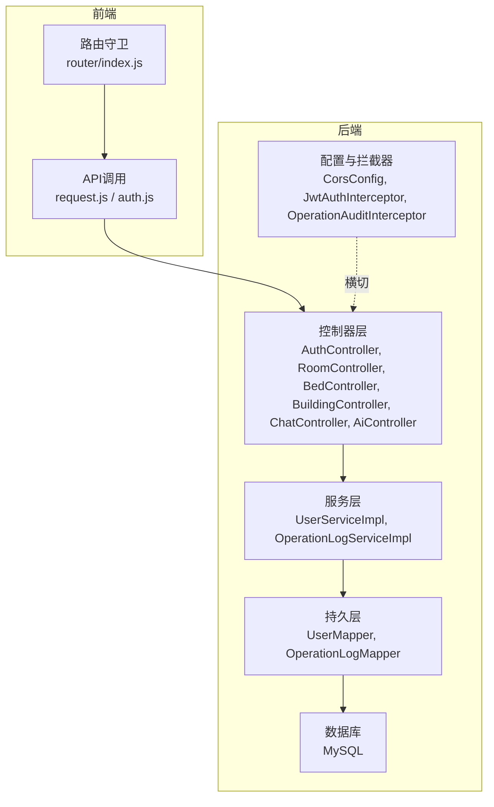
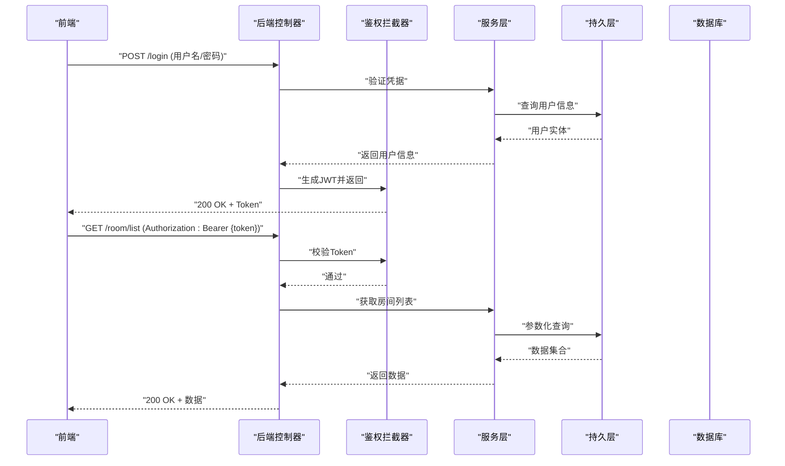
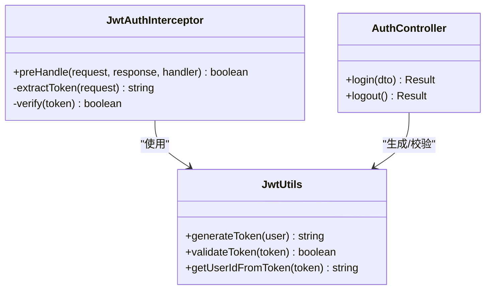
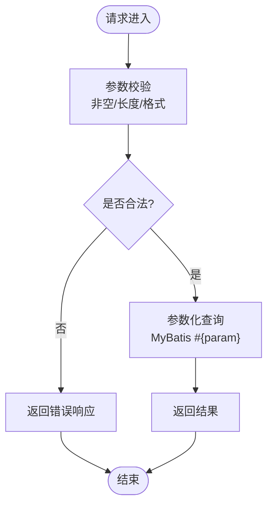
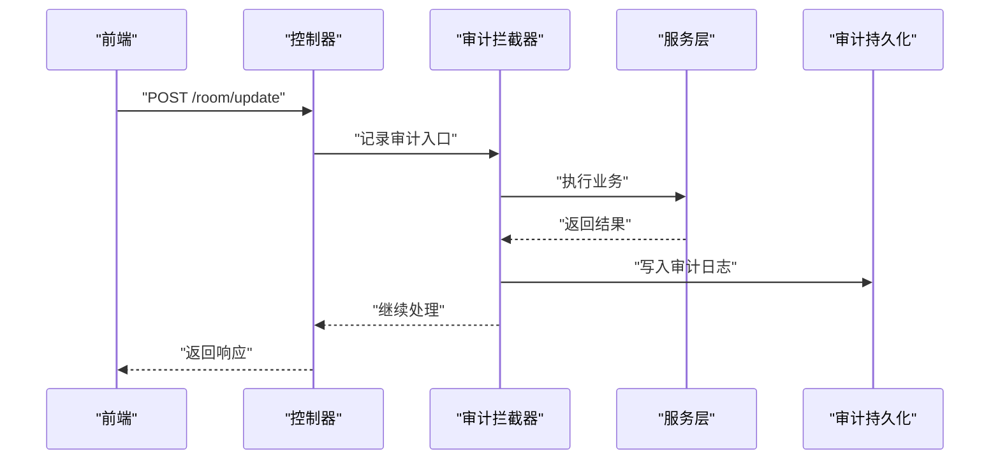
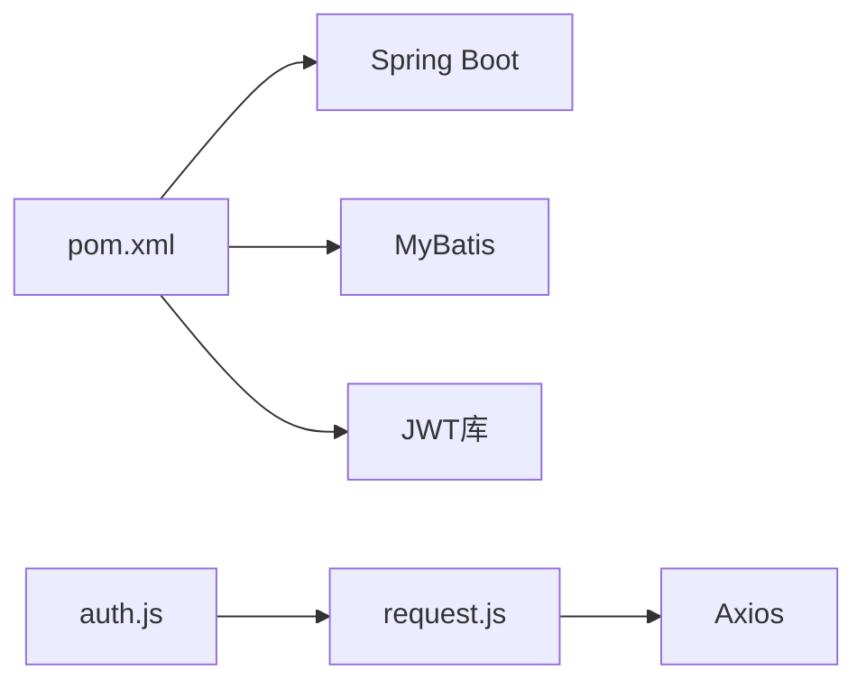

# 安全设计

<cite>
**本文引用的文件**   
- [application.yml](file://backend/src/main/resources/application.yml)
- [application-dev.yml](file://backend/src/main/resources/application-dev.yml)
- [logback-spring.xml](file://backend/src/main/resources/logback-spring.xml)
- [schema.sql](file://backend/src/main/resources/schema.sql)
- [AuthController.java](file://backend/src/main/java/com/dorm/backend/controller/AuthController.java)
- [JwtUtils.java](file://backend/src/main/java/com/dorm/backend/common/JwtUtils.java)
- [JwtAuthInterceptor.java](file://backend/src/main/java/com/dorm/backend/config/JwtAuthInterceptor.java)
- [CorsConfig.java](file://backend/src/main/java/com/dorm/backend/config/CorsConfig.java)
- [OperationAuditInterceptor.java](file://backend/src/main/java/com/dorm/backend/config/OperationAuditInterceptor.java)
- [GlobalExceptionHandler.java](file://backend/src/main/java/com/dorm/backend/common/GlobalExceptionHandler.java)
- [UserService.java](file://backend/src/main/java/com/dorm/backend/service/UserService.java)
- [UserServiceImpl.java](file://backend/src/main/java/com/dorm/backend/service/impl/UserServiceImpl.java)
- [PasswordService.java](file://backend/src/main/java/com/dorm/backend/service/PasswordService.java)
- [UserMapper.java](file://backend/src/main/java/com/dorm/backend/mapper/UserMapper.java)
- [OperationLog.java](file://backend/src/main/java/com/dorm/backend/entity/OperationLog.java)
- [OperationLogMapper.java](file://backend/src/main/java/com/dorm/backend/mapper/OperationLogMapper.java)
- [OperationLogController.java](file://backend/src/main/java/com/dorm/backend/controller/OperationLogController.java)
- [OperationLogService.java](file://backend/src/main/java/com/dorm/backend/service/OperationLogService.java)
- [OperationLogServiceImpl.java](file://backend/src/main/java/com/dorm/backend/service/impl/OperationLogServiceImpl.java)
- [RoomController.java](file://backend/src/main/java/com/dorm/backend/controller/RoomController.java)
- [BedController.java](file://backend/src/main/java/com/dorm/backend/controller/BedController.java)
- [BuildingController.java](file://backend/src/main/java/com/dorm/backend/controller/BuildingController.java)
- [ChatController.java](file://backend/src/main/java/com/dorm/backend/controller/ChatController.java)
- [AiController.java](file://backend/src/main/java/com/dorm/backend/controller/AiController.java)
- [request.js](file://frontend/src/utils/request.js)
- [auth.js](file://frontend/src/api/auth.js)
- [index.js](file://frontend/src/router/index.js)
- [pom.xml](file://backend/pom.xml)
</cite>

## 目录
1. [引言](#引言)
2. [项目结构](#项目结构)
3. [核心组件](#核心组件)
4. [架构总览](#架构总览)
5. [详细组件分析](#详细组件分析)
6. [依赖分析](#依赖分析)
7. [性能考虑](#性能考虑)
8. [故障排查指南](#故障排查指南)
9. [结论](#结论)
10. [附录](#附录)

## 引言
本文件面向宿舍管理系统的安全设计，围绕输入验证与SQL注入防护、XSS与CSRF防护、敏感数据加密存储与传输、日志审计与操作追踪、安全配置最佳实践与常见漏洞防护、安全测试方法与工具推荐、以及安全事件应急响应与故障排查进行系统化说明。文档以代码仓库中的实际实现为依据，并结合通用安全工程实践给出可操作的指导。

## 项目结构
后端采用Spring Boot分层架构：控制器层处理HTTP请求，服务层封装业务逻辑，持久层通过MyBatis访问数据库；公共模块提供鉴权、异常处理等横切能力；配置类集中管理跨域、拦截器注册等。前端基于Vue生态，使用Axios发起请求并统一处理认证头与错误响应。

图表来源
- [AuthController.java](file://backend/src/main/java/com/dorm/backend/controller/AuthController.java)
- [JwtAuthInterceptor.java](file://backend/src/main/java/com/dorm/backend/config/JwtAuthInterceptor.java)
- [CorsConfig.java](file://backend/src/main/java/com/dorm/backend/config/CorsConfig.java)
- [OperationAuditInterceptor.java](file://backend/src/main/java/com/dorm/backend/config/OperationAuditInterceptor.java)
- [UserServiceImpl.java](file://backend/src/main/java/com/dorm/backend/service/impl/UserServiceImpl.java)
- [UserMapper.java](file://backend/src/main/java/com/dorm/backend/mapper/UserMapper.java)
- [OperationLogServiceImpl.java](file://backend/src/main/java/com/dorm/backend/service/impl/OperationLogServiceImpl.java)
- [OperationLogMapper.java](file://backend/src/main/java/com/dorm/backend/mapper/OperationLogMapper.java)

章节来源
- [application.yml](file://backend/src/main/resources/application.yml)
- [application-dev.yml](file://backend/src/main/resources/application-dev.yml)

## 核心组件
- 认证与授权
  - JWT令牌生成与校验：用于无状态会话管理，拦截器在请求进入控制器前校验签名与有效期。
  - 跨域策略：集中配置允许的源、方法、头部，避免不必要的宽泛放行。
- 输入验证与SQL注入防护
  - 控制器与服务层对入参进行基础校验（非空、长度、格式）。
  - 持久层使用参数化查询（MyBatis）避免拼接SQL。
- XSS与CSRF防护
  - 输出编码与内容类型控制，限制富文本渲染范围。
  - 针对表单写操作引入CSRF防护或Token校验机制。
- 敏感数据加密
  - 密码哈希存储，密钥管理从环境变量或配置中心读取。
  - 传输层强制HTTPS，必要时对敏感字段做应用层加密。
- 日志审计与操作追踪
  - 全局异常处理器统一捕获异常并记录关键上下文。
  - 操作审计拦截器记录用户、IP、时间、操作对象与结果。
  - 审计日志持久化到数据库并提供查询接口。

章节来源
- [JwtUtils.java](file://backend/src/main/java/com/dorm/backend/common/JwtUtils.java)
- [JwtAuthInterceptor.java](file://backend/src/main/java/com/dorm/backend/config/JwtAuthInterceptor.java)
- [CorsConfig.java](file://backend/src/main/java/com/dorm/backend/config/CorsConfig.java)
- [GlobalExceptionHandler.java](file://backend/src/main/java/com/dorm/backend/common/GlobalExceptionHandler.java)
- [OperationAuditInterceptor.java](file://backend/src/main/java/com/dorm/backend/config/OperationAuditInterceptor.java)
- [OperationLog.java](file://backend/src/main/java/com/dorm/backend/entity/OperationLog.java)
- [OperationLogMapper.java](file://backend/src/main/java/com/dorm/backend/mapper/OperationLogMapper.java)
- [OperationLogController.java](file://backend/src/main/java/com/dorm/backend/controller/OperationLogController.java)
- [OperationLogService.java](file://backend/src/main/java/com/dorm/backend/service/OperationLogService.java)
- [OperationLogServiceImpl.java](file://backend/src/main/java/com/dorm/backend/service/impl/OperationLogServiceImpl.java)

## 架构总览
系统采用前后端分离架构，后端通过REST API暴露能力，前端通过Axios调用并在请求头中携带JWT。鉴权由拦截器完成，跨域由配置类统一管理，审计由独立拦截器采集并落库，异常由全局处理器统一收敛。

图表来源
- [AuthController.java](file://backend/src/main/java/com/dorm/backend/controller/AuthController.java)
- [JwtAuthInterceptor.java](file://backend/src/main/java/com/dorm/backend/config/JwtAuthInterceptor.java)
- [UserServiceImpl.java](file://backend/src/main/java/com/dorm/backend/service/impl/UserServiceImpl.java)
- [UserMapper.java](file://backend/src/main/java/com/dorm/backend/mapper/UserMapper.java)

## 详细组件分析

### 认证与授权（JWT与拦截器）
- 登录流程
  - 控制器接收凭据，服务层校验用户存在与密码正确性，成功后签发JWT。
  - 前端保存Token并在后续请求头中携带。
- 鉴权拦截器
  - 解析Authorization头，校验签名与过期时间，失败则拒绝请求。
  - 将用户上下文注入到请求属性或线程局部变量，供后续业务使用。
- 跨域配置
  - 明确允许的来源、方法与头部，避免通配符滥用。

图表来源
- [JwtUtils.java](file://backend/src/main/java/com/dorm/backend/common/JwtUtils.java)
- [JwtAuthInterceptor.java](file://backend/src/main/java/com/dorm/backend/config/JwtAuthInterceptor.java)
- [AuthController.java](file://backend/src/main/java/com/dorm/backend/controller/AuthController.java)

章节来源
- [JwtUtils.java](file://backend/src/main/java/com/dorm/backend/common/JwtUtils.java)
- [JwtAuthInterceptor.java](file://backend/src/main/java/com/dorm/backend/config/JwtAuthInterceptor.java)
- [AuthController.java](file://backend/src/main/java/com/dorm/backend/controller/AuthController.java)
- [CorsConfig.java](file://backend/src/main/java/com/dorm/backend/config/CorsConfig.java)

### 输入验证与SQL注入防护
- 输入验证
  - 控制器与服务层对必填字段、长度、格式进行校验，非法输入直接返回错误码。
- SQL注入防护
  - 持久层使用MyBatis参数绑定（#{...}），禁止字符串拼接SQL。
  - 对动态排序/过滤场景采用白名单映射，避免直接拼接列名。

图表来源
- [UserServiceImpl.java](file://backend/src/main/java/com/dorm/backend/service/impl/UserServiceImpl.java)
- [UserMapper.java](file://backend/src/main/java/com/dorm/backend/mapper/UserMapper.java)

章节来源
- [UserServiceImpl.java](file://backend/src/main/java/com/dorm/backend/service/impl/UserServiceImpl.java)
- [UserMapper.java](file://backend/src/main/java/com/dorm/backend/mapper/UserMapper.java)

### XSS与CSRF防护
- XSS防护
  - 输出侧进行HTML转义，避免直接渲染用户输入。
  - 对富文本场景启用白名单过滤与内容类型限制。
- CSRF防护
  - 对写操作（POST/PUT/DELETE）引入CSRF Token或SameSite Cookie策略。
  - 前端在提交表单时附带Token，后端校验一致性。

章节来源
- [ChatController.java](file://backend/src/main/java/com/dorm/backend/controller/ChatController.java)
- [AiController.java](file://backend/src/main/java/com/dorm/backend/controller/AiController.java)
- [request.js](file://frontend/src/utils/request.js)

### 敏感数据加密存储与传输安全
- 存储加密
  - 密码使用强哈希算法（如BCrypt）存储，禁止明文。
  - 其他敏感字段（如身份证号、手机号）按策略加密或脱敏展示。
- 传输安全
  - 生产环境强制HTTPS，禁用弱加密套件。
  - 前端通过Axios统一设置请求超时与错误处理。

章节来源
- [PasswordService.java](file://backend/src/main/java/com/dorm/backend/service/PasswordService.java)
- [application.yml](file://backend/src/main/resources/application.yml)
- [application-dev.yml](file://backend/src/main/resources/application-dev.yml)
- [request.js](file://frontend/src/utils/request.js)

### 日志审计与操作追踪
- 审计拦截器
  - 记录用户ID、IP、时间戳、请求路径、参数摘要、执行结果。
  - 对异常路径记录堆栈摘要与错误码。
- 审计持久化
  - 审计实体包含必要字段，Mapper提供插入与分页查询。
  - 控制器暴露审计日志查询接口，支持按用户、时间范围筛选。
- 全局异常处理
  - 统一捕获未处理异常，记录关键上下文并返回标准化错误响应。

图表来源
- [OperationAuditInterceptor.java](file://backend/src/main/java/com/dorm/backend/config/OperationAuditInterceptor.java)
- [OperationLog.java](file://backend/src/main/java/com/dorm/backend/entity/OperationLog.java)
- [OperationLogMapper.java](file://backend/src/main/java/com/dorm/backend/mapper/OperationLogMapper.java)
- [OperationLogController.java](file://backend/src/main/java/com/dorm/backend/controller/OperationLogController.java)
- [OperationLogService.java](file://backend/src/main/java/com/dorm/backend/service/OperationLogService.java)
- [OperationLogServiceImpl.java](file://backend/src/main/java/com/dorm/backend/service/impl/OperationLogServiceImpl.java)
- [GlobalExceptionHandler.java](file://backend/src/main/java/com/dorm/backend/common/GlobalExceptionHandler.java)

章节来源
- [OperationAuditInterceptor.java](file://backend/src/main/java/com/dorm/backend/config/OperationAuditInterceptor.java)
- [OperationLog.java](file://backend/src/main/java/com/dorm/backend/entity/OperationLog.java)
- [OperationLogMapper.java](file://backend/src/main/java/com/dorm/backend/mapper/OperationLogMapper.java)
- [OperationLogController.java](file://backend/src/main/java/com/dorm/backend/controller/OperationLogController.java)
- [OperationLogService.java](file://backend/src/main/java/com/dorm/backend/service/OperationLogService.java)
- [OperationLogServiceImpl.java](file://backend/src/main/java/com/dorm/backend/service/impl/OperationLogServiceImpl.java)
- [GlobalExceptionHandler.java](file://backend/src/main/java/com/dorm/backend/common/GlobalExceptionHandler.java)

### 安全配置最佳实践
- 最小权限原则
  - 数据库账号仅授予必要权限，禁止使用root/admin账户运行服务。
- 密钥管理
  - 密钥与敏感配置通过环境变量或配置中心注入，禁止硬编码。
- 网络与安全
  - 启用HTTPS，关闭不必要的端口与服务，限制CORS来源与方法。
- 日志与监控
  - 开启审计日志与异常告警，定期轮转与归档日志。

章节来源
- [application.yml](file://backend/src/main/resources/application.yml)
- [application-dev.yml](file://backend/src/main/resources/application-dev.yml)
- [logback-spring.xml](file://backend/src/main/resources/logback-spring.xml)

### 常见漏洞防护清单
- SQL注入：坚持参数化查询，避免拼接SQL与列名。
- XSS：输出编码、富文本白名单过滤、限制Content-Type。
- CSRF：写操作加Token校验或SameSite策略。
- 越权访问：服务端校验资源归属与角色权限。
- 敏感信息泄露：统一错误响应，不返回堆栈细节。
- 依赖漏洞：定期扫描第三方库并升级。

章节来源
- [GlobalExceptionHandler.java](file://backend/src/main/java/com/dorm/backend/common/GlobalExceptionHandler.java)
- [CorsConfig.java](file://backend/src/main/java/com/dorm/backend/config/CorsConfig.java)

### 安全测试方法与工具推荐
- 静态扫描
  - SAST：SonarQube、Checkmarx、Fortify。
- 动态扫描
  - DAST：OWASP ZAP、Burp Suite。
- 依赖扫描
  - OWASP Dependency-Check、npm audit、Snyk。
- 渗透测试
  - 手动验证越权、注入、XSS、CSRF等场景。
- 自动化集成
  - 在CI/CD中加入安全扫描门禁，阻断高危问题上线。

[本节为通用指导，不直接分析具体文件]

## 依赖分析
后端依赖Spring Boot、MyBatis、JWT相关库；前端依赖Vue与Axios。关键依赖关系如下：

图表来源
- [pom.xml](file://backend/pom.xml)
- [request.js](file://frontend/src/utils/request.js)
- [auth.js](file://frontend/src/api/auth.js)

章节来源
- [pom.xml](file://backend/pom.xml)
- [request.js](file://frontend/src/utils/request.js)
- [auth.js](file://frontend/src/api/auth.js)

## 性能考虑
- 数据库层面
  - 合理使用索引，避免N+1查询，分页查询限制最大条数。
- 缓存策略
  - 热点数据（如字典、配置）使用本地或分布式缓存。
- 连接池与超时
  - 合理配置连接池大小与请求超时，避免雪崩。
- 日志级别
  - 生产环境降低日志级别，减少IO开销。

[本节为通用指导，不直接分析具体文件]

## 故障排查指南
- 认证失败
  - 检查JWT签名与有效期，确认客户端是否正确携带Authorization头。
- 跨域错误
  - 核对CORS配置，确保Origin、Method、Header匹配。
- 审计日志缺失
  - 检查审计拦截器注册与数据库写入权限，确认日志表结构。
- 异常统一处理
  - 查看全局异常处理器是否捕获并记录关键上下文。

章节来源
- [JwtAuthInterceptor.java](file://backend/src/main/java/com/dorm/backend/config/JwtAuthInterceptor.java)
- [CorsConfig.java](file://backend/src/main/java/com/dorm/backend/config/CorsConfig.java)
- [OperationAuditInterceptor.java](file://backend/src/main/java/com/dorm/backend/config/OperationAuditInterceptor.java)
- [GlobalExceptionHandler.java](file://backend/src/main/java/com/dorm/backend/common/GlobalExceptionHandler.java)

## 结论
本系统通过JWT无状态鉴权、参数化查询防注入、统一的异常与审计机制、严格的跨域与输出编码策略，构建了较为完整的安全基线。建议在生产环境中持续强化密钥管理、依赖治理、渗透测试与监控告警，形成闭环的安全运营体系。

## 附录
- 数据库安全
  - 使用专用账号、最小权限、定期备份与恢复演练。
- 前端安全
  - 避免在URL或LocalStorage存放敏感信息，使用HttpOnly Cookie。
- 合规与审计
  - 满足数据安全法与个人信息保护法要求，保留必要的审计轨迹。

[本节为通用指导，不直接分析具体文件]