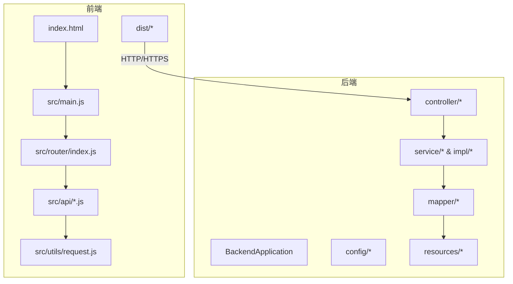
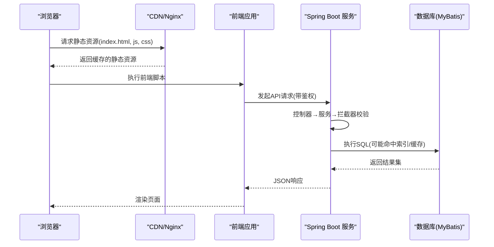
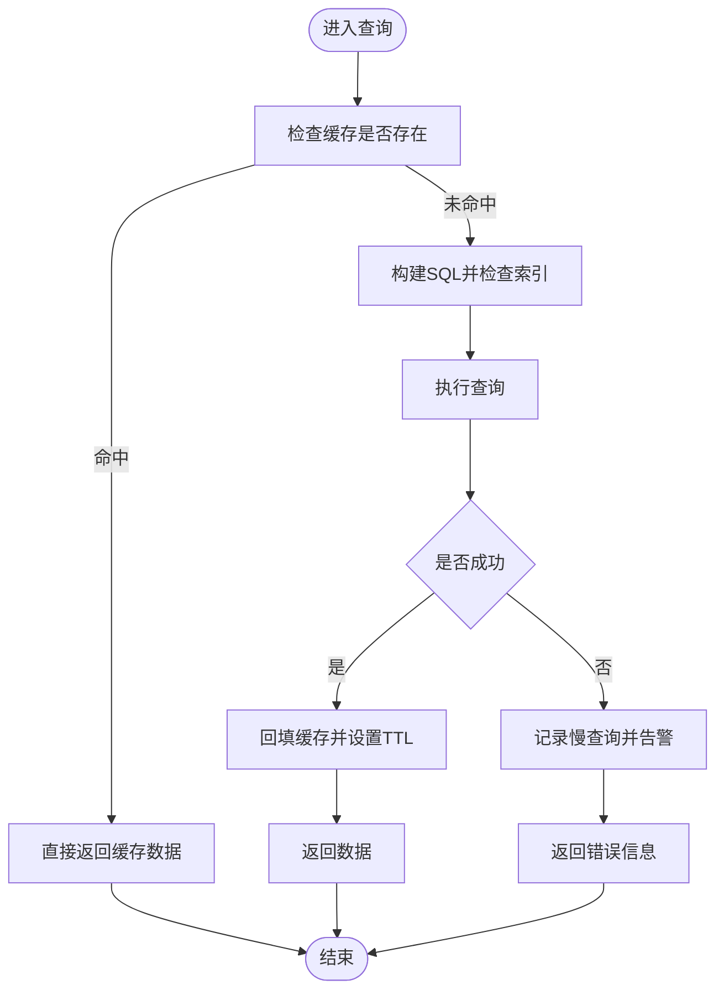
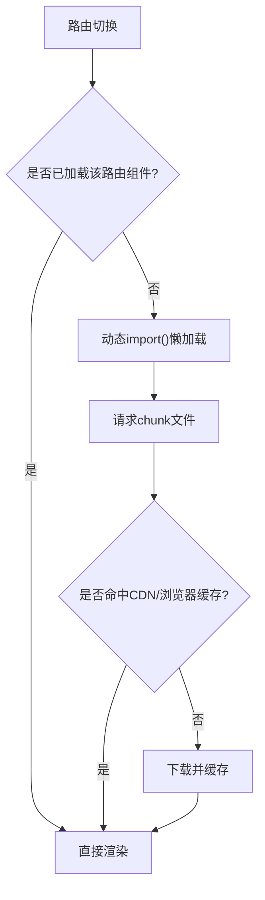
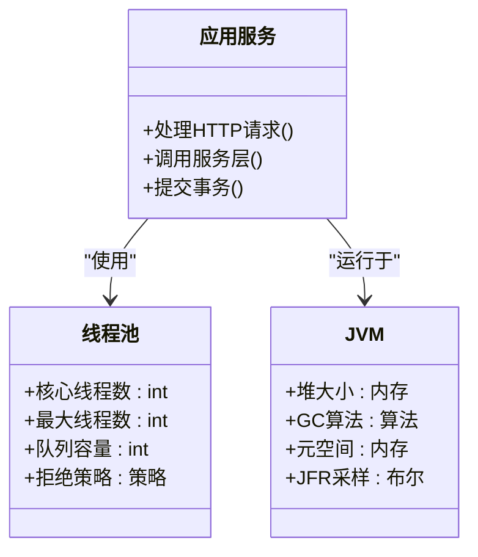

# 性能优化

<cite>
**本文引用的文件**   
- [application.yml](file://backend/src/main/resources/application.yml)
- [application-dev.yml](file://backend/src/main/resources/application-dev.yml)
- [logback-spring.xml](file://backend/src/main/resources/logback-spring.xml)
- [pom.xml](file://backend/pom.xml)
- [WebMvcConfig.java](file://backend/src/main/java/com/dorm/backend/config/WebMvcConfig.java)
- [CorsConfig.java](file://backend/src/main/java/com/dorm/backend/config/CorsConfig.java)
- [GlobalExceptionHandler.java](file://backend/src/main/java/com/dorm/backend/common/GlobalExceptionHandler.java)
- [AuthController.java](file://backend/src/main/java/com/dorm/backend/controller/AuthController.java)
- [DashboardController.java](file://backend/src/main/java/com/dorm/backend/controller/DashboardController.java)
- [RoomController.java](file://backend/src/main/java/com/dorm/backend/controller/RoomController.java)
- [UserService.java](file://backend/src/main/java/com/dorm/backend/service/UserService.java)
- [UserServiceImpl.java](file://backend/src/main/java/com/dorm/backend/service/impl/UserServiceImpl.java)
- [UserMapper.java](file://backend/src/main/java/com/dorm/backend/mapper/UserMapper.java)
- [schema.sql](file://backend/src/main/resources/schema.sql)
- [package.json](file://frontend/package.json)
- [vite.config.js](file://frontend/vite.config.js)
- [index.html](file://frontend/index.html)
- [main.js](file://frontend/src/main.js)
- [router/index.js](file://frontend/src/router/index.js)
- [api/auth.js](file://frontend/src/api/auth.js)
- [utils/request.js](file://frontend/src/utils/request.js)
</cite>

## 目录
1. [简介](#简介)
2. [项目结构](#项目结构)
3. [核心组件](#核心组件)
4. [架构总览](#架构总览)
5. [详细组件分析](#详细组件分析)
6. [依赖分析](#依赖分析)
7. [性能考虑](#性能考虑)
8. [故障排查指南](#故障排查指南)
9. [结论](#结论)
10. [附录](#附录)

## 简介
本文件面向宿舍管理系统（后端 Spring Boot + MyBatis，前端 Vite + Vue）的性能优化，覆盖数据库查询优化、缓存策略、前端代码分割与懒加载、静态资源压缩、服务器端 JVM 与线程池调优、CDN 加速与静态资源优化、性能监控与瓶颈分析、以及性能测试与基准测试方法。文档结合仓库中的实际配置与代码位置进行说明，便于落地实施。

## 项目结构
- 后端采用分层架构：controller → service(impl) → mapper → entity，配合 MyBatis XML 映射；配置集中在 application*.yml 与 logback 日志配置中。
- 前端基于 Vite 构建，路由与 API 调用分离，静态资源位于 public 与 src/assets。

**图表来源** 
- [index.html](file://frontend/index.html)
- [main.js](file://frontend/src/main.js)
- [router/index.js](file://frontend/src/router/index.js)
- [api/auth.js](file://frontend/src/api/auth.js)
- [utils/request.js](file://frontend/src/utils/request.js)
- [WebMvcConfig.java](file://backend/src/main/java/com/dorm/backend/config/WebMvcConfig.java)
- [application.yml](file://backend/src/main/resources/application.yml)

**章节来源**
- [application.yml](file://backend/src/main/resources/application.yml)
- [application-dev.yml](file://backend/src/main/resources/application-dev.yml)
- [package.json](file://frontend/package.json)
- [vite.config.js](file://frontend/vite.config.js)

## 核心组件
- 后端关键入口与配置
  - WebMvcConfig：拦截器与 MVC 配置，影响请求处理链路和跨域等。
  - CorsConfig：跨域策略，影响浏览器预检与请求成功率。
  - GlobalExceptionHandler：统一异常处理，避免错误响应体过大或重复日志。
  - application.yml / application-dev.yml：数据源、MyBatis、端口、日志级别等。
  - logback-spring.xml：日志输出与滚动策略，影响 I/O 与磁盘占用。
- 前端关键入口与构建
  - vite.config.js：构建优化开关（如分包、压缩、代理）。
  - router/index.js：路由定义，支持按需加载。
  - utils/request.js：统一请求封装，可加重试、超时、缓存头。
  - index.html：入口 HTML，可开启 HTTP/2 Server Push、预连接等。

**章节来源**
- [WebMvcConfig.java](file://backend/src/main/java/com/dorm/backend/config/WebMvcConfig.java)
- [CorsConfig.java](file://backend/src/main/java/com/dorm/backend/config/CorsConfig.java)
- [GlobalExceptionHandler.java](file://backend/src/main/java/com/dorm/backend/common/GlobalExceptionHandler.java)
- [application.yml](file://backend/src/main/resources/application.yml)
- [application-dev.yml](file://backend/src/main/resources/application-dev.yml)
- [logback-spring.xml](file://backend/src/main/resources/logback-spring.xml)
- [vite.config.js](file://frontend/vite.config.js)
- [router/index.js](file://frontend/src/router/index.js)
- [utils/request.js](file://frontend/src/utils/request.js)
- [index.html](file://frontend/index.html)

## 架构总览
系统前后端通过 RESTful API 交互，后端使用 MyBatis 访问数据库，前端通过 Vite 构建产物由 Nginx/CDN 托管。

**图表来源** 
- [AuthController.java](file://backend/src/main/java/com/dorm/backend/controller/AuthController.java)
- [UserService.java](file://backend/src/main/java/com/dorm/backend/service/UserService.java)
- [UserServiceImpl.java](file://backend/src/main/java/com/dorm/backend/service/impl/UserServiceImpl.java)
- [UserMapper.java](file://backend/src/main/java/com/dorm/backend/mapper/UserMapper.java)
- [application.yml](file://backend/src/main/resources/application.yml)

## 详细组件分析

### 数据库查询优化策略
- 索引设计
  - 在高频查询条件列建立复合索引，遵循最左前缀原则，避免过度索引导致写入放大。
  - 对排序与分组字段评估是否可通过覆盖索引减少回表。
  - 定期分析慢查询日志，识别缺失索引与低效索引。
- 查询优化
  - 避免 SELECT *，仅选择必要字段，减少网络与序列化开销。
  - 分页查询使用“延迟关联”或游标分页，避免深分页性能退化。
  - 合理使用 EXISTS 替代 IN，避免子查询全表扫描。
  - 批量操作使用批量插入/更新，降低事务与锁竞争。
- 缓存策略
  - 读多写少场景引入本地缓存（如 Caffeine）+ 分布式缓存（如 Redis），设置合理 TTL 与失效策略。
  - 热点数据采用双写一致性方案（先更库再删缓存，或延时双删）。
  - 对聚合统计类接口做异步化与定时刷新，避免同步阻塞。

**图表来源** 
- [UserServiceImpl.java](file://backend/src/main/java/com/dorm/backend/service/impl/UserServiceImpl.java)
- [UserMapper.java](file://backend/src/main/java/com/dorm/backend/mapper/UserMapper.java)
- [application.yml](file://backend/src/main/resources/application.yml)

**章节来源**
- [schema.sql](file://backend/src/main/resources/schema.sql)
- [UserMapper.java](file://backend/src/main/java/com/dorm/backend/mapper/UserMapper.java)
- [UserServiceImpl.java](file://backend/src/main/java/com/dorm/backend/service/impl/UserServiceImpl.java)

### 前端性能优化
- 代码分割与懒加载
  - 按路由拆分 chunk，使用动态 import() 实现组件级懒加载，减少首屏体积。
  - 第三方库按需引入，避免打包无用模块。
- 资源压缩与缓存
  - 启用 JS/CSS/图片压缩与 Tree Shaking，生产环境关闭 SourceMap。
  - 利用浏览器强缓存与协商缓存（ETag/Last-Modified），配合 CDN 边缘缓存。
- 构建与传输优化
  - 启用 Gzip/Brotli，HTTP/2 多路复用，预连接关键域名。
  - 使用 CDN 分发静态资源，缩短用户到节点距离。

**图表来源** 
- [router/index.js](file://frontend/src/router/index.js)
- [vite.config.js](file://frontend/vite.config.js)
- [index.html](file://frontend/index.html)

**章节来源**
- [vite.config.js](file://frontend/vite.config.js)
- [router/index.js](file://frontend/src/router/index.js)
- [index.html](file://frontend/index.html)

### 服务器端性能调优
- JVM 参数配置
  - 根据堆大小设置新生代与老年代比例，合理配置 GC 算法（如 G1/ZGC），调整堆外内存与元空间。
  - 开启 GC 日志与 JFR 采样，定位 Full GC 与停顿问题。
- 线程池设置
  - Tomcat 线程池大小与队列长度依据 CPU 核数与 IO 特性调优，避免过多上下文切换。
  - 异步任务使用独立线程池隔离，防止阻塞主业务。
- 内存管理
  - 控制对象生命周期，避免大对象频繁分配；合理使用连接池与缓冲池。
  - 监控堆使用率、GC 次数与耗时，及时扩容或优化代码。

**图表来源** 
- [application.yml](file://backend/src/main/resources/application.yml)
- [pom.xml](file://backend/pom.xml)

**章节来源**
- [application.yml](file://backend/src/main/resources/application.yml)
- [pom.xml](file://backend/pom.xml)

### CDN 加速与静态资源优化
- 将前端构建产物部署至 CDN，开启边缘缓存与版本化文件名。
- 配置合适的 Cache-Control 与 ETag，确保更新时强制刷新旧资源。
- 启用 Gzip/Brotli，合并与压缩 CSS/JS，移除冗余注释与调试信息。
- 使用预加载与预连接提升关键资源获取速度。

**章节来源**
- [index.html](file://frontend/index.html)
- [vite.config.js](file://frontend/vite.config.js)

### 性能监控与瓶颈分析
- 后端监控
  - 接入 APM（如 SkyWalking/Pinpoint）采集接口耗时、SQL 执行计划与线程状态。
  - 开启慢 SQL 日志与阈值告警，定位热点接口与锁竞争。
- 前端监控
  - 采集 LCP/FID/CLS 等核心指标，结合 Performance API 分析长任务与阻塞。
  - 错误上报与白屏检测，快速定位线上问题。
- 压测与基准
  - 使用 JMeter/k6 模拟并发，观察 QPS、RT、错误率与资源利用率。
  - 针对热点接口与数据库热点行进行专项压测。

**章节来源**
- [logback-spring.xml](file://backend/src/main/resources/logback-spring.xml)
- [application.yml](file://backend/src/main/resources/application.yml)

### 性能测试工具与基准测试指导
- 工具选型
  - 后端：JMeter、k6、wrk；数据库：sysbench、pt-query-digest。
  - 前端：Lighthouse、WebPageTest、Chrome DevTools Performance。
- 测试步骤
  - 明确目标（QPS、RT、错误率），准备稳定环境与基线数据。
  - 逐步加压，观察 CPU/内存/IO/网络与数据库指标变化。
  - 定位瓶颈后迭代优化，回归验证效果。
- 持续集成
  - 将基准测试纳入 CI，自动对比每次变更的性能差异，防止退化。

[本节为通用指导，不直接分析具体文件]

## 依赖分析
- 后端依赖
  - Spring Boot 与 MyBatis 生态，数据源与连接池配置直接影响吞吐与延迟。
  - 拦截器与全局异常处理影响请求处理链路与错误响应体大小。
- 前端依赖
  - Vite 构建管线决定打包体积与加载时间；路由与 API 模块组织影响懒加载粒度。

**图表来源** 
- [AuthController.java](file://backend/src/main/java/com/dorm/backend/controller/AuthController.java)
- [UserService.java](file://backend/src/main/java/com/dorm/backend/service/UserService.java)
- [UserServiceImpl.java](file://backend/src/main/java/com/dorm/backend/service/impl/UserServiceImpl.java)
- [UserMapper.java](file://backend/src/main/java/com/dorm/backend/mapper/UserMapper.java)

**章节来源**
- [AuthController.java](file://backend/src/main/java/com/dorm/backend/controller/AuthController.java)
- [UserService.java](file://backend/src/main/java/com/dorm/backend/service/UserService.java)
- [UserServiceImpl.java](file://backend/src/main/java/com/dorm/backend/service/impl/UserServiceImpl.java)
- [UserMapper.java](file://backend/src/main/java/com/dorm/backend/mapper/UserMapper.java)

## 性能考虑
- 数据库
  - 优先通过索引与 SQL 改写降低扫描行数；必要时引入读写分离与分库分表。
  - 对热点键值对使用缓存，注意缓存穿透、击穿与雪崩防护。
- 前端
  - 控制首屏包体，按需加载；图片使用 WebP/AVIF，视频走 CDN 流式播放。
  - 减少重排重绘，使用虚拟列表与防抖节流。
- 服务器
  - 合理设置线程池与连接池，避免资源耗尽；启用异步与非阻塞 IO。
  - 监控 GC 与堆使用，及时扩容或优化对象分配。
- 网络与缓存
  - 启用 HTTP/2、Gzip/Brotli、CDN 缓存与浏览器缓存策略。
  - 对静态资源进行指纹命名，确保长期缓存有效。

[本节为通用指导，不直接分析具体文件]

## 故障排查指南
- 常见问题定位
  - 接口超时：检查线程池饱和、数据库慢查询、外部依赖超时。
  - 内存溢出：分析堆转储，定位大对象与泄漏点。
  - 前端白屏：检查静态资源 404、CORS 错误、脚本语法错误。
- 日志与监控
  - 统一异常捕获与结构化日志，避免敏感信息泄露。
  - 接入 APM 与告警，设置关键指标阈值。
- 快速恢复
  - 降级与熔断：对非核心功能降级，保护核心链路。
  - 限流与背压：限制突发流量，避免雪崩。

**章节来源**
- [GlobalExceptionHandler.java](file://backend/src/main/java/com/dorm/backend/common/GlobalExceptionHandler.java)
- [logback-spring.xml](file://backend/src/main/resources/logback-spring.xml)

## 结论
通过数据库索引与查询优化、缓存策略、前端代码分割与懒加载、服务器端 JVM 与线程池调优、CDN 与静态资源优化、以及完善的监控与压测体系，可显著提升系统的吞吐与稳定性。建议将性能优化纳入日常迭代流程，持续度量与改进。

[本节为总结性内容，不直接分析具体文件]

## 附录
- 常用命令与参考
  - 数据库慢查询导出与分析：pt-query-digest、EXPLAIN 分析执行计划。
  - 前端性能审计：Lighthouse CLI、WebPageTest 在线测试。
  - 压测脚本模板：JMeter CSV 数据驱动、k6 脚本示例。
- 最佳实践清单
  - 所有对外接口必须包含超时与重试上限。
  - 生产环境禁用调试日志与详细堆栈输出。
  - 静态资源必须版本化并开启强缓存。

[本节为补充材料，不直接分析具体文件]