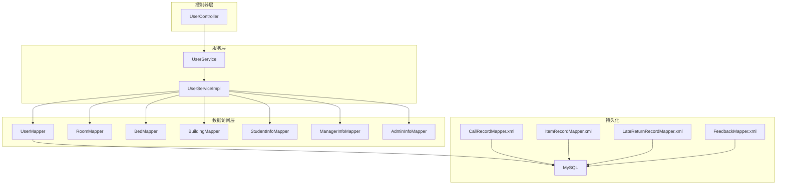
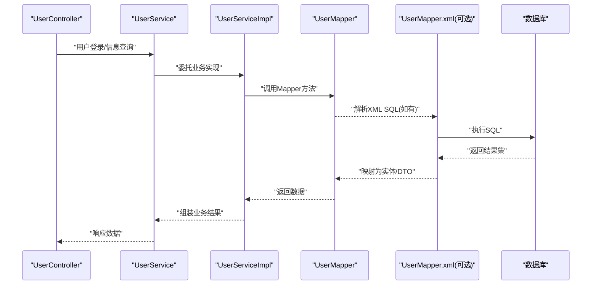
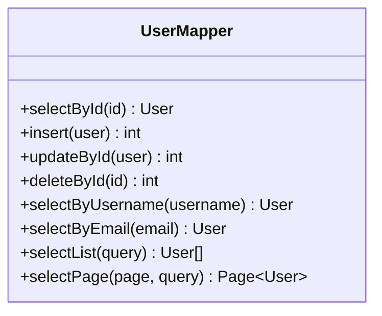
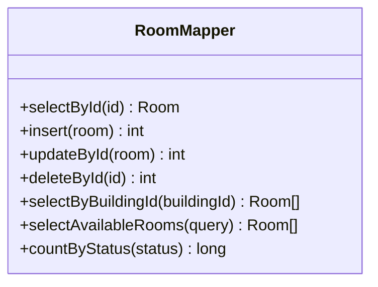
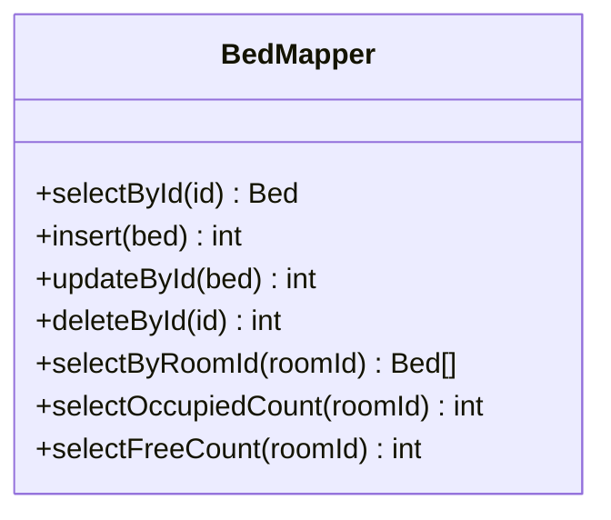
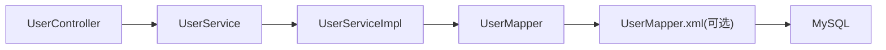
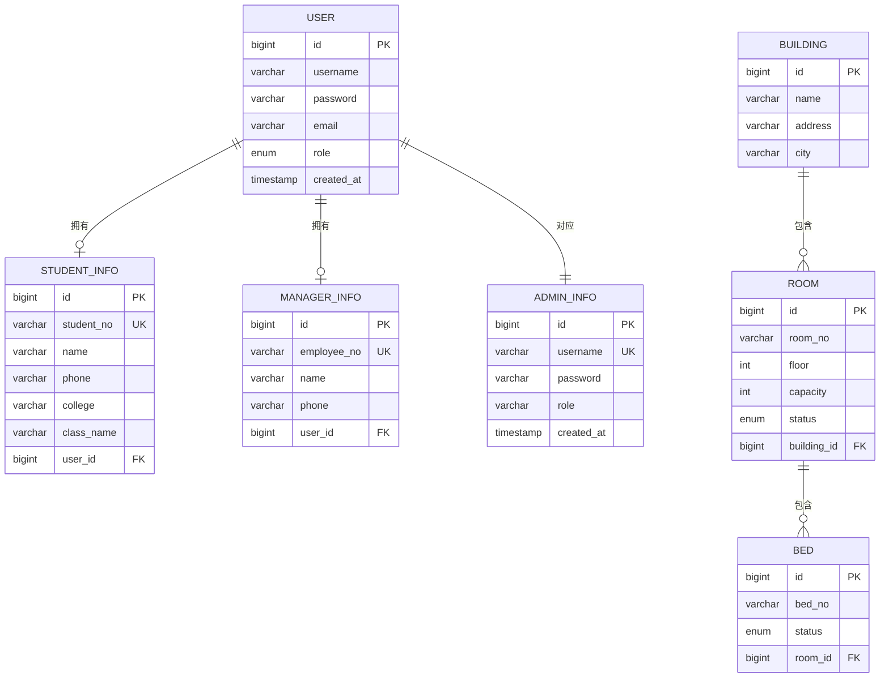

# Mapper接口设计

<cite>
**本文引用的文件**   
- [UserMapper.java](file://backend/src/main/java/com/dorm/backend/mapper/UserMapper.java)
- [RoomMapper.java](file://backend/src/main/java/com/dorm/backend/mapper/RoomMapper.java)
- [BedMapper.java](file://backend/src/main/java/com/dorm/backend/mapper/BedMapper.java)
- [BuildingMapper.java](file://backend/src/main/java/com/dorm/backend/mapper/BuildingMapper.java)
- [StudentInfoMapper.java](file://backend/src/main/java/com/dorm/backend/mapper/StudentInfoMapper.java)
- [ManagerInfoMapper.java](file://backend/src/main/java/com/dorm/backend/mapper/ManagerInfoMapper.java)
- [AdminInfoMapper.java](file://backend/src/main/java/com/dorm/backend/mapper/AdminInfoMapper.java)
- [CallRecordMapper.xml](file://backend/src/main/resources/mapper/CallRecordMapper.xml)
- [ItemRecordMapper.xml](file://backend/src/main/resources/mapper/ItemRecordMapper.xml)
- [LateReturnRecordMapper.xml](file://backend/src/main/resources/mapper/LateReturnRecordMapper.xml)
- [FeedbackMapper.xml](file://backend/src/main/resources/mapper/FeedbackMapper.xml)
- [application.yml](file://backend/src/main/resources/application.yml)
- [application-dev.yml](file://backend/src/main/resources/application-dev.yml)
- [schema.sql](file://backend/src/main/resources/schema.sql)
- [UserService.java](file://backend/src/main/java/com/dorm/backend/service/UserService.java)
- [UserServiceImpl.java](file://backend/src/main/java/com/dorm/backend/service/impl/UserServiceImpl.java)
- [UserController.java](file://backend/src/main/java/com/dorm/backend/controller/UserController.java)
</cite>

## 目录
1. [引言](#引言)
2. [项目结构](#项目结构)
3. [核心组件](#核心组件)
4. [架构总览](#架构总览)
5. [详细组件分析](#详细组件分析)
6. [依赖分析](#依赖分析)
7. [性能考虑](#性能考虑)
8. [故障排查指南](#故障排查指南)
9. [结论](#结论)
10. [附录](#附录)

## 引言
本文件聚焦于宿舍管理系统后端中MyBatis Mapper接口的设计与实现，系统梳理命名规范、设计模式、基础CRUD与自定义查询方法约定，动态SQL使用场景与XML映射编写规范，复杂查询条件构建、多表关联查询方式，以及分页、批量操作与事务管理的最佳实践。同时给出接口测试与性能优化指导，帮助开发者快速理解并高质量扩展Mapper层。

## 项目结构
本项目采用分层架构：Controller负责HTTP请求处理，Service封装业务逻辑，Mapper通过MyBatis访问数据库，XML映射文件承载动态SQL。Mapper接口统一位于mapper包下，XML映射文件位于resources/mapper目录下，并通过Spring Boot配置文件启用扫描。

图表来源
- [application.yml](file://backend/src/main/resources/application.yml)
- [application-dev.yml](file://backend/src/main/resources/application-dev.yml)

章节来源
- [application.yml](file://backend/src/main/resources/application.yml)
- [application-dev.yml](file://backend/src/main/resources/application-dev.yml)

## 核心组件
- Mapper接口命名规范
  - 以实体名+Mapper命名，如UserMapper、RoomMapper、BedMapper等，保持与实体类一一对应。
  - 接口方法遵循动词+名词语义，如selectById、insert、update、delete；自定义查询以selectXxx或countXxx命名。
- 设计模式
  - 单一职责：每个Mapper仅负责一个实体的数据访问。
  - 面向接口编程：Service通过接口调用Mapper，便于替换与测试。
  - 模板方法/通用能力：建议引入通用BaseMapper（若使用MyBatis-Plus）以减少样板代码。
- 基础CRUD约定
  - 单条插入：insert(entity)
  - 批量插入：insertBatch(list)
  - 更新：updateById(entity)、updateByCondition(wrapper)
  - 删除：deleteById(id)、deleteByCondition(wrapper)
  - 查询：selectById(id)、selectList(wrapper)、selectPage(page, wrapper)
- 自定义查询
  - 参数为对象或Map时，使用@Param注解明确命名。
  - 复杂条件优先使用Wrapper或XML中的<where><if>组合。
  - 返回DTO时使用ResultMap映射字段。

章节来源
- [UserMapper.java](file://backend/src/main/java/com/dorm/backend/mapper/UserMapper.java)
- [RoomMapper.java](file://backend/src/main/java/com/dorm/backend/mapper/RoomMapper.java)
- [BedMapper.java](file://backend/src/main/java/com/dorm/backend/mapper/BedMapper.java)
- [BuildingMapper.java](file://backend/src/main/java/com/dorm/backend/mapper/BuildingMapper.java)
- [StudentInfoMapper.java](file://backend/src/main/java/com/dorm/backend/mapper/StudentInfoMapper.java)
- [ManagerInfoMapper.java](file://backend/src/main/java/com/dorm/backend/mapper/ManagerInfoMapper.java)
- [AdminInfoMapper.java](file://backend/src/main/java/com/dorm/backend/mapper/AdminInfoMapper.java)

## 架构总览
下图展示从Controller到Mapper再到XML与数据库的完整调用链，体现分层解耦与职责边界。

图表来源
- [UserController.java](file://backend/src/main/java/com/dorm/backend/controller/UserController.java)
- [UserService.java](file://backend/src/main/java/com/dorm/backend/service/UserService.java)
- [UserServiceImpl.java](file://backend/src/main/java/com/dorm/backend/service/impl/UserServiceImpl.java)
- [UserMapper.java](file://backend/src/main/java/com/dorm/backend/mapper/UserMapper.java)

## 详细组件分析

### UserMapper接口设计
- 职责：用户主表CRUD、按用户名/邮箱查询、状态筛选、分页列表等。
- 典型方法
  - selectById(Long id)
  - insert(User user)
  - updateById(User user)
  - deleteById(Long id)
  - selectByUsername(String username)
  - selectByEmail(String email)
  - selectList(UserQuery query)
  - selectPage(Page<User> page, UserQuery query)
- 动态SQL场景
  - 多条件组合查询：用户名模糊、邮箱精确、状态枚举、创建时间范围。
  - 使用<if><trim><where>避免多余AND/OR。
- 关联查询
  - 与学生信息、管理员信息一对一关联，使用association或嵌套查询。
- 分页
  - 推荐使用PageHelper或MyBatis-Plus Page，确保wrapper与排序字段安全。

图表来源
- [UserMapper.java](file://backend/src/main/java/com/dorm/backend/mapper/UserMapper.java)

章节来源
- [UserMapper.java](file://backend/src/main/java/com/dorm/backend/mapper/UserMapper.java)

### RoomMapper接口设计
- 职责：房间基本信息CRUD、楼栋关联、状态管理、容量统计。
- 典型方法
  - selectById(Long id)
  - insert(Room room)
  - updateById(Room room)
  - deleteById(Long id)
  - selectByBuildingId(Long buildingId)
  - selectAvailableRooms(BuildingQuery query)
  - countByStatus(RoomStatusEnum status)
- 动态SQL场景
  - 按楼栋、楼层、房间号、状态组合筛选。
- 关联查询
  - 与Building一对一，与Bed一对多聚合统计可用床位数。

图表来源
- [RoomMapper.java](file://backend/src/main/java/com/dorm/backend/mapper/RoomMapper.java)

章节来源
- [RoomMapper.java](file://backend/src/main/java/com/dorm/backend/mapper/RoomMapper.java)

### BedMapper接口设计
- 职责：床位CRUD、状态流转、占用/空闲统计、房间维度查询。
- 典型方法
  - selectById(Long id)
  - insert(Bed bed)
  - updateById(Bed bed)
  - deleteById(Long id)
  - selectByRoomId(Long roomId)
  - selectOccupiedCount(Long roomId)
  - selectFreeCount(Long roomId)
- 动态SQL场景
  - 按房间、床位号、状态组合查询。
- 关联查询
  - 与Room一对一，与StudentInfo可空关联（已入住）。

图表来源
- [BedMapper.java](file://backend/src/main/java/com/dorm/backend/mapper/BedMapper.java)

章节来源
- [BedMapper.java](file://backend/src/main/java/com/dorm/backend/mapper/BedMapper.java)

### BuildingMapper接口设计
- 职责：楼栋基础信息与统计。
- 典型方法
  - selectById(Long id)
  - insert(Building building)
      - updateById(Building building)
      - deleteById(Long id)
      - selectAll()
      - countByCity(String city)

章节来源
- [BuildingMapper.java](file://backend/src/main/java/com/dorm/backend/mapper/BuildingMapper.java)

### StudentInfoMapper接口设计
- 职责：学生档案CRUD、学号唯一性校验、学院/班级筛选。
- 典型方法
  - selectById(Long id)
  - selectByStudentNo(String studentNo)
  - insert(StudentInfo info)
  - updateById(StudentInfo info)
  - deleteById(Long id)
  - selectByClass(String className)

章节来源
- [StudentInfoMapper.java](file://backend/src/main/java/com/dorm/backend/mapper/StudentInfoMapper.java)

### ManagerInfoMapper接口设计
- 职责：宿管档案CRUD、工号唯一性校验、楼栋管辖范围查询。
- 典型方法
  - selectById(Long id)
  - selectByEmployeeNo(String employeeNo)
  - insert(ManagerInfo info)
  - updateById(ManagerInfo info)
  - deleteById(Long id)
  - selectByBuildingIds(List<Long> ids)

章节来源
- [ManagerInfoMapper.java](file://backend/src/main/java/com/dorm/backend/mapper/ManagerInfoMapper.java)

### AdminInfoMapper接口设计
- 职责：管理员账户CRUD、角色权限相关字段维护。
- 典型方法
  - selectById(Long id)
  - selectByUsername(String username)
  - insert(AdminInfo admin)
  - updateById(AdminInfo admin)
  - deleteById(Long id)

章节来源
- [AdminInfoMapper.java](file://backend/src/main/java/com/dorm/backend/mapper/AdminInfoMapper.java)

### 动态SQL与XML映射编写规范
- 适用场景
  - 多条件组合查询（用户名模糊、时间范围、状态枚举）。
  - 动态更新（只更新非空字段）。
  - 批量插入/更新（foreach集合）。
  - 复杂统计与分组（group by、having）。
- 编写要点
  - 使用<where><if><trim>避免语法错误。
  - 使用<choose><when><otherwise>实现分支条件。
  - 使用<set>动态生成SET子句。
  - 使用<foreach>处理IN与批量操作。
  - 使用ResultMap映射复杂对象与嵌套集合。
- 示例参考
  - CallRecordMapper.xml：通话记录的多条件检索与分页。
  - ItemRecordMapper.xml：物品登记的条件查询与统计。
  - LateReturnRecordMapper.xml：晚归记录的动态筛选与汇总。
  - FeedbackMapper.xml：反馈信息的组合查询与导出。

章节来源
- [CallRecordMapper.xml](file://backend/src/main/resources/mapper/CallRecordMapper.xml)
- [ItemRecordMapper.xml](file://backend/src/main/resources/mapper/ItemRecordMapper.xml)
- [LateReturnRecordMapper.xml](file://backend/src/main/resources/mapper/LateReturnRecordMapper.xml)
- [FeedbackMapper.xml](file://backend/src/main/resources/mapper/FeedbackMapper.xml)

### 复杂查询条件构建与多表关联
- 条件构建
  - 使用Wrapper或DTO封装查询参数，避免字符串拼接。
  - 对模糊查询使用CONCAT或LIKE占位符，注意索引失效风险。
- 多表关联
  - 一对一：association（如Room与Building、Bed与Room）。
  - 一对多：collection（如Room与Bed列表）。
  - 多对多：中间表JOIN，必要时使用分步查询减少N+1。
- 性能建议
  - 优先选择覆盖索引列作为过滤条件。
  - 避免SELECT *，按需返回字段。
  - 大结果集使用流式读取或分页。

章节来源
- [CallRecordMapper.xml](file://backend/src/main/resources/mapper/CallRecordMapper.xml)
- [ItemRecordMapper.xml](file://backend/src/main/resources/mapper/ItemRecordMapper.xml)
- [LateReturnRecordMapper.xml](file://backend/src/main/resources/mapper/LateReturnRecordMapper.xml)
- [FeedbackMapper.xml](file://backend/src/main/resources/mapper/FeedbackMapper.xml)

### 分页查询、批量操作与事务管理最佳实践
- 分页查询
  - 使用PageHelper或MyBatis-Plus Page，保证wrapper与orderBy安全。
  - 先count再查数据，避免全表扫描。
- 批量操作
  - 批量插入使用<foreach>或JDBC批处理，控制批次大小（如500-1000）。
  - 批量更新尽量合并为单条UPDATE语句，减少往返。
- 事务管理
  - Service层使用@Transactional标注，确保一致性。
  - 长事务拆分为短事务，避免锁竞争。
  - 读写分离场景注意事务传播行为。

章节来源
- [UserServiceImpl.java](file://backend/src/main/java/com/dorm/backend/service/impl/UserServiceImpl.java)

## 依赖分析
- 组件耦合
  - Controller依赖Service，Service依赖Mapper，Mapper依赖XML与数据库。
  - 各Mapper之间无直接依赖，通过Service编排。
- 外部依赖
  - MyBatis与Spring Boot集成，通过application.yml配置数据源与Mapper扫描路径。
  - 数据库驱动与连接池由Spring Boot自动装配。

图表来源
- [application.yml](file://backend/src/main/resources/application.yml)
- [application-dev.yml](file://backend/src/main/resources/application-dev.yml)

章节来源
- [application.yml](file://backend/src/main/resources/application.yml)
- [application-dev.yml](file://backend/src/main/resources/application-dev.yml)

## 性能考虑
- SQL层面
  - 合理使用索引，避免函数包裹列导致索引失效。
  - 限制返回字段，避免大对象字段。
  - 使用EXPLAIN分析慢查询，优化JOIN顺序。
- 框架层面
  - 开启二级缓存需谨慎，结合业务一致性要求。
  - 合理设置连接池大小与超时时间。
  - 分页查询避免深分页，必要时使用游标或延迟关联。
- 应用层面
  - 热点数据缓存（Redis），降低DB压力。
  - 异步处理耗时任务（如报表导出）。

[本节为通用指导，不直接分析具体文件]

## 故障排查指南
- 常见问题
  - Mapper未扫描：检查application.yml中mybatis.mapper-locations配置。
  - SQL语法错误：查看XML中<if><where>组合是否正确。
  - N+1问题：使用association/collection一次性加载或分步查询。
  - 事务未生效：确认方法在@Service且被外部调用。
- 定位手段
  - 开启MyBatis日志输出SQL与参数。
  - 使用数据库慢查询日志定位瓶颈。
  - 单元测试Mock Mapper验证Service逻辑。

章节来源
- [application.yml](file://backend/src/main/resources/application.yml)
- [application-dev.yml](file://backend/src/main/resources/application-dev.yml)

## 结论
通过统一的Mapper命名规范与清晰的职责划分，结合动态SQL与合理的关联查询策略，本项目的数据访问层具备良好的可扩展性与可维护性。配合分页、批量与事务的最佳实践，可在保证一致性的前提下提升性能与稳定性。建议在后续迭代中持续优化SQL、完善索引与监控告警。

[本节为总结性内容，不直接分析具体文件]

## 附录
- 实体与表关系概览（基于schema.sql）

图表来源
- [schema.sql](file://backend/src/main/resources/schema.sql)

章节来源
- [schema.sql](file://backend/src/main/resources/schema.sql)